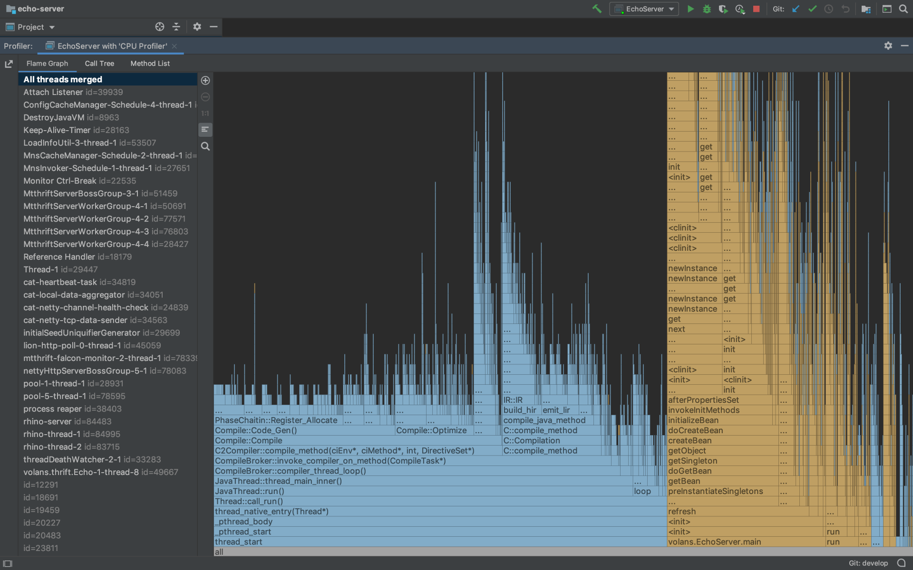
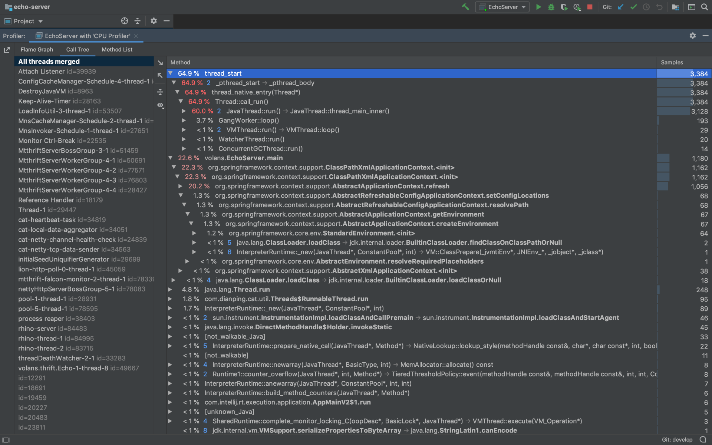
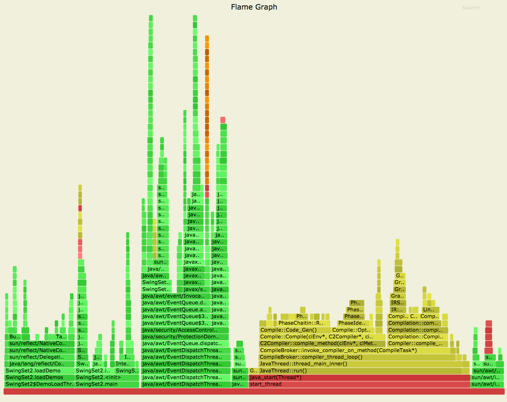

# JVM CPU Profiler技术原理及源码深度解析

研发人员在遇到线上报警或需要优化系统性能时，常常需要分析程序运行行为和性能瓶颈。Profiling技术是一种在应用运行时收集程序相关信息的动态分析手段，常用的JVM Profiler可以从多个方面对程序进行动态分析，如CPU、Memory、Thread、Classes、GC等，其中CPU Profiling的应用最为广泛。CPU Profiling经常被用于分析代码的执行热点，如“哪个方法占用CPU的执行时间最长”、“每个方法占用CPU的比例是多少”等等，通过CPU Profiling得到上述相关信息后，研发人员就可以轻松针对热点瓶颈进行分析和性能优化，进而突破性能瓶颈，大幅提升系统的吞吐量。

本文介绍了JVM平台上CPU Profiler的实现原理，希望能帮助读者在使用类似工具的同时也能清楚其内部的技术实现。

## CPU Profiler简介

社区实现的JVM Profiler很多，比如已经商用且功能强大的[JProfiler](https://www.ej-technologies.com/products/jprofiler/overview.html)，也有免费开源的产品，如[JVM-Profiler](https://github.com/uber-common/jvm-profiler)，功能各有所长。我们日常使用的Intellij IDEA最新版内部也集成了一个简单好用的Profiler，详细的介绍参见[官方Blog](https://blog.jetbrains.com/idea/2018/09/intellij-idea-2018-3-eap-git-submodules-jvm-profiler-macos-and-linux-and-more/)。

在用IDEA打开需要诊断的Java项目后，在“Preferences -> Build, Execution, Deployment -> Java Profiler”界面添加一个“CPU Profiler”，然后回到项目，单击右上角的“Run with Profiler”启动项目并开始CPU Profiling过程。一定时间后（推荐5min），在Profiler界面点击“Stop Profiling and Show Results”，即可看到Profiling的结果，包含火焰图和调用树，如下图所示：



Intellij IDEA - 性能火焰图



Intellij IDEA - 调用堆栈树

火焰图是根据调用栈的样本集生成的可视化性能分析图，《[如何读懂火焰图？](https://www.ruanyifeng.com/blog/2017/09/flame-graph.html)》一文对火焰图进行了不错的讲解，大家可以参考一下。简而言之，看火焰图时我们需要关注“平顶”，因为那里就是我们程序的CPU热点。调用树是另一种可视化分析的手段，与火焰图一样，也是根据同一份样本集而生成，按需选择即可。

这里要说明一下，因为我们没有在项目中引入任何依赖，仅仅是“Run with Profiler”，Profiler就能获取我们程序运行时的信息。这个功能其实是通过JVM Agent实现的，为了更好地帮助大家系统性的了解它，我们在这里先对JVM Agent做个简单的介绍。

## JVM Agent简介

JVM Agent是一个按一定规则编写的特殊程序库，可以在启动阶段通过命令行参数传递给JVM，作为一个伴生库与目标JVM运行在同一个进程中。在Agent中可以通过固定的接口获取JVM进程内的相关信息。Agent既可以是用C/C++/Rust编写的JVMTI Agent，也可以是用Java编写的Java Agent。

执行Java命令，我们可以看到Agent相关的命令行参数：

```
Plain Text
    -agentlib:<库名>[=<选项>]
                  加载本机代理库 <库名>, 例如 -agentlib:jdwp
                  另请参阅 -agentlib:jdwp=help
    -agentpath:<路径名>[=<选项>]
                  按完整路径名加载本机代理库
    -javaagent:<jar 路径>[=<选项>]
                  加载 Java 编程语言代理, 请参阅 java.lang.instrument
```

### JVMTI Agent

JVMTI（JVM Tool Interface）是JVM提供的一套标准的C/C++编程接口，是实现Debugger、Profiler、Monitor、Thread Analyser等工具的统一基础，在主流Java虚拟机中都有实现。

当我们要基于JVMTI实现一个Agent时，需要实现如下入口函数：

```
// $JAVA_HOME/include/jvmti.h
JNIEXPORT jint JNICALL Agent_OnLoad(JavaVM *vm, char *options, void *reserved);
```

使用C/C++实现该函数，并将代码编译为动态连接库（Linux上是.so），通过-agentpath参数将库的完整路径传递给Java进程，JVM就会在启动阶段的合适时机执行该函数。在函数内部，我们可以通过JavaVM指针参数拿到JNI和JVMTI的函数指针表，这样我们就拥有了与JVM进行各种复杂交互的能力。

更多JVMTI相关的细节可以参考[官方文档](https://docs.oracle.com/en/java/javase/12/docs/specs/jvmti.html)。

### Java Agent

在很多场景下，我们没有必要必须使用C/C++来开发JVMTI Agent，因为成本高且不易维护。JVM自身基于JVMTI封装了一套Java的Instrument API接口，允许使用Java语言开发Java Agent（只是一个jar包），大大降低了Agent的开发成本。社区开源的产品如[Greys](https://github.com/oldmanpushcart/greys-anatomy)、[Arthas](https://github.com/alibaba/arthas)、[JVM-Sandbox](https://github.com/alibaba/jvm-sandbox)、[JVM-Profiler](https://github.com/uber-common/jvm-profiler)等都是纯Java编写的，也是以Java Agent形式来运行。

在Java Agent中，我们需要在jar包的MANIFEST.MF中将Premain-Class指定为一个入口类，并在该入口类中实现如下方法：

```
public static void premain(String args, Instrumentation ins) {
    // implement
}
```

这样打包出来的jar就是一个Java Agent，可以通过-javaagent参数将jar传递给Java进程伴随启动，JVM同样会在启动阶段的合适时机执行该方法。

在该方法内部，参数Instrumentation接口提供了Retransform Classes的能力，我们利用该接口就可以对宿主进程的Class进行修改，实现方法耗时统计、故障注入、Trace等功能。Instrumentation接口提供的能力较为单一，仅与Class字节码操作相关，但由于我们现在已经处于宿主进程环境内，就可以利用JMX直接获取宿主进程的内存、线程、锁等信息。无论是Instrument API还是JMX，它们内部仍是统一基于JVMTI来实现。

更多Instrument API相关的细节可以参考[官方文档](https://docs.oracle.com/en/java/javase/12/docs/api/java.instrument/java/lang/instrument/package-summary.html)。

## CPU Profiler原理解析

在了解完Profiler如何以Agent的形式执行后，我们可以开始尝试构造一个简单的CPU Profiler。但在此之前，还有必要了解下CPU Profiling技术的两种实现方式及其区别。

### Sampling vs Instrumentation

使用过JProfiler的同学应该都知道，JProfiler的CPU Profiling功能提供了两种方式选项: Sampling和Instrumentation，它们也是实现CPU Profiler的两种手段。

Sampling方式顾名思义，基于对StackTrace的“采样”进行实现，核心原理如下：

1. 引入Profiler依赖，或直接利用Agent技术注入目标JVM进程并启动Profiler。
1. 启动一个采样定时器，以固定的采样频率每隔一段时间（毫秒级）对所有线程的调用栈进行Dump。
1. 汇总并统计每次调用栈的Dump结果，在一定时间内采到足够的样本后，导出统计结果，内容是每个方法被采样到的次数及方法的调用关系。

Instrumentation则是利用Instrument API，对所有必要的Class进行字节码增强，在进入每个方法前进行埋点，方法执行结束后统计本次方法执行耗时，最终进行汇总。二者都能得到想要的结果，那么它们有什么区别呢？或者说，孰优孰劣？

Instrumentation方式对几乎所有方法添加了额外的AOP逻辑，这会导致对线上服务造成巨额的性能影响，但其优势是：绝对精准的方法调用次数、调用时间统计。

Sampling方式基于无侵入的额外线程对所有线程的调用栈快照进行固定频率抽样，相对前者来说它的性能开销很低。但由于它基于“采样”的模式，以及JVM固有的只能在安全点（Safe Point）进行采样的“缺陷”，会导致统计结果存在一定的偏差。譬如说：某些方法执行时间极短，但执行频率很高，真实占用了大量的CPU Time，但Sampling Profiler的采样周期不能无限调小，这会导致性能开销骤增，所以会导致大量的样本调用栈中并不存在刚才提到的”高频小方法“，进而导致最终结果无法反映真实的CPU热点。更多Sampling相关的问题可以参考《[Why (Most) Sampling Java Profilers Are Fucking Terrible](https://psy-lob-saw.blogspot.com/2016/02/why-most-sampling-java-profilers-are.html)》。

具体到“孰优孰劣”的问题层面，这两种实现技术并没有非常明显的高下之判，只有在分场景讨论下才有意义。Sampling由于低开销的特性，更适合用在CPU密集型的应用中，以及不可接受大量性能开销的线上服务中。而Instrumentation则更适合用在I/O密集的应用中、对性能开销不敏感以及确实需要精确统计的场景中。社区的Profiler更多的是基于Sampling来实现，本文也是基于Sampling来进行讲解。

### 基于Java Agent + JMX实现

一个最简单的Sampling CPU Profiler可以用Java Agent + JMX方式来实现。以Java Agent为入口，进入目标JVM进程后开启一个ScheduledExecutorService，定时利用JMX的threadMXBean.dumpAllThreads()来导出所有线程的StackTrace，最终汇总并导出即可。

Uber的[JVM-Profiler](https://github.com/uber-common/jvm-profiler)实现原理也是如此，关键部分代码如下：

```java
// com/uber/profiling/profilers/StacktraceCollectorProfiler.java
/*
 * StacktraceCollectorProfiler等同于文中所述CpuProfiler，仅命名偏好不同而已
 * jvm-profiler的CpuProfiler指代的是CpuLoad指标的Profiler
 */
// 实现了Profiler接口，外部由统一的ScheduledExecutorService对所有Profiler定时执行
@Override
public void profile() {
    ThreadInfo[] threadInfos = threadMXBean.dumpAllThreads(false, false);
    // ...
    for (ThreadInfo threadInfo : threadInfos) {
        String threadName = threadInfo.getThreadName();
        // ...
        StackTraceElement[] stackTraceElements = threadInfo.getStackTrace();
        // ...
        for (int i = stackTraceElements.length - 1; i >= 0; i--) {
            StackTraceElement stackTraceElement = stackTraceElements[i];
            // ...
        }
        // ...
    }
}
```

Uber提供的定时器默认Interval是100ms，对于CPU Profiler来说，这略显粗糙。但由于dumpAllThreads()的执行开销不容小觑，Interval不宜设置的过小，所以该方法的CPU Profiling结果会存在不小的误差。

JVM-Profiler的优点在于支持多种指标的Profiling（StackTrace、CPUBusy、Memory、I/O、Method），且支持将Profiling结果通过Kafka上报回中心Server进行分析，也即支持集群诊断。

### 基于JVMTI + GetStackTrace实现

使用Java实现Profiler相对较简单，但也存在一些问题，譬如说Java Agent代码与业务代码共享AppClassLoader，被JVM直接加载的agent.jar如果引入了第三方依赖，可能会对业务Class造成污染。截止发稿时，JVM-Profiler都存在这个问题，它引入了Kafka-Client、http-Client、Jackson等组件，如果与业务代码中的组件版本发生冲突，可能会引发未知错误。[Greys](https://github.com/oldmanpushcart/greys-anatomy)/[Arthas](https://github.com/alibaba/arthas)/[JVM-Sandbox](https://github.com/alibaba/jvm-sandbox)的解决方式是分离入口与核心代码，使用定制的ClassLoader加载核心代码，避免影响业务代码。

在更底层的C/C++层面，我们可以直接对接JVMTI接口，使用原生C API对JVM进行操作，功能更丰富更强大，但开发效率偏低。基于上节同样的原理开发CPU Profiler，使用JVMTI需要进行如下这些步骤：

1.编写Agent_OnLoad()，在入口通过JNI的JavaVM\*指针的GetEnv()函数拿到JVMTI的jvmtiEnv指针：

```c
// agent.c
JNIEXPORT jint JNICALL Agent_OnLoad(JavaVM *vm, char *options, void *reserved) {
    jvmtiEnv *jvmti;
    (*vm)->GetEnv((void **)&jvmti, JVMTI_VERSION_1_0);
    // ...
    return JNI_OK;
}
```

2.开启一个线程定时循环，定时使用jvmtiEnv指针配合调用如下几个JVMTI函数：

```java
// 获取所有线程的jthread
jvmtiError GetAllThreads(jvmtiEnv *env, jint *threads_count_ptr, jthread **threads_ptr);
// 根据jthread获取该线程信息（name、daemon、priority...）
jvmtiError GetThreadInfo(jvmtiEnv *env, jthread thread, jvmtiThreadInfo* info_ptr);
// 根据jthread获取该线程调用栈
jvmtiError GetStackTrace(jvmtiEnv *env,
                         jthread thread,
                         jint start_depth,
                         jint max_frame_count,
                         jvmtiFrameInfo *frame_buffer,
                         jint *count_ptr);
```

主逻辑大致是：首先调用GetAllThreads()获取所有线程的“句柄”jthread，然后遍历根据jthread调用GetThreadInfo()获取线程信息，按线程名过滤掉不需要的线程后，继续遍历根据jthread调用GetStackTrace()获取线程的调用栈。

3.在Buffer中保存每一次的采样结果，最终生成必要的统计数据即可。

按如上步骤即可实现基于JVMTI的CPU Profiler。但需要说明的是，即便是基于原生JVMTI接口使用GetStackTrace()的方式获取调用栈，也存在与JMX相同的问题——只能在安全点（Safe Point）进行采样。

### SafePoint Bias问题

基于Sampling的CPU Profiler通过采集程序在不同时间点的调用栈样本来近似地推算出热点方法，因此，从理论上来讲Sampling CPU Profiler必须遵循以下两个原则：

1. 样本必须足够多。
1. 程序中所有正在运行的代码点都必须以相同的概率被Profiler采样。

如果只能在安全点采样，就违背了第二条原则。因为我们只能采集到位于安全点时刻的调用栈快照，意味着某些代码可能永远没有机会被采样，即使它真实耗费了大量的CPU执行时间，这种现象被称为“SafePoint Bias”。

上文我们提到，基于JMX与基于JVMTI的Profiler实现都存在SafePoint Bias，但一个值得了解的细节是：单独来说，JVMTI的GetStackTrace()函数并不需要在Caller的安全点执行，但当调用GetStackTrace()获取其他线程的调用栈时，必须等待，直到目标线程进入安全点；而且，GetStackTrace()仅能通过单独的线程同步定时调用，不能在UNIX信号处理器的Handler中被异步调用。综合来说，GetStackTrace()存在与JMX一样的SafePoint Bias。更多安全点相关的知识可以参考《Safepoints: Meaning, Side Effects and Overheads》。

那么，如何避免SafePoint Bias？社区提供了一种Hack思路——AsyncGetCallTrace。

### 基于JVMTI + AsyncGetCallTrace实现

如上节所述，假如我们拥有一个函数可以获取当前线程的调用栈且不受安全点干扰，另外它还支持在UNIX信号处理器中被异步调用，那么我们只需注册一个UNIX信号处理器，在Handler中调用该函数获取当前线程的调用栈即可。由于UNIX信号会被发送给进程的随机一线程进行处理，因此最终信号会均匀分布在所有线程上，也就均匀获取了所有线程的调用栈样本。

OracleJDK/OpenJDK内部提供了这么一个函数——AsyncGetCallTrace，它的原型如下：

```
// 栈帧
typedef struct {
 jint lineno;
 jmethodID method_id;
} AGCT_CallFrame;
// 调用栈
typedef struct {
    JNIEnv *env;
    jint num_frames;
    AGCT_CallFrame *frames;
} AGCT_CallTrace;
// 根据ucontext将调用栈填充进trace指针
void AsyncGetCallTrace(AGCT_CallTrace *trace, jint depth, void *ucontext);
```

通过原型可以看到，该函数的使用方式非常简洁，直接通过ucontext就能获取到完整的Java调用栈。

顾名思义，AsyncGetCallTrace是“async”的，不受安全点影响，这样的话采样就可能发生在任何时间，包括Native代码执行期间、GC期间等，在这时我们是无法获取Java调用栈的，AGCT_CallTrace的num_frames字段正常情况下标识了获取到的调用栈深度，但在如前所述的异常情况下它就表示为负数，最常见的-2代表此刻正在GC。

由于AsyncGetCallTrace非标准JVMTI函数，因此我们无法在jvmti.h中找到该函数声明，且由于其目标文件也早已链接进JVM二进制文件中，所以无法通过简单的声明来获取该函数的地址，这需要通过一些Trick方式来解决。简单说，Agent最终是作为动态链接库加载到目标JVM进程的地址空间中，因此可以在Agent_OnLoad内通过glibc提供的dlsym()函数拿到当前地址空间（即目标JVM进程地址空间）名为“AsyncGetCallTrace”的符号地址。这样就拿到了该函数的指针，按照上述原型进行类型转换后，就可以正常调用了。

通过AsyncGetCallTrace实现CPU Profiler的大致流程：

1.编写Agent_OnLoad()，在入口拿到jvmtiEnv和AsyncGetCallTrace指针，获取AsyncGetCallTrace方式如下:

```
typedef void (*AsyncGetCallTrace)(AGCT_CallTrace *traces, jint depth, void *ucontext);
// ...
AsyncGetCallTrace agct_ptr = (AsyncGetCallTrace)dlsym(RTLD_DEFAULT, "AsyncGetCallTrace");
if (agct_ptr == NULL) {
    void *libjvm = dlopen("libjvm.so", RTLD_NOW);
    if (!libjvm) {
        // 处理dlerror()...
    }
    agct_ptr = (AsyncGetCallTrace)dlsym(libjvm, "AsyncGetCallTrace");
}
```

2.在OnLoad阶段，我们还需要做一件事，即注册OnClassLoad和OnClassPrepare这两个Hook，原因是jmethodID是延迟分配的，使用AGCT获取Traces依赖预先分配好的数据。我们在OnClassPrepare的CallBack中尝试获取该Class的所有Methods，这样就使JVMTI提前分配了所有方法的jmethodID，如下所示：

```
void JNICALL OnClassLoad(jvmtiEnv *jvmti, JNIEnv* jni, jthread thread, jclass klass) {}
void JNICALL OnClassPrepare(jvmtiEnv *jvmti, JNIEnv *jni, jthread thread, jclass klass) {
    jint method_count;
    jmethodID *methods;
    jvmti->GetClassMethods(klass, &method_count, &methods);
    delete [] methods;
}
// ...
jvmtiEventCallbacks callbacks = {0};
callbacks.ClassLoad = OnClassLoad;
callbacks.ClassPrepare = OnClassPrepare;
jvmti->SetEventCallbacks(&callbacks, sizeof(callbacks));
jvmti->SetEventNotificationMode(JVMTI_ENABLE, JVMTI_EVENT_CLASS_LOAD, NULL);
jvmti->SetEventNotificationMode(JVMTI_ENABLE, JVMTI_EVENT_CLASS_PREPARE, NULL);
```

3.利用SIGPROF信号来进行定时采样：

```
// 这里信号handler传进来的的ucontext即AsyncGetCallTrace需要的ucontext
void signal_handler(int signo, siginfo_t *siginfo, void *ucontext) {
    // 使用AsyncCallTrace进行采样，注意处理num_frames为负的异常情况
}
// ...
// 注册SIGPROF信号的handler
struct sigaction sa;
sigemptyset(&sa.sa_mask);
sa.sa_sigaction = signal_handler;
sa.sa_flags = SA_RESTART | SA_SIGINFO;
sigaction(SIGPROF, &sa, NULL);
// 定时产生SIGPROF信号
// interval是nanoseconds表示的采样间隔，AsyncGetCallTrace相对于同步采样来说可以适当高频一些
long sec = interval / 1000000000;
long usec = (interval % 1000000000) / 1000;
struct itimerval tv = {{sec, usec}, {sec, usec}};
setitimer(ITIMER_PROF, &tv, NULL);
```

4.在Buffer中保存每一次的采样结果，最终生成必要的统计数据即可。

按如上步骤即可实现基于AsyncGetCallTrace的CPU Profiler，这是社区中目前性能开销最低、相对效率最高的CPU Profiler实现方式，在Linux环境下结合perf_events还能做到同时采样Java栈与Native栈，也就能同时分析Native代码中存在的性能热点。该方式的典型开源实现有[Async-Profiler](https://github.com/jvm-profiling-tools/async-profiler)和[Honest-Profiler](https://github.com/jvm-profiling-tools/honest-profiler)，Async-Profiler实现质量较高，感兴趣的话建议大家阅读参考文章。有趣的是，IntelliJ IDEA内置的Java Profiler，其实就是Async-Profiler的包装。更多关于AsyncGetCallTrace的内容，大家可以参考《[The Pros and Cons of AsyncGetCallTrace Profilers](https://psy-lob-saw.blogspot.com/2016/06/the-pros-and-cons-of-agct.html)》。

### 生成性能火焰图

现在我们拥有了采样调用栈的能力，但是调用栈样本集是以二维数组的数据结构形式存在于内存中的，如何将其转换为可视化的火焰图呢？

火焰图通常是一个svg文件，部分优秀项目可以根据文本文件自动生成火焰图文件，仅对文本文件的格式有一定要求。FlameGraph项目的核心只是一个Perl脚本，可以根据我们提供的调用栈文本生成相应的火焰图svg文件。调用栈的文本格式相当简单，如下所示：

```
base_func;func1;func2;func3 10
base_func;funca;funcb 15
```

将我们采样到的调用栈样本集进行整合后，需输出如上所示的文本格式。每一行代表一“类“调用栈，空格左边是调用栈的方法名排列，以分号分割，左栈底右栈顶，空格右边是该样本出现的次数。

将样本文件交给flamegraph.pl脚本执行，就能输出相应的火焰图了：

```
flamegraph.pl stacktraces.txt > stacktraces.svg
```

效果如下图所示：



通过flamegraph.pl生成的火焰图

## HotSpot的Dynamic Attach机制解析

到目前为止，我们已经了解了CPU Profiler完整的工作原理，然而使用过JProfiler/Arthas的同学可能会有疑问，很多情况下可以直接对线上运行中的服务进行Profling，并不需要在Java进程的启动参数添加Agent参数，这是通过什么手段做到的？答案是Dynamic Attach。

JDK在1.6以后提供了Attach API，允许向运行中的JVM进程添加Agent，这项手段被广泛使用在各种Profiler和字节码增强工具中，其官方简介如下：

> This is a Sun extension that allows a tool to ‘attach’ to another process running Java code and launch a JVM TI agent or a java.lang.instrument agent in that process.

总的来说，Dynamic Attach是HotSpot提供的一种特殊能力，它允许一个进程向另一个运行中的JVM进程发送一些命令并执行，命令并不限于加载Agent，还包括Dump内存、Dump线程等等。

### 通过sun.tools进行Attach

Attach虽然是HotSpot提供的能力，但JDK在Java层面也对其做了封装。

前文已经提到，对于Java Agent来说，PreMain方法在Agent作为启动参数运行的时候执行，其实我们还可以额外实现一个AgentMain方法，并在MANIFEST.MF中将Agent-Class指定为该Class：

```
public static void agentmain(String args, Instrumentation ins) {
    // implement
}
```

这样打包出来的jar，既可以作为-javaagent参数启动，也可以被Attach到运行中的目标JVM进程。JDK已经封装了简单的API让我们直接Attach一个Java Agent，下面以Arthas中的代码进行演示：

```
// com/taobao/arthas/core/Arthas.java
import com.sun.tools.attach.VirtualMachine;
import com.sun.tools.attach.VirtualMachineDescriptor;
// ...
private void attachAgent(Configure configure) throws Exception {
    VirtualMachineDescriptor virtualMachineDescriptor = null;
  
    // 拿到所有JVM进程，找出目标进程
    for (VirtualMachineDescriptor descriptor : VirtualMachine.list()) {
        String pid = descriptor.id();
        if (pid.equals(Integer.toString(configure.getJavaPid()))) {
            virtualMachineDescriptor = descriptor;
        }
    }
    VirtualMachine virtualMachine = null;
    try {
        // 针对某个JVM进程调用VirtualMachine.attach()方法，拿到VirtualMachine实例
        if (null == virtualMachineDescriptor) {
            virtualMachine = VirtualMachine.attach("" + configure.getJavaPid());
        } else {
            virtualMachine = VirtualMachine.attach(virtualMachineDescriptor);
        }
        // ...
        // 调用VirtualMachine#loadAgent()，将arthasAgentPath指定的jar attach到目标JVM进程中
        // 第二个参数为attach参数，即agentmain的首个String参数args
        virtualMachine.loadAgent(arthasAgentPath, configure.getArthasCore() + ";" + configure.toString());
    } finally {
        if (null != virtualMachine) {
            // 调用VirtualMachine#detach()释放
            virtualMachine.detach();
        }
    }
}
```

### 直接对HotSpot进行Attach

sun.tools封装的API足够简单易用，但只能使用Java编写，也只能用在Java Agent上，因此有些时候我们必须手工对JVM进程直接进行Attach。对于JVMTI，除了Agent_OnLoad()之外，我们还需实现一个Agent_OnAttach()函数，当将JVMTI Agent Attach到目标进程时，从该函数开始执行：

```
// $JAVA_HOME/include/jvmti.h
JNIEXPORT jint JNICALL Agent_OnAttach(JavaVM *vm, char *options, void *reserved);
```

下面我们以Async-Profiler中的jattach源码为线索，探究一下如何利用Attach机制给运行中的JVM进程发送命令。jattach是Async-Profiler提供的一个Driver，使用方式比较直观：

```
Usage:
    jattach <pid> <cmd> [args ...]
Args:
    <pid>  目标JVM进程的进程ID
    <cmd>  要执行的命令
    <args> 命令参数
```

使用方式如：

```
jattach 1234 load /absolute/path/to/agent/libagent.so true
```

执行上述命令，libagent.so就被加载到ID为1234的JVM进程中并开始执行Agent_OnAttach函数了。有一点需要注意，执行Attach的进程euid及egid，与被Attach的目标JVM进程必须相同。接下来开始分析jattach源码。

如下所示的Main函数描述了一次Attach的整体流程：

```
// async-profiler/src/jattach/jattach.c
int main(int argc, char** argv) {
    // 解析命令行参数
    // 检查euid与egid
    // ...
    if (!check_socket(nspid) && !start_attach_mechanism(pid, nspid)) {
        perror("Could not start attach mechanism");
        return 1;
    }
    int fd = connect_socket(nspid);
    if (fd == -1) {
        perror("Could not connect to socket");
        return 1;
    }
    printf("Connected to remote JVM\n");
    if (!write_command(fd, argc - 2, argv + 2)) {
        perror("Error writing to socket");
        close(fd);
        return 1;
    }
    printf("Response code = ");
    fflush(stdout);
    int result = read_response(fd);
    close(fd);
    return result;
}
```

忽略掉命令行参数解析与检查euid和egid的过程。jattach首先调用了check_socket函数进行了“socket检查？”，check_socket源码如下：

```
// async-profiler/src/jattach/jattach.c
// Check if remote JVM has already opened socket for Dynamic Attach
static int check_socket(int pid) {
    char path[MAX_PATH];
    snprintf(path, MAX_PATH, "%s/.java_pid%d", get_temp_directory(), pid); // get_temp_directory()在Linux下固定返回"/tmp"
    struct stat stats;
    return stat(path, &stats) == 0 && S_ISSOCK(stats.st_mode);
}
```

我们知道，UNIX操作系统提供了一种基于文件的Socket接口，称为“UNIX Socket”（一种常用的进程间通信方式）。在该函数中使用S_ISSOCK宏来判断该文件是否被绑定到了UNIX Socket，如此看来，“/tmp/.java_pid”文件很有可能就是外部进程与JVM进程间通信的桥梁。

查阅官方文档，得到如下描述：

> The attach listener thread then communicates with the source JVM in an OS dependent manner: - On Solaris, the Doors IPC mechanism is used. The door is attached to a file in the file system so that clients can access it. - On Linux, a Unix domain socket is used. This socket is bound to a file in the filesystem so that clients can access it. - On Windows, the created thread is given the name of a pipe which is served by the client. The result of the operations are written to this pipe by the target JVM.

证明了我们的猜想是正确的。目前为止check_socket函数的作用很容易理解了：判断外部进程与目标JVM进程之间是否已经建立了UNIX Socket连接。

回到Main函数，在使用check_socket确定连接尚未建立后，紧接着调用start_attach_mechanism函数，函数名很直观地描述了它的作用，源码如下：

```
// async-profiler/src/jattach/jattach.c
// Force remote JVM to start Attach listener.
// HotSpot will start Attach listener in response to SIGQUIT if it sees .attach_pid file
static int start_attach_mechanism(int pid, int nspid) {
    char path[MAX_PATH];
    snprintf(path, MAX_PATH, "/proc/%d/cwd/.attach_pid%d", nspid, nspid);
    int fd = creat(path, 0660);
    if (fd == -1 || (close(fd) == 0 && !check_file_owner(path))) {
        // Failed to create attach trigger in current directory. Retry in /tmp
        snprintf(path, MAX_PATH, "%s/.attach_pid%d", get_temp_directory(), nspid);
        fd = creat(path, 0660);
        if (fd == -1) {
            return 0;
        }
        close(fd);
    }
    // We have to still use the host namespace pid here for the kill() call
    kill(pid, SIGQUIT);
    // Start with 20 ms sleep and increment delay each iteration
    struct timespec ts = {0, 20000000};
    int result;
    do {
        nanosleep(&ts, NULL);
        result = check_socket(nspid);
    } while (!result && (ts.tv_nsec += 20000000) < 300000000);
    unlink(path);
    return result;
}
```

start_attach_mechanism函数首先创建了一个名为“/tmp/.attach_pid”的空文件，然后向目标JVM进程发送了一个SIGQUIT信号，这个信号似乎触发了JVM的某种机制？紧接着，start_attach_mechanism函数开始陷入了一种等待，每20ms调用一次check_socket函数检查连接是否被建立，如果等了300ms还没有成功就放弃。函数的最后调用Unlink删掉.attach_pid文件并返回。

如此看来，HotSpot似乎提供了一种特殊的机制，只要给它发送一个SIGQUIT信号，并预先准备好.attach_pid文件，HotSpot会主动创建一个地址为“/tmp/.java_pid”的UNIX Socket，接下来主动Connect这个地址即可建立连接执行命令。

查阅文档，得到如下描述：

> Dynamic attach has an attach listener thread in the target JVM. This is a thread that is started when the first attach request occurs. On Linux and Solaris, the client creates a file named .attach_pid(pid) and sends a SIGQUIT to the target JVM process. The existence of this file causes the SIGQUIT handler in HotSpot to start the attach listener thread. On Windows, the client uses the Win32 CreateRemoteThread function to create a new thread in the target process.

这样一来就很明确了，在Linux上我们只需创建一个“/tmp/.attach_pid”文件，并向目标JVM进程发送一个SIGQUIT信号，HotSpot就会开始监听“/tmp/.java_pid”地址上的UNIX Socket，接收并执行相关Attach的命令。至于为什么一定要创建.attach_pid文件才可以触发Attach Listener的创建，经查阅资料，我们得到了两种说法：一是JVM不止接收从外部Attach进程发送的SIGQUIT信号，必须配合外部进程创建的外部文件才能确定这是一次Attach请求；二是为了安全。

继续看jattach的源码，果不其然，它调用了connect_socket函数对“/tmp/.java_pid”进行连接，connect_socket源码如下：

```
// async-profiler/src/jattach/jattach.c
// Connect to UNIX domain socket created by JVM for Dynamic Attach
static int connect_socket(int pid) {
    int fd = socket(PF_UNIX, SOCK_STREAM, 0);
    if (fd == -1) {
        return -1;
    }
    struct sockaddr_un addr;
    addr.sun_family = AF_UNIX;
    snprintf(addr.sun_path, sizeof(addr.sun_path), "%s/.java_pid%d", get_temp_directory(), pid);
    if (connect(fd, (struct sockaddr*)&addr, sizeof(addr)) == -1) {
        close(fd);
        return -1;
    }
    return fd;
}
```

一个很普通的Socket创建函数，返回Socket文件描述符。

回到Main函数，主流程紧接着调用write_command函数向该Socket写入了从命令行传进来的参数，并且调用read_response函数接收从目标JVM进程返回的数据。两个很常见的Socket读写函数，源码如下：

```
// async-profiler/src/jattach/jattach.c
// Send command with arguments to socket
static int write_command(int fd, int argc, char** argv) {
    // Protocol version
    if (write(fd, "1", 2) <= 0) {
        return 0;
    }
    int i;
    for (i = 0; i < 4; i++) {
        const char* arg = i < argc ? argv[i] : "";
        if (write(fd, arg, strlen(arg) + 1) <= 0) {
            return 0;
        }
    }
    return 1;
}
// Mirror response from remote JVM to stdout
static int read_response(int fd) {
    char buf[8192];
    ssize_t bytes = read(fd, buf, sizeof(buf) - 1);
    if (bytes <= 0) {
        perror("Error reading response");
        return 1;
    }
    // First line of response is the command result code
    buf[bytes] = 0;
    int result = atoi(buf);
    do {
        fwrite(buf, 1, bytes, stdout);
        bytes = read(fd, buf, sizeof(buf));
    } while (bytes > 0);
    return result;
}
```

浏览write_command函数就可知外部进程与目标JVM进程之间发送的数据格式相当简单，基本如下所示：

```
<PROTOCOL VERSION>\0<COMMAND>\0<ARG1>\0<ARG2>\0<ARG3>\0
```

以先前我们使用的Load命令为例，发送给HotSpot时格式如下：

```
1\0load\0/absolute/path/to/agent/libagent.so\0true\0\0
```

至此，我们已经了解了如何手工对JVM进程直接进行Attach。

### Attach补充介绍

Load命令仅仅是HotSpot所支持的诸多命令中的一种，用于动态加载基于JVMTI的Agent，完整的命令表如下所示：

```
static AttachOperationFunctionInfo funcs[] = {
  { "agentProperties",  get_agent_properties },
  { "datadump",         data_dump },
  { "dumpheap",         dump_heap },
  { "load",             JvmtiExport::load_agent_library },
  { "properties",       get_system_properties },
  { "threaddump",       thread_dump },
  { "inspectheap",      heap_inspection },
  { "setflag",          set_flag },
  { "printflag",        print_flag },
  { "jcmd",             jcmd },
  { NULL,               NULL }
};
```

读者可以尝试下threaddump命令，然后对相同的进程进行jstack，对比观察输出，其实是完全相同的，其它命令大家可以自行进行探索。

## 总结

总的来说，善用各类Profiler是提升性能优化效率的一把利器，了解Profiler本身的实现原理更能帮助我们避免对工具的各种误用。CPU Profiler所依赖的Attach、JVMTI、Instrumentation、JMX等皆是JVM平台比较通用的技术，在此基础上，我们去实现Memory Profiler、Thread Profiler、GC Analyzer等工具也没有想象中那么神秘和复杂了。

## 参考资料

- [JVM Tool Interface](https://docs.oracle.com/en/java/javase/12/docs/specs/jvmti.html)
- [The Pros and Cons of AsyncGetCallTrace Profilers](https://psy-lob-saw.blogspot.com/2016/06/the-pros-and-cons-of-agct.html)
- [Why (Most) Sampling Java Profilers Are Fucking Terrible](https://psy-lob-saw.blogspot.com/2016/02/why-most-sampling-java-profilers-are.html)
- [Safepoints: Meaning, Side Effects and Overheads](https://psy-lob-saw.blogspot.com/2015/12/safepoints.html)
- [Serviceability in HotSpot](https://openjdk.java.net/groups/hotspot/docs/Serviceability.html)
- [如何读懂火焰图？](https://www.ruanyifeng.com/blog/2017/09/flame-graph.html)
- [IntelliJ IDEA 2018.3 EAP: Git Submodules, JVM Profiler (macOS and Linux) and more](https://blog.jetbrains.com/idea/2018/09/intellij-idea-2018-3-eap-git-submodules-jvm-profiler-macos-and-linux-and-more/)
