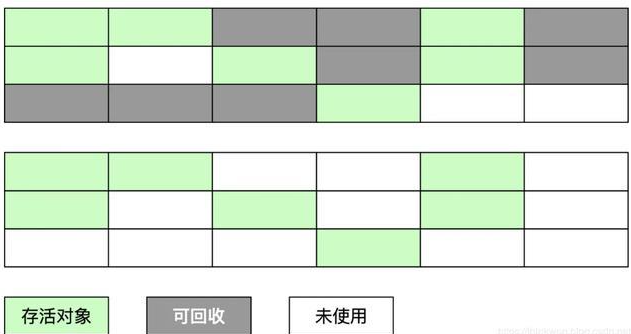
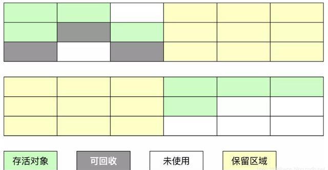
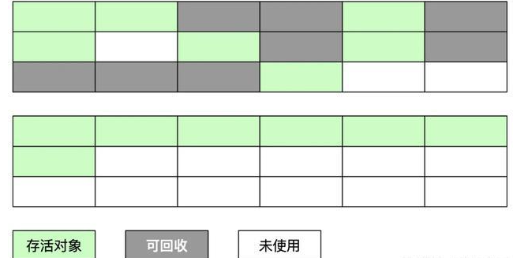
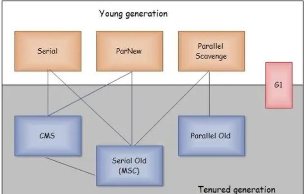

# JVM 垃圾收集器

**1.简述 Java 垃圾回收机制 **在 java 中，程序员是不需要显示的去释放一个对象的内存的，而是由虚拟机自行执行。在 JVM 中，有一个垃圾回收线程，它是低优先级的，在正常情况下是不会执行的，只有在虚拟机空闲或者当前堆内存不足时，才会触发执行，扫面那些没有被任何引用的对象，并将它们添加到要回收的集合中，进行回收。** 2. GC 是什么？为什么要 GC **GC 是垃圾收集的意思（Gabage Collection）,内存处理是编程人员容易出现问题的地方，忘记或者错误的内存 回收会导致程序或系统的不稳定甚至崩溃，Java 提供的 GC 功能可以自动监测对象是否超过作用域从而达到自动 回收内存的目的，Java 语言没有提供释放已分配内存的显示操作方法。** 3. 垃圾回收的优点和原理。并考虑 2 种回收机制 **Java 语言最显著的特点就是引入了垃圾回收机制，它使 java 程序员在编写程序时不再考虑内存管理的问题。 由于有这个垃圾回收机制，java 中的对象不再有“作用域”的概念，只有引用的对象才有“作用域”。 垃圾回收机制有效的防止了内存泄露，可以有效的使用可使用的内存。 垃圾回收器通常作为一个单独的低级别的线程运行，在不可预知的情况下对内存堆中已经死亡的或很长时间没有用过的对象进行清除和回收。 程序员不能实时的对某个对象或所有对象调用垃圾回收器进行垃圾回收。 垃圾回收有分代复制垃圾回收、标记垃圾回收、增量垃圾回收。** 4. 垃圾回收器的基本原理是什么？垃圾回收器可以马上回收内存吗？有什么办法主动通知虚拟机进行垃圾回收？ **对于 GC 来说，当程序员创建对象时，GC 就开始监控这个对象的地址、大小以及使用情况。 通常，GC 采用有向图的方式记录和管理堆(heap)中的所有对象。通过这种方式确定哪些对象是"可达的"，哪些对象是"不可达的"。当 GC 确定一些对象为"不可达"时，GC 就有责任回收这些内存空间。 可以。程序员可以手动执行 System.gc()，通知 GC 运行，但是 Java 语言规范并不保证 GC 一定会执行。** 5. Java 中都有哪些引用类型？ **强引用：发生 gc 的时候不会被回收。 软引用：有用但不是必须的对象，在发生内存溢出之前会被回收。 弱引用：有用但不是必须的对象，在下一次 GC 时会被回收。 虚引用（幽灵引用/幻影引用）：无法通过虚引用获得对象，用 PhantomReference 实现虚引用，虚引用的用途是在 gc 时返回一个通知。** 6. 怎么判断对象是否可以被回收？**垃圾收集器在做垃圾回收的时候，首先需要判定的就是哪些内存是需要被回收的，哪些对象是「存活」的，是不可以被回收的；哪些对象已经「死掉」了，需要被回收。

一般有两种方法来判断： 引用计数器法：为每个对象创建一个引用计数，有对象引用时计数器 +1，引用被释放时计数 -1，当计数器为 0 时就可以被回收。它有一个缺点不能解决循环引用的问题； 可达性分析算法：从 GC Roots 开始向下搜索，搜索所走过的路径称为引用链。当一个对象到 GC Roots 没有任何引用链相连时，则证明此对象是可以被回收的。**7. 在 Java 中，对象什么时候可以被垃圾回收?**当对象对当前使用这个对象的应用程序变得不可触及的时候，这个对象就可以被回收了。 垃圾回收不会发生在永久代，如果永久代满了或者是超过了临界值，会触发完全垃圾回收(Full GC)。如果你仔细查看垃圾收集器的输出信息，就会发现永久代也是被回收的。这就是为什么正确的永久代大小对避免 Full GC 是非常重要的原因。** 8. JVM 中的永久代中会发生垃圾回收吗?**垃圾回收不会发生在永久代，如果永久代满了或者是超过了临界值，会触发完全垃圾回收(Full GC)。如果你仔细查看垃圾收集器的输出信息，就会发现永久代也是被回收的。这就是为什么正确的永久代大小对避免 Full GC 是非常重要的原因。请参考下 Java8：从永久代到元数据区 (译者注：Java8 中已经移除了永久代，新加了一个叫做元数据区的 native 内存区)** 9. 说一下 JVM 有哪些垃圾回收算法？ **标记-清除算法：标记无用对象，然后进行清除回收。缺点：效率不高，无法清除垃圾碎片。 复制算法：按照容量划分二个大小相等的内存区域，当一块用完的时候将活着的对象复制到另一块上，然后再把已使用的内存空间一次清理掉。缺点：内存使用率不高，只有原来的一半。 标记-整理算法：标记无用对象，让所有存活的对象都向一端移动，然后直接清除掉端边界以外的内存。 分代算法：根据对象存活周期的不同将内存划分为几块，一般是新生代和老年代，新生代基本采用复制算法，老年代采用标记整理算法。** 标记-清除算法**标记无用对象，然后进行清除回收。 标记-清除算法（Mark-Sweep）是一种常见的基础垃圾收集算法，它将垃圾收集分为两个阶段： 标记阶段：标记出可以回收的对象。 清除阶段：回收被标记的对象所占用的空间。 标记-清除算法之所以是基础的，是因为后面讲到的垃圾收集算法都是在此算法的基础上进行改进的。 优点：实现简单，不需要对象进行移动。 缺点：标记、清除过程效率低，产生大量不连续的内存碎片，提高了垃圾回收的频率。 标记-清除算法的执行的过程如下图所示

为了解决标记-清除算法的效率不高的问题，产生了复制算法。它把内存空间划为两个相等的区域，每次只使用其中一个区域。垃圾收集时，遍历当前使用的区域，把存活对象复制到另外一个区域中，最后将当前使用的区域的可回收的对象进行回收。 优点：按顺序分配内存即可，实现简单、运行高效，不用考虑内存碎片。 缺点：可用的内存大小缩小为原来的一半，对象存活率高时会频繁进行复制。

复制算法的执行过程如下图所示

**标记-整理算法**在新生代中可以使用复制算法，但是在老年代就不能选择复制算法了，因为老年代的对象存活率会较高，这样会有较多的复制操作，导致效率变低。标记-清除算法可以应用在老年代中，但是它效率不高，在内存回收后容易产生大量内存碎片。因此就出现了一种标记-整理算法（Mark-Compact）算法，与标记-整理算法不同的是，在标记可回收的对象后将所有存活的对象压缩到内存的一端，使他们紧凑的排列在一起，然后对端边界以外的内存进行回收。回收后，已用和未用的内存都各自一边。 优点：解决了标记-清理算法存在的内存碎片问题。 缺点：仍需要进行局部对象移动，一定程度上降低了效率。 标记-整理算法的执行过程如下图所示

**分代收集算法**当前商业虚拟机都采用分代收集的垃圾收集算法。分代收集算法，顾名思义是根据对象的存活周期将内存划分为几块。一般包括年轻代、老年代 和 永久代，如图所示：

**10. 说一下 JVM 有哪些垃圾回收器？**如果说垃圾收集算法是内存回收的方法论，那么垃圾收集器就是内存回收的具体实现。下图展示了 7 种作用于不同分代的收集器，其中用于回收新生代的收集器包括 Serial、PraNew、Parallel Scavenge，回收老年代的收集器包括 Serial Old、Parallel Old、CMS，还有用于回收整个 Java 堆的 G1 收集器。不同收集器之间的连线表示它们可以搭配使用。

Serial 收集器（复制算法): 新生代单线程收集器，标记和清理都是单线程，优点是简单高效； ParNew 收集器 (复制算法): 新生代收并行集器，实际上是 Serial 收集器的多线程版本，在多核 CPU 环境下有着比 Serial 更好的表现； Parallel Scavenge 收集器 (复制算法): 新生代并行收集器，追求高吞吐量，高效利用 CPU。吞吐量 = 用户线程时间/(用户线程时间+GC 线程时间)，高吞吐量可以高效率的利用 CPU 时间，尽快完成程序的运算任务，适合后台应用等对交互相应要求不高的场景； Serial Old 收集器 (标记-整理算法): 老年代单线程收集器，Serial 收集器的老年代版本； Parallel Old 收集器 (标记-整理算法)： 老年代并行收集器，吞吐量优先，Parallel Scavenge 收集器的老年代版本； CMS(Concurrent Mark Sweep)收集器（标记-清除算法）： 老年代并行收集器，以获取最短回收停顿时间为目标的收集器，具有高并发、低停顿的特点，追求最短 GC 回收停顿时间。 G1(Garbage First)收集器 (标记-整理算法)： Java 堆并行收集器，G1 收集器是 JDK1.7 提供的一个新收集器，G1 收集器基于“标记-整理”算法实现，也就是说不会产生内存碎片。此外，G1 收集器不同于之前的收集器的一个重要特点是：G1 回收的范围是整个 Java 堆(包括新生代，老年代)，而前六种收集器回收的范围仅限于新生代或老年代。**11. 详细介绍一下 CMS 垃圾回收器？ **CMS 是英文 Concurrent Mark-Sweep 的简称，是以牺牲吞吐量为代价来获得最短回收停顿时间的垃圾回收器。对于要求服务器响应速度的应用上，这种垃圾回收器非常适合。在启动 JVM 的参数加上“-XX:+UseConcMarkSweepGC”来指定使用 CMS 垃圾回收器。 CMS 使用的是标记-清除的算法实现的，所以在 gc 的时候回产生大量的内存碎片，当剩余内存不能满足程序运行要求时，系统将会出现 Concurrent Mode Failure，临时 CMS 会采用 Serial Old 回收器进行垃圾清除，此时的性能将会被降低。** 12. 新生代垃圾回收器和老年代垃圾回收器都有哪些？有什么区别？**新生代回收器：Serial、ParNew、Parallel Scavenge 老年代回收器：Serial Old、Parallel Old、CMS 整堆回收器：G1

新生代垃圾回收器一般采用的是复制算法，复制算法的优点是效率高，缺点是内存利用率低；老年代回收器一般采用的是标记-整理的算法进行垃圾回收。**13. 简述分代垃圾回收器是怎么工作的？**

分代回收器有两个分区：老生代和新生代，新生代默认的空间占比总空间的 1/3，老生代的默认占比是 2/3。 新生代使用的是复制算法，新生代里有 3 个分区：Eden、To Survivor、From Survivor，它们的默认占比是 8:1:1，它的执行流程如下：

- 把 Eden + From Survivor 存活的对象放入 To Survivor 区；
- 清空 Eden 和 From Survivor 分区；
- From Survivor 和 To Survivor 分区交换，From Survivor 变 To Survivor，To Survivor 变 From Survivor。

每次在 From Survivor 到 To Survivor 移动时都存活的对象，年龄就 +1，当年龄到达 15（默认配置是 15）时，升级为老生代。大对象也会直接进入老生代。 老生代当空间占用到达某个值之后就会触发全局垃圾收回，一般使用标记整理的执行算法。以上这些循环往复就构成了整个分代垃圾回收的整体执行流程。
