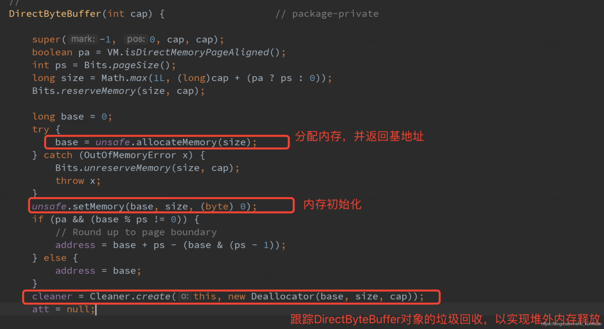
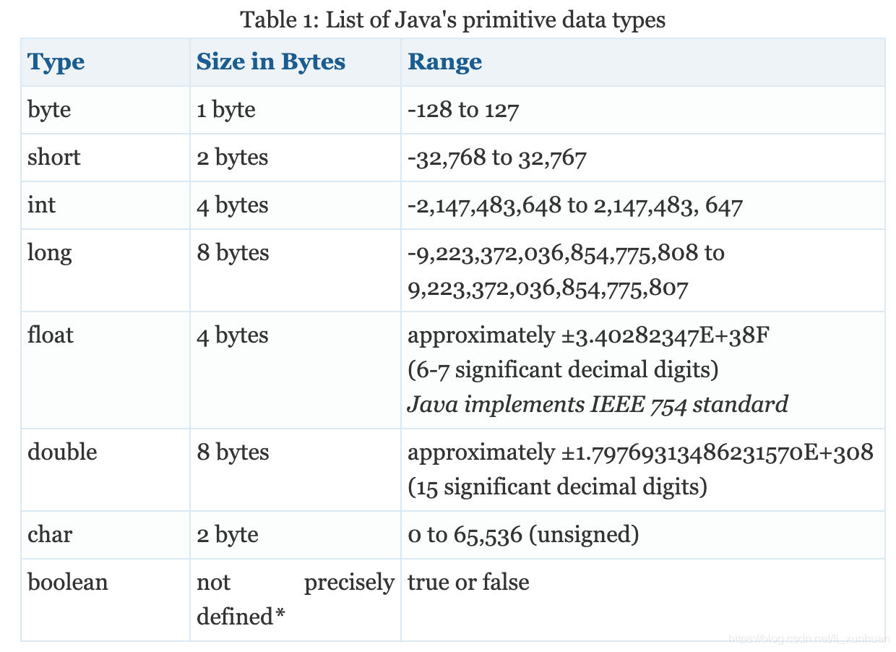

Java-直接内存 DirectMemory 详解
=========================

Java 直接内存
=========

1\. 设计逻辑
--------

 下面是 《深入理解 Java 虚拟机 第三版》2.2.7 小节 关于 Java 直接内存的描述。

>  直接内存（Direct Memory）并不是虚拟机运行时数据区的一部分，也不是《Java虚拟机规范》中定义的内存区域。但是这部分内存也被频繁地使用，而且也可能导致 OutOfMemoryError 异常出现，所以我们放到这里一起讲解。  在 JDK 1.4 中新加入了 NIO（New Input/Output）类，引入了一种基于通道（Channel）与缓冲区（Buffer）的 I/O 方式，它可以使用 Native 函数库直接分配堆外内存，然后通过一个存储在 Java 堆里面的 DirectByteBuffer 对象作为这块内存的引用进行操作。这样能在一些场景中显著提高性能，因为避免了在 Java 堆和 Native 堆中来回复制数据。  显然，本机直接内存的分配不会受到 Java 堆大小的限制，但是，既然是内存，则肯定还是会受到本机总内存（包括物理内存、SWAP分区或者分页文件）大小以及处理器寻址空间的限制，一般服务器管理员配置虚拟机参数时，会根据实际内存去设置 `-Xmx` 等参数信息，但经常忽略掉直接内存，使得各个内存区域总和大于物理内存限制（包括物理的和操作系统级的限制），从而导致动态扩展时出现 OutOfMemoryError 异常。

如果整理周志明对其描述的要的，那便是如下：

* Direct Memory 并不是虚拟机运行时数据区的一部分；
* 由于在 JDK 1.4 中引入了 NIO 机制，为此实现了一种通过 native 函数直接分配对外内存的，而这一切是通过以下两个概念实现的：
  * 通道（Channel）;
  * 缓冲区（Buffer）;
* 通过存储在 Java 堆里面的 DirectByteBuffer **对象**对这块内存的引用进行操作；
* 因避免了 Java 堆和 Native 堆（native heap）中来回复制数据，所以在一些场景中显著提高了性能；
* 直接内存出现 OutOfMemoryError 异常的原因是物理机器的内存是受限的，但是我们通常会忘记需要为直接内存在物理机中预留相关内存空间；

上述变化可以通过下面一图来表示：


* 关于上述的内存：可以这么粗浅地认为：栈用于方法的层层调用、返回、顺序执行，堆负责存储对象。
* 关于内存空间的称呼变化：JDK 1.4 之前的称呼 native heap 转为现在的称呼 directory memory 。之所以 heap 前加 native 来修饰，是因为要让其和虚拟机规范中的内存 heap，而现在称呼 directory memory 是因为我们能够直接通过引用访问对象，消除了拷贝操作。

 实际上，栈中访问一个对象还是要借助堆，stack 寻求一个对象还是和以前一样，会问：”堆，请把对象xxx给我“，而不会向 native 堆索要。所以这个直接性是不彻底的。真正的实现是这样的，Java 程序仍然需要使用在 Java heap 中的一个对象（实际上规定为 DirectByteBuffer 类型对象来操作），但是这个对象（buffer）所持有的数据实际上存储于 native memory 中，而 Java 堆只仅仅拥有着对 native heap 的一个引用。

2\. 垃圾回收
--------

 先的回答是不是的问题：直接内存也是会被 JVM 虚拟机管理进行完全不被引用的对象回收处理。

 但是直接内存中的对象并不是如普通对象样被 GC 管理，这方面细节会在下一小节中提到。

3\. 为什么需要 DirectByteBuffer
--------------------------

 即使不清楚 Java 设计者们会提出一个新的内存概念，不过也不难推断出其原因：由于 JVM 规范中的 heap 不满足某些领域的使用要求。

首先，回答为什么需要 Buffer 。

我们知道 GC 会管理内存，大致上可以这么认为，其主要做两件事：

* 回收不被引用的对象；
* 整理内存空间（比如将有效的对象整理到一起）；

 首先，JDK 告诉我们，NIO 操作并不适合直接在堆上操作。由于 heap 受到 GC 的直接管理，在 IO 写入的过程中 GC 可能会进行内存空间整理，这导致了一次 IO 写入的内存地址不完整。实际上，JNI（Java Native Inteface）在调用 IO 操作的 C 类库时，规定了写入时地址不能失效，这就导致了不能在 heap 上直接进行 IO 操作。在 IO 操作的时候禁止 GC 也是一个选项，如果 IO 时间过长，那么则可能会引起堆空间溢出。

 其次，回答 HeapByteBuffer 和 DirectByteBuffer 之间的区别。

 而 HeapByteBuffer 和 DirectByteBuffer 都是在堆外内存，即 native heap 上进行操作的。它们的区别是

* HeapByteBuffer 实现方式是拷贝，也就是栈访问 Buffer 内的数据还是需要从堆外内存拷贝到 heap 内；
* DirectByteBuffer 直接在堆内储存有对其的引用，不需要复制就能访问。

堆外内存的垃圾回收是比堆内垃圾回收复杂的，而且有着不同的回收机制。

4\. 内存分配问题
----------

 直接内存的最大大小可以通过 `-XX:MaxDirectMemorySize` 来设置，默认是 64M。

 在 Java 中分配内存的方式一般是通过 `sun.misc.Unsafe`类的公共 native 方法实现的（比如 文件以及网络 IO 类，但是非常不建议开发者使用，使用时一定要确保安全），而类 DirectByteBuffer 类的也是借助于此向物理内存(比如 JVM 运行于 Linux 上，那么 Linux 的内存就被称为物理内存)。

 Unsafe 是位于 sun.misc 包下的一个类，主要提供一些用于执行低级别、不安全操作的方法，如直接访问系统内存资源、自主管理内存资源等，这些方法在提升 Java 运行效率、增强 Java 语言底层资源操作能力方面起到了很大的作用。但由于 Unsafe 类使 Java 语言拥有了类似 C 语言指针一样操作内存空间的能力，这无疑也增加了程序发生相关指针问题的风险。在程序中过度、不正确使用 Unsafe 类会使得程序出错的概率变大，使得 Java 这种安全的语言变得不再“安全”，因此对 Unsafe 的使用一定要慎重。

 而 ByteBuffer 提供的静态方法：`java.nio.ByteBuffer#allocateDirect` 将 Unsafe 类分配内存的相关操作封装好提供给开发者，如下图所示（图源：美团技术团队）：



 从内存分配效率方面考虑的话，一般认为 HeapByteBuffer 以及 DirectByteBuffer 这种申请堆外内存的方式比堆内申请内存效率低，这主要是因为前者需要向物理机申请堆外内存，这是额外的开销。

**延伸阅读**：

 美团技术团队：<https://tech.meituan.com/2019/02/14/talk-about-java-magic-class-unsafe.html>**注意事项**：

 基地址并非是 JVM 运行环境的物理地址，而是虚拟内存地址，详细可见 R 大的回答：<https://www.zhihu.com/question/53150867>**建议**：

 Oracle JDK 没有 Unsafe 类的源码，所以需要 OpenJDK 才能知道 Unsafe 类中的方法详细返回类型，网址如下：

<http://hg.openjdk.java.net/jdk8u/jdk8u/jdk/file/4db0e91b95c8/src/share/classes/sun/misc/Unsafe.java>

5\. ByteBuffer 和其他 Buffer 对比
----------------------------

在 rt.jar 包的 java.nio 包下还有很多其他类型的 Buffer 类，比如 CharBuffer、IntBuffer 等等（每个基本类型\*都对应一个 \*Buffer，除了特殊的占一个 bit 的布尔类型）。但是唯独只有 ByteBuffer 类提供了输入参数为其他基本类型的 `put` 方法，这是为什么呢？

 这涉及了 Java 中整型基本类型存储的位数都是字节二进制位数的整数倍，如下表所示。



 有人这样认为 Java 中存储本质以字节 byte 为单位，这不完全对，因为二进制才是本质存储。但是换个说法就对了：Java 字节所占的二进制位数的整数倍恰好是其他基本类型所占的二进制位数，上表就是这个含义。所以所有基本类型都可以用字节表示，比如 char 类型就是以两个字节大小存储的，如果 char 类型的数据前 8 位和后 8 位完全可以分别用两个 byte 表示。换句话说 ByteBuffer 起到了 CharBuffer 的作用。

以下 `java.nio.DirectByteBuffer#putChar(char)`和 `java.nio.DirectByteBuffer#getChar()` 的源码：

* putchar

```javascript
 public ByteBuffer putChar(char x) {

        putChar(ix(nextPutIndex((1 << 1))), x);

        return this;

    }

```

* getchar

```javascript
public char getChar() {

        return getChar(ix(nextGetIndex((1 << 1))));

    }

```

 其中 `nextPutIndex` 以及 `nextGetIndex` 第一参数相当于待放入的基本类型要分为几份 byte 类型，这两个方法主要用于处理加入/拿出基本类型数据是对计数指针的加与减。以 `putChar` 为例，其做好统计指针操作后，又调用了本地的方法 `putchar`，其源代码如下：

```javascript
    private ByteBuffer putChar(long a, char x) {

      

        if (unaligned) {

            char y = (x);

            unsafe.putChar(a, (nativeByteOrder ? y : Bits.swap(y)));

        } else {

            Bits.putChar(a, x, bigEndian);

        }

        return this;

    }

```

其最终会调用 native `putChat()` 方法：`sun.misc.Unsafe#getChar(long)`。

**注意事项**：

 上述方法利用了左移操作 left shift，整形数据左移一位代表`*2`，但是不用 2 而用 `1<<1`，这样不就意味着多进行了一层没有必要的运算了吗？实际上，使用左移运算体现了除 byte 类型的基本类型可以由 byte 类型整数倍表示，增加了可读性，这是这样写代码的主要原因。其次左移操作并不会带来执行时的额外运算，因为左移这类计算表达式在编译期间会直接优化为结果值。

本文相关引用：

* <http://fibrevillage.com/sysadmin/325-understanding-java-heap-memory-and-java-direct-memory>
* <https://www.ibm.com/developerworks/library/j-nativememory-linux/>
* <https://yasinshaw.com/articles/59>
* <https://tech.meituan.com/2019/02/14/talk-about-java-magic-class-unsafe.html>
