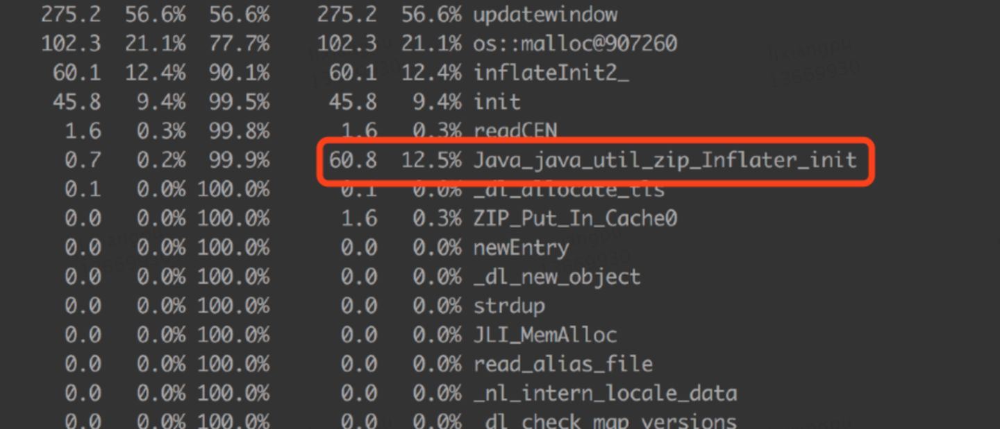
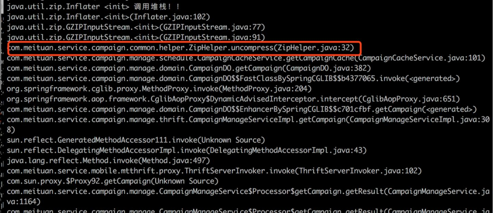
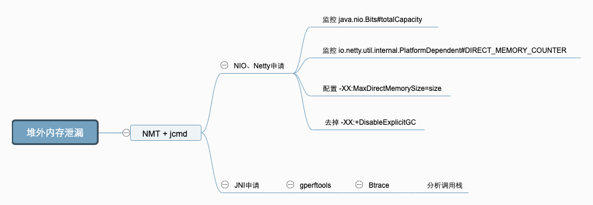
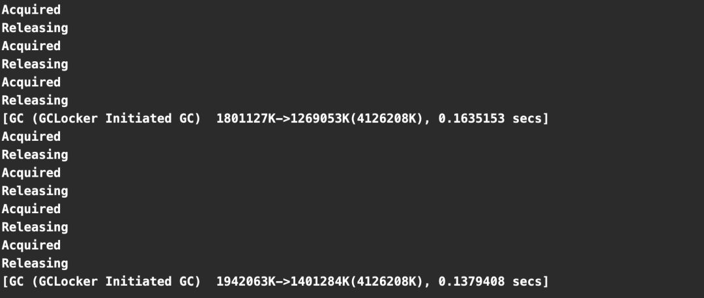
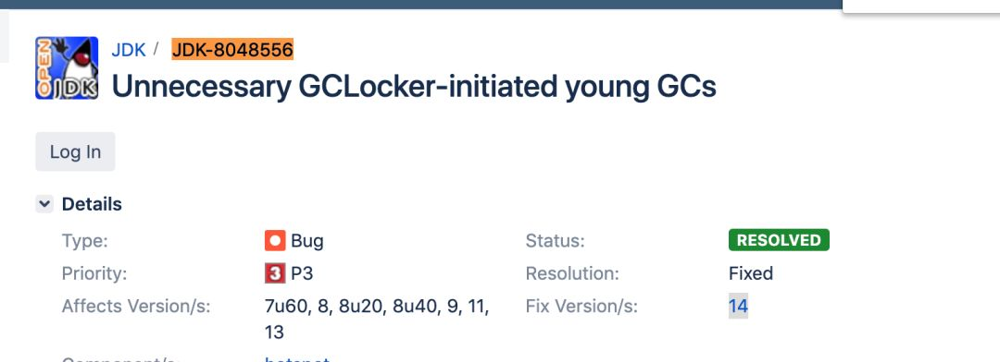
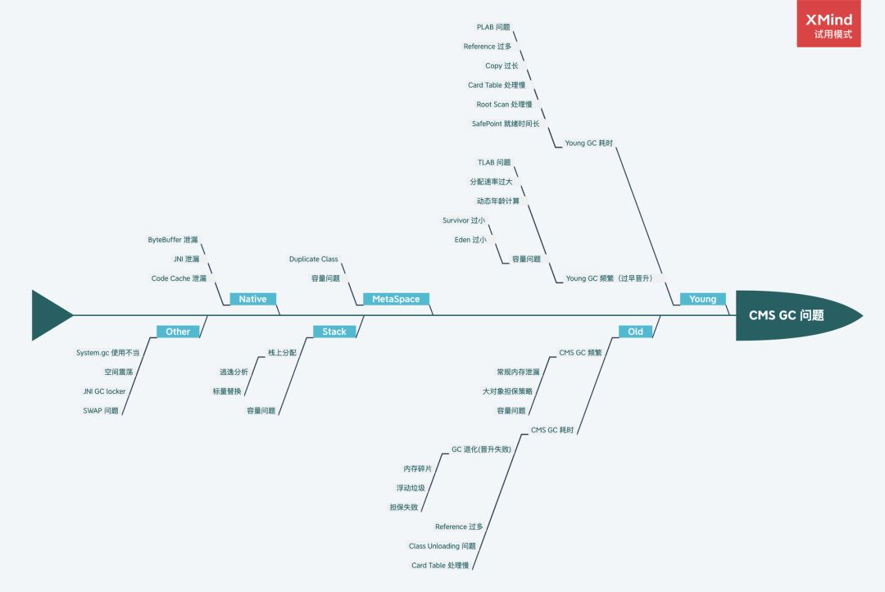
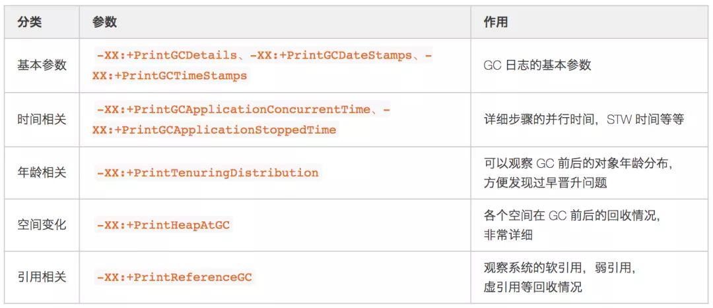

# Java中9种常见的CMS GC问题分析与解决（下）

目前，互联网上 Java 的 GC 资料要么是主要讲解理论，要么就是针对单一场景的 GC 问题进行了剖析，对整个体系总结的资料少之又少。前车之鉴，后事之师，美团的几位工程师历时一年多的时间，搜集了内部各种 GC 问题的分析文章，并结合个人的理解做了一些总结，希望能起到“抛砖引玉”的作用。

## **1. 写在前面**

\*\*|\*\*本文主要针对 Hotspot VM 中“CMS + ParNew”组合的一些使用场景进行总结。重点通过部分源码对根因进行分析以及对排查方法进行总结，排查过程会省略较多。另外，本文专业术语较多，有一定的阅读门槛，如未介绍清楚，还请自行查阅相关材料。

\*\*|\*\*本文总字数 2 万左右（不包含代码片段），整体阅读时间约 30min ，文章较长，可以选择你感兴趣的场景进行研究。

本篇系第二部分。

**4.6 场景六：单次 CMS Old GC 耗时长 \*\*\*\*\*4.6.1 现象**CMS GC 单次 STW 最大超过 1000ms，不会频繁发生，如下图所示最长达到了 8000ms。某些场景下会引起“雪崩效应”，这种场景非常危险，我们应该尽量避免出现。

**4.6.2 原因**

CMS 在回收的过程中，STW 的阶段主要是 Init Mark 和 Final Remark 这两个阶段，也是导致 CMS Old GC 最多的原因，另外有些情况就是在 STW 前等待 Mutator 的线程到达 SafePoint 也会导致时间过长，但这种情况较少，我们在此处主要讨论前者。发生收集器退化或者碎片压缩的场景请看场景七。

想要知道这两个阶段为什么会耗时，我们需要先看一下这两个阶段都会干什么。

核心代码都在 /src/hotspot/share/gc/cms/concurrentMarkSweepGeneration.cpp 中，内部有个线程 ConcurrentMarkSweepThread 轮询来校验，Old 区的垃圾回收相关细节被完全封装在 CMSCollector 中，调用入口就是 ConcurrentMarkSweepThread 调用的 CMSCollector::collect_in_background 和 ConcurrentMarkSweepGeneration 调用的 CMSCollector::collect 方法，此处我们讨论大多数场景的 collect_in_background。整个过程中会 STW 的主要是 initial Mark 和 Final Remark，核心代码在 VM_CMS_Initial_Mark / VM_CMS_Final_Remark 中，执行时需要将执行权交由 VMThread 来执行。

- CMS Init Mark执行步骤，实现在 CMSCollector::checkpointRootsInitialWork() 和 CMSParInitialMarkTask::work 中，整体步骤和代码如下：

CMSCollector::checkpointRootsInitialWork()

```text
void CMSCollector::checkpointRootsInitialWork() {
  assert(SafepointSynchronize::is_at_safepoint(), "world should be stopped");
  assert(_collectorState == InitialMarking, "just checking");
  // Already have locks.
  assert_lock_strong(bitMapLock());
  assert(_markBitMap.isAllClear(), "was reset at end of previous cycle");
  // Setup the verification and class unloading state for this
  // CMS collection cycle.
  setup_cms_unloading_and_verification_state();
  GCTraceTime(Trace, gc, phases) ts("checkpointRootsInitialWork", _gc_timer_cm);
  // Reset all the PLAB chunk arrays if necessary.
  if (_survivor_plab_array != NULL && !CMSPLABRecordAlways) {
    reset_survivor_plab_arrays();
  }
  ResourceMark rm;
  HandleMark  hm;
  MarkRefsIntoClosure notOlder(_span, &_markBitMap);
  CMSHeap* heap = CMSHeap::heap();
  verify_work_stacks_empty();
  verify_overflow_empty();
  heap->ensure_parsability(false);  // fill TLABs, but no need to retire them
  // Update the saved marks which may affect the root scans.
  heap->save_marks();
  // weak reference processing has not started yet.
  ref_processor()->set_enqueuing_is_done(false);
  // Need to remember all newly created CLDs,
  // so that we can guarantee that the remark finds them.
  ClassLoaderDataGraph::remember_new_clds(true);
  // Whenever a CLD is found, it will be claimed before proceeding to mark
  // the klasses. The claimed marks need to be cleared before marking starts.
  ClassLoaderDataGraph::clear_claimed_marks();
  print_eden_and_survivor_chunk_arrays();
  {
    if (CMSParallelInitialMarkEnabled) {
      // The parallel version.
      WorkGang* workers = heap->workers();
      assert(workers != NULL, "Need parallel worker threads.");
      uint n_workers = workers->active_workers();
      StrongRootsScope srs(n_workers);
      CMSParInitialMarkTask tsk(this, &srs, n_workers);
      initialize_sequential_subtasks_for_young_gen_rescan(n_workers);
      // If the total workers is greater than 1, then multiple workers
      // may be used at some time and the initialization has been set
      // such that the single threaded path cannot be used.
      if (workers->total_workers() > 1) {
        workers->run_task(&tsk);
      } else {
        tsk.work(0);
      }
    } else {
      // The serial version.
      CLDToOopClosure cld_closure(&notOlder, true);
      heap->rem_set()->prepare_for_younger_refs_iterate(false); // Not parallel.
      StrongRootsScope srs(1);
      heap->cms_process_roots(&srs,
                             true,   // young gen as roots
                             GenCollectedHeap::ScanningOption(roots_scanning_options()),
                             should_unload_classes(),
                             &notOlder,
                             &cld_closure);
    }
  }
  // Clear mod-union table; it will be dirtied in the prologue of
  // CMS generation per each young generation collection.
  assert(_modUnionTable.isAllClear(),
       "Was cleared in most recent final checkpoint phase"
       " or no bits are set in the gc_prologue before the start of the next "
       "subsequent marking phase.");
  assert(_ct->cld_rem_set()->mod_union_is_clear(), "Must be");
  // Save the end of the used_region of the constituent generations
  // to be used to limit the extent of sweep in each generation.
  save_sweep_limits();
  verify_overflow_empty();
}
```

CMSParInitialMarkTask::work

```text
void CMSParInitialMarkTask::work(uint worker_id) {
  elapsedTimer _timer;
  ResourceMark rm;
  HandleMark   hm;
  // ---------- scan from roots --------------
  _timer.start();
  CMSHeap* heap = CMSHeap::heap();
  ParMarkRefsIntoClosure par_mri_cl(_collector->_span, &(_collector->_markBitMap));
  // ---------- young gen roots --------------
  {
    work_on_young_gen_roots(&par_mri_cl);
    _timer.stop();
    log_trace(gc, task)("Finished young gen initial mark scan work in %dth thread: %3.3f sec", worker_id, _timer.seconds());
  }
  // ---------- remaining roots --------------
  _timer.reset();
  _timer.start();
  CLDToOopClosure cld_closure(&par_mri_cl, true);
  heap->cms_process_roots(_strong_roots_scope,
                          false,     // yg was scanned above
                          GenCollectedHeap::ScanningOption(_collector->CMSCollector::roots_scanning_options()),
                          _collector->should_unload_classes(),
                          &par_mri_cl,
                          &cld_closure,
                          &_par_state_string);
  assert(_collector->should_unload_classes()
         || (_collector->CMSCollector::roots_scanning_options() & GenCollectedHeap::SO_AllCodeCache),
         "if we didn't scan the code cache, we have to be ready to drop nmethods with expired weak oops");
  _timer.stop();
  log_trace(gc, task)("Finished remaining root initial mark scan work in %dth thread: %3.3f sec", worker_id, _timer.seconds());
}
```


整个过程比较简单，从 GC Root 出发标记 Old 中的对象，处理完成后借助 BitMap 处理下 Young 区对 Old 区的引用，整个过程基本都比较快，很少会有较大的停顿。

- CMS Final Remark 执行步骤，实现在 CMSCollector::checkpointRootsFinalWork() 中，整体代码和步骤如下：

CMSCollector::checkpointRootsFinalWork()

```text
void CMSCollector::checkpointRootsFinalWork() {
  GCTraceTime(Trace, gc, phases) tm("checkpointRootsFinalWork", _gc_timer_cm);
  assert(haveFreelistLocks(), "must have free list locks");
  assert_lock_strong(bitMapLock());
  ResourceMark rm;
  HandleMark   hm;
  CMSHeap* heap = CMSHeap::heap();
  if (should_unload_classes()) {
    CodeCache::gc_prologue();
  }
  assert(haveFreelistLocks(), "must have free list locks");
  assert_lock_strong(bitMapLock());
  heap->ensure_parsability(false);  // fill TLAB's, but no need to retire them
  // Update the saved marks which may affect the root scans.
  heap->save_marks();
  print_eden_and_survivor_chunk_arrays();
  {
    if (CMSParallelRemarkEnabled) {
      GCTraceTime(Debug, gc, phases) t("Rescan (parallel)", _gc_timer_cm);
      do_remark_parallel();
    } else {
      GCTraceTime(Debug, gc, phases) t("Rescan (non-parallel)", _gc_timer_cm);
      do_remark_non_parallel();
    }
  }
  verify_work_stacks_empty();
  verify_overflow_empty();
  {
    GCTraceTime(Trace, gc, phases) ts("refProcessingWork", _gc_timer_cm);
    refProcessingWork();
  }
  verify_work_stacks_empty();
  verify_overflow_empty();
  if (should_unload_classes()) {
    CodeCache::gc_epilogue();
  }
  JvmtiExport::gc_epilogue();
  assert(_markStack.isEmpty(), "No grey objects");
  size_t ser_ovflw = _ser_pmc_remark_ovflw + _ser_pmc_preclean_ovflw +
                     _ser_kac_ovflw        + _ser_kac_preclean_ovflw;
  if (ser_ovflw > 0) {
    log_trace(gc)("Marking stack overflow (benign) (pmc_pc=" SIZE_FORMAT ", pmc_rm=" SIZE_FORMAT ", kac=" SIZE_FORMAT ", kac_preclean=" SIZE_FORMAT ")",
                         _ser_pmc_preclean_ovflw, _ser_pmc_remark_ovflw, _ser_kac_ovflw, _ser_kac_preclean_ovflw);
    _markStack.expand();
    _ser_pmc_remark_ovflw = 0;
    _ser_pmc_preclean_ovflw = 0;
    _ser_kac_preclean_ovflw = 0;
    _ser_kac_ovflw = 0;
  }
  if (_par_pmc_remark_ovflw > 0 || _par_kac_ovflw > 0) {
     log_trace(gc)("Work queue overflow (benign) (pmc_rm=" SIZE_FORMAT ", kac=" SIZE_FORMAT ")",
                          _par_pmc_remark_ovflw, _par_kac_ovflw);
     _par_pmc_remark_ovflw = 0;
    _par_kac_ovflw = 0;
  }
   if (_markStack._hit_limit > 0) {
     log_trace(gc)(" (benign) Hit max stack size limit (" SIZE_FORMAT ")",
                          _markStack._hit_limit);
   }
   if (_markStack._failed_double > 0) {
     log_trace(gc)(" (benign) Failed stack doubling (" SIZE_FORMAT "), current capacity " SIZE_FORMAT,
                          _markStack._failed_double, _markStack.capacity());
   }
  _markStack._hit_limit = 0;
  _markStack._failed_double = 0;
  if ((VerifyAfterGC || VerifyDuringGC) &&
      CMSHeap::heap()->total_collections() >= VerifyGCStartAt) {
    verify_after_remark();
  }
  _gc_tracer_cm->report_object_count_after_gc(&_is_alive_closure);
  // Change under the freelistLocks.
  _collectorState = Sweeping;
  // Call isAllClear() under bitMapLock
  assert(_modUnionTable.isAllClear(),
      "Should be clear by end of the final marking");
  assert(_ct->cld_rem_set()->mod_union_is_clear(),
      "Should be clear by end of the final marking");
}
```


Final Remark 是最终的第二次标记，这种情况只有在 Background GC 执行了 InitialMarking 步骤的情形下才会执行，如果是 Foreground GC 执行的 InitialMarking 步骤则不需要再次执行 FinalRemark。Final Remark 的开始阶段与 Init Mark 处理的流程相同，但是后续多了 Card Table 遍历、Reference 实例的清理并将其加入到 Reference 维护的 pend_list 中，如果要收集元数据信息，还要清理 SystemDictionary、CodeCache、SymbolTable、StringTable 等组件中不再使用的资源。

**4.6.3 策略**

知道了两个 STW 过程执行流程，我们分析解决就比较简单了，由于大部分问题都出在 Final Remark 过程，这里我们也拿这个场景来举例，主要步骤：

- \*\*【方向】\*\*观察详细 GC 日志，找到出问题时 Final Remark 日志，分析下 Reference 处理和元数据处理 real 耗时是否正常，详细信息需要通过 -XX:+PrintReferenceGC 参数开启。 **基本在日志里面就能定位到大概是哪个方向出了问题，耗时超过 10% 的就需要关注** 。

```text
2019-02-27T19:55:37.920+0800: 516952.915: [GC (CMS Final Remark) 516952.915: [ParNew516952.939: [SoftReference, 0 refs, 0.0003857 secs]516952.939: [WeakReference, 1362 refs, 0.0002415 secs]516952.940: [FinalReference, 146 refs, 0.0001233 secs]516952.940: [PhantomReference, 0 refs, 57 refs, 0.0002369 secs]516952.940: [JNI Weak Reference, 0.0000662 secs]
[class unloading, 0.1770490 secs]516953.329: [scrub symbol table, 0.0442567 secs]516953.373: [scrub string table, 0.0036072 secs][1 CMS-remark: 1638504K(2048000K)] 1667558K(4352000K), 0.5269311 secs] [Times: user=1.20 sys=0.03, real=0.53 secs]
```

- \*\*【根因】\*\*有了具体的方向我们就可以进行深入的分析，一般来说最容易出问题的地方就是 Reference 中的 FinalReference 和元数据信息处理中的 scrub symbol table 两个阶段，想要找到具体问题代码就需要内存分析工具 MAT 或 JProfiler 了，注意要 dump 即将开始 CMS GC 的堆。在用 MAT 等工具前也可以先用命令行看下对象 Histogram，有可能直接就能定位问题。
- 对 FinalReference 的分析主要观察 java.lang.ref.Finalizer 对象的 dominator tree，找到泄漏的来源。经常会出现问题的几个点有 Socket 的 SocksSocketImpl 、Jersey 的 ClientRuntime、MySQL 的 ConnectionImpl 等等。
- scrub symbol table 表示清理元数据符号引用耗时，符号引用是 Java 代码被编译成字节码时，方法在 JVM 中的表现形式，生命周期一般与 Class 一致，当 \_should_unload_classes 被设置为 true 时在 CMSCollector::refProcessingWork() 中与 Class Unload、String Table 一起被处理。

CMSCollector::refProcessingWork()

```text
if (should_unload_classes()) {
    {
      GCTraceTime(Debug, gc, phases) t("Class Unloading", _gc_timer_cm);
      // Unload classes and purge the SystemDictionary.
      bool purged_class = SystemDictionary::do_unloading(_gc_timer_cm);
      // Unload nmethods.
      CodeCache::do_unloading(&_is_alive_closure, purged_class);
      // Prune dead klasses from subklass/sibling/implementor lists.
      Klass::clean_weak_klass_links(purged_class);
    }
    {
      GCTraceTime(Debug, gc, phases) t("Scrub Symbol Table", _gc_timer_cm);
      // Clean up unreferenced symbols in symbol table.
      SymbolTable::unlink();
    }
    {
      GCTraceTime(Debug, gc, phases) t("Scrub String Table", _gc_timer_cm);
      // Delete entries for dead interned strings.
      StringTable::unlink(&_is_alive_closure);
    }
  }
```

- \*\*【策略】\*\*知道 GC 耗时的根因就比较好处理了，这种问题不会大面积同时爆发，不过有很多时候单台 STW 的时间会比较长，如果业务影响比较大，及时摘掉流量，具体后续优化策略如下：
- FinalReference：找到内存来源后通过优化代码的方式来解决，如果短时间无法定位可以增加 -XX:+ParallelRefProcEnabled 对 Reference 进行并行处理。
- symbol table：观察 MetaSpace 区的历史使用峰值，以及每次 GC 前后的回收情况，一般没有使用动态类加载或者 DSL 处理等，MetaSpace 的使用率上不会有什么变化，这种情况可以通过 -XX:-CMSClassUnloadingEnabled 来避免 MetaSpace 的处理，JDK8 会默认开启 CMSClassUnloadingEnabled，这会使得 CMS 在 CMS-Remark 阶段尝试进行类的卸载。

**4.6.4 小结**正常情况进行的 Background CMS GC，出现问题基本都集中在 Reference 和 Class 等元数据处理上，在 Reference 类的问题处理方面，不管是 FinalReference，还是 SoftReference、WeakReference 核心的手段就是找准时机 dump 快照，然后用内存分析工具来分析。Class 处理方面目前除了关闭类卸载开关，没有太好的方法。

在 G1 中同样有 Reference 的问题，可以观察日志中的 Ref Proc，处理方法与 CMS 类似。**4.7 场景七：内存碎片&收集器退化 \*\*\*\* 4.7.1 现象**

并发的 CMS GC 算法，退化为 Foreground 单线程串行 GC 模式，STW 时间超长，有时会长达十几秒。其中 CMS 收集器退化后单线程串行 GC 算法有两种：

- 带压缩动作的算法，称为 MSC，上面我们介绍过，使用标记-清理-压缩，单线程全暂停的方式，对整个堆进行垃圾收集，也就是真正意义上的 Full GC，暂停时间要长于普通 CMS。
- 不带压缩动作的算法，收集 Old 区，和普通的 CMS 算法比较相似，暂停时间相对 MSC 算法短一些。

**4.7.2 原因 **CMS 发生收集器退化主要有以下几种情况。** 晋升失败（Promotion Failed）**

顾名思义，晋升失败就是指在进行 Young GC 时，Survivor 放不下，对象只能放入 Old，但此时 Old 也放不下。直觉上乍一看这种情况可能会经常发生，但其实因为有 concurrentMarkSweepThread 和担保机制的存在，发生的条件是很苛刻的，除非是短时间将 Old 区的剩余空间迅速填满，例如上文中说的动态年龄判断导致的过早晋升（见下文的增量收集担保失败）。另外还有一种情况就是内存碎片导致的 Promotion Failed，Young GC 以为 Old 有足够的空间，结果到分配时，晋级的大对象找不到连续的空间存放。

使用 CMS 作为 GC 收集器时，运行过一段时间的 Old 区如下图所示，清除算法导致内存出现多段的不连续，出现大量的内存碎片。


碎片带来了两个问题：

- **空间分配效率较低**：上文已经提到过，如果是连续的空间 JVM 可以通过使用 pointer bumping 的方式来分配，而对于这种有大量碎片的空闲链表则需要逐个访问 freelist 中的项来访问，查找可以存放新建对象的地址。
- \*\*空间利用效率变低 **：Young 区晋升的对象大小大于了连续空间的大小，那么将会触发 Promotion Failed ，即使整个 Old 区的容量是足够的，但由于其不连续，也无法存放新对象，也就是本文所说的问题。** 增量收集担保失败 **分配内存失败后，会判断统计得到的 Young GC 晋升到 Old 的平均大小，以及当前 Young 区已使用的大小也就是最大可能晋升的对象大小，是否大于 Old 区的剩余空间。只要 CMS 的剩余空间比前两者的任意一者大，CMS 就认为晋升还是安全的，反之，则代表不安全，不进行Young GC，直接触发Full GC。** 显式 GC **这种情况参见场景二。** 并发模式失败（Concurrent Mode Failure）\*\*最后一种情况，也是发生概率较高的一种，在 GC 日志中经常能看到 Concurrent Mode Failure 关键字。这种是由于并发 Background CMS GC 正在执行，同时又有 Young GC 晋升的对象要放入到了 Old 区中，而此时 Old 区空间不足造成的。

为什么 CMS GC 正在执行还会导致收集器退化呢？主要是由于 CMS 无法处理浮动垃圾（Floating Garbage）引起的。CMS 的并发清理阶段，Mutator 还在运行，因此不断有新的垃圾产生，而这些垃圾不在这次清理标记的范畴里，无法在本次 GC 被清除掉，这些就是浮动垃圾，除此之外在 Remark 之前那些断开引用脱离了读写屏障控制的对象也算浮动垃圾。所以 Old 区回收的阈值不能太高，否则预留的内存空间很可能不够，从而导致 Concurrent Mode Failure 发生。**4.7.3 策略**

分析到具体原因后，我们就可以针对性解决了，具体思路还是从根因出发，具体解决策略：

- \*\*内存碎片：\*\*通过配置 -XX:UseCMSCompactAtFullCollection=true 来控制 Full GC的过程中是否进行空间的整理（默认开启，注意是Full GC，不是普通CMS GC），以及 -XX: CMSFullGCsBeforeCompaction=n 来控制多少次 Full GC 后进行一次压缩。
- \*\*增量收集：\*\*降低触发 CMS GC 的阈值，即参数 -XX:CMSInitiatingOccupancyFraction 的值，让 CMS GC 尽早执行，以保证有足够的连续空间，也减少 Old 区空间的使用大小，另外需要使用 -XX:+UseCMSInitiatingOccupancyOnly 来配合使用，不然 JVM 仅在第一次使用设定值，后续则自动调整。
- \*\*浮动垃圾：\*\*视情况控制每次晋升对象的大小，或者缩短每次 CMS GC 的时间，必要时可调节 NewRatio 的值。另外就是使用 -XX:+CMSScavengeBeforeRemark 在过程中提前触发一次 Young GC，防止后续晋升过多对象。

**4.7.4 小结**正常情况下触发并发模式的 CMS GC，停顿非常短，对业务影响很小，但 CMS GC 退化后，影响会非常大，建议发现一次后就彻底根治。只要能定位到内存碎片、浮动垃圾、增量收集相关等具体产生原因，还是比较好解决的，关于内存碎片这块，如果 -XX:CMSFullGCsBeforeCompaction 的值不好选取的话，可以使用 -XX:PrintFLSStatistics 来观察内存碎片率情况，然后再设置具体的值。

最后就是在编码的时候也要避免需要连续地址空间的大对象的产生，如过长的字符串，用于存放附件、序列化或反序列化的 byte 数组等，还有就是过早晋升问题尽量在爆发问题前就避免掉。**4.8 场景八：堆外内存 OOM \*\*\*\* 4.8.1 现象 **内存使用率不断上升，甚至开始使用 SWAP 内存，同时可能出现 GC 时间飙升，线程被 Block 等现象，** 通过 top 命令发现 Java 进程的 RES 甚至超过了**\*\*-Xmx \*\*\*\* 的大小 **。出现这些现象时，基本可以确定是出现了堆外内存泄漏。** 4.8.2 原因\*\*

JVM 的堆外内存泄漏，主要有两种的原因：

- 通过 UnSafe#allocateMemory，ByteBuffer#allocateDirect 主动申请了堆外内存而没有释放，常见于 NIO、Netty 等相关组件。
- 代码中有通过 JNI 调用 Native Code 申请的内存没有释放。

**4.8.3 策略**哪种原因造成的堆外内存泄漏？

首先，我们需要确定是哪种原因导致的堆外内存泄漏。这里可以使用 NMT（[NativeMemoryTracking](https://docs.oracle.com/javase/8/docs/technotes/guides/troubleshoot/tooldescr007.html)） 进行分析。在项目中添加 -XX:NativeMemoryTracking=detail JVM参数后重启项目（需要注意的是，打开 NMT 会带来 5%~10% 的性能损耗）。使用命令 jcmd pid VM.native_memory detail 查看内存分布。重点观察 total 中的 committed，因为 jcmd 命令显示的内存包含堆内内存、Code 区域、通过 Unsafe.allocateMemory 和 DirectByteBuffer 申请的内存，但是不包含其他 Native Code（C 代码）申请的堆外内存。

如果 total 中的 committed 和 top 中的 RES 相差不大，则应为主动申请的堆外内存未释放造成的，如果相差较大，则基本可以确定是 JNI 调用造成的。**原因一：主动申请未释放**JVM 使用 -XX:MaxDirectMemorySize=size 参数来控制可申请的堆外内存的最大值。在 Java 8 中，如果未配置该参数，默认和 -Xmx 相等。

NIO 和 Netty 都会取 -XX:MaxDirectMemorySize 配置的值，来限制申请的堆外内存的大小。NIO 和 Netty 中还有一个计数器字段，用来计算当前已申请的堆外内存大小，NIO 中是 java.nio.Bits#totalCapacity、Netty 中 io.netty.util.internal.PlatformDependent#DIRECT_MEMORY_COUNTER。

当申请堆外内存时，NIO 和 Netty 会比较计数器字段和最大值的大小，如果计数器的值超过了最大值的限制，会抛出 OOM 的异常。

NIO 中是：OutOfMemoryError: Direct buffer memory。

Netty 中是：OutOfDirectMemoryError: failed to allocate capacity byte(s) of direct memory (used: usedMemory , max: DIRECT_MEMORY_LIMIT )。

我们可以检查代码中是如何使用堆外内存的，NIO 或者是 Netty，通过反射，获取到对应组件中的计数器字段，并在项目中对该字段的数值进行打点，即可准确地监控到这部分堆外内存的使用情况。

此时，可以通过 Debug 的方式确定使用堆外内存的地方是否正确执行了释放内存的代码。另外，需要检查 JVM 的参数是否有 -XX:+DisableExplicitGC 选项，如果有就去掉，因为该参数会使 System.gc 失效。（场景二：显式 GC 的去与留）**原因二：通过 JNI 调用的 Native Code 申请的内存未释放**这种情况排查起来比较困难，我们可以通过 Google perftools + Btrace 等工具，帮助我们分析出问题的代码在哪里。

gperftools 是 Google 开发的一款非常实用的工具集，它的原理是在 Java 应用程序运行时，当调用 malloc 时换用它的 libtcmalloc.so，这样就能对内存分配情况做一些统计。我们使用 gperftools 来追踪分配内存的命令。如下图所示，通过 gperftools 发现 Java_java_util_zip_Inflater_init 比较可疑。



接下来可以使用 Btrace，尝试定位具体的调用栈。Btrace 是 Sun 推出的一款 Java 追踪、监控工具，可以在不停机的情况下对线上的 Java 程序进行监控。如下图所示，通过 Btrace 定位出项目中的 ZipHelper 在频繁调用 GZIPInputStream ，在堆外内存分配对象。



最终定位到是，项目中对 GIPInputStream 的使用错误，没有正确的 close()。


除了项目本身的原因，还可能有外部依赖导致的泄漏，如 Netty 和 Spring Boot，详细情况可以学习下这两篇文章：《[疑案追踪：Spring Boot内存泄露排查记](https://mp.weixin.qq.com/s?__biz=MjM5NjQ5MTI5OA==&mid=2651750037&idx=2&sn=847fb15d4413354355c33a46a7bccf55&chksm=bd12a7d88a652ecea5789073973abb9545e76a8972c843968a6efd1fb3a918ef07eed8abb37e&scene=21#wechat_redirect)》、《[Netty堆外内存泄露排查盛宴](https://mp.weixin.qq.com/s?__biz=MjM5NjQ5MTI5OA==&mid=2651749037&idx=2&sn=d1d6b0348eea5cd80e2c7a56c8a61fa9&chksm=bd12a3e08a652af684fd8d96e81fc0e0fded69dd847051e6b0f791f3726da0415c9552ee2615&scene=21#wechat_redirect)》。**4.8.4 小结**首先可以使用 NMT + jcmd 分析泄漏的堆外内存是哪里申请，确定原因后，使用不同的手段，进行原因定位。

**4.9 场景九：JNI 引发的 GC 问题 \*\*\*\* 4.9.1 现象**在 GC 日志中，出现 GC Cause 为 GCLocker Initiated GC。

```text
2020-09-23T16:49:09.727+0800: 504426.742: [GC (GCLocker Initiated GC) 504426.742: [ParNew (promotion failed): 209716K->6042K(1887488K), 0.0843330 secs] 1449487K->1347626K(3984640K), 0.0848963 secs] [Times: user=0.19 sys=0.00, real=0.09 secs]
2020-09-23T16:49:09.812+0800: 504426.827: [Full GC (GCLocker Initiated GC) 504426.827: [CMS: 1341583K->419699K(2097152K), 1.8482275 secs] 1347626K->419699K(3984640K), [Metaspace: 297780K->297780K(1329152K)], 1.8490564 secs] [Times: user=1.62 sys=0.20, real=1.85 secs]
```** 4.9.2 原因**

JNI（Java Native Interface）意为 Java 本地调用，它允许 Java 代码和其他语言写的 Native 代码进行交互。

JNI 如果需要获取 JVM 中的 String 或者数组，有两种方式：

*   拷贝传递。
*   共享引用（指针），性能更高。

由于 Native 代码直接使用了 JVM 堆区的指针，如果这时发生 GC，就会导致数据错误。因此，在发生此类 JNI 调用时，禁止 GC 的发生，同时阻止其他线程进入 JNI 临界区，直到最后一个线程退出临界区时触发一次 GC。

GC Locker 实验：
```text
public class GCLockerTest {
  static final int ITERS = 100;
  static final int ARR_SIZE =  10000;
  static final int WINDOW = 10000000;
  static native void acquire(int[] arr);
  static native void release(int[] arr);
  static final Object[] window = new Object[WINDOW];
  public static void main(String... args) throws Throwable {
    System.loadLibrary("GCLockerTest");
    int[] arr = new int[ARR_SIZE];
    for (int i = 0; i < ITERS; i++) {
      acquire(arr);
      System.out.println("Acquired");
      try {
        for (int c = 0; c < WINDOW; c++) {
          window[c] = new Object();
        }
      } catch (Throwable t) {
        // omit
      } finally {
        System.out.println("Releasing");
        release(arr);
      }
    }
  }
}
```

______________________________________________________________________

```text
#include <jni.h>
#include "GCLockerTest.h"
static jbyte* sink;
JNIEXPORT void JNICALL Java_GCLockerTest_acquire(JNIEnv* env, jclass klass, jintArray arr) {
sink = (*env)->GetPrimitiveArrayCritical(env, arr, 0);
}
JNIEXPORT void JNICALL Java_GCLockerTest_release(JNIEnv* env, jclass klass, jintArray arr) {
(*env)->ReleasePrimitiveArrayCritical(env, arr, sink, 0);
}
```

运行该 JNI 程序，可以看到发生的 GC 都是 GCLocker Initiated GC，并且注意在 “Acquired” 和 “Released” 时不可能发生 GC。



GC Locker 可能导致的不良后果有：

- 如果此时是 Young 区不够 Allocation Failure 导致的 GC，由于无法进行 Young GC，会将对象直接分配至 Old 区。
- 如果 Old 区也没有空间了，则会等待锁释放，导致线程阻塞。
- 可能触发额外不必要的 Young GC，JDK 有一个 Bug，有一定的几率，本来只该触发一次 GCLocker Initiated GC 的 Young GC，实际发生了一次 Allocation Failure GC 又紧接着一次 GCLocker Initiated GC。是因为 GCLocker Initiated GC 的属性被设为 full，导致两次 GC 不能收敛。

**4.9.3 策略**

- 添加 -XX+PrintJNIGCStalls 参数，可以打印出发生 JNI 调用时的线程，进一步分析，找到引发问题的 JNI 调用。
- JNI 调用需要谨慎，不一定可以提升性能，反而可能造成 GC 问题。
- 升级 JDK 版本到 14，避免 [JDK-8048556](https://bugs.openjdk.java.net/browse/JDK-8048556) 导致的重复 GC。



**4.9.4 小结 **JNI 产生的 GC 问题较难排查，需要谨慎使用。** 5. 总结**----------

在这里，我们把整个文章内容总结一下，方便大家整体地理解回顾。**5.1 处理流程（SOP）**

下图为整体 GC 问题普适的处理流程，重点的地方下面会单独标注，其他的基本都是标准处理流程，此处不再赘述，最后在整个问题都处理完之后有条件的话建议做一下复盘。


- \*\*制定标准：\*\*这块内容其实非常重要，但大部分系统都是缺失的，笔者过往面试的同学中只有不到一成的同学能给出自己的系统 GC 标准到底什么样，其他的都是用的统一指标模板，缺少预见性，具体指标制定可以参考 3.1 中的内容，需要结合应用系统的 TP9999 时间和延迟、吞吐量等设定具体的指标，而不是被问题驱动。
- \*\*保留现场：\*\*目前线上服务基本都是分布式服务，某个节点发生问题后，如果条件允许一定不要直接操作重启、回滚等动作恢复，优先通过摘掉流量的方式来恢复，这样我们可以将堆、栈、GC 日志等关键信息保留下来，不然错过了定位根因的时机，后续解决难度将大大增加。当然除了这些，应用日志、中间件日志、内核日志、各种 Metrics 指标等对问题分析也有很大帮助。
- \*\*因果分析：\*\*判断 GC 异常与其他系统指标异常的因果关系，可以参考笔者在 3.2 中介绍的时序分析、概率分析、实验分析、反证分析等 4 种因果分析法，避免在排查过程中走入误区。
- \*\*根因分析：\*\*确实是 GC 的问题后，可以借助上文提到的工具并通过 5 Why 根因分析法以及跟第三节中的九种常见的场景进行逐一匹配，或者直接参考下文的根因鱼骨图，找出问题发生根因，最后再选择优化手段。

**5.2 根因鱼骨图 **送上一张问题根因鱼骨图，一般情况下我们在处理一个 GC 问题时，只要能定位到问题的“病灶”，有的放矢，其实就相当于解决了 80%，如果在某些场景下不太好定位，大家可以借助这种根因分析图通过** 排除法**去定位。

**5.3 调优建议**

- \*\*Trade Off：\*\*与 CAP 注定要缺一角一样，GC 优化要在延迟（Latency）、吞吐量（Throughput）、容量（Capacity）三者之间进行权衡。
- \*\*最终手段：\*\*GC 发生问题不是一定要对 JVM 的 GC 参数进行调优，大部分情况下是通过 GC 的情况找出一些业务问题，切记上来就对 GC 参数进行调整，当然有明确配置错误的场景除外。
- \*\*控制变量：\*\*控制变量法是在蒙特卡洛（Monte Carlo）方法中用于减少方差的一种技术方法，我们调优的时候尽量也要使用，每次调优过程尽可能只调整一个变量。
- \*\*善用搜索：\*\*理论上 99.99% 的 GC 问题基本都被遇到了，我们要学会使用搜索引擎的高级技巧，重点关注 StackOverFlow、Github 上的 Issue、以及各种论坛博客，先看看其他人是怎么解决的，会让解决问题事半功倍。能看到这篇文章，你的搜索能力基本过关了~
- \*\*调优重点：\*\*总体上来讲，我们开发的过程中遇到的问题类型也基本都符合正态分布，太简单或太复杂的基本遇到的概率很低，笔者这里将中间最重要的三个场景添加了“\*”标识，希望阅读完本文之后可以观察下自己负责的系统，是否存在上述问题。
- \*\*GC 参数：\*\*如果堆、栈确实无法第一时间保留，一定要保留 GC 日志，这样我们最起码可以看到 GC Cause，有一个大概的排查方向。关于 GC 日志相关参数，最基本的 -XX:+HeapDumpOnOutOfMemoryError 等一些参数就不再提了，笔者建议添加以下参数，可以提高我们分析问题的效率。



- \*\*其他建议：\*\*上文场景中没有提到，但是对 GC 性能也有提升的一些建议。
- \*\*主动式 GC：\*\*也有另开生面的做法，通过监控手段监控观测 Old 区的使用情况，即将到达阈值时将应用服务摘掉流量，手动触发一次 Major GC，减少 CMS GC 带来的停顿，但随之系统的健壮性也会减少，如非必要不建议引入。
- **禁用偏向锁： **偏向锁在只有一个线程使用到该锁的时候效率很高，但是在竞争激烈情况会升级成轻量级锁，此时就需要先** 消除偏向锁，这个过程是 STW** 的。如果每个同步资源都走这个升级过程，开销会非常大，所以在已知并发激烈的前提下，一般会禁用偏向锁 -XX:-UseBiasedLocking 来提高性能。
- \*\*虚拟内存：\*\*启动初期有些操作系统（例如 Linux）并没有真正分配物理内存给 JVM ，而是在虚拟内存中分配，使用的时候才会在物理内存中分配内存页，这样也会导致 GC 时间较长。这种情况可以添加 -XX:+AlwaysPreTouch 参数，让 VM 在 commit 内存时跑个循环来强制保证申请的内存真的 commit，避免运行时触发缺页异常。在一些大内存的场景下，有时候能将前几次的 GC 时间降一个数量级，但是添加这个参数后，启动的过程可能会变慢。

**6. 写在最后**------------

最后，再说笔者个人的一些小建议，遇到一些 GC 问题，如果有精力，一定要探本穷源，找出最深层次的原因。另外，在这个信息泛滥的时代，有一些被“奉为圭臬”的经验可能都是错误的，尽量养成看源码的习惯，有一句话说到“源码面前，了无秘密”，也就意味着遇到搞不懂的问题，我们可以从源码中一窥究竟，某些场景下确有奇效。但也不是只靠读源码来学习，如果硬啃源码但不理会其背后可能蕴含的理论基础，那很容易“捡芝麻丢西瓜”，“只见树木，不见森林”，让“了无秘密”变成了一句空话，我们还是要结合一些实际的业务场景去针对性地学习。**你的时间在哪里，你的成就就会在哪里**。笔者也是在前两年才开始逐步地在 GC 方向上不断深入，查问题、看源码、做总结，每个 Case 形成一个小的闭环，目前初步摸到了 GC 问题处理的一些门道，同时将经验总结应用于生产环境实践，慢慢地形成一个良性循环。

本篇文章主要是介绍了 CMS GC 的一些常见场景分析，另外一些，如 CodeCache 问题导致 JIT 失效、SafePoint 就绪时间长、Card Table 扫描耗时等问题不太常见就没有花太多篇幅去讲解。Java GC 是在“分代”的思想下内卷了很多年才突破到了“分区”，目前在美团也已经开始使用 G1 来替换使用了多年的 CMS，虽然在小的堆方面 G1 还略逊色于 CMS，但这是一个趋势，短时间无法升级到 ZGC，所以未来遇到的 G1 的问题可能会逐渐增多。目前已经收集到 Remember Set 粗化、Humongous 分配、Ergonomics 异常、Mixed GC 中 Evacuation Failure 等问题，除此之外也会给出 CMS 升级到 G1 的一些建议，接下来笔者将继续完成这部分文章整理，敬请期待。

“防火”永远要胜于“救火”，**不放过任何一个异常的小指标 **（一般来说，任何** 不平滑的曲线**都是值得怀疑的） ，就有可能避免一次故障的发生。作为 Java 程序员基本都会遇到一些 GC 的问题，独立解决 GC 问题是我们必须迈过的一道坎。开篇中也提到过 GC 作为经典的技术，非常值得我们学习，一些 GC 的学习材料，如《The Garbage Collection Handbook》、《深入理解Java虚拟机》等也是常读常新，赶紧动起来，苦练 GC 基本功吧。

最后的最后，再多啰嗦一句，目前所有 GC 调优相关的文章，第一句讲的就是“不要过早优化”，使得很多同学对 GC 优化望而却步。在这里笔者提出不一样的观点，熵增定律（在一个孤立系统里，如果没有外力做功，其总混乱度（即熵）会不断增大）在计算机系统同样适用，**如果不主动做功使熵减，系统终究会脱离你的掌控**，在我们对业务系统和 GC 原理掌握得足够深的时候，可以放心大胆地做优化，因为我们基本可以预测到每一个操作的结果，放手一搏吧，少年！

更多内容，请查看：[美团技术团队：Java中9种常见的CMS GC问题分析与解决（上）](https://zhuanlan.zhihu.com/p/291027786)**7. 参考资料**\[1\]《[ガベージコレクションのアルゴリズムと実装](https://book.douban.com/subject/4881935/)》中村 成洋 / 相川 光

\[2\]《[The Garbage Collection Handbook](https://book.douban.com/subject/6809987/)》 Richard Jones/ Antony Hosking / Eliot Moss

\[3\]《[深入理解Java虚拟机（第3版）](https://book.douban.com/subject/34907497/)》 周志明

\[4\]《[Java Platform, Standard Edition HotSpot Virtual Machine Garbage Collection Tuning Guide](https://docs.oracle.com/javase/9/gctuning/JSGCT.pdf)》

\[5\]《[Shipilev One Page Blog](https://shipilev.net/)》 Shipilëv

\[6\] [https://openjdk.java.net/projects/jdk/15/](https://openjdk.java.net/projects/jdk/15/)

\[7\] [https://jcp.org/en/home/index](https://jcp.org/en/home/index)

\[8\]《[A Generational Mostly-concurrent Garbage Collector](http://citeseerx.ist.psu.edu/viewdoc/summary?doi=10.1.1.22.8915)》 Tony Printezis / David Detlefs

\[9\]《[Java Memory Management White Paper](https://www.oracle.com/technetwork/java/javase/memorymanagement-whitepaper-150215.pdf)》

\[10\]《[Stuff Happens：Understanding Causation in Policy and Strategy](https://go.gale.com/ps/anonymous?id=GALE%7CA563359212&sid=googleScholar&v=2.1&it=r&linkaccess=abs&issn=00311723&p=AONE&sw=w)》AA Hill**8. 作者简介**

新宇，2015 年加入美团，到店住宿门票业务开发工程师。

湘铭，2018 年加入美团，到店客户平台开发工程师。

祥璞，2018 年加入美团，到店客户平台开发工程师。

---------- END ----------
