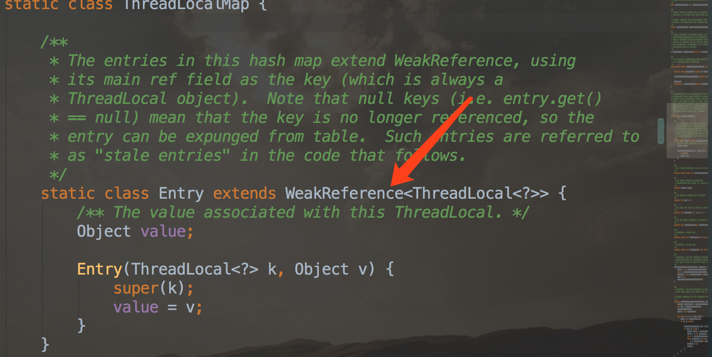

# Java中的ThreadLocal

## 前言

面试的时候被问到ThreadLocal的相关知识，没有回答好（奶奶的，现在感觉问啥都能被问倒），所以我决定先解决这几次面试中都遇到的高频问题，把这几个硬骨头都能理解的透彻的说出来了，感觉最起码不能总是一轮游。

### ThreadLocal介绍

ThreadLocal是JDK1.2开始就提供的一个用来存储线程本地变量的类。ThreadLocal中的变量是在每个线程中独立存在的，当多个线程访问ThreadLocal中的变量的时候，其实都是访问的自己当前线程的内存中的变量，从而保证的变量的线程安全。

我们一般在使用ThreadLocal的时候都是为了解决线程中存在的变量竞争问题。其实解决这类问题，通常大家也会想到使用synchronized来加锁解决。

例如在解决SimpleDateFormat的线程安全的时候。SimpleDateFormat是非线程安全的，它里面无论的是format()方法还是parse()方法，都有使用它自己内部的一个Calendar类的对象，format方法是设置时间，parse()方法里面是先调用Calendar的clear()方法，然后又调用了Calendar的set()方法（赋值），如果一个线程刚调用了set()进行赋值，这个时候又来了一个线程直接调用了clear()方法，那么这个parse()方法执行的结果就会有问题的。 **解决办法一**将使用SimpleDateformat的方法加上synchronized，这样虽然保证了线程安全，但却降低了效率，同一时间只有一个线程能使用格式化时间的方法。

```java
private static SimpleDateFormat simpleDateFormat = new SimpleDateFormat("yyyy-MM-dd HH:mm:ss");
public static synchronized String formatDate(Date date){
    return simpleDateFormat.format(date);
}
```

**解决办法二** 将SimpleDateFormat的对象，放到ThreadLocal里面，这样每个线程中都有一个自己的格式对象的副本了。互不干扰，从而保证了线程安全。

```java
private static final ThreadLocal<SimpleDateFormat> simpleDateFormatThreadLocal = ThreadLocal.withInitial(() -> new SimpleDateFormat("yyyy-MM-dd HH:mm:ss"));
public static String formatDate(Date date){
   return simpleDateFormatThreadLocal.get().format(date);
}
````

### ThreadLocal的原理

我们先看一下ThreadLocal是怎么使用的。

```java
ThreadLocal<Integer> threadLocal99 = new ThreadLocal<Integer>();
threadLocal99.set(3);
int num = threadLocal99.get();
System.out.println("数字:"+num);
threadLocal99.remove();
System.out.println("数字Empty:"+threadLocal99.get());
```

运行结果：

```java
数字:3
数字Empty:null
```

使用起来很简单，主要是将变量放到ThreadLocal里面，在线程执行过程中就可以取到，当执行完成后在remove掉就可以了，只要没有调用remove()当前线程在执行过程中都是可以拿到变量数据的。 因为是放到了当前执行的线程中，所以ThreadLocal中的变量值只能当前线程来使用，从而保证的了线程安全（当前线程的子线程其实也是可以获取到的）。

来看一下ThreadLocal的set()方法源码

```java
public void set(T value) {
   // 获取当前线程
   Thread t = Thread.currentThread();
   // 获取ThreadLocalMap
   ThreadLocal.ThreadLocalMap map = getMap(t);
   // ThreadLocalMap 对象是否为空，不为空则直接将数据放入到ThreadLocalMap中
   if (map != null)
       map.set(this, value);
   else
       createMap(t, value); // ThreadLocalMap对象为空，则先创建对象，再赋值。
}
```

我们看到变量都是存放在了ThreadLocalMap这个变量中的。那么ThreadLocalMap又是怎么来的呢？

```java
ThreadLocalMap getMap(Thread t) {
    return t.threadLocals;
}
public class Thread implements Runnable {
 ... ...
 /* ThreadLocal values pertaining to this thread. This map is maintained
     * by the ThreadLocal class. */
    ThreadLocal.ThreadLocalMap threadLocals = null;
    ... ...
}
```

通过上面的源码，我们发现ThreadLocalMap变量是当前执行线程中的一个变量，所以说，ThreadLocal中存放的数据其实都是放到了当前执行线程中的一个变量里面了。也就是存储在了当前的线程对象里了，别的线程里面是另一个线程对象了，拿不到其他线程对象中的数据，所以数据自然就隔离开了。

**那么ThreadLocalMap是怎么存储数据的呢？** ThreadLocalMap 是ThreadLocal类里的一个内部类，虽然类的名字上带着Map但却没有实现Map接口，只是结构和Map类似而已。  ThreadLocalMap内部其实是一个Entry数组，Entry是ThreadLocalMap中的一个内部类，继承自WeakReference，并将ThreadLocal类型的对象设置为了Entry的Key，以及对Key设置成弱引用。 ThreadLocalMap的内部数据结构，就大概是这样的key,value组成的Entry的数组集合。  和真正的Map还是有区别的，没有链表了，这样在解决key的hash冲突的时候措施肯定就和HashMap不一样了。 一个线程中是可以创建多个ThreadLocal对象的，多个ThreadLocal对象就会存放多个数据，那么在ThreadLocalMap中就会以数组的形式存放这些数据。 我们来看一下具体的ThreadLocalMap的set()方法的源码

```java
/**
 * Set the value associated with key.
 * @param key the thread local object
 * @param value the value to be set
 */
private void set(ThreadLocal<?> key, Object value) {
    // We don't use a fast path as with get() because it is at
    // least as common to use set() to create new entries as
    // it is to replace existing ones, in which case, a fast
    // path would fail more often than not.
    Entry[] tab = table;
    int len = tab.length;
    // 定位在数组中的位置
    int i = key.threadLocalHashCode & (len-1);
    for (Entry e = tab[i];
         e != null;
         e = tab[i = nextIndex(i, len)]) {
        ThreadLocal<?> k = e.get();
        // 如果当前位置不为空，并且当前位置的key和传过来的key相等，那么就会覆盖当前位置的数据
        if (k == key) {
            e.value = value;
            return;
        }
        // 如果当前位置为空，则初始化一个Entry对象，放到当前位置。
        if (k == null) {
            replaceStaleEntry(key, value, i);
            return;
        }
    }
    // 如果当前位置不为空，并且当前位置的key也不等于要赋值的key ，那么将去找下一个空位置，直接将数据放到下一个空位置处。
    tab[i] = new Entry(key, value);
    int sz = ++size;
    if (!cleanSomeSlots(i, sz) && sz >= threshold)
        rehash();
}
```

我们从set()方法中可以看到，处理逻辑有四步。

- 第一步先根据Threadlocal对象的hashcode和数组长度做与运算获取数据应该放在当前数组中的位置。
- 第二步就是判断当前位置是否为空，为空的话就直接初始化一个Entry对象，放到当前位置。
- 第三步如果当前位置不为空，而当前位置的Entry中的key和传过来的key一样，那么直接覆盖掉当前位置的数据。
- 第四步如果当前位置不为空，并且当前位置的Entry中的key和传过来的key 也不一样，那么就会去找下一个空位置，然后将数据存放到空位置（ **数组超过长度后，会执行扩容的** ）；

在get的时候也是类似的逻辑，先通过传入的ThreadLocal的hashcode获取在Entry数组中的位置，然后拿当前位置的Entry的Key和传入的ThreadLocal对比，相等的话，直接把数据返回，如果不相等就去判断和数组中的下一个值的key是否相等。。。

```java
private Entry getEntry(ThreadLocal<?> key) {
    int i = key.threadLocalHashCode & (table.length - 1);
    Entry e = table[i];
    if (e != null && e.get() == key)
        return e;
    else
        return getEntryAfterMiss(key, i, e);
}
/**
 * Version of getEntry method for use when key is not found in
 * its direct hash slot.
 *
 * @param  key the thread local object
 * @param  i the table index for key's hash code
 * @param  e the entry at table[i]
 * @return the entry associated with key, or null if no such
 */
private Entry getEntryAfterMiss(ThreadLocal<?> key, int i, Entry e) {
    Entry[] tab = table;
    int len = tab.length;
    while (e != null) {
        ThreadLocal<?> k = e.get();
        if (k == key)
            return e;
        if (k == null)
            expungeStaleEntry(i);
        else
            i = nextIndex(i, len);
        e = tab[i];
    }
    return null;
}
```

我们上文一直说，ThreadLocal是保存在单个线程中的数据，每个线程都有自己的数据，但是实际ThreadLocal里面的真正的对象数据，其实是保存在堆里面的，而线程里面只是存储了对象的引用而已。 并且我们在使用的时候通常需要在上一个线程执行的方法的上下文共享ThreadLocal中的变量。 例如我的主线程是在某个方法中执行代码呢，但是这个方法中有一段代码时新创建了一个线程，在这个线程里面还使用了我这个正在执行的方法里面的定义的ThreadLocal里面的变量。这个时候，就是需要从新线程里面调用外面线程的数据，这个就需要线程间共享了。这种子父线程共享数据的情况，ThreadLocal也是支持的。 例如：

```java
 ThreadLocal threadLocalMain = new InheritableThreadLocal();
 threadLocalMain.set("主线程变量");
 Thread t = new Thread() {
     @Override
     public void run() {
         super.run();
         System.out.println( "现在获取的变量是 =" + threadLocalMain.get());
     }
 };
 t.start();
```

运行结果：

```java
现在获取的变量是 =主线程变量
```

上面这样的代码就能实现子父线程共享数据的情况，重点是使用InheritableThreadLocal来实现的共享。 那么它是怎么实现数据共享的呢？ 在Thread类的init()方法中有这么一段代码：

```java
if (inheritThreadLocals && parent.inheritableThreadLocals != null)
            this.inheritableThreadLocals =ThreadLocal.createInheritedMap(parent.inheritableThreadLocals);
```

这段代码的意思是，在创建线程的时候，如果当前线程的inheritThreadLocals变量和父线程的inheritThreadLocals变量都不为空的时候，会将父线程的inheritThreadLocals变量中的数据，赋给当前线程中的inheritThreadLocals变量。

### ThreadLocal的内存泄漏问题

上文我们也提到过，ThreadLocal中的ThreadLocalMap里面的Entry对象是继承自WeakReference类的，说明Entry的key是一个弱引用。



> 弱引用是用来描述那些非必须的对象，弱引用的对象，只能生存到下一次垃圾收集发生为止。当垃圾收集器开始工作，无论当前内存是否足够，都会回收掉只被弱引用关联的对象。

**这个弱引用还是ThreadLocal对象本身，所以一般在线程执行完成后，ThreadLocal对象就会变成null了，而为null的弱引用对象，在下一次GC的时候就会被清除掉，这样Entry的Key的内存空间就被释放出来了，但是Entry的value还在占用的内存，如果线程是被复用的（例如线程池中的线程），后面也不使用ThreadLocal存取数据了，那么这里面的value值会一直存在，最终就导致了内存泄漏。 \*\*\*\* 防止内存泄漏的办法就是在每次使用完ThreadLocal的时候都去执行以下remove()方法，就可以把key和value的空间都释放了。**

### 那既然容易产生内存泄漏，为什么还要设置成弱引用的呢？

如果正常情况下应该是强引用，但是强引用只要引用关系还在就一直不会被回收，所以如果线程被复用了，那么Entry中的Key和Value都不会被回收，这样就造成了Key和Value都会发生内存泄漏了；

但是设置成弱引用，当ThreadLocal对象，没有被强引用后，就会被回收，回收后，Entry中的key就会被设置成null了，如果Thread被重复使用，只要还会用ThreadLocal存储数据，那么就会调用ThreadLocal的，set、get等方法，在调用set、get、等方法的时候，是会扫描Entry中key为null的数据的。 当发现Entry中，有key为null的数据时，会将value也设置为null，这样就将value的值也进行了回收，能进一步防止内存泄漏了，并且在进行rehash的时候，也是先清除掉key是null的数据后，如果空间还不够，才进行扩容的。

但是虽然将key设置了弱引用，但是如果一个线程被重复利用，执行完任务后，再也不使用ThreadLocal了，那么最后value值会一直存在，最终也是会导致内存泄漏的，所以使用ThreadLocal的时候，最后一定要执行remove()方法。
