# Java 面试题集锦（网络篇）

# 前言

网络编程是程序员比较少接触的技能，但是网络协议的应用却是非常常见的，比如 RPC 框架如 Dubbo 使用 Netty 进行通信，而 Netty 是一个网络编程框架，服务提供端和服务消费端正是通过 Netty 这个网络框架提供的机制进行通信的，再比如 Spring Clound 使用 HTTP 协议作为服务提供端和服务消费端的通信协议，甚至前端同学和后端同学进行联调的时候也需要熟悉 HTTP 协议。

# 1. HTTP 响应码有哪些？分别代表什么含义？

HTTP 响应码是 Web 服务器告诉客户端当前服务器的运行状况的标识。

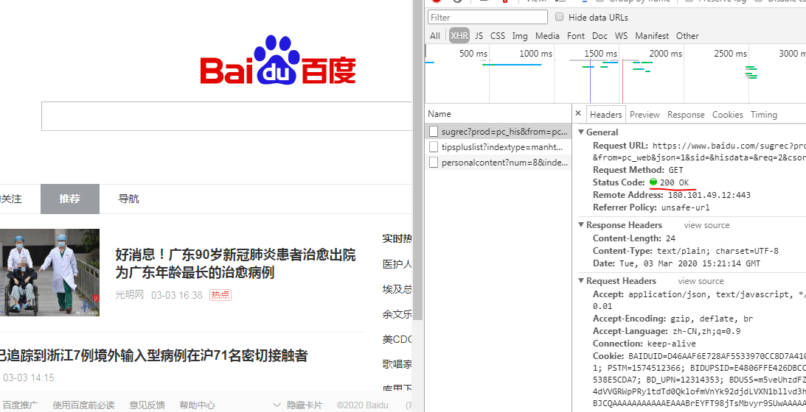

- 200：成功，Web 服务器成功处理了客户端的请求。
- 301：永久重定向，当客户端请求一个网址的时候，Web 服务器会将当前请求重定向到另一个网址，搜索引擎会抓取重定向后网页的内容并且将旧的网址替换为重定向后的网址。
- 302：临时重定向，搜索引擎会抓取重定向后网页的内容而保留旧的网址，因为搜索引擎认为重定向后的网址是暂时的。
- 400：客户端请求错误，多为参数不合法导致 Web 服务器验参失败。
- 404：未找到，Web 服务器找不到资源。
- 500：Web 服务器错误，服务器处理客户端请求的时候发生错误。
- 503：服务不可用，服务器停机。
- 504：网关超时。

# 2. Forward 和 Redirect 的区别？

- 浏览器 URL 地址：Forward 是服务器内部的重定向，服务器内部请求某个 servlet，然后获取响应的内容，浏览器的 URL 地址是不会变化的；Redirect 是客户端请求服务器，然后服务器给客户端返回了一个 302 状态码和新的 location，客户端重新发起 HTTP 请求，服务器给客户端响应 location 对应的 URL 地址，浏览器的 URL 地址发生了变化。
- 数据的共享：Forward 是服务器内部的重定向，request 在整个重定向过程中是不变的，request 中的信息在 servlet 间是共享的。Redirect 发起了两次 HTTP 请求分别使用不同的 request。
- 请求的次数：Forward 只有一次请求；Redirect 有两次请求。

# 3. 如何实现跨域？

当浏览器执行 JS 脚本的时候，会检测脚本要访问的协议、域名、端口号是不是和当前网址一致，如果不一致就是跨域。跨域是不允许的，这种限制叫做浏览器的同源策略，简单点的说法就是浏览器不允许一个源中加载脚本与其他源中的资源进行交互。那么如何实现跨域呢？

## 3.1 JSONP 方式

script、img、iframe、link、video、audio 等带有 src 属性的标签可以跨域请求和执行资源，JSONP 利用这一点“漏洞”实现跨域。

```
<script>
    var scriptTag = document.createElement('script');
    scriptTag.type = "text/javascript";
    scriptTag.src = "http://10.10.0.101:8899/jsonp?callback=f";
    document.head.appendChild(scriptTag);
</script>
```

再看下 jQuery 的写法。

```
$.ajax({
    // 请求域名
    url:'http://10.10.0.101:8899/login',
    // 请求方式
    type:'GET',
    // 数据类型选择 jsonp
    dataType:'jsonp',
    // 回调方法名
    jsonpCallback:'callback',
});
// 回调方法
function callback(response) {
  console.log(response);
}
```

JSONP 实现跨域很简单但是只支持 GET 请求方式。而且在服务器端接受到 JSONP 请求后需要设置请求头，添加 Access-Control-Allow-Origin 属性，属性值为 `*`，表示允许所有域名访问，这样浏览器才会正常解析，否则会报 406 错误。

```
response.setHeader("Access-Control-Allow-Origin", "*");
```

## 3.2 CORS 方式

CORS（Cross-Origin Resource Sharing）即跨域资源共享，需要浏览器和服务器同时支持，这种请求方式分为简单请求和非简单请求。

当浏览器发出的 XMLHttpRequest 请求的请求方式是 POST 或者 GET，请求头中只包含 Accept、Accept-Language、Content-Language、Last-Event-ID、Content-Type（application/x-www-form-urlencoded、multipart/form-data、text/plain）时那么这个请求就是一个简单请求。

对于简单的请求，浏览器会在请求头中添加 Origin 属性，标明本次请求来自哪个源（协议 + 域名 + 端口）。

```
GET
// 标明本次请求来自哪个源（协议+域名+端口）
Origin: http://127.0.0.1:8080
// IP
Host: 127.0.0.1:8080
// 长连接
Connection: keep-alive
Content-Type: text/plain
```

如果 Origin 标明的域名在服务器许可范围内，那么服务器就会给出响应：

```
  // 该值上文提到过，表示允许浏览器指定的域名访问，要么为浏览器传入的 origin，要么为 * 表示所有域名都可以访问
  Access-Control-Allow-Origin: http://127.0.0.1:8080
  // 表示服务器是否同意浏览器发送 cookie
  Access-Control-Allow-Credentials: true
  // 指定 XMLHttpRequest#getResponseHeader() 方法可以获取到的字段
  Access-Control-Expose-Headers: xxx
  Content-Type: text/html; charset=utf-8
```

`Access-Control-Allow-Credentials: true` 表示服务器同意浏览器发送 cookie，另外浏览器也需要设置支持发送 cookie，否则就算服务器支持浏览器也不会发送。

```
var xhr = new XMLHttpRequest(); 
// 设置发送的请求是否带 cookie
xhr.withCredentials = true;
xhr.open('post', 'http://10.10.0.101:8899/login', true);
xhr.setRequestHeader('Content-Type', 'text/plain');
```

另外一种是非简单请求，请求方式是 PUT 或 DELETE，或者请求头中添加了 Content-Type:application/json 属性和属性值的请求。

这种请求在浏览器正式发出 XMLHttpRequest 请求前会先发送一个预检 HTTP 请求，询问服务器当前网页的域名是否在服务器的许可名单之中，只有得到服务器的肯定后才会正式发出通信请求。

预检请求的头信息：

```
 // 预检请求的请求方式是 OPTIONS
 OPTIONS
  // 标明本次请求来自哪个源（协议+域名+端口）
  Origin: http://127.0.0.1:8080
  // 标明接下来的 CORS 请求要使用的请求方式
  Access-Control-Request-Method: PUT
  // 标明接下来的 CORS 请求要附加发送的头信息属性
  Access-Control-Request-Headers: X-Custom-Header
  // IP
  Host: 127.0.0.1:8080
  // 长连接
  Connection: keep-alive
```

如果服务器回应预检请求的响应头中没有任何 CORS 相关的头信息的话表示不支持跨域，如果允许跨域就会做出响应，响应头信息如下：

```
HTTP/1.1 200 OK
// 该值上文提到过，表示允许浏览器指定的域名访问，要么为浏览器传入的 origin，要么为 * 表示所有域名都可以访问
Access-Control-Allow-Origin:http://127.0.0.1:8080
// 服务器支持的所有跨域请求方式，为了防止浏览器发起多次预检请求把所有的请求方式返回给浏览器
Access-Control-Allow-Methods: GET, POST, PUT
// 服务器支持预检请求头信息中的 Access-Control-Request-Headers 属性值
Access-Control-Allow-Headers: X-Custom-Header
// 服务器同意浏览器发送 cookie
Access-Control-Allow-Credentials: true
// 指定预检请求的有效期是 20 天，期间不必再次发送另一个预检请求
Access-Control-Max-Age:1728000
Content-Type: text/html; charset=utf-8
Keep-Alive: timeout=2, max=100
// 长连接
Connection: Keep-Alive
Content-Type: text/plain
```

接着浏览器会像简单请求一样，发送一个 CORS 请求，请求头中一定包含 Origin 属性，服务器的响应头中也一定得包含 Access-Control-Allow-Origin 属性。

## 3.3 代理方式

跨域限制是浏览器的同源策略导致的，使用 nginx 当做服务器访问别的服务的 HTTP 接口是不需要执行 JS 脚步不存在同源策略限制的，所以可以利用 Nginx 创建一个代理服务器，这个代理服务器的域名跟浏览器要访问的域名一致，然后通过这个代理服务器修改 cookie 中的域名为要访问的 HTTP 接口的域名，通过反向代理实现跨域。

Nginx 的配置信息：

```
server {
    # 代理服务器的端口
    listen      88;
    # 代理服务器的域名
    server_name http://127.0.0.1;
    location / {
        # 反向代理服务器的域名+端口
        proxy_pass  http://127.0.0.2:89; 
        # 修改cookie里域名
        proxy_cookie_domain http://127.0.0.2 http://127.0.0.1; 
        index  index.html index.htm;
         # 设置当前代理服务器允许浏览器跨域
        add_header Access-Control-Allow-Origin http://127.0.0.1; 
        # 设置当前代理服务器允许浏览器发送 cookie
        add_header Access-Control-Allow-Credentials true;
    }
}
```

前端代码：

```
var xhr = new XMLHttpRequest();
// 设置浏览器允许发送 cookie
xhr.withCredentials = true;
// 访问 nginx 代理服务器
xhr.open('get', 'http://127.0.0.1:88', true);
xhr.send();
```

# 5. get 和 post 请求有哪些区别？

用途：

- get 请求用来从服务器获取资源
- post 请求用来向服务器提交数据

表单的提交方式：

- get 请求直接将表单数据以 `name1=value1&name2=value2` 的形式拼接到 URL 上（<http://www.baidu.com/action?name1=value1&name2=value2%EF%BC%89%EF%BC%8C%E5%A4%9A%E4%B8%AA%E5%8F%82%E6%95%B0%E5%8F%82%E6%95%B0%E5%80%BC%E9%9C%80%E8%A6%81%E7%94%A8> & 连接起来并且用 `?` 拼接到 action 后面；
- post 请求将表单数据放到请求头或者请求的消息体中。

传输数据的大小限制：

- get 请求传输的数据受到 URL 长度的限制，而 URL 长度是由浏览器决定的；
- post 请求传输数据的大小理论上来说是没有限制的。

参数的编码：

- get 请求的参数会在地址栏明文显示，使用 URL 编码的文本格式传递参数；
- post 请求使用二进制数据多重编码传递参数。

缓存：

- get 请求可以被浏览器缓存被收藏为标签；
- post 请求不会被缓存也不能被收藏为标签。

# 6. 简述 TCP 和 UDP 的区别？

TCP 和 UDP 都是传输层的网络协议，主要用途在于不同服务器的应用进程间的通信。

连接维护：

- TCP 是面向连接的，在不同服务器的应用进程建立通信连接的时候需要三次握手，断开连接的时候需要四次挥手，而且连接提供的是点对点的全双工服务；
- UDP 是无连接通信协议，以广播的形式向外发送数据，因为不需要建立连接所以不需要维护连接状态需要的资源少，可以做到快速响应时延低。

可靠性：

- TCP 提供了可靠的数据传输，支持流量控制和拥塞控制，为不丢包提供了可靠性的技术，如果发送方收到了数据发送失败的通知会再次进行发送，直到数据被接收到，同时保证了发送的数据包的顺序性和不重复的特性；
- UDP 提供了不可靠的数据传输，不支持流量控制和拥塞控制，发送的数据包发送失败不会收到通知，而是在一段固定的时间等待接受方是否回复信息判断上次的数据包是否发送成功，如果这段时间没有收到接受方的回复就会重新发送数据包，但是仍然无法解决丢包的问题和发送包的顺序性问题。

数据传输方式：

- TCP 是基于字节流进行传输的，传输时会将数据进行分组，然后在接收端对分组后的信息重组，这种传输方式会带来粘包问题；
- UDP 是基于数据报进行传输的。

接下来通过执行 UDP 服务端和客户端通信的测试用例和 TCP 服务端和客户端通信的测试用例，更直观的了解下这两种通信方式的区别。

UDP 服务端代码：

```
// UDPServerTest.java
public class UDPServerTest {
    public static void main(String[] args) throws Exception {
        DatagramSocket serverSocket = new DatagramSocket(8888);
        byte[] readyToSendData;
        SimpleDateFormat formatter = new SimpleDateFormat("yyyy-MM-dd HH:mm:ss");
        while (true) {
            byte[] receiveData = new byte[1024];
            // 创建接收数据报，接受来自客户端的数据
            DatagramPacket fromClientDataPacket = new DatagramPacket(receiveData, receiveData.length);
            // 监听客户端是否发送了数据包
            serverSocket.receive(fromClientDataPacket);
            // 获取客户端数据包的内容
            String data = new String(fromClientDataPacket.getData());
            // 获取客户端 IP 地址
            InetAddress address = fromClientDataPacket.getAddress();
            if (data != null) {
                System.out.println("【"+formatter.format(new Date()) + "】 receive data from client[" + address + "]: " + data );
            }
            // 获得客户端端口号
            int port = fromClientDataPacket.getPort();
            // 将获取到的数据包的内容转为大写
            String upperData = data.toUpperCase();
            readyToSendData = upperData.getBytes();
            // 创建发送数据报，用来向客户端发送数据
            DatagramPacket readyToSendPacket = new DatagramPacket(readyToSendData, readyToSendData.length, address, port);
            //向客户端发送数据报包
            serverSocket.send(readyToSendPacket);
        }
    }
}
```

UDP 客户端代码：

```
// UDPClientTest.java
public class UDPClientTest {
    public static void main(String[] args) throws Exception {
        DatagramSocket clientSocket = new DatagramSocket();
        // 监听 console 的文字输入
        BufferedReader inputFromConsole = new BufferedReader(new InputStreamReader(System.in));
        // 获取 client 端的 IP 地址
        InetAddress adress = InetAddress.getLocalHost();
        byte[] readyToSendData;
        byte[] receiveData = new byte[1024];
        while (true) {
            String input = inputFromConsole.readLine();
            if (input.equals("exit")) break;
            readyToSendData = input.getBytes();
            // 创建发送数据报，用来向服务端发送数据
            DatagramPacket readyToSendPacket = new DatagramPacket(readyToSendData, readyToSendData.length, adress, 8888);
            //发送数据报包
            clientSocket.send(readyToSendPacket);
            // 创建接收数据报，接收来自服务端的数据
            DatagramPacket receivePacket = new DatagramPacket(receiveData, receiveData.length);
            // 监听服务端是否发来了数据包
            clientSocket.receive(receivePacket);
            String data = new String(receivePacket.getData());
            System.out.println("Server reply: " + data);
        }
        clientSocket.close();
    }
}
```

UDP 服务端执行结果：


UDP 客户端执行结果：

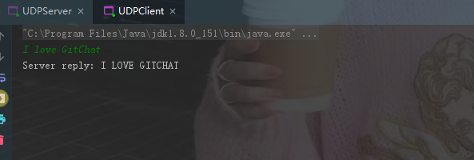

TCP 服务端代码：

```
// TCPServerTest.java
public class TCPServerTest {
    public static void main(String[] args) throws Exception {
        String data;
        String upperData;
        SimpleDateFormat dataFormatter = new SimpleDateFormat("yyyy-MM-dd HH:mm:ss");
        ServerSocket serverSocket = new ServerSocket(8888);
        while(true) {
            // 接受客户端的连接
            Socket socket = serverSocket.accept();
            // 输入流，保存接收到的数据
            BufferedReader isFromClient = new BufferedReader(new InputStreamReader(socket.getInputStream()));
            // 输出流，用于向外发送数据
            DataOutputStream dos = new DataOutputStream(socket.getOutputStream());
            // 获取客户端数据
            data = isFromClient.readLine();
            if (data != null) {
                System.out.println("【" + dataFormatter.format(new Date()) + "】 receive data from client[" + socket.getInetAddress() + "]: " + data );
            }
            upperData = data.toUpperCase() + '\n';
            //向客户端发送修改后的字符串
            dos.writeBytes(upperData);
        }
    }
}
```

TCP 客户端代码：

```
// TCPClientTest.java
public class TCPClientTest {
    public static void main(String[] args) throws Exception {
        String input;
        String data;
        while (true) {
            // 监听 console 的文字输入
            BufferedReader inputFromConsole = new BufferedReader(new InputStreamReader(System.in));
            Socket clientSocket = new Socket("127.0.0.1", 8888);
            // 输出流，用于向外发送数据
            DataOutputStream readyToSendDos = new DataOutputStream(clientSocket.getOutputStream());
            // 输入流，保存接收到的数据
            BufferedReader receiveFromServer = new BufferedReader(new InputStreamReader(clientSocket.getInputStream()));
            input = inputFromConsole.readLine();
            if (input.equals("exit")) break;
            // 向服务器发送数据
            readyToSendDos.writeBytes(input + '\n');
            // IO 阻塞等待服务端的响应
            data = receiveFromServer.readLine();
            System.out.println("Server reply: " + data);
            clientSocket.close();
        }
    }
}
```

TCP 服务端执行结果：

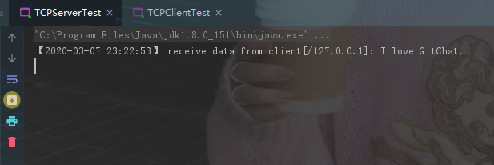

TCP 客户端执行结果：


# 7. TCP 为什么要三次握手，两次不行吗？为什么？

- TCP 客户端和服务端建立连接需要三次握手，首先服务端需要开启监听，等待客户端的连接请求，这个时候服务端处于“收听”状态；
- 客户端向服务端发起连接，选择 `seq=x` 的初始序列号，此时客户端处于“同步已发送”的状态；
- 服务端收到客户端的连接请求，同意连接并向客户端发送确认，确认号是 `ack=x+1` 表示客户端可以发送下一个数据包序号从 `x+1` 开始，同时选择 `seq=y` 的初始序列号，此时服务端处于“同步收到”状态；
- 客户端收到服务端的确认后，向服务端发送确认信息，确认号是 `ack=y+1` 表示服务端可以发送下一个数据包序号从 `y+1` 开始，此时客户端处于“已建立连接”的状态；
- 服务端收到客户端的确认后，也进入“已建立连接”的状态。

从三次握手的过程可以看出如果只有两次握手，那么客户端的起始序列号可以确认，服务端的起始序列号将得不到确认。

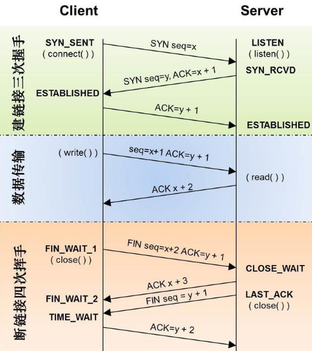

# 8. 说一下 TCP 粘包是怎么产生的？怎么解决粘包问题的？

上文中讲 TCP 和 UDP 区别的时候提到 TCP 传输数据基于字节流，从应用层到 TCP 传输层的多个数据包是一连串的字节流是没有边界的，而且 TCP 首部并没有记录数据包的长度，所以 TCP 传输数据的时候可能会发送粘包和拆包的问题；而 UDP 是基于数据报传输数据的，UDP 首部也记录了数据报的长度，可以轻易的区分出不同的数据包的边界。

接下来看下 TCP 传输数据的几种情况，首先第一种情况是正常的，既没有发送粘包也没有发生拆包。


第二种情况发生了明显的粘包现象，这种情况对于数据接收方来说很难处理。


接下来的两种情况发生了粘包和拆包的现象，接收端收到的数据包要么是不完整的要么是多出来一块儿。


造成粘包和拆包现象的原因：

- TCP 发送缓冲区剩余空间不足以发送一个完整的数据包，将发生拆包；
- 要发送的数据超过了最大报文长度的限制，TCP 传输数据时进行拆包；
- 要发送的数据包小于 TCP 发送缓冲区剩余空间，TCP 将多个数据包写满发送缓冲区一次发送出去，将发生粘包；
- 接收端没有及时读取 TCP 发送缓冲区中的数据包，将会发生粘包。

粘包拆包的解决方法：

- 发送端给数据包添加首部，首部中添加数据包的长度属性，这样接收端通过首部中的长度字段就可以知道数据包的实际长度啦；
- 针对发送的数据包小于缓冲区大小的情况，发送端可以将不同的数据包规定成同样的长度，不足这个长度的补充 0，接收端从缓冲区读取固定的长度数据这样就可以区分不同的数据包；
- 发送端通过给不同的数据包添加间隔符合确定边界，接收端通过这个间隔符合就可以区分不同的数据包。

# 9. TCP 如何保证可靠性

**序列号和确认号机制： **TCP 发送端发送数据包的时候会选择一个 seq 序列号，接收端收到数据包后会检测数据包的完整性，如果检测通过会响应一个 ack 确认号表示收到了数据包。** 超时重发机制： **TCP 发送端发送了数据包后会启动一个定时器，如果一定时间没有收到接受端的确认后，将会重新发送该数据包。** 对乱序数据包重新排序： **从 IP 网络层传输到 TCP 层的数据包可能会乱序，TCP 层会对数据包重新排序再发给应用层。** 丢弃重复数据： **从 IP 网络层传输到 TCP 层的数据包可能会重复，TCP 层会丢弃重复的数据包。** 流量控制：**

TCP 发送端和接收端都有一个固定大小的缓冲空间，为了防止发送端发送数据的速度太快导致接收端缓冲区溢出，发送端只能发送接收端可以接纳的数据，为了达到这种控制效果，TCP 用了流量控制协议（可变大小的滑动窗口协议）来实现。

# 10. 拥塞控制与流量控制的区别？

- 流量控制是为了防止发送端发送数据过快把接收端的缓存填满，引入滑动窗口来控制流量；
- 拥塞控制是为了防止当网络发生拥塞的时候控制发送的速率，引入拥塞窗口来来反映网络传输能力，窗口变量记做 cwnd。

先来看下流量控制的原理，下图为 TCP 发送端的发送情况：

- 红色的数据包表示发送已确认的包；
- 绿色的数据包表示发送未确认的包；
- 蓝色的数据包表示已经准备好但是未发送的包；
- 紫色的数据包表示没有准备好不可以发送的包；

可以看到滑动窗口的固定大小是 5，滑动窗口的大小等于未确认的包 + 已经准备好但是未发送的包，每次收到 ACK 就会增加一个红色的数据包，然后滑动窗口向右移动一位，即最左边的绿色数据包移出滑动窗口变成红色，下一个紫色的数据包进入滑动窗口变成蓝色准备发送。


再看下接收端的接收情况：

- 红色的数据包表示接收已确认的包；
- 绿色的数据包表示等待接收和未确认的包；
- 紫色的数据包表示不能接收的包；

在接收端这边可以看到滑动窗口内有一个虚线的数据包，表示该数据包还没有收到，该数据包可能发生了丢包的情况或者乱序了，这个时候接收端会先将该数据包缓存着，等待发送端超时重发。


当发送端发送数据包速度过快，导致接收端的缓存空间不够用，或者接收端一直不读取缓存空间中的数据包，接收端可以改变滑动窗口的大小甚至变为 0，让发送端停止发送数据包，从下图可以看出滑动窗口并没有向右移动，而是滑动窗口左边界向右移动了一格。


这种情况下接收端的滑动窗口的大小变成了 0，发送端也不再发送新的数据包，但是发送端会定时发送窗口探测数据包，和接收端商量是否可以改变滑动窗口的大小，接收端在窗口大小比较小的情况下不会立马回复发送端可以改变窗口大小，而是等到接收端的缓存空间为空的时候再改变窗口大小。


接下来再分析下拥塞控制的原理，先看下图这种极端情况，管道中能容纳 6 个数据包，有 3 个未接收的数据包和 3 个 ack 数据包，正好把管道撑满，如果再往管道中发送数据，那么数据包会被缓存在设备中增加时延或者丢弃多余的包，而 TCP 面对丢包的问题只能重发数据，重发数据又导致了更严重的延迟和更多的丢包，从而造成恶心循环，而拥塞控制就是为了处理时延带来的超时重传和丢包问题的。

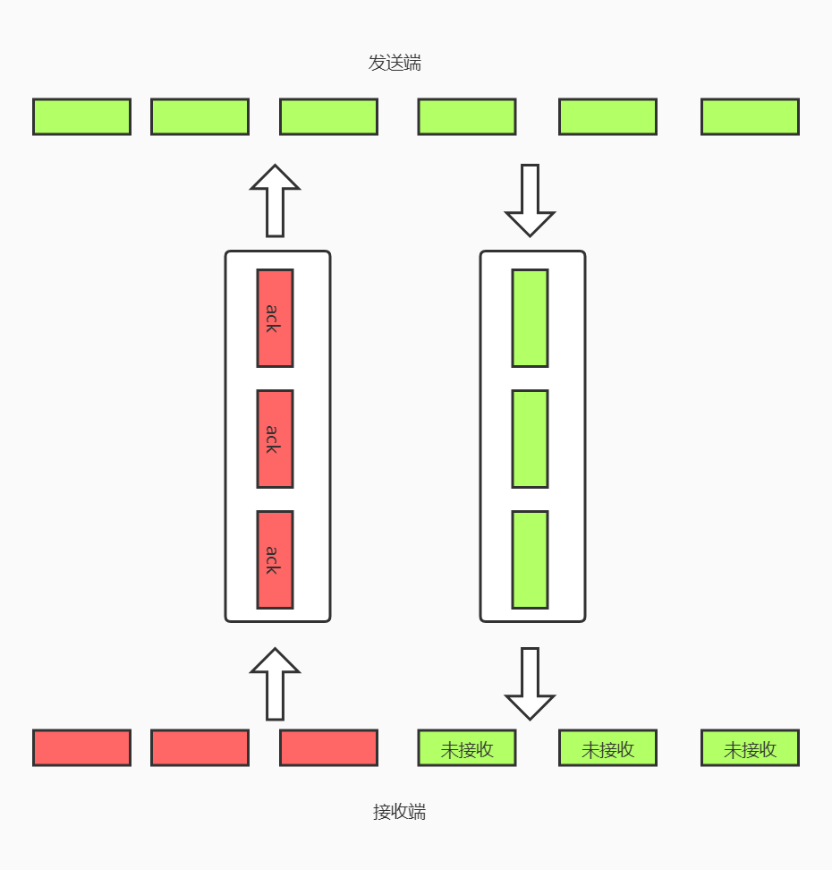

先来看下拥塞窗口和发送端实际可用的窗口大小的联系：

- 发送端实际可用窗口大小 = min{awnd, cwnd}；
- 其中 awnd 表示接收端的窗口大小，cwnd 表示拥塞窗口的大小，当发生超时重传的时候拥塞窗口的值会急剧的变小，发送端窗口的大小也跟着急剧变小，从而控制了发送端发出的数据量。

如下图所示，拥塞控制一共有 4 个算法。

**慢开始：**

- 当一个 TCP 连接刚启动的时候，或者是超时重传导致的丢包时，需要执行慢开始，慢开始会初始化 cwnd = 1 MSS（初始化窗口值）；
- 然后一点点提速，每当发送端收到一个 ack，cwnd 就会扩大一倍，cwnd = 2^k（k 代表轮次）呈现出指数上升。当遇到 ssthresh（slow start threshold）阈值的时候，就会进入拥塞避免状态，之后呈现线性分布。

**拥塞避免： **当 cwnd 增长过快并且超过了 ssthresh 阈值的话，为了防止网络拥塞，将会进入拥塞避免状态，cwnd 呈现线性增长。** 超时重传： **当遇到超时重传导致的丢包的时候，ssthresh = 当前 cwnd/2，cwnd 值重置为 1，然后重新进入慢开始状态。** 快速恢复：**

- 当执行慢开始的时候，收到了 3 个重复的 ack 包，表示现在的网络环境没有那么拥塞了，可以进入快速恢复的状态啦；
- 这个时候 ssthresh = 当前 cwnd/2，cwnd 重置为新的 ssthresh，即 cwnd = ssthresh ，然后进入拥塞避免状态。

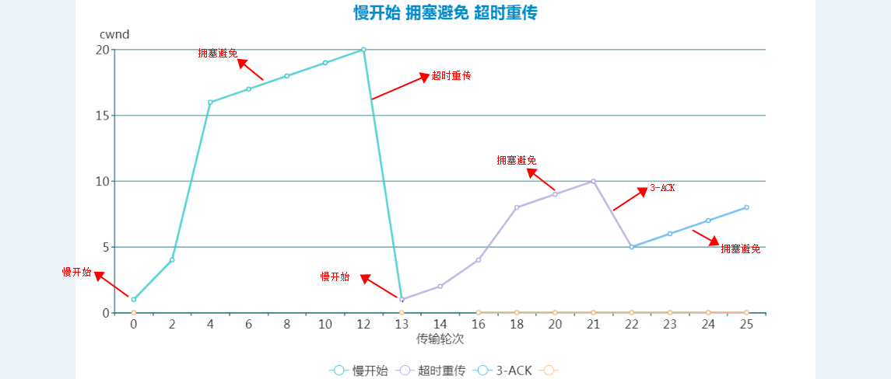

# 11. OSI 的七层模型都有哪些？

- 应用层：各种应用程序协议，比如 HTTP、HTTPS、FTP、SOCKS 安全套接字协议、DNS 域名系统、GDP 网关发现协议等等。
- 表示层：加密解密、转换翻译、压缩解压缩，比如 LPP 轻量级表示协议。
- 会话层：不同机器上的用户建立和管理会话，比如 SSL 安全套接字层协议、TLS 传输层安全协议、RPC 远程过程调用协议等等。
- 传输层：接受上一层的数据，在必要的时候对数据进行分割，并将这些数据交给网络层，保证这些数据段有效到达对端，比如 TCP 传输控制协议、UDP 数据报协议。
- 网络层：控制子网的运行：逻辑编址、分组传输、路由选择，比如 IP、IPV6、SLIP 等等。
- 数据链路层：物理寻址，同时将原始比特流转变为逻辑传输路线，比如 XTP 压缩传输协议、PPTP 点对点隧道协议等等。
- 物理层：机械、电子、定时接口通信信道上的原始比特流传输，比如 IEEE802.2 等等。

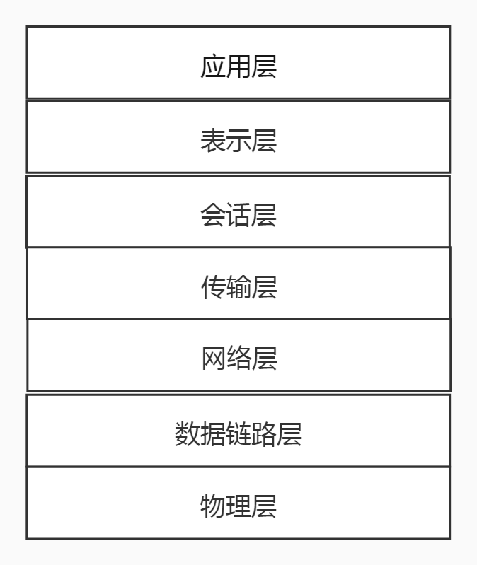

# 12. 网络浏览器访问一个网址的整个过程？

\\1. 应用层的 DNS 域名解析协议将网址解析为 IP 地址。

浏览器会先查看缓存中有没有 DNS 解析过的这个 IP 地址，如果有的话就不会查询 DNS 服务；如果没有就查看操作系统的 hosts 文件是 否有 DNS 解析过的这个 IP 地址；如果还是没有的话就会向 DNS 服务器发送数据包对域名进行解析，找到解析后的 IP 地址后返回客户端。

\\2. 浏览器得到网址对应的服务器的 IP 地址后，通过与服务器三次握手建立 TCP 连接。

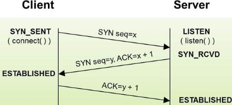

\\3. 浏览器与服务器建立好 TCP 连接后，就会发送 HTTP 请求。

- 首先在应用层会封装一个 HTTP 请求，包括通用头、请求头和报文主体等；
- 然后在传输层会将 HTTP 数据包嵌入到 TCP 报文段中；
- 然后在网络层将 TCP 数据包嵌入到 IP 报文段中；
- 最后将 IP 数据包嵌入到以太网数据包中在网络中传输。

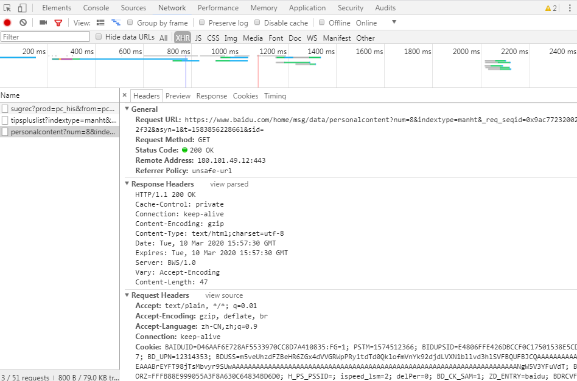

\\4. 服务器处理浏览器发送的 HTTP 请求。

浏览器向 Web 服务器如 Nginx 发送 HTTP 请求，Nginx 将请求转发给 Tomcat 服务器，Tomcat 服务器请求 MySQL、Redis 等 DB 服务器，得到结果后将 Velocity 模板引擎和数据整合，将生成的静态页面文件通过 Nginx 返回给浏览器。


\\5. 服务器返回响应结果。

在响应头中返回了 HTTP 状态码、HTTP 协议版本、是否为长连接、文本编码类型、日期等等。

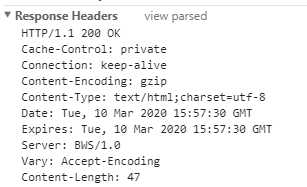

\\6. 浏览器和者服务器通过四次挥手关闭 TCP。

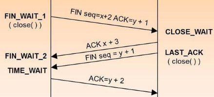

\\7. 浏览器解析 HTML、CSS、JS 等进行页面渲染。

# 14. 域名解析详细过程

1. 浏览器访问 \<www.baidu.com，询问本地> DNS 服务器是否缓存了该网址解析后的 IP 地址。
1. 如果本地 DNS 服务器没有缓存的话，就去 root-servers.net 根服务器查询该网址对应的 IP 地址。
1. 根服务器返回顶级域名服务器的网址 gtld-servers.net，然后本地 DNS 服务器去顶级域名服务器查询该网址对应的 IP 地址。
1. 顶级域名服务器返回 \<www.baidu.com> 主区域服务器的地址，然后本地 DNS 服务器去 \<www.baidu.com> 主区域服务器查询此域名对应的 IP 地址。
1. 本地 DNS 服务器拿到 \<www.baidu.com> 解析后的 IP 地址后，缓存起来以便备查，然后把解析后的 IP 地址返回给浏览器。

# 15. IP 地址分为几类，每类都代表什么，私网是哪些？

大致上分为公共地址和私有地址两大类，公共地址可以在外网中随意访问，私有地址只能在内网访问只有通过代理服务器才可以和外网通信。

公共地址：

```
1.0.0.1～126.255.255.254
128.0.0.1～191.255.255.254
192.0.0.1～223.255.255.254
224.0.0.1～239.255.255.254
240.0.0.1～255.255.255.254
```

私有地址：

```
10.0.0.0～10.255.255.255
172.16.0.0～172.31.255.255
192.168.0.0～192.168.255.255
```

- 0.0.0.0 路由器转发使用
- 127.x.x.x 保留
- 255.255.255.255 局域网下的广播地址

# 16. 计算机网络中的同步和异步

- 异步传输是面向字符的传输，同步传输是面向数据帧（比特组）的传输；
- 异步传输中每个字符都有起始位和停止位，由于每个信息都加了“同步”信息，导致传输负载加大，所以异步传输常用于低速的设备；
- 同步通过从数据帧中抽取同步信息，通过特定的时钟线路协调时序，由于同步信息占用数据帧的百分比比较小，所以开销比异步小效率比异步高。

# 总结

网络编程在最近几年的面试题中出现的频率越来越频繁，深入理解网络通信协议也将变得刻不容缓。
