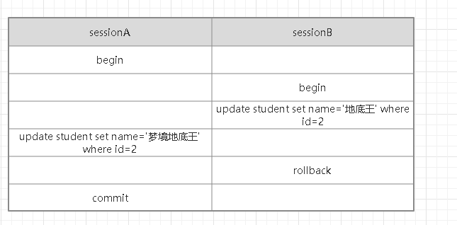
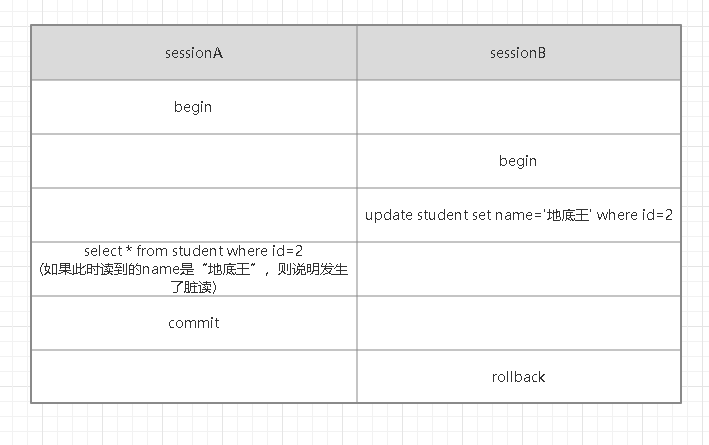
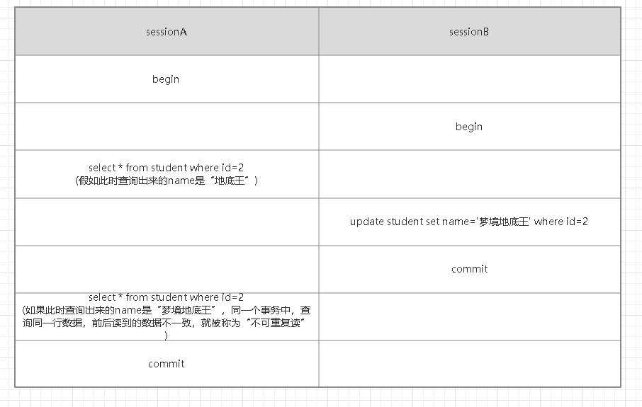
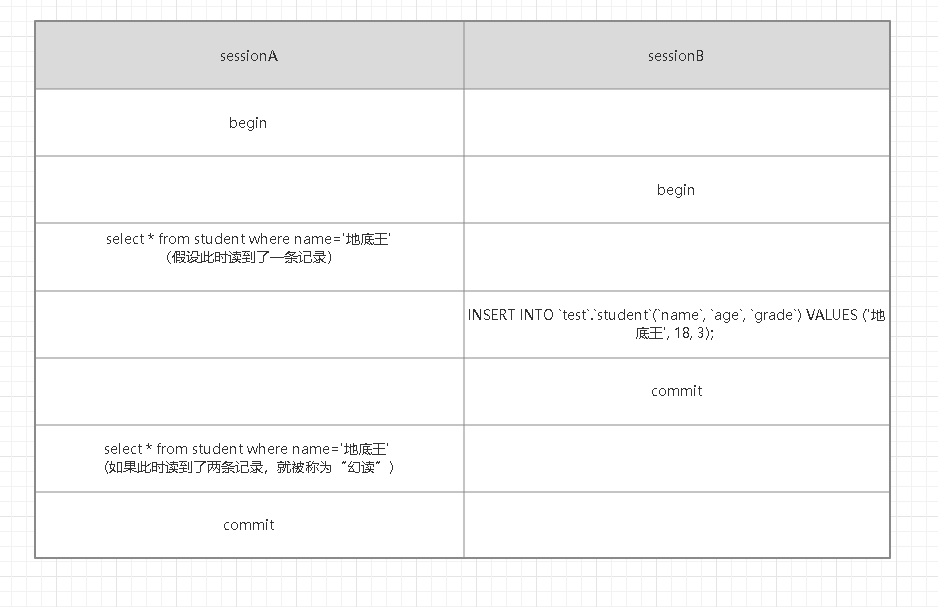
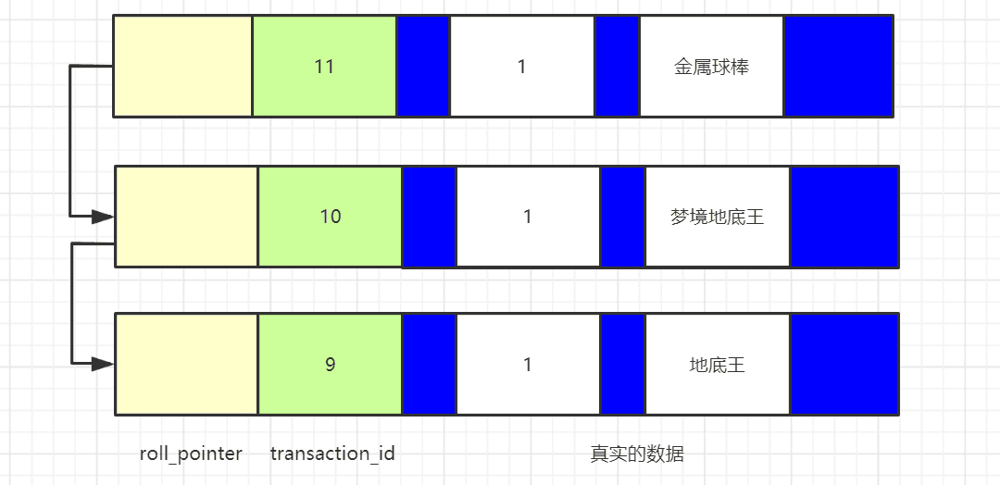
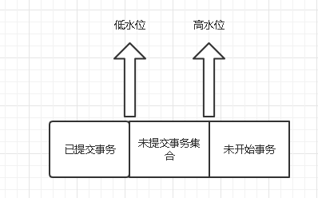
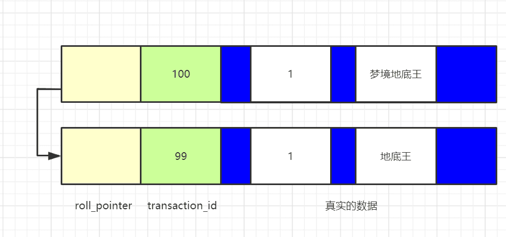

MySQL中的事务和MVCC
==============

虽然我们不是DBA，可能对数据库没那么了解，但是对于数据库中的索引、事务、锁，我们还是必须要有一个较为浅显的认识，今天我就和大家聊聊事务。

### 为什么要有事务

说到事务，不得不提到转账的事情，几乎所有的关于事务的文章都会提到这个老掉牙的案例，我也不例外。

转账在数据库层面可以简单的抽象成两个部分：

* 从自己的账户中扣除转账金额；
* 往对方账户中增加转账金额。

如果先从自己的账户中扣除转账金额，再往对方账户中增加转账金额，扣除执行成功，增加执行失败，那自己的账户白白少了100块，欲哭无泪。

如果先往对方账户中增加转账金额，再从自己的账户中扣除转账金额，增加执行成功，扣除执行失败，那对方账户白白增加了100块，自己的账户也没有扣钱，喜大普奔。

不管是让你欲哭无泪，还是喜大普奔，银行都不会容忍这样的事情发生，他们会引入事务来解决这类问题。

### 事务的特性

1. 原子性（Atomicity）：事务包含的所有操作要么全部成功（提交），要么全部失败（回滚）。
2. 一致性（Consistency）：事务的执行的前后数据的完整性保持一致。
3. 隔离性（Isolation）：一个事务执行的过程中，不应该受到其他事务的干扰。
4. 持久性（Durability）：事务一旦结束，数据就持久到数据库，即使提交后，数据库发生崩溃，也不会丢失提交的数据。

四种特性，简称ACID，其中最不好理解的就是一致性，有不少人认为原子性、隔离性、持久性就是为了保证一致性，我们也不搞学术研究，一致性到底该怎么解释，到底怎么定义一致性，就看各位看官的了。

### 事务的隔离级别

从某个角度来说，我们可以控制的、或者说需要研究的只有隔离性这一个特性，而要控制隔离性，几乎只有调整隔离级别这一个手段，下面我们就来看看事务的隔离级别。

数据库是一个客户端/服务器架构的软件，每个客户端与服务器连接后，就会产生一个session（会话），客户端和服务器的交互就是在session中进行的，理论上来说，如果服务器同时只能处理一个事务，其他的事务都排队等待，当该事务提交后，服务器才处理下一个事务，这样才真正具有“隔离性”，什么问题都没有了，但是如果是这样，性能就太差了，在性能和隔离性之间，只能做一些平衡，所以数据库提供了好几个隔离级别供我们选择。

在讲隔离级别之前，我们先来看看事务并发执行会遇到什么问题。

为了保证下面的叙述可以顺利进行，我们要先建一张表：

```
CREATE TABLE `student` (
  `id` int(11) unsigned NOT NULL AUTO_INCREMENT,
  `name` varchar(50) DEFAULT NULL COMMENT '姓名',
  `age` int(11) DEFAULT NULL COMMENT '年龄',
  `grade` int(11) DEFAULT NULL COMMENT '年级',
  PRIMARY KEY (`id`)
) ENGINE=InnoDB AUTO_INCREMENT=3 DEFAULT CHARSET=utf8mb4;
```

#### 脏写

 如图所示：

1. sessionA和sessionB开启了一个事务；
2. sessionB把id=2的name修改成了“地底王”；
3. sessionA把id=2的name修改成了“梦境地底王”；
4. sessionB回滚了事务；
5. sessionA提交了事务。

如果sessionB在回滚事务的时候把sessionA的修改也给回滚了，导致sessionA的提交丢失了，这种现象就被称为“脏写”。sessionA会一脸懵逼，我明明修改了数据，也提交了数据，为什么数据没有变化呢。

#### 脏读

 如图所示：

1. sessionA和sessionB开启了一个事务；
2. sessionB把id=2的name修改成了“地底王”，此时还未提交；
3. sessionA查询了id=2的数据，如果读出来的数据的name是“地底王”，也就是读到了sessionB还没有提交的数据，就被称为“脏读”。

#### 不可重复读

 如图所示：

1. sessionA和sessionB开启了一个事务；
2. sessionA查询id=2的数据，假如name是“地底王”，
3. sessionB把id=2的name修改成了“梦境地底王”，随后提交了事务；
4. sessionA再一次查询了id=2的数据，如果name是“梦境地底王”，说明在同一个事务中，sessionA前后读到的数据不一致，就被称为“不可重复读”。

#### 幻读

 如图所示：

1. sessionA和sessionB开启了一个事务；
2. sessionA查询name=“地底王”的数据，假设此时读到了一条记录；
3. sessionB又插入一条name=“地底王”的数据，随后提交；
4. seesionA再一次查询name=“地底王”的数据，如果此时读到了两条记录，第二次查询读到了第一次查询未查询出来的数据，就被称为“幻读”。

#### 四种隔离级别

我们知道了在并发执行事务的时候，会遇到什么问题，有些问题比较严重，有些问题比较轻微，一般来说，我们认为按照严重性排序是这样的：

脏写>脏读>不可重复读>幻读

在SQL标准定义中，设定了四种隔离级别，来解决上述的问题：

* 未提交读（READ UNCOMMITTED）： 最低的隔离级别，会有“脏读”、“不可重复读”，“幻读”三个问题。
* 读已提交（READ COMMITTED）： SQLServer默认隔离级别，可以避免“脏读”，会有“不可重复读”，“幻读”两个问题。
* 可重复读（REPEATABLE READ）： 可以避免“脏读”，“不可重复读”两个问题，会有“幻读”问题。 MySQL默认隔离级别，但是在MySQL中，此隔离级别解决了“幻读”问题。
* 串行化（SERIALIZABLE）： 所有的问题都不会发生。

因为脏写的问题实在太严重了，在任何隔离级别下，都不会有脏写的问题。

### MVCC

前面说的都是开胃菜，相信大部分小伙伴对于上述内容都是手到擒来，所以我连如何修改事务隔离级别都没有介绍，各种实验也都没有做，就是要把大量的时间、文字投入到这一部分内容中来。

MVCC，全称是Mutil-Version Concurrency Control，翻译成中文是多版本并发控制，MySQL就利用了MVCC来判断在一个事务中，哪个数据可以被读出来，哪个数据不能被读出来。

#### 多版本

在看MVCC之前，我们有必要知道另外一个知识点，数据库存储一行行数据，是分为两个部分来存储的，一个是数据行的额外信息（本篇博客不涉及），一个是真实的数据记录，MySQL会为每一行真实数据记录添加两三个隐藏的字段：

* row\_id 非必须，如果表中有自定义的主键或者有Unique键，就不会添加row\_id字段，如果两者都没有，MySQL会“自作主张”添加row\_id字段。
* transaction\_id 必须，事务Id，代表这一行数据是由哪个事务id创建的。
* roll\_pointer 必须，回滚指针，指向这行数据的上一个版本。

如下图所示： 

在这里需要着重说明下事务id，当我们开启一个事务，并不会马上获得事务id，哪怕我们在事务中执行select语句，也是没有事务id的（事务id为0），只有执行insert/update/delete语句才能获得事务id，这一点尤为重要。

其中和MVCC紧密相关的是transaction\_id和roll\_pointer两个字段，在开发过程中，我们无需关心，但是要研究MVCC，我们必须关心。

如果有类似这样的一行数据：  代表这行数据是由transaction\_id为9的事务创建出来的，roll\_pointer是空的，因为这是一条新纪录。

_实际上，roll\_pointer并不是空的，如果真要解释，需要绕一大圈，理解成空的，问题也不大。_

当我们开启事务，对这条数据进行修改，会变成这样： 

有点感觉了吧，这就像一个单向链表，称之为“版本链”，最上面的数据是这个数据的最新版本，roll\_pointer指向这个数据的旧版本，给人的感觉就是一行数据有多个版本，是不是符合“多版本并发控制”中的“多版本”这个概念， 那么“并发控制”又是怎么做到的呢，别急，继续往下看。

#### ReadView

哎，下面又要引出一个新的概念：ReadView。

对于READ UNCOMMITTED来说，可以读取到其他事务还没有提交的数据，所以直接把这个数据的最新版本读出来就可以了，对于SERIALIZABLE来说，是用加锁的方式来访问记录。

剩下的就是READ COMMITTED和REPEATABLE READ，这两个事务隔离级别都要保证读到的数据是其他事务已经提交的，也就是不能无脑把一行数据的最新版本给读出来了，但是这两个还是有一定的区别，最核心的问题就在于“我到底可以读取这个数据的哪个版本”。

为了解决这个问题，ReadView的概念就出现了，ReadView包含四个比较重要的内容：

* m\_ids：表示在生成ReadView时，系统中活跃的事务id集合。
* min\_trx\_id：表示在生成ReadView时，系统中活跃的最小事务id，也就是 m\_ids中的最小值。
* max\_trx\_id：表示在生成ReadView时，系统应该分配给下一个事务的id。
* creator\_trx\_id：表示生成该ReadView的事务id。

有了这个ReadView，只要按照下面的判断方式就可以解决“我到底可以读取这个数据的哪个版本”这个千古难题了：

* 如果被访问的版本的trx\_id和ReadView中的creator\_trx\_id相同，就意味着当前版本就是由你“造成”的，可以读出来。
* 如果被访问的版本的trx\_id小于ReadView中的min\_trx\_id，表示生成该版本的事务在创建ReadView的时候，已经提交了，所以该版本可以读出来。
* 如果被访问版本的trx\_id大于或等于ReadView中的max\_trx\_id值，说明生成该版本的事务在当前事务生成ReadView后才开启，所以该版本不可以被读出来。
* 如果生成被访问版本的trx\_id在min\_trx\_id和max\_trx\_id之间，那就需要判断下trx\_id在不在m\_ids中：如果在，说明创建ReadView的时候，生成该版本的事务还是活跃的（没有被提交），该版本不可以被读出来；如果不在，说明创建ReadView的时候，生成该版本的事务已经被提交了，该版本可以被读出来。

如果某个数据的最新版本不可以被读出来，就顺着roll\_pointer找到该数据的上一个版本，继续做如上的判断，以此类推，如果第一个版本也不可见的话，代表该数据对当前事务完全不可见，查询结果就不包含这条记录了。

看完上面的描述，是不是觉得“云里雾里”，“不知所云”，甚至“脑阔疼，整个人都不好了”。

我们换个方法来解释，看会不会更容易理解点：  在事务启动的一瞬间（执行CURD操作），会创建出ReadView，对于一个数据版本的trx\_id来说，有以下三种情况：

* 如果落在低水位，表示生成这个版本的事务已经提交了，或者是当前事务自己生成的，这个版本可见。
* 如果落在高水位，表示生成这个版本的事务是未来才创建的，这个版本不可见。
* 如果落在中间水位，包含两种情况： a. 如果当前版本的trx\_id在活跃事务列表中，代表这个版本是由还没有提交的事务生成的，这个版本不可见； b. 如果当前版本的trx\_id不在活跃事务列表中，代表这个版本是由已经提交的事务生成的，这个版本可见。

上面我比较简单的解释了下ReadView，用了两种方式来说明如何判断当前数据版本是否可见，不知道各位看官是不是有了一个比较模糊的概念，有了ReadView的基本概念，我们就可以具体看下READ COMMITTED、REPEATABLE READ这两个事务隔离级别为什么读到的数据是不同的，以及上述规则是如何应用的。

#### READ COMMITTED——每次读取数据都会创建ReadView

假设，现在系统只有一个活跃的事务T，事务id是100，事务中修改了数据，但是还没有提交，形成的版本链是这样的： 

现在A事务启动，并且执行了select语句，此时会创建出一个ReadView，m\_ids是【100】，min\_trx\_id是100， max\_trx\_id是101，creator\_trx\_id是0。

_为什么m\_ids只有一个，为什么creator\_trx\_id是0？这里再次强调下，只有在事务中执行insert/update/delete语句才能获得事务id。_

那么A事务执行的select语句会读到什么数据呢？

1. 判断最新的数据版本，name是“梦境地底王”，对应的trx\_id是100，trx\_id在m\_ids里面，说明当前事务是活跃事务，这个数据版本是由还没有提交的事务创建的，所以这个版本不可见。
2. 顺着roll\_pointer找到这个数据的上一个版本，name是“地底王”，对应的trx\_id是99，而ReadView中的min\_trx\_id是100，trx\_id<min\_trx\_id，代表当前数据版本是由已经提交的事务创建的，该版本可见。

所以读到的数据的name是“地底王”。

我们把事务T提交了，事务A再次执行select语句，此时，事务A再次创建出ReadView，m\_ids是【】，min\_trx\_id是0， max\_trx\_id是101，creator\_trx\_id是0。

_因为事务T已经提交了，所以没有活跃的事务。_

那么事务A第二次执行select语句又会读到什么数据呢？

1. 判断最新的数据版本，name是“梦境地底王”，对应的trx\_id是100，不在m\_ids里面，说明这个数据版本是由已经提交的事务创建的，该版本可见。

所以读到的数据的name是“梦境地底王”。

#### REPEATABLE READ ——首次读取数据会创建ReadView

假设，现在系统只有一个活跃的事务T，事务id是100，事务中修改了数据，但是还没有提交，形成的版本链是这样的： 

现在A事务启动，并且执行了select语句，此时会创建出一个ReadView，m\_ids是【100】，min\_trx\_id是100， max\_trx\_id是101，creator\_trx\_id是0。

那么A事务执行的select语句会读到什么数据呢？

1. 判断最新的数据版本，name是“梦境地底王”，对应的trx\_id是100，trx\_id在m\_ids里面，说明当前事务是活跃事务，这个数据版本是由还没有提交的事务创建的，所以这个版本不可见。
2. 顺着roll\_ponit找到这个数据的上一个版本，name是“地底王”，对应的trx\_id是99，而ReadView中的min\_trx\_id是100，trx\_id<min\_trx\_id，代表当前数据版本是由已经提交的事务创建的，该版本可见。

所以读到的数据的name是“地底王”。

_细心的你，一定发现了，这里我就是复制粘贴，因为在REPEATABLE READ事务隔离级别下，事务A首次执行select语句创建出来的ReadView和在READ COMMITTED事务隔离级别下，事务A首次执行select语句创建出来的ReadView是一样的，所以判断流程也是一样的，所以我就偷懒了，copy走起。_

随后，事务T提交了事务，由于REPEATABLE READ是首次读取数据才会创建ReadView，所以事务A再次执行select语句，不会再创建ReadView，用的还是上一次的ReadView，所以判断流程和上面也是一样的，所以读到的name还是“地底王”。
