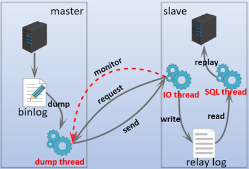
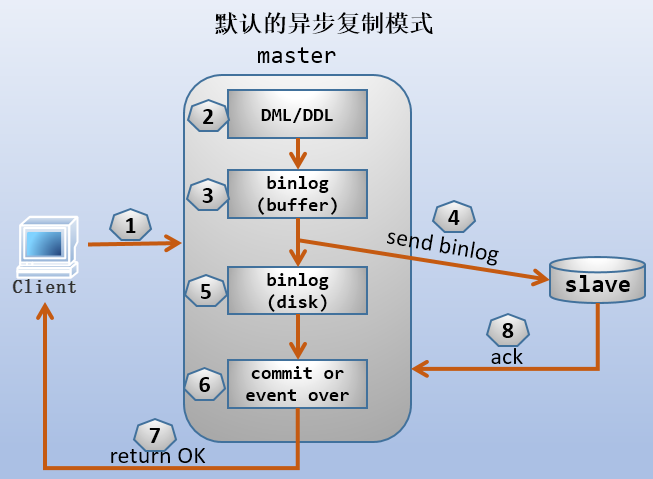
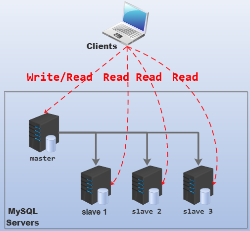
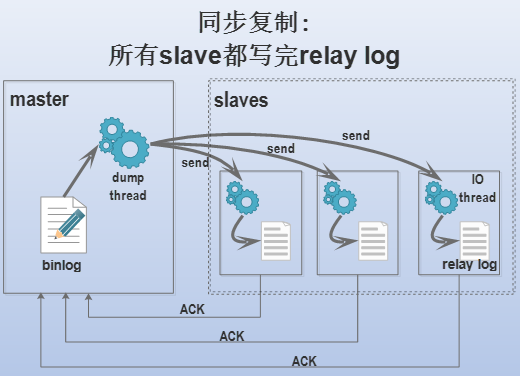
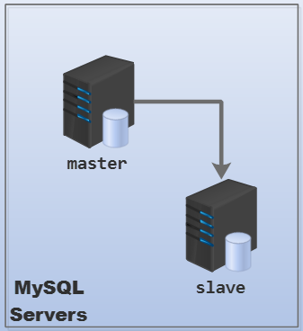
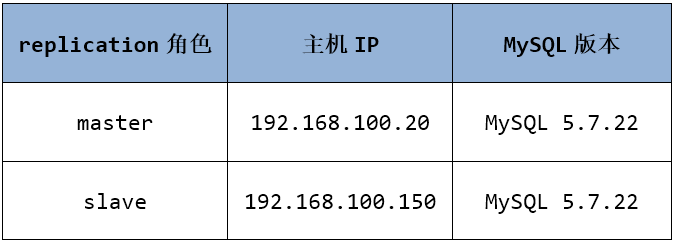
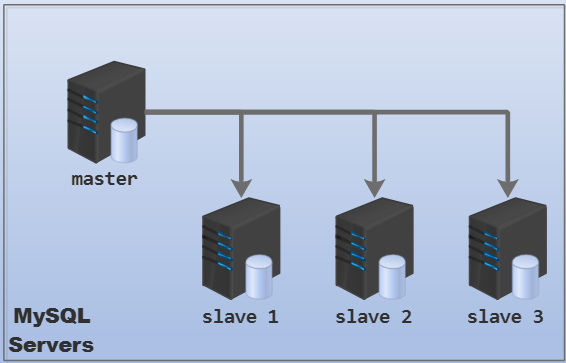
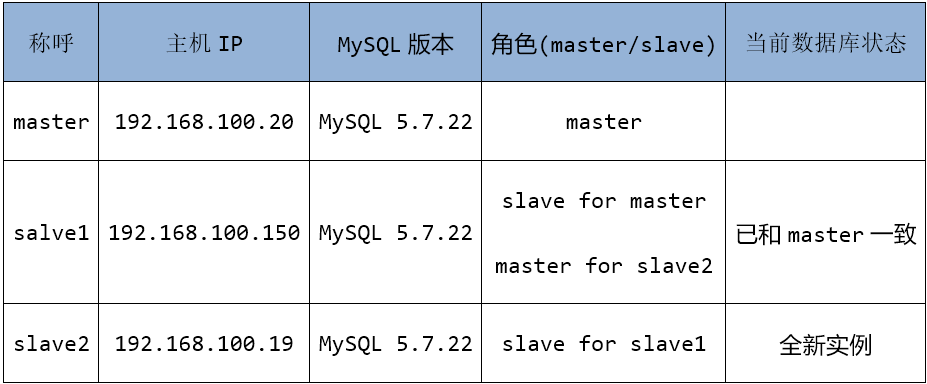

# MySQL 主从复制

本文非常详细地介绍MySQL复制相关的内容，包括基本概念、复制原理、如何配置不同类型的复制(传统复制)等等。在此文章之后，还有几篇文章分别介绍GTID复制、半同步复制、实现MySQL的动静分离，以及MySQL 5.7.17引入的革命性功能：组复制(MGR)。

本文是MySQL Replication的基础，但却非常重要。对于MySQL复制，如何搭建它不是重点(因为简单，网上资源非常多)，如何维护它才是重点(网上资源不集中)。以下几个知识点是掌握MySQL复制所必备的：

1. 复制的原理
1. 将master上已存在的数据恢复到slave上作为基准数据
1. 获取 **正确的** binlog坐标
1. **深入理解**`show slave status`中的一些状态信息

本文对以上内容都做了非常详细的说明。希望对各位初学、深入MySQL复制有所帮助。

mysql replication官方手册：[https://dev.mysql.com/doc/refman/5.7/en/replication.html。](https://dev.mysql.com/doc/refman/5.7/en/replication.html%E3%80%82)

# 1.复制的基本概念和原理

mysql复制是指从一个mysql服务器(MASTER)将数据**通过日志的方式经过网络传送**到另一台或多台mysql服务器(SLAVE)，然后在slave上重放(replay或redo)传送过来的日志，以达到和master数据同步的目的。

它的工作原理很简单。首先**确保master数据库上开启了二进制日志，这是复制的前提**。

- 在slave准备开始复制时，首先 **要执行change master to语句设置连接到master服务器的连接参数** ，在执行该语句的时候要提供一些信息，包括如何连接和要从哪复制binlog，这些信息在连接的时候会记录到slave的datadir下的master.info文件中，以后再连接master的时候将不用再提供这新信息而是直接读取该文件进行连接。

- 在slave上有两种线程，

  分别是IO线程和SQL线程

  - IO线程用于连接master，监控和接受master的binlog。当启动IO线程成功连接master时， **master会同时启动一个dump线程** ，该线程将slave请求要复制的binlog给dump出来，之后IO线程负责监控并接收master上dump出来的二进制日志，当master上binlog有变化的时候，IO线程就将其复制过来并写入到自己的中继日志(relay log)文件中。
  - slave上的另一个线程SQL线程用于监控、读取并重放relay log中的日志，将数据写入到自己的数据库中。如下图所示。

站在slave的角度上看，过程如下：



站在master的角度上看，过程如下(默认的异步复制模式，前提是设置了`sync_binlog=1`，否则binlog刷盘时间由操作系统决定)：



所以，可以认为复制大致有三个步骤：

1. 数据修改写入master数据库的binlog中。
1. slave的IO线程复制这些变动的binlog到自己的relay log中。
1. slave的SQL线程读取并重新应用relay log到自己的数据库上，让其和master数据库保持一致。

从复制的机制上可以知道，在复制进行前，slave上必须具有master上部分完整内容作为复制基准数据。例如，master上有数据库A，二进制日志已经写到了pos1位置，那么在复制进行前，slave上必须要有数据库A，且如果要从pos1位置开始复制的话，还必须有和master上pos1之前完全一致的数据。如果不满足这样的一致性条件，那么在replay中继日志的时候将不知道如何进行应用而导致数据混乱。 **也就是说，复制是基于binlog的position进行的，复制之前必须保证position一致。**(注：这是传统的复制方式所要求的)

可以选择对哪些数据库甚至数据库中的哪些表进行复制。\*\*默认情况下，MySQL的复制是异步的。slave可以不用一直连着master，即使中间断开了也能从断开的position处继续进行复制。\*\*MySQL 5.6对比MySQL 5.5在复制上进行了很大的改进，主要包括支持GTID(Global Transaction ID,全局事务ID)复制和多SQL线程并行重放。GTID的复制方式和传统的复制方式不一样，通过全局事务ID，它不要求复制前slave有基准数据，也不要求binlog的position一致。

MySQL 5.7.17则提出了组复制(MySQL Group Replication,MGR)的概念。像数据库这样的产品，必须要尽可能完美地设计一致性问题，特别是在集群、分布式环境下。Galera就是一个MySQL集群产品，它支持多主模型(多个master)，但是当MySQL 5.7.17引入了MGR功能后，Galera的优势不再明显，甚至MGR可以取而代之。MGR为MySQL集群中多主复制的很多问题提供了很好的方案，可谓是一项革命性的功能。

复制和二进制日志息息相关，所以学习本章必须先有二进制日志的相关知识。

# 2.复制的好处

围绕下面的拓扑图来分析：



主要有以下几点好处：\*\*1.提供了读写分离的能力。\*\*replication让所有的slave都和master保持数据一致，因此外界客户端可以从各个slave中读取数据，而写数据则从master上操作。也就是实现了读写分离。

需要注意的是，为了保证数据一致性，**写操作必须在master上进行**。

通常说到读写分离这个词，立刻就能意识到它会分散压力、提高性能。\*\*2.为MySQL服务器提供了良好的伸缩(scale-out)能力。\*\*由于各个slave服务器上只提供数据检索而没有写操作，因此"随意地"增加slave服务器数量来提升整个MySQL群的性能，而不会对当前业务产生任何影响。

之所以"随意地"要加上双引号，是因为每个slave都要和master建立连接，传输数据。如果slave数量巨多，master的压力就会增大，网络带宽的压力也会增大。**3.数据库备份时，对业务影响降到最低。 **由于MySQL服务器群中所有数据都是一致的(至少几乎是一致的)，所以在需要备份数据库的时候可以任意停止某一台slave的复制功能(甚至停止整个mysql服务)，然后从这台主机上进行备份，这样几乎不会影响整个业务(除非只有一台slave，但既然只有一台slave，说明业务压力并不大，短期内将这个压力分配给master也不会有什么影响)。** 4.能提升数据的安全性。 **这是显然的，任意一台mysql服务器断开，都不会丢失数据。即使是master宕机，也只是丢失了那部分还没有传送的数据(异步复制时才会丢失这部分数据)。** 5.数据分析不再影响业务。**

需要进行数据分析的时候，直接划分一台或多台slave出来专门用于数据分析。这样OLTP和OLAP可以共存，且几乎不会影响业务处理性能。

# 3.复制分类和它们的特性

MySQL支持两种不同的复制方法：传统的复制方式和GTID复制。MySQL 5.7.17之后还支持组复制(MGR)。

- (1).传统的复制方法要求复制之前，slave上必须有基准数据，且binlog的position一致。
- (2).GTID复制方法不要求基准数据和binlog的position一致性。GTID复制时，master上只要一提交，就会立即应用到slave上。这极大地简化了复制的复杂性，且更好地保证master上和各slave上的数据一致性。

从数据同步方式的角度考虑，MySQL支持4种不同的同步方式：同步(synchronous)、半同步(semisynchronous)、异步(asynchronous)、延迟(delayed)。所以对于复制来说，就分为同步复制、半同步复制、异步复制和延迟复制。

## 3.1 同步复制

客户端发送DDL/DML语句给master，master执行完毕后还需要 **等待所有的slave都写完了relay log才认为此次DDL/DML成功，然后才会返回成功信息给客户端** 。同步复制的问题是master必须等待，所以延迟较大，在MySQL中不使用这种复制方式。



例如上图中描述的，只有3个slave全都写完relay log并返回ACK给master后，master才会判断此次DDL/DML成功。

## 3.2 半同步复制

客户端发送DDL/DML语句给master，master执行完毕后 **还要等待一个slave写完relay log并返回确认信息给master，master才认为此次DDL/DML语句是成功的，然后才会发送成功信息给客户端** 。半同步复制只需等待一个slave的回应，且等待的超时时间可以设置，超时后会自动降级为异步复制，所以在局域网内(网络延迟很小)使用半同步复制是可行的。


例如上图中，只有第一个slave返回成功，master就判断此次DDL/DML成功，其他的slave无论复制进行到哪一个阶段都无关紧要。

## 3.3 异步复制

客户端发送DDL/DML语句给master， **master执行完毕立即返回成功信息给客户端，而不管slave是否已经开始复制** 。这样的复制方式导致的问题是，当master写完了binlog，而slave还没有开始复制或者复制还没完成时，**slave上和master上的数据暂时不一致，且此时master突然宕机，slave将会丢失一部分数据。如果此时把slave提升为新的master，那么整个数据库就永久丢失这部分数据。**

## 3.4 延迟复制

顾名思义，延迟复制就是故意让slave延迟一段时间再从master上进行复制。

# 4.配置一主一从

此处先配置默认的异步复制模式。由于复制和binlog息息相关，如果对binlog还不熟悉，请先了解binlog，见：[详细分析二进制日志](https://www.cnblogs.com/f-ck-need-u/p/9001061.html#blog5)。

mysql支持一主一从和一主多从。但是每个slave必须只能是一个master的从，否则从多个master接受二进制日志后重放将会导致数据混乱的问题。

以下是一主一从的结构图： 

在开始传统的复制(非GTID复制)前，需要完成以下几个关键点，**这几个关键点指导后续复制的所有步骤**。

1. 为master和slave设定不同的`server-id`，这是主从复制结构中非常关键的标识号。到了MySQL 5.7，似乎不设置server id就无法开启binlog。设置server id需要重启MySQL实例。
1. 开启master的binlog。刚安装并初始化的MySQL默认未开启binlog，建议手动设置binlog且为其设定文件名，否则默认以主机名为基名时修改主机名后会找不到日志文件。
1. 最好设置master上的变量`sync_binlog=1`(MySQL 5.7.7之后默认为1，之前的版本默认为0)，这样每写一次二进制日志都将其刷新到磁盘，让slave服务器可以尽快地复制。防止万一master的二进制日志还在缓存中就宕机时，slave无法复制这部分丢失的数据。
1. 最好设置master上的redo log的刷盘变量`innodb_flush_log_at_trx_commit=1`(默认值为1)，这样每次提交事务都会立即将事务刷盘保证持久性和一致性。
1. 在slave上开启中继日志relay log。这个是默认开启的，同样建议手动设置其文件名。
1. 建议在master上专门创建一个用于复制的用户，它只需要有复制权限`replication slave`用来读取binlog。
1. 确保slave上的数据和master上的数据在"复制的起始position之前"是完全一致的。如果master和slave上数据不一致，复制会失败。
1. 记下master开始复制前binlog的position，因为在slave连接master时需要指定从master的哪个position开始复制。
1. 考虑是否将slave设置为只读，也就是开启`read_only`选项。这种情况下，除了具有super权限(mysql 5.7.16还提供了`super_read_only`禁止super的写操作)和SQL线程能写数据库，其他用户都不能进行写操作。这种禁写对于slave来说，绝大多数场景都非常适合。

## 4.1 一主一从

一主一从是最简单的主从复制结构。本节实验环境如下：



1.**配置master和slave的配置文件。**```

\[mysqld\]          # master
datadir=/data
socket=/data/mysql.sock
log-bin=master-bin
sync-binlog=1
server-id=100
\[mysqld\]       # slave
datadir=/data
socket=/data/mysql.sock
relay-log=slave-bin
server-id=111

```
1.  重启master和slave上的MySQL实例。
```

service mysqld restart

```
1.** 在master上创建复制专用的用户。**
```

create user 'repl'@'192.168.100.%' identified by '\[email protected\]!';
grant REPLICATION SLAVE on *.* to 'repl'@'192.168.100.%';

```
1.  **将slave恢复到master上指定的坐标。** 这是备份恢复的内容，此处用一个小节来简述操作过程。详细内容见[MySQL备份和恢复(一)、(二)、(三)](https://www.cnblogs.com/f-ck-need-u/p/9013458.html)。
4.2 将slave恢复到master指定的坐标
------------------------
对于复制而言，有几种情况：
*   (1).待复制的master没有新增数据，例如新安装的mysql实例。这种情况下，可以跳过恢复这个过程。
*   (2).待复制的master上已有数据。这时需要将这些已有数据也应用到slave上，并获取master上binlog当前的坐标。只有slave和master的数据能匹配上，slave重放relay log时才不会出错。
第一种情况此处不赘述。第二种情况有几种方法，例如使用mysqldump、冷备份、xtrabackup等工具，这其中又需要考虑是MyISAM表还是InnoDB表。
在实验开始之前，首先在master上新增一些测试数据，以innodb和myisam的数值辅助表为例。
```

DROP DATABASE IF EXISTS backuptest;
CREATE DATABASE backuptest;
USE backuptest;

# 创建myisam类型的数值辅助表和插入数据的存储过程

CREATE TABLE num_isam (n INT NOT NULL PRIMARY KEY) ENGINE = MYISAM ;
DROP PROCEDURE IF EXISTS proc_num1;
DELIMITER $$
CREATE PROCEDURE proc_num1 (num INT)
BEGIN
DECLARE rn INT DEFAULT 1 ;
TRUNCATE TABLE backuptest.num_isam ;
INSERT INTO backuptest.num_isam VALUES(1) ;
dd: WHILE rn *2 \< num DO
BEGIN
INSERT INTO backuptest.num_isam
SELECT rn + n FROM backuptest.num_isam;
SET rn = rn* 2 ;
END ;
END WHILE dd;
INSERT INTO backuptest.num_isam
SELECT n + rn
FROM backuptest.num_isam
WHERE n + rn \<= num;
END ;
$$
DELIMITER ;

# 创建innodb类型的数值辅助表和插入数据的存储过程

CREATE TABLE num_innodb (n INT NOT NULL PRIMARY KEY) ENGINE = INNODB ;
DROP PROCEDURE IF EXISTS proc_num2;
DELIMITER $$
CREATE PROCEDURE proc_num2 (num INT)
BEGIN
DECLARE rn INT DEFAULT 1 ;
TRUNCATE TABLE backuptest.num_innodb ;
INSERT INTO backuptest.num_innodb VALUES(1) ;
dd: WHILE rn * 2 \< num DO
BEGIN
INSERT INTO backuptest.num_innodb
SELECT rn + n FROM backuptest.num_innodb;
SET rn = rn * 2 ;
END ;
END WHILE dd;
INSERT INTO backuptest.num_innodb
SELECT n + rn
FROM backuptest.num_innodb
WHERE n + rn \<= num ;
END ;
$$
DELIMITER ;

# 分别向两个数值辅助表中插入100W条数据

CALL proc_num1 (1000000) ;
CALL proc_num2 (1000000) ;

```
所谓数值辅助表是只有一列的表，且这个字段的值全是数值，从1开始增长。例如上面的是从1到100W的数值辅助表。
```

mysql> select * from backuptest.num_isam limit 10;
+----+
| n  |
+----+
|  1 |
|  2 |
|  3 |
|  4 |
|  5 |
|  6 |
|  7 |
|  8 |
|  9 |
| 10 |
+----+

```
### 4.2.1 获取master binlog的坐标
**如果master是全新的数据库实例，或者在此之前没有开启过binlog，那么它的坐标位置是position=4 **。之所以是4而非0，是因为binlog的前4个记录单元是每个binlog文件的头部信息。
如果master已有数据，或者说master以前就开启了binlog并写过数据库，那么需要手动获取position。** 为了安全以及没有后续写操作，必须先锁表。 **```
mysql> flush tables with read lock;
```

注意，这次的**锁表会导致写阻塞以及innodb的commit操作。**
然后查看binlog的坐标。

```
mysql> show master status;   # 为了排版，简化了输出结果
+-------------------+----------+--------------+--------+--------+
| File              | Position | Binlog_Do_DB | ...... | ...... |
+-------------------+----------+--------------+--------+--------+
| master-bin.000001 |      623 |              |        |        |
+-------------------+----------+--------------+--------+--------+
```

记住master-bin.000001和623。

### 4.2.2 备份master数据到slave上

下面给出3种备份方式以及对应slave的恢复方法。建议备份所有库到slave上，如果要筛选一部分数据库或表进行复制，应该在slave上筛选(筛选方式见后文[筛选要复制的库和表](https://www.cnblogs.com/f-ck-need-u/p/9155003.html#blog6.1))，而不应该在master的备份过程中指定。

- \*\*方式一：冷备份直接cp。这种情况只适用于没有新写入操作。严谨一点，只适合拷贝完成前master不能有写入操作。\*\*1.  如果要复制所有库，那么直接拷贝整个datadir。

2. 如果要复制的是某个或某几个库，直接拷贝相关目录即可。但注意，这种冷备份的方式只适合MyISAM表和开启了`innodb_file_per_table=ON`的InnoDB表。如果没有开启该变量，innodb表使用公共表空间，无法直接冷备份。
1. 如果要冷备份innodb表，最安全的方法是先关闭master上的mysql，而不是通过表锁。
   所以，**如果没有涉及到innodb表，那么在锁表之后，可以直接冷拷贝。最后释放锁。**```
   mysql> flush tables with read lock;
   mysql> show master status;   # 为了排版，简化了输出结果
   +-------------------+----------+--------------+--------+--------+
   | File              | Position | Binlog_Do_DB | ...... | ...... |
   +-------------------+----------+--------------+--------+--------+
   | master-bin.000001 |      623 |              |        |        |
   +-------------------+----------+--------------+--------+--------+
   shell> rsync -avz /data 192.168.100.150:/
   mysql> unlock tables;

```

此处实验，假设要备份的是整个实例，因为** 涉及到了innodb表，所以建议关闭MySQL**。因为是冷备份，所以slave上也应该关闭MySQL。
```

# master和slave上都执行

shell> mysqladmin -uroot -p shutdown

```

然后将整个datadir拷贝到slave上(当然，有些文件是不用拷贝的，比如master上的binlog、mysql库等)。
```

# 将master的datadir(/data)拷贝到slave的datadir(/data)

shell> rsync -avz /data 192.168.100.150:/

```

需要注意，在冷备份的时候，需要将备份到目标主机上的DATADIR/auto.conf删除，这个文件中记录的是mysql server的UUID，而master和slave的UUID必须不能一致。

然后重启master和slave。因为重启了master，所以binlog已经滚动了，不过这次不用再查看binlog坐标，因为重启造成的binlog日志移动不会影响slave。

*   **方式二：使用mysqldump进行备份恢复。 **这种方式简单的多，而且对于innodb表很适用，但是slave上恢复时速度慢，因为恢复时数据全是通过insert插入的。因为mysqldump可以进行定时点恢复甚至记住binlog的坐标，所以无需再手动获取binlog的坐标。
```

shell> mysqldump -uroot -p --all-databases --master-data=2 >dump.db

```

注意，`--master-data`选项将再dump.db中加入`change master to`相关的语句，值为2时，`change master to`语句是注释掉的，值为1或者没有提供值时，这些语句是直接激活的。同时，`--master-data`会锁定所有表(如果同时使用了`--single-transaction`，则不是锁所有表，详细内容请参见[mysqldump](https://www.cnblogs.com/f-ck-need-u/p/9013458.html))。

因此，可以直接从dump.db中获取到binlog的坐标。** 记住这个坐标。**
```

\[\[email protected\] ~\]# grep -i -m 1 'change master to' dump.db
-- CHANGE MASTER TO MASTER_LOG_FILE='master-bin.000002', MASTER_LOG_POS=154;

```

然后将dump.db拷贝到slave上，使用mysql执行dump.db脚本即可。也可以直接在master上远程连接到slave上执行。例如：
```

shell> mysql -uroot -p -h 192.168.100.150 -e 'source dump.db'

```

*   **方式三：使用xtrabackup进行备份恢复。 **这是三种方式中最佳的方式，安全性高、速度快。因为xtrabackup备份的时候会记录master的binlog的坐标，因此也无需手动获取binlog坐标。

xtrabackup详细的备份方法见：[xtrabackup](https://www.cnblogs.com/f-ck-need-u/p/9018716.html)

注意：master和slave上都安装percona-xtrabackup。

以全备份为例：
```

innobackupex -u root -p /backup

```

备份完成后，在/backup下生成一个以时间为名称的目录。其内文件如下：
```

\[\[email protected\] ~\]# ll /backup/2018-05-29_04-12-15
total 77872
-rw-r----- 1 root root      489 May 29 04:12 backup-my.cnf
drwxr-x--- 2 root root     4096 May 29 04:12 backuptest
-rw-r----- 1 root root     1560 May 29 04:12 ib_buffer_pool
-rw-r----- 1 root root 79691776 May 29 04:12 ibdata1
drwxr-x--- 2 root root     4096 May 29 04:12 mysql
drwxr-x--- 2 root root     4096 May 29 04:12 performance_schema
drwxr-x--- 2 root root    12288 May 29 04:12 sys
-rw-r----- 1 root root       22 May 29 04:12 xtrabackup_binlog_info
-rw-r----- 1 root root      115 May 29 04:12 xtrabackup_checkpoints
-rw-r----- 1 root root      461 May 29 04:12 xtrabackup_info
-rw-r----- 1 root root     2560 May 29 04:12 xtrabackup_logfile

```

其中xtrabackup\_binlog\_info中记录了binlog的坐标。** 记住这个坐标。**
```

\[\[email protected\] ~\]# cat /backup/2018-05-29_04-12-15/xtrabackup_binlog_info
master-bin.000002       154

```

然后将备份的数据执行"准备"阶段。这个阶段不要求连接mysql，因此不用给连接选项。
```

innobackupex --apply-log /backup/2018-05-29_04-12-15

```

最后，将/backup目录拷贝到slave上进行恢复。恢复的阶段就是向MySQL的datadir拷贝。但注意，xtrabackup恢复阶段要求datadir必须为空目录。否则报错：
```

\[\[email protected\] ~\]# innobackupex --copy-back /backup/2018-05-29_04-12-15/
180529 23:54:27 innobackupex: Starting the copy-back operation
IMPORTANT: Please check that the copy-back run completes successfully.
At the end of a successful copy-back run innobackupex
prints "completed OK!".
innobackupex version 2.4.11 based on MySQL server 5.7.19 Linux (x86_64) (revision id: b4e0db5)
Original data directory /data is not empty!

```

所以，停止slave的mysql并清空datadir。
```

service mysqld stop
rm -rf /data/\*

```

恢复时使用的模式是"--copy-back"，选项后指定要恢复的源备份目录。恢复时因为不需要连接数据库，所以不用指定连接选项。
```

1
2
\[\[email protected\] ~\]# innobackupex --copy-back /backup/2018-05-29_04-12-15/
180529 23:55:53 completed OK!

```

恢复完成后，MySQL的datadir的文件的所有者和属组是innobackupex的调用者，所以需要改回mysql.mysql。
```

shell> chown -R mysql.mysql /data

```

启动slave，并查看恢复是否成功。
```

shell> service mysqld start
shell> mysql -uroot -p -e 'select * from backuptest.num_isam limit 10;'
+----+
| n  |
+----+
|  1 |
|  2 |
|  3 |
|  4 |
|  5 |
|  6 |
|  7 |
|  8 |
|  9 |
| 10 |
+----+

```

4.3 slave开启复制
-------------

经过前面的一番折腾，总算是把该准备的数据都准备到slave上，也获取到master上binlog的坐标(154)。现在还欠东风：连接master。

连接master时，需要使用`change master to`提供连接到master的连接选项，包括user、port、password、binlog、position等。
```

mysql> change master to
master_host='192.168.100.20',
master_port=3306,
master_user='repl',
master_password='\[email protected\]!',
master_log_file='master-bin.000002',
master_log_pos=154;

```

完整的`change master to`语法如下：
```

CHANGE MASTER TO option \[, option\] ...
option:
| MASTER_HOST = 'host_name'
| MASTER_USER = 'user_name'
| MASTER_PASSWORD = 'password'
| MASTER_PORT = port_num
| MASTER_LOG_FILE = 'master_log_name'
| MASTER_LOG_POS = master_log_pos
| MASTER_AUTO_POSITION = {0|1}
| RELAY_LOG_FILE = 'relay_log_name'
| RELAY_LOG_POS = relay_log_pos
| MASTER_SSL = {0|1}
| MASTER_SSL_CA = 'ca_file_name'
| MASTER_SSL_CAPATH = 'ca_directory_name'
| MASTER_SSL_CERT = 'cert_file_name'
| MASTER_SSL_CRL = 'crl_file_name'
| MASTER_SSL_CRLPATH = 'crl_directory_name'
| MASTER_SSL_KEY = 'key_file_name'
| MASTER_SSL_CIPHER = 'cipher_list'
| MASTER_SSL_VERIFY_SERVER_CERT = {0|1}

```

然后，启动IO线程和SQL线程。可以一次性启动两个，也可以分开启动。
```

# 一次性启动、关闭

start slave;
stop slave;

# 单独启动

start slave io_thread;
start slave sql_thread;

```

至此，复制就已经可以开始工作了。当master写入数据，slave就会从master处进行复制。

例如，在master上新建一个表，然后去slave上查看是否有该表。因为是DDL语句，它会写二进制日志，所以它也会复制到slave上。

4.4 查看slave的信息
--------------

`change master to`后，在slave的datadir下就会生成master.info文件和relay-log.info文件，这两个文件随着复制的进行，其内数据会随之更新。

### 4.4.1 master.info

master.info文件记录的是 **IO线程相关的信息** ，也就是连接master以及读取master binlog的信息。通过这个文件，下次连接master时就不需要再提供连接选项。

以下是master.info的内容，每一行的意义见[官方手册](https://dev.mysql.com/doc/refman/5.7/en/slave-logs-status.html)
```

\[\[email protected\] ~\]# cat /data/master.info
25                        # 本文件的行数
master-bin.000002         # IO线程正从哪个master binlog读取日志
154                       # IO线程读取到master binlog的位置
192.168.100.20            # master_host
repl                      # master_user
\[email protected\]!                # master_password
3306                      # master_port
60                        # master_retry，slave重连master的超时时间(单位秒)
0
0
30.000
0
86400
0

```

### 4.4.2 relay-log.info

relay-log.info文件中记录的是 **SQL线程相关的信息** 。以下是relay-log.info文件的内容，每一行的意义见[官方手册](https://dev.mysql.com/doc/refman/5.7/en/slave-logs-status.html)
```

\[\[email protected\] ~\]# cat /data/relay-log.info
7                   # 本文件的行数
./slave-bin.000001  # 当前SQL线程正在读取的relay-log文件
4                   # SQL线程已执行到的relay log位置
master-bin.000002   # SQL线程最近执行的操作对应的是哪个master binlog
154                 # SQL线程最近执行的操作对应的是master binlog的哪个位置
0                   # slave上必须落后于master多长时间
0                   # 正在运行的SQL线程数
1                   # 一种用于内部信息交流的ID，目前值总是1

```

### 4.4.3 show slave status

在slave上执行`show slave status`可以查看slave的状态信息。信息非常多，每个字段的详细意义可参见[官方手册](https://dev.mysql.com/doc/refman/5.7/en/show-slave-status.html)
```

mysql> show slave status\\G
***************************1. row***************************
Slave_IO_State:        # slave上IO线程的状态，来源于show processlist
Master_Host: 192.168.100.20
Master_User: repl
Master_Port: 3306
Connect_Retry: 60
Master_Log_File: master-bin.000002
Read_Master_Log_Pos: 154
Relay_Log_File: slave-bin.000001
Relay_Log_Pos: 4
Relay_Master_Log_File: master-bin.000002
Slave_IO_Running: No          # IO线程的状态，此处为未运行且未连接状态
Slave_SQL_Running: No          # SQL线程的状态，此处为未运行状态
Replicate_Do_DB:             # 显式指定要复制的数据库
Replicate_Ignore_DB:             # 显式指定要忽略的数据库
Replicate_Do_Table:
Replicate_Ignore_Table:
Replicate_Wild_Do_Table:          # 以通配符方式指定要复制的表
Replicate_Wild_Ignore_Table:
Last_Errno: 0
Last_Error:
Skip_Counter: 0
Exec_Master_Log_Pos: 154
Relay_Log_Space: 154
Until_Condition: None     # start slave语句中指定的until条件，
\# 例如，读取到哪个binlog位置就停止
Until_Log_File:
Until_Log_Pos: 0
Master_SSL_Allowed: No
Master_SSL_CA_File:
Master_SSL_CA_Path:
Master_SSL_Cert:
Master_SSL_Cipher:
Master_SSL_Key:
Seconds_Behind_Master: NULL    # SQL线程执行过的位置比IO线程慢多少
Master_SSL_Verify_Server_Cert: No
Last_IO_Errno: 0
Last_IO_Error:
Last_SQL_Errno: 0
Last_SQL_Error:
Replicate_Ignore_Server_Ids:
Master_Server_Id: 0      # master的server id
Master_UUID:
Master_Info_File: /data/master.info
SQL_Delay: 0
SQL_Remaining_Delay: NULL
Slave_SQL_Running_State:             # slave SQL线程的状态
Master_Retry_Count: 86400
Master_Bind:
Last_IO_Error_Timestamp:
Last_SQL_Error_Timestamp:
Master_SSL_Crl:
Master_SSL_Crlpath:
Retrieved_Gtid_Set:
Executed_Gtid_Set:
Auto_Position: 0
Replicate_Rewrite_DB:
Channel_Name:
Master_TLS_Version:
1 row in set (0.01 sec)

```

因为太长，后面再列出`show slave status`时，将裁剪一些意义不大的行。

再次回到上面`show slave status`的信息。除了那些描述IO线程、SQL线程状态的行，还有几个log\_file和pos相关的行，如下所列。
```

```
  Master_Log_File: master-bin.000002
```

Read_Master_Log_Pos: 154
Relay_Log_File: slave-bin.000001
Relay_Log_Pos: 4
Relay_Master_Log_File: master-bin.000002
Exec_Master_Log_Pos: 154

```

理解这几行的意义至关重要，前面因为排版限制，描述看上去有些重复。所以这里完整地描述它们：

*   `Master_Log_File`：IO线程正在读取的master binlog；
*   `Read_Master_Log_Pos`：IO线程已经读取到master binlog的哪个位置；
*   `Relay_Log_File`：SQL线程正在读取和执行的relay log；
*   `Relay_Log_Pos`：SQL线程已经读取和执行到relay log的哪个位置；
*   `Relay_Master_Log_File`：SQL线程最近执行的操作对应的是哪个master binlog；
*   `Exec_Master_Log_Pos`：SQL线程最近执行的操作对应的是master binlog的哪个位置。

所以，(Relay\_Master\_Log\_File, Exec\_Master\_log\_Pos)构成一个坐标，这个坐标表示slave上已经将master上的哪些数据重放到自己的实例中，它可以用于下一次`change master to`时指定的binlog坐标。

与这个坐标相对应的是slave上SQL线程的relay log坐标(Relay\_Log\_File, Relay\_Log\_Pos)。这两个坐标位置不同，但它们对应的数据是一致的。

最后还有一个延迟参数`Seconds_Behind_Master`需要说明一下，它的本质意义是SQL线程比IO线程慢多少。如果master和slave之间的网络状况优良，那么slave的IO线程读速度和master写binlog的速度基本一致，所以这个参数也用来描述"SQL线程比master慢多少"，也就是说slave比master少多少数据，只不过衡量的单位是秒。但需要注意，这个参数的描述并不标准，只有在网速很好的时候做个大概估计，很多种情况下它的值都是0，即使SQL线程比IO线程慢了很多也是如此。

### 4.4.4 slave信息汇总

上面的master.info、relay-log.info和`show slave status`的状态都是刚连接上master还未启动IO thread、SQL thread时的状态。下面将显示已经进行一段正在执行复制的slave状态。

首先查看启动io thread和sql thread后的状态。使用`show processlist`查看即可。
```

mysql> start slave;
mysql> show processlist;   # slave上的信息，为了排版，简化了输出
+----+-------------+---------+--------------------------------------------------------+
| Id | User        | Command | State                                                  |
+----+-------------+---------+--------------------------------------------------------+
|  4 | root        | Sleep   |                                                        |
|  7 | root        | Query   | starting                                               |
|  8 | system user | Connect | Waiting for master to send event                       |
|  9 | system user | Connect | Slave has read all relay log; waiting for more updates |
+----+-------------+---------+--------------------------------------------------------+

```

可以看到：

*   `Id=8`的线程负责连接master并读取binlog，它是IO 线程，它的状态指示"等待master发送更多的事件"；
*   `Id=9`的线程负责读取relay log，它是SQL线程，它的状态指示"已经读取了所有的relay log"。

再看看此时master上的信息。
```

mysql> show processlist;        # master上的信息，为了排版，经过了修改
+----+------+-----------------------+-------------+--------------------------------------+
| Id | User | Host                  | Command     | State                                |
+----+------+-----------------------+-------------+--------------------------------------+

| 4                                                                                          | root | localhost             | Query       | starting                             |
| ------------------------------------------------------------------------------------------ | ---- | --------------------- | ----------- | ------------------------------------ |
| 16                                                                                         | repl | 192.168.100.150:39556 | Binlog Dump | Master has sent all binlog to slave; |
|                                                                                            |      |                       |             | waiting for more updates             |
| +----+------+-----------------------+-------------+--------------------------------------+ |      |                       |             |                                      |

```

master上有一个`Id=16`的binlog dump线程，该线程的用户是repl。它的状态指示"已经将所有的binlog发送给slave了"。

现在，在master上执行一个长事件，以便查看slave上的状态信息。

仍然使用前面插入数值辅助表的存储过程，这次分别向两张表中插入一亿条数据(尽管去抽烟、喝茶，够等几分钟的。如果机器性能不好，请大幅减少插入的行数)。
```

call proc_num1(100000000);
call proc_num2(100000000);

```

然后去slave上查看信息，如下。因为太长，已经裁剪了一部分没什么用的行。
```

mysql> show slave status\\G
mysql: \[Warning\] Using a password on the command line interface can be insecure.
***************************1. row***************************
Slave_IO_State: Waiting for master to send event
Master_Host: 192.168.100.20
Master_User: repl
Master_Port: 3306
Connect_Retry: 60
Master_Log_File: master-bin.000003
Read_Master_Log_Pos: 512685413
Relay_Log_File: slave-bin.000003
Relay_Log_Pos: 336989434
Relay_Master_Log_File: master-bin.000003
Slave_IO_Running: Yes
Slave_SQL_Running: Yes
Exec_Master_Log_Pos: 336989219
Slave_SQL_Running_State: Reading event from the relay log

```

从中获取到的信息有：

1.  IO线程的状态
2.  SQL线程的状态
3.  IO线程读取到master binlog的哪个位置：512685413
4.  SQL线程已经执行到relay log的哪个位置：336989434
5.  SQL线程执行的位置对应于master binlog的哪个位置：336989219

可以看出，IO线程比SQL线程超前了很多很多，所以SQL线程比IO线程的延迟较大。

4.5 MySQL复制如何实现断开重连
-------------------

很多人以为`change master to`语句是用来连接master的，实际上这种说法是错的。连接master是IO线程的事情，`change master to`只是为IO线程连接master时提供连接参数。

如果slave从来没连接过master，那么必须使用`change master to`语句来生成IO线程所需要的信息，这些信息记录在master.info中。这个文件是`change master to`成功之后立即生成的，以后启动IO线程时，IO线程都会自动读取这个文件来连接master，不需要先执行`change master to`语句。

例如，可以随时`stop slave`来停止复制线程，然后再随时`start slave`，只要master.info存在，且没有人为修改过它，IO线程就一定不会出错。这是因为master.info会随着IO线程的执行而更新，无论读取到master binlog的哪个位置，都会记录下这个位置，如此一来，IO线程下次启动的时候就知道从哪里开始监控master binlog。

前面还提到一个文件：`relay-log.info`文件。这个文件中记录的是SQL线程的相关信息，包括读取、执行到relay log的哪个位置，刚重放的数据对应master binlog的哪个位置。随着复制的进行，这个文件的信息会即时改变。所以，通过relay-log.info，下次SQL线程启动的时候就能知道从relay log的哪个地方继续读取、执行。

如果不小心把relay log文件删除了，SQL线程可能会丢失了一部分相比IO线程延迟的数据。这时候，只需将relay-log.info中第4、5行记录的"SQL线程刚重放的数据对应master binlog的坐标"手动修改到master.info中即可，这样IO线程下次连接master就会从master binlog的这个地方开始监控。当然，也可以将这个坐标作为`change master to`的坐标来修改master.info。

此外，当mysql实例启动时，默认会自动`start slave`，也就是MySQL一启动就自动开启复制线程。如果想要禁止这种行为，在配置文件中加上：
```

\[mysqld\]
skip-slave-start

```

4.6 一些变量

默认情况下，slave连接到master后会在slave的datadir下生成master.info和relay-log.info文件，但是这是可以通过设置变量来改变的。

*   `master-info-repository={TABLE|FILE}`：master的信息是记录到文件master.info中还是记录到表mysql.slave\_master\_info中。默认为file。
*   `relay-log-info-repository={TABLE|FILE}`：slave的信息是记录到文件relay-log.info中还是记录到表mysql.slave\_relay\_log\_info中。默认为file。

IO线程每次从master复制日志要写入到relay log中，但是它是先放在内存的，等到一定时机后才会将其刷到磁盘上的relay log文件中。刷到磁盘的时机可以由变量控制。

另外，IO线程每次从master复制日志后都会更新master.info的信息，也是先更新内存中信息，在特定的时候才会刷到磁盘的master.info文件；同理SQL线程更新realy-log.info也是一样的。它们是可以通过变量来设置更新时机的。

*   `sync-relay-log=N`：设置为大于0的数表示每从master复制N个事件就刷一次盘。设置为0表示依赖于操作系统的sync机制。
*   `sync-master-info=N`：依赖于`master-info-repository`的设置，如果为file，则设置为大于0的值时表示每更新多少次master.info将其写入到磁盘的master.info中，设置为0则表示由操作系统来决定何时调用`fdatasync()`函数刷到磁盘。如果设置为table，则设置为大于0的值表示每更新多少次master.info就更新mysql.slave\_master\_info表一次，如果设置为0则表示永不更新该表。
*   `sync-relay-log-info=N`：同上。

5.一主多从
======

一主多从有两种情况，结构图如下。

以下是一主多从的结构图(和一主一从的配置方法完全一致)： 

以下是一主多从，但某slave是另一群MySQL实例的master： 

配置一主多从时，需要考虑一件事：slave上是否要开启binlog? 如果不开启slave的binlog，性能肯定要稍微好一点。但是开启了binlog后，可以通过slave来备份数据，也可以在master宕机时直接将slave切换为新的master。此外，如果是上面第二种主从结构，这台slave必须开启binlog。可以将某台或某几台slave开启binlog，并在mysql动静分离的路由算法上稍微减少一点到这些slave上的访问权重。

上面第一种一主多从的结构没什么可解释的，它和一主一从的配置方式完全一样，但是可以考虑另一种情况：向现有主从结构中添加新的slave。所以，稍后先介绍这种添加slave，再介绍第二种一主多从的结构。

5.1 向现有主从结构中添加slave
-------------------

官方手册：[https://dev.mysql.com/doc/refman/5.7/en/replication-howto-additionalslaves.html](https://dev.mysql.com/doc/refman/5.7/en/replication-howto-additionalslaves.html)

例如在前文一主一从的实验环境下添加一台新的slave。

因为新的slave在开始复制前，要有master上的基准数据，还要有master binlog的坐标。按照前文一主一从的配置方式，当然很容易获取这些信息，但这样会将master锁住一段时间(因为要备份基准数据)。

深入思考一下，其实slave上也有数据，还有relay log以及一些仓库文件标记着数据复制到哪个地方。所以，完全 **可以从slave上获取基准数据和坐标，也建议这样做** 。

仍然有三种方法从slave上获取基准数据：冷备份、mysqldump和xtrabackup。方法见前文[将slave恢复到master指定的坐标](https://www.cnblogs.com/f-ck-need-u/p/9155003.html#blog4.2)。

其实 **临时关闭一个slave对业务影响很小，所以我个人建议，新添加slave时采用冷备份slave的方式** ，不仅备份恢复的速度最快，配置成slave也最方便，这一点和前面配置"一主一从"不一样。但冷备份slave的时候需要注意几点：

1.  可以考虑将slave1完全shutdown再将整个datadir拷贝到新的slave2上。
2.  **建议新的slave2配置文件中的"relay-log"的值和slave1的值完全一致 **，否则应该手动从slave2的relay-log.info中获取IO线程连接master时的坐标，并在slave2上使用`change master to`语句设置连接参数。 方法很简单，所以不做演示了。

5.2 配置一主多从(从中有从)
----------------

此处实现的一主多从是下面这种结构：


这种结构对MySQL复制来说，是一个很好的提升性能的方式。对于只有一个master的主从复制结构，每多一个slave，意味着master多发一部分binlog，业务稍微繁忙一点时，这种压力会加剧。而这种一个主master、一个或多个辅助master的主从结构，非常有助于MySQL集群的伸缩性，对压力的适应性也很强。

> 除上面一主多从、从中有从的方式可提升复制性能，还有几种提升MySQL复制性能的方式：
> 
> > 1.  将不同数据库复制到不同slave上。
> > 2.  可以将master上的事务表(如InnoDB)复制为slave上的非事务表(如MyISAM)，这样slave上回放的速度加快，查询数据的速度在一定程度上也会提升。

回到这种主从结构，它有些不同，master只负责传送日志给slave1、slave2和slave3，slave 2\_1和slave 2\_2的日志由slave2负责传送，所以slave2上也必须要开启binlog选项。此外，还必须开启一个选项`--log-slave-updates`让slave2能够在重放relay log时也写自己的binlog，否则slave2的binlog仅接受人为的写操作。** 问：slave能否进行写操作？重放relay log的操作是否会记录到slave的binlog中？ **1.  在slave上没有开启`read-only`选项(只读变量)时，任何有写权限的用户都可以进行写操作，这些操作都会记录到binlog中。注意，** read-only选项对具有super权限的用户以及SQL线程执行的重放写操作无效 **。默认这个选项是关闭的。
```

mysql> show variables like "read_only";
+---------------+-------+
| Variable_name | Value |
+---------------+-------+
| read_only     | OFF   |
+---------------+-------+

```

1.  在slave上没有开启`log-slave-updates`和binlog选项时，重放relay log不会记录binlog。** 所以如果slave2要作为某些slave的master，那么在slave2上必须要开启log-slave-updates和binlog选项。为了安全和数据一致性，在slave2上还应该启用read-only选项。 **环境如下：



以下是master、slave1和slave2上配置文件内容。
```

# master上的配置

\[mysqld\]
datadir=/data
socket=/data/mysql.sock
server_id=100
sync-binlog=1
log_bin=master-bin
log-error=/data/err.log
pid-file=/data/mysqld.pid

# slave1上的配置

\[mysqld\]
datadir=/data
socket=/data/mysql.sock
server_id=111
relay-log=slave-bin
log-error=/data/err.log
pid-file=/data/mysqld.pid
log-slave-updates          # 新增配置
log-bin=master-slave-bin   # 新增配置
read-only=ON               # 新增配置

# slave2上的配置

\[mysqld\]
datadir=/data
socket=/data/mysql.sock
server_id=123
relay-log=slave-bin
log-error=/data/err.log
pid-file=/data/mysqld.pid
read-only=ON

```

因为slave2目前是全新的实例，所以先将slave1的基准数据备份到slave2。由于slave1自身就是slave，临时关闭一个slave对业务影响很小，所以直接采用冷备份slave的方式。
```

# 在slave2上执行

shell> mysqladmin -uroot -p shutdown

# 在slave1上执行

shell> mysqladmin -uroot -p shutdown
shell> rsync -az --delete /data 192.168.100.19:/
shell> service mysqld start

```** 冷备份时，以下几点千万注意**：

1.  因为slave2是slave1的从，所以

    在启动MySQL前必须将备份到slave2上的和复制有关的文件都删除

    。包括：

    *   (1).master.info。除非配置文件中指定了`skip-slave-start`，否则slave2将再次连接到master并作为master的slave。
    *   (2).relay-log.info。因为slave1启动后会继续执行relay log中的内容(如果有未执行的)，这时slave1会将这部分写入binlog并传送到slave2。
    *   (3).删除relay log文件。其实不是必须删除，但建议删除。
    *   (4).删除relay log index文件。
    *   (5).删除DATADIR/auto.conf。这个文件必须删除，因为这里面保留了mysql server的UUID，而master和slave的UUID必须不能一致。在启动mysql的时候，如果没有这个文件会自动生成自己的UUID并保存到auto.conf中。
2.  检查slave1上从master复制过来的专门用于复制的用户`repl`是否允许slave2连接。如果不允许，应该去master上修改这个用户。

3.  因为slave1是刚开启的binlog，所以slave2连接slave1时的binlog position应该指定为4。即使slave1不是刚开启的binlog，它在重启后也会滚动binlog。

所以，在slave2上继续操作：
```

shell> ls /data
auto.cnf    ib_buffer_pool  ib_logfile1  performance_schema  slave-bin.000005
backuptest  ibdata1         master.info  relay-log.info      slave-bin.index
err.log     ib_logfile0     mysql        slave-bin.000004    sys
shell> rm -f /data/{master.info,relay-log.info,auto.conf,slave-bin\*}
shell> service mysqld start

```

最后连上slave2，启动复制线程。
```

shell> mysql -uroot -p
mysql> change master to
master_host='192.168.100.150',
master_port=3306,
master_user='repl',
master_password='\[email protected\]!',
master_log_file='master-slave-bin.000001',
master_log_pos=4;
mysql> start slave;
mysql> show slave status\\G

```

6.MySQL复制中一些常用操作
================

6.1 筛选要复制的库和表
-------------

默认情况下，slave会复制master上所有库。可以指定以下变量显式指定要复制的库、表和要忽略的库、表，也可以将其写入配置文件。
```

```
        Replicate_Do_DB: 要复制的数据库
    Replicate_Ignore_DB: 不复制的数据库
     Replicate_Do_Table: 要复制的表
 Replicate_Ignore_Table: 不复制的表
Replicate_Wild_Do_Table: 通配符方式指定要复制的表
```

Replicate_Wild_Ignore_Table: 通配符方式指定不复制的表

```

如果要指定列表，则多次使用这些变量进行设置。

需要注意的是， **尽管显式指定了要复制和忽略的库或者表，但是master还是会将所有的binlog传给slave并写入到slave的relay log中，真正负责筛选的slave上的SQL线程** 。

另外，如果slave上开启了binlog，SQL线程读取relay log后会将所有的事件都写入到自己的binlog中，只不过对于那些被忽略的事件只记录相关的事务号等信息，不记录事务的具体内容。所以，如果之前设置了被忽略的库或表，后来取消忽略后，它们在取消忽略以前的变化是不会再重放的，特别是基于gtid的复制会严格比较binlog中的gtid。

总之使用筛选的时候应该多多考虑是否真的要筛选，是否是永久筛选。

6.2 reset slave和reset master
----------------------------

`reset slave`会删除master.info/relay-log.info和relay log，然后新生成一个relay log。但是`change master to`设置的连接参数还在内存中保留着，所以此时可以直接start slave，并根据内存中的`change master to`连接参数复制日志。

`reset slave all`除了删除`reset slave`删除的东西，还删除内存中的`change master to`设置的连接信息。

`reset master`会删除master上所有的二进制日志，并新建一个日志。在正常运行的主从复制环境中，执行`reset master`很可能导致异常状况。所以建议使用purge来删除某个时间点之前的日志(应该保证只删除那些已经复制完成的日志)。

6.3 show slave hosts
--------------------

如果想查看master有几个slave的信息，可以使用`show slave hosts`。以下为某个master上的结果：
```

mysql> show slave hosts;
+-----------+------+------+-----------+--------------------------------------+
| Server_id | Host | Port | Master_id | Slave_UUID                           |
+-----------+------+------+-----------+--------------------------------------+
|       111 |      | 3306 |        11 | ff7bb057-2466-11e7-8591-000c29479b32 |
|      1111 |      | 3306 |        11 | 9b119463-24d2-11e7-884e-000c29867ec2 |
+-----------+------+------+-----------+--------------------------------------+

```

可以看到，该show中会显示server-id、slave的主机地址和端口号、它们的master\_id以及这些slave独一无二的uuid号。

其中show结果中的host显示结果是由slave上的变量report\_host控制的，端口是由report\_port控制的。

例如，在slave2上修改其配置文件，添加report-host项后重启MySQL服务。
```

\[mysqld\]
report_host=192.168.100.19

```

在slave1(前文的实验环境，slave1是slave2的master)上查看，host已经显示为新配置的项。
```

mysql> show slave hosts;
+-----------+----------------+------+-----------+--------------------------------------+
| Server_id | Host           | Port | Master_id | Slave_UUID                           |
+-----------+----------------+------+-----------+--------------------------------------+
|       111 | 192.168.100.19 | 3306 |        11 | ff7bb057-2466-11e7-8591-000c29479b32 |
|      1111 |                | 3306 |        11 | 9b119463-24d2-11e7-884e-000c29867ec2 |
+-----------+----------------+------+-----------+--------------------------------------+

```

6.4 多线程复制
---------

在老版本中，只有一个SQL线程读取relay log并重放。重放的速度肯定比IO线程写relay log的速度慢非常多，导致SQL线程非常繁忙，且 **实现到从库上延迟较大** 。**没错，多线程复制可以解决主从延迟问题，且使用得当的话效果非常的好(关于主从复制延迟，是生产环境下最常见的问题之一，且没有很好的办法来避免。后文稍微介绍了一点方法)**。

在MySQL 5.6中引入了多线程复制(multi-thread slave，简称MTS)，这个** 多线程指的是多个SQL线程，IO线程还是只有一个**。当IO线程将master binlog写入relay log中后，一个称为"多线程协调器(multithreaded slave coordinator)"会对多个SQL线程进行调度，让它们按照一定的规则去执行relay log中的事件。

\*\*需要谨记于心的是，如果对多线程复制没有了解的很透彻，千万不要在生产环境中使用多线程复制。\*\*它的确带来了一些复制性能的提升，并且能解决主从超高延迟的问题，但随之而来的是很多的"疑难杂症"，这些"疑难杂症"并非是bug，只是需要多多了解之后才知道为何会出现这些问题以及如何解决这些问题。稍后会简单介绍一种多线程复制问题：gaps。

通过全局变量`slave-parallel-workers`控制SQL线程个数，设置为非0正整数N，表示多加N个SQL线程，加上原有的共N+1个SQL线程。默认为0，表示不加任何SQL线程，即关闭多线程功能。
```

mysql> show variables like "%parallel%";
+------------------------+-------+
| Variable_name          | Value |
+------------------------+-------+
| slave_parallel_workers | 0     |
+------------------------+-------+

```

显然，多线程只有在slave上开启才有效，因为只有slave上才有SQL线程。另外，设置了该全局变量，需要 **重启SQL线程** 才生效，否则内存中还是只有一个SQL线程。

例如，初始时slave上的processlist如下：


设置`slave_parallel_workers=2`。
```

mysql> set @@global.slave_parallel_workers=2;
mysql> stop slave sql_thread;
msyql> start slave sql_thread;
mysql> show full processlist;

```


可见多出了两个线程，其状态信息是"Waiting for an event from Coordinator"。

虽然是多个SQL线程，但是复制时每个库只能使用一个线程(默认情况下，可以通过`--slave-parallel-type`修改并行策略)，因为如果一个库可以使用多个线程，多个线程并行重放relay log，可能导致数据错乱。所以应该设置线程数等于或小于要复制的库的数量，设置多了无效且浪费资源。

### 6.4.1 多线程复制带来的不一致问题

虽然多线程复制带来了一定的复制性能提升，但它也带来了很多问题，最严重的是一致性问题。完整的内容见[官方手册](https://dev.mysql.com/doc/refman/8.0/en/replication-features-transaction-inconsistencies.html)。此处介绍其中一个最重要的问题。

**关于多线程复制，最常见也是开启多线程复制前最需要深入了解的问题是：由于多个SQL线程同时执行relay log中的事务，这使得slave上提交事务的顺序很可能和master binlog中记录的顺序不一致(除非指定变量slave\_preserve\_commit\_order=1)。 **(注意：这里说的是事务而不是事件。因为MyISAM的binlog顺序无所谓，只要执行完了就正确，而且多线程协调器能够协调好这些任务。所以只需考虑innodb基于事务的binlog)

举个简单的例子，master上事务A先于事务B提交，到了slave上因为多SQL线程的原因，可能事务B提交了事务A却还没提交。

是否还记得`show slave status`中的`Exec_master_log_pos`代表的意义？它表示SQL线程最近执行的事件对应的是master binlog中的哪个位置。问题由此而来。通过`show slave status`，我们看到已经执行事件对应的坐标，它前面可能还有事务没有执行。而在relay log中，事务B记录的位置是在事务A之后的(和master一样)，于是事务A和事务B之间可能就存在一个孔洞(gap)，这个孔洞是事务A剩余要执行的操作。

正常情况下，多线程协调器记录了一切和多线程复制相关的内容，它能识别这种孔洞(通过打低水位标记low-watermark)，也能正确填充孔洞。** 即使是在存在孔洞的情况下执行stop slave也不会有任何问题，因为在停止SQL线程之前，它会等待先把孔洞填充完 **。但危险因素太多，比如突然宕机、突然杀掉mysqld进程等等，这些都会导致孔洞持续下去，甚至可能因为操作不当而永久丢失这部分孔洞。

那么如何避免这种问题，出现这种问题如何解决？** 1.如何避免gap。 **前面说了，多个SQL线程是通过协调器来调度的。默认情况下，可能会出现gap的情况，这是因为变量`slave_preserve_commit_order`的默认值为0。该变量指示协调器是否让每个SQL线程执行的事务按master binlog中的顺序提交。因此，将其设置为1，然后重启SQL线程即可保证SQL线程按序提交，也就不可能会有gap的出现。

当事务B准备先于事务A提交的时候，它将一直等待。此时slave的状态将显示：
```

1
2
Waiting for preceding transaction to commit   # MySQL 5.7.8之后显示该状态
Waiting for its turn to commit       # MySQL 5.7.8之前显示该状态

```

尽管不会出现gap，但`show slave status`的`Exec_master_log_pos`仍可能显示在事务A的坐标之后。

由于开启`slave_preserve_commit_order`涉及到不少操作，它还要求开启slave的binlog`--log-bin`(因此需要重启mysqld)，且开启重放relay log也记录binlog的行为`--log-slave-updates`，此外，还必须设置多线程的并行策略`--slave-parallel-type=LOGICAL_CLOCK`。
```

shell> mysqladmin -uroot -p shutdown
shell> cat /etc/my.cnf
log_bin=slave-bin
log-slave-updates
slave_parallel_workers=1
slave_parallel_type=LOGICAL_CLOCK
shell>service mysqld start

```** 2.如何处理已经存在的gap。**

方法之一，是从master上重新备份恢复到slave上，这种方法是处理不当的最后解决办法。

正常的处理方法是，使用`START SLAVE [SQL_THREAD] UNTIL SQL_AFTER_MTS_GAPS;`，它表示SQL线程只有先填充gaps后才能启动。实际上，它涉及了两个操作：

*   (1).填充gaps
*   (2).自动停止SQL线程(所以之后需要手动启动SQL线程)

一般来说，在填充完gaps之后，应该先`reset slave`移除已经执行完的relay log，然后再去启动sql\_thread。

### 6.4.2 多线程复制切换回单线程复制

多线程的带来的问题不止gaps一种，所以没有深入了解多线程的情况下，千万不能在生产环境中启用它。如果想将多线程切换回单线程，可以执行如下操作：
```

START SLAVE UNTIL SQL_AFTER_MTS_GAPS;
SET @@GLOBAL.slave_parallel_workers = 0;
START SLAVE SQL_THREAD;

```

6.5 slave升级为master的大致操作
-----------------------

当master突然宕机，有时候需要切换到slave，将slave提升为新的master。但对于master突然宕机可能造成的数据丢失，主从切换是无法解决的，它只是尽可能地不间断提供MySQL服务。

假如现在有主服务器M，从服务器S1、S2，S1作为将来的新的master。

1.  在将S1提升为master之前，需要保证S1已经将relay log中的事件已经replay完成。即下面两个状态查看语句中SQL线程的状态显示为："Slave has read all relay log; waiting for the slave I/O thread to update it"。
```

show slave status;
show processlist;

```

1.  停止S1上的IO线程和SQL线程，然后将S1的binlog清空(要求已启用binlog)。
```

1
2
mysql> stop slave;
mysql> reset master;

```

1.  在S2上停止IO线程和SQL线程，通过`change master to`修改master的指向为S1，然后再启动io线程和SQL线程。
```

mysql> stop slave;
mysql> change master to master_host=S1,...
mysql> start slave;

```

1.  将应用程序原本指向M的请求修改为指向S1，如修改MySQL代理的目标地址。一般会通过MySQL Router、Amoeba、cobar等数据库中间件来实现。
2.  删除S1上的master.info、relay-log.info文件，否则下次S1重启服务器会继续以slave角色运行。
3.  将来M重新上线后，可以将其配置成S1的slave，然后修改应用程序请求的目标列表，添加上新上线的M，如将M加入到MySQL代理的读目标列表。

注意：`reset master`很重要，如果不是基于GTID复制且开启了`log-slave-updates`选项时，S1在应用relay log的时候会将其写入到自己的binlog，以后S2会复制这些日志导致重复执行的问题。

其实上面只是提供一种slave升级为Master的解决思路，在实际应用中环境可能比较复杂。例如，上面的S1是S2的master，这时S1如果没有设置为read-only，当M宕机时，可以不用停止S1，也不需要`reset master`等操作，受影响的操作仅仅只是S1一直无法连接M而已，但这对业务不会有多大的影响。

相信理解了前面的内容，分析主从切换的思路应该也没有多大问题。

6.6 指定不复制到slave上的语句
-------------------

前面说的[筛选要复制的库和表](https://www.cnblogs.com/f-ck-need-u/p/9155003.html#blog6.1)可以用于指定不复制到slave上的库和表，但却没有筛选不复制到slave的语句。

但有些特殊情况下，可能需要这种功能。例如，master上创建专门用于复制的用户repl，这种语句其实没有必要复制到slave上，甚至出于安全的考虑不应该复制到slave上。

可以使用`sql_log_bin`变量对此进行设置，默认该变量的值为1，表示所有语句都写进binlog，从而被slave复制走。如果设置为0，则之后的语句不会写入binlog，从而实现"不复制某些语句到slave"上的功能。

例如：屏蔽创建repl用户的语句。
```

mysql> set sql_log_bin=0;
mysql> create user \[email protected\]'%' identified by '\[email protected\]!';
mysql> grant replication slave on *.* to \[email protected\]'%';
mysql> set sql_log_bin=1;

```

在使用该变量时，默认是会话范围内的变量，一定不能设置它的全局变量值，否则所有语句都将不写binlog。

6.7 主从高延迟的解决思路
--------------

slave通过IO线程获取master的binlog，并通过SQL线程来应用获取到的日志。因为各个方面的原因，经常会出现slave的延迟(即`Seconds_Behind_Master`的值)非常高(动辄几天的延迟是常见的，几个小时的延迟已经算短的)，使得主从状态不一致。

一个很容易理解的延迟示例是：假如master串行执行一个大事务需要30分钟，那么slave应用这个事务也大约要30分钟，从master提交的那一刻开始，slave的延迟就是30分钟，更极端一点，由于binlog的记录时间点是在事务提交时，如果这个大事务的日志量很大，比如要传输10多分钟，那么很可能延迟要达到40分钟左右。而且更严重的是，这种延迟具有滚雪球的特性，从延迟开始，很容易导致后续加剧延迟。

所以，第一个优化方式是不要在mysql中使用大事务，这是mysql主从优化的第一口诀。

在回归正题，要解决slave的高延迟问题，先要知道`Second_Behind_Master`是如何计算延迟的：SQL线程比IO线程慢多少(其本质是NOW()减去`Exec_Master_Log_Pos`处设置的TIMESTAMP)。在主从网络状态良好的情况下，IO线程和master的binlog大多数时候都能保持一致(也即是IO线程没有多少延迟，除非事务非常大，导致二进制日志传输时间久， **但mysql优化的一个最基本口诀就是大事务切成小事务**)，所以在这种理想状态下，可以认为主从延迟说的是slave上的数据状态比master要延迟多少。它的计数单位是秒。

1.**从产生Binlog的master上考虑，可以在master上应用group commit的功能，并设置参数binlog\_group\_commit\_sync\_delay和binlog\_group\_commit\_sync\_no\_delay\_count，前者表示延迟多少秒才提交事务，后者表示要堆积多少个事务之后再提交。这样一来，事务的产生速度降低，slave的SQL线程相对就得到缓解** 。

2.**再者从slave上考虑，可以在slave上开启多线程复制(MTS)功能，让多个SQL线程同时从一个IO线程中取事务进行应用，这对于多核CPU来说是非常有效的手段** 。但是前面介绍多线程复制的时候说过，没有掌握多线程复制的方方面面之前，千万不要在生产环境中使用多线程复制，要是出现gap问题，很让人崩溃。

3.最后从架构上考虑。主从延迟是因为slave跟不上master的速度，那么可以考虑对master进行节流控制，让master的性能下降，从而变相提高slave的能力。这种方法肯定是没人用的，但确实是一种方法，提供了一种思路，比如slave使用性能比master更好的硬件。另一种比较可取的方式是加多个中间slave层(也就是master->slaves->slaves)，让多个中间slave层专注于复制(也可作为非业务的他用，比如用于备份)。

4.使用组复制或者Galera/PXC的多写节点，此外还可以设置相关参数，让它们对延迟自行调整。但一般都不需要调整，因为有默认设置。

还有比较细致的方面可以降低延迟，比如设置为row格式的Binlog要比statement要好，因为不需要额外执行语句，直接修改数据即可。比如master设置保证数据一致性的日志刷盘规则(sync\_binlog/innodb\_flush\_log\_at\_trx\_commit设置为1)，而slave关闭binlog或者设置性能优先于数据一致性的binlog刷盘规则。再比如设置slave的隔离级别使得slave的锁粒度放大，不会轻易锁表(多线程复制时避免使用此方法)。还有很多方面，选择好的磁盘，设计好分库分表的结构等等，这些都是直接全局的，实在没什么必要在这里多做解释。
```
