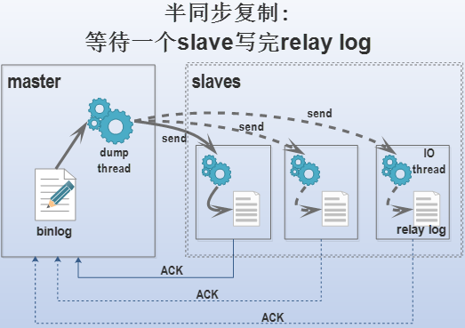
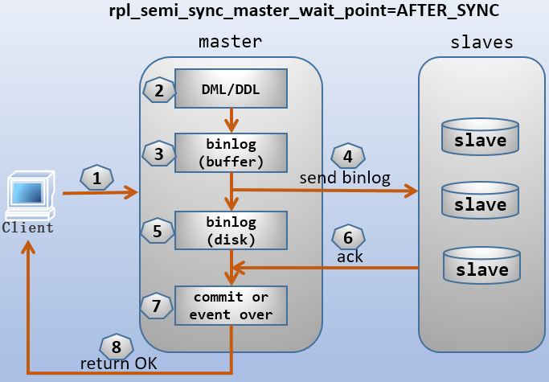
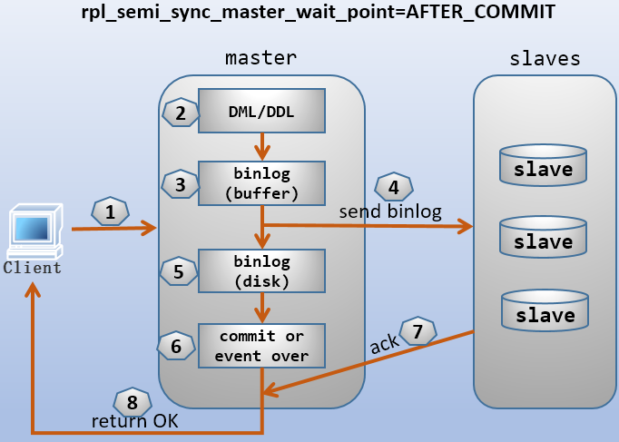
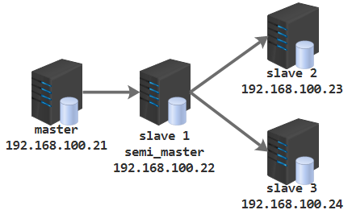

# MySQL 主从复制 半同步复制

# 1.半同步复制

半同步复制官方手册：[https://dev.mysql.com/doc/refman/5.7/en/replication-semisync.html](https://dev.mysql.com/doc/refman/5.7/en/replication-semisync.html)

默认情况下，MySQL的复制是异步的，master将新生成的binlog发送给各slave后，无需等待slave的ack回复(slave将接收到的binlog写进relay log后才会回复ack)，直接就认为这次DDL/DML成功了。

半同步复制(semi-synchronous replication)是指master在将新生成的binlog发送给各slave时，只需等待一个(默认)slave返回的ack信息就返回成功。



MySQL 5.7对半同步复制作了大改进，新增了一个master线程。在MySQL 5.7以前，master上的binlog dump线程负责两件事：dump日志给slave的io_thread；接收来自slave的ack消息。它们是串行方式工作的。在MySQL 5.7中，新增了一个专门负责接受ack消息的线程ack collector thread。这样master上有两个线程独立工作，可以同时发送binlog到slave和接收slave的ack。

还新增了几个变量，其中最重要的是 _rpl_semi_sync_master_wait_point_ ，它使得MySQL半同步复制有两种工作模型。解释如下。

# 2.半同步复制的两种类型

从MySQL 5.7.2开始，MySQL支持两种类型的半同步复制。这两种类型由变量 _rpl_semi_sync_master_wait_point_ (MySQL 5.7.2之前没有该变量)控制，它有两种值：AFTER_SYNC和AFTER_COMMIT。在MySQL 5.7.2之后，默认值为AFTER_SYNC，在此版本之前，等价的类型为AFTER_COMMIT。

这个变量控制的是master何时提交、何时接收ack以及何时回复成功信息给客户端的时间点。

1. `AFTER_SYNC`模式：master将新的事务写进binlog(buffer)，然后发送给slave，再sync到自己的binlog file(disk)。之后才允许接收slave的ack回复，接收到ack之后才会提交事务，并返回成功信息给客户端。
1. `AFTER_COMMIT`模式：master将新的事务写进binlog(buffer)，然后发送给slave，再sync到自己的binlog file(disk)，然后直接提交事务。之后才允许接收slave的ack回复，然后再返回成功信息给客户端。

画图理解就很清晰。(前提：已经设置了`sync_binlog=1`，否则binlog刷盘时间由操作系统决定)





再来分析下这两种模式的优缺点。

- AFTER_SYNC
  - 对于所有客户端来说，它们看到的数据是一样的，因为它们看到的数据都是在接收到slave的ack后提交后的数据。
  - 这种模式下，如果master突然故障，不会丢失数据，因为所有成功的事务都已经写进slave的relay log中了，slave的数据是最新的。
- AFTER_COMMIT
  - 不同客户端看到的数据可能是不一样的。对于发起事务请求的那个客户端，它只有在master提交事务且收到slave的ack后才能看到提交的数据。但对于那些非本次事务的请求客户端，它们在master提交后就能看到提交后的数据，这时候master可能还没收到slave的ack。
  - 如果master收到ack回复前，slave和master都故障了，那么将丢失这个事务中的数据。

在MySQL 5.7.2之前，等价的模式是 _AFTER_COMMIT_ ，在此版本之后，默认的模式为 _AFTER_SYNC_ ，该模式能最大程度地保证数据安全性，且性能上并不比 _AFTER_COMMIT_ 差。

# 3.半同步复制插件介绍

MySQL的半同步是通过加载google为MySQL提供的半同步插件 _semisync_master.so_ 和 _semisync_slave.so_ 来实现的。其中前者是master上需要安装的插件，后者是slave上需要安装的插件。

MySQL的插件位置默认存放在`$basedir/lib/plugin`目录下。例如，yum安装的mysql-server，插件目录为/usr/lib64/mysql/plugin。

```
[[email protected] ~]# find / -type f -name "semisync*" 
/usr/lib64/mysql/plugin/debug/semisync_master.so
/usr/lib64/mysql/plugin/debug/semisync_slave.so
/usr/lib64/mysql/plugin/semisync_master.so
/usr/lib64/mysql/plugin/semisync_slave.so
```

因为要加载插件，所以应该保证需要加载插件的MySQL的全局变量 _have_dynamic_loading_ 已经设置为YES(默认值就是YES)，否则无法动态加载插件。

```
mysql> select @@global.have_dynamic_loading;
+-------------------------------+
| @@global.have_dynamic_loading |
+-------------------------------+
| YES                           |
+-------------------------------+
```

## 3.1 MySQL中安装插件的方式

安装插件有两种方式：1.在mysql环境中使用`INSTALL PLUGIN`语句临时安装；2.在配置文件中配置永久生效。

INSTALL安装插件的语法为：

```
Syntax:
INSTALL PLUGIN plugin_name SONAME 'shared_library_name'
UNINSTALL PLUGIN plugin_name
```

例如，使用INSTALL语句在master上安装 _semisync_master.so_ 插件。

```mysql
mysql> install plugin rpl_semi_sync_master soname 'semisync_master.so';
```

配置文件中加载插件的方式为：

```
[mysqld]
plugin-load='plugin_name=shared_library_name'
```

例如，配置文件中加载`semisync_master.so`插件。

```
[mysqld]
plugin-load="rpl_semi_sync_master=sermisync_master.so"
```

如果需要加载多个插件，则插件之间使用分号分隔。例如，在本节的slave1既是slave，又是master，需要同时安装两个半同步插件。

```
[mysqld]
plugin-load="rpl_semi_sync_master=semisync_master.so;rpl_sync_slave=semisync_slave.so"
```

安装插件后，应该使用`show plugins`来查看插件是否真的激活。

```mysql
mysql> show plugins;
+----------------------+--------+-------------+--------------------+---------+
| Name                 | Status | Type        | Library            | License |
+----------------------+--------+-------------+--------------------+---------+
......
| rpl_semi_sync_master | ACTIVE | REPLICATION | semisync_master.so | GPL     |
+----------------------+--------+-------------+--------------------+---------+
```

或者查看`information_schema.plugins`表获取更详细的信息。

```
mysql> select * from information_schema.plugins where plugin_name like "%semi%"\G ****  ****  ****  ****  ****  ****  ***1. row**  ****  ****  ****  ****  ****  **** *
           PLUGIN_NAME: rpl_semi_sync_master
        PLUGIN_VERSION: 1.0
         PLUGIN_STATUS: ACTIVE
           PLUGIN_TYPE: REPLICATION
   PLUGIN_TYPE_VERSION: 4.0
        PLUGIN_LIBRARY: semisync_master.so
PLUGIN_LIBRARY_VERSION: 1.7
         PLUGIN_AUTHOR: He Zhenxing
    PLUGIN_DESCRIPTION: Semi-synchronous replication master
        PLUGIN_LICENSE: GPL
           LOAD_OPTION: ON
1 row in set (0.00 sec)
```

插件装载完成后，半同步功能还未开启，需要手动设置它们启动，或者写入配置文件永久生效。

```
# 开启master的半同步
mysql> set @@global.rpl_semi_sync_master_enabled=1;
# 开启slave半同步
mysql> set @@globale.rpl_semi_sync_slave_enabled=1;
```

或者配合插件加载选项一起写进配置文件永久开启半同步功能。

```
[mysqld]
rpl_semi_sync_master_enabled=1
[mysqld]
rpl_semi_sync_slave_enabled=1
```

## 3.2 半同步插件相关的变量

安装了 _semisync_master.so_ 和 _semisync_slave.so_ 后，这两个插件分别提供了几个变量。

```
mysql> show global variables like "%semi%";
+-------------------------------------------+------------+
| Variable_name                             | Value      |
+-------------------------------------------+------------+
| rpl_semi_sync_master_enabled              | OFF        |
| rpl_semi_sync_master_timeout              | 10000      |
| rpl_semi_sync_master_trace_level          | 32         |
| rpl_semi_sync_master_wait_for_slave_count | 1          |
| rpl_semi_sync_master_wait_no_slave        | ON         |
| rpl_semi_sync_master_wait_point           | AFTER_SYNC |
| rpl_semi_sync_slave_enabled               | OFF        |
| rpl_semi_sync_slave_trace_level           | 32         |
+-------------------------------------------+------------+
```

下面还多给了两个和半同步相关的状态变量的解释，可以通过`show status like %semi%;`查看它们。

1. master相关的变量：

   - ①.`Rpl_semi_sync_master_clients`：(状态变量)master所拥有的半同步复制slave的主机数量。

   - ②.`Rpl_semi_sync_master_status` ：(状态变量)master当前是否以半同步复制状态工作(ON)，OFF表示降级为了异步复制。

   - ③.`rpl_semi_sync_master_enabled`：master上是否启用了半同步复制。

   - ④.`rpl_semi_sync_master_timeout`：等待slave的ack回复的超时时间，默认为10秒。

   - ⑤.`rpl_semi_sync_master_trace_level`：半同步复制时master的调试级别。

   - ⑥.`rpl_semi_sync_master_wait_for_slave_count`：master在超时时间内需要收到多少个ack回复才认为此次DML成功，否则就降级为异步复制。该变量在MySQL5.7.3才提供，在此之前的版本都默认为收到1个ack则确认成功，且不可更改。MySQL 5.7.3之后该变量的默认值也是1。

   - ⑦.`rpl_semi_sync_master_wait_no_slave`：值为ON(默认)或者OFF。ON表示master在超时时间内如果未收到指定数量的ack消息，则会一直等待下去直到收满ack，即一直采用半同步复制方式，不会降级；OFF表示如果在超时时间内未收到指定数量的ack，则超时时间一过立即降级为异步复制。

     更官方的解释是：当设置为ON时，即使状态变量Rpl_semi_sync_master_clients中的值小于rpl_semi_sync_master_wait_for_slave_count，Rpl_semi_sync_master_status依旧为ON；当设置为OFF时，如果clients的值小于count的值，则Rpl_semi_sync_master_status立即变为OFF。通俗地讲，就是在超时时间内，如果slave宕机的数量超过了应该要收到的ack数量，master是否降级为异步复制。

     该变量在MySQL 5.7.3之前似乎没有效果，因为默认设置为ON时，超时时间内收不到任何ack时仍然会降级为异步复制。

   - ⑧.`rpl_semi_sync_master_wait_point`：控制master上commit、接收ack、返回消息给客户端的时间点。值为 _AFTER_SYNC_ 和 _AFTER_COMMIT_ ，该选项是MySQL5.7.2后引入的，默认值为 _AFTER_SYNC_ ，在此版本之前，等价于使用了 _AFTER_COMMIT_ 模式。关于这两种模式，见前文对两种半同步类型的分析。

1. slave相关的变量：

   - ①.`rpl_semi_sync_slave_enabled`：slave是否开启半同步复制。
   - ②.`rpl_semi_sync_slave_trace_level`：slave的调试级别。

# 4.配置半同步复制

需要注意的是，"半同步"是同步/异步类型的一种情况， **既可以实现半同步的传统复制，也可以实现半同步的GTID复制** 。其实半同步复制是基于异步复制的，它是在异步复制的基础上通过加载半同步插件的形式来实现半同步性的。

此处以全新的环境进行配置，方便各位道友"依葫芦画瓢"。

本文实现如下拓扑图所示的半同步传统复制。如果要实现半同步GTID复制，也只是在gtid复制的基础上改改配置文件而已。



具体环境：

称呼

主机IP

MySQL版本

OS

角色(master/slave)

数据库状态

master

192.168.100.21

MySQL 5.7.22

CentOS 7.2

master

全新实例

salve1

192.168.100.22

MySQL 5.7.22

CentOS 7.2

semi_slave for master semi_master for other slaves

全新实例

slave2

192.168.100.23

MySQL 5.7.22

CentOS 7.2

semi_slave for slave1

全新实例

slave3

192.168.100.24

MySQL 5.7.22

CentOS 7.2

semi_slave for slave1

全新实例

因为都是全新的实例环境，所以无需考虑基准数据和binlog坐标的问题。如果开始测试前，已经在master上做了一些操作，或者创建了一些新数据，那么请将master上的数据恢复到各slave上，并获取master binlog的坐标，具体操作方法可参见前文：将slave恢复到master指定的坐标。

## 4.1 半同步复制的配置文件

首先提供各MySQL Server的配置文件。

以下是master的配置文件。

```
[mysqld]
datadir=/data
socket=/data/mysql.sock
log-error=/data/error.log
pid-file=/data/mysqld.pid
log-bin=/data/master-bin
sync-binlog=1
server-id=100
plugin-load="rpl_semi_sync_master=semisync_master.so"
rpl_semi_sync_master_enabled=1
```

以下是slave1的配置文件，注意slave1同时还充当着slave2和slave3的master的角色。

```
[mysqld]
datadir=/data
socket=/data/mysql.sock
log-error=/data/error.log
pid-file=/data/mysqld.pid
log-bin=/data/master-bin
sync-binlog=1
server-id=110
relay-log=/data/slave-bin
log-slave-updates
plugin-load="rpl_semi_sync_master=semisync_master.so;rpl_semi_sync_slave=semisync_slave.so"
rpl_semi_sync_slave_enabled=1
rpl_semi_sync_master_enabled=1
```

以下是slave2和slave3的配置文件，它们配置文件除了_server-id_外都一致。

```
[mysqld]
datadir=/data
socket=/data/mysql.sock
log-error=/data/error.log
pid-file=/data/mysqld.pid
server-id=120      # slave3的server-id=130
relay-log=/data/slave-bin
plugin-load="rpl_semi_sync_slave=semisync_slave.so"
rpl_semi_sync_slave_enabled=1
read-only=on
```

## 4.2 启动复制线程

现在master上创建一个专门用于复制的用户。

```
mysql> create user [email protected]'192.168.100.%' identified by '[email protected]!';
mysql> grant replication slave on *.* to [email protected]'192.168.100.%';
```

因为master和所有的slave都是全新的实例，所以slave上指定的binlog坐标可以从任意位置开始。不过刚才master上创建了一个用户，也会写binlog，所以建议还是从master的第一个binlog的position=4开始。

以下是slave1上的`change master to`参数：

```
mysql> change master to 
            master_host='192.168.100.21',
            master_port=3306,
            master_user='repl',
            master_password='[email protected]!',
            master_log_file='master-bin.000001',
            master_log_pos=4;
```

以下是slave2和slave3的`change master to`参数：

```
mysql> change master to 
            master_host='192.168.100.22',
            master_port=3306,
            master_user='repl',
            master_password='[email protected]!',
            master_log_file='master-bin.000001',
            master_log_pos=4;
```

启动各slave上的两个SQL线程。

```
mysql> start slave;
```

一切就绪后，剩下的事情就是测试。在master上对数据做一番修改，然后查看是否会同步到slave1、slave2、slave3上。

# 5.半同步复制的状态信息

首先是semisync相关的可修改变量，这几个变量在[前文](https://www.cnblogs.com/f-ck-need-u/p/9166452.html#blog3.2)已经解释过了。

例如以下是开启了半同步复制后的master上的semisync相关变量。

```
mysql> show global variables like "%semi%";
+-------------------------------------------+------------+
| Variable_name                             | Value      |
+-------------------------------------------+------------+
| rpl_semi_sync_master_enabled              | ON         |
| rpl_semi_sync_master_timeout              | 10000      |
| rpl_semi_sync_master_trace_level          | 32         |
| rpl_semi_sync_master_wait_for_slave_count | 1          |
| rpl_semi_sync_master_wait_no_slave        | ON         |
| rpl_semi_sync_master_wait_point           | AFTER_SYNC |
+-------------------------------------------+------------+
```

关于半同步复制，还有几个状态变量很重要。

例如，以下是master上关于semi_sync的状态变量信息。

```
mysql> show status like "%semi%";
+--------------------------------------------+-------+
| Variable_name                              | Value |
+--------------------------------------------+-------+
| Rpl_semi_sync_master_clients               | 1     |  # 注意行1
| Rpl_semi_sync_master_net_avg_wait_time     | 0     |
| Rpl_semi_sync_master_net_wait_time         | 0     |
| Rpl_semi_sync_master_net_waits             | 5     |
| Rpl_semi_sync_master_no_times              | 1     |
| Rpl_semi_sync_master_no_tx                 | 1     |
| Rpl_semi_sync_master_status                | ON    |  # 注意行2
| Rpl_semi_sync_master_timefunc_failures     | 0     |
| Rpl_semi_sync_master_tx_avg_wait_time      | 384   |
| Rpl_semi_sync_master_tx_wait_time          | 1537  |
| Rpl_semi_sync_master_tx_waits              | 4     |
| Rpl_semi_sync_master_wait_pos_backtraverse | 0     |
| Rpl_semi_sync_master_wait_sessions         | 0     |
| Rpl_semi_sync_master_yes_tx                | 4     |
+--------------------------------------------+-------+
```

除了上面标注"注意行"的变量，其他都无需关注，而且其中有一些是废弃了的状态变量。

`Rpl_semi_sync_master_clients`是该master所连接到的slave数量。

`Rpl_semi_sync_master_status`是该master的半同步复制功能是否开启。在有些时候半同步复制会降级为异步复制，这时它的值为OFF。

以下是slave1上关于semi_sync的状态变量信息。

```
mysql>  show status like "%semi%";
+--------------------------------------------+-------+
| Variable_name                              | Value |
+--------------------------------------------+-------+
| Rpl_semi_sync_master_clients               | 2     |  # 注意行1
| Rpl_semi_sync_master_net_avg_wait_time     | 0     |
| Rpl_semi_sync_master_net_wait_time         | 0     |
| Rpl_semi_sync_master_net_waits             | 8     |
| Rpl_semi_sync_master_no_times              | 2     |
| Rpl_semi_sync_master_no_tx                 | 4     |
| Rpl_semi_sync_master_status                | ON    |  # 注意行2
| Rpl_semi_sync_master_timefunc_failures     | 0     |
| Rpl_semi_sync_master_tx_avg_wait_time      | 399   |
| Rpl_semi_sync_master_tx_wait_time          | 1199  |
| Rpl_semi_sync_master_tx_waits              | 3     |
| Rpl_semi_sync_master_wait_pos_backtraverse | 0     |
| Rpl_semi_sync_master_wait_sessions         | 0     |
| Rpl_semi_sync_master_yes_tx                | 3     |
| Rpl_semi_sync_slave_status                 | ON    |  # 注意行3
+--------------------------------------------+-------+
```

此外，从MySQL的错误日志、`show slave status`也能获取到一些半同步复制的状态信息。下一节测试半同步复制再说明。

# 6.测试半同步复制(等待、降级问题)

前面已经搭建好了下面的半同步复制结构。

```
                                     |------> slave2
                master ---> slave1 ---
                                     |------> slave3
```

下面来测试半同步复制降级为异步复制的问题，借此来观察一些semisync的状态变化。

首先，只停掉slave2或slave3中其中一个io线程的话，slave1是不会出现降级的，因为默认的半同步复制只需等待一个ack回复即可返回成功信息。

如果同时停掉slave2和slave3的io线程，当master更新数据后，slave1在10秒(默认)之后将降级为异步复制。如下：

在slave2和slave3上执行：

```
mysql> stop slave io_thread;
```

在master上执行：

```
create database test1;
create table test1.t(id int);
insert into test1.t values(33);
```

在slave1上查看(在上面的步骤之后的10秒内查看)：

```
mysql> show status like "%semi%";
+--------------------------------------------+-------+
| Variable_name                              | Value |
+--------------------------------------------+-------+
| Rpl_semi_sync_master_clients               | 0     |  # clients=0
| Rpl_semi_sync_master_net_avg_wait_time     | 0     |
| Rpl_semi_sync_master_net_wait_time         | 0     |
| Rpl_semi_sync_master_net_waits             | 8     |
| Rpl_semi_sync_master_no_times              | 2     |
| Rpl_semi_sync_master_no_tx                 | 4     |
| Rpl_semi_sync_master_status                | ON    |  # status=ON
| Rpl_semi_sync_master_timefunc_failures     | 0     |
| Rpl_semi_sync_master_tx_avg_wait_time      | 399   |
| Rpl_semi_sync_master_tx_wait_time          | 1199  |
| Rpl_semi_sync_master_tx_waits              | 3     |
| Rpl_semi_sync_master_wait_pos_backtraverse | 0     |
| Rpl_semi_sync_master_wait_sessions         | 1     |
| Rpl_semi_sync_master_yes_tx                | 3     |
| Rpl_semi_sync_slave_status                 | ON    |
+--------------------------------------------+-------+
```

可以看到在这一小段时间内，slave1还是半同步复制。此时用`show slave status`查看slave1。

```
# slave1上执行
mysql> show slave status \G ****  ****  ****  ****  ****  ****  ***1. row**  ****  ****  ****  ****  ****  **** *Slave_IO_State: Waiting for master to send event
                  Master_Host: 192.168.100.21
                  Master_User: repl
                  Master_Port: 3306
                Connect_Retry: 60
              Master_Log_File: master-bin.000004
          Read_Master_Log_Pos: 1762
               Relay_Log_File: slave-bin.000005
                Relay_Log_Pos: 1729
        Relay_Master_Log_File: master-bin.000004
             Slave_IO_Running: Yes
            Slave_SQL_Running: Yes
................................................
      Slave_SQL_Running_State: Waiting for semi-sync ACK from slave
................................................
```

此时slave的 **SQL线程** 状态是`Waiting for semi-sync ACK from slave`。

但10秒之后再查看。

```
mysql> show status like "%semi%";
+--------------------------------------------+-------+
| Variable_name                              | Value |
+--------------------------------------------+-------+
| Rpl_semi_sync_master_clients               | 0     |
| Rpl_semi_sync_master_net_avg_wait_time     | 0     |
| Rpl_semi_sync_master_net_wait_time         | 0     |
| Rpl_semi_sync_master_net_waits             | 8     |
| Rpl_semi_sync_master_no_times              | 3     |
| Rpl_semi_sync_master_no_tx                 | 5     |
| Rpl_semi_sync_master_status                | OFF   |
| Rpl_semi_sync_master_timefunc_failures     | 0     |
| Rpl_semi_sync_master_tx_avg_wait_time      | 399   |
| Rpl_semi_sync_master_tx_wait_time          | 1199  |
| Rpl_semi_sync_master_tx_waits              | 3     |
| Rpl_semi_sync_master_wait_pos_backtraverse | 0     |
| Rpl_semi_sync_master_wait_sessions         | 0     |
| Rpl_semi_sync_master_yes_tx                | 3     |
| Rpl_semi_sync_slave_status                 | ON    |
+--------------------------------------------+-------+
```

发现slave1已经关闭半同步功能了，也就是说降级为异步复制了。

此时查看slave1的错误日志。

```
2018-06-11T03:43:21.765384Z 4 [Warning] Timeout waiting for reply of binlog (file: master-bin.000001, pos: 2535), semi-sync up to file master-bin.000001, position 2292.
2018-06-11T03:43:21.765453Z 4 [Note] Semi-sync replication switched OFF.
```

它先记录了当前slave2/slave3中已经同步到slave1的哪个位置。然后将Semi-sync复制切换为OFF状态，即降级为异步复制。

在下次slave2或slave3启动IO线程时， **slave1将自动切换回半同步复制** ，并发送那些未被复制的binlog。
