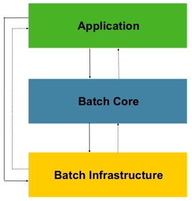
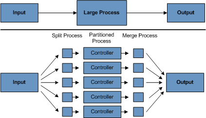
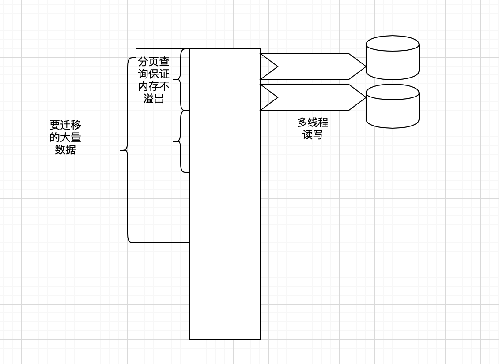

# MySQL 亿级别数据迁移实战代码分享

### x业务背景

某一项技术的出现是为了解决问题的，我们之所以要学习某个技术，是因为这个技术解决了我们工作中遇到的痛点。上亿条数据在 MySQL 中有索引的条件下，实际上只是查询是没有太大问题的，在没有特别大的并发的情况下，只是插入特别慢。

在迁移大数据量的情况下面临的问题主要有如下几点：

1. 怎么保证查询大数据量下没有性能的瓶颈。
1. 不能影响正常的业务查询，不要有太多的性能损耗，可以灵活控制迁移的启动与停止。
1. 实际的迁移参数可以动态的扩展，比如一次批量提交多少条数据，一次迁移多少，迁移过程中怎么转化数据。
1. 对于一些错误可以容忍的话怎么跳过异常，比如可以容忍几条数据的失败。
1. 测试环境和生产环境的测试实际一般很难达到百分百一致，如何在线上对迁移的性能进行可配置的控制。
1. 事务的提交问题，因为数据量过大，不能将所有数据查询到内存之中，数据如何分而治之。
1. 迁移的过程需要记录，比如每次的任务执行的多长时间，事务提交了多少次，这些都可以查询，根据这些指标再次动态调整。

针对上面提出的问题，我们自己去写这样一个功能完整且稳定的功能，实际中还是比较困难的。按照通常的 Service 和 Dao 的写法，满足不了我们的需求。

### Spring Batch 核心功能的介绍

Spring Batch 是 Spring 官方的一个专门用于处理大数据体量下数据迁移的开源框架，主要解决的问题就是我们上面所说的那些问题，通过分批读取和写数据，保证内存不会发生溢出。并且通过灵活的组件组合，可以满足数据迁移中的各种需求。

#### 核心的功能和特点

1. 事务管理
1. 基于分块的处理
1. 声明式 IO
1. 可灵活控制开始、停止、重启
1. 重试和跳过
1. 基于网页的后台管理 Spring Cloud Data Flow

Spring Batch 的文档很全面，但对于初学者来说，整个文档读完需要耗费比较长的时间，这里只看两张 Spring Batch 的架构图，后面我会通过实际工作中的迁移案例来讲解怎么使用它。

#### 架构图





第一张图是架构图，第二张分区处理图。

从这两张图可以看到这正是我们迁移大数据量下的核心诉求。输入端是从数据源读取数据，数据源可以来源于文件或者数据库，中间的处理流程是对数据进行加工，因为有些数据我们需要进行转换和处理，输出端是写出数据，可以写入到文件或者数据库。

#### 核心组件

1. Reader：负责数据的读取
1. Processor：负责数据的处理
1. Writer：负责数据的写出
1. Step：流程编排
1. Job：任务配置

这些业务组件用我们生活中的例子来理解的话，可以想象一下如下的场景：

> 数据迁移就好比从一个油田里运输原油到炼油厂，提炼完成后最终把成品油送到加油站的一个过程。原油在到成品油的过程中要经历很多的流程和运输步骤，就像我们的数据要经过转换一样。
>
> Reader 就好比从油田里将原油装上运输车，Processor 就好比将原油提炼出成品油，Writer 就好比将油运到加油站的油箱里，Step 就是这个装油 -> 提炼油 -> 运输到加油站这个流水线一样的处理步骤，Job 相当与任务，这个任务就是 Step 定义好的这个流程，任务可以执行多次，但是每一次都是按照提前定义好的 Step 来执行。

### 实际中的业务需求怎么实现

可以先下载源码：

[https://gitee.com/smartGim/batchsrv](https://gitee.com/smartGim/batchsrv)

#### 先从单表数据备份快速了解迁移流程

这种场景多见于项目创建初期为了快速上线，在项目初期没有做分库分表（在项目初期一般不会做分库分表），比如订单表，还有银行流水表、历史对账数据、支付记录数据表等。这种数据的特点为时间在半年或者一年以上将变为冷数据，数据查询的情况比较少，并且数据不会发生变化。通常情况下我们需要将时间大于一定时期的数据定时备份。还有一种情况就是接手一些历史遗留的项目，有些数据的单表已经达到了一个极限。

我们以一个数据库的数据 db_source 迁移到另外一个数据库 db_target 为例，迁移过程中同时删除已经迁移走的记录。并将迁移的过程和记录进行记录下来到 db_source 中。

实现步骤：

**1. 新建一个 Spring Boot 工程引入**\`\`\`java
<dependency>
<groupId>org.springframework.boot</groupId>
<artifactId>spring-boot-starter-batch</artifactId>
</dependency>
@SpringBootApplication
@EnableBatchProcessing
public class BatchsrvApplication {
public static void main(String\[\] args) {
SpringApplication.run(BatchsrvApplication.class, args);
}
}

````
在启动类上添加注解 @EnableBatchProcessing。** 注意 **：添加上了此注解，那么项目启动后 Spring Batch 就会自动化初始相关的数据库文件，并且直接启动相关的迁移任务。在实际的线上迁移中是不会直接上线后就自动执行任务的，通常会先通过手动执行来看下执行情况，再动态配置一些指标，所以我们的项目会禁用自动执行，并且手动执行 Spring batch 的数据库文件，数据库初始文件在 spring-batch-core 中，根据数据库进行选择即可。
禁用自动执行任务选项，`batch.job.enabled = false`。
```java
server:
  port: 8096
spring:
  profiles:
    active: dev
  batch:
    job:
      enabled: false
```** 2\. 多数据源配置**
```java
package cn.gitchat.share.config;
import javax.sql.DataSource;
import org.springframework.beans.factory.annotation.Autowired;
import org.springframework.context.annotation.Bean;
import org.springframework.context.annotation.Configuration;
import org.springframework.context.annotation.Primary;
import org.springframework.core.env.Environment;
import org.springframework.jdbc.core.JdbcTemplate;
import org.springframework.jdbc.datasource.DriverManagerDataSource;
/**
 * @Author: Gim
 * @Date: 2019-12-04 17:05
 * @Description:
 */
@Configuration
public class DataSourceConfig {
    @Autowired
    private Environment env;
    @Bean
    @Primary
    public DataSource primaryDatasource() {
        DriverManagerDataSource dataSource = new DriverManagerDataSource();
        dataSource.setDriverClassName(env.getProperty("source.driver-class-name"));
        dataSource.setUrl(env.getProperty("source.jdbc-url"));
        dataSource.setUsername(env.getProperty("source.username"));
        dataSource.setPassword(env.getProperty("source.password"));
        return dataSource;
    }
    @Bean
    public DataSource targetDatasource() {
        DriverManagerDataSource dataSource = new DriverManagerDataSource();
        dataSource.setDriverClassName(env.getProperty("target.driver-class-name"));
        dataSource.setUrl(env.getProperty("target.jdbc-url"));
        dataSource.setUsername(env.getProperty("target.username"));
        dataSource.setPassword(env.getProperty("target.password"));
        return dataSource;
    }
    @Bean
    public JdbcTemplate primaryTemplate(){
        return new JdbcTemplate(primaryDatasource());
    }
    @Bean
    public JdbcTemplate targetJdbcTemplate(){
        return new JdbcTemplate(targetDatasource());
    }
}
````

此处我们使用多数据源的配置，并且使用 JdbcTemplate 进行数据的读取。
主数据源中配置 Spring Batch 的数据库文件（如果不在意迁移的情况记录可以使用内存数据库，存储 Spring Batch 的迁移记录情况，这样能提高迁移性能，但是实际中不建议做，迁移性能的大幅提升会影响线上的业务正常运行，除非迁移有及时性这种需求再开启内存数据源）。
\*\*如何定制 Spring Batch 的框架使用的数据源？\*\*从源码中找到：

```java
public class BatchConfig extends DefaultBatchConfigurer
```

这个类继承于 DefaultBatchConfigurer 然后我们对 JobRepository 进行重写：

````java
//将spring batch 的记录存取在主数据源中
@Override
protected JobRepository createJobRepository() throws Exception {
    JobRepositoryFactoryBean factory = new JobRepositoryFactoryBean();
    factory.setDataSource(primaryDatasource);
    factory.setTransactionManager(this.getTransactionManager());
    factory.afterPropertiesSet();
    return factory.getObject();
}
```** 3\. 读取的配置**
````

/\*\*

- 数据读取 根据id 查询保证性能 分页读取
  */
  @Bean
  @StepScope
  public JdbcPagingItemReader<PayRecord> payRecordReader(@Value("#{jobParameters\[minId\]}") Long minId, @Value("#{jobParameters\[maxId\]}") Long maxId) throws Exception {
  JdbcPagingItemReader<PayRecord> reader = new JdbcPagingItemReader();
  final SqlPagingQueryProviderFactoryBean sqlPagingQueryProviderFactoryBean = new SqlPagingQueryProviderFactoryBean();
  sqlPagingQueryProviderFactoryBean.setDataSource(primaryDatasource);
  sqlPagingQueryProviderFactoryBean.setSelectClause("select* ");
  sqlPagingQueryProviderFactoryBean.setFromClause("from pay_record");
  sqlPagingQueryProviderFactoryBean.setWhereClause("id > " + minId + " and id \<= " + maxId);
  sqlPagingQueryProviderFactoryBean.setSortKey("id");
  reader.setQueryProvider(sqlPagingQueryProviderFactoryBean.getObject());
  reader.setDataSource(primaryDatasource);
  reader.setPageSize(config.getPageSize());
  reader.setRowMapper(new PayRecordRowMapper());
  reader.afterPropertiesSet();
  reader.setSaveState(true);
  return reader;
  }

````
**在读取的配置中有几个比较重要的点：**
*   第一点可以看到在 @Bean 下方有个注解 @StepScope 这个注解的作用是我们可以在 Job 执行时给 Job 添加变量，用于我们可以动态的控制每次任务要迁移的记录，通过 `@Value ("#{jobParameters [minId]}"` 这种方式进行接收参数，传递参数可以在任务执行时进行 Job 传参，使用方式如下：
```java
@Scheduled(cron = "0 0 2 * * ?")
public void migratePayRecord() throws Exception {
    Map<String, Object> result = primaryJdbcTemplate
        .queryForMap("select * from job_config where config_key = ?", MigrateConstants.PAY_RECORD_JOB_CONFIG_KEY);
    String value = (String) result.get("config_value");
    JobExecuteConfig payRecordJobConfig = JSON.parseObject(value, JobExecuteConfig.class);
    JobParameters params = new JobParametersBuilder()
        .addLong("maxId", payRecordJobConfig.getExecuteMaxId())
        .addLong("minId", payRecordJobConfig.getMinId())
        .toJobParameters();
    jobLauncher.run(migratePayRecordJob, params);
}
````

- 第二点可以看到我们读取数据使用的是 JdbcPagingItemReader 这个类，这个类的特点是可以通过分页的方式对数据记录进行读取，保证不会内存溢出，这里面 SortKey 是个很重要的点，一定要保证数据的唯一性，这个用于任务重新启动判断从哪再次开始。
- PageSize 我们可以控制每一次读取多少条记录，这个用于调优用，根据实际的情况进行控制。SaveState 用于将迁移的记录情况进行记录。
- 这个 Reader 的配置非常重要是保证亿级别数据不会发生内存溢出的关键配置。在这里的配置相当于我们对大数量级别的数据进行了一个分段处理。是分而治之的关键点。
  **4. 写入的配置**

```java
/**
 * 写入到新库
 */
@Bean
public ItemWriter<? super PayRecord> targetPayRecordWriter() {
    return new JdbcBatchItemWriterBuilder<PayRecord>()
            .dataSource(targetDatasource)
            .itemSqlParameterSourceProvider(new BeanPropertyItemSqlParameterSourceProvider<>())
            .sql(
                    "INSERT INTO `pay_record` (\n"
                            + "`id`,\n"
                            + "`user_id`,\n"
                            + "`pay_detail`,\n"
                            + "`pay_status`,\n"
                            + "`create_time`,\n"
                            + "`update_time`\n"
                            + ")\n"
                            + "VALUES\n"
                            + "\t(\n"
                            + ":id,"
                            + ":userId,"
                            + ":payDetail,"
                            + ":payStatus,"
                            + ":createTime,"
                            + ":updateTime"
                            + ")")
            .build();
}
/**
 * 删除器
 *
 * @return
 */
@Bean
public ItemWriter<PayRecord> deletePayRecordWriter() {
    return new JdbcBatchItemWriterBuilder<PayRecord>()
            .dataSource(primaryDatasource)
            .itemSqlParameterSourceProvider(new BeanPropertyItemSqlParameterSourceProvider<>())
            .sql("delete from pay_record where id = :id")
            .build();
}
@Bean
public CompositeItemWriter<PayRecord> compositePayRecordItemWriter(@Qualifier("deletePayRecordWriter") ItemWriter deleteWriter, @Qualifier("targetPayRecordWriter") ItemWriter targetPayRecordWriter) {
    CompositeItemWriter<PayRecord> compositeItemWriter = new CompositeItemWriter<>();
    List<ItemWriter<? super PayRecord>> list = new ArrayList<>();
    list.add(deleteWriter);
    list.add(targetPayRecordWriter);
    compositeItemWriter.setDelegates(list);
    return compositeItemWriter;
}
```

写入的配置这里面使用了两个配置，一个是写入新的数据源，一个是删除原来的迁移数据连接的是原来的主数据源。写入器使用的是框架提供的 JdbcBatchItemWriter ，看名字就知道这个类的作用了，它支持批量的写入，性能非常高。Spring Batch 支持各种 Writer 的组合，通过 CompositeItemWriter 来实现。在这里只是为了演示组合 Writer 的用法，实际中最好分成两步来完成这种任务。
**5. Step 的配置**\`\`\`java
@Bean
public Step migratePayRecordStep(@Qualifier("payRecordReader") JdbcPagingItemReader<PayRecord> payRecordReader, @Qualifier(value = "compositePayRecordItemWriter") CompositeItemWriter compositeItemWriter) {
return this.stepBuilderFactory.get("migratePayRecordStep")
.\<PayRecord, PayRecord>chunk(config.getChunkSize())
.reader(payRecordReader)
.processor(new PassThroughItemProcessor())
.writer(compositeItemWriter)
.taskExecutor(new SimpleAsyncTaskExecutor("migrate_thread"))
.throttleLimit(config.getThreadSize())
.build();
}

````

像上面讲到的那样 Step 的作用就是配置整个流程的，这里面 chunk 是对数据进行分块，可以动态的控制每次事务提交多少条记录。

Processor 是处理器。 这里面直接传递了一个 PassThroughItemProcessor ，这个类的作用是对传递过来的对象不做任何的处理。如果我们想对原有的记录进行扩展，那么可以自定义一个处理器，比如：

```java
@Component
public class PayRecordExtProcessor implements ItemProcessor<PayRecord,PayRecordExt> {
    @Override
    public PayRecordExt process(PayRecord payRecord) throws Exception {
        //other service
        PayRecordExt ext = new PayRecordExt();
        return ext;
    }
}
````

在这里进行数据处理。

taskExecutor 这个是线程池的配置。因为每条记录的读取、处理、写入都是独立的，互相之间没有任何的影响，所以使用线程池可以实现流程的并行处理，提高处理速度。throttleLimit 用来控制最大的线程数。线程太多了会造成资源的浪费。**6. Job 的配置**\`\`\`java
@Bean
public Job migratePayRecordJob(@Qualifier("migratePayRecordStep") Step step) {
return this.jobBuilderFactory.get("migratePayRecordJob")
.start(step)
.incrementer(new RunIdIncrementer())
.build();
}

````
Job 用于将 step 配置好的流程向外以任务的形式暴露。** 7\. 如何启动 Job**
默认情况下 Spring Batch 会自动启动任务，上面提到了，在线上时一定不要自动启动任务。
```java
@Component
@Slf4j
public class PayRecordTask {
    @Autowired
    private Job migratePayRecordJob;
    @Autowired
    private JobLauncher jobLauncher;
    @Autowired
    @Qualifier("primaryTemplate")
    private JdbcTemplate primaryJdbcTemplate;
    /**
     *迁移任务
     * @throws Exception
     */
    @Scheduled(cron = "0 0 2 * * ?")
    public void migratePayRecord() throws Exception {
        Map<String, Object> result = primaryJdbcTemplate
            .queryForMap("select * from job_config where config_key = ?", MigrateConstants.PAY_RECORD_JOB_CONFIG_KEY);
        String value = (String) result.get("config_value");
        JobExecuteConfig payRecordJobConfig = JSON.parseObject(value, JobExecuteConfig.class);
        JobParameters params = new JobParametersBuilder()
            .addLong("maxId", payRecordJobConfig.getExecuteMaxId())
            .addLong("minId", payRecordJobConfig.getMinId())
            .toJobParameters();
        jobLauncher.run(migratePayRecordJob, params);
    }
    /**
     *
     * 执行迁移任务之前数据迁移配置初始化
     * 凌晨一点
     */
    @Scheduled(cron = "0 0 1 * * ?")
    public void initBillMigrateConfig() {
       //TODO 根据实际需要的业务逻辑动态计算出，每次要迁移的数据是哪些  ，最好根据时间算出MaxId, 然后每天执行固定的步长 ，比如每天迁移100万
    }
}
````

当在启动类上添加注解 @EnableBatchProcessing 之后，Spring Batch 会在容器中自动注入 Spring Batch 的组件，这里面我们可以使用 JobLauncher 进行任务的启动，在启动时可以配置任务启动的参数。

```java
JobParameters params = new JobParametersBuilder()
    .addLong("maxId", payRecordJobConfig.getExecuteMaxId())
    .addLong("minId", payRecordJobConfig.getMinId())
    .toJobParameters();
```

这传递的参数，通过 @StepScope 注解的 Bean 就可以动态获取这个参数。
**8. Job 如何启动、停止、重启**Job 的另一种启动和停止是通过类 JobOperator 这个类来实现的，在启动和重启之前要将 Job 注册到 JobRegistry 中，在 JobController 中可以看到具体的实现。

```java
@Autowired
private JobRegistry registry;
@PostConstruct
public void registry() throws DuplicateJobException {
    ReferenceJobFactory factory = new ReferenceJobFactory(migratePayRecordJob);
    registry.register(factory);
}
@PostMapping(value = "startJob")
@SneakyThrows
public ResponseEntity<String> startJob() {
    Properties properties = new Properties();
    properties.put("minId", "20");
    properties.put("maxId", "50");
    executePayRecordId = jobOperator.start("migratePayRecordJob", PropertiesConverter.propertiesToString(properties));
    return ResponseEntity.ok("操作成功");
}
@PostMapping(value = "stopJob")
@SneakyThrows
public ResponseEntity<String> stopJob() {
    Assert.notNull(executePayRecordId,"执行id不能为空！");
    jobOperator.stop(executePayRecordId);
    return ResponseEntity.ok("操作成功");
}
@PostMapping(value = "restartJob")
@SneakyThrows
public ResponseEntity<String> restartJob(){
    Assert.notNull(executePayRecordId,"执行id不能为空！");
    jobOperator.restart(executePayRecordId);
    return ResponseEntity.ok("操作成功");
}
```

这个类的方法非常的丰富，除了能启动执行外还有大量的 API：

```java
List<Long> getExecutions(long var1) throws NoSuchJobInstanceException;
List<Long> getJobInstances(String var1, int var2, int var3) throws NoSuchJobException;
Set<Long> getRunningExecutions(String var1) throws NoSuchJobException;
String getParameters(long var1) throws NoSuchJobExecutionException;
Long start(String var1, String var2) throws NoSuchJobException, JobInstanceAlreadyExistsException, JobParametersInvalidException;
Long restart(long var1) throws JobInstanceAlreadyCompleteException, NoSuchJobExecutionException, NoSuchJobException, JobRestartException, JobParametersInvalidException;
Long startNextInstance(String var1) throws NoSuchJobException, JobParametersNotFoundException, JobRestartException, JobExecutionAlreadyRunningException, JobInstanceAlreadyCompleteException, UnexpectedJobExecutionException, JobParametersInvalidException;
boolean stop(long var1) throws NoSuchJobExecutionException, JobExecutionNotRunningException;
String getSummary(long var1) throws NoSuchJobExecutionException;
Map<Long, String> getStepExecutionSummaries(long var1) throws NoSuchJobExecutionException;
Set<String> getJobNames();
JobExecution abandon(long var1) throws NoSuchJobExecutionException, JobExecutionAlreadyRunningException;
```

在 Spring Batch 的 Admin 管理系统中主要就是通过这个类来获取任务的执行情况。**9. 总结**通过上面的演示可以清楚的看到 Spring Batch 的执行逻辑，Spring Batch 定义了模板，我们在使用过程中只需要按照接口提供相应的数据来源和输出的接口即可。其他的事务处理，多线程池，批量处理，内存控制都由框架来完成。那么 Spring Batch 是怎么样保证在大数据量级的情况下，内存不溢出然后又保证性能的呢，下面用一张图进行展示 Spring Batch 是通过怎么的处理，保证在数据量巨大的情况下，高性能的进行数据的读写的。


#### 其他业务场景的扩展

在实际中项目处理中，我们面对的系统情况可能并不是一个单表这样简单的业务情况，比如多表合一、一表分表为多表，在迁移过程中数据变更的情形。那么这些场景该如何处理呢？**1. 多表合一的场景**在多表合一的场景下，实际上如何两张表有关联，那么附表上一定要建立索引。我们还是会让查询逻辑在主表上，千万不要使用 Join 联查，亿级别的数据如何联查，那么基础系统就要崩溃了。此时我们需要将需要拼装的业务逻辑放在 Processor 里面，比如在我们的案例场景下，需要将 User 的信息冗余到新的一个表中那么只需要将 UserService 注入到 PayRecordExtProcessor 中，然后再通过 `userService.getId(payRecord.getUserId ())` 这种方式去 load 用户信息，用户的 Id 肯定有索引，这样查询性能不会有太多的损耗。这也是现在大厂为啥要求在业务系统开发的过程中尽快不要使用 Join 联查的原因。

````java
@Component
public class PayRecordExtProcessor implements ItemProcessor<PayRecord,PayRecordExt> {
    @Override
    public PayRecordExt process(PayRecord payRecord) throws Exception {
        //此处注入 User service 通过userService .getId(payRecord.getUserId());
        PayRecordExt ext = new PayRecordExt();
        return ext;
    }
}
```** 2\. 拆分为多表的场景 **系统有些情况下需要将单表拆分为多表，比如根据用户 id 分片，这种情况下 Spring Batch 提供了一个类 ClassifierCompositeItemWriter 可以根据条件动态选择 Writer，在这里我们模拟将 pay\_record 这个表拆分为两个表的场景 pay\_record\_1、pay\_record2。
````

create TABLE  pay_record_1 like  pay_record;
create TABLE  pay_record_2 like pay_record;
//根据条件拆分为多表
@Bean
public ClassifierCompositeItemWriter\<? super PayRecord> classifierItemWriter(@Qualifier("payRecordOneWriter") ItemWriter payRecordOneWriter,@Qualifier("payRecordTwoWriter") ItemWriter payRecordTwoWriter){
ClassifierCompositeItemWriter<PayRecord> classifierCompositeItemWriter = new ClassifierCompositeItemWriter\<>();
classifierCompositeItemWriter.setClassifier(
(Classifier\<PayRecord, ItemWriter\<? super PayRecord>>) record -> {
ItemWriter\<? super PayRecord> itemWriter;
if(record.getId() %2 ==0 ){
itemWriter = payRecordOneWriter;
}else {
itemWriter = payRecordTwoWriter;
}
return itemWriter;
});
return classifierCompositeItemWriter;
}
@Bean
public Step splitPayRecordStep(@Qualifier("payRecordReader") JdbcPagingItemReader<PayRecord> payRecordReader, @Qualifier(value = "classifierItemWriter") ClassifierCompositeItemWriter itemWriter) {
return this.stepBuilderFactory.get("splitPayRecordStep")
.\<PayRecord, PayRecord>chunk(config.getChunkSize())
.reader(payRecordReader)
.processor(new PassThroughItemProcessor())
.writer(itemWriter)
.taskExecutor(new SimpleAsyncTaskExecutor("migrate_thread"))
.throttleLimit(config.getThreadSize())
.build();
}
@Bean
public Job splitPayRecordJob(@Qualifier("splitPayRecordStep") Step step) {
return this.jobBuilderFactory.get("splitPayRecordJob")
.start(step)
.incrementer(new RunIdIncrementer())
.build();
}

````
在这里面我们定义了一个 ClassifierCompositeItemWriter 根据 Id % 表个数进行分片。具体的实现可以看代码。** 3\. 迁移过程中数据有变更和增量的场景**
一般来说有单表性能的表数据，都有一个特点，随着时间的迁移会有大量的冷数据，上千万频繁变更的场景还是比较少的。如果想保证系统不间断运行，同时又能进行系统的迁移，迁移完成后再进行用户无感知的切换。需要考虑到迁移过程中有增量变更的情况。这种情况下我们一般引入 CDC (change data capture) 组件。比较常用的如阿里的 Canal、Debezium，这种中间件监听数据的变更。关于它们的使用可以去看官方的文档，非常的简单，添加好配置项就可以了。
配置好后将变更的数据再导入的新的数据源。切换后完成再通过 Spring Batch 进行比对迁移的数据和变化数据就可以了。如果变化的量级特别大，最好选用后半夜，数据变更较小的情况下进行数据迁移。因为亿级别的数据实时同步这个是不可能的，找一个折中的方案即可。
#### 如何控制部署的实例不同时运行
为了保证服务的可靠性，通常我们部署的迁移服务实例是多个的，在这种情况下，我们需要保证数据不能迁移重复。在 Spring Batch 里面 Job 的概念相当于任务，还有一个概念叫 JobInstance。
什么意思呢，上面提到 Step 相当于配置的流程，Job 是任务，那么任务是可能有多个的，就像一个类，我们可以 new 出来多个对象一样。一个 JonInstance 在相同的 JobParameter 下只会执行一次。这样在多实例的情况下，实际上部署多台实例也能控制任务不会重复执行，只不过会报一个任务已经存在的异常。但是在实际的项目迁移中我们希望 Job 的参数可以每天动态计算，比如在任务之前我们需要动态的计算出，今天的任务要迁移哪些数据。
```java
/**
 *
 * 执行迁移任务之前数据迁移配置初始化
 * 凌晨一点
 */
@Scheduled(cron = "0 0 1 * * ?")
public void initMigrateConfig() {
   //TODO 根据实际需要的业务逻辑动态计算出，每次要迁移的数据是哪些  ，最好根据时间算出MaxId, 然后每天执行固定的步长 ，比如每天迁移100万
}
````

像这种任务如果是多台实例，如果不加锁实际上会有问题的。这里面我们再引入一个新的组件：

```java
<dependency>
    <groupId>net.javacrumbs.shedlock</groupId>
    <artifactId>shedlock-spring</artifactId>
    <version>4.1.0</version>
</dependency>
<dependency>
    <groupId>net.javacrumbs.shedlock</groupId>
    <artifactId>shedlock-provider-jdbc-template</artifactId>
    <version>4.0.4</version>
</dependency>
@Bean
public LockProvider lockProvider(@Qualifier(value = "primaryDatasource") DataSource dataSource) {
    return new JdbcTemplateLockProvider(dataSource);
}
```

此处我们使用 JdbcTemplateLock 当做我们的分布式锁的实现。这样配置之后我们的任务在同一时间就只会在一个实例上运行了。

#### 哪些点可以优化

\\1. 每次可以控制读取的条数，每次事务提交的个数，每个 Step 启用的线程数都可以进行配置，在本项目中提供了一个配置类，可以对这些配置项进行动态的配置。

```java
@ConfigurationProperties(prefix = "migrate.config")
@Data
public class MigrateConfig {
    //每次读取数据条数
    private Integer pageSize;
    //每次事务提交记录数
    private Integer chunkSize;
    private Integer threadSize;
}
```

\\2. 在迁移之前 MySQL 要查看连接情况，设置缓冲池大小等指标，这个也是在迁移之前要考虑的点。

```sql
show processlist
set global innodb_buffer_pool_size =  缓冲池大小 ;
show variables like 'max_connections';
set global max_connections= 最大连接数;
```

\\3. 像上面提到的 Spring Batch 在迁移过程中会将任务的执行情况都初始化到数据库中，如果我们不想要这些数据持久化，那么我们可以选择内存数据库，这个会大大提升迁移的速度，更改数据源即可。

### Spring Cloud Data Flow 入门简介

Spring Cloud Data Flow 这个是现在 Spring 在数据流处理方面一个功能非常强大的框架。目前被 Spring 放在了首页上，跟 Spring Cloud 并列。在单机条件下对 Spring Batch 的支持有限，不支持任务的动态调度，想使用调度需要 K8s 部署，Spring Cloud Data Flow 在本机搭建有两种方式，一个是用 Docker，一个是直接启动 jar 包。具体的 jar 包我放在了项目的 resources 下面。
如果使用 Docker，cd 到 dataflow 目录下运行。

```java
export DATAFLOW_VERSION=2.2.1.RELEASE
export SKIPPER_VERSION=2.1.2.RELEASE
docker-compose up
```

如果不使用 Docker 而选择直接运行 jar 包：

```
java -jar spring-cloud-skipper-server-2.1.2.RELEASE.jar
java -jar spring-cloud-dataflow-server-2.2.1.RELEASE.jar
```

打开浏览器 输入 <http://localhost:9393/dashboard/> 即可访问控制台。

注意一点：如果需要使用 Spring Batch Job 需要集成 Spring Cloud Task，实际的项目中使用 JobOperator 即可，这个 UI 也是使用这个类进行 UI 展示的。如果对这个感兴趣的可以去探索。

在实际的迁移过程中可以查询在项目启动时初始化那几张表，Spring Batch 会把每次执行的参数和执行情况全部初始化到数据库表中以 BATCH_开头的表中。

### 项目代码地址

> [https://gitee.com/smartGim/batchsrv](https://gitee.com/smartGim/batchsrv)

该项目是 Spring Boot 项目，打开 application-dev.yml 中按照要求创建自己的数据库，db 文件在 resources/db 文件下，source_db 开头的初始化到 source 数据库中，target_db 开头的初始化到 target 数据库中即可。

实战代码并非理论的讲解，所以请务必查看源码进行练习。

如何进行测试，在 jobconfig 表中更改 minId 和 maxId，这个是控制要迁移哪些数据的，你也可以写个自动化的任务去每天动态更新这个配置项。

在 web 包下有 JobController 是前端的入口，用于本地的测试，可以通过 Postman 等工具直接发送请求即可。

如果在测试过程中有任何问题可以提 Issue。

### 其他学习的资源

一个不错的示例项目：

> [https://github.com/pkainulainen/spring-batch-examples.git](https://github.com/pkainulainen/spring-batch-examples.git)

如果想写入到 Excel，Spring Batch 也支持 Excel，ES 的扩展：

> [https://github.com/spring-projects/spring-batch-extensions.git](https://github.com/spring-projects/spring-batch-extensions.git)

官方的 Samples：

> [https://github.com/spring-projects/spring-batch.git](https://github.com/spring-projects/spring-batch.git)
