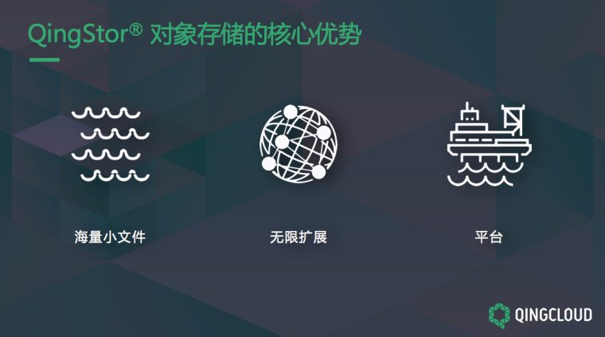
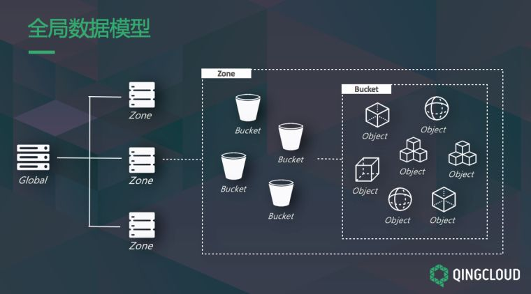
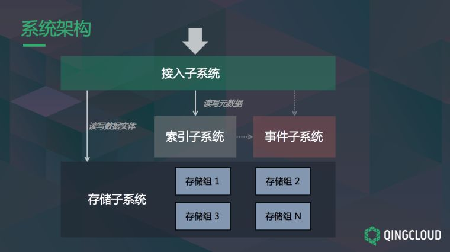
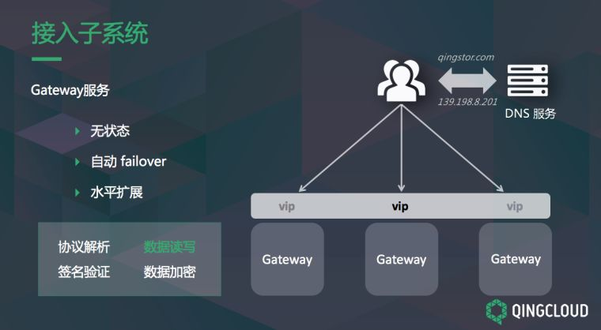
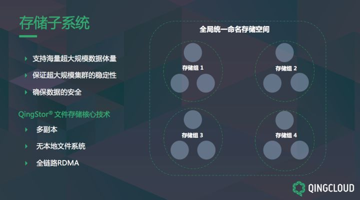
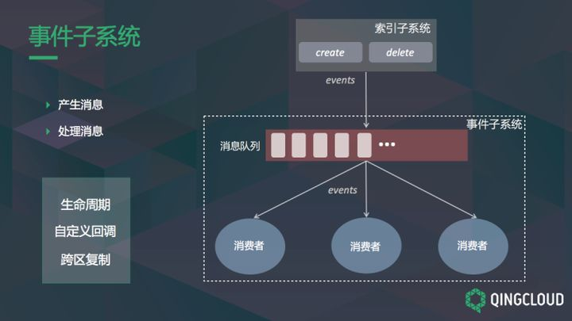
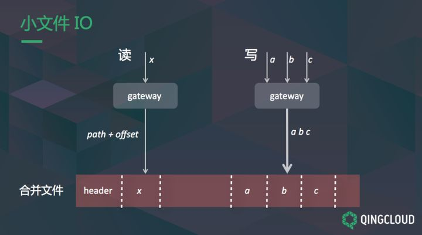
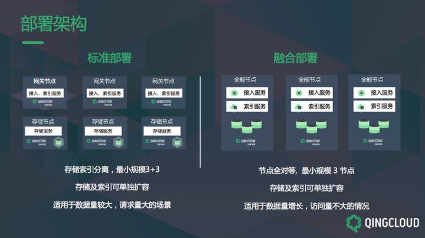
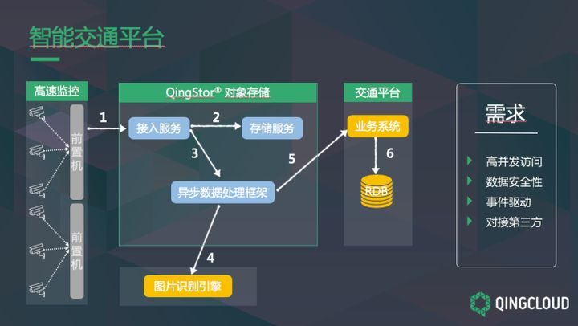

QingStor 对象存储架构设计及最佳实践
======================

对象存储概念及特性
---------

在介绍 QingStor®️对象存储内部的的架构和设计原理之前，我们首先来了解一下对象存储的概念，也就是从外部视角看，对象存储有什么特性，我们应该如何使用。

对象存储本质上是一款存储产品，与其他的存储，如文件存储、块存储，功能是类似的，主要的功能都是数据的读和写。最大的不同在于对象存储是把数据作为对象进行管理，这是它最主要的特征，所有的数据在这里面都当做一个对象处理。

对象存储有一些非常鲜明的特点：

* 它的结构是扁平的，不像文件存储那样有目录层级，在读写数据时不需要对目录进行层层查找和打开。

* 对象存储具备海量数据存储的能力，这里的海量指的是不仅仅是几百 GB 的量，而是说几百 T 甚至上 PB 的级别。

* 对象存储适用于非结构化数据的存储，非结构化具体指的是不对数据的类型和格式做任何假设，不管是简单的文本，还是图片、视频、音频都可以存在对象存储里，当做对象来处理。

* 对象存储通过 Restful 接口对外提供服务，也就是 HTTP 协议，这使得对象存储的访问非常方便，随时随地可以进行数据的上传和下载。

QingStor®️对象存储核心优势
------------------

上面讲的几点是对象存储产品所具备的通用特征，接下来介绍一下青云QingCloud 自研的存储产品 QingStor®️对象存储独有的核心优势，主要包括三方面：

第一，对海量小文件这个场景，我们在存储及 IO 上都做了针对性的优化优化。

第二，QingStor®️对象存储的系统具有无限扩展的能力，当数据量、访问量增加时，可以通过增加节点的方式提升计算和存储能力。

第三，QingStor®️对象存储是数据存储与流转的平台，从两方面来体现：

* 首先，所有功能的 API 都是开放的，可以通过任意调用 API 来完成业务逻辑。
* 其次，提供一些非常有特色的功能，像生命周期管理、跨区域复制以及自定义回调等，可以适配更多的业务场景。

QingStor®️对象存储全局数据模型
--------------------

上图是 QingStor®️对象存储的全局数据模型，可以理解成一个逻辑上的视图。

这包括几个主要概念：Global 是全局的意思，Global 由多个 Zone 组成，Zone 是区域的意思，可以把它理解成数据中心，例如在北京区域部署了一套对象存储，同时在上海数据中心也部署了一套，这两套对象存储属于同一个 Global。

QingStor®️对象存储在 Zone 级别和 Global 级别都有相应的管理服务。

Zone 由很多个 Bucket（存储桶）组成，在使用对象存储时，必须要先申请一个存储桶，然后才能向存储桶中上传对象数据，以存储桶为单位来存储和管理对象数据。

在同一个 Zone 下面可以有很多个存储桶，存储桶里有各种各样的对象数据，对象数据对类型大小没有限制，单个存储桶中对象的数量也没有限制，可以无限量上传对象数据。

QingStor®️对象存储架构解析
------------------

这是 QingStor®️对象存储的后台系统架构，这个架构图经过了一些简化和抽象。

首先是接入子系统，对象存储提供的是在线服务，通过 Restful 进行访问，本质上相当于在线服务的后台，需要有接入子系统来完成接收请求、解析协议等工作。

在接入子系统下是索引子系统，索引子系统用来存储和管理对象的元数据，元数据指的是对象的 Meta 信息，包括 Object 类型、大小、写入时间之类的信息，由索引子系统管理。

存储子系统负责存储和管理数据实体本身，保证数据的可靠持久化存储。

事件子系统主要工作是异步事件处理和分布式任务调度，它是生命周期管理等功能的底层机制。

图中几条实线箭头显示了数据的流向或者说是请求处理流程，请求从接入子系统下来，接入子系统会和索引子系统及存储子系统交互，获取元数据以及数据实体，这是核心的读写流程。

虚线表示在开启了一些功能的情况下，可能会产生事件发送到事件子系统。这里有两个虚线箭头，一是读写流程中会触发一些事件，会将事件发送至子系统；二是用户可以主动提交一些事件，经过接入子系统进入事件子系统。

这几个子系统构成了 QingStor®️对象存储后台的主要模块。

从这个架构图来看，其内部实现并不是特别复杂。

QingStor®️对象存储是一款存储产品，其核心功能是做数据的读写，逻辑上必然不能太复杂。

但是要把这个系统做好并不是那么容易，因为对象存储主要应对的是海量数据的场景，在这个场景下有很多架构设计上的挑战。

首先，数据都要做可靠的存储、可靠的持久化，防止任何数据丢失；

第二，在访问量很大的情况下，需要保证系统的持续服务能力；

第三，系统需要有良好的扩展性以应对不断增加的数据量和请求量。

此外，QingStor®️对象存储是一个分布式系统，由多个节点共同协调提供服务，这种情况下，单个节点的故障是常有的，我们需要做到单个节点故障的情况下，保证服务的可用性以及数据的可靠存储，这些都是在设计架构时需要重点考虑的问题。

接下来，依次来解读这几个子系统是如何实现的。

QingStor®️对象存储子系统实现
-------------------

在接入子系统中最重要是 Gateway 服务，Gateway 服务本质上是在后台运行的 Server，它运行在网关节点上。

Gateway 服务的主要功能是接收上游发下来的请求，做协议解析以及数据处理与数据读写，对象存储中最重要的数据读写功能基本在这里完成。

Gateway 服务本身是无状态的，也就是请求被哪一个 Gateway 是服务处理都是一样的，因此 Gateway 可以非常轻松进行扩展，也就是服务实例的增加与减少。

从整体的链路上看一下接入层是如何保证高可用的。

用户开始访问对象存储之前，会先访问 DNS 服务器，通过对象存储服务的域名拿到一个虚拟 IP 地址，这个虚拟 IP 会指向某一台网关节点，如果这个节点故障了，虚拟 IP 会自动迁移到另外存活的节点上。

也就是 QingStor®️对象存储可以保证用获取到的 IP 永远指向一个存活的节点，业务永远是可用的。

在请求到达节点后，对象存储会进一步做负载均衡，把请求分到多个节点的 Gateway 服务上。

当请求转到一个 Gateway 上，发现这个 Gateway 出了问题，系统自动会将这个请求重新转发，这是请求级别的Failover。

通过这两个机制，QingStor®️对象存储可以保证访问请求都可以得到响应。

此外，将 Gateway 实现为无状态服务，可以非常方便地进行水平扩展，通过增加 Gateway 服务实例个数来顶住高并发的访问量，保证服务可用。

接下来谈谈索引子系统的架构，索引子系统的主要功能是存储和管理对象数据的元数据，元数据包括对象的类型、大小、写入时间与存储位置等信息。

这些信息是非常重要的，如果元数据丢失，数据本身就无法读取，因此要保证元数据绝对安全可靠的存储。

另一方面，海量数据的场景需要支撑海量数据的索引，索引子系统必须要能够处理数据量不断增大的情况。在此基础之上还要尽可能提升系统的处理性能。

QingStor®️对象存储是如何做到的？
---------------------

首先通过数据分片的方式来应对海量数据。把数据按切片存储，切片的意思是按照对象名称字母序进行切片。比如第一个节点存 A-F 对象，第二个节点存 U-Z 对象，每一个节点会负责一个区间的数据，然后使用一个协调服务记录节点及其所负责的区域对应关系。

通过这种方式，可以很方便地横向扩展，如果 A-F 的对象数据太多，系统会把它拆成两个，增加一个节点进来，将 A-F 拆分为 A-D，A-D 保留在原有的节点，D-F 放在新的节点，通过这种方式可以处理更多的数据，也提升了处理读写的能力。

添加新的节点通过协调服务进行，数据的拆分和再平衡过程是完全自动进行的。

QingStor®️对象存储的 Gateway 服务实时跟协调服务保持连接，可以获取最新的数据分布情况。通过这种分片存储机制，保证了海量数据情况下可以通过增加节点的方式来提升存储能力。

在数据安全可靠方面，QingStor®️对象存储采用副本机制，每一份元数据都采用三副本方式进行存储，如果有一个副本所在的机器发生故障，可以从其他的副本上读取数据，在访问的时候保证永远可用。

如果数据所在节点发生变化，Gateway 会立即通过协调服务知道应该访问哪个节点得到数据。此外，三副本都进行了持久化存储，保证数据是安全可靠的。

QingStor®️对象存储在单个节点上存储元数据时使用 KV 存储引擎，KV 存储引擎的索引结构是 LSM，LSM 索引结构最大的优势是写入非常快，可以提升系统的整体写入性能。

除此之外，LSM 还有一个特点，它底层的数据在磁盘上存储时是有序的，也就是一个个 sst 文件，可以提供高效的按顺序查询。

QingStor®️对象存储在处理列出存储桶中对象的查询接口时，可以很好的应用这个存储特性，高效地将数据按字母序列出来。因为它本身是有序存储，所以读取速度非常快，接口处理非常高效，这是采用 KV 存储的优势。

总体来看，QingStor®️对象存储的索引子系统通过分片加协调服务的方式使其有很好的扩展性，同时通过副本保障数据的安全。

此外，在单个节点上采用 KV 存储引擎提升写入效率，同时支持 list 接口的高效查询。

存储子系统存的是对象数据本身，对象存储应对的是海量场景，数据量非常大，而且会持续增加，访问量也会非常大，而且有增加的可能性，因此架构的设计要保障系统可以不断提升性能。此外，还需要保证数据的安全性和集群的稳定性。

QingStor®️对象存储在统一命名存储空间下将存储分成一个个存储组，每个存储组由各自的分布式文件系统组成。

采用存储组设计的优势主要包括三方面：

一是区分冷热数据，也就是存储分级，QingStor®️对象存储提供两种存储级别：低频存储和标准存储。

标准存储相对于低频存储来讲，其访问量高一些，数据量可能会少一些。

低频存储的数据量大，但访问量会低一些。

针对两种不同的存储需求可以使用不同的存储组，组和组之间是没有关系的，因此不同的存储组可以采用异构的硬件设备。对于低频存储，可以使用大容量的磁盘和低一点CPU的配置，进一步优化成本。

第二，采用存储组可以使得集群扩展起来更加灵活方便，比如系统要进行扩容，如何做？

加一个存储组即可，可以直接把新数据写到新的存储组中，不需要对历史数据做移动和迁移等复杂操作。

QingStor®️对象存储同时支持另一种扩容方式，将既有数据迁移一部分到新存储组上，使得整个集群比较均衡。

第三，采用存储组具有故障隔离的效果。如果存储组 1 出现节点的故障或者整个存储组坏掉，对其他存储组没有影响，其他存储组可以正常处理数据，具有故障隔离的效果。

在单个存储组内，应用 QingStor®️文件存储的核心技术，采用三副本进行存储，每次写入数据，等到三副本写入全部完成才会返回写入成功，保证数据的强一致性和安全性。

本地文件系统直接和底层的块设备打交道，省去了 Linux 本地文件系统，使得 IO 处理在性能上的得到提升。

QingStor®️对象存储的数据传输采用 RDMA 高效传输协议，RDMA 是一种在不同的节点之间传输数据的机制，它不需要经过 CPU，直接通过硬件控制将数据从一个节点拷贝到另一个节点，和 CPU 的执行是并行的，是一种高效传输数据的方式。

事件子系统在 QingStor®️对象存储的架构中，不处于数据读写的核心流程上，但它提供了很多非常重要的功能，生命周期管理、跨区域复制以及自定义回调都是基于事件子系统来进行设计的。

事件子系统的基本逻辑比较简单，产生事件和处理事件，这里事件可以理解成消息系统。

产生消息有两条链路，一条链路在做数据读写时，当你完成一条数据的读、写入、删除或者更新，索引子系统会产生事件，发送到事件子系统中；还有一条链路是用户直接通过接入子系统提交一个事件，可以进入事件子系统中。

事件子系统有很多预置的消费者进程，消费者会处理事件，这些事件是通过分布式消息队列保存的，消费者按照预设的逻辑读取事件并对其进行处理。比如有一个消费者专门处理生命周期的功能，有一个消费者专门处理自定义回调的功能。

QingStor®️对象存储海量小文件优化实践
-----------------------

接下来谈谈 QingStor®️对象存储对海量小文件场景的优化。

为什么需要对海量小文件进行优化呢？

海量小文件是很多存储产品中都是比较难以应对的问题，其难点主要体现在几个方面：

第一，小文件非常多的时候，会导致很多随机读写，相比于顺序读写，随机读写的性能会差很多。

第二，小文件在底层资源利用率比较低。如何理解？小文件最终存储时落到磁盘上，大多数时候底层都是采用文件系统存储，每一个小文件都会对应一个文件，文件系统会单独使用一个结构，也就是 inode，来记录每一个小文件的元信息，包括执行权限、用户组等信息，但是这些信息对用户来说往往是无意义的。

这导致在海量的场景下，可能出现一个情况：文件本身的数据不是那么多，但是不必要的元数据却非常多，占用大量存储空间，就会造成底层资源利用率较低。

针对这个问题，QingStor®️对象存储做了一些优化，主要分为两方面：

在提升存储利用率方面，QingStor®️对象存储把很多小文件合并成一个大文件。

如上图所示，这里有一个合并文件，里面包括很多小文件，包括x、a、b、c，它们都是单个 Object 小文件，都会写到同一个文件中。通过这种方式减少额外的元数据存储，提升资源利用率。

在使用这种方式时，如果需要删除前面的小文件，QingStor®️对象存储只做一个标记，后台会有进程，实时、定期对合并文件进行压缩，将删除的资源进行释放。

在提升写入性能方面，QingStor®️对象存储在写入一个小文件时，只把它向合并文件的尾部进行追加写入，不会在打开文件后对指定的 Offset 进行写入，也就是不做随机写，保证写入全是顺序写，大大提升写入性能。

此外，如果有并发的写入请求，比如 a、b、c三个都是小文件，有一个写入请求到了 Gateway，Gateway 会把这三个请求打包成一个，本来需要写三次，这里直接合并成一次。

把三次 IO 减到一次 IO，能做这样的合并是因为底层是采用合并方式的存储，并发 IO 的合并进一步提升 QingStor®️对象存储的写入性能。

在读取时，QingStor®️对象存储通过合并文件的 Path 加上小文件中的 Offset，找到这个文件的数据进行读取。

举个例子，现在同时要读 x 和 a、b、c，在读完 x，打开文件句柄是可以重复利用的，不需要每一次读都打开文件，这种方式使得 QingStor®️对象存储的小文件读取性能得到提升。

QingStor®️对象存储重点功能介绍
--------------------

QingStor®️对象存储支持两种部署方式：一种是标准部署，集群由网关节点和存储节点组成。

接入与索引与事件子系统会部署在网关节点上，存储节点只部署存储服务，把计算和存储分离，支持最小是六个节点规模的部署，这种方式比较适合数据量比较大，请求量也比较大的场景，网关节点与存储节点都可以进行独立扩容。

第二种是融合部署，集群由全能节点组成，把所有服务部署在全能节点上，这种方式是适合规模比较小，数据量比较小，访问量也不大的场景，如果数据量增长，可以非常方便以单个节点的方式进行存储与索引服务的扩容。

首先是生命周期管理功能，生命周期可以对存储的数据预设一些逻辑，过一段时间后自动对数据进行处理。

生命周期有一些典型的应用场景，例如对过期日志的处理，很多时候存储的日志是为了满足政策的要求，过几个月后就可以删除了。

生命周期管理可以设置自动规则，到期后自动删除过期的日志数据。此外，生命周期管理功能还能进行冷热数据分离，举个例子，业务只需要对近两个月的数据进行分析，更久远的数据就不需要。

但是为了合规需要，更久远的数据也需要保存，不能丢失，这时候生命周期管理功能可以做冷热数据的区分，自动设置数据经过一段时间后转移到更低成本的低频存储中。

QingStor®️对象存储的生命周期功能是以存储桶为单位来进行，其核心是事件子系统进行消息的处理和分发。

用户写入一个对象后会产生一个事件，事件子系统会分析这个事件要怎么处理，比如经过一周、一个月进行删除，或者转移到低频，从而对数据进行相应的处理。

如果在开启生命周期功能管理之前，系统已经有一些历史数据，事件子系统会主动拉取这些历史数据，对它进行分析和处理。

QingStor®️对象存储另一个重要的功能是跨区域复制，适用于数据的备份与容灾场景。

跨区域复制的应用场景主要包括：

备份和容灾：为了保证数据安全性，在本地有一份之外，需要在另一个机房做备份，本地机房的数据丢失了，可以用远端的数据来恢复。

就近访问：如果业务的用户分布在不同的区域，每个用户在访问其图片、视频资源时，希望更快地获取数据。

QingStor®️对象存储可以按照地域来存储数据，北京一份，上海一份，数据可以写入到北京，跨区域复制到上海，满足就近访问的需求。

提升计算效率：如果有多个机器学习、数据挖掘的应用程序或业务程序要访问同一份数据，这些业务程序可能部署在不同的地方。为了保证计算效率，QingStor®️对象存储可以通过跨区域复制，就近复制一份数据。

跨区域复制的功能核心仍然是事件子系统，用户写入一个对象后，就会产生一个事件，事件子系统会处理这个事件，将数据复制到远端指定目标的存储桶里。

如果在配置这个功能之前系统已经有一些历史数据，在配置之后，事件子系统会主动拉取这些数据，将它复制到远端的位置。

接下来重点介绍QingStor®️对象存储的数据处理功能。

用户要对存储在对象存储中的数据进行处理，包括视频转码、缩略图、图片加水印等，可以将要做的动作打包成一个任务进行提交，通过 Gateway 服务进入事件子系统，事件子系统将按照指定的动作将数据读出来，进行处理与写入目标位置。

做数据处理的前提是数据存放在对象存储的存储桶中，这是数据处理的流程，其核心依然是QingStor®️对象存储的事件子系统。

下面从用户的角度来看 QingStor®️对象存储是否够方便，是否容易上手。

QingStor®️对象存储的所有功能 API 都是开放的，可以进行调取和访问，同时提供 8 种主流的SDK，涵盖主流的编程语言，这些 SDK 代码都是开源的，都在 GitHub 上，大家可以直接拿来使用。

此外，QingStor®️对象存储提供两个高级命令行工具：

第一种是 qsctl，提供强大的类 Unix 命令，用于管理本地数据资源以及 QingStor®️对象存储中远程的数据资源，可以非常方便地对数据进行操作，包括 RM、CP 等操作，提供一键同步，将你本地的数据与对象存储中的数据进行同步。

第二种命令行工具是 qscamel，用于在不同对象存储系统间进行高效的数据迁移，比如现在有数据在阿里云的 OSS 里，你想把它迁移到 QingStor 中，可以使用这个工具来完成。这个工具目前支持主流的对象存储，包括 QingStor、AliyunOSS、AWSS3 以及 GoogleCloud Storage 等，可以在这些系统之间进行数据的迁移。

S3 是亚马逊对象存储服务访问接口的标准，QingStor®️对象存储是对 S3 兼容得非常好，很多已经基于 S3 开发的应用程序、SDK 和第三方服务，都可以在不修改代码的前提下非常容易地接入 QingStor®️对象存储，包括 Hadoop、Spark、ElasticSearch 以及 Docker 等。

QingStor®️对象存储交通行业最佳实践

最后我们从智能交通平台这个场景出发，看看如何在业务中使用 QingStor®️对象存储。智能交通平台的主要应用是高速公路上的视频监控，以及在收费站进行拍照、收费、车牌识别等业务。

这是一个典型的高并发访问场景，高速摄像头非常多，收费站也是非常多的。每一个摄像头、每一个收费站都会产生海量图片、视频资源，要发送 QingStor®️对象存储中。

数据是非常重要的，高速公路上的每一段视频，事后可能要用于查看当时发生的情况，数据一定要做可靠的存储。

另一方面，要求存储系统可以与第三方业务应用无缝对接，例如在收费站拍了车辆照片，需要识别其车牌号，查询从哪里开过来，这就要求 QingStor®️对象存储与其他业务系统进行对接。

QingStor®️对象存储的接入服务可以通过扩展的方式支持高并发场景，采用多副本提供可靠的强一致存储。

数据写入后，QingStor®️对象存储会产生事件，这个事件会到事件子系统，按照预设的逻辑进行数据处理，用户可以自定义第三方接口。比如做一个车牌识别，或者做扣费逻辑，都可以通过自定义接口与业务系统进行关联。

此外，QingStor®️对象存储的数据沉淀，后期可以支持业务的大数据分析和决策。

最后做个总结，QingStor®️对象存储是一款面向海量非结构化数据的企业级通用数据存储平台，具备无限扩容与跨地域的服务能力，可完美支撑各类互联网应用、大数据分析、音视频影像、备份系统等企业级应用场景下的存储需求，帮您构建面向未来、赋能业务的数据存储平台。
