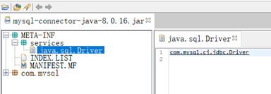
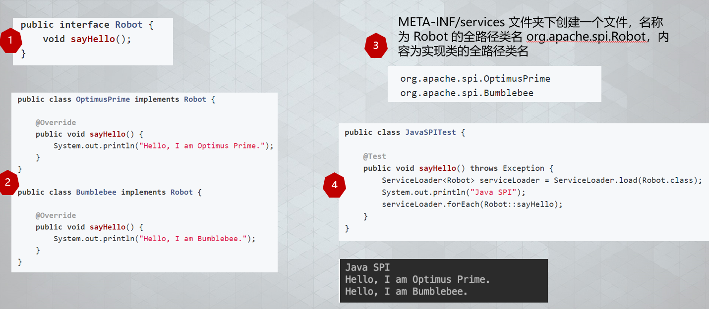

# Spring Boot 教程：如何开发一个 starter

# 导语

熟悉 Spring Boot 的同学都知道，Spring Boot 提供了很多开箱即用的 starter，比如 spring-boot-starter-mail、spring-boot-starter-data-redis 等等，使用这些 starter 非常简单，引入依赖，再在配置文件中配置相关属性即可。本课程教您自己开发一个 starter，具备了这个技能后，您可以在工作中封装自己业务相关的各种 starter。

# 如何开发一个自定义的 starter

开发一个 starter 简单来说以下几步即可：

- 一个/多个自定义配置的属性配置类（可选）
- 一个/多个自动配置类
- 自动配置类写入到 Spring Boot 的 SPI 机制配置文件：spring.factories

# Java SPI 机制简介

Spring Boot 的 starter 的核心其实就是通过 SPI 机制自动注入配置类，不过是它自己实现的一套 SPI 机制，我们先了解一下 Java 的 SPI 机制。

SPI 全称 Service Provider Interface，是 Java 提供的一套用来被第三方实现或者扩展的 API，它可以用来启用框架扩展和替换组件。

SPI 的大概流程是：

> 调用方 –> 标准服务接口 –> 本地服务发现 (配置文件) –> 具体实现

所以 Java SPI 实际上 **是“基于接口的编程＋策略模式＋配置文件” 组合实现的动态加载机制** 。

一个 SPI 的典型案例就是 JDBC 的驱动，Java JDBC 定义接口规范（java.sql.Driver），各个数据库厂商（MySQL/Oracle/MS SQLServer 等）去完成具体的实现，然后通过 SPI 配置文件引入具体的实现类，如下图：



# Java SPI 机制示例

一个简单的 Java SPI 开发步骤：

- 定义一个业务接口
- 编写接口实现类
- 创建 SPI 的配置文件，实现类路径写入配置文件中
- 通过 Java SPI 机制调用



# Spring Boot SPI 机制底层实现

了解了 Java 的 SPI 机制后，基本也能猜出 Spring Boot 的 SPI 实现了，基本流程是一样的：

> 读取配置文件 –> 将具体的实现类装配到 Spring Boot 的上下文环境中

接下来我们从源码中查找答案。

入口：Spring Boot 的启动类，@SpringBootApplication 注解，查看源码可以发现这是一个组合注解，包括 @SpringBootConfiguration、@EnableAutoConfiguration、@ComponentScan。

```java
@Target(ElementType.TYPE)
@Retention(RetentionPolicy.RUNTIME)
@Documented
@Inherited
@SpringBootConfiguration
@EnableAutoConfiguration
@ComponentScan(excludeFilters = {
        @Filter(type = FilterType.CUSTOM, classes = TypeExcludeFilter.class),
        @Filter(type = FilterType.CUSTOM,
                classes = AutoConfigurationExcludeFilter.class) })
public @interface SpringBootApplication {
    ...
}
```

@EnableAutoConfiguration，熟悉 Spring Boot 的同学应该知道 Spring Boot 有很多 @EnableXXX 注解，其实现就是通过 @Import(xxxSelector) 导入一个 xxxSelector 的实现类，来装载配置类：

```java
@Target(ElementType.TYPE)
@Retention(RetentionPolicy.RUNTIME)
@Documented
@Inherited
@AutoConfigurationPackage
@Import(AutoConfigurationImportSelector.class)
public @interface EnableAutoConfiguration {
    ...
}
```

继续看 AutoConfigurationImportSelector 源码，我们关注下 selectImports 方法即可，该方法就是用来装配自动配置类的：

```java
@Override
    public String[] selectImports(AnnotationMetadata annotationMetadata) {
        if (!isEnabled(annotationMetadata)) {
            return NO_IMPORTS;
        }
        //加载自动配置元数据配置文件，后面会解释
        AutoConfigurationMetadata autoConfigurationMetadata = AutoConfigurationMetadataLoader
                .loadMetadata(this.beanClassLoader);
        //加载自动配置类，会合并上面的元数据配置文件中的配置类    
        AutoConfigurationEntry autoConfigurationEntry = getAutoConfigurationEntry(
                autoConfigurationMetadata, annotationMetadata);
        return StringUtils.toStringArray(autoConfigurationEntry.getConfigurations());
    }
```

继续跟踪源码：

> getAutoConfigurationEntry –> getCandidateConfigurations –>SpringFactoriesLoader.loadFactoryNames –> loadSpringFactories –> classLoader.getResources (FACTORIES_RESOURCE_LOCATION)

终于找到了 SPI 的配置文件：FACTORIES_RESOURCE_LOCATION。

```java
public static final String FACTORIES_RESOURCE_LOCATION = "META-INF/spring.factories";
```

到这基本就可以看到 Spring Boot 的装载流程了，在 META-INF/spring.factories 下定义的配置类会自动装配到 Spring Boot 的上下文。

# 开发一个自定义 starter

了解了上面 Spring Boot 的 SPI 加载机制后，我们来开发一个自定义的 starter，我这里写个简单的邮件发送的 starter，为简化代码，这里我还是依赖 Spring Boot 提供的 mail-starter， 在这个基础上进行一层封装：

\\1. 创建一个 module：email-spring-boot-starter，引入依赖。

```xml
<!-- 邮件发送支持 -->
        <dependency>
            <groupId>org.springframework.boot</groupId>
            <artifactId>spring-boot-starter-mail</artifactId>
        </dependency>
        <!-- 模版邮件 -->
        <dependency>
            <groupId>org.springframework.boot</groupId>
            <artifactId>spring-boot-starter-freemarker</artifactId>
        </dependency>
        <dependency>
            <groupId>org.springframework.boot</groupId>
            <artifactId>spring-boot-starter-web</artifactId>
            <scope>provided</scope>
        </dependency>
```

\\2. 编写邮件发送模版类，这里我添加了一个是否启用的开关：

```
@ConditionalOnProperty (name = "dragon.boot.email.enable", havingValue = "true")
@Slf4j
@Configuration
@ConditionalOnProperty(name = "dragon.boot.email.enable", havingValue = "true")
public class MailSenderTemplate {
     //注入Spring Boot提供的mail中的邮件发送类
    @Autowired
    private JavaMailSender mailSender;
    @Value("${spring.mail.from}")
    private String from;
    @Autowired
    private FreeMarkerConfigurer freeMarkerConfigurer;
    /**
     * @MethodName: send
     * @Author: pengl
     * @Date: 2019-10-31 13:38
     * @Description: 发送邮件
     * @Version: 1.0
     * @Param: [to, content, subject]
     * @Return: com.dragon.boot.common.model.Result
     **/
    public Result send(String to, String content, String subject) {
        return send(MailDto.builder().to(to).content(content).subject(subject).build());
    }
    /**
     * @MethodName: send
     * @Author: pengl
     * @Date: 2019-10-31 13:39
     * @Description: 发送邮件(抄送)
     * @Version: 1.0
     * @Param: [to, content, subject, cc]
     * @Return: com.dragon.boot.common.model.Result
     **/
    public Result send(String to, String content, String subject, String cc) {
        return send(MailDto.builder().to(to).content(content).subject(subject).cc(cc).build());
    }
    /**
     * @MethodName: sendTemplate
     * @Author: pengl
     * @Date: 2019-10-31 13:39
     * @Description: 发送模版邮件
     * @Version: 1.0
     * @Param: [to, model, template, subject]
     * @Return: com.dragon.boot.common.model.Result
     **/
    public Result sendTemplate(String to, Map<String, Object> model, String template, String subject) {
        return send(MailDto.builder().to(to).content(getTemplateStr(model, template)).subject(subject).build());
    }
    /**
     * @MethodName: sendTemplate
     * @Author: pengl
     * @Date: 2019-10-31 13:39
     * @Description: 发送模版邮件(带抄送)
     * @Version: 1.0
     * @Param: [to, model, template, subject, cc]
     * @Return: com.dragon.boot.common.model.Result
     **/
    public Result sendTemplate(String to, Map<String, Object> model, String template, String subject, String cc) {
        return send(MailDto.builder().to(to).content(getTemplateStr(model, template)).subject(subject).cc(cc).build());
    }
    /**
     * @MethodName: getTemplateStr
     * @Author: pengl
     * @Date: 2019-10-31 13:38
     * @Description: 解析freemark模版
     * @Version: 1.0
     * @Param: [model, template]
     * @Return: java.lang.String
     **/
    private String getTemplateStr(Map<String, Object> model, String template) {
        try {
            return FreeMarkerTemplateUtils.processTemplateIntoString(freeMarkerConfigurer.getConfiguration().getTemplate(template), model);
        } catch (Exception e) {
            log.error("获取模版数据异常：{}", e.getMessage(), e);
        }
        return "";
    }
    /**
     * @MethodName: send
     * @Author: pengl
     * @Date: 2019-10-31 13:34
     * @Description: 发送邮件
     * @Version: 1.0
     * @Param: [mailDto]
     * @Return: com.dragon.boot.common.model.Result
     **/
    public Result send(MailDto mailDto) {
        if (StringUtils.isAnyBlank(mailDto.getTo(), mailDto.getContent())) {
            return new Result(false, 1001, "接收人或邮件内容不能为空");
        }
        String[] tos = filterEmail(mailDto.getTo().split(","));
        if (tos == null) {
            log.error("邮件发送失败，接收人邮箱格式不正确：{}", mailDto.getTo());
            return new Result(false, 1002, "");
        }
        MimeMessage mimeMessage = mailSender.createMimeMessage();
        try {
            MimeMessageHelper helper = new MimeMessageHelper(mimeMessage, true);
            helper.setFrom(from);
            helper.setTo(tos);
            helper.setText(mailDto.getContent(), true);
            helper.setSubject(mailDto.getSubject());
            //抄送
            String[] ccs = filterEmail(mailDto.getCc().split(","));
            if (ccs != null) {
                helper.setCc(ccs);
            }
            //秘抄
            String[] bccs = filterEmail(mailDto.getBcc().split(","));
            if (bccs != null) {
                helper.setBcc(bccs);
            }
            //定时发送
            if (mailDto.getSendDate() != null) {
                helper.setSentDate(mailDto.getSendDate());
            }
            //附件
            File[] files = mailDto.getFiles();
            if (files != null && files.length > 0) {
                for (File file : files) {
                    helper.addAttachment(file.getName(), file);
                }
            }
            mailSender.send(mimeMessage);
        } catch (Exception e) {
            log.error("邮件发送异常：{}", e.getMessage(), e);
            return new Result(false, 1099, "邮件发送异常：" + e.getMessage());
        }
        return new Result();
    }
    /**
     * 邮箱格式校验过滤
     *
     * @param emails
     * @return
     */
    private String[] filterEmail(String[] emails) {
        List<String> list = Arrays.asList(emails);
        if (CollectionUtil.isEmpty(list)) {
            return null;
        }
        list = list.stream().filter(e -> checkEmail(e)).collect(Collectors.toList());
        return list.toArray(new String[list.size()]);
    }
    private boolean checkEmail(String email) {
        return ReUtil.isMatch("\\[email protected]\\w+\\.[a-z]+(\\.[a-z]+)?", email);
    }
}
```

\\3. 编写 SPI 配置文件，在 resources 下新建文件夹 META-INF，创建配置文件 spring.factories，内容如下：

```
//替换成自己的路径
org.springframework.boot.autoconfigure.EnableAutoConfiguration=\
    com.dragon.boot.mail.service.MailSenderTemplate 
```

\\4. 一个简单的 starter 模块就编写好了，使用时引入这个依赖， application.properties 属性文件里添加配置即可。

```properties
 # 邮件发送配置
spring.mail.host=mail.xxx.com
spring.mail.username=xx
 spring.mail.password=xx
spring.mail.protocol=smtp
spring.mail.properties.mail.smtp.auth=true
spring.mail.properties.mail.smtp.port=465
[email protected]
spring.mail.properties.mail.smtp.starttls.enable=true
spring.mail.properties.mail.smtp.starttls.required=true
spring.mail.properties.mail.smtp.ssl.enable=true
spring.mail.properties.mail.smtp.socketFactory.class=javax.net.ssl.SSLSocketFactory
spring.mail.properties.mail.smtp.socketFactory.fallback=false
spring.mail.default-encoding=utf-8
[email protected]
# 所有附件最大长度（单位字节，默认100M）
spring.mail.maxUploadSize=104857600
spring.mail.maxInMemorySize=4096
#启用email模块
dragon.boot.email.enable=true
```

这只是一个最简单的例子，如果严格按规范，可以将所有的 autoconfig 类，包括 Property 属性配置类和逻辑配置类都放到一个独立的模块中，再另起一个 starter 模块，引入这个独立的 autoconfig 模块。

# 自定义 starter 优化

属性配置自动提示功能：使用 Spring Boot 官方提供的 starter 的时候，在 application.properties 中编写属性配置是有自动提示功能的，要实现这个也很简单，引入一下依赖即可，该插件引入后，打包时会检查 @ConfigurationProperties 下的类，自动生成 spring-configuration-metadata.json 文件用于编写属性提示：

```xml
<dependency>
  <groupId>org.springframework.boot</groupId>
  <artifactId>spring-boot-configuration-processor</artifactId>
  <optional>true</optional>
</dependency>
```

- 启动优化：前面有提到 Spring Boot 的 SPI 加载流程，会先加载自动配置元数据配置文件，引入以下依赖，该插件会自动生成 META-INF/spring-autoconfigure-metadata.properties，供 AutoConfigurationImportSelector 过滤加载，提升启动性能：

```xml
<dependency>
  <groupId>org.springframework.boot</groupId>
  <artifactId>spring-boot-configuration-processor</artifactId>
  <optional>true</optional>
</dependency>
```

# 总结

依托 Spring Boot 强大的 AutoConfig 能力，我们可以封装各种自定义 starter，做到开箱即用，降低业务耦合，提高开发效率！
