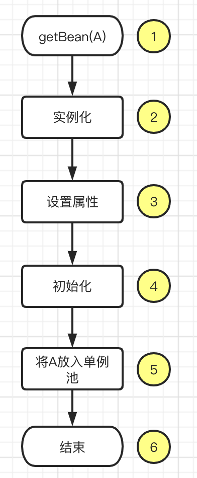
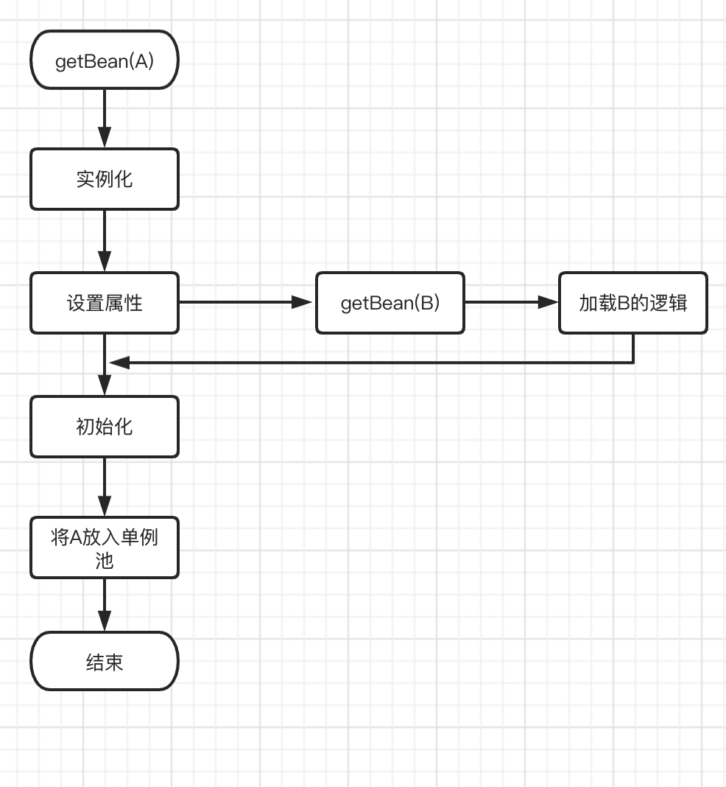
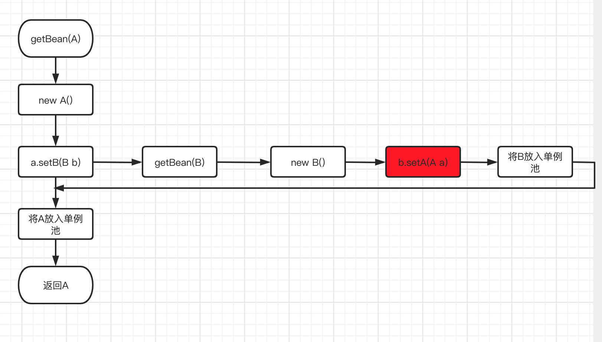
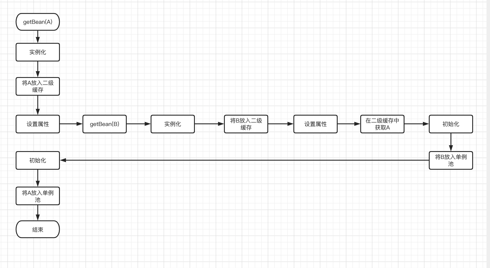
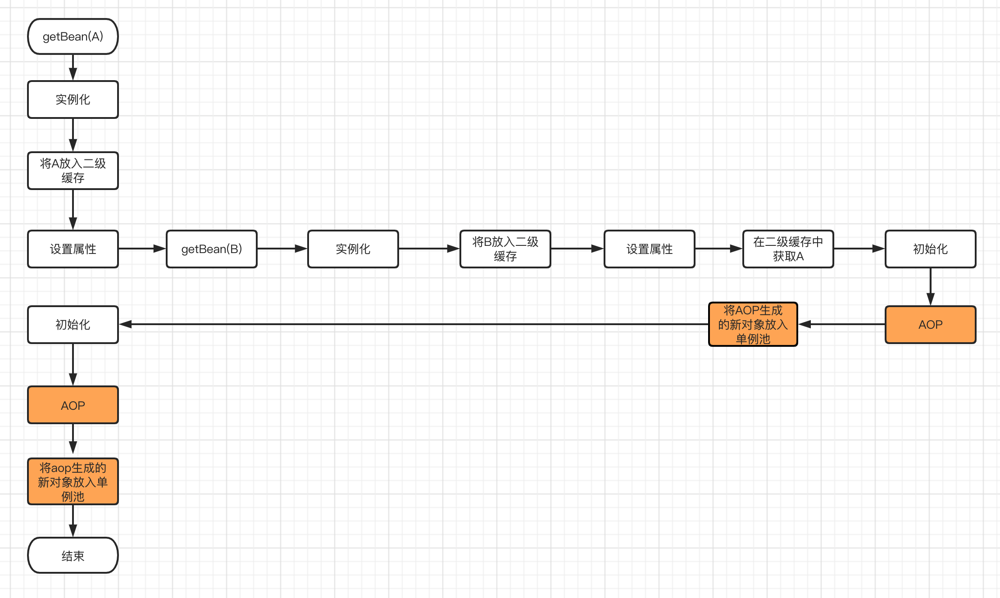
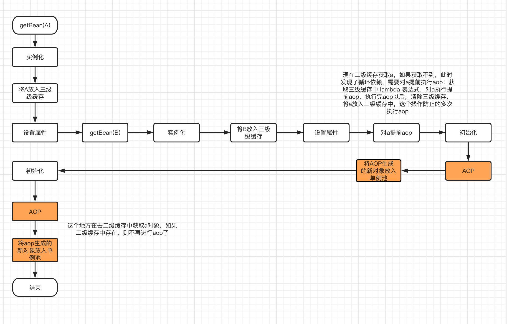

# Spring 循环依赖及解决方式

### 循环依赖

Spring 有一个经典的问题，就是如何解决循环依赖，话不多说，直接开始，

```
@Component
public Class A { 
  @Autowired private B b;
}
@Component
public Class B { 
  @Autowired private A b;
}
```

### spring bean 的生命周期



获取一个 Bean 的操作从 getBean(String name) 开始主要步骤为

1、getBean(String name)

2、实例化对象 A a = new A(); 此时执行构造方法的依赖注入

3、设置对象属性 populateBean(beanName, mbd, instanceWrapper); 此时执行属性的依赖注入

4、执行初始化方法 initializeBean(beanName, exposedObject, mbd); 此时执行 bean 的 initialize 方法

5、将生成好的 bean 对象添加到 单例池（一个 hashMap，保证单例 bean 在 context 仅仅存在一个对象）

6、结束

伪代码如下：

```
public Object getBean(String name) {
 //省略根据name获取A的过程
 A a = new A();
 a.initialze();
 singletonObjects.put(name, a);
 return a;
}
```

##### A 依赖 B 的情况下的加载流程



伪代码如下：

```java
public Object getBean(String name) {
 //省略根据name获取A的过程
 A a = new A(); //实例化A
 a.setB(getBean("B")); //设置属性，发现a依赖于b，所以先加载b，加载B完成以后再继续加载a
 a.initialze(); //执行初始化方法
 singletonObjects.put(name, a); //将a放入单例池中
 return a;
}
```

##### A、B 互相依赖的加载流程



以上就会出现一个问题，由于 a、b 都是单例 Bean，加载 b 的时候，到了上图中标红的阶段后，b 依赖注入的 a 的引用应该是通过 getBean(A) 得到的引入，如果还是以上的逻辑，又再一次走入了 A 的创建逻辑，此时就是发生了循环依赖。下面我们就开始介绍 Spring 是如何解决循环依赖的。

### 一级缓存：单例池 singletonObjects

```
private final Map<String, Object> singletonObjects = new ConcurrentHashMap<>(256);
```

我们都知道如果是单例的 Bean，每次 getBean(beanName)返回同一个 bean，也就是在整个 ApplicationContext 里面，仅有一个单例 Bean，单例 Bean **创建完成后**就放在 singletonObjects 这个 Map 里面，这就是一级缓存。此时说的“创建完成”指的是图一的第 6 步骤，图三中 getBean("B") 的过程中，a 是没有加入到一级缓存中，所以在 getBean("B") 的流程中，b 依赖了 a，此时 b 是找不到 a 对象的。依然会无法解决循环引用的问题。

### 二级缓存：earlySingletonObjects

```
private final Map<String, Object> earlySingletonObjects = new HashMap<>(16);
```

这个时候我们考虑再引入一个 Map 存放引用，earlySingletonObjects 这个 map 我们打算存放提前暴露 bean 的引用，实例化以后，我们就把对象放入到 earlySingletonObjects 这个 map 中，这样在 加载 b 的过程中，b.setA(getBean("a")),我们就可以在 earlySingletonObjects 拿到 a 的引用，此时 a 仅仅经过了实例化，并没有设置属性。流程如下：



1、getBean(A)

2、A a = new A();

3、earlySingletonObjects.put("a", a); 将 A 放入二级缓存

3、设置 A 的属性

4、getBean(B)

5、设置 B 的属性，发现 B 依赖 A，从二级缓存中获取 A

6、加载 B 成功

7、将 B 放入一级缓存

8、继续加载 A

9、加载 A 完成，将 A 放入单例池

到目前为止，发现使用二级缓存似乎就能解决我们的问题。看起来很美好，这是 Spring IOC 的特性，Spring 的另一大特性是 AOP 面向切面编程，动态增强对象，不管使用 JDK 的动态代理和 Cglib 动态代理，都会生成一个全新的对象。下图中我标出了 AOP 动态增强的位置。



此时就会出现一个问题，因为经过 AOP 以后，生成的是增强后的 bean 对象，也就是一个全新的对象，我们可以看到经过图中的流程后，单例池中会存在两个 bean：增强后的 a、b 对象，此时 a 对象中依赖的 b 为增强后的，而 b 对象依赖的 a 是为原始对象，未增强的。所以使用二级缓存解决不了循环依赖中发生过 aop 的引用问题。

### 三级缓存：singletonFactories

```
private final Map<String, ObjectFactory<?>> singletonFactories = new HashMap<>(16);
```

为了解决二级缓存中 AOP 生成新对象的问题，Spring 中的解决方案是：提前 AOP，如果我们能够提前 AOP 就能解决上面的问题了，提前 AOP 指的就是，在 加载 B 的流程中，如果发生了循环依赖，就是说 b 又依赖了 a，我们就要对 a 执行 aop，提前获取增强以后的 a 对象，这样 b 对象依赖的 a 对象就是增强以后的 a 了。三级缓存的 key 是 beanName，value 是一个 lambda 表达式，这个 lambda 表达式的作用就是进行提前 AOP。

下面是加入了三级缓存和 AOP 的流程图，PS：可能会有点乱。。。。。。



上面就是三级缓存的作用，其中有个三级缓存到二级缓存的升级过程，这个非常重重要，这个主要是防止重复 aop。好的，写到这里，我们对 Spring 如何使用三级缓存解决循环依赖的流程已经大概清楚了，下面分析一下源码。

### 源码解析

##### 1、 doGetBean

```
protected <T> T doGetBean(final String name, @Nullable final Class<T> requiredType,@Nullable final Object[] args, boolean typeCheckOnly) throws BeansException {
    Object bean;
    //首先先尝试获取bean，如果加载过就不会在重复加载了
    Object sharedInstance = getSingleton(beanName);
    //省略细节
    if(sharedInstance != null) {
        bean = getObjectForBeanInstance(sharedInstance, name, beanName, null);
    } else {
         //根据beanName获取 beanDefinition 对象
        final RootBeanDefinition mbd = getMergedLocalBeanDefinition(beanName);
        if (mbd.isSingleton()) {
            //单例bean的加载逻辑
           sharedInstance = getSingleton(beanName, () -> {
              try {
                 return createBean(beanName, mbd, args);
              }
              catch (BeansException ex) {
                 // Explicitly remove instance from singleton cache: It might have been put there
                 // eagerly by the creation process, to allow for circular reference resolution.
                 // Also remove any beans that received a temporary reference to the bean.
                 destroySingleton(beanName);
                 throw ex;
              }
           });
           else if (mbd.isPrototype()) {
               //原型域bean的加载逻辑
               Object prototypeInstance = null;
               try {
                  beforePrototypeCreation(beanName);
                  prototypeInstance = createBean(beanName, mbd, args);
               }
               finally {
                  afterPrototypeCreation(beanName);
               }
               bean = getObjectForBeanInstance(prototypeInstance, name, beanName, mbd);
            }
           bean = getObjectForBeanInstance(sharedInstance, name, beanName, mbd);
        }
    }
    return (T)bean;
}
```

##### 2、 第 1 步中 getSingleton(beanName)

```
public Object getSingleton(String beanName) {
   return getSingleton(beanName, true);
}
protected Object getSingleton(String beanName, boolean allowEarlyReference) {
   //首先去一级缓存中获取如果获取的到说明bean已经存在，直接返回
   Object singletonObject = this.singletonObjects.get(beanName);
   //如果一级缓存中不存在，则去判断该bean是否在创建中，如果该bean正在创建中，就说明了，这个时候发生了循环依赖
   if (singletonObject == null && isSingletonCurrentlyInCreation(beanName)) {
      synchronized (this.singletonObjects) {
         //如果发生循环依赖，首先去二级缓存中获取，如果获取到则返回，这个地方就是获取aop增强以后的bean
         singletonObject = this.earlySingletonObjects.get(beanName);
         //如果二级缓存中不存在，且允许提前访问三级引用
         if (singletonObject == null && allowEarlyReference) {
            //去三级缓存中获取
            ObjectFactory<?> singletonFactory = this.singletonFactories.get(beanName);
            if (singletonFactory != null) {
               //如果三级缓存中的lambda表达式存在，执行aop，获取增强以后的对象，为了防止重复aop，将三级缓存删除，升级到二级缓存中
               singletonObject = singletonFactory.getObject();
               this.earlySingletonObjects.put(beanName, singletonObject);
               this.singletonFactories.remove(beanName);
            }
         }
      }
   }
   return singletonObject;
}
```

##### 3、 第 1 步中 单例 bean 的加载逻辑

```
sharedInstance = getSingleton(beanName, () -> {
  try {
     return createBean(beanName, mbd, args);
  }
  catch (BeansException ex) {
     // Explicitly remove instance from singleton cache: It might have been put there
     // eagerly by the creation process, to allow for circular reference resolution.
     // Also remove any beans that received a temporary reference to the bean.
     destroySingleton(beanName);
     throw ex;
  }
});
//获取bean
public Object getSingleton(String beanName, ObjectFactory<?> singletonFactory) {
   Assert.notNull(beanName, "Bean name must not be null");
   synchronized (this.singletonObjects) {
      Object singletonObject = this.singletonObjects.get(beanName);
      if (singletonObject == null) {
          //将当前bean加入到 singletonsCurrentlyInCreation 这个map中，这个map里面是正在创建中的bean，用于判断循环依赖
          beforeSingletonCreation(beanName);
          //执行上面方法的lambda表达式，创建bean
          singletonObject = singletonFactory.getObject();
          //将 singletonsCurrentlyInCreation 里面的这个bean删除
          afterSingletonCreation(beanName);
          //bean创建完成，将bean加入到单例池中
          addSingleton(beanName, singletonObject); 
      }
      return singletonObject;
   }
}
```

##### 4、核心方法，加载 bean

```
//createBean(beanName, mbd, args); 方法 创建bean的核心逻辑
// 最终调用的是 AbstractAutowiredCapableBeanFactory.createBean 这个方法
protected Object doCreateBean(final String beanName, final RootBeanDefinition mbd, final @Nullable Object[] args)
      throws BeanCreationException {
   // Instantiate the bean.
   BeanWrapper instanceWrapper = null;
   if (mbd.isSingleton()) {
      instanceWrapper = this.factoryBeanInstanceCache.remove(beanName);
   }
   if (instanceWrapper == null) {
      instanceWrapper = createBeanInstance(beanName, mbd, args);
   }
   //实例化，操作等同于 new 一个bean对象
   final Object bean = instanceWrapper.getWrappedInstance();
   Class<?> beanType = instanceWrapper.getWrappedClass();
   //是否允许提前暴露对象，如果当前bean为单例，且允许循环引用，与当前bean正在创建中，则允许提前暴露
   boolean earlySingletonExposure = (mbd.isSingleton() && this.allowCircularReferences &&
         isSingletonCurrentlyInCreation(beanName));
   if (earlySingletonExposure) {
      //将当前bean放入三级缓存中
      addSingletonFactory(beanName, () -> getEarlyBeanReference(beanName, mbd, bean));
   }
   // Initialize the bean instance.
   Object exposedObject = bean;
   try {
      //开始设置属性，当前bean依赖于其它bean，则需要 doGetBean 创建以来的bean，如果依赖的bean不存在，则首先创建依赖的bean，循环依赖发生的位置
      populateBean(beanName, mbd, instanceWrapper);
      //执行初始化方法和aop增强，此时如果有aop，exposedObject就是增强以后的对象了,但是有一点需要注意，如果提前执行了aop，则exposedObject不会再次执行aop了
      exposedObject = initializeBean(beanName, exposedObject, mbd);
   }
   catch (Throwable ex) {
      throw ex;
   }
   if (earlySingletonExposure) {
      //这个我们可以看上面getSingleton方法，该方法的参数为false，就说明只允许去一级缓存和二级缓存获取，此时bean在创建中，一级缓存一定没有，就看二级缓存能不能获取到了
      Object earlySingletonReference = getSingleton(beanName, false);
      if (earlySingletonReference != null) {
         //如果二级缓存获取到了，则说明提前执行了aop
         if (exposedObject == bean) {
             //exposedObject就是要放入单例池中的对象，如果提前执行了aop，则将exposedObject对象替换为aop以后的对象
             //这个地方可能有一些疑问，exposedObject是原始对象执行过 依赖注入，而earlySingletonReference是提前执行aop的对象，没有执行过依赖注入，是不是有什么问题呢？
             //答案是不会，因为earlySingletonReference作为exposedObject的增强对象，内部是持有原对象的引用的
            exposedObject = earlySingletonReference;
         }
         else if (!this.allowRawInjectionDespiteWrapping && hasDependentBean(beanName)) {
            String[] dependentBeans = getDependentBeans(beanName);
            Set<String> actualDependentBeans = new LinkedHashSet<>(dependentBeans.length);
            for (String dependentBean : dependentBeans) {
               if (!removeSingletonIfCreatedForTypeCheckOnly(dependentBean)) {
                  actualDependentBeans.add(dependentBean);
               }
            }
            if (!actualDependentBeans.isEmpty()) {
               throw new BeanCurrentlyInCreationException(beanName,
                     "Bean with name '" + beanName + "' has been injected into other beans [" +
                     StringUtils.collectionToCommaDelimitedString(actualDependentBeans) +
                     "] in its raw version as part of a circular reference, but has eventually been " +
                     "wrapped. This means that said other beans do not use the final version of the " +
                     "bean. This is often the result of over-eager type matching - consider using " +
                     "'getBeanNamesOfType' with the 'allowEagerInit' flag turned off, for example.");
            }
         }
      }
   }
   // Register bean as disposable.
   try {
      registerDisposableBeanIfNecessary(beanName, bean, mbd);
   }
   catch (BeanDefinitionValidationException ex) {
      throw new BeanCreationException(
            mbd.getResourceDescription(), beanName, "Invalid destruction signature", ex);
   }
   return exposedObject;
}
//下面我们看一下 上面方法中的 将bean放入三级缓存提前暴露的方法
//addSingletonFactory(beanName, () -> getEarlyBeanReference(beanName, mbd, bean));
protected void addSingletonFactory(String beanName, ObjectFactory<?> singletonFactory) {
   Assert.notNull(singletonFactory, "Singleton factory must not be null");
   synchronized (this.singletonObjects) {
      if (!this.singletonObjects.containsKey(beanName)) {
         this.singletonFactories.put(beanName, singletonFactory);
         this.earlySingletonObjects.remove(beanName);
         this.registeredSingletons.add(beanName);
      }
   }
}
```

通过对上面源码的解析，看到了 bean 加载的整个生命周期，和三级缓存的作用。

比如：

1、如何判断是否存在循环依赖：使用 isSingletonCurrentlyInCreation(beanName) 这个方法

2、三级缓存如何升级到二级缓存的：参考第二步

3、提前执行 AOP：这个东西是在 获取三级缓存的时候执行的，里面有一个 getEarlyBeanReference(beanName, mbd, bean) 这个 lambda 表达式，这个方法就是提前执行 aop，具体可以参考 AbstractAutoProxyCreator

4、如果提前执行 AOP，则需要替换原对象

### 文字总结 A、B 循环依赖

1、getBean(A) 先去单例池获取，单例池不存在，二级缓存获取，二级缓存不存在且允许提前访问，三级缓存中取，此时返回为空，开始加载 A

2、singletonsCurrentlyInCreation(A) 将 A 放入正在创建的 Map 中

3、new A(); 实例化 A

4、提前暴露 A，将 A 放入三级缓存，addSingletonFactory(beanName, () -> getEarlyBeanReference(beanName, mbd, bean));

5、设置属性 populateBean(beanName, mbd, instanceWrapper);

6、发现 A 依赖 B，需要先创建 B

7、getBean(B)

8、先去单例池获取 B，单例池不存在，二级缓存获取，二级缓存不存在且允许提前访问，三级缓存中取，此时返回为空，开始加载 B

9、将 B 放入 singletonsCurrentlyInCreation() 的 Map 中

10、new B() 实例化 B

11、将 B 放入三级缓存 addSingletonFactory(beanName, () -> getEarlyBeanReference(beanName, mbd, bean));

12、设置属性 populateBean(beanName, mbd, instanceWrapper);

13、发现 B 依赖 A

14、getBean(A)

15、发现三级缓存中存在 A，getEarlyBeanReference(A, mbd, bean) 获取 A，同时把 A 放入二级缓存，删除三级缓存

16、执行 B 的 initializeBean 方法，执行 aop，获取增强以后的引用

17、B 创建完了，将 B 放入单例池冲

18、继续执行第 7 步，返回的 getBean(B)就是创建好的 B

19、接下来 A 初始化

20、因为 A 的三级缓存中的 getEarlyBeanReference(beanName, mbd, bean) 被 B 已经执行过了

21、A 就能从二级缓存中获取自己的引用

22、如果发现引用变了，此时 A 就指向二级缓存中的引用

23、将 A 放出单例池中

24、删除二级缓存和三级缓存
