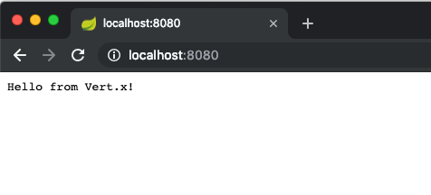
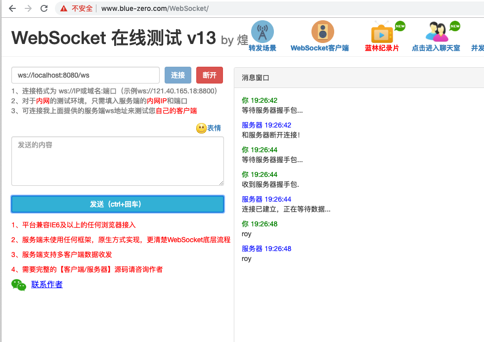
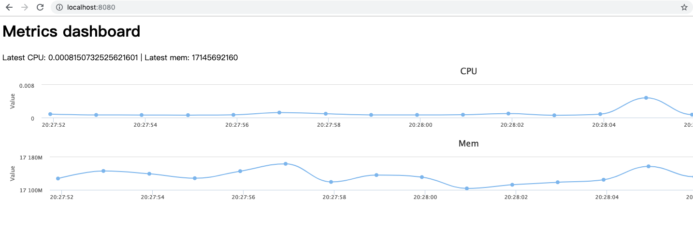

# Vert.x 基础入门

Vert.x 是一个轻量级、高性能、模块化的响应式编程技术，天生自带异步、分布式属性，简约而不简单，是目前实现微服务和 Serverless 架构的最热门框架之一。

2011 年，在 VMware 工作的 Tim Fox 开始开发 Vert.x。2014 年 5 月，Vert.x 在 JAX 创新奖中荣获“最具创新性的 Java 技术”奖。经过 8 年的发展，Vert.x 已经成长为一个功能全面的响应式编程框架，并且拥有了一个较为丰富的生态圈。通过使用 Vert.x 可以快速开发出高性能的 HTTP 服务和 WebSocket 服务，也可以作为底层网络通信框架减少多线程编程的复杂性。

工程师对于性能的追求是无止境的，而响应式编程是提升系统性能的一大利器。追求极致的你是否愿意跟我一起来一探究竟呢？

本文将带你一起入门 Vert.x ，通过 **Vert.x 是什么** 来理解这个工具的框架，然后再通过 **主要功能探究** 来学习主要功能，最后通过一个小实战项目来巩固所学的知识。文中提到的代码都可以通过 <https://github.com/roytrack/vertx-gitchat> 来下载。下面我们开始吧~

### Vert.x 是什么

在 Vert.x 的官网上 [Vert.x](https://vertx.io/) 有这么一段话说明了它是什么。

> _Eclipse Vert.x is a tool-kit for building reactive applications on the JVM._

翻译过来就是：Vert.x 是构建基于 JVM 的反应式应用的工具包。 首先，它是一个全家桶式的工具包，既可以用简单的代码来创建一个高性能的网络服务器，也就是可以作为类似于 Apache 的 httpclient 来使用，提供 HTTP client 、DNS client 等一系列工具，同时提供各类好用的功能集合：

- 数据访问：提供 MongoDB、JDBC、Redis 等客户端；
- 集成其他框架：邮件客户端、JCA 适配器、RabbitMQ 和 Kafka 客户端、Consul 客户端、MQTT 服务器；
- 事件总线桥接：Camel 和 TCP 的事件总线
- 登录验证集成：JDBC 验证、JWT 验证、Shiro 验证、MongoDB 验证、OAuth2 验证
- 反应式编程：Vert.x Rx、反应式流处理、Vert.x Sync
- 微服务支持：服务发现、配置管理、熔断器
- 开发运维：shell 和 docker 的支持、度量度量工具和包管理工具
- 异步测试支持：Vert.x Unit
- 集群支持：Hazelcast、Infinispan、Apache Ignite、Apache Zookeeper
- 云支持：OpenShift Cartridge

其次，它可以用来构建反应式应用的，在其官网右上角有[反应式宣言](https://www.reactivemanifesto.org/zh-CN)，声明了反应式系统的特质：

1. 即时响应性
1. 回弹性
1. 弹性
1. 消息驱动

文中链接有对应宣言的翻译解释链接，限于篇幅，就不在此探讨了。

#### 框架定位

Vert.x 的定位非常灵活。

简单的网络工具、复杂的 web 应用程序、 HTTP / REST 微服务、海量事件处理、完整的后端消息总线应用程序都可以用 Vert.x 来做。

Vert.x 并不是一个严格意义上的框架或者容器，框架开发者不会告诉你一条“正确”的道路去写一个应用，而是给你了很多强有力的工具，让你去按照自己希望的方式去构建应用。

例如很多人在学习 Vert.x 的时候认为 Verticle 必不可少，其实可以只去用它的 HTTP client，而不用其他的，这也是可以的。

另外一个体现就是不强制要求只用 Vert.x 提供的功能，而是可以与其他类库灵活的组合使用，例如 Spring 的 IOC 容器就可以灵活搭配起来。

#### 框架功能简介

Vert.x 生态系统是由一系列模块组成的，一部分是官方维护，一部分是志愿者维护。具体如下图结构：


Vert.x Core 作为最核心部分，提供了以下功能：

1. TCP 客户端和服务器；
1. HTTP 客户端和服务器，并且支持 WebSocket ，这部分我们会在下面 **常用两个协议 ( HTTP & WebSocket )** 进一步展开讲；
1. 事件总线，用来进行信息传递，实质是一种基于 TCP 连接的消息队列，支持点对点和发布订阅两种机制；
1. 共享数据,通过本地的 map 结构和集群级别的分布式 map；
1. 定时器和延迟操作，通过 vertx.setPeriodic 实现周期定时执行， vertx.setTimer 来实现一次性的调用（延时操作）；
1. 装载、卸载部署单元；
1. UDP 数据报文；
1. DNS 客户端；
1. 访问文件系统；
1. 高可用；
1. 集群化。

Vert.x Core 只包含一个非常轻量级的 jar 包，里面有以上的核心功能。

Vert.x Web 基于 Vert.x Core，提供了一系列更丰富的功能以便更容易地开发实际的 Web 应用。它继承了 Vert.x 2.x 里的 [Yoke](https://pmlopes.github.io/yoke/) 的特点，灵感来自于 Node.js 的框架 [Express](https://expressjs.com/) 和 Ruby 的框架 [Sinatra](http://www.sinatrarb.com/) 等等。Vert.x Web 的设计是强大的，非侵入式的，并且是完全可插拔的。Vert.x Web 非常适合编写 **RESTful HTTP 微服务** 。

Vert.x Stack 包含一系列提供鉴权、网络、数据访问等的官方扩展 jar 包。

而 Vert.x Awesome 则包含了官方和非官方提供的各种扩展，例如各种书籍、构建工具、云支持、容器支持等。

下面放上一个一文全的地址: <https://github.com/vert-x3/vertx-awesome> ,可以体会一下 Vert.x 的生态规模。

#### 黄金法则

Vert.x 中有一个黄金法则，就是不要阻塞 _Event Loop_ 。

这个黄金法则设立的原因我们来一起探索一下。

大部分 Vert.x 的 API 都是事件驱动的,通过事件来调用起对应的 handler,这样就可以解耦，进行异步操作。

例如下面的代码示例，当有 HTTP 请求过来的时候，调用这个 handler 来返回响应信息：

```Java
server.requestHandler(request -> {
  // This handler will be called every time an HTTP request is received at the server
  request.response().end("hello world!");
});
```

相比于以前的处理，就是不会再阻塞处理，而是通过事件驱动，让 Vert.x 自己主动调用。

这样引入的优势是，Vert.x 可以通过少量的线程，处理大量的并发事件。如果这里面并发事件同时出现了与线程数相同的阻塞操作，例如读取文件，那么所有线程都被阻塞，整个程序就被挂起、拒绝服务了。

在大部分情况下，Vert.x 在一个线程里调用对应的 handlers，这个线程就叫做一个 **Event Loop** 。


图片来自 Vert.x官网：<https://vertx.io/docs/guide-for-java-devs/>

Vert.x 保证自己的 API 是非阻塞的,并且不会阻塞 _Event Loop_，但是但是无法控制你自己的代码是否是阻塞的,所以会对这部分进行监控，并通过日志警告你。我们来造一个阻塞操作看看：

```Java
public class BlockWarningDemo extends AbstractVerticle {
  @Override
  public void start() throws Exception {
    Thread.sleep(3000L);
  }
  public static void main(String[] args) {
    Vertx vertx = Vertx.vertx();
    BlockWarningDemo blockWarningDemo = new BlockWarningDemo();
    vertx.deployVerticle(blockWarningDemo);
    vertx.close();
  }
}
```

运行上面的代码就可以得到一个阻塞被警告的日志：

```Shell
三月 03, 2019 11:08:06 上午 io.vertx.core.impl.BlockedThreadChecker
警告: Thread Thread[vert.x-eventloop-thread-0,5,main] has been blocked for 2847 ms, time limit is 2000 ms
```

默认 _Event Loop_ 的线程执行时间是 2 秒，上面的代码让线程睡了三秒就直接被检查出来了。与此类似的还有以下的阻塞操作：

1. 等待锁；
1. 等待互斥锁或者同步代码块；
1. 数据库长时间查询；
1. 进行消耗很多时间的大量计算；
1. 文件句柄的获取与读写。

那么这些阻塞的操作我们怎么做呢？使用 vertx.executeBlocking 或者使用一类新的 Verticle ， 叫做 **Worker Verticle** 。

根本上就是让这些阻塞操作在一组内部或者自定义的线程池上执行，而不要在处理事件的 Event Loop 操作。待处理完毕后，再通过 future 对应的 handler 来回调 _Event Loop_ 进行后续处理。

通过这一部分的讲解，我们知道了 Vert.x 是构建基于 JVM 的反应式应用的工具包，提供了一批可用于 TCP 、 UDP 、 HTTP 、 DNS 的工具集，具有较好的开源生态，并且对其黄金法则进行了探索与实战。

### 主要功能探究

Vert.x 提供了很多功能，我们学习起来可能会有点选择困难症，下面我挑了几个比较核心的，能尽快形成生产力的功能来进行探索。

#### 部署单元 ( Verticle )

在学习 Vert.x 的部署单元之前，我们先来理解一下 Actor 模型。

> 你可以将 Actor 当作是一群人，他们互相之间不会面对面地交流，而只是通过邮件的方式进行沟通。

Verticle 可以 **近似** 的看做 Actor 模型中的 actor （之所以说近似，因为各个 Verticle 还是可以通过共享 map 来通信。）。不同的 verticle 实体部署在一个 Vert.x 实例中，通过 _Event Bus_ 来进行消息传递。

定义自己的 Verticle 需要扩展 AbstractVerticle ，逻辑可以写在重载的不带参数的 start 、 stop 方法中，表示在 Verticle 部署后，卸载后执行的逻辑。 如果重载带参数 Future 的 start 、 stop 方法，则表示在部署或者卸载 Verticle 前要做一些逻辑，做完后将 future 设置为成功或者失败，标志着 Verticle 相应动作成功或失败。

Verticle 分为三类：

- 标准 Verticle ，在 _Event Loop_ 上执行；
- 工作 Verticle ，在工作线程池运行。一个实例不会同时在多于一个线程上执行；
- 多线程工作 Verticle ，在工作线程池运行，是高阶特性，一个实例不会同时在多于一个线程上执行，但是实例自身可以开启多个线程。

Verticle 最大的特色就是它的线程隔离性。在启动的时候， Verticle 就被分配给了创建和 start 方法调用的 _Event Loop_ 了。当调用一个使用 core API 的 handler 的方法的时候， Vert.x 保证这些 handler 将在同一个 _Event Loop_ 上执行的。

也就是说在 Verticle 实例的代码保证是在同一个 _Event Loop_ 执行。

上文中的 _BlockWarningDemo_ 就是一个标准 Verticle 。如果要转化为工作 Verticle ，在部署的时候进行以下配置：

```Java
DeploymentOptions options = new DeploymentOptions().setWorker(true);
BlockWarningDemo blockWarningDemo = new BlockWarningDemo();
vertx.deployVerticle(blockWarningDemo, options);
```

这样这个 Verticle 就不在 _Event Loop_ 上分配了，转而分配到 Vert.x 的内部工作线程池上。


图片来自 Vert.x官网：<https://vertx.io/docs/guide-for-java-devs/>

#### 链式 API 与异步 ( Fluent API & Asynchronous )

链式操作和异步处理，是始终贯穿 Vert.x API 中的两个通用模式。我们在编写程序的时候更期望使用流畅的 API ，一路处理下来即可。例如使用 Builder 可以更方便的获取新的对象：

```Java
package com.roytrack.fluent;
import lombok.Builder;
import lombok.ToString;
@Builder
@ToString
public class LombokDemo {
  private final String userName;
  private final Integer age;
  public static void main(String[] args) {
    LombokDemo demo = LombokDemo.builder().userName("roy").age(30).build();
    System.out.println(demo);
  }
}
```

亦或者是 Java 8 中引入的流处理 API ，更方便的进行流处理：

```Java
package com.roytrack.fluent;
import java.util.ArrayList;
import java.util.List;
public class Java8Demo {
  public static void main(String[] args) {
    List<Integer> list = new ArrayList();
    for (int i = 0; i < 100; i++) {
      list.add(i);
    }
    int result = list.stream().map(v -> v + 1).reduce(0, (v1, v2) -> v1 + v2);
    System.out.println(result);
  }
}
```

Vert.x 也大量的使用了类似的 API 设计，下面这个例子展示了它灵活的 Json 构造和处理：

```Java
package com.roytrack.fluent;
import io.vertx.core.json.JsonObject;
public class VertxDemo {
  public static void main(String[] args) {
    JsonObject jsonObject = new JsonObject().put("name", "roy").put("age", "30");
    System.out.println(jsonObject.toString());
  }
}
```

对于异步处理，大部分是通过设置 handler ，让 Vert.x 自己根据响应去调用，举例一个 request 的返回如下：

```Java
vertx.createHttpServer().requestHandler(req -> {
      req.response()
          .putHeader("content-type", "text/plain")
          .end("Hello from Vert.x!");
    });
```

配合使用异步处理和链式 API 操作，我们既可以获得代码的简洁性，也可以得到分布式下的高性能。

#### 常用两个协议 ( HTTP & WebSocket )

下面我们来写一个最小的 HTTP 服务：

```Java
package com.roytrack.http;
import io.vertx.core.Vertx;
import io.vertx.core.http.HttpServer;
public class MinimalHttpServer {
  public static void main(String[] args) {
    Vertx vertx = Vertx.vertx();
    //创建 httpServer
    HttpServer server = vertx.createHttpServer().requestHandler(req -> {
      req.response()
          .putHeader("content-type", "text/plain")
          .end("Hello from Vert.x!");
    });
    //指定监听端口
    server.listen(8080, res -> {
      if (res.succeeded()) {
        System.out.println("Begin http server !");
      } else {
        System.out.println("Http server occured error " + res.cause());
      }
    });
  }
}
```

访问后获得结果：



如果想同时构建 HTTP 和 WebSocket 服务，处理起来也很简单，代码如下：

```Java
package com.roytrack.http;
import io.vertx.core.Vertx;
public class HttpAndWsServer {
  public static void main(String[] args) {
    Vertx vertx = Vertx.vertx();
    //创建 httpServer
    vertx.createHttpServer()
        //增加 websocket服务
        .websocketHandler(ws -> {
          System.out.println("path is " + ws.path());
          if (!ws.path().equals("/ws")) {
            ws.reject();
          }
          ws.textMessageHandler(msg -> {
            ws.writeTextMessage(msg);
          });
        })
        //增加 http服务
        .requestHandler(req -> {
          req.response()
              .putHeader("content-type", "text/plain")
              .end("Hello from Vert.x!");
        })
        //指定监听端口
        .listen(8080, res -> {
          if (res.succeeded()) {
            System.out.println("Begin http server !");
          } else {
            System.out.println("Http server occured error " + res.cause());
          }
        });
  }
}
```

通过访问 WebSocket 返回如下：

 同时，访问 HTTP 也不受影响，因为 WebSocket 协议的升级包也是 HTTP 协议。

另外如果使用 Verticle 多实例部署，也可以共用一个端口，这样一个 Verticle 停用或者卸载了，也不影响其他 Verticle 的服务，体现了反应式宣言中的回弹性。

#### 多语言编程 ( Polyglot )

Vert.x 不止支持 Java，还官方支持 Ceylon 、 Grovvy 、 JavaScript 、Ruby 、 Scala 、 Kotlin ，贡献者支持 Python 、 TypeScript 。

最快体验多语言特性，莫过于安装一下 Vert.x 的命令行工具，下面是两种安装方式。

通过 Node 安装 vertx ，如果是 windows 系统，可以进入到对应 module 中执行 vertx.bat：

```Shell
npm install vertx3-full
```

或者MacOS 通过 Homebrew 安装 vertx ：

```Shell
brew install vert.x
```

安装后就可以执行 vertx 命令了。

编写一个 js 脚本 my-verticle.js 如下：

```JavaScript
var server = vertx.createHttpServer();
server.requestHandler(function (request) {
 request.response().end("Hello world");
});
server.listen(8080);
```

通过执行以下命令，就可以启动一个 httpServer 返回 Hello world 了。

```Shell
vertx run my-verticle.js
```

### 项目实战 ：构建一个资源管理器

经过以上的学习，我们对 Vert.x 的主要功能有一些了解了，下面我们来实战一个项目。

需求：调用 MXBean 来获取 cpu 和内存，然后通过 eventbus 发送。另外一个接收 eventbus ，发送到页面进行展现。 最终效果如下图：

 最终完成的项目地址为：<https://github.com/roytrack/vertx-gitchat>

#### 构建 Agent

com.roytrack.dashboard.Agent 核心代码如下：

```Java
  @Override
  public void start() {
    OperatingSystemMXBean systemMBean = ManagementFactory.getPlatformMXBean(OperatingSystemMXBean.class);
    String pid = UUID.randomUUID().toString();
    vertx.setPeriodic(1000, id -> {
      JsonObject metrics = new JsonObject();
      metrics.put("CPU", systemMBean.getProcessCpuLoad());
      metrics.put("Mem", systemMBean.getTotalPhysicalMemorySize() - systemMBean.getFreePhysicalMemorySize());
      vertx.eventBus().publish("metrics", new JsonObject().put(pid, metrics));
    });
  }
```

获取系统的 MBean ，设置每秒执行一次，将相关参数放入到 JsonObject ，然后通过 EventBus 发送到 metrics 这个地址。

#### 构建 Server

com.roytrack.dashboard.Server 核心代码如下：

```Java
  @Override
  public void start() {
    Router router = Router.router(vertx);
    // The web server handler
    router.route().handler(StaticHandler.create().setCachingEnabled(false));
    router.get("/dashboard").handler(ctx -> {
      ctx.response()
          .putHeader("Content-Type", "application/json")
          .end(dashboard.encode());
    });
    vertx.eventBus().<JsonObject>consumer("metrics").handler(msg -> {
      JsonObject metrics = msg.body();
      dashboard.mergeIn(metrics);
    });
    vertx.createHttpServer()
        .requestHandler(router::accept)
        .listen(8080);
  }
```

StaticHandler 会去找 webroot 的静态资源，直接对外提供服务。

/dashboard 路径每次返回最新的数据。

消费地址为 metrics 的 EventBus ，来更新 Json 对象 dashboard 的内容。

最后创建 httpServer，监听 8080 端口即可。

项目代码下载下来的同学，会发现给出的项目代码还使用了 hazelcast 作为集群发现的方式，可以作为一个进阶增强进行自学，有不懂的地方我们在读者圈继续交流。

### 学习资料

1. 我们可以通过 Vert.x 的官方文档系统学习它，地址为：<https://vertx.io/docs/>
1. 同时github上有人翻译了中文版：<https://vertxchina.github.io/vertx-translation-chinese/>
1. 官网同时有一本电子书《使用Java构建响应式微服务》，大家可以学习参考：<https://developers.redhat.com/promotions/building-reactive-microservices-in-java/>
1. Vert.x生态的各种信息和例子，都可以从这个项目里找到：<https://github.com/vert-x3/vertx-awesome>
