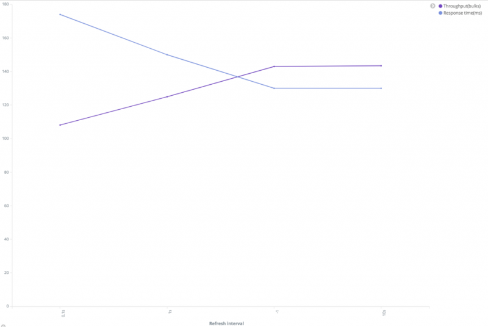
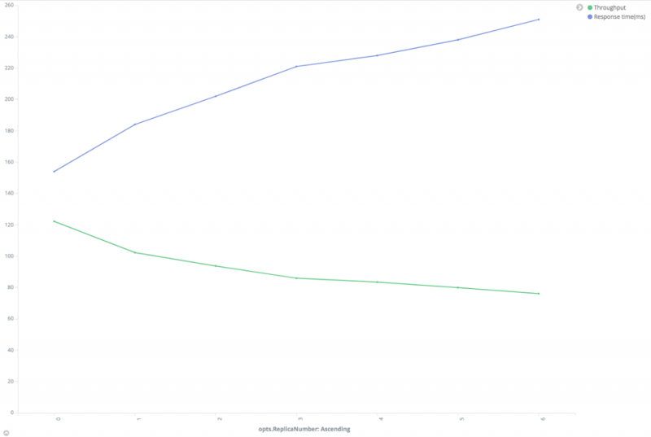
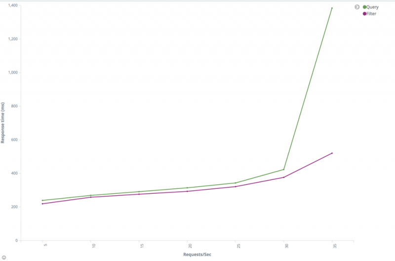
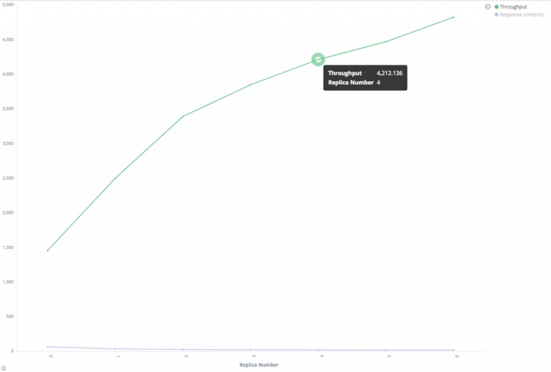
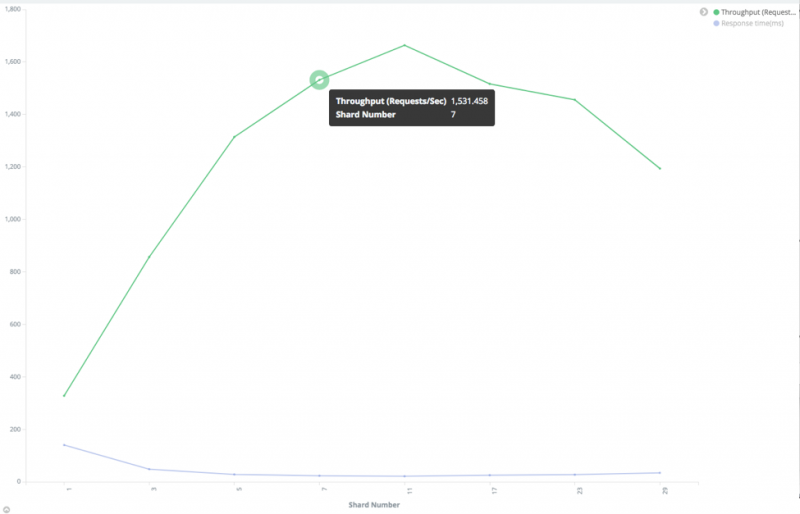

eBay 的 Elasticsearch 性能调优实践
===========================

Elasticsearch 是一个基于 Apache Lucene 的开源搜索和分析引擎，允许用户近实时地存储、搜索和分析数据。Pronto 是 eBay 托管 Elasticsearch 集群的平台，使 eBay 内部客户易于部署、运维和扩展 Elasticsearch 以进行全文搜索、实时分析和日志事件监控。今天 Pronto 管理着 60 多个 Elasticsearch 集群，达 2000 多个节点。日采集数据量达到 180 亿个文档，日均查询量达到 35 亿。该平台提供了创建、修复、安全、监控、告警和诊断的一整套功能。

虽然 Elasticsearch 专为快速查询而设计，但其性能在很大程度上取决于应用程序的场景、索引的数据量以及应用程序和用户查询数据的速度。本文总结了 Pronto 团队面临的挑战以及应对挑战所构建的流程和工具，还给出了对几种配置进行基准测试的一些结果。

挑战
--

迄今遇到的 Pronto/Elasticsearch 使用场景所面临的挑战包括：

1. 高吞吐量：一些集群每天采集的数据高达 5TB，一些集群每天的搜索请求超过 4 亿。如果 Elasticsearch 无法及时处理这些请求，上游的请求将发生积压。
2. 低搜索延迟：对于性能比较关键的集群，尤其是面向线上的系统，低搜索延迟是必需的，否则用户体验将受到影响。
3. 由于数据或查询是可变的，所以最佳设置也是变化的。不存在所有情况都是最佳的设置。例如，将索引拆分成更多的分片对于费时的查询是有好处的，但是这可能会影响其他查询性能。

解决方案
----

为了帮助我们的客户应对这些挑战，Pronto 团队为用户案例上线和整个集群生命周期，针对性能测试、调优和监控构建了一套策略方法。

1. 预估集群大小：在新的用户案例上线之前，收集客户提供的信息，如吞吐量、文档大小、文档数量和搜索类型，以估计 Elasticsearch 集群的初始大小。
2. 优化索引设计：与客户一起评估索引设计。
3. 索引性能调优：根据用户场景进行索引性能和搜索性能调优。
4. 搜索性能调优：使用用户真实数据 / 查询运行性能测试，比较和分析不同 Elasticsearch 配置参数的测试结果。
5. 运行性能测试：在用户案例上线后，集群将受到监控，并且每当数据发生变化，查询更改或流量增加时，用户都可以自由地重新运行性能测试。

### 预估集群大小

Pronto 团队为每种类型的机器和每个支持的 Elasticsearch 版本运行基准测试，收集性能数据，然后结合客户提供的信息，估算群集初始大小，包括：

* 索引吞吐量
* 文档大小
* 搜索吞吐量
* 查询类型
* 热点索引文档数量
* 保留策略
* 响应时间需求
* SLA 级别

### 优化索引设计

在开始索引数据和运行查询之前，我们先考虑一下。索引到底表示什么？Elastic 的官方答案是“具有某种相似特征的文档集合”。因此，下一个问题是“应该使用哪些特征来对数据进行分组？应该把所有文档放入一个索引还是多个索引？”，答案是，这取决于使用的查询。以下是关于如何根据最常用的查询组织索引的一些建议。

* \*\*如果查询有一个过滤字段并且它的值是可枚举的，那么把数据分成多个索引。\*\*例如，你有大量的全球产品信息被采集到 Elasticsearch 中，大多数查询都有一个过滤条件“地区”，并且很少有机会运行跨地区查询。如下查询体可以被优化：

```
{
    "query": {
        "bool": {
            "must": {
                "match": {
                    "title": "${title}"
                }
            },
            "filter": {
                "term": {
                    "region": "US"
                }
            }
        }
    }
}
```

在这种情况下，如果索引按照美国、欧盟等地区分成几个较小的索引，可以从查询中删除过滤子句，查询性能会更好。如果我们需要运行一个跨地区查询，我们可以将多个索引或通配符传递给 Elasticsearch。

* \*\*如果查询有一个过滤字段并且它的值是不可枚举的，建议使用路由。\*\*通过使用过滤字段值作为路由键，我们可以将具有相同过滤字段值的文档索引至同一个分片，并移除过滤子句。

例如，Elasticsearch 集群中存有数以百万记的订单数据，大多数查询都包含有买方 ID 作为限定从句。为每个买家创建索引是不可能的，所以我们不能通过买方 ID 将数据拆分成多个索引。一个合适的解决方案是，使用路由将具有相同买方 ID 的所有订单放入相同分片中。然后几乎所有的查询都可以在匹配路由键的分片内完成。

* \*\*如果查询具有日期范围过滤子句，则按日期建立数据。\*\*这适用于大多数日志记录和监控场景。我们可以按天、周或月组织索引，然后可以获得指定的日期范围内的索引列表，这样，Elasticsearch 只需要查询一个较小的数据集而不是整个数据集。另外，当数据过期时，删除旧的索引也很容易。
* \*\*明确设置映射。\*\*虽然 Elasticsearch 可以动态创建映射，但创建的映射可能并不适用于所有场景。例如，Elasticsearch 5.x 中的默认字符串字段映射是“keyword”和“text”类型。这在很多情况下是没有必要的。
* **如果文档使用用户定义的 ID 或路由进行索引，要避免造成分片不平衡。** Elasticsearch 使用随机 ID 生成器和散列算法来确保文档均匀地分配给分片。当使用用户定义的 ID 或路由时，ID 或路由键可能不够随机，造成一些分片明显比其他分片大。在这种情况下，这个分片上的读 / 写操作会比其他的慢得多。我们可以优化 ID/ 路由键或使用 [index.routing\_partition\_size](https://www.elastic.co/guide/en/elasticsearch/reference/current/mapping-routing-field.html#routing-index-partition) （5.3 和更高版本中可用）。
* \*\*确保分片均匀分布在节点上。\*\*一个节点如果比其他节点的分片多，则会比其他节点承担更多的负载，成为整个系统的瓶颈。

### 索引性能调优

对于日志记录和监控等重度索引场景，索引性能是关键指标。这里有一些建议：

* **使用批量请求。**
* **使用多线程发送请求。**
* \*\*增加刷新时间间隔。\*\*每次刷新事件发生时，Elasticsearch 都会创建一个新的 Lucene 段，并在稍后进行合并。增加刷新时间间隔将降低创建和合并的开销。请注意，文档只有在刷新后才能搜索到。



性能和刷新时间间隔之间的关系

从上图可以看出，随着刷新时间间隔的增加，吞吐量增加，响应时间减少。我们可以使用下面的请求来检查我们有多少段以及刷新和合并花了多少时间。

`Index/_stats?filter_path= indices.**.refresh,indices.**.segments,indices.**.merges`\- \*\*减少副本数量。\*\*对于每个索引请求，Elasticsearch 需要将文档写入主分片和所有副本分片。显然，副本过多会减慢索引速度，但另一方面，这将提高搜索性能。我们将在本文后面讨论这个问题。

 性能和副本数之间的关系

从上图可以看出，随着副本数增加，吞吐量下降，响应时间增加。

* **尽可能使用自动生成的 ID。** Elasticsearch 自动生成的 ID 保证是唯一的，能避免版本查找。如果客户真的需要使用自定义的 ID，我们建议选择一个对 Lucene 友好的 ID，比如零填充顺序 ID、UUID-1 或者纳秒级时间。这些 ID 具有一致的顺序模式，能良好压缩。相比之下，像 UUID-4 这样的 ID 本质上是随机的，压缩率低，会降低 Lucene 的速度。

### 搜索性能调优

使用 Elasticsearch 的主要原因是支持搜索数据。用户应该能够快速找到他们正在寻找的信息。搜索性能取决于很多因素。

* **尽可能使用过滤器上下文（Filter）替代查询上下文（Query）。** 查询子句用于回答“这个文档与此子句相匹配的程度”，而过滤器子句用于回答“这个文档是否匹配这个子句”，Elasticsearch 只需要回答“是”或“否”，不需要为过滤器子句计算相关性分数，而且过滤器结果可以缓存。有关详细信息，请参阅[查询和过滤上下文](https://www.elastic.co/guide/en/elasticsearch/reference/current/query-filter-context.html)。

 查询和过滤器性能比较

* \*\*增加刷新时间间隔。\*\*正如我们在[索引性能调优](https://www.ebayinc.com/stories/blogs/tech/elasticsearch-performance-tuning-practice-at-ebay/#tune_indexing_performance)中所提到的，Elasticsearch 每次刷新时都会创建一个新的段。增加刷新时间间隔将有助于减少段数并降低搜索的 IO 成本。并且，一旦发生刷新并且数据改变，缓存将会失效。增加刷新时间间隔可以使 Elasticsearch 更高效地利用缓存。
* **增加副本数。** Elasticsearch 可以在主分片或副本分片上执行搜索。副本越多，搜索可用的节点就越多。

 搜索性能和副本数之间的关系

从上图可以看出，搜索吞吐量几乎与副本数量成线性关系。注意在这个测试中，测试集群有足够的数据节点来确保每个分片都有一个专有节点。如果这个条件不能满足，搜索吞吐量就不会这么好。

* **尝试不同的分片数。**“应该为索引设置多少分片呢？”这可能是最常见的问题。遗憾的是，没有适合所有应用场景的分片数。这完全取决于你的情况。

分片太少会使搜索无法扩展。例如，如果分片数设置为 1，则索引中的所有文档都将存储在一个分片中。对于每个搜索，只有一个节点能够参与计算。如果索引中的文件数量很多，查询会很耗时。从另一方面来说，创建的索引分片太多也会对性能造成不利影响，因为 Elasticsearch 需要在所有分片上运行查询（除非在请求中指定了路由键），然后提取并合并所有返回的结果。

根据我们的经验，如果索引小于 1G，可以将分片数设置为 1。对于大多数场景，我们可以将分片数保留为默认值 5，但是如果分片大小超过 30GB，我们应该增加分片 ，将索引分成更多的分片。创建索引后，分片数不能更改，但是我们可以创建新的索引并使用 reindex API 迁移数据。

我们测试了一个拥有 1 亿个文档，大约 150GB 的索引。我们使用了 100 个线程发送搜索请求。

 搜索性能和分片数量之间的关系

从上图可以看出，最优的分片数量为 11 个。开始时搜索吞吐量增大（响应时间减少），但随着分片数量的增加，搜索吞吐量减小（响应时间增加）。

请注意，在这个测试中，就像在副本数测试中一样，每个分片都有一个独占节点。如果这个条件不能满足，搜索吞吐量将不会像这个图那样好。

在这种情况下，我们建议你尝试一个小于最优值的分片数，因为如果分片多，并且使每个分片都有一个独占数据节点，那么就需要很多节点。

* **节点查询缓存。**[节点查询缓存](https://www.elastic.co/guide/en/elasticsearch/reference/current/query-cache.html)只缓存过滤器上下文中使用的查询。与查询子句不同，过滤子句是“是”或“否”的问题。Elasticsearch 使用位集（bit set）机制来缓存过滤结果，以便后面使用相同的过滤器的查询进行加速。请注意，Elasticsearch 只对保存超过 10,000（或文档总数的 3％，以较大者为准）个文档的段启用查询缓存。有关更多详细信息，请参阅[缓存](https://www.elastic.co/guide/en/elasticsearch/guide/current/filter-caching.html#_independent_query_caching)。

我们可以使用下面的请求来检查一个节点查询缓存是否生效。

```
GET index_name/_stats?filter_path=indices.**.query_cache
{
  "indices": {
    "index_name": {
      "primaries": {
        "query_cache": {
          "memory_size_in_bytes": 46004616,
          "total_count": 1588886,
          "hit_count": 515001,
          "miss_count": 1073885,
          "cache_size": 630,
          "cache_count": 630,
          "evictions": 0
        }
      },
      "total": {
        "query_cache": {
          "memory_size_in_bytes": 46004616,
          "total_count": 1588886,
          "hit_count": 515001,
          "miss_count": 1073885,
          "cache_size": 630,
          "cache_count": 630,
          "evictions": 0
        }
      }
    }
  }
}
```

* 分片查询缓存。

    如果大多数查询是聚合查询，我们应该考虑

    分片查询缓存

    。分片查询缓存可以缓存聚合结果，以便 Elasticsearch 以低开销直接处理请求。有几件事情需要注意：

  * 设置“size”为 0。分片查询缓存只缓存聚合结果和建议。它不会缓存命中，因此如果将 size 设置为非零，则无法从缓存中获益。
  * 查询请求的负载（Payload）必须完全相同。分片查询缓存使用请求负载作为缓存键，因此需要确保后续查询请求的负载必须和之前的完全一致。由于负载中 JSON 键的顺序变化会导致负载变化，故建议对负载的键进行排序来确保顺序一致。
  * 处理好日期时间。不要直接在查询中使用像 Date.now 这样的变量。否则，每个请求的请求体都不同，从而导致缓存始终无效。我们建议将日期时间整理为小时或天，以便更有效地利用缓存。

我们可以使用下面的请求来检查分片查询缓存是否有效。

```
GET index_name/_stats?filter_path=indices.**.request_cache
{
  "indices": {
    "index_name": {
      "primaries": {
        "request_cache": {
          "memory_size_in_bytes": 0,
          "evictions": 0,
          "hit_count": 541,
          "miss_count": 514098
        }
      },
      "total": {
        "request_cache": {
          "memory_size_in_bytes": 0,
          "evictions": 0,
          "hit_count": 982,
          "miss_count": 947321
        }
      }
    }
  }
}
```

* \*\*仅检索必要的字段。\*\*如果文档很大，而你只需要几个字段，请使用 [stored\_fields](https://www.elastic.co/guide/en/elasticsearch/reference/current/search-request-stored-fields.html) 检索需要的字段而不是所有字段。
* \*\*避免搜索停用词。\*\*诸如“a”和“the”等停用词可能导致查询命中结果数暴增。假设你有一百万个文档。搜索“fox”可能会返回几十个命中文档，但搜索“the fox”可能会返回索引中的所有文档，因为“the”几乎出现在所有文档中。Elasticsearch 需要对所有命中的结果进行评分和排序，以致像“the fox”这样的查询会减慢整个系统。你可以使用停用词过滤器来删除停用词，或使用“and”运算符将查询更改为“the AND fox”，获得更精确的结果。

如果某些单词在索引中经常使用，但不在默认停用词列表中，则可以使用[截止频率](https://www.elastic.co/guide/en/elasticsearch/reference/current/query-dsl-match-query.html#query-dsl-match-query-cutoff)来动态处理它们。

* **如果不关心文档返回的顺序，则按 \_doc 排序。** Elasticsearch 默认使用“\_score”字段按评分排序。如果不关心顺序，可以使用"sort":"\_doc"让 Elasticsearch 按索引顺序返回命中文档，可以节省排序开销。
* \*\*避免使用脚本查询（script query）计算动态字段，建议在索引时计算并在文档中添加该字段。\*\*例如，我们有一个包含大量用户信息的索引，我们需要查询以"1234"开头的所有用户。你可能运行一个脚本查询，如"source":“doc\[‘num’\].value.startsWith（‘1234’）”。这个查询非常耗费资源，并且减慢整个系统。索引时考虑添加一个名为“num\_prefix”的字段。然后我们可以查询"name\_prefix":“1234”。
* **避免使用通配符查询。**运行性能测试

------

对于每一次变更，都需要运行性能测试来验证变更是否适用。因为 Elasticsearch 是一个 RESTful 服务，所以可以使用 Rally、Apache Jmeter 和 Gatling 等工具来运行性能测试。因为 Pronto 团队需要在每种类型的机器和 Elasticsearch 版本上运行大量的基准测试，而且需要在许多 Elasticsearch 集群上针对不同 Elasticsearch 配置参数运行性能测试，所以这些工具不能满足我们的要求。

Pronto 团队建立了基于 [Gatling](https://gatling.io/) 的在线性能分析服务，帮助客户和我们运行性能测试和回归测试。该服务提供的功能有：

1. 轻松添加和编辑测试。用户无需 Gatling 或 Scala 知识即可根据输入的查询或文档结构生成测试。
2. 顺序运行多个测试，无需人工干预。该服务可以检查状态并在每次测试之前 / 之后更改 Elasticsearch 设置。
3. 帮助用户比较和分析测试结果。测试期间的测试结果和集群统计信息将保留下来，并可以通过预定义的 Kibana 可视化进行分析。
4. 从命令行或 Web UI 运行测试。该服务提供了与其他系统集成的 Rest API。

架构如下：

性能测试服务架构

用户可以查看每个测试的 Gatling 报告，并查看 Kibana 预定义的可视化图像，以便进一步分析和比较，如下所示。

 Gatling 报告

 Gatling 报告

总结
--

本文总结了在设计满足高期望的采集和搜索性能的 Elasticsearch 集群时应该考虑的索引 / 分片 / 副本设计以及一些其他配置，还说明了 Pronto 如何在策略上帮助客户进行初始规模调整、索引设计和调优以及性能测试。截至今天，Pronto 团队已经帮助包括订单管理系统（OMS）和搜索引擎优化（SEO）在内的众多客户实现了苛刻的性能目标，从而为 eBay 的关键业务作出了贡献。

Elasticsearch 的性能取决于很多因素，包括文档结构、文档大小、索引设置 / 映射、请求率、数据集大小和查询命中次数等等。针对一种情况的建议不一定适用于另一种情况，因此，彻底进行性能测试、收集数据、根据负载调整配置以及优化集群以满足性能要求非常重要。**查看英文原文：** [https://www.ebayinc.com/stories/blogs/tech/elasticsearch-performance-tuning-practice-at-ebay/](https://www.ebayinc.com/stories/blogs/tech/elasticsearch-performance-tuning-practice-at-ebay/)
