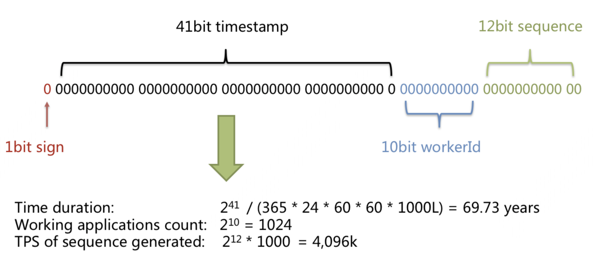
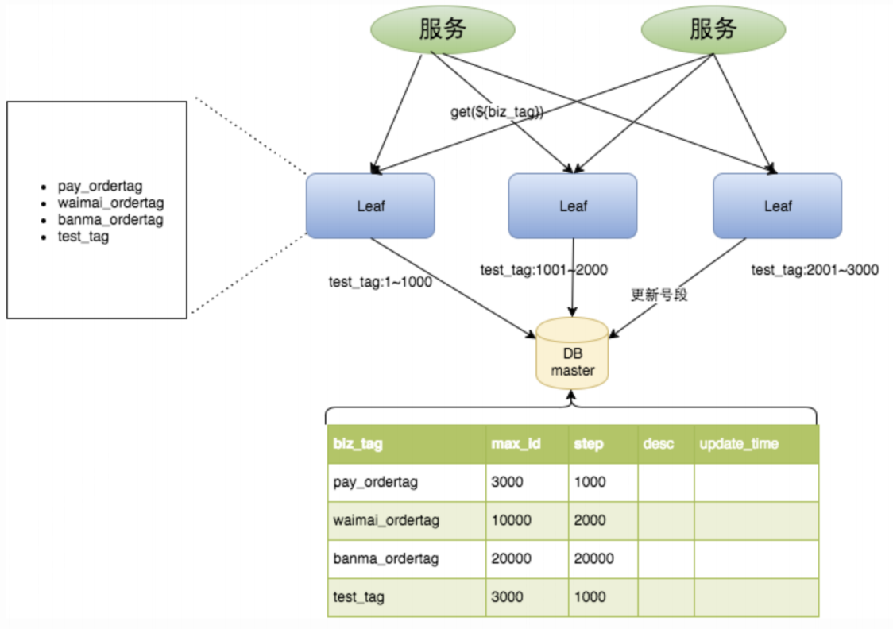
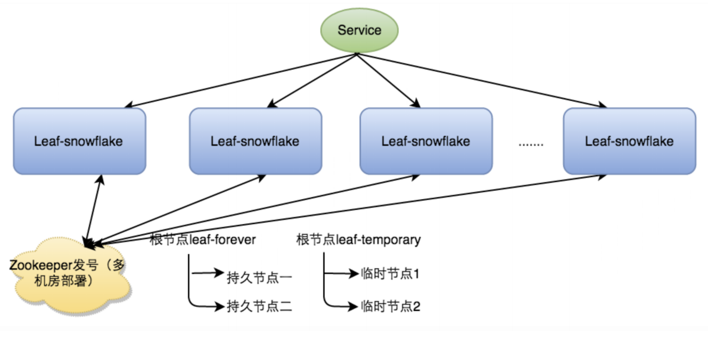
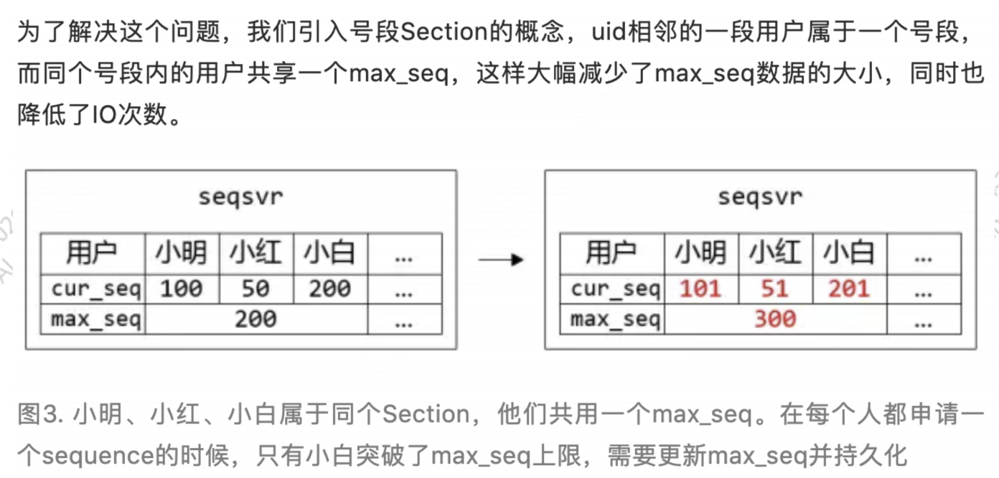
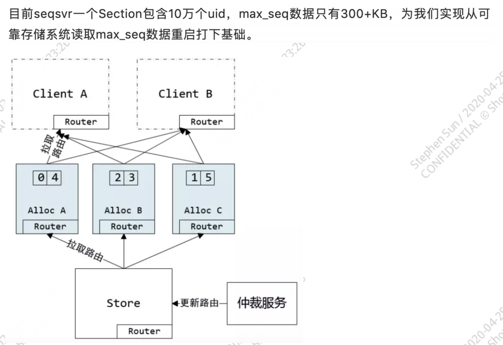
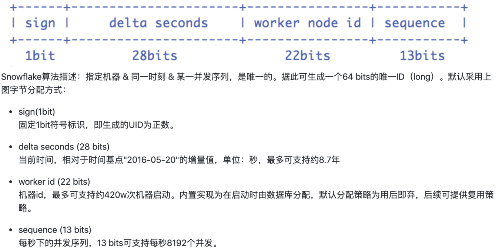
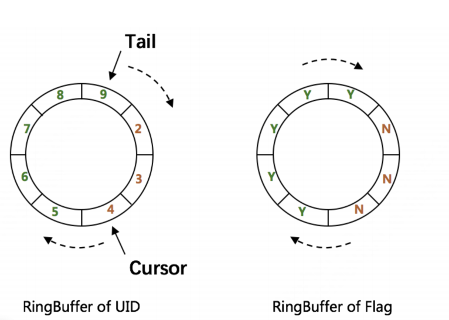

# 分布式唯一 ID 解析

## 业界常见解决方案

### UUID

\[uuid\](<https://en.wikipedia.org/wiki/Universally%5C_unique%5C_identifier##:~:text=A> universally unique identifier (UUID,are for practical purposes unique.))

1 个 UUID 是 1 个 16 字节（128 位）的数字； 为了方便阅读，通常将 UUID 表示成如下的方式：

```log
123e4567-e89b-12d3-a456-426614174000
```

缺点：

- ID 太长，占用空间较大
- 索引效率低
- 不能保证趋势递增，不适合做 DB 主键（MySQL 聚簇索引下插入不是顺序的，会导致随机 IO 增多，性能下降）

### Snowflake



缺点：

- 强依赖机器时间，如果时间回拨 Id 可能会重复
- 不是严格的趋势递增，极端情况在机器时间不同步的情况下后生成的 Id 可能会小于先生成的 Id，即只能在 worker 级别保证递增
- 服务需要保证 workerId 唯一（如果需要保证严格唯一的话会比较麻烦，简单可以基于服务 IP 跟 Port 来生成，但由于 workerId 只有 10 位，因此 workerId 可能会重复）

### Redis 生成 Id

可以使用 Redis 的原子操作 `INCR` 或者 `INCRBY` 来实现

优点：

- 性能较好
- Redis 单线程，没有线程安全问题，能保证 ID 趋势递增

缺点：

- 如果 Redis 需要迁移的话，需要保证迁移过程中的数据一致性，难度较大
- Redis 持久化如果使用 RDB，因此 Redis 重启会丢数据，导致 ID 重复

### 美团 Leaf

原文：[https://tech.meituan.com/2017/04/21/mt-leaf.html](https://tech.meituan.com/2017/04/21/mt-leaf.html)

#### Leaf Segment



使用 DB 号段保证唯一，Leaf Node 启动时或者在号段快用完时会从 DB 重新申请一段号段。

缺点：

- 只能保证在 Leaf Node 级别趋势递增，不能保证全局趋势递增
- ID 不够随机，能够泄露发号数量的信息，不太安全
- DB 宕机会造成整个系统不可用

##### Leaf Snowflake



ID 生成方式类似 Snowflake。

workerId 使用 Zookeeper 顺序结点的特性来实现，保证 workerId 唯一。

周期性上报时间给 Zookeeper，启动时做时间检验，时间回拨则告警。

### 微信序列号生成器

原文：[https://mp.weixin.qq.com/s/JqIJupVKUNuQYIDDxRtfqA](https://mp.weixin.qq.com/s/JqIJupVKUNuQYIDDxRtfqA)





可以看出，微信序列号生成器是在用户级别趋势递增。像微信这么大的消息量，如果像美团 Leaf Segment 一样在业务级别递增的话，那么序列号生成器肯定会成为性能瓶颈；而且美团 Leaf Segment 并不能保证全局趋势递增，并不能适用 IM Timeline 模型。

优点：

- Section 级别的并发，大大提高了并发
- 完美解决了 IM Timeline 模型下需要严格趋势递增 ID 的问题

缺点：

- 重客户端，架构复杂，开发维护成本大

### 百度 UidGenerator

原文：[https://github.com/baidu/uid-generator/blob/master/README.zh_cn.md.html](https://github.com/baidu/uid-generator/blob/master/README.zh_cn.md.html)

基于 Snowflake



使用 RingBuffer 缓存 UID，并通过双 RingBuffer+CacheLine 补齐方式提高并发，解决了伪共享问题



workerId 由 MySQL 自增 Id 分配。

通过借用未来时间来解决 Sequence 的并发限制，即每秒只能有 8192 个并发，超过则需要使用未来的时间来生成。

时间不是取的机器时间，而是用启动时间自增来实现。

缺点：

- 默认可用时间太少，只有 8.7 年，如果加大时间，workerId 又太少（因为 workerId 用完就丢弃，目前还没提供复用策略）
- 如果重启的时候时间回拨，虽然能保证 ID 唯一，但 ID 可能会变小，不是严格的趋势递增
- timeBits & workerBits 规则固定，如果不同业务需要不同生成规则需要重新搭建一套
- 以库的形式提供，使用配置复杂

### [MongoDB ObjectID](https://docs.mongodb.com/v3.2/reference/method/ObjectId/)

原文：[https://docs.mongodb.com/v3.2/reference/method/ObjectId/](https://docs.mongodb.com/v3.2/reference/method/ObjectId/)


- 1 ~ 4：时间戳
- 5 ~ 7：机器 Host Name 的 MD5 值
- 8 ~ 9：进程 Id
- 10 ~ 12：递增计数器

缺点：

- 占用存储空间多
- 不能保证趋势递增

## 解决分布式唯一 ID 的一个想法

本方案参考百度 UidGenerator，解决了 workerId 无法复用的问题

使用 Snowflake，利用 MySQL 自增 Id 分配 workerId，并复用 workerId；同时利用时间号段保证时间趋势递增

使用 Snowflake，64bit 的 Id 设计如下：


因此，最多有 2^10 = 1024 个 workerId，分配 WorkerId 的 DB Schema 设计如下：

```sql
CREATE TABLE IF NOT EXISTS `worker_node_tab`
(
 id BIGINT NOT NULL AUTO_INCREMENT COMMENT 'worker id',
 ip CHAR(64) NOT NULL COMMENT 'host IP',
 port CHAR(64) NOT NULL COMMENT 'host port',
 last_timestamp TIMESTAMP NOT NULL COMMENT 'last timestamp',
 duration_step TIMESTAMP NOT NULL COMMENT 'duration',
 mtime TIMESTAMP NOT NULL COMMENT 'modified time',
 ctime TIMESTAMP NOT NULL COMMENT 'created time',
 PRIMARY KEY(id)
) COMMENT='WorkerID Assigner for UID Generator',ENGINE = INNODB;
```

服务启动流程：

1. 往 worker_node_tab 插入自己的 IP&Port 等信息，获取 DB 自增 id，设置 workerId = id % 1024
1. 从 worker_node_tab 获取最大的 last_timestamp(max_last_timestamp)，并设置 timestamp = max_last_timestamp + duration_step

备注：因为百度 UidGenerator workerId 不会重复，因此不用担心 timestamp 重复；我们需要复用 workerId，因此必须要保证 timestamp 是趋势递增的

生成 Id 流程：

1. sequence += 1
1. 如果 sequence 还没超过 MAX_SEQUENCE(2^12)，则跳到(3)直接生成 Id；如果 sequence 大于等于 MAX_SEQUENCE，则设置 timestamp += 1, sequence = 0，然后跳到(3)生成 Id（timestamp 在本地自增，因此不用担心时间回拨的问题）
1. 生成 Id：Id = timestamp \<\< (10 + 12) | workerId \<\< 12 | sequence

duration_step 可以设置为两天（或更长），每隔一天异步到 DB 申请一个时间号段（即设置 DB last_timestamp += duration_step）；可以做到弱依赖 DB

## 参考

\[Universally unique identifier\](<https://en.wikipedia.org/wiki/Universally%5C_unique%5C_identifier##:~:text=A> universally unique identifier (UUID,are for practical purposes unique.))

[Twitter IDs (snowflake)](https://developer.twitter.com/en/docs/basics/twitter-ids)

[Leaf——美团点评分布式ID生成系统](https://tech.meituan.com/2017/04/21/mt-leaf.html)

[万亿级调用系统：微信序列号生成器架构设计及演变](https://mp.weixin.qq.com/s/JqIJupVKUNuQYIDDxRtfqA)

[百度UidGenerator](https://github.com/baidu/uid-generator/blob/master/README.zh_cn.md.html)

[MongoDB ObjectID](https://docs.mongodb.com/v3.2/reference/method/ObjectId/)
