如何设计一个亿级消息量的 IM 系统
==================

本文不会给出一套通用的 IM 方案，也不会评判某种架构的好坏，而是讨论设计 IM 系统的常见难题跟业界的解决方案。因为也没有所谓的通用方案，不同的解决方案都有其优缺点，只有最满足业务的系统才是一个好的系统。而且，在有限的人力、物力跟时间资源下，通常需要做出很多权衡，此时，一个能够快速迭代、方便扩展的系统才是一个好的系统。

IM 核心概念
=======

**用户 **：系统的使用者** 消息 **：是指用户之间的沟通内容。通常在 IM 系统中，消息会有以下几类：文本消息、表情消息、图片消息、视频消息、文件消息等等** 会话 **：通常指两个用户之间因聊天而建立起的关联** 群**：通常指多个用户之间因聊天而建立起的关联

**终端 **：指用户使用 IM 系统的机器。通常有 Android 端、iOS 端、Web 端等等** 未读数 **：指用户还没读的消息数量** 用户状态 **：指用户当前是在线、离线还是挂起等状态** 关系链 **：是指用户与用户之间的关系，通常有单向的好友关系、双向的好友关系、关注关系等等。这里需要注意与会话的区别，用户只有在发起聊天时才产生会话，但关系并不需要聊天才能建立。对于关系链的存储，可以使用图数据库（Neo4j 等等），可以很自然地表达现实世界中的关系，易于建模** 单聊 **：一对一聊天** 群聊 **：多人聊天** 客服 **：在电商领域，通常需要对用户提供售前咨询、售后咨询等服务。这时，就需要引入客服来处理用户的咨询** 消息分流 **：在电商领域，一个店铺通常会有多个客服，此时决定用户的咨询由哪个客服来处理就是消息分流。通常消息分流会根据一系列规则来确定消息会分流给哪个客服，例如客服是否在线（客服不在线的话需要重新分流给另一个客服）、该消息是售前咨询还是售后咨询、当前客服的繁忙程度等等** 信箱**：本文的信箱我们指一个 Timeline、一个收发消息的队列

读扩散 vs 写扩散
==========

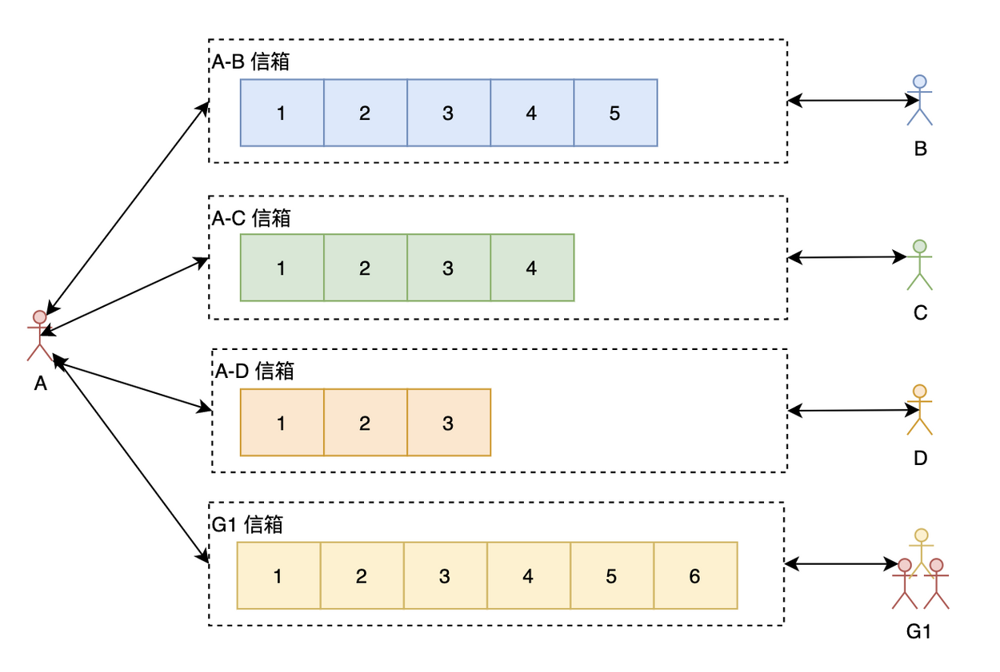

读扩散

我们先来看看读扩散。如上图所示，A 与每个聊天的人跟群都有一个信箱（有些博文会叫 Timeline），A 在查看聊天信息的时候需要读取所有有新消息的信箱。这里的读扩散需要注意与 Feeds 系统的区别，在 Feeds 系统中，每个人都有一个写信箱，写只需要往自己的写信箱里写一次就好了，读需要从所有关注的人的写信箱里读。但 IM 系统里的读扩散通常是每两个相关联的人就有一个信箱，或者每个群一个信箱。

读扩散的优点：

* 写操作（发消息）很轻量，不管是单聊还是群聊，只需要往相应的信箱写一次就好了
* 每一个信箱天然就是两个人的聊天记录，可以方便查看聊天记录跟进行聊天记录的搜索

读扩散的缺点：

* 读操作（读消息）很重

写扩散

接下来看看写扩散。

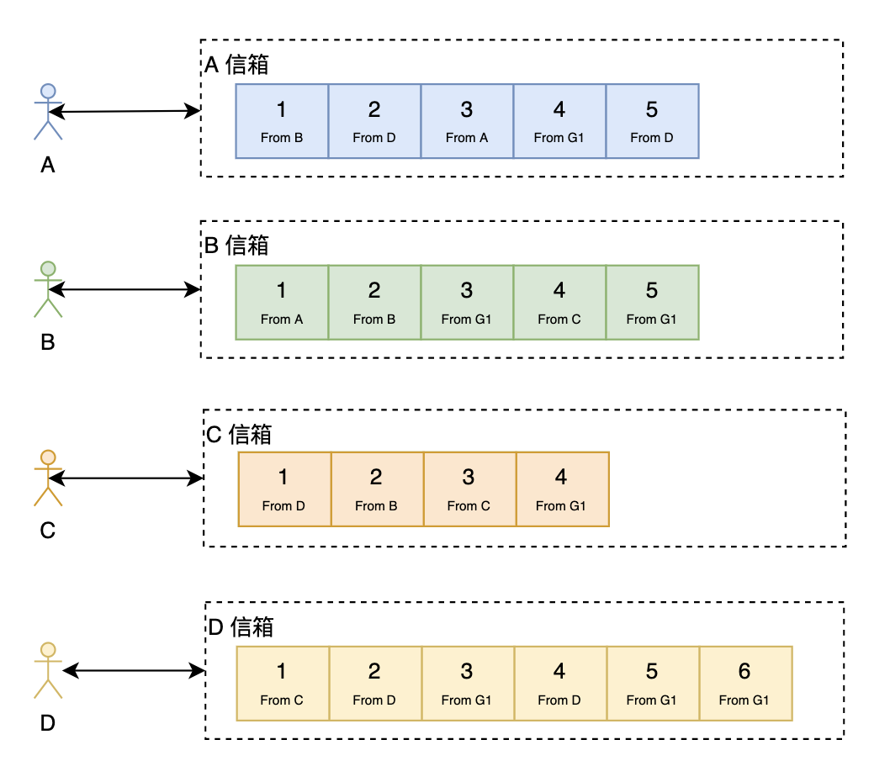

在写扩散中，每个人都只从自己的信箱里读取消息，但写（发消息）的时候，对于单聊跟群聊处理如下：

* 单聊：往自己的信箱跟对方的信箱都写一份消息，同时，如果需要查看两个人的聊天历史记录的话还需要再写一份（当然，如果从个人信箱也能回溯出两个人的所有聊天记录，但这样效率会很低）。
* 群聊：需要往所有的群成员的信箱都写一份消息，同时，如果需要查看群的聊天历史记录的话还需要再写一份。可以看出，写扩散对于群聊来说大大地放大了写操作。

写扩散优点：

* 读操作很轻量
* 可以很方便地做消息的多终端同步

写扩散缺点：

* 写操作很重，尤其是对于群聊来说

注意，在 Feeds 系统中：

* 写扩散也叫：Push、Fan-out 或者 Write-fanout
* 读扩散也叫：Pull、Fan-in 或者 Read-fanout

唯一 ID 设计
========

通常情况下，ID 的设计主要有以下几大类：

* UUID
* 基于 Snowflake 的 ID 生成方式
* 基于申请 DB 步长的生成方式
* 基于 Redis 或者 DB 的自增 ID 生成方式
* 特殊的规则生成唯一 ID

具体的实现方法跟优缺点可以参考之前的一篇博文：[分布式唯一 ID 解析](https://xie.infoq.cn/article/6673de15fabf57e46017c12c4)

在 IM 系统中需要唯一 Id 的地方主要是：

* 会话 ID
* 消息 ID

消息 ID
-----

我们来看看在设计消息 ID 时需要考虑的三个问题。

### 消息 ID 不递增可以吗

我们先看看不递增的话会怎样：

* 使用字符串，浪费存储空间，而且不能利用存储引擎的特性让相邻的消息存储在一起，降低消息的写入跟读取性能
* 使用数字，但数字随机，也不能利用存储引擎的特性让相邻的消息存储在一起，会加大随机 IO，降低性能；而且随机的 ID 不好保证 ID 的唯一性

因此，消息 ID 最好是递增的。

### 全局递增 vs 用户级别递增 vs 会话级别递增

全局递增：指消息 ID 在整个 IM 系统随着时间的推移是递增的。全局递增的话一般可以使用 Snowflake（当然，Snowflake 也只是 worker 级别的递增）。此时，如果你的系统是读扩散的话为了防止消息丢失，那每一条消息就只能带上上一条消息的 ID，前端根据上一条消息判断是否有丢失消息，有消息丢失的话需要重新拉一次。

用户级别递增：指消息 ID 只保证在单个用户中是递增的，不同用户之间不影响并且可能重复。典型代表：微信。如果是写扩散系统的话信箱时间线 ID 跟消息 ID 需要分开设计，信箱时间线 ID 用户级别递增，消息 ID 全局递增。如果是读扩散系统的话感觉使用用户级别递增必要性不是很大。

会话级别递增：指消息 ID 只保证在单个会话中是递增的，不同会话之间不影响并且可能重复。典型代表：QQ。

### 连续递增 vs 单调递增

连续递增是指 ID 按 1,2,3...n 的方式生成；而单调递增是指只要保证后面生成的 ID 比前面生成的 ID 大就可以了，不需要连续。

据我所知，QQ 的消息 ID 就是在会话级别使用的连续递增，这样的好处是，如果丢失了消息，当下一条消息来的时候发现 ID 不连续就会去请求服务器，避免丢失消息。此时，可能有人会想，我不能用定时拉的方式看有没有消息丢失吗？当然不能，因为消息 ID 只在会话级别连续递增的话那如果一个人有上千个会话，那得拉多少次啊，服务器肯定是抗不住的。

对于读扩散来说，消息 ID 使用连续递增就是一种不错的方式了。如果使用单调递增的话当前消息需要带上前一条消息的 ID（即聊天消息组成一个链表），这样，才能判断消息是否丢失。

总结一下就是：

* 写扩散：信箱时间线 ID 使用用户级别递增，消息 ID 全局递增，此时只要保证单调递增就可以了
* 读扩散：消息 ID 可以使用会话级别递增并且最好是连续递增

会话 ID
-----

我们来看看设计会话 ID 需要注意的问题：

其中，会话 ID 有种比较简单的生成方式（特殊的规则生成唯一 ID）：拼接 `from_user_id` 跟 `to_user_id`：

1. 如果 `from_user_id` 跟 `to_user_id` 都是 32 位整形数据的话可以很方便地用位运算拼接成一个 64 位的会话 ID，即： `conversation_id = ${from_user_id} << 32 | ${to_user_id}` （在拼接前需要确保值比较小的用户 ID 是 `from_user_id`，这样任意两个用户发起会话可以很方便地知道会话 ID）
2. 如果`from_user_id` 跟 `to_user_id` 都是 64 位整形数据的话那就只能拼接成一个字符串了，拼接成字符串的话就比较伤了，浪费存储空间性能又不好。

前东家就是使用的上面第 1 种方式，第 1 种方式有个硬伤：随着业务在全球的扩展，32 位的用户 ID 如果不够用需要扩展到 64 位的话那就需要大刀阔斧地改了。32 位整形 ID 看起来能够容纳 21 亿个用户，但通常我们为了防止别人知道真实的用户数据，使用的 ID 通常不是连续的，这时，32 位的用户 ID 就完全不够用了。因此，该设计完全依赖于用户 ID，不是一种可取的设计方式。

因此，会话 ID 的设计可以使用全局递增的方式，加一个映射表，保存`from_user_id`、`to_user_id`跟`conversation_id`的关系。

推模式 vs 拉模式 vs 推拉结合模式
====================

在 IM 系统中，新消息的获取通常会有三种可能的做法：

* 推模式：有新消息时服务器主动推给所有端（iOS、Android、PC 等）
* 拉模式：由前端主动发起拉取消息的请求，为了保证消息的实时性，一般采用推模式，拉模式一般用于获取历史消息
* 推拉结合模式：有新消息时服务器会先推一个有新消息的通知给前端，前端接收到通知后就向服务器拉取消息

**推模式简化图如下：**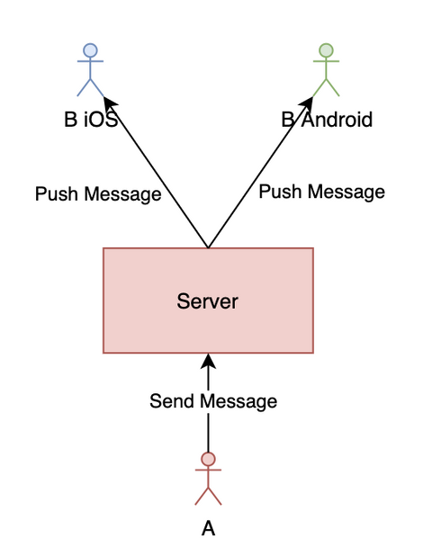

如上图所示，正常情况下，用户发的消息经过服务器存储等操作后会推给接收方的所有端。但推是有可能会丢失的，最常见的情况就是用户可能会伪在线（是指如果推送服务基于长连接，而长连接可能已经断开，即用户已经掉线，但一般需要经过一个心跳周期后服务器才能感知到，这时服务器会错误地以为用户还在线；伪在线是本人自己想的一个概念，没想到合适的词来解释）。因此如果单纯使用推模式的话，是有可能会丢失消息的。**推拉结合模式简化图如下：**

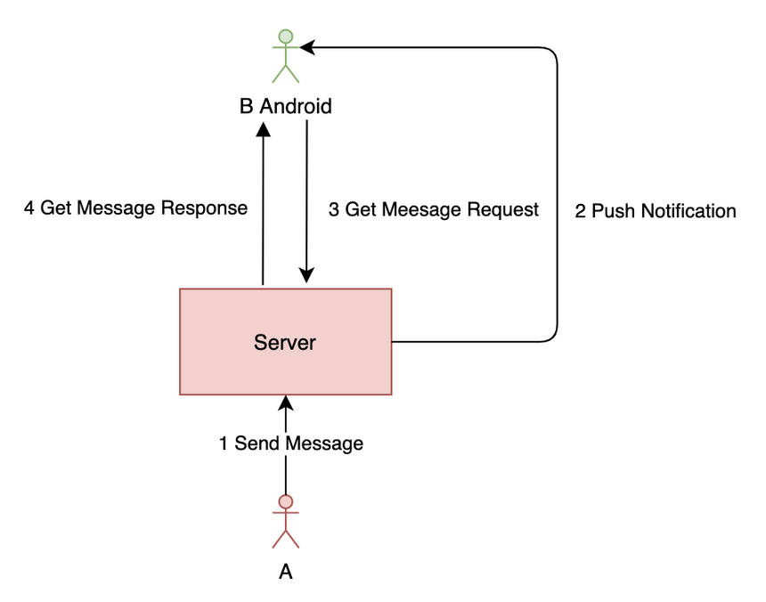

可以使用推拉结合模式解决推模式可能会丢消息的问题。在用户发新消息时服务器推送一个通知，然后前端请求最新消息列表，为了防止有消息丢失，可以再每隔一段时间主动请求一次。可以看出，使用推拉结合模式最好是用写扩散，因为写扩散只需要拉一条时间线的个人信箱就好了，而读扩散有 N 条时间线（每个信箱一条），如果也定时拉取的话性能会很差。

业界解决方案
======

前面了解了 IM 系统的常见设计问题，接下来我们再看看业界是怎么设计 IM 系统的。研究业界的主流方案有助于我们深入理解 IM 系统的设计。以下研究都是基于网上已经公开的资料，不一定正确，大家仅作参考就好了。

微信
--

虽然微信很多基础框架都是自研，但这并不妨碍我们理解微信的架构设计。从微信公开的《[从0到1：微信后台系统的演进之路](https://mp.weixin.qq.com/s/fMF_FjcdLiXc_JVmf4fl0w)》这篇文章可以看出，微信采用的主要是：写扩散 + 推拉结合。由于群聊使用的也是写扩散，而写扩散很消耗资源，因此微信群有人数上限（目前是 500）。所以这也是写扩散的一个明显缺点，如果需要万人群就比较难了。

从文中还可以看出，微信采用了多数据中心架构：

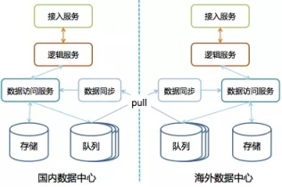

微信每个数据中心都是自治的，每个数据中心都有全量的数据，数据中心间通过自研的消息队列来同步数据。为了保证数据的一致性，每个用户都只属于一个数据中心，只能在自己所属的数据中心进行数据读写，如果用户连了其它数据中心则会自动引导用户接入所属的数据中心。而如果需要访问其它用户的数据那只需要访问自己所属的数据中心就可以了。同时，微信使用了三园区容灾的架构，使用 Paxos 来保证数据的一致性。

从微信公开的《[万亿级调用系统：微信序列号生成器架构设计及演变](https://mp.weixin.qq.com/s/JqIJupVKUNuQYIDDxRtfqA)》这篇文章可以看出，微信的 ID 设计采用的是：基于申请 DB 步长的生成方式 + 用户级别递增。如下图所示：

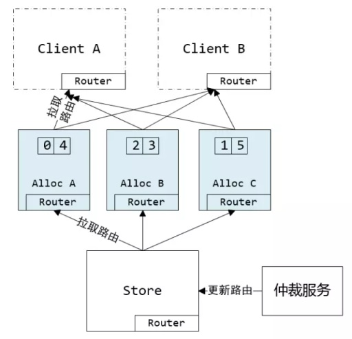

微信的序列号生成器由仲裁服务生成路由表（路由表保存了 uid 号段到 AllocSvr 的全映射），路由表会同步到 AllocSvr 跟 Client。如果 AllocSvr 宕机的话会由仲裁服务重新调度 uid 号段到其它 AllocSvr。

钉钉
--

钉钉公开的资料不多，从《[阿里钉钉技术分享：企业级IM王者——钉钉在后端架构上的过人之处](http://www.52im.net/thread-2848-1-1.html)》这篇文章我们只能知道，钉钉最开始使用的是写扩散模型，为了支持万人群，后来貌似优化成了读扩散。

但聊到阿里的 IM 系统，不得不提的是阿里自研的 Tablestore。一般情况下，IM 系统都会有一个自增 ID 生成系统，但 Tablestore 创造性地引入了[主键列自增](https://help.aliyun.com/document_detail/47731.html?spm=5176.10695662.1996646101.searchclickresult.6bc54277FuOVpL)，即把 ID 的生成整合到了 DB 层，支持了用户级别递增（传统 MySQL 等 DB 只能支持表级自增，即全局自增）。具体可以参考：《[如何优化高并发IM系统架构](https://help.aliyun.com/document_detail/143555.html?spm=a2c4g.11174283.6.686.66f930afTL8fnv)》

Twitter
-------

什么？Twitter 不是 Feeds 系统吗？这篇文章不是讨论 IM 的吗？是的，Twitter 是 Feeds 系统，但 Feeds 系统跟 IM 系统其实有很多设计上的共性，研究下 Feeds 系统有助于我们在设计 IM 系统时进行参考。再说了，研究下 Feeds 系统也没有坏处，扩展下技术视野嘛。

Twitter 的自增 ID 设计估计大家都耳熟能详了，即大名鼎鼎的[Snowflake](https://developer.twitter.com/en/docs/basics/twitter-ids)，因此 ID 是全局递增的。

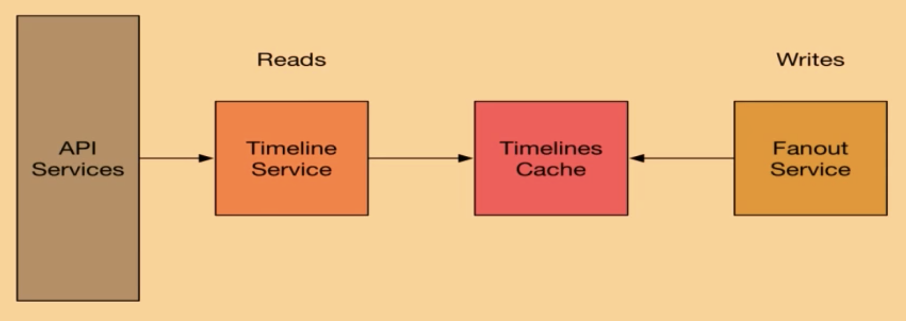

从这个视频分享《[How We Learned to Stop Worrying and Love Fan-In at Twitter](https://www.youtube.com/watch?v=WEgCjwyXvwc&t=1971s)》可以看出，Twitter 一开始使用的是写扩散模型，Fanout Service 负责扩散写到 Timelines Cache（使用了 Redis），Timeline Service 负责读取 Timeline 数据，然后由 API Services 返回给用户。

但由于写扩散对于大 V 来说写的消耗太大，因此后面 Twitter 又使用了写扩散跟读扩散结合的方式。如下图所示：

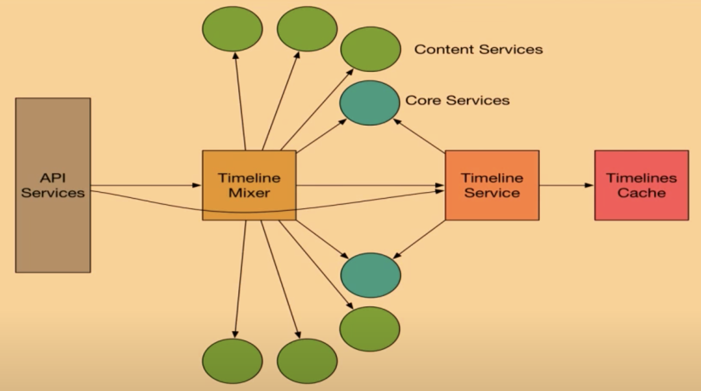

对于粉丝数不多的用户如果发 Twitter 使用的还是写扩散模型，由 Timeline Mixer 服务将用户的 Timeline、大 V 的写 Timeline 跟系统推荐等内容整合起来，最后再由 API Services 返回给用户。

58 到家
-----

58 到家实现了一个通用的实时消息平台：

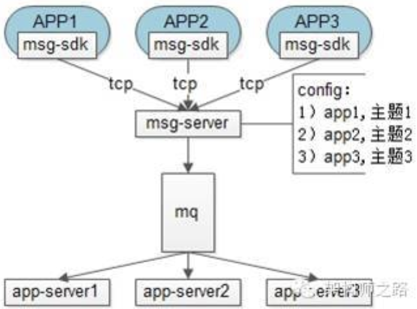

可以看出，msg-server 保存了应用跟 MQ 主题之间的对应关系，msg-server 根据这个配置将消息推到不同的 MQ 队列，具体的应用来消费就可以了。因此，新增一个应用只需要修改配置就可以了。

58 到家为了保证消息投递的可靠性，还引入了确认机制：消息平台收到消息先落地数据库，接收方收到后应用层 ACK 再删除。使用确认机制最好是只能单点登录，如果多端能够同时登录的话那就比较麻烦了，因为需要所有端都确认收到消息后才能删除。

看到这里，估计大家已经明白了，设计一个 IM 系统很有挑战性。我们还是继续来看设计一个 IM 系统需要考虑的问题吧。

IM 需要解决的问题
==========

##### 如何保证消息的实时性

在通信协议的选择上，我们主要有以下几个选择：

1. 使用 TCP Socket 通信，自己设计协议：58 到家等等
2. 使用 UDP Socket 通信：QQ 等等
3. 使用 HTTP 长轮循：微信网页版等等

不管使用哪种方式，我们都能够做到消息的实时通知。但影响我们消息实时性的可能会在我们处理消息的方式上。例如：假如我们推送的时候使用 MQ 去处理并推送一个万人群的消息，推送一个人需要 2ms，那么推完一万人需要 20s，那么后面的消息就阻塞了 20s。如果我们需要在 10ms 内推完，那么我们推送的并发度应该是：`人数：10000 / (推送总时长：10 / 单个人推送时长：2) = 2000`

因此，我们在选择具体的实现方案的时候一定要评估好我们系统的吞吐量，系统的每一个环节都要进行评估压测。只有把每一个环节的吞吐量评估好了，才能保证消息推送的实时性。

##### 如何保证消息时序

以下情况下消息可能会乱序：

* 发送消息如果使用的不是长连接，而是使用 HTTP 的话可能会出现乱序。因为后端一般是集群部署，使用 HTTP 的话请求可能会打到不同的服务器，由于网络延迟或者服务器处理速度的不同，后发的消息可能会先完成，此时就产生了消息乱序。解决方案：
* 前端依次对消息进行处理，发送完一个消息再发送下一个消息。这种方式会降低用户体验，一般情况下不建议使用。
* 带上一个前端生成的顺序 ID，让接收方根据该 ID 进行排序。这种方式前端处理会比较麻烦一点，而且聊天的过程中接收方的历史消息列表中可能会在中间插入一条消息，这样会很奇怪，而且用户可能会漏读消息。但这种情况可以通过在用户切换窗口的时候再进行重排来解决，接收方每次收到消息都先往最后面追加。
* 通常为了优化体验，有的 IM 系统可能会采取异步发送确认机制（例如：QQ）。即消息只要到达服务器，然后服务器发送到 MQ 就算发送成功。如果由于权限等问题发送失败的话后端再推一个通知下去。这种情况下 MQ 就要选择合适的 Sharding 策略了：
* 按`to_user_id`进行 Sharding：使用该策略如果需要做多端同步的话发送方多个端进行同步可能会乱序，因为不同队列的处理速度可能会不一样。例如发送方先发送 m1 然后发送 m2，但服务器可能会先处理完 m2 再处理 m1，这里其它端会先收到 m2 然后是 m1，此时其它端的会话列表就乱了。
* 按`conversation_id`进行 Sharding：使用该策略同样会导致多端同步会乱序。
* 按`from_user_id`进行 Sharding：这种情况下使用该策略是比较好的选择
* 通常为了优化性能，推送前可能会先往 MQ 推，这种情况下使用`to_user_id`才是比较好的选择。

##### 用户在线状态如何做

很多 IM 系统都需要展示用户的状态：是否在线，是否忙碌等。主要可以使用 Redis 或者分布式一致性哈希来实现用户在线状态的存储。

1. Redis 存储用户在线状态

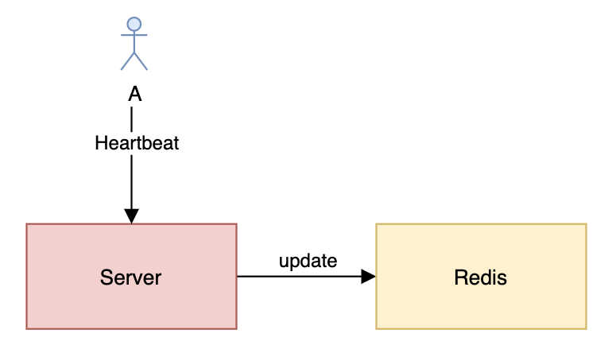

看上面的图可能会有人疑惑，为什么每次心跳都需要更新 Redis？如果我使用的是 TCP 长连接那是不是就不用每次心跳都更新了？确实，正常情况下服务器只需要在新建连接或者断开连接的时候更新一下 Redis 就好了。但由于服务器可能会出现异常，或者服务器跟 Redis 之间的网络会出现问题，此时基于事件的更新就会出现问题，导致用户状态不正确。因此，如果需要用户在线状态准确的话最好通过心跳来更新在线状态。

由于 Redis 是单机存储的，因此，为了提高可靠性跟性能，我们可以使用 Redis Cluster 或者 Codis。

1. 分布式一致性哈希存储用户在线状态

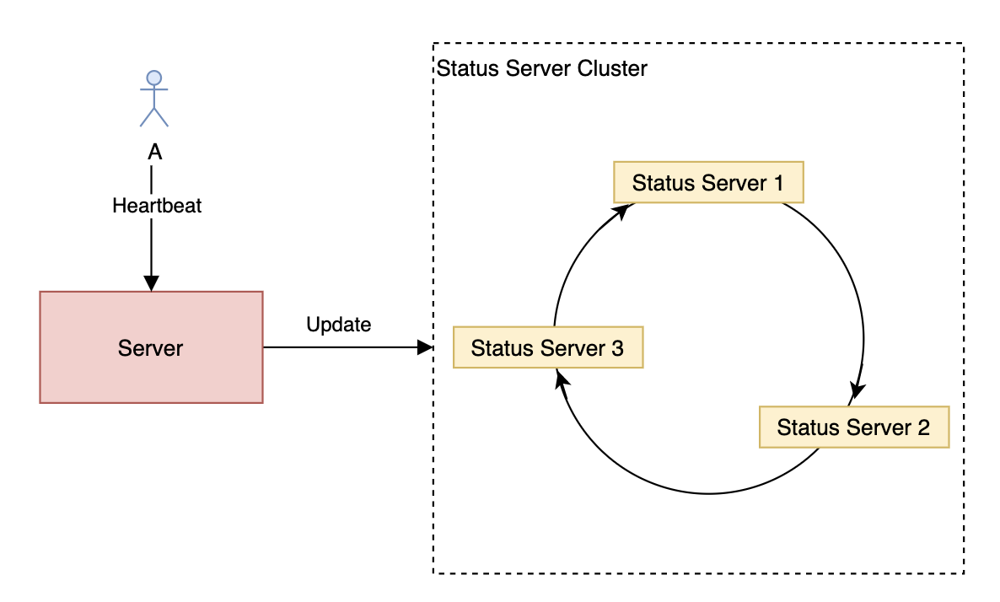

使用分布式一致性哈希需要注意在对 Status Server Cluster 进行扩容或者缩容的时候要先对用户状态进行迁移，不然在刚操作时会出现用户状态不一致的情况。同时还需要使用虚拟节点避免数据倾斜的问题。

##### 多端同步怎么做

读扩散

前面也提到过，对于读扩散，消息的同步主要是以推模式为主，单个会话的消息 ID 顺序递增，前端收到推的消息如果发现消息 ID 不连续就请求后端重新获取消息。但这样仍然可能丢失会话的最后一条消息，为了加大消息的可靠性，可以在历史会话列表的会话里再带上最后一条消息的 ID，前端在收到新消息的时候会先拉取最新的会话列表，然后判断会话的最后一条消息是否存在，如果不存在，消息就可能丢失了，前端需要再拉一次会话的消息列表；如果会话的最后一条消息 ID 跟消息列表里的最后一条消息 ID 一样，前端就不再处理。这种做法的性能瓶颈会在拉取历史会话列表那里，因为每次新消息都需要拉取后端一次，如果按微信的量级来看，单是消息就可能会有 20 万的 QPS，如果历史会话列表放到 MySQL 等传统 DB 的话肯定抗不住。因此，最好将历史会话列表存到开了 AOF（用 RDB 的话可能会丢数据）的 Redis 集群。这里只能感慨性能跟简单性不能兼得。

写扩散

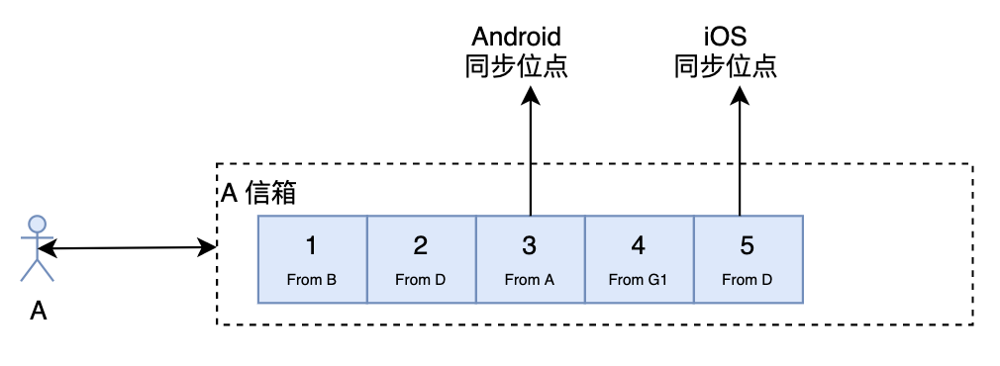

对于写扩散来说，多端同步就简单些了。前端只需要记录最后同步的位点，同步的时候带上同步位点，然后服务器就将该位点后面的数据全部返回给前端，前端更新同步位点就可以了。

##### 如何处理未读数

在 IM 系统中，未读数的处理非常重要。未读数一般分为会话未读数跟总未读数，如果处理不当，会话未读数跟总未读数可能会不一致，严重降低用户体验。

**读扩散**对于读扩散来说，我们可以将会话未读数跟总未读数都存在后端，但后端需要保证两个未读数更新的原子性跟一致性，一般可以通过以下两种方法来实现：

1. 使用 Redis 的 multi 事务功能，事务更新失败可以重试。但要注意如果你使用 Codis 集群的话并不支持事务功能。
2. 使用 Lua 嵌入脚本的方式。使用这种方式需要保证会话未读数跟总未读数都在同一个 Redis 节点（Codis 的话可以使用 Hashtag）。这种方式会导致实现逻辑分散，加大维护成本。**写扩散**对于写扩散来说，服务端通常会弱化会话的概念，即服务端不存储历史会话列表。未读数的计算可由前端来负责，标记已读跟标记未读可以只记录一个事件到信箱里，各个端通过重放该事件的形式来处理会话未读数。使用这种方式可能会造成各个端的未读数不一致，至少微信就会有这个问题。

如果写扩散也通过历史会话列表来存储未读数的话那用户时间线服务跟会话服务紧耦合，这个时候需要保证原子性跟一致性的话那就只能使用分布式事务了，会大大降低系统的性能。

##### 如何存储历史消息**读扩散 **对于读扩散，只需要按会话 ID 进行 Sharding 存储一份就可以了。** 写扩散**

对于写扩散，需要存储两份：一份是以用户为 Timeline 的消息列表，一份是以会话为 Timeline 的消息列表。以用户为 Timeline 的消息列表可以用用户 ID 来做 Sharding，以会话为 Timeline 的消息列表可以用会话 ID 来做 Sharding。

##### 数据冷热分离

对于 IM 来说，历史消息的存储有很强的时间序列特性，时间越久，消息被访问的概率也越低，价值也越低。

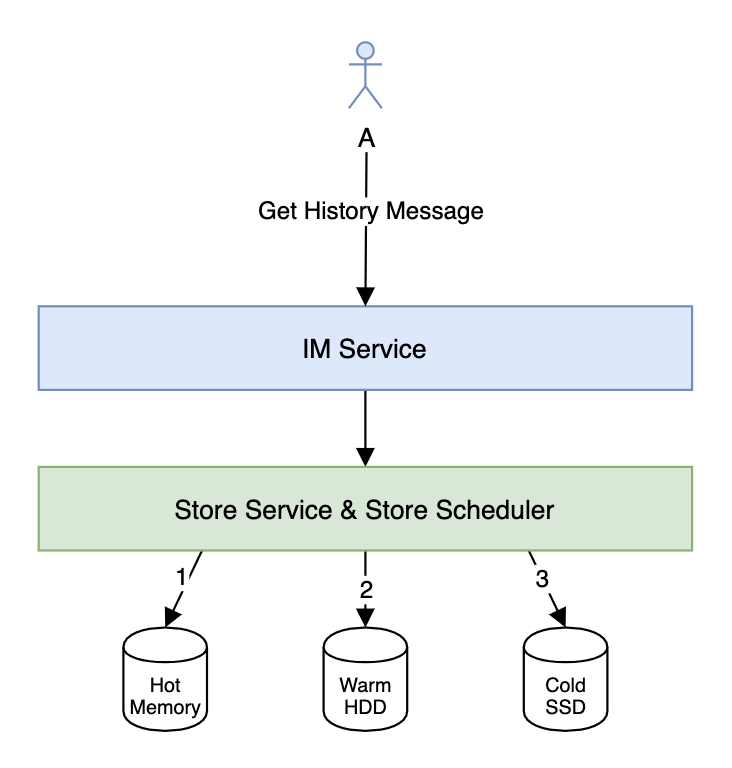

如果我们需要存储几年甚至是永久的历史消息的话（电商 IM 中比较常见），那么做历史消息的冷热分离就非常有必要了。数据的冷热分离一般是 HWC（Hot-Warm-Cold）架构。对于刚发送的消息可以放到 Hot 存储系统（可以用 Redis）跟 Warm 存储系统，然后由 Store Scheduler 根据一定的规则定时将冷数据迁移到 Cold 存储系统。获取消息的时候需要依次访问 Hot、Warm 跟 Cold 存储系统，由 Store Service 整合数据返回给 IM Service。

##### 接入层怎么做

实现接入层的负载均衡主要有以下几个方法：

1. 硬件负载均衡：例如 F5、A10 等等。硬件负载均衡性能强大，稳定性高，但价格非常贵，不是土豪公司不建议使用。
2. 使用 DNS 实现负载均衡：使用 DNS 实现负载均衡比较简单，但使用 DNS 实现负载均衡如果需要切换或者扩容那生效会很慢，而且使用 DNS 实现负载均衡支持的 IP 个数有限制、支持的负载均衡策略也比较简单。
3. DNS + 4 层负载均衡 + 7 层负载均衡架构：例如 DNS + DPVS + Nginx 或者 DNS + LVS + Nginx。有人可能会疑惑为什么要加入 4 层负载均衡呢？这是因为 7 层负载均衡很耗 CPU，并且经常需要扩容或者缩容，对于大型网站来说可能需要很多 7 层负载均衡服务器，但只需要少量的 4 层负载均衡服务器即可。因此，该架构对于 HTTP 等短连接大型应用很有用。当然，如果流量不大的话只使用 DNS + 7 层负载均衡即可。但对于长连接来说，加入 7 层负载均衡 Nginx 就不大好了。因为 Nginx 经常需要改配置并且 reload 配置，reload 的时候 TCP 连接会断开，造成大量掉线。
4. DNS + 4 层负载均衡：4 层负载均衡一般比较稳定，很少改动，比较适合于长连接。

对于长连接的接入层，如果我们需要更加灵活的负载均衡策略或者需要做灰度的话，那我们可以引入一个调度服务，如下图所示：

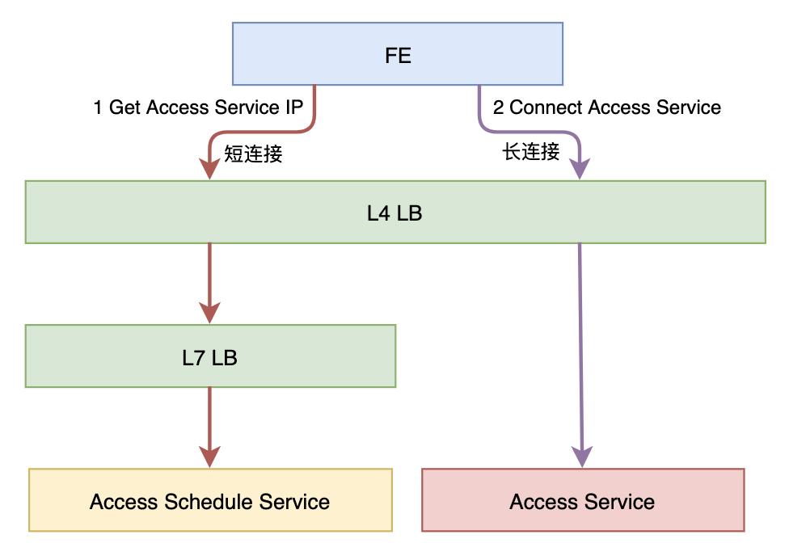

Access Schedule Service 可以实现根据各种策略来分配 Access Service，例如：

* 根据灰度策略来分配
* 根据就近原则来分配
* 根据最少连接数来分配

架构心得
====

最后，分享一下做大型应用的架构心得：

1. 灰度！灰度！灰度！
2. 监控！监控！监控！
3. 告警！告警！告警！
4. 缓存！缓存！缓存！
5. 限流！熔断！降级！
6. 低耦合，高内聚！
7. 避免单点，拥抱无状态！
8. 评估！评估！评估！
9. 压测！压测！压测！

参考
==

[How We Developed DingTalk: Implementing the Message System Architecture](https://www.alibabacloud.com/blog/how-we-developed-dingtalk-implementing-the-message-system-architecture_595905?spm=a2c65.11461447.0.0.35731139vllELK)

[Feed Stream System Design: General Principles](https://www.alibabacloud.com/blog/feed-stream-system-design-general-principles_595900?spm=a2c65.11461447.0.0.83f7129crg94C2)

[融云首度披露高并发系统架构设计四大要点](http://m.c114.com.cn/w241-1114151.html)

[一个海量在线用户即时通讯系统（IM）的完整设计Plus](https://cloud.tencent.com/developer/article/1478773)

[即时通讯网（IM开发者社区）— 技术精选](http://www.52im.net/forum.php?mod=collection&op=all)

[从0到1：微信后台系统的演进之路](https://mp.weixin.qq.com/s/fMF_FjcdLiXc_JVmf4fl0w)

[万亿级调用系统：微信序列号生成器架构设计及演变](https://mp.weixin.qq.com/s/JqIJupVKUNuQYIDDxRtfqA)

[微信PaxosStore：深入浅出Paxos算法协议](https://mp.weixin.qq.com/s/CnrePM7ITVyWEUbqg9sDfw)

[微信后台基于时间序的海量数据冷热分级架构设计实践](https://mp.weixin.qq.com/s/XlZF0GDt7dnHyYuS1an6tg)

[钉钉企业级 IM 存储架构创新之道](https://www.infoq.cn/article/J4m6a2I66MziISJVzFEe)

[现代IM系统中聊天消息的同步和存储方案探讨](http://www.52im.net/thread-1230-1-1.html)

[阿里钉钉技术分享：企业级IM王者——钉钉在后端架构上的过人之处](https://juejin.im/post/5ddcd45b6fb9a07add57c4b8#heading-4)

[如何优化高并发IM系统架构](https://help.aliyun.com/document_detail/143555.html?spm=a2c4g.11174283.6.686.66f930afTL8fnv)

[现代IM系统中的消息系统—架构](https://help.aliyun.com/document_detail/130781.html?spm=a2c4g.11186623.6.692.68b41071MDSY3O)

[现代IM系统中的消息系统—模型](https://help.aliyun.com/document_detail/131018.html?spm=a2c4g.11186623.6.693.78ac7ffbjlmPep)

[现代IM系统中的消息系统—实现](https://help.aliyun.com/document_detail/131110.html?spm=a2c4g.11186623.6.694.13852ba3lr8AoP)

[How We Learned to Stop Worrying and Love Fan-In at Twitter](https://www.youtube.com/watch?v=WEgCjwyXvwc&t=1971s)

[58到家通用实时消息平台架构细节](https://cloud.tencent.com/developer/article/1048052)

[如何保证IM实时消息的“时序性”与“一致性”](http://www.52im.net/thread-714-1-1.html)
