异步网络模型
======

异步网络模型在服务开发中应用非常广泛，相关资料和开源库也非常多。项目中，使用现成的轮子提高了开发效率，除了能使用轮子，还是有必要了解一下轮子的内部构造。

这篇文章从最基础的5种I/O模型切入，到I/O事件处理模型，再到并发模式，最后以Swoole开源库来做具体分析，逐步深入。文中提到的模型都是一些通用的模型，在《linux高性能服务器编程》中也都有涉及。文章不涉及模型的实现细节，最重要的是去理解各个模型的工作模式以及其优缺点。

文中涉及接口调用的部分，都是指Linux系统的接口调用。 共分为5部分：

**I/O模型 **从基础的系统调用方法出发，给大家从头回顾一下最基本的I/O模型，虽然简单，但是不可或缺的基础；** 事件处理模型 **这部分在同步I/O、异步I/O的基础上分别介绍Reactor模型以及Proactor模型，着重两种模型的构成以及事件处理流程。Reactor模型是我们常见的；不同平台对异步I/O系统接口的支持力度不同，这部分还介绍了一种使用同步I/O来模拟Proactor模型的方法。** 并发模式 **就是多线程、多进程的编程的模式。介绍了两种较为高效的并发模型，半同步／半异步(包括其演变模式)、Follower／Leader模式。** Swoole异步网络模型分析 **这部分是结合已介绍的事件处理模型、并发模式对Swoole的异步模型进行分析； 从分析的过程来看，看似复杂的网络模型，可以拆分为简单的模型单元，只不过我们需要权衡利弊，选取合适业务需求的模型单元进行组合。 我们团队基于Swoole 1.8.5版本，做了很多修改，部分模块做了重构，计划在17年6月底将修改后版本开源出去，敬请期待。** 改善性能的方法**最后一部分是在引入话题，介绍的是几种常用的方法。性能优化是没有终点的，希望大家能贡献一些想法和具体方法。

I/O模型
-----

POSIX 规范中定义了同步I/O 和异步I/O的术语，**同步I/O **: 需要进程去真正的去操作I/O；** 异步I/O**：内核在I/O操作完成后再通知应用进程操作结果。

在《UNIX网络编程》中介绍了5中I/O模型：阻塞I/O、非阻塞I/O、I/O复用、SIGIO 、异步I/O；本节对这5种I/O模型进行说明和对比。

### I/O阻塞

通常把阻塞的文件描述符（file descriptor，fd）称之为阻塞I/O。默认条件下，创建的socket fd是阻塞的，针对阻塞I/O调用系统接口，可能因为等待的事件没有到达而被系统挂起，直到等待的事件触发调用接口才返回，例如，tcp socket的connect调用会阻塞至第三次握手成功（不考虑socket 出错或系统中断），如图1所示。另外socket 的系统API ，如，accept、send、recv等都可能被阻塞。

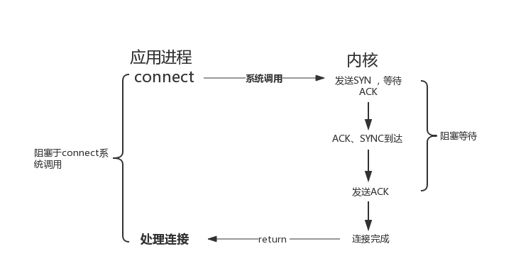

> ```
>                  图1 I/O 阻塞模型示意图
> ```

另外补充一点，网络编程中，通常把可能永远阻塞的系统API调用 称为慢系统调用，典型的如 accept、recv、select等。慢系统调用在阻塞期间可能被信号中断而返回错误，相应的errno 被设置为EINTR，我们需要处理这种错误，解决办法有：**1\. 重启系统调用**直接上示例代码吧，以accept为例，被中断后重启accept 。有个例外，若connect 系统调用在阻塞时被中断，是不能直接重启的（与内核socket 的状态有关)，有兴趣的同学可以深入研究一下connect 的内核实现。使用I/O复用等待连接完成，能避免connect不能重启的问题。

```c
int client_fd = -1;  
struct sockaddr_in client_addr;  
socklen_t child_addrlen;  
while (1) {  
call_accept:  
    client_fd = accept(server_fd,NULL,NULL)；
    if (client_fd < 0) {
       if (EINTR == errno) {
          goto call_accept;
       } else {
          sw_sysError("accept fail");
          break;
       }
    }
}
```** 2\. 信号处理 **利用信号处理，可以选择忽略信号，或者在安装信号时设置SA\_RESTART属性。设置属性SA\_RESTART，信号处理函数返回后，被安装信号中断的系统调用将自动恢复，示例代码如下。需要知道的是，设置SA\_RESTART属性方法并不完全适用，对某些系统调用可能无效，这里只是提供一种解决问题的思路，示例代码如下：

```c
int client_fd = -1;  
struct sigaction action,old_action;
action.sa_handler = sig_handler;  
sigemptyset(&action.sa_mask);  
action.sa_flags = 0;  
action.sa_flags |= SA_RESTART;
/// 若信号已经被忽略，则不设置
sigaction(SIGALRM, NULL, &old_action)；  
if (old_action.sa_handler != SIG_IGN) {  
    sigaction(SIGALRM, &action, NULL)；
}
while (1) {  
    client_fd = accept(server_fd,NULL,NULL)；
    if (client_fd < 0) {
        sw_sysError("accept fail");
        break;
    }
}
```

### I/O非阻塞

把非阻塞的文件描述符称为非阻塞I/O。可以通过设置SOCK\_NONBLOCK标记创建非阻塞的socket fd，或者使用fcntl将fd设置为非阻塞。

对非阻塞fd调用系统接口时，不需要等待事件发生而立即返回，事件没有发生，接口返回-1，此时需要通过errno的值来区分是否出错，有过网络编程的经验的应该都了解这点。不同的接口，立即返回时的errno值不尽相同，如，recv、send、accept errno通常被设置为EAGIN 或者EWOULDBLOCK，connect 则为EINPRO- GRESS 。

以recv操作非阻塞套接字为例，如图2所示。

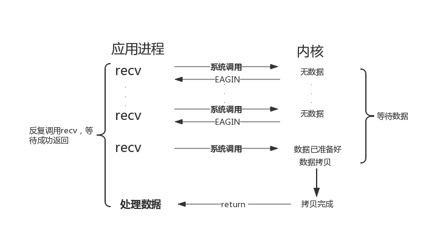

> ```
>                 图2 非阻塞I/O模型示意图
> ```

当我们需要读取，在有数据可读的事件触发时，再调用recv，避免应用层不断去轮询检查是否可读，提高程序的处理效率。通常非阻塞I/O与I/O事件处理机制结合使用。

### I/O复用

最常用的I/O事件通知机制就是I/O复用(I/O multiplexing)。Linux 环境中使用select/poll/epoll 实现I/O复用，I/O复用接口本身是阻塞的，在应用程序中通过I/O复用接口向内核注册fd所关注的事件，当关注事件触发时，通过I/O复用接口的返回值通知到应用程序，如图3所示,以recv为例。I/O复用接口可以同时监听多个I/O事件以提高事件处理效率。

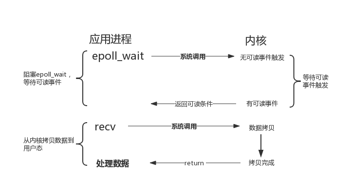

> ```
>                图 3 I/O复用模型示意图
> ```

关于select/poll/epoll的对比，可以参考\[\]，epoll使用比较多，但是在并发的模式下，需要关注惊群的影响。

### SIGIO

除了I/O复用方式通知I/O事件，还可以通过SIGIO信号来通知I/O事件，如图4所示。两者不同的是，在等待数据达到期间，I/O复用是会阻塞应用程序，而SIGIO方式是不会阻塞应用程序的。

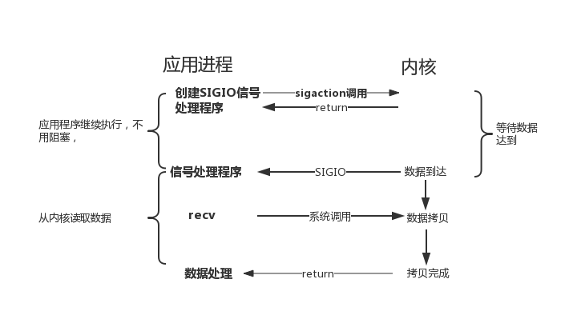

> ```
>                 图 4 信号驱动I/O模型示意图
> ```

### 异步I/O

POSIX规范定义了一组异步操作I/O的接口，不用关心fd 是阻塞还是非阻塞，异步I/O是由内核接管应用层对fd的I/O操作。异步I/O向应用层通知I/O操作完成的事件，这与前面介绍的I/O 复用模型、SIGIO模型通知事件就绪的方式明显不同。以aio\_read 实现异步读取IO数据为例，如图5所示，在等待I/O操作完成期间，不会阻塞应用程序。

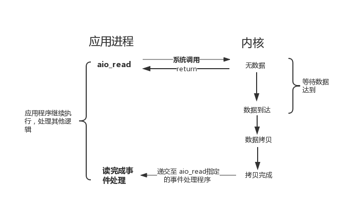

> ```
>                  图 5 异步I/O 模型示意图
> ```

### I/O模型对比

前面介绍的5中I/O中，I/O 阻塞、I/O非阻塞、I/O复用、SIGIO 都会在不同程度上阻塞应用程序，而只有异步I/O模型在整个操作期间都不会阻塞应用程序。

如图6所示，列出了5种I/O模型的比较

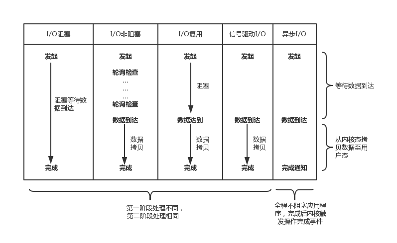

> ```
>               图6 五种I/O 模型比较示意图
> ```

事件处理模型
------

网络设计模式中，如何处理各种I/O事件是其非常重要的一部分，Reactor 和Proactor两种事件处理模型应运而生。上章节提到将I/O分为同步I/O 和 异步I/O，可以使用同步I/O实现Reactor模型，使用异步I/O实现Proactor模型。

本章节将介绍Reactor和Proactor两种模型，最后将介绍一种使用同步I/O模拟Proactor事件处理模型。

### **Reactor事件处理模型**Reactor模型是同步I/O事件处理的一种常见模型，关于Reactor模型结构的资料非常多，一个典型的Reactor模型类图结构如图7所示

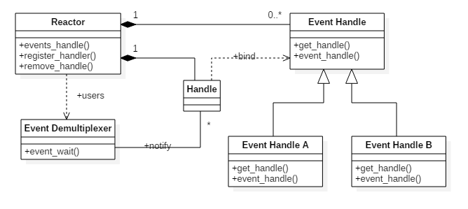

> ```
>               图 7 Reactor 模型类结构图
> ```** Reactor的核心思想**：将关注的I/O事件注册到多路复用器上，一旦有I/O事件触发，将事件分发到事件处理器中，执行就绪I/O事件对应的处理函数中。模型中有三个重要的组件：

* **多路复用器**：由操作系统提供接口，Linux提供的I/O复用接口有select、poll、epoll；
* **事件分离器**：将多路复用器返回的就绪事件分发到事件处理器中；
* **事件处理器**：处理就绪事件处理函数。

图7所示，Reactor 类结构中包含有如下角色。

* **Handle**：标示文件描述符；
* **Event Demultiplexer**：执行多路事件分解操作，对操作系统内核实现I/O复用接口的封装；用于阻塞等待发生在句柄集合上的一个或多个事件（如select/poll/epoll）；
* **Event Handler**：事件处理接口；
* **Event Handler A(B)**：实现应用程序所提供的特定事件处理逻辑；
* **Reactor**：反应器，定义一个接口，实现以下功能：

```
      a)供应用程序注册和删除关注的事件句柄；
      b)运行事件处理循环；
      c)等待的就绪事件触发，分发事件到之前注册的回调函数上处理.
```

接下来介绍Reactor的工作流程，如图8所示，为Reactor模型工作的简化流程。

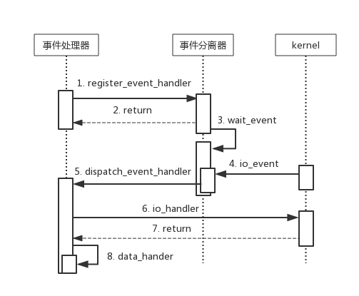

> ```
>              图8 Reactor模型简化流程示意图
> ```

1. 注册I/O就绪事件处理器；
2. 事件分离器等待I/O就绪事件；
3. I/O事件触发，激活事件分离器，分离器调度对应的事件处理器；
4. 事件处理器完成I/O操作，处理数据.

网络设计中，Reactor使用非常广，在开源社区有很许多非常成熟的、跨平台的、Reactor模型的网络库，比较典型如libevent。

### Proactor事件处理模型

与Reactor不同的是，Proactor使用异步I/O系统接口将I/O操作托管给操作系统，Proactor模型中分发处理异步I/O完成事件，并调用相应的事件处理接口来处理业务逻辑。Proactor类结构如图9所示。

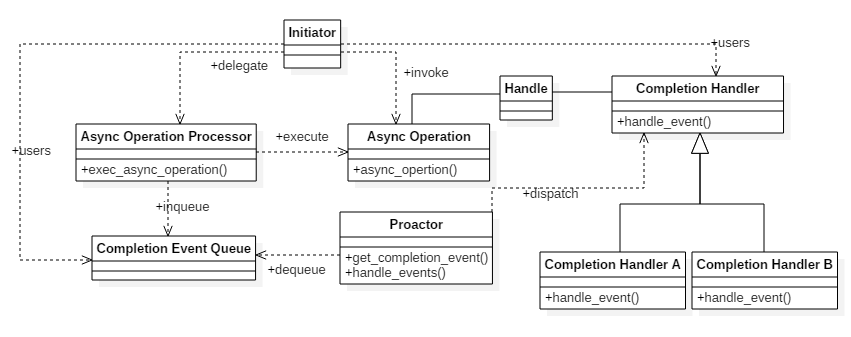

> ```
>                图9 Proactor模型类结构图
> ```

图9所示，Proactor类结构中包含有如下角色：

* **Handle**： 用来标识socket连接或是打开文件；
* **Async Operation Processor**：异步操作处理器；负责执行异步操作，一般由操作系统内核实现；
* **Async Operation**：异步操作；
* **Completion Event Queue**：完成事件队列；异步操作完成的结果放到队列中等待后续使用；
* **Proactor**：主动器；为应用程序进程提供事件循环；从完成事件队列中取出异步操作的结果，分发调用相应的后续处理逻辑；
* **Completion Handler**：完成事件接口；一般是由回调函数组成的接口；
* **Completion Handler A(B)**：完成事件处理逻辑；实现接口定义特定的应用处理逻辑。

Proactor模型的简化的工作流程,如图10所示。

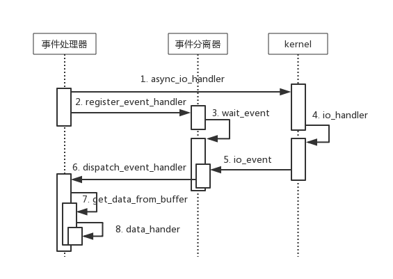

> ```
>             图10 Proactor模型简化工作流程示意图
> ```

1. 发起I/O异步操作，注册I/O完成事件处理器;
2. 事件分离器等待I/O操作完成事件；
3. 内核并行执行实际的I/O操作，并将结果数据存入用户自定义缓 冲区；
4. 内核完成I/O操作，通知事件分离器，事件分离器调度对应的事件处理器；
5. 事件处理器处理用户自定义缓冲区中的数据。

Proactor利用异步I/O并行能力，可给应用程序带来更高的效率，但是同时也增加了编程的复杂度。windows对异步I/O提供了非常好的支持，常用Proactor的模型实现服务器；而Linux对异步I/O操作(aio接口)的支持并不是特别理想，而且不能直接处理accept，因此Linux平台上还是以Reactor模型为主。

Boost asio采用的是Proactor模型，但是Linux上，采用I/O复用的方式来模拟Proactor，另启用线程来完成读写操作和调度。

### 同步I/O模拟Proactor

下面一种使用同步I/O模拟Proactor的方案，原理是：**主线程执行数据读写操作，读写操作完成后，主线程向工作线程通知I/O操作“完成事件”；**工作流程如图 11所示。

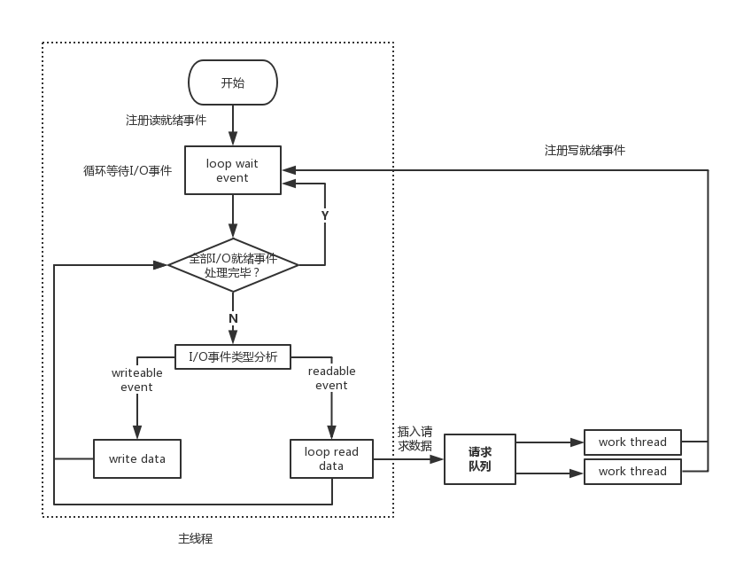

> ```
>              图11 同步I/O模拟Proactor模型
> ```

简单的描述一下图11 的执行流程：

1. 主线程往系统I/O复用中注册文件描述符fd上的读就绪事件；
2. 主线程调用调用系统I/O复用接口等待文件描述符fd上有数据可读；
3. 当fd上有数据可读时，通知主线程。主线程循环读取fd上的数据，直到没有更多数据可读，然后将读取到的数据封装成一个请求对象并插入请求队列。
4. 睡眠在请求队列上的某个工作线程被唤醒，它获得请求对象并处理客户请求，然后向I/O复用中注册fd上的写就绪事件。主线程进入事件等待循环，等待fd可写。

并发模式
----

在I/O密集型的程序，采用并发方式可以提高CPU的使用率，可采用多进程和多线程两种方式实现并发。当前有高效的两种并发模式，半同步/半异步模式、Follower/Leader模式。

### 半同步/半异步模式

首先区分一个概念，并发模式中的“同步”、“异步”与 I/O模型中的“同步”、“异步”是两个不同的概念：**并发模式中 **，“同步”指程序按照代码顺序执行，“异步”指程序依赖事件驱动，如图12 所示并发模式的“同步”执行和“异步”执行的读操作；** I/O模型中**，“同步”、“异步”用来区分I/O操作的方式，是主动通过I/O操作拿到结果，还是由内核异步的返回操作结果。

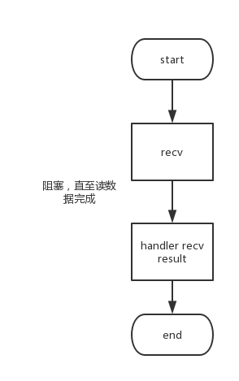

> ```
>                 图12(a)  同步读操作示意图 
> ```

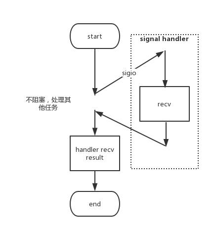

> ```
>                 图12(b) 异步读操作示意图 
> ```

本节从最简单的半同步/半异步模式的工作流程出发，并结合事件处理模型介绍两种演变的模式。

#### **半同步/半异步工作流程**

半同步/半异步模式的工作流程如图13 所示。

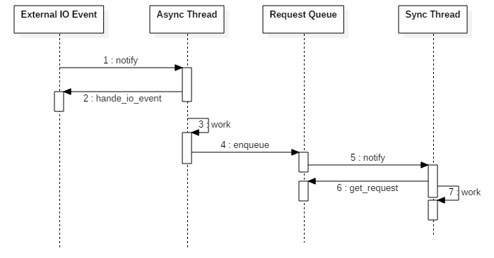

> ```
>          图13 半同步/半异步模式的工作流程示意图
> ```

其中异步线程处理I/O事件，同步线程处理请求对象，简单的来说：

1. 异步线程监听到事件后，将其封装为请求对象插入到请求队列中；
2. 请求队列有新的请求对象，通知同步线程获取请求对象；
3. 同步线程处理请求对象，实现业务逻辑。

#### 半同步/半反应堆模式

考虑将两种事件处理模型，即Reactor和Proactor，与几种I/O模型结合在一起，那么半同步/半异步模式就演变为半同步／半反应堆模式。先看看使用Reactor的方式，如图14 所示。

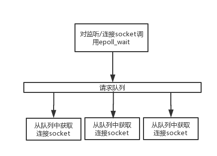

> ```
>                图14 半同步／半反应堆模式示意图
> ```

其工作流程为：

1. 异步线程监听所有fd上的I/O事件，若监听socket接可读，接受新的连接；并监听该连接上的读写事件；
2. 若连接socket上有读写事件发生，异步线程将该连接socket插入请求队列中；
3. 同步线程被唤醒，并接管连接socket，从socket上读取请求和发送应答；

若将Reactor替换为Proactor，那么其工作流程为：

1. 异步线程完成I/O操作，并I/O操作的结果封装为任务对象，插入请求队列中；
2. 请求队列通知同步线程处理任务；
3. 同步线程执行任务处理逻辑。

#### 一种高效的演变模式

半同步／半反应堆模式有明显的缺点：

1. 异步线程和同步线程共享队列，需要保护，存在资源竞争；
2. 工作线程同一时间只能处理一个任务，任务处理量很大或者任务处理存在一定的阻塞时，任务队列将会堆积，任务的时效性也等不到保证；不能简单地考虑增加工作线程来处理该问题，线程数达到一定的程度，工作线程的切换也将白白消耗大量的CPU资源。

下面介绍一种改进的方式，如图15 所示，每个工作线程都有自己的事件循环，能同时独立处理多个用户连接。

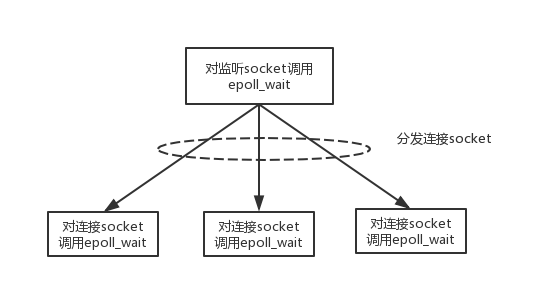

> ```
>            图 15 半同步／半反应堆模式的演变模式
> ```

其工作流程为：

1. 主线程实现连接监听，只处理网络I/O连接事件；
2. 新的连接socket分发至工作线程中，这个socket上的I/O事件都由该工作线程处理，工作线程都可以处理多个socket 的I/O事件；
3. 工作线程独立维护自己的事件循环，监听不同连接socket的I/O事件。

### Follower/Leader 模式

Follower/Leader是多个工作线程轮流进行事件监听、事件分发、处理事件的模式。

在Follower/Leader模式工作的任何一个时间点，只有一个工作线程处理成为Leader ，负责I/O事件监听，而其他线程都是Follower，并等待成为Leader。

Follower/Leader模式的工作流概述如下：

1. 当前Leader Thread1监听到就绪事件后，从Follower 线程集中推选出 Thread 2成为新的Leader；
2. 新的Leader Thread2 继续事件I/O监听；
3. Thread1继续处理I/O就绪事件，执行完后加入到Follower 线程集中，等待成为Leader。

从上描述，Leader/Follower模式的工作线程存在三种状态，工作线程同一时间只能处于一种状态，这三种状态为：

* Leader：线程处于领导者状态，负责监听I/O事件；
* Processing：线程处理就绪I/O事件；
* Follower：等待成为新的领导者或者可能被当前Leader指定处理就绪事件。

Leader监听到I/O就绪事件后，有两种处理方式:

1. 推选出新的Leader后，并转移到Processing处理该I/O就绪事件；
2. 指定其他Follower 线程处理该I/O就绪事件，此时保持Leader状态不变；

如图16所示为上面描述的三种状态的转移关系。

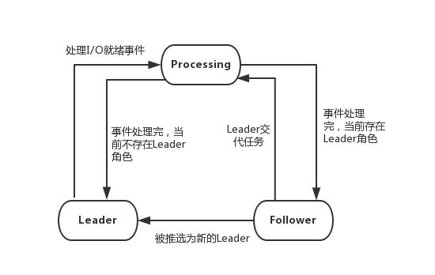

> ```
>          图16 Follower/Leader模式状态转移示意图
> ```

如图16所示，处于Processing状态的线程处理完I/O事件后，若当前不存在Leader，就自动提升为Leader，否则转变Follower。

从以上描述中可知，Follower/Leader模式中不需要在线程间传递数据，线程间也不存在共享资源。但很明显Follower/Leader 仅支持一个事件处理源集，无法做到图15所示的每个工作线程独立监听I/O事件。

Swoole 网络模型分析
-------------

Swoole为PHP提供I/O扩展功能，支持异步I/O、同步I/O、并发通信，并且为PHP多进程模式提供了并发数据结构和IPC通信机制；Swoole 既可以充当网络I/O服务器，也支持I/O客户端，较大程度为用户简化了网络I/O、多进程／多线程并发编程的工作。

Swoole作为server时，支持3种运行模式，分别是多进程模式、多线程模式、多进程＋多线程模式；多进程＋多线程模式是其中最为复杂的方式，其他两种方式可以认为是其特例。

本节结合之前介绍几种事件处理模型、并发模式来分析Swoole server的多进程＋多线程模型，如图17。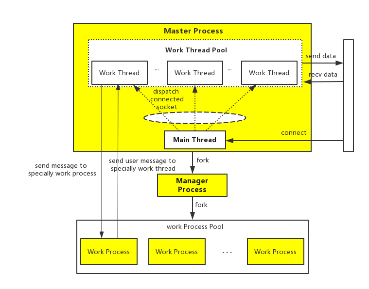

> ```
>         图17 swoole server多进程＋多线程模型结构示意图
> ```

图17所示，整体上可以分为Master Process、Manger Process、Work Process Pool三部分。这三部分的主要功能：

1. \*\*Master Process：\*\*监听服务端口，接收用户连接，收发连接数据，依靠reactor模型驱动；
2. \*\*Manager Process：\*\*Master Process的子进程，负责fork WorkProcess，并监控Work Process的运行状态；
3. \*\*Work Process Pool：\*\*工作进程池，与PHP业务层交互，将客户端数据或者事件（如连接关闭）回调给业务层，并将业务层的响应数据或者操作（如主动关闭连接）交给Master Process处理；工作进程依靠reactor模型驱动。

Manager Process 监控Work Process进程，本节不做进一步讲解，主要关注Master和Work。

#### **Master Process **Master Process 内部包括主线程(Main Thread)和工作线程池(Work Thread Pool),这两部分主要功能分别是：** 主线程:**监听服务端口，接收网络连接，将成功建立的连接分发到线程池中；依赖reactor模型驱动；** 工作线程池:**独立管理连接，收发网络数据；依赖Reactor事件处理驱动

顾一下前面介绍的半同步/半异步并发模式，很明显，主进程的工作方式就是图15所示的方式。

#### Work Process

如上所描述，Work Process是Master Process和PHP层之间的媒介：

1. Work Process接收来自Master Process的数据，包括网络数据和连接事件，回调至PHP业务层；
2. 将来自PHP层的数据和连接控制信息发送给Master Process进程，Master Process来处理。

Work Process同样是依赖Reactor事件模型驱动，其工作方式一个典型的Reactor模式。

Work Process作为Master Process和PHP层之间的媒介，将数据收发操作和数据处理分离开来，即使PHP层因消息处理将Work进程阻塞一段时间，也不会对其他连接有影响。

从整体层面来看，Master Process实现对连接socket上数据的I/O操作，这个过程对于Work Process是异步的，结合图11 所描述的同步I/O模拟Proactor模式，两种方式如出一辙，只不过这里使用的是多进程。

#### **进程间通信**Work Process是Master Process和PHP层之间的媒介，那么需要看看Work Process 与Master Process之间的通信方式，并在Swoole server 的多进程＋多线程模型进程中，整个过程还是有些复杂，下面说明一下该流程，如图18所示。 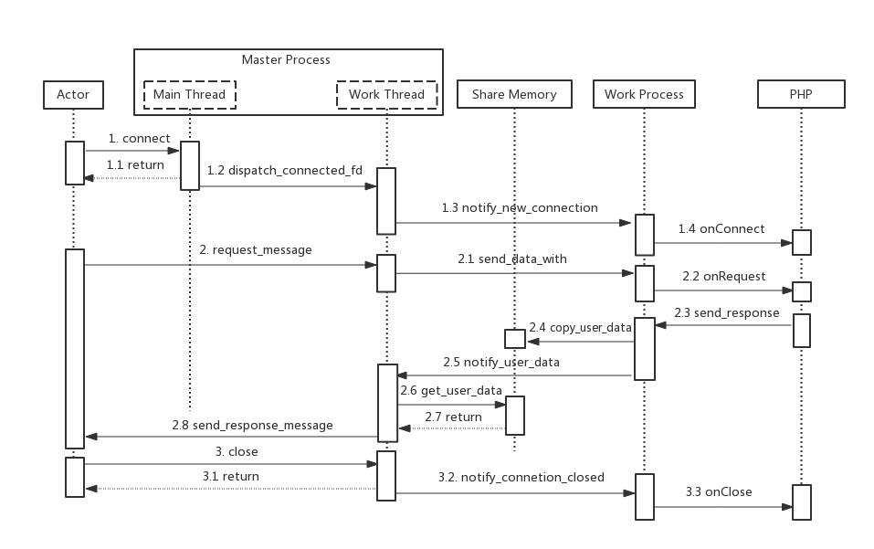

> ```
>            图18 swoole server 多进程多线程通信示意图
> ```

具体流程为：

1. Master 进程主线程接收客户端连接，连接建立成功后，分发至工作线程，工作线程通过Unix Socket通知Work进程连接信息；
2. Work 进程将连接信息回调至PHP业务层；
3. Maser 进程中的工作线程接收客户端请求消息，并通过Unix Socket方式发送到Work进程；
4. Work 进程将请求消息回调至PHP业务层；
5. PHP业务层构造回复消息，通过Work进程发送，Work进程将回复消息拷贝至共享内存中，并通过Unix Socket通知发送至Master进程的工作线程有数据需要发送；
6. 工作线程从共享内存中取出需发送的数据，并发送至客户端；
7. 客户端断开连接，工作线程将连接断开的事件通过UnixSocket发送至Work进程；
8. Work进程将连接断开事件回调至PHP业务层.

需要注意在步骤5中，Work进程通知Master进程有数据需要发送，不是将数据直接发送给Master进程，而是将数据地址(在共享内存中)发送给Master进程。

改善性能的方法
-------

性能对于服务器而言是非常敏感和重要的，当前，硬件的发展虽然不是服务器性能的瓶颈，作为软件开发人员还是应该考虑在软件层面来上改善服务性能。好的网络模块，除了稳定性，还有非常多的细节、技巧处理来提升服务性能，感兴趣的同学可以深入了解Ngnix源码的细节，以及陈硕的《Linux多线程服务器编程》。

### 数据复制

如果应用程序不关心数据的内容，就没有必要将数据拷贝到应用缓冲区，可以借助内核接口直接将数据拷贝到内核缓冲区处理，如在提供文件下载服务时，不需要将文件内容先读到应用缓冲区，在调用send接口发送出去，可以直接使用sendfile （零拷贝）接口直接发送出去。

应用程序的工作模块之间也应该避免数据拷贝，如：

1. 当两个工作进程之间需要传递数据，可以考虑使用共享内存的方式实现数据共享；
2. 在流媒体的应用中，对帧数据的非必要拷贝会对程序性能的影响，特备是在嵌入式环境中影响非常明显。通常采用的办法是，给每帧数据分配内存（下面统称为buffer），当需要使用该buffer时，会增加该buffer的引用计数，buffer的引用计数为0时才会释放对应的内存。这种方式适合在进程内数据无拷贝传递，并且不会给释放buffer带来困扰。

### 资源池

在服务运行期间，需要使用系统调用为用户分配资源，通常系统资源的分配都是比较耗时的，如动态创建进程／线程。可以考虑在服务启动时预先分配资源，即创建资源池，当需要资源，从资源池中获取即可，若资源池不够用时，再动态的分配，使用完成后交还到资源池中。这实际上是用空间换取时间，在服务运行期间可以节省非必要的资源创建过程。需要注意的是，使用资源池还需要根据业务和硬件环境对资源池的大小进行限制。

资源池是一个抽象的概念，常见的包括进程池、线程池、 内存池、连接池；这些资源池的相关资料非常多，这里就不一一介绍了。

### 锁/上下文切换

1.**关于锁**对共享资源的操作是并发程序中经常被提起的一个话题，都知道在业务逻辑上无法保证同步操作共享资源时，需要对共享资源加锁保护，但是锁不仅不能处理任何业务逻辑，而且还存在一定的系统开销。并且对锁的不恰当使用，可能成为服务期性能的瓶颈。

针对锁的使用有如下建议：

1. 如果能够在设计层面避免共享资源竞争，就可以避免锁，如图15描述的模式;
2. 若无法避免对共享资源的竞争，优先考虑使用无锁队列的方式实现共享资源；
3. 使用锁时，优先考虑使用读写锁；此外，锁的范围也要考虑，尽量较少锁的颗粒度，避免其他线程无谓的等待。

2.**上下文切换**并发程序需要考虑上下文切换的问题，内核调度线程(进程)执行是存在系统开销的，若线程(进程)调度占用CPU的时间比重过大，那处理业务逻辑占用的CPU时间就会不足。在项目中，线程(进程)数量越多，上下文切换会很频繁，因此是不建议为每个用户连接创建一个线程，如图15所示的并发模式，一个线程可同时处理多个用户连接，是比较合理的解决方案。

多核的机器上，并发程序的不同线程可以运行在不同的CPU上，只要线程数量不大于CPU数目，上下文切换不会有什么问题，在实际的并发网络模块中，线程(进程)的个数也是根据CPU数目来确定的。在多核机器上，可以设置CPU亲和性，将进程／线程与CPU绑定，提高CPU cache的命中率，建好内存访问损耗。

### 有限状态机器

有限状态机是一种高效的逻辑处理方式，在网络协议处理中应用非常广泛，最典型的是内核协议栈中TCP状态转移。有限状态机中每种类型对应执行逻辑单元的状态，对逻辑事务的处理非常有效。 有限状态机包括两种，一种是每个状态都是相互独立的，状态间不存在转移；另一种就是状态间存在转移。有限状态机比较容易理解，下面给出两种有限状态机的示例代码。**不存在状态转移 **```c
typedef enum _tag_state_enum{  
    A_STATE,
    B_STATE,
    C_STATE,
    D_STATE
}state_enum;
void STATE_MACHINE_HANDLER(state_enum cur_state) {
    switch (cur_state){
    case A_STATE:
         process_A_STATE();
         break;
    case B_STATE:
         process_B_STATE();
         break;
    case C_STATE:
         process_C_STATE();
         break;
    default:
         break;
    }
    return ;
}
```** 存在状态转移**```c
void TRANS_STATE_MACHINE_HANDLER(state_enum cur_state) {
    while (C_STATE != cur_state) {
        switch (cur_state) {
        case A_STATE:
            process_A_STATE();
            cur_state = B_STATE;
            break;
        case B_STATE:
            process_B_STATE();
            cur_state = C_STATE;
            break;
        case C_STATE:
            process_C_STATE();
            cur_state = D_STATE;
            break;
        default:
            return ;
      }
   }
   return ;
}

```

### 时间轮

经常会面临一些业务定时超时的需求，用例子来说明吧。** 功能需求 **：服务器需要维护来自大量客户端的TCP连接（假设单机服务器需要支持的最大TCP连接数在10W级别），如果某连接上60s内没有数据到达，就认为相应的客户端下线。

先介绍一下两种容易想到的解决方案,** 方案a **** 轮询扫描 **处理过程为：

1.  维护一个map<client\_id, last\_update\_time > 记录客户端最近一次的请求时间；
2.  当client\_id对应连接有数据到达时，更新last\_update\_time；
3.  启动一个定时器，轮询扫描map 中client\_id 对应的last\_update\_time，若超过 60s，则认为对应的客户端下线。

轮询扫描，只启动一个定时器，但轮询效率低，特别是服务器维护的连接数很大时，部分连接超时事件得不到及时处理。** 方案b **** 多定时器触发 **处理过程为：

1.  维护一个map<client\_id, last\_update\_time > 记录客户端最近一次的请求时间；
2.  当某client\_id 对应连接有数据到达时，更新last\_update\_time，同时为client\_id启用一个定时器，60s后触发;
3.  当client\_id对应的定时器触发后，查看map中client\_id对应的last\_update\_time是否超过60s，若超时则认为对应客户端下线。

多定时器触发，每次请求都要启动一个定时器，可以想象，消息请求非常频繁是，定时器的数量将会很庞大，消耗大量的系统资源。** 方案c 时间轮方案 **下面介绍一下利用时间轮的方式实现的一种高效、能批量的处理方案，先说一下需要的数据结构：

1.  创建0~60的数据，构成环形队列time\_wheel，current\_index维护环形队列的当前游标，如图19所示；
2.  数组元素是slot 结构，slot是一个set<client\_id>，构成任务集；
3.  维护一个map<client\_id,index>，记录client\_id 落在哪个slot上。

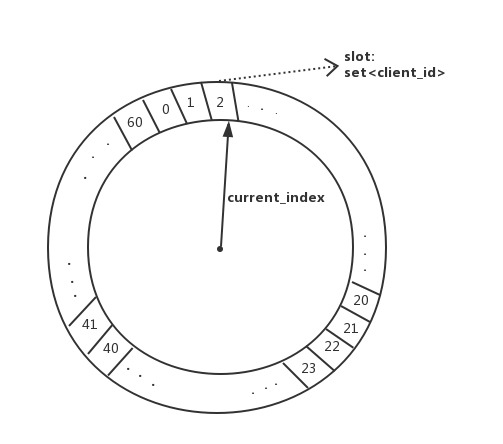

> ```
>                 图19 时间轮环形队列示意图
> ```

执行过程为：

1.  启用一个定时器，运行间隔1s，更新current\_index，指向环形队列下一个元素，0->1->2->3...->58->59->60...0；
2.  连接上数据到达时，从map中获取client\_id所在的slot，在slot的set中删除该client\_id；
3.  将client\_id加入到current\_index - 1锁标记的slot中；
4.  更新map中client\_id 为current\_id-1 。** 与a、b两种方案相比，方案c具有如下优势**：

1.  只需要一个定时器，运行间隔1s，CPU消耗非常少；
2.  current\_index 所标记的slot中的set不为空时，set中的所有client\_id对应的客户端均认为下线，即批量超时。

上面描述的时间轮处理方式会存在1s以内的误差，若考虑实时性，可以提高定时器的运行间隔，另外该方案可以根据实际业务需求扩展到应用中。我们对Swoole的修改中，包括对定时器进行了重构，其中超时定时器采用的就是如上所描述的时间轮方案，并且精度可控。
