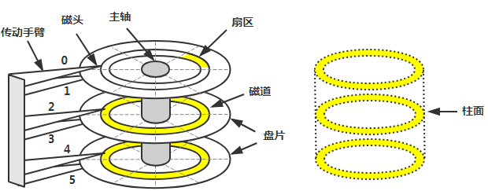
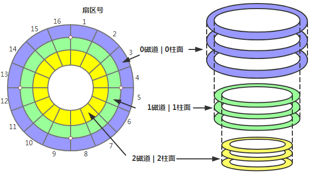
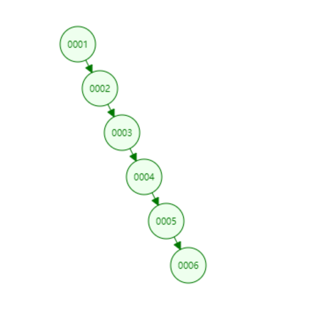
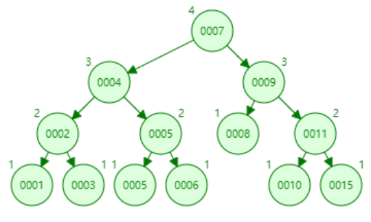
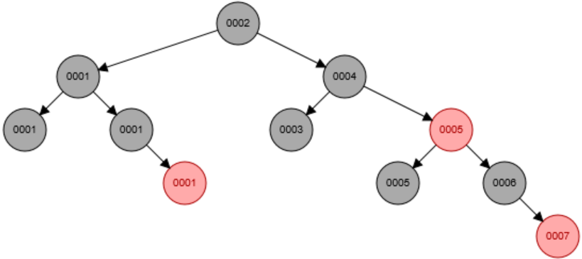
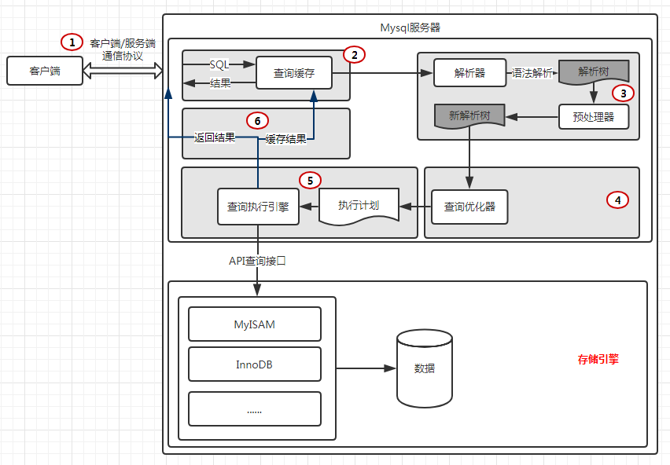

# 彻底理解 MySQL 的索引机制

每当我们遇到数据库查询耗时过长，总会第一时间想到，在经常使用的条件上添加索引。我们知道索引会帮我们更快地查询到想要的数据，但是我们真的清楚究竟什么是索引，为什么索引能帮我们将查询时间缩短十倍百倍甚至更多吗？接下来请大家根据下文，一起深入索引的世界吧。

## 从磁盘上获取数据，讲究在哪儿消耗了时间？

\*\*什么是磁盘 IO？\*\*磁盘读取数据靠的是机械运动，一般来说，一次读取数据的时间 = 寻道时间 + 旋转延迟 + 传输时间。



**名词解释**

- **寻道时间**：磁头移动到指定磁道所需要的时间，主流磁盘一般在 5ms 以下，平均 3-15ms。
- **旋转延迟**：指盘片旋转将请求数据所在的扇区移动到读写磁盘下方所需要的时间。磁盘转速，比如一个磁盘 7200 转，表示每分钟能转 7200 次，也就是说 1 秒钟能转 120 次，旋转延迟就是 1/120/2 = 4.17ms。
- \*\*传输时间 **：从磁盘读出或将数据写入磁盘的时间，一般在零点几毫秒，远远小于前面消耗的时间，几乎可以忽略不计。** 什么是预读？\*\*因为磁盘 IO 是非常昂贵的操作，所以计算机系统对此做了一些优化，当一次 IO 时，不光把当前磁盘地址的数据，而是把相邻的数据也都读取到内存缓冲区内，因为局部预读性原理告诉我们，当计算机访问一个地址的数据的时候，与其相邻的数据也会很快被访问到，所以每次读取页的整数倍（通常一个节点就是一页）。

## 什么是索引，索引的数据结构为何选择 B+Tree？

**定义**> 索引是帮助 MySQL 高效获取数据的数据结构。总结一下，索引是一种排好序的数据结构。（引用自：[http://blog.csdn.net/zq602316498/article/details/39323803](http://blog.csdn.net/zq602316498/article/details/39323803)）

索引存储在文件里，如下图所示（针对 InnoDB 而言）：


InnoDB 的索引和数据都存放在同一文件中，而 MyIsAm 的索引和数据分别存放在不同的文件中。

我们知道，MySQL 的 InnoDB 引擎下的索引数据结构为 B+tree 和 hash，为什么在这么多数据结构中会选择 B+tree 和 hash 呢？**首先我们先来了解一下以下四种数据结构**（不会详细分析，毕竟主题是 MySQL 索引）。

**1. 二叉树** 特征：要保证父节点大于左子结点，小于右子节点。极端情况下会产生如下所示的树：



**2.平衡二叉树（AVL）** 特征：它或者是一颗空树，或者具有以下性质的二叉排序树：它的左子树和右子树的深度之差 (平衡因子) 的绝对值不超过 1，且它的左子树和右子树都是一颗平衡二叉树。



随着数据的不断增加，虽然平衡二叉树在二叉树的基础上做了优化，但是树的高度还是会增加并且不可控。

**3. 红黑树** 特征：红黑树，Red-Black Tree 「RBT」是一个自平衡 (不是绝对的平衡) 的二叉查找树 (BST)，树上的每个节点都遵循下面的规则：

- 每个节点都有红色或黑色
- 树的根始终是黑色的
- 没有两个相邻的红色节点（红色节点不能有红色父节点或红色子节点， 并没有说不能出现连续的黑色节点）
- 从节点（包括根）到其任何后代 NULL 节点（叶子结点下方挂的两个空节点，并且认为他们是黑色的）的每条路径都具有相同数量的黑色节点



和平衡二叉树一样，在数据量很大的情况下，红黑树也无法保证树的高度。

**4.B树** 特征（参考《数据结构》） ：

- 树中的每个结点最多含有 m 个孩子；
- 除了根结点和叶子结点，其他结点至少有 \[**ceil(m/2)（代表是取上限的函数）**\] 个孩子
- 若根结点不是叶子结点时，则至少有两个孩子（除了没有孩子的根结点）
- 所有的叶子结点都出现在同一层中，叶子结点不包含任何关键字信息

一颗 m=3 阶的 B 树如下所示：


B-tree 又做了优化，可以在磁盘容量允许的情况可控树的高度。

但是，B-tree 每个节点都保存了数据，因此在每一个磁盘页中所能存放的节点数就变得少了，而 B+tree 的中间节点不保存数据，所以磁盘页能容纳更多节点元素，更“矮胖”，将高度降得越低。

一个 m 阶 B+ 树的性质（和 B 树有一些共同点，但是 B+ 树具备一些新的特性）：

1. 有 K 个子树的根节点和中间节点包含 K 个元素（B 树种是 K-1 个元素），每个元素不保存数据，只用来索引，所有的数据都保存在叶子节点上
1. 所有的叶子节点包含了所有的元素的信息，且所有的叶子节点根据元素的大小从小到大组成一个链表
1. 根节点以及所有的中间节点同时在于子节点，在子节点中是最大（或最小）元素

下图是一个 3 阶 B+ 树：


## B+ Tree 的优点

查询单个元素：

- B+ 树中间节点不存储数据，因此同样大小的磁盘页可以存储更多的元素，当数据量相同的时候，B+ 树要比 B 树更加“矮胖”，因此 IO 次数更少
- B 树查询时只要找到匹配的元素即可，性能不稳定（最好情况是查找根节点，最坏情况是查找叶子节点）。B+ 树查询必须最终查找到叶子节点（元素数据都在叶子节点中），因此 B+ 树每次查找都是稳定的。

范围查询：

- B 树范围查询需要进行中序遍历，B+ 树只需要在叶子节点组成的链表上遍历即可，比 B 树要简单很多。

从文首可知，从 MySQL 获取数据消耗的时间主要是 IO 操作消耗的时间，因此减少 IO 操作次数，才能缩短获取数据需要的时间，而一般获取数据需要操作的 IO 次数等于树的高度，所以减少树的高度，也就是减少 IO 次数，从而达到减少获取数据消耗的时间。

此时，假如我们要查询索引为 35 的数据：

1. 第一步：65>50 所以进入左边节点
1. 第二步：发现 65 在节点中，获取到 65 的索引
1. 第三步：通过索引直接定位到叶子节点上的数据

结论：我们只通过三次 IO 操作就获取到 65 的数据，大大的节省 IO 操作的时间，这在大数据量的情况下，节省的时间更加不可想象。

**为什么要选择 B+ 树 **此时我们的心里的流程是这样的：如何减少获取数据的时间 —-> 减少 IO 操作 ——> 如何减少 IO 操作 —> 减少树的高度 —> 什么树能稳定的可控树的高度 —>（B 树和 B+ 树）—> 那为什么选择 B+ 树 —–> 因为 B+ 树节点不保存全部数据，因此在一页（一个节点）上能够存更加多的索引数据，让树的高度更低。** 还有一点很重要： **对于组合索引，B+tree 索引是按照索引列名 (从左到右的顺序) 进行顺序排序的，因此可以将随机 IO 转换为顺序 IO 提升 IO 效率；并且可以支持 order by/group 等排序需求；适合范围查询。** 另外 **MySQL 还支持 Hash 索引，但是 Hash 索引只能** 自适应**，也就是说不能由我们手动指定，只能在优化器阶段，由优化器自主优化是使用 B+tree 还是 Hash 结构的索引，因此 Hash 在此就不赘述了。

## 如何创建高性能索引？

- **1. 最左前缀匹配原则** 特性解释：

> 当 B+ 树的数据项是复合的数据结构，比如（name、age、sex）的时候，B+ 数是按照 **从左到右的顺序 **来建立搜索树的，比如当**(张三,20,F)** 这样的数据来检索的时候，B+ 树会优先比较 name 来确定下一步的所搜方向，如果 name 相同再依次比较 age 和 sex，最后得到检索的数据；但当 (20,F) 这样的没有 name 的数据来的时候，B+ 树就不知道下一步该查哪个节点，因为建立搜索树的时候 name 就是第一个比较因子，必须要先根据 name 来搜索才能知道下一步去哪里查询。比如当 (张三,F) 这样的数据来检索时，B+ 树可以用 name 来指定搜索方向，但下一个字段 age 的缺失，所以只能把名字等于张三的数据都找到，然后再匹配性别是 F 的数据了，这个是非常重要的性质，即索引的最左匹配特性。（ 引用自：[https://tech.meituan.com/mysql-index.html](https://tech.meituan.com/mysql-index.html)）**通过实例来看**创建表，并建立组合索引：


上述 SQL 可以使用到 (name,age,sex) 这个索引。


上述 SQL 可以使用到 (name,age,sex) 这个索引中的 name，因为缺少 age，所以也无法使用到 sex。


上述 SQL 无法使用到 (name,age,sex) 这个索引，因为缺少最左列 name，违反了最左前缀原则。

- **2. 选择区分度高的列作为索引**

通过

```sql
select count(Distinct columnName)/count(*) from Table
```

获取这个列在表中的度，度的值范围在 (0,1\]，度越大越好，主键索引的度为 1，一般来说，我们将度越大的列放在组合索引越左的位置上，以便于最快的速度过滤掉无效的数据。

度的值很难确定，一般需要 join 的字段我们都要求是 0.1 以上，即平均 1 条扫描 10 条记录。

- **3. 前缀索引** 如何创建前缀索引：

```sql
ALTER TABLE person ADD KEY(name(7));
```

前缀索引是针对大类型字段，比如 varchar、text、blob，如果使用这样的列做索引的话，会很消耗内存资源，而且大而慢。而且 MySQL 不允许索引这些列的完整长度。**那么我们如何解决此类索引问题呢？**

通常我们可以选择索引开始的部分字符，这样可以大大的节约索引空间，从而提高索引效率，但这样会降低索引的度。

那么我们如何选择前缀，使得前缀的度接近于完成列的度，而且前缀又能足够短（以便节约索引空间）。

```sql
//获取完整列的度 A
SELECT COUNT(*) cnt,name FROM person GROUP BY name ORDER BY cnt DESC;
//获取前N个字符的列的度 B
SELECT COUNT(*) cnt,LEFT(name,N) name FROM person GROUP BY name ORDER BY cnt DESC;
```

当 B 接近于 A 的时候，N 即为该大字段所要设置的字符长度。

前缀索引：

```sql
ALTER TABLE person ADD KEY (name (N));
```

前缀索引的缺点：无法使用前缀索引做 ORDER BY 和 GRUOP BY，也无法使用前缀索引做覆盖索引。

- **4. 索引列不能参与计算**

上述 SQL 无法使用到 (name,age,sex) 这个索引，因为 name 参与了计算，所以导致整个索引都无法使用。**5. 尽量的扩展索引，不要新建索引**索引的数目不是越多越好。每个索引都需要占用磁盘空间，索引越多，需要的磁盘空间就越大。修改表时，对索引的重构和更新很麻烦。越多的索引，会使更新表变得很浪费时间。

比如：表中已经有 name 的索引，现在要加 (name,age) 的索引，那么只需要修改原来的索引即可**6. 重复索引和冗余索引**重复索引：相同列上按照相同顺序创建的相同类型的索引。

冗余索引：已有索引 (name,age)，现在 创建索引 (name) 就是一个冗余索引，因为，索引 (name) 完全可以被 (name,age) 替代。然而 (name,age)、(age) 并不是 (name,age) 的冗余索引。

另外当 Id 列是主键，(name,Id) 是冗余索引，因为二级缓存的叶子节点包含了主键值。直接使用 (name) 作为索引即可。

## 如何进行慢查询优化？

> 首先我们来看下一个 SQL 的执行过程：



接下来为大家介绍一个慢查询优化神器——explain 命令。

explain 命令大家应该都很熟悉，具体使用说明大家可以参照官网 [explain 官网](https://dev.mysql.com/doc/refman/5.5/en/explain-output.html)。

然后为大家介绍慢查询优化基本步骤：

1. 设置 SQL_NO_CACHE 后，查看 SQL 是否真的很慢
1. 使用 explain 命令来查询 MySQL 的查询计划
1. 了解业务的使用场景
1. （通过上面创建索引的规则）添加索引
1. 分解关联查询
1. 优化 limit 分页
1. 优化表结构

## 写高性能 SQL，需要注意什么？

**1. SQL 语句中 IN 包含的值不应过多** MySQL 对于 IN 做了相应的优化，即将 IN 中的常量全部存储在一个数组里面，而且这个数组是排好序的。但是如果数值较多，产生的消耗也是比较大的。再例如：`select id from table_name where num in (1,2,3)` 对于连续的数值，能用 between 就不要用 in 了；再或者使用连接来替换。

**2. SELECT 语句尽量使用具体列代替** `SELECT *` 增加很多不必要的消耗（CPU、IO、内存、网络带宽）；增加了使用覆盖索引的可能性；当表结构发生改变时，前断也需要更新。所以要求直接在 select 后面接上字段名。

**3. 当能确定查询 n 条数据的时候（n 不宜过大），使用 limit n** 这是为了使 EXPLAIN 中 type 列达到 const 类型。

**4.count()** count() 函数有两种含义：统计行数、统计列数。

比如：count(\*) 代表统计的行数；count(talbe.cloumn) 代表统计的是这个列不为 null 的数量。

**5.Union** 需要将 where、order by、limit 这些限制放入到每个子查询，才能重分提升效率。另外如非必须，尽量使用 Union all，因为 union 会给每个子查询的临时表加入 distinct，对每个临时表做唯一性检查，效率较差。

**6.关联查询优化** :

1. 确保 ON 和 USING 字句中的列上有索引
1. 确保任何的 GROUP BY 和 ORDER BY 中的表达式只涉及到一个表中的列，这样 MySQL 才有可能使用索引来优化。

**7. 区分 in 和 exists， not in 和 not exists** in 和 exists 主要是造成了驱动顺序的改变（这是性能变化的关键），如果是 exists，那么以外层表为驱动表，先被访问，如果是 IN，那么先执行子查询。所以 IN 适合于外表大而内表小的情况；EXISTS 适合于外表小而内表大的情况。

关于 not in 和 not exists，推荐使用 not exists，不仅仅是效率问题，not in 可能存在逻辑问题。

**8. 不建议使用 % 前缀模糊查询** Like "% name" 或者 LIKE "% name%"，这种查询会导致索引失效而进行全表扫描。但是可以使用 LIKE "name%"。

**9. 避免在 where 子句中对字段进行 null 值判断** 对于 null 的判断会导致引擎放弃使用索引而进行全表扫描。

**10. 分段查询** 在一些查询中，可能一些查询的时间范围过大，造成查询缓慢。主要的原因是扫描行数过多。这个时候可以通过程序，分段进行查询，循环遍历，将结果合并处理进行展示。这些优化手段只是诸多优化手段里面的很少的几种，漫漫优化路，还是需要我们在以后的实战中，慢慢积累。

## 总结

本文从数据结构层面深入剖析了索引，解释为什么在众多数据结构中选择了 B+ 树，以及如何创建高性能的索引，并例举了许多大家平时开发中时常遇到的 MySQL 优化案例，希望能给大家带来帮助。
