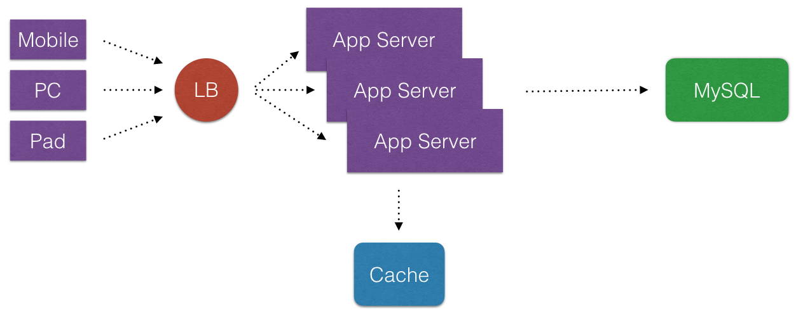
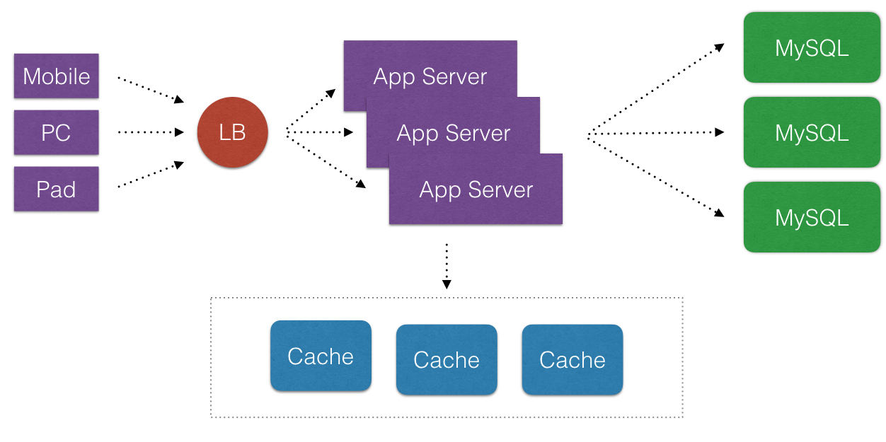
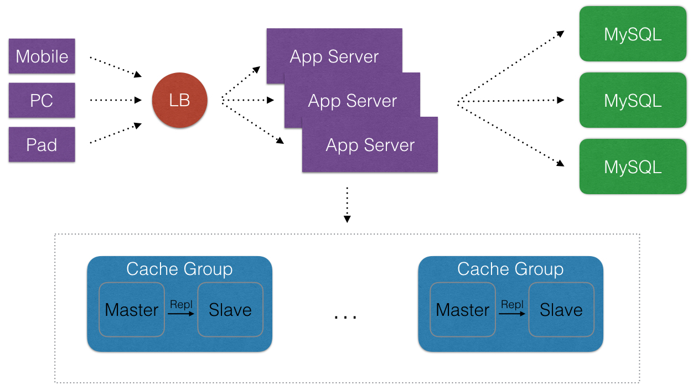

# 深入浅出Cache

## ① 什么是Cache? Cache的目标?

- 在说这个之前我们先看下典型Web 2.0的一些架构演变(这里不用”演进”). 从简单的到复杂的通用架构.
- 首先, 诚然说Cache在互联网公司里,是一个好东西. Cache化,可以显著地提高应用程序的性能和便于提供应用程序的伸缩性(可以消除不必要请求落到外在的不频繁改变数据的DataSource上). 那么Cache化目的非常明显, 就是有且只有一个: 提高应用程序的性能.
- 再者, Cache化, 以in-memory为组织形式, 作为外部的持久化系统的数据的副本(可能数据结构不同), 仅仅为了提高性能. 那么Cache化的数据应当是短暂停留在Distributed Cache中 — 它们可能(可以)随时的消失(即使断电不保证立马就有数据-这一点类似CPU的L1/L2 Cache), 那么应用在用到Cache时候仅当Cache系统可用时候使用不应当完全依赖于Cache数据 — 就是说在Distributed Cache中个别的Cache实例失效,那么DataSource(持久化)可以临时性完成数据被访问的工作.
- 最后, 我们可以假定如果各种DataSource自有的系统性能非常高, 那么Cache所能解决的领域就变得非常的少.

## ② Caching住哪些内容?

- 能够提高系统整体命中率+提高性能的一切数据, 均放入Distributed Cache是非常合适的.

## ③ 我们想要的Cache产品

从上面的目标和定位推理看一款Cache产品应当满足以下需求(不仅仅有):

- 极致的性能, 表现在极低的延迟, 甚至从ms到us响应
- 极高的吞吐量, 可以应对大促/大流量业务场景
- 良好的扩展性, 方便扩容, 具备基本的分布式特点而不是单机
- 在扩容/缩容的时候, 已有的节点影响(发生迁移)的成本尽可能低
- 节点的基本的高可用(或者部署上可以没有)
- 基本的监控, 进程级别和实例级别等都有关键性的指标

## ④ Cache使用方式

说到Cache使用方式, 必不可少的会与数据库(甚至是具备ACID的RDBMS)或者普通存储系统对比.

- 简单的而言. 即使Cache有了持久化, 但市面上的Cache产品(Redis还是其它)都不具备良好的高可靠的持久化特性(无论是RDB还是AOF, 还是AOF+RDB), 持久化的可靠性都不如MySQL. 注:这里不深入Redis原理和源码和OS文件存储内容.

而使用方式有以下三种:

- 懒汉式(读时触发)
- 饥饿式(写时触发)
- 定期刷新

### 懒汉式(读时触发)

这是比较多的场景会使用到. 就是先查询第一数据源里的数据, 然后把相关的数据写入Cache. 以下部分代码:

#### Java (Laziness)

```java
        Jedis cache = new Jedis();
        String inCache = cache.get("100");
        if (null == inCache) {
            JdbcTemplate jdbcTemplate = new JdbcTemplate();
            User user = jdbcTemplate.queryForObject("SELECT UserName, Salary FROM User WHERE ID = 100",
                    new RowMapper<User>() {
                        @Override
                        public User mapRow(ResultSet rs, int rowNum) throws SQLException {
                            return null;
                        }
                    });
            if (null != user) {
                cache.set(String.valueOf(user.getId()), user.toString()); // 可以异步
            }
            cache.close();
        }
```

##### 好处和坏处

- 不太好的是: 大多数的数据可能不再被高频度访问. 如果第一次访问不命中就有另外多余的副作用.
- 比较好的是: 保证数据在Cache里. 适用于大多数的场景.

### 饥饿式(写时触发)

#### Java (Impatience)

```java
        User user = new User();
        JdbcTemplate jdbcTemplate = new JdbcTemplate();
        int affectedRows = jdbcTemplate.update("UPDATE User SET Phone = ? WHERE ID = 100 LIMIT 1",
                new Object[] { 198 });
        cache.set(String.valueOf(user.getId()), user.toString()); // 可以异步
```

##### 好处和坏处

- 比较好的是: 这种写比例不高数据, 能保证数据比较新.

### 分析下重要的几条, 关于"懒汉式"和"饥饿式"

- 饥饿式总保持数据较新
- 分别存在了写失误/读失误
- 单一方式的使用都将使Miss概率增加

以上两种各有优缺点, 因此我们将两种结合一下(追加一个TTL):

#### Java (Combo : Laziness && Impatience)

```plaintext
cache.setex(String.valueOf(user.getId()), 300, user.toString()); // TTL, 可以异步
```

### 定期刷新

常见场景, 有如下几点

- 周期性的跑数据的任务
- 适合Top-N列表数据
- 适合不要求绝对实时性数据
- …

## ⑤ 对于总体系统的提高

以下看看命中率如何影响总体系统? 为了简化公式计算, 以下做一些假定.

- 场景一: 我们假定, HTTP QPS 有 10,000, 没有使用Cache(变相地假定Miss100%), RDBMS是读 3 ms/query , Cache是 1 ms/query. 那么理想下10,000个Query总耗时: 3 ms/query *10,000query = 30,000 ms 如果我们用了以上2者结合的方式 假定是 90% 命中率, 那么理想下10,000个Query总耗时: 3 ms/query* 1,000query + 1 ms/query *9,000query = 12,000 ms. 假定是 70% 命中率, 那么理想下10,000个Query总耗时: 3 ms/query* 3,000 query + 1 ms/query * 7,000query = 16,000 ms.
- 场景二: 我们假定, HTTP QPS 有 10,000, 没有使用Cache(变相地假定Miss100%), RDBMS是 读:写 是 8 : 2 . 读 3 ms/query, 写 5 ms / query, Cache是 1 ms/query. 那么理想下10,000个Query总耗时: 3 ms / query *8,000 query + 5 ms / query* 2000 query = 34,000 ms . 如果我们用了以上2者结合的方式, 假定新数据写入后才有读的操作, 那么命中率可能为100%, 那么理想下10,000个Query总耗时: 1 ms/query *8,000query + 5 ms/query* 2000 query = 18,000 ms. 差一些命中率可能为90%, 那么理想下10,000个Query总耗时: 1 ms/query *( 8,000query_90%) + 3 ms/query* ( 8,000query_10%) + 5 ms/query *2000 query = 19,600 ms. 再差一些命中率可能为70%, 那么理想下10,000个Query总耗时: 1 ms/query* ( 8,000query_70%) + 3 ms/query *( 8,000query_30%) + 5 ms/query* 2000 query = 22,800 ms. 可以看到 22,800ms / 19,600ms = 117%, 那么有17%的性能损失.

以下看看Cache高可用下如何影响总体系统? 为了简化公式计算. 我们假定Cache依然是提高性能使用, 就是说数据源不是Cache层的.

- 场景一: 如上Web2.0架构里, 访问Cache一层, 和访问MySQL一层. 在压力可接受的情况下. 假定Cache集群可用性是99%, MySQL可用性是99%. 即使集群里挂了一个Cache实例, 那么总体系统的可用性: ( 1 - (1-99%)_(1-99%) ) = 99.99% .假定Cache集群可用性是99%, 共有10个实例. MySQL可用性是98%, MySQL可以承受3个Cache实例带来的压力, 即使集群里挂了两个Cache实例, 那么总体系统的可用性: ( 1 - (1-99%)_(1-99%)\*(1-98%) ) = 99.9998%
- 场景二: 访问Cache一层, 但因为某种因素不再访问MySQL一层. 那么总体系统的可用性: ( 1 - 1% - 1% ) = 98%
- 场景三: 不算Web2.0的架构里, 访问Cache一层, 和访问MySQL一层, 和不访问MySQL一层, 那么总体系统的可用性是多少呢? — 答案留给读者 对比场景一和场景二, 在增加正常的系统处理下(就是多几行代码), 我们就可以提高极大的总体系统的可用性.
- (这里声明下: 任何一个系统,不可能有100%的可用性, 包括Google也一样, 我们能做的就是多做几个9的可用性)

## ⑥ 关于Sharding

算法有以下常见的两种比较:

1. Hashing
1. Consistent Hashing (using virtual nodes)
   - servers = \[‘cache-server1.yuozan.com:6379’, ‘cache-server2.youzan.com:6379’\];
   - server_index = hash(key) % servers.length; server = servers\[server_index;

### 算法描述

- 第一种Hashing方式, 一旦需要扩容一个或者下线一个, 那么会导致大量的keys重分配: = ( old_node_count/new_node_count ), 就是说3台server扩充到4台server时候, 3/4 = 75%的keys都受到影响.
- 第二种Consistent Hashing方式, 一旦需要扩容一个或者下线一个, 那么仅有将近( 1 - (old_node_count/new_node_count) ) 比例的keys受到影响, 就是说3台server扩充到4台server时候, (1 - 3/4) = 25%的keys都受到影响. 这样相比上一种受到的影响降低了50%. 这将是更好的方式.

##### Consistent Hashing简化算法流程的描述

1. 将keys和servers都进行看成一个ring(常被称为 continuum)
1. 将keys和servers的hash值分隔成多个的slots
1. 将servers的virtual nodes按照顺时针顺序分别映射到slots上
1. 将key进行hash按照顺时针顺序查找最近的一个virtual node

## ⑦ Cache痛点和关注点

公司以前业务刚起来, 用的Redis当作Cache, 大家知道Redis是单机版本-没有Sharding. 由于业务起来, 单机版本对于某个业务来说, 一旦扩容或是挂了那个业务的所有流量都挂了, 当时只做到了垂直分片(Vertical Partition), 而为了快速解决这一问题, 我们必须引入DistributedCache, 希望它简单的好(因为我们只用来做Cache), 甚至目标都不想让Redis做持久化数据.

## ⑧ 我们用的Cache的产品

2015年为了业务技术改造, 并能快速的上线. 我们调查了Twemproxy Codis. 考虑到我们技术投入. 同时对Codis做了相应的测试, 最终使用Codis作为Cache的产品来使用. (性能可以看看Codis官方的对比) 另外我们结合自己PHP的业务需要, 做了PHP和本地部署Proxy的方式来基准测试. Codis提供的扩容时的迁移采用了向新老的Server双写的模式, 在迁移数据到达了100%的量时候会有一定的极短的锁时间(这有优势也有劣势), 我们和Redis官方一样不建议开启AOF. 从目前一年多的使用和运维经验看, Codis已经满足我们当下的业务需求. 对于双11等类似的大促峰值, 我们可以看到Codis单纯当作Cache来使用的可靠性是比MySQL高的, 也就是说: 如果假定在高峰值下, 即便是Cache会挂了, 并将流量打到了MySQL集群上, 那么对于外网的业务而言系统一样是不可用的. 那么只要保证不出现Cache整个集群挂了-只要保证一两个实例(极点比例)挂了, 那么流量分散到MySQL集群上后大促业务依旧保持可用.

## ⑨ 我们的一些实践

- 着重在Codis-Server上的Redis配置, 在运维上尽可能提高Server一侧的性能: 绑定单核至每个Redis进程 + 去除持久化(目标: 无Slave节点) + 每个Server进程实例的内存大小尽可能的小(控制在2.5GiB以内)
- 针对PHP-FPM模式下, 用Codis-Proxy当做PHP的LocalAgent直接部署同机上: 提高稳定性 + 降低延迟(Latency)
- 我们针对Namespace多业务共用集群问题: 按照约定取不用的业务/应用名称. 另外共用集群在sharding情况下带来的实例级别的复用带来的命中率变化和sharding均衡性变化, 感兴趣的读者可以自行计算下
