网易严选怎么做全链路监控的？
==============

### 引言

严选全链路基建从 2018 年就开始了，2019 年又对多端进行了补充，今年再做完大前端部分的链路就实现了全端全链路的覆盖。我有幸参与了整个建设过程，并作为大前端部分的负责人设计和完成了大前端部分的链路建设。

那么问题来了：

1. 数据是怎么收集的？
2. 数据是怎么上报的？
3. 数据是怎么可视化的？
4. SDK 怎么实现的多端兼容？

最后还会分享些做 SDK 的心得和对 APM 的一些展望。

### 1\. 项目背景

企业在成长到一定程度以后都会对技术基建产生要求，这时候一般有两种路子可以走，购置大厂基建资源，另一种就是发挥技术团队的“余晖”，结合开源资源开发一套与企业业务域契合度比较高的自建方案。一旦走了第一条路子，就 kill 了大部分程序猿的 KPI，同时也保护了他们为数不多的头发。

无论采用哪种方式，需要解决的问题会随着业务体量的增加逐渐明显。

* 挂了的网络请求从前端发出去，通过网关，转发到后端的 Java/Python/Node 服务中，到底落到哪个节点了？
* 线上环境中出现了偶发性的报错，傲娇的程序猿一定会说，”这玩意不能复现，就修不了的啊？”
* 技术团队热火朝天的搞了个性能优化专题，最后拿了一波理论数字来唬人，“你们”的那些截图我怎么就那么不信呢，数据呢？
* 项目完结了，我们引入了高大上的复盘的机制，复盘会胜利转型甩锅大会，复盘的时候数据哪里来？
* 老板忽然说，我想要个“大屏”，嗯，越美越好
* 我们有监控的，前端小哥也“实现”了一个 SDK 的收集上报，可，当需要支持小程序的时候，他离职了
* 老板又出现了，拿着他二舅姥爷三姨夫初中同学小舅子的手机来，说，”你看，我们的 H5 为什么挂了？最重要的 Banner 图没出来，啊？”

展开了聊的话，我相信你们故事比我还多，那我们需要的是什么呢？

> 实时全端全栈全链路性能异常监控系统

比较拗口，因为是我刚创造出来了，一般我们把这份基建项目称作 APM，他的系统架构图基本是这样的。

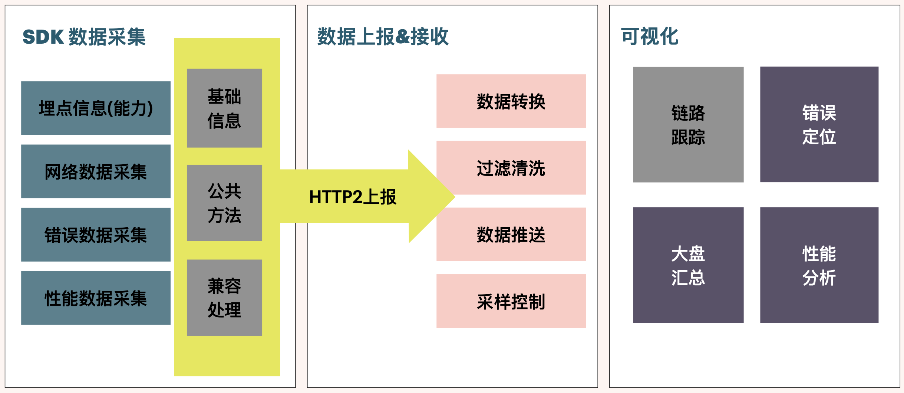

剩下的时间，我们掰开了，揉碎了，细细表一表。

### 2\. 数据收集

数据收集是 SDK 的主要功能，SDK 从加载到页面的那一刻到从页面离开之前都一直在扮演一个看门狗的角色，不断收集前端发生的各种事故，实时的上报到后端，以此实现我们的监控目标。那 SDK 主要帮我们收集了什么信息，又怎么收集的呢？

#### 2.1 收集什么数据？

SDK 想要收集什么数据，是由你的业务场景决定的：

* 需要针对页面性能进行优化或者查看已有的主要页面的性能，那么，需要收集 performance.timing 的信息
* 需要监控网络请求链路，那么，需要在网络请求中添加链路标记（TraceID）
* 需要收集错误数据，那么，需要监听 error/uncatchexception 事件，为了复现错误当时的情况，有时还需要收集用户当时的操作
* 如果想要支持一点埋点能力，则需要提供基本的 API 给用户，也可以提供基本的 PV/UV 数据
* 需要支持小程序（wx/dd/my/alipay/……）怎么办？重新各端去写一套？显然不用，兼容方案做起来
* 需要……

> 大姐，你这么想要，钱付了么。我们也是有底线的，虽然我们名字很长（实时全端全栈全链路性能异常监控系统），但也不是啥都要支持。向我提需求之前，先想想好自己到底想要什么 :p

#### 2.2 性能数据

说到性能数据，不得不提 W3C 给我们的 performance.timing 了，这玩意是个好东西。官方图拿来凑字数。

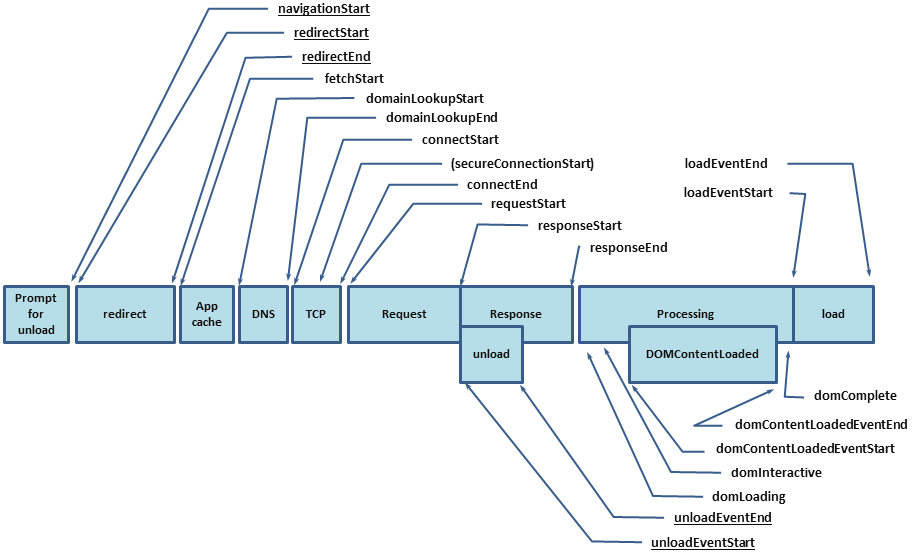

这张图并不是我们实际的每一次请求的耗时，而是一个页面在加载完成前的不同阶段，而且并不是所有的阶段都会发生。通过我们项目总结，将得到的这些数据分成两大类：

第一类，就是网页的“基础耗时类指标”，简单说，这类指标没啥用，大概看看有这么个东西就行了，这玩意主要用来做可视化的瀑布图，看起来比较酷炫而已。

字段

描述

计算方式

备注

DNS

DNS 查询耗时

domainLookupEnd - domainLookupStart

\-

TCP

TCP 连接耗时

connectEnd - connectStart

\-

SSL

建立 SSL 安全连接耗时

connectEnd - secureConnectionStart

可用于对比上没上 HTTPS 对你的网站造成了多少影响

TTFB

Time to First Byte，网络请求耗时

responseStart - requestStart

TTFB 的指标计算方式有很多，主要用来看着陆页面的网络响应时间，这么说很抽象啊，下边贴了个图，看一下就知道了

Content Download

数据传输耗时

responseEnd - responseStart

\-

DOM

DOM 解析耗时

domInteractive - responseEnd

\-

RES

资源加载耗时

loadEventStart - domContentLoadedEventEnd

同步加载的资源耗时，这部分往往是可以优化的部分

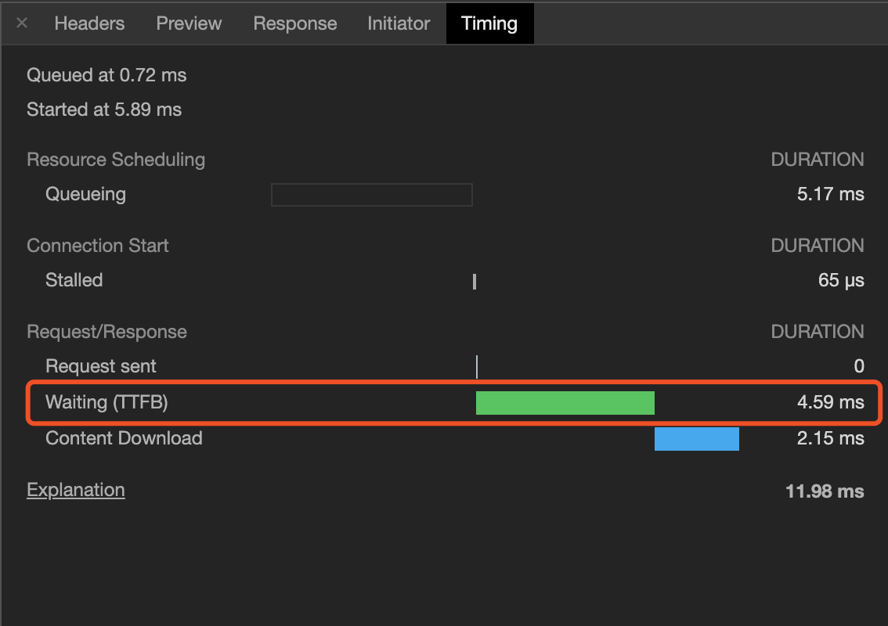

第二类，我把它称作“有用指标”，我们做性能分析，主要关注的就是这几个了。

字段

描述

计算方式

备注

FB

首包时间

responseStart - domainLookupStart

结合 TTFB 可以看出网络请求是否存在问题

FPT

First Paint Time, 首次渲染时间 / 白屏时间

responseEnd - fetchStart

从请求开始到浏览器开始解析第一批 HTML 文档字节的时间差

tti

Time to Interact，首次可交互时间

domInteractive - fetchStart

浏览器完成所有 HTML 解析并且完成 DOM 构建，此时浏览器开始加载资源

ready

HTML 加载完成时间， 即 DOM Ready 时间

domContentLoadEventEnd - fetchStart

如果页面有同步执行的 JS，则同步 JS 执行时间 = ready - tti

load

页面完全加载时间

loadEventStart - fetchStart

load = 首次渲染时间 + DOM 解析耗时 + 同步 JS 执行 + 资源加载耗时

#### 怎么上报的数据很多都是 0 啊，这玩意准不准？

**1\. 资源加载的 Size 为 0？**Size 数据是通过 PerformanceResourceTiming.transferSize 获取的。transferSize 只读属性表示所提取资源的大小（以八位字节表示）。如果是从本地缓存获取资源，或者如果是跨源资源，则该属性返回的值为 0。

> 在 Chrome 浏览器中按 F12 打开开发者工具面板，当 Network 页签上的 Disable cache 未勾选时，transferSize 为 0。
>
> 勾选 Disable cache 后，transferSize 即恢复正常。**2\. 资源加载的 Time 为 0？**Time 数据是通过 PerformanceResourceTiming.duration 获取的。在瀑布图中查看静态资源加载情况时，部分情况下 Time 为 0，是由于该请求命中了缓存，并且是通过 max-age 控制的长缓存。

> 在 Chrome 浏览器中按 F12 打开开发者工具面板，取消勾选 Network 页签上的 Disable cache，刷新页面后即可看到经过网络过程所耗的时间。**3\. 页面性能指标时间为 0？**

查看 API 返回的数据时，如果发现很多返回的时间数据为 0，是因为受同源策略的影响，跨域资源获取的时间点会为 0，主要包括以下属性：redirectStart、redirectEnd、domainLookupStart、domainLookupEnd、connectStart、connectEnd、secureConnectionStart、requestStart、responseStart。

在资源响应头中添加 Timing-Allow-Origin 配置，例如：`Timing-Allow-Origin：*`。

#### 2.3 网络请求数据

网络请求指的是用户从当前系统中发出去的 Fetch/XHR 请求，如何无侵入的获取到这些请求的数据呢？那就需要 HACK 一下这两个方法了。

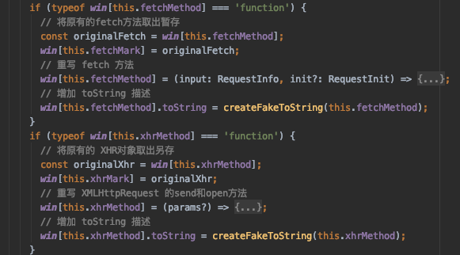

Hack 的步骤大概有以下几步：

1. 把 Windows 中的原生方法另存；
2. 重写原生方法覆盖掉原生的方法，在重写中首先 call 掉原生的方法，保证数据可以直接发送出去；
3. 重写一下 toString 方法。

有了这样的能力，在重写原生方法中我们就可以做很多事情了，比如：

1. 添加链路跟踪头部，x-tracing-id 这种，便于后端将链路串联起来。
2. 添加请求计时，当前请求发出去到接收到请求的正确返回用了多长时间，这个时间我们一般记为网络请求耗时。
3. 添加网络请求快照，可以收集这次请求的 HTTP 请求码，返回的业务 code 等，但一般情况下，SDK 不要收集网络请求数据的返回，因为那有可能涉密，另外，这些数据量不可控，你报上来也没啥用，所以还是不要收集了。
4. 网络请求错误的时候也可以收集到，记录为错误（异常处理）或者网络请求失败（链路跟踪）都可以，我是按照链路跟踪处理的，因为网络请求错误没有堆栈信息，也没有分析代码的价值。

话说回来，我们通过 TraceId，是怎么实现分布式链路跟踪的呢？这里不得不引入一张 Google 的图。

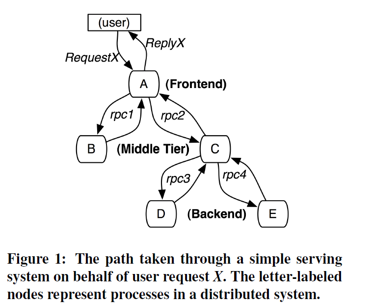

简单说，就是前端打一个标记以后，在后端服务节点传递数据的时候，保留这个头部，同时添加 from/to 的逻辑，来串联请求链路。

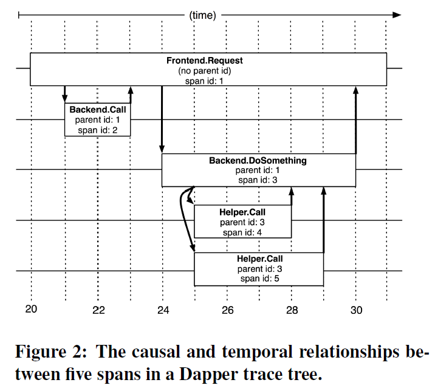

#### 网络请求这玩意你 Hack，你挂了咋整？

危险的代码都需要 `try...catch`，对于 SDK 来讲，只是 try…catch 还不够，还需要做两件事：

1. 恢复 Hack 之前的函数执行
2. 上报 Hack 失败事件，给 SDK 的开发者

#### 2.4 错误数据

错误数据的收集一般情况会通过冒泡机制，监听全局的 error、uncatchedException 两个事件，收集到之后，对错误进行分类，收集错误的堆栈信息进行上报。为了在错误分析的时候能够将错误快速的复现，还需要收集一下错误发生时候用户操作的上下文环境，包括一些浏览器基础信息，网络状况、用户的点击、输入事件（DOM 节点）等等。

#### 我自己 catch 了的错误怎么办？

最佳实践中，我们要求在发起网络请求等异步操作的时候添加 `try...catch`，捕获错误并妥善处理。但这种情况会阻止错误冒泡到全局，SDK 就捕获不到这个错误了。但对于业务层面，我们也没有得到想要的结果，这种情况怎么处理呢？

这种情况，我们提供了主动上报错误的接口给到接入方。

```js
async getLIst(){
    try{
        const {result, pagination } = await axios.get(url, params);
        this.list = result;
        this.pagination = pagination;
    }catch(e){
        toastr.err(e && e.msg || '获取列表失败') // 最佳实践的错误处理
        sdk.report('error', e)  // SDK 提供的错误数据主动上报能力
    }
}
```

当然还有另外一种形式, SDK 重写 error 方法，接入方在 catch 中，使用 console.error(e) 将 error 打印到控制台。

```js
console.prototype.error = function(){
    console.error(arguments);
    sdk.report('error', e)  // SDK 提供的错误数据主动上报能力
}
```

#### 2.5 用户行为数据

用户数据收集的目的是为了复现错误发生时用户的操作轨迹。以 FunDebug 的效果图为例。

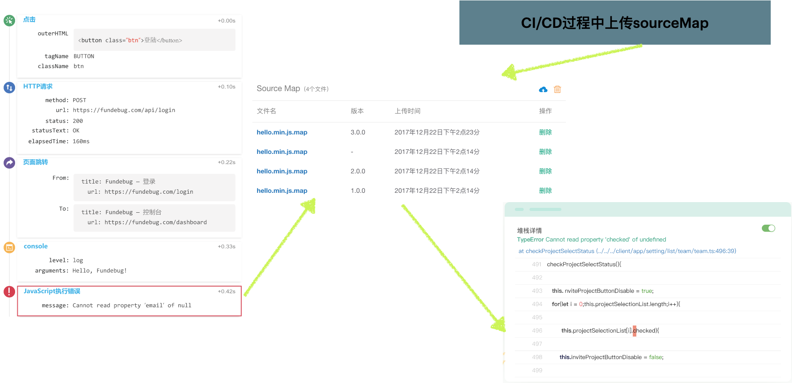

收集用户信息时时刻进行的，这里的收集可以放到 worker 中进行，单独开一个线程处理可以减少对业务的性能损耗。

行为队列是一个固定长度（一般为 5~10 步）的队列，一旦发生错误，则从队列中取出当前内容，并清空队列，将错误信息和队列中的行为信息一同发布到后端。熟悉 HTTP 请求的同学就会发现，这不就是个“滑动窗口”么，对对，就是这个，太专业的！

另外，错误信息需要延迟发送，主要避免什么情况呢，就是重复报错数据的收集。重复报错问题在前端太常见了，一个报错你不管它，相同的操作再来一遍，还报错，再来一遍还是报错。就是这样，但这种场景下我们需要重复收集么，当然不用，只需要记录一下错误发生的次数就行了。

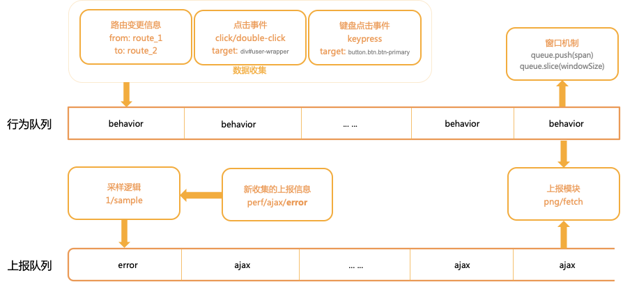

### 3\. 数据上报

数据收集好以后，需要上报到日志收集服务，上报数据的时候就会遇到这么几个问题，数据模型的一致性（便于清洗和聚合），上报的方式和性能，以及自主数据上报能力。

#### 3.1 定义上报模型

上报的数据模型采用了通用的 OpenTracing 模型，结合我厂的一部分业务场景进行了改造。

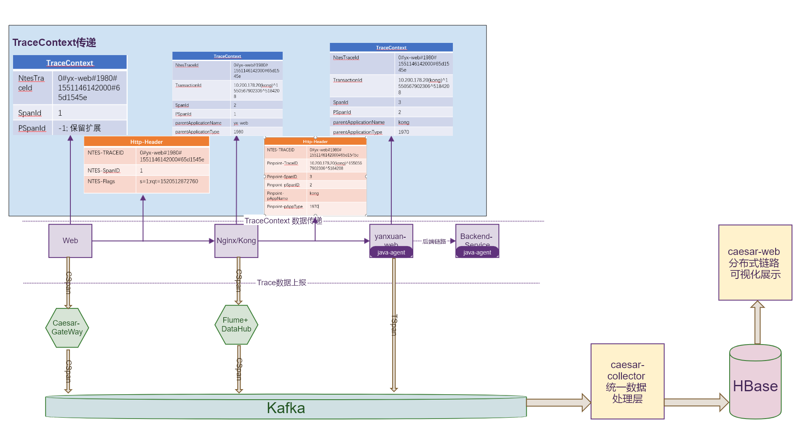

#### 3.2 上报方式

一般上报会采用一个静态文件的形式比如 PNG/GIF 这种，可以规避跨域和异步等待的问题。在我开发 SDK 的时候，我把常见的上报方式都拿出来对比了一下。

* navigator.sendBeacon，兼容性堪忧（no-IE）
* yx.mail.netease.com/a.gif&data\_post，长度受限
* fetch.post(data, {mode: 'no-cors'})， 合并上报
* img.src，hack 方案兼容 fetch 失效的情况
* xhr.post，作为降级兼容方案
* 小程序中使用小程序的 request 方法上报

首先会考虑使用 sendBeacon，毕竟是官方提供的专门用来做 report 的 API，虽然兼容性很挫。

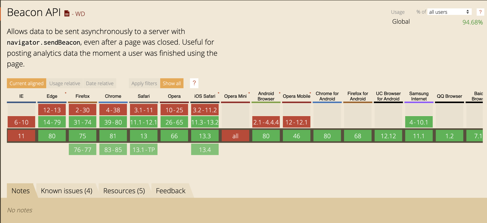

但不影响我们对技术本身的追求嘛。

实在没有，那就得看一下上报数据的长度和方式了。一般情况下上报会分为两种形式。

1. 立即上报
2. 延迟上报

#### 3.2 主动上报组件

主动上报组件跟业务关联度比较高，这里就不详细展开了，其实核心想法还是比较简单。就是在我们不方便去自动收集数据的场景中，由使用者（往往是集团大佬）来主动提供数据场景，并对数据进行脱敏处理（马赛克）通过简单的标识和文字注释，我们可以很容易定位到问题的所在。然后通过上报弹窗的形式，给大佬们更多选择。

* 上报信息多选框
* 用户信息（可选）
* 发送给开发者（可选）
* 上报信息描述输入框
* 通过 dom-to-img 生成的图片，同时提供图片（标注、马赛克、文字、取消、确定）编辑能力

核心截图逻辑可以抽离出来作为 Serverless，Capture as Service。

### 4\. 数据流向

数据从 SDK 收集上报以后，通过 HTTP2 通道将数据发送到 Gateway 进行鉴权和过滤，而后通过 Kafka 通道消费到 Collector 做数据清洗、聚合和存储，最后向 NodeBFF 提供数据，由 NodeBFF 对数据可视化平台提供特性数据接口，最终时间数据可视化展示。

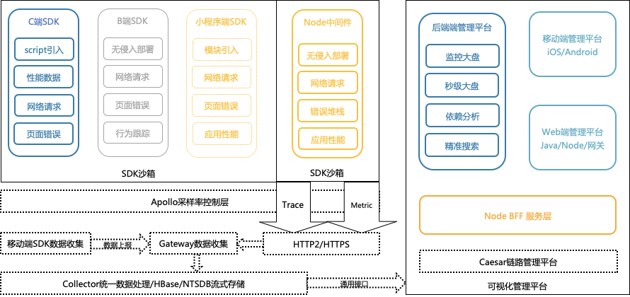

### 5\. 数据可视化

数据上报上来以后，需要对数据进行可视化展示，展示的数据不外乎性能、异常、链路信息。但这些信息的重心却不一样。

#### 5.1 异常信息展示

异常信息的展示分为三层：

1. 应用层面，主要展示当前应用的异常概览，错误总数、错误率、错误类型。
2. 错误列表展示，流水展示收集到的错误信息，每一条展示错误名称、所在页面、错误次数、如果打通了公司的组织架构信息，可以直接在系统中指认当前错误的负责人。同时还可以给错误定级。
3. 错误详情页面，详情页面主要展示错误发生时的页面状况，包括页面基本信息，用户信息，用户行为路径（用户数据上报收集所得）错误堆栈（如果收集了 sourceMap 可以做代码映射）错误自主上报截图（如果用户主动上报了也放到这里）。

我们进行异常和错误分析的时候，往往没法只通过代码就能定位到问题，还需要链路信息的辅助，所以如果错误发生上下文中有链路信息的时候，还可以通过上报的链路 ID，定位到当前错误发生时的网络请求，进而跳转到链路查询页面进行详细定位。

### 6\. SDK 发布

刀耕火种阶段，我们发布 SDK 一般是将 SDK 发布到 CDN，然后让业务方接入以后，通过时间戳查询参数来保障每次接入的都是最新版本。但这种方式存在很多问题。

1. SDK 无法回退
2. 多个 SDK 发布时需要接入多次
3. 区分不同开发环境（测试、线上）时需要进行额外配置，甚至加载不同的 SDK

这些都是让业务方觉得不靠谱的地方 ，那如何解决这个问题呢？


简单说就是造一个壳子，这个壳子可以从 CDN 拉取 script 模板，而这个模板是可以随时通过管理平台进行配置的。对于业务方而言，只需要接入一次盒子（或者通过工程化脚本、CI/CD 过程自动化接入）就可以通过配置来接入 SDK 了。

很不幸的是，当我有这个想法之后，抬头看一下，发现 Google/云音乐的大佬们早就已经做出来这样的东西了。最终还是采用共建的形式，引入了他们的方案。怎么说呢。

> 英雄所见略同。

**遇到了 Script.error 问题？**

当我们接入脚本以后，遇到过这个问题，就是错误收集到的时候，控制台打出了 script.error 问题，这个报错十分诡异，没有堆栈，啥也没有。那为什么会这样呢，其实一艘就有了。

> “Script error.” 有时也被称为跨域错误。当网站请求并执行一个托管在第三方域名下的脚本，就可能抛出 "Script error." 最常见的情况是采用 CDN 托管 JS 资源。
>
> 浏览器只允许同域下的脚本捕获具体的错误信息。

简单的解决方案呢就是在 script 标签中添加 crossorigin 属性，不用给值。 当然这本身是一个跨域问题，需要 cdn 也配置一下头部允许策略 `Access-Control-Allow-Origin: *` 不过放心，现在主流 CDN 经这么做了。

### 7\. 稳定性保障

稳定性保障主要分为三个角度：

1. SDK 的稳定运行、稳定迭代发布
2. 数据上报接口稳定接收数据，扛得住大流量
3. 为其他管理平台数据的稳定性保障能力（上线前的卡点检查能力）

#### 7.1 SDK 稳定

SDK 的稳定是重中之重，你发出去的 SDK 一定不能影响业务的正常运行，否则就万劫不复了，轻松领 P0 级 Bug。那如何保障 SDK 不会出现这种问题呢？

1. 兼容性优雅降级方案
2. 错误容灾能力
3. 动态管控 SDK 的分发，一旦出现问题，可以立刻下线（回退）掉，避免损失

#### 7.2 上报接口稳定性

上报接口一般是由后端提供的高可用服务，自动扩容 + 容灾处理，同时会在上报接口中通过 Appollo 来控制接口的采样，降低运维风险。

#### 7.3 向外输出稳定性保障能力

这里指的是性能卡点能力，其实也简单，就是提供一个接口调用，这个接口中封装的是固定环境下的 Lighthouse 运行时环境，管理平台将需要进行评测的页面地址发送到服务内部，由 Lighthouse 运行后返回当前给定的页面评分。管理平台可以根据这个评分对页面进行卡点（低于 80 分，不允许上线） 这套方案是参考集团内其他小伙伴开发的，我就不在这里赘述了。

### 8\. SDK 开发心得

开发 SDK 是有一段爱恨情仇的，从 0 开始开发，搭建工程化脚手架，到模块化拆分，多端支持持，功能性迭代，踩过了许多坑，印象最深的，莫过于 SDK 的发版落地。

如果你也面临开发 SDK 的任务，我有几个地方跟你唠叨一下。

1. 设计先行，先把要做的事情全盘想好，SDK 没法那么“敏捷”，迭代的版本多会让人觉得不够稳健。优先设计数据模型，结合 TypeScript 可以很方便的组织代码结构。
2. 将代码进行模块化组织，针对不同的端，将可以共用的部分抽离出来（重构一波以后才明白）。
3. 发版之前先想好版本怎么控制，如何更新。
4. 需要暴露使用起来一致的 API 供接入方使用。
5. 尽早收集实际业务方的需求和痛点。
6. 接入过程中要经常进行复盘回访，SDK 接入的咋样，有啥问题没？
7. 文档尽量贴近接入方的使用过程和习惯。

### 9\. 功能展望

APM 现有的能力主要放在了业务层面的性能、异常、错误监控上，收集数据，上报数据，可视化展示数据。除此之外，还能做些啥呢，换句话说：

> 你心中的 APM 应该是个什么样子呢？

我大概做了个脑洞，给这个未来建起来的监控生态取名 hands 取义，上帝之手。你瞧不见他，但他无时不刻不在，当你需要的时候，伸手可得。


功能上，应该有这样一些能力：

* 抽象性能与错误为体验，增加更具表达力的性能模型，赋能体验提升；
* 聚合多端产品，弱化端之间的概念，给接入方提供洞察全局，概览分析的能力；
* 通过前置的性能分析和数据积累，预警可能出现的异常。

### 10\. 后记

本来想要展开的盘子挺大的，但写写发现，要把事情全部讲清楚，能凑够一本书了，恰逢贝壳的陈辰老师出了一本《从零开始搭建前端监控平台》想要深入探讨的，可以先去读一下陈老师这本书，当然也可以凑够 300 人，开个答疑聊天群，我们云聊一下。

最后放一句之前看到的 Slogan，切中就里地说明了监控平台的价值：

> Prepare for the unpredictable.

未雨绸缪。
