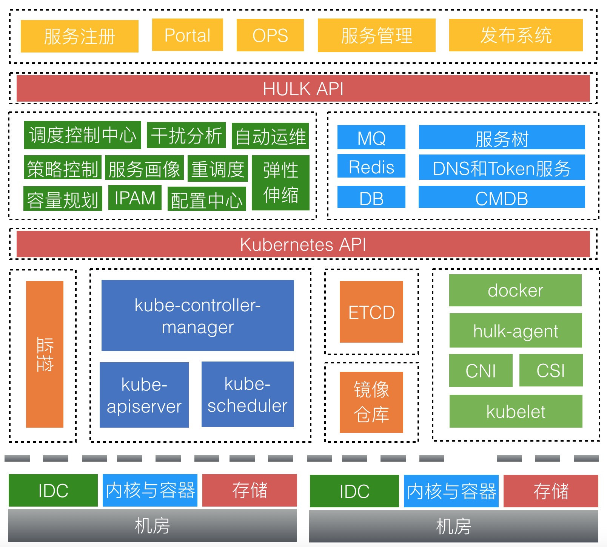
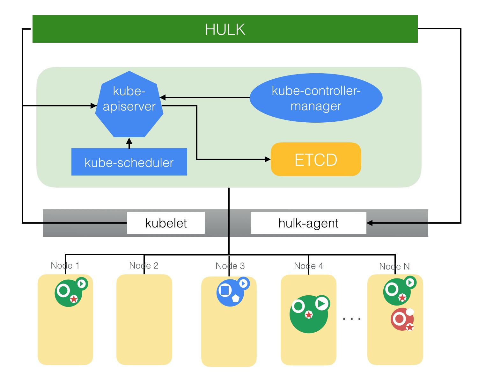
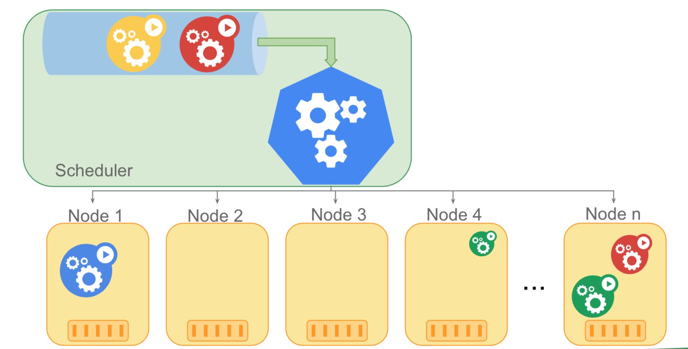
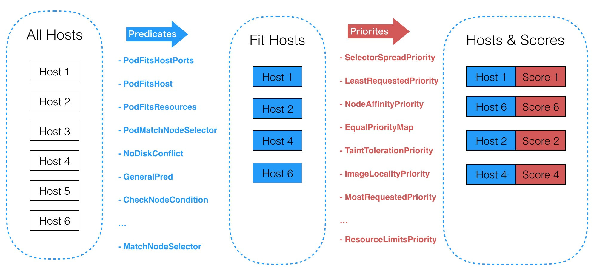
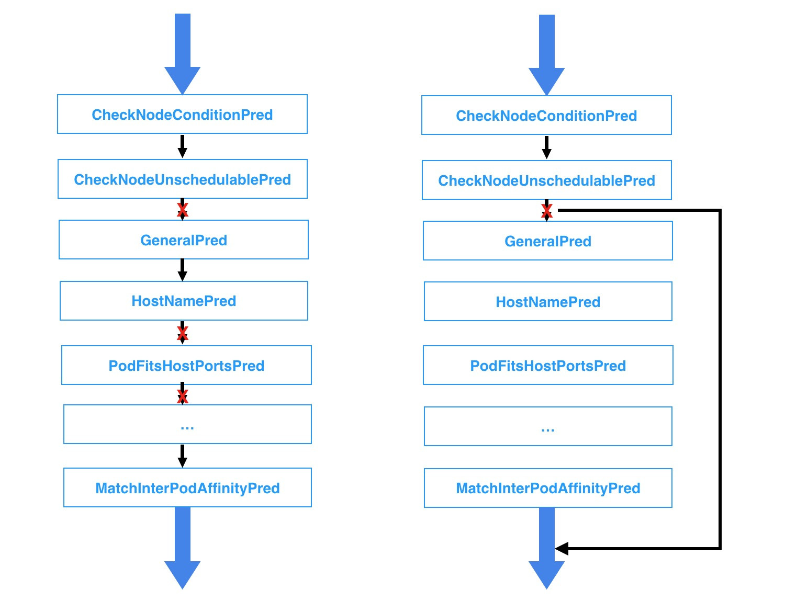
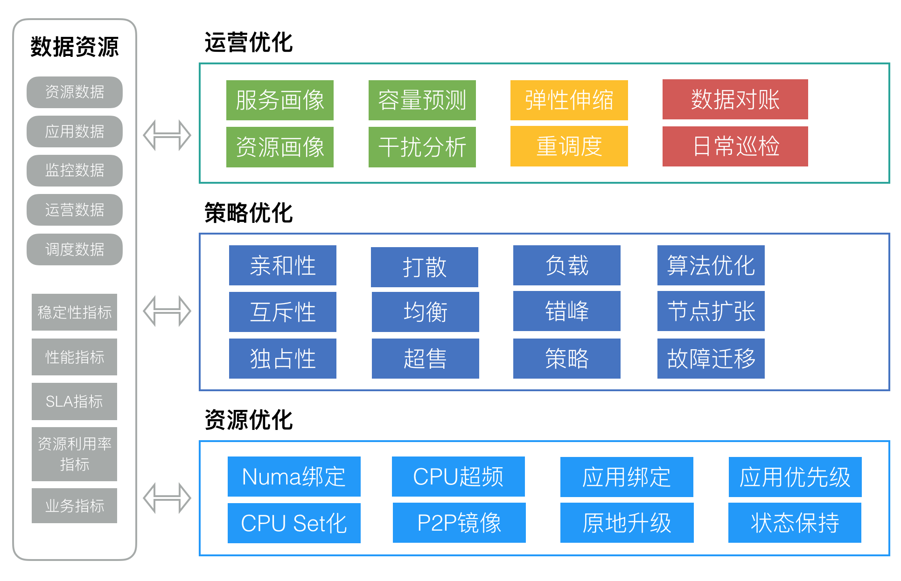

美团点评Kubernetes集群管理实践
====================

背景
--

作为国内领先的生活服务平台，美团点评很多业务都具有非常显著、规律的”高峰“和”低谷“特征。尤其遇到节假日或促销活动，流量还会在短时间内出现爆发式的增长。这对集群中心的资源弹性和可用性有非常高的要求，同时也会使系统在支撑业务流量时的复杂度和成本支出呈现指数级增长。而我们需要做的，就是利用有限的资源最大化地提升集群的吞吐能力，以保障用户体验。

**本文将介绍美团点评Kubernetes集群管理与使用实践，包括美团点评集群管理与调度系统介绍、Kubernetes管理与实践、Kubernetes优化与改造以及资源管理与优化等。**

美团点评集群管理与调度系统
-------------

美团点评在集群管理和资源优化这条道路上已经“摸爬滚打”多年。2013年，开始构建基于传统虚拟化技术的资源交付方式；2015年7月，开始建立完善的集群管理与调度系统——HULK，目标是推动美团点评服务容器化；2016年，完成基于Docker容器技术自研实现了弹性伸缩能力，来提升交付速度和应对快速扩缩容的需求，实现弹性扩容、缩容，提升资源利用率，提升业务运维效率，合理有效的降低企业IT运维成本；2018年，开始基于Kubernetes来进行资源管理和调度，进一步提升资源的使用效率。

美团点评集群管理与调度平台演进

最初，美团点评通过基于Docker容器技术自研实现了弹性伸缩能力，主要是为了解决基于虚拟化技术的管理及部署机制在应对服务快速扩容、缩容需求时存在的诸多不足。例如资源实例创建慢、无法统一运行环境、实例部署和交付流程长、资源回收效率低、弹性能力差等等。经过调研与测试，结合业界的实践经验，我们决定基于Docker容器技术自研集群管理与调度系统，有效应对快速扩缩容的需求，提升资源的利用效率。我们把它叫做”绿巨人”——HULK，这个阶段可以看作是HULK1.0。

之后，在生产环境中经过不断摸索和尝试，我们逐渐意识到，仅仅满足于集群的弹性伸缩能力是不够的，成本和效率肯定是未来必将面临且更为棘手的问题。我们吸取了2年来HULK 1.0的开发和运维经验，在架构和支撑系统层面做了进一步优化和改进，并借助于生态和开源的力量来为HULK赋能，即引入了开源的集群管理与调度系统Kubernetes，期望能进一步提升集群管理、运行的效率和稳定性，同时降低资源成本。所以我们从自研平台转向了开源的Kubernetes系统，并基于Kubernetes系统打造了更加智能化的集群管理与调度系统——HULK2.0。

### 架构全览

在架构层面，HULK2.0如何能与上层业务和底层Kubernetes平台更好地分层和解耦，是我们在设计之初就优先考虑的问题。我们期望它既要能对业务使用友好，又能最大限度地发挥Kubernetes的调度能力，使得业务层和使用方毋需关注资源关系细节，所求即所得；同时使发布、配置、计费、负载等逻辑层与底层的Kubernetes平台解耦分层，并保持兼容原生Kubernetes API来访问Kubernetes集群。从而可以借助于统一的、主流的、符合业界规范的标准，来解决美团点评基础架构面临的复杂的、多样的、不统一的管理需求。

### 架构介绍

HULK2.0架构图

自上而下来看，美团集群管理与调度平台面向全公司服务，有各个主要业务线、统一的OPS平台以及Portal平台，HULK不可能针对每个平台定制化接口和解决方案，所以需要将多样的业务和需求抽象收敛,最终统一通过HULK API来屏蔽HULK系统的细节，做到HULK与上层业务方的解耦。HULK API是对业务层和资源需求的抽象，是外界访问HULK的唯一途径。

解决了上层的问题后，我们再来看与下层Kubernetes平台的解耦。HULK接到上层资源请求后，首先要进行一系列的初始化工作，包括参数校验、资源余量、IP和Hostname的分配等等，之后向Kubernetes平台实际申请分配机器资源，最终将资源交付给用户，Kubernetes API进一步将资源需求收敛和转换，让我们可以借助于Kubernetes的资源管理优势。Kubernetes API旨在收敛HULK的资源管理逻辑并与业界主流对齐。此外，因为完全兼容Kubernetes API，可以让我们借助社区和生态的力量，共同建设和探索。

可以看到，HULK API和Kubernetes API将我们整个系统分为三层，这样可以让每一层都专注于各自的模块。

Kubernetes管理与实践
---------------

为什么会选择Kubernetes呢？Kubernetes并不是市面上唯一的集群管理平台（其他如Docker Swarm或Mesos），之所以选择它，除了它本身优秀的架构设计，我们更加看重的是Kubernetes提供的不是一个解决方案，而是一个平台和一种能力。这种能力能够让我们真正基于美团点评的实际情况来扩展，同时能够依赖和复用多年来的技术积累，给予我们更多选择的自由，包括我们可以快速地部署应用程序，而无须面对传统平台所具有的风险，动态地扩展应用程序以及更好的资源分配策略。

HULK-Kubernetes架构图

Kubernetes集群作为整个HULK集群资源管理与平台的基础，需求是稳定性和可扩展性，风险可控性和集群吞吐能力。

### 集群运营现状

* 集群规模：10万+级别线上实例，多地域部署，还在不断快速增长中。
* 业务的监控告警：集群对应用的启动和状态数据进行采集，container-init自动集成业务监控信息，业务程序毋需关注，做到可插拔、可配置。
* 资源的健康告警：从资源的角度对 Node、Pod和 Container等重要数据监控采集，及时发现它们的状态信息，例如 Node不可用、Container不断重启等等。
* 定时巡检与对账：每天自动对所有宿主机进行状态检查，包括剩余磁盘量（数据卷）、D进程数量、宿主机状态等，并对AppKey扩容数据和实际的Pod和容器数据同步校验，及时发现不一致情况。
* 集群数据可视化：对当前集群状态，包括宿主机资源状态、服务数、Pod数、容器化率、服务状态、扩缩容数据等等可视化；并提供了界面化的服务配置、宿主机下线以及Pod迁移操作入口。
* 容量规划与预测：提前感知集群资源状态，预先准备资源；基于规则和机器学习的方式感知流量和高峰，保证业务正常、稳定、高效地运行。

Kubernetes优化与改造
---------------

### kube-scheduler性能优化

我们有集群在使用1.6版本的调度器，随着集群规模的不断增长，旧版本的Kubernetes调度器（1.10之前版本）在性能和稳定性的问题逐渐凸显，由于调度器的吞吐量低，导致业务扩容超时失败，在规模近3000台的集群上，一次Pod的调度耗时在5s左右。Kubernetes的调度器是队列化的调度器模型，一旦扩容高峰等待的Pod数量过多就会导致后面Pod的扩容超时。为此，我们对调度器性能进行了大幅度的优化，并取得了非常明显的提升，根据我们的实际生产环境验证，性能比优化前提升了400%以上。

Kubernetes调度器工作模型如下：

kube-scheduler示意图

（kubernetes调度器，图片来源于网络）

### 预选失败中断机制

一次调度过程在判断一个 Node是否可作为目标机器时，主要分为三个阶段：

* 预选阶段：硬性条件，过滤掉不满足条件的节点，这个过程称为 Predicates。这是固定先后顺序的一系列过滤条件，任何一个 Predicate不符合则放弃该 Node。
* 优选阶段：软性条件，对通过的节点按照优先级排序，称之为 Priorities。每一个Priority都是一个影响因素，都有一定的权重。
* 选定阶段：从优选列表中选择优先级最高的节点，称为 Select。选择的Node即为最终部署Pod的机器。

kube-scheduler调度过程

通过深入分析调度过程可以发现，调度器在预选阶段即使已经知道当前 Node不符合某个过滤条件仍然会继续判断后续的过滤条件是否符合。试想如果有上万台 Node节点，这些判断逻辑会浪费很多计算时间，这也是调度器性能低下的一个重要因素。

为此，我们提出了“预选失败中断机制”，即一旦某个预选条件不满足，那么该 Node即被立即放弃，后面的预选条件不再做判断计算，从而大大减少了计算量，调度性能也大大提升。如下图所示：

kube-scheduler的Predicates过程

我们把该项优化贡献给了 Kubernetes社区(详见[PR](https://github.com/kubernetes/kubernetes/pull/56926))，增加了 alwaysCheckAllPredicates 策略选项，并在 Kubernetes1.10版本发布并开始作为默认的调度策略，当然你也可以通过设置alwaysCheckAllPredicates=true使用原先的调度策略。

在实际测试中，调度器至少可以提升40%的性能，如果你目前在使用的Kube-scheduler的版本低于1.10，那么建议你尝试升级到新的版本。

#### 局部最优解

对于优化问题尤其是最优化问题，我们总希望找到全局最优的解或策略，但是当问题的复杂度过高，要考虑的因素和处理的信息量过多时，我们往往会倾向于接受局部最优解，因为局部最优解的质量不一定都是差的。尤其是当我们有确定的评判标准，同时标明得出的解是可以接受的话，通常会接收局部最优的结果。这样，从成本、效率等多方面考虑，才是我们在实际工程中真正会采取的策略。

kube-scheduler的局部最优解

（图片来源于网络）

当前调度策略中，每次调度调度器都会遍历集群中所有的Node，以便找出最优的节点，这在调度领域称之为BestFit算法。但是在生产环境中，我们是选取最优Node还是次优Node，其实并没有特别大的区别和影响，有时候我们还是会避免选取最优的Node（例如我们集群为了解决新上线机器后频繁在该机器上创建应用的问题，就将最优解随机化）。换句话说，找出局部最优解就能满足需求。

假设集群一共1000个Node，一次调度过程PodA，这其中有700个Node都能通过Predicates（预选阶段），那么我们就会把所有的Node遍历并找出这700个Node，然后经过得分排序找出最优的Node节点NodeX。但是采用局部最优算法，即我们认为只要能找出N个Node，并在这N个Node中选择得分最高的Node即能满足需求，比如默认找出100个可以通过Predicates（预选阶段）的Node即可，最优解就在这100个Node中选择。当然全局最优解NodeX也可能不在这100个Node中，但是我们在这100个Node中选择最优的NodeY也能满足要求。最好的情况是遍历100个Node就找出这100个Node，也可能遍历了200个或者300个Node等等，这样我们可以大大减少计算时间，同时也不会对我们的调度结果产生太大的影响。

局部最优的策略是我们与社区合作共同完成的，这里面还涉及到如何做到公平调度和计算任务优化的细节(详见[PR1](https://github.com/kubernetes/kubernetes/pull/66733),[PR2](https://github.com/kubernetes/kubernetes/pull/67555))，该项优化在Kubernetes 1.12版本中发布，并作为当前默认调度策略，可以大幅度提升调度性能，尤其在大规模集群中的提升，效果非常明显。

### kubelet改造

#### 风险可控性

前面提到，稳定性和风险可控性对大规模集群管理来说非常重要。从架构上来看，Kubelet是离真实业务最近的集群管理组件，我们知道社区版本的Kubelet对本机资源管理有着很大的自主性，试想一下，如果某个业务正在运行，但是Kubelet由于出发了驱逐策略而把这个业务的容器干掉了会发生什么？这在我们的集群中是不应该发生的，所以需要收敛和封锁Kubelet的自决策能力，它对本机上业务容器的操作都应该从上层平台发起。

**容器重启策略 **Kernel升级是日常的运维操作，在通过重启宿主机来升级Kernel版本的时候，我们发现宿主机重启后，上面的容器无法自愈或者自愈后版本不对，这会引发业务的不满，也造成了我们不小的运维压力。后来我们为Kubelet增加了一个重启策略（Reuse），同时保留了原生重启策略（Rebuild），保证容器系统盘和数据盘的信息都能保留，宿主机重启后容器也能自愈。** IP状态保持 **根据美团点评的网络环境，我们自研了CNI插件，并通过基于Pod唯一标识来申请和复用IP。做到了应用IP在Pod迁移和容器重启之后也能复用，为业务上线和运维带来了不少的收益。** 限制驱逐策略**我们知道Kubelet拥有节点自动修复的能力，例如在发现异常容器或不合规容器后，会对它们进行驱逐删除操作，这对于我们来说风险太大，我们允许容器在一些次要因素方面可以不合规。例如当Kubelet发现当前宿主机上容器个数比设置的最大容器个数大时，会挑选驱逐和删除某些容器，虽然正常情况下不会轻易发生这种问题，但是我们也需要对此进行控制，降低此类风险。

#### 可扩展性**资源调配 **在Kubelet的扩展性方面我们增强了资源的可操作性，例如为容器绑定Numa从而提升应用的稳定性；根据应用等级为容器设置CPUShare，从而调整调度权重；为容器绑定CPUSet等等。** 增强容器 **我们打通并增强了业务对容器的配置能力，支持业务给自己的容器扩展ulimit、io limit、pid limit、swap等参数的同时也增强容器之间的隔离能力。** 应用原地升级 **大家都知道，Kubernetes默认只要Pod的关键信息有改动，例如镜像信息，就会出发Pod的重建和替换，这在生产环境中代价是很大的，一方面IP和HostName会发生改变，另一方面频繁的重建也给集群管理带来了更多的压力，甚至还可能导致无法调度成功。为了解决该问题，我们打通了自上而下的应用原地升级功能，即可以动态高效地修改应用的信息，并能在原地（宿主机）进行升级。** 镜像分发**

镜像分发是影响容器扩容时长的一个重要环节，我们采取了一系列手段来优化，保证镜像分发效率高且稳定：

* 跨Site同步：保证服务器总能从就近的镜像仓库拉取到扩容用的镜像，减少拉取时间，降低跨Site带宽消耗。
* 基础镜像预分发：美团点评的基础镜像是构建业务镜像的公共镜像。业务镜像层是业务的应用代码，通常比基础镜像小很多。在容器扩容的时候如果基础镜像已经在本地，就只需要拉取业务镜像的部分，可以明显的加快扩容速度。为达到这样的效果，我们会把基础镜像事先分发到所有的服务器上。
* P2P镜像分发：基础镜像预分发在有些场景会导致上千个服务器同时从镜像仓库拉取镜像，对镜像仓库服务和带宽带来很大的压力。因此我们开发了镜像P2P分发的功能，服务器不仅能从镜像仓库中拉取镜像，还能从其他服务器上获取镜像的分片。

资源管理与优化
-------

资源管理与优化

### 优化关键技术

* 服务画像：对应用的CPU、内存、网络、磁盘和网络 I/O 容量和负载画像，了解应用的特征、资源规格和应用类型以及不同时间对资源的真实使用，然后从服务角度和时间维度进行相关性分析，从而进行整体调度和部署优化。
* 亲和性和互斥性：哪些应用放在一起使整体计算能力比较少而吞吐能力比较高，它们就存在一定亲和性；反之如果应用之间存在资源竞争或相互影响，则它们之间就存在着互斥性。
* 场景优先：美团点评的业务大都是基本稳定的场景，所以场景划分很有必要。例如一类业务对延迟非常敏感，即使在高峰时刻也不允许有太多的资源竞争产生，这种场景就要避免和减少资源竞争引起的延迟，保证资源充足；一类业务在有些时间段需要的CPU资源可能会突破配置的上限，我们通过CPU Set化的方式让这类业务共享这部分资源，以便能够突破申请规格的机器资源限制，不仅服务能够获得更高的性能表现，同时也把空闲的资源利用了起来，资源使用率进一步提升。
* 弹性伸缩：应用部署做到流量预测、自动伸缩、基于规则的高低峰伸缩以及基于机器学习的伸缩机制。
* 精细化资源调配：基于资源共享和隔离技术做到了精细化的资源调度和分配，例如Numa绑定、任务优先级、CPU Set化等等。

### 策略优化

调度策略的主要作用在两方面，一方面是按照既定策略部署目标机器；二是能做到集群资源的排布最优。

* 亲和性：有调用关系和依赖的应用，或哪些应用放在一起能使整体计算能力比较少、吞吐能力比较高，这些应用间就存在一定亲和性。我们的CPU Set化即是利用了对CPU的偏好构建应用的亲和性约束，让不同CPU偏好的应用互补。
* 互斥性：跟亲和性相对，主要是对有竞争关系或业务干扰的应用在调度时尽量分开部署。
* 应用优先级：应用优先级的划分是为我们解决资源竞争提供了前提。当前当容器发生资源竞争时，我们无法决策究竟应该让谁获得资源，当有了应用优先级的概念后，我们可以做到，在调度层，限制单台宿主机上重要应用的个数，减少单机的资源竞争，也为单机底层解决资源竞争提供可能；在宿主机层，根据应用优先级分配资源，保证重要应用的资源充足，同时也可运行低优先级应用。
* 打散性：应用的打散主要是为了容灾，在这里分为不同级别的打散。我们提供了不同级别的打散粒度，包括宿主机、Tor、机房、Zone等等。
* 隔离与独占：这是一类特殊的应用，必须是独立使用一台宿主机或虚拟机隔离环境部署，例如搜索团队的业务。
* 特殊资源：特殊资源是满足某些业务对GPU、SSD、特殊网卡等特殊硬件需求。

### 在线集群优化

在线集群资源的优化问题，不像离线集群那样可以通过预知资源需求从而达到非常好的效果，由于未来需求的未知性，在线集群很难在资源排布上达到离线集群的效果。针对在线集群的问题，我们从上层调度到底层的资源使用都采取了一系列的优化。

* Numa绑定：主要是解决业务侧反馈服务不稳定的问题，通过绑定Numa，将同一个应用的CPU和Memory绑定到最合适的Numa Node上，减少跨Node访问的开销，提升应用性能。
* CPU Set化：将一组特性互补的应用绑定在同一组CPU上，从而让他们能充分使用CPU资源。
* 应用错峰：基于服务画像数据为应用错开高峰，减少资源竞争和相互干扰，提升业务SLA。
* 重调度：资源排布优化，用更少的资源提升业务性能和SLA；解决碎片问题，提升资源的分配率。
* 干扰分析：基于业务监控数据指标和容器信息判断哪些容器有异常，提升业务SLA，发现并处理异常应用。

结束语
---

当前，在以下几个方面我们正在积极探索：

* 在线-离线业务混合部署，进一步提升资源使用效率。
* 智能化调度，业务流量和资源使用感知调度，提升服务SLA。
* 高性能、强隔离和更安全的容器技术。
