铁总在用的高性能分布式缓存计算框架 Geode
=======================

### 什么是 Geode，有哪些特性

#### 官网定义

Apache Geode 是一个数据管理平台，可在广泛分布的云架构中提供对数据密集型应用程序的实时、一致的访问。Geode 跨多个进程汇集内存、CPU、网络资源和可选的本地磁盘，以管理应用程序对象和行为。它使用动态复制和数据分区技术来实现高可用性、改进的性能、可伸缩性和容错性。除了作为分布式数据容器之外，Geode 还是一个内存数据管理系统，可提供可靠的异步事件通知和有保证的消息传递。

#### 主要组件概念

* locator：locator 定位器，类似于 zk ，进行选举协调，服务发现等功能，我们的应用程序链接的是 locator 定位器
* server：真正提供缓存服务的功能
* region：对数据进行区域划分，类似数据库中表的概念
* gfsh：Geode 的命令行控制台
* client：链接 Geode 服务的客户端

#### Geode 特性

* 高读写吞吐量
* 低且可预测的延迟
* 高可扩展性
* 持续可用性
* 可靠的事件通知
* 数据存储上的并行应用程序行为
* 无共享磁盘持久性
* 降低拥有成本
* 客户/服务器的单跳能力
* 客户/服务器安全
* 多站点数据分布
* 连续查询
* 异构数据共享

### Geode 与 Redis

总体来说 Geode 的功能包含 Redis 的功能，但是还是有一些迥异点的。

1. 定位不同：Geode 定位数据管理平台，强调实时一致性， Redis 高速缓存。
2. 集群：Geode 天然支持集群，节点是对等的，Redis 集群去中心化，主从复制。
3. 部署方式：Geode 有点对点方式、C/S 方式、WAN 多数据中心方式，而 Redis 是 C/S 主从方式、集群方式。
4. 查询：Geode 支持 OQL 查询、函数计算、Redis KV 查询
5. 发布订阅：Geode 支持稳定的时间订阅和连续查询， Redis 的发布订阅貌似用的并不多。
6. 事务支持：Geode 支持的也是存内存的 ACID 事务，对落盘的事务支持也不行，Redis 支持的也是内存型事务，相对来说，ACID 更高级一些。
7. Geode 支持 Redis 的协议模拟，有 Redis Adaper。

### Geode 集群搭建——四台虚拟机

#### 前置说明

1. 请确保服务器事先安装 JDK 8+ update > 121 的版本。
2. 系统时间正确，可以使用 NTP 网络服务。
3. 配置了正确的主机名。
4. 禁用 TCP SYN cookie。大多数默认 Linux 安装，使用 SYN cookie 来保护系统免受泛滥 TCP SYN 数据包的恶意攻击，但此功能与稳定和繁忙的 Geode 集群不兼容。安全实现应该通过将 Geode 服务器集群置于高级防火墙保护之下来寻求防止攻击。

**如何禁用 TCP SYN cookie：**

编辑 /etc/sysctl.conf

```
net.ipv4.tcp_syncookies = 0 
```

将此值设置为零，将禁用 SYN Cookie。

```
sysctl -p 重载
```

#### 服务器说明

准备好主机：

1. 主机（192-168-33-15）：locator1 + server1
2. 主机（192-168-33-20）：locator2 + server2
3. 主机（192-168-33-23）：locator3 + server3
4. 主机（192-168-33-29）：server4

分别在各主机创建 Geode 工作目录 /opt/geode\_work，并在该目录中进入 gfsh 命令行。

我们采用 3 locator + 4 server 的结构。

#### 准备安装包

下载地址：

> [https://geode.apache.org/releases/](https://geode.apache.org/releases/)

一般我们选择第一个 tgz 的包 ，版本我这里先选用 1.8 的，为了后续测试滚动升级使用。


#### 上传，解压，配置 /etc/profile

拷贝至：

```
cp /tmp/upload_dir/ddh/apache-geode-1.8.0.tgz /opt/apache-geode-1.8.0.tgz
```

tar 解压：

```
tar xvf apache-geode-1.8.0.tgz
```

删除包文件：

```
rm -rf apache-geode-1.8.0.tgz
```

当然上传目录不强制，但是我们需要使用的配置环境变量：

```
vim /etc/profile
```

最后一行加入：

```
export PATH=$JAVA_HOME/bin:/opt/apache-geode-1.8.0/bin:$PATH
```

退出使更改生效。

```
source /etc/profile 
gfsh version --full
```

成功会输出如下（我这是 1.9.2 输出的版本）：

```
[email protected]/0 # gfsh version --full
Build-Date: 2019-10-15 06:08:13 -0700
Build-Id: jdeppe 0
Build-Java-Version: 1.8.0_221
Build-Platform: Mac OS X 10.14.6 x86_64
Product-Name: Apache Geode
Product-Version: 1.9.2
Source-Date: 2019-10-14 15:59:02 -0700
Source-Repository: release/1.9.2
Source-Revision: 63c8058f036316618b6cd78e6727106b7ac0a888
Native version: native code unavailable
Running on: /192.168.33.23, 4 cpu(s), amd64 Linux 2.6.32-696.23.1.el6.x86_64
```

#### 准备 locator 和 server 的启动脚本

locator 脚本 （以 33.15 的脚本为例子 ）：

```
#! /bin/sh
basedir=`dirname $0`
echo "BASE DIR:$basedir"
cd $basedir
locators=192.168.33.15[10334],192.168.33.20[10334],192.168.33.23[10334]
locatorname=locator_33_15
gfsh start locator --name=${locatorname} --locators=${locators} --port=10334 \
--initial-heap=512M --max-heap=1G --bind-address=192.168.33.15 \
--J=-Dgemfire.max-num-reconnect-tries=100 --J=-Dgemfire.member-timeout=120000 \
--J=-Dgemfire.distributed-system-id=254 \
2>&1 &
```

`max-num-reconnect-tries=100` 一定要设置，非常重要。

server 的启动脚本：

```
#! /bin/sh
basedir=`dirname $0`
echo "BASE DIR:$basedir"
cd $basedir
locators=192.168.33.15[10334],192.168.33.20[10334]
servername=server_33_15
gfsh start server --name=${servername} --locators=${locators} --locator-wait-time=120 --server-port=40401  \
--lock-memory=true --initial-heap=2G --max-heap=2G --J=-Xmn1g --bind-address=192.168.33.15 \
--J=-Dgemfire.max-num-reconnect-tries=100  --J=-Dgemfire.member-timeout=120000 \
--J=-Dgemfire.distributed-system-id=254 \
2>&1 &
```

其他的 locator、server 按照该脚本进行更改即可， 具体参数按需定制，比如端口、超时时间、Java 内存的配置。

#### 启动

依次启动 locator、server。

#### 确定 locator leader 是那台机器

\\1. 启动成功的时候观察日志：

```
[email protected]/0 # sh start_locator_33_20.sh
Log File: /opt/geode_work18/locator_33_20/locator_33_20.log
JVM Arguments: -Dgemfire.locators=192.168.33.15[10334],192.168.33.20[10334],192.168.33.23[10334] -Dgemfire.enable-cluster-configuration=true -Dgemfire.load-cluster-configuration-from-dir=false -Dgemfire.max-num-reconnect-tries=100 -Dgemfire.member-timeout=120000 -Dgemfire.distributed-system-id=254 -Xms512M -Xmx1G -XX:+UseConcMarkSweepGC -XX:CMSInitiatingOccupancyFraction=60 -Dgemfire.launcher.registerSignalHandlers=true -Djava.awt.headless=true -Dsun.rmi.dgc.server.gcInterval=9223372036854775806
Class-Path: /opt/apache-geode-1.9.2/lib/geode-core-1.9.2.jar:/opt/apache-geode-1.9.2/lib/geode-dependencies.jar
//重点关注这行
Successfully connected to: JMX Manager [host=192.168.33.15, port=1099]
Cluster configuration service is up and running.
```

我们可以看到当我们启动的时候，打印的日志会告诉我们链接到了谁。

\\2. connect 到 locator 后的日志：

```
gfsh>connect --locator=192.168.33.23[10334]
Connecting to Locator at [host=192.168.33.23, port=10334] ..
//请关注下边这行
Connecting to Manager at [host=192.168.33.15, port=1099] ..
Successfully connected to: [host=192.168.33.15, port=1099]
```

我们可以看到，当我们链接 33.23 的时候，它会转到 manager 地址，这就是当前的 locator leader 了。

#### 打开 pulse 控制台

确认了 leader 地址，我们就可以访问 Pulse 了。

```
http://192.168.33.15:7070/pulse
```

默认用户名密码 admin/admin。

先看个效果图：

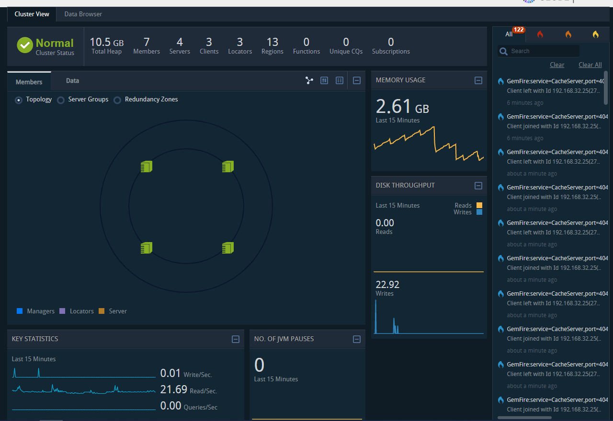

### gfsh 常用命令介绍

gfsh 的作用：

* 开启，停止 locator， server
* 开启停止 gateway-sender 和 receiver
* 创建和销毁应用程序
* 执行函数
* 管理磁盘存储
* 导入导出数据
* 监控应用

#### 启动 gfsh

还记得我们安装的时候在环境变量中进行了配置 profile，因此我们只需要输入 gfsh 就可以调启命令行。

```
[email protected]/0 # gfsh
    _________________________     __
   / _____/ ______/ ______/ /____/ /
  / /  __/ /___  /_____  / _____  / 
 / /__/ / ____/  _____/ / /    / /  
/______/_/      /______/_/    /_/    1.9.2
Monitor and Manage Apache Geode
```

**注意：命令行可以 tab 键自动补全，及其方便操作。**#### connect

要管理 Goode 集群我们需要连接到主 locator 上， 有两种方式。**1\. 直接使用 JMX 进行连接**当我们知道哪个是主的时候，就直接使用 JMX 进行连接即可。

```
gfsh>connect --jmx-manager=192.168.33.15
Connecting to Manager at [host=192.168.33.15, port=1099] ..
Successfully connected to: [host=192.168.33.15, port=1099]
Cluster-254 gfsh>
```** 2\. 连接任意一个 locator**

指定 locator 的 ip \[端口\] 就可以了。

注意看 shell 中的第三行

```

Connecting to Manager at [host=192.168.33.15, port=1099] ..

```

实际上 locator 也是会返回 leader 的 JMX 让本地进行连接。

```

gfsh>connect --locator=192.168.33.23[10334]
Connecting to Locator at [host=192.168.33.23, port=10334] ..
Connecting to Manager at [host=192.168.33.15, port=1099] ..
Successfully connected to: [host=192.168.33.15, port=1099]
Cluster-254 gfsh>

```

#### 创建 locator、server

详见安装时候的脚本实例。

#### 创建 region

```

gfsh>create region --name=test --type=PARTITION_REDUNDANT_PERSISTENT_OVERFLOW --redundant-copies=1
   Member    | Status | Message
------------ | ------ | ----------------------------------------
server_33_15 | OK     | Region "/test" created on "server_33_15"
server_33_20 | OK     | Region "/test" created on "server_33_20"
server_33_23 | OK     | Region "/test" created on "server_33_23"
server_33_29 | OK     | Region "/test" created on "server_33_29"
Changes to configuration for group 'cluster' are persisted.

```

注意：`--type` 参数，我们可以看到是由四个单词组成，分区、复制、持久化、磁盘，基本所有的类型都是由这四个拼凑的。

*   PARTITION：分区
*   REPLICATE：复制
*   PERSISTENT：持久化
*   OVERFLOW：内存不足减少内存使用
*   REDUNDANT：冗余 -> 可配置冗余数量，但是不知道是否会参与 read 不清楚
*   HEAP\_LRU：最近最少使用清除内存

```

LOCAL                                     LOCAL_HEAP_LRU                            LOCAL_OVERFLOW                            LOCAL_PERSISTENT
LOCAL_PERSISTENT_OVERFLOW                 PARTITION                                 PARTITION_HEAP_LRU                        PARTITION_OVERFLOW
PARTITION_PERSISTENT                      PARTITION_PERSISTENT_OVERFLOW             PARTITION_PROXY                           PARTITION_PROXY_REDUNDANT
PARTITION_REDUNDANT                       PARTITION_REDUNDANT_HEAP_LRU              PARTITION_REDUNDANT_OVERFLOW              PARTITION_REDUNDANT_PERSISTENT
PARTITION_REDUNDANT_PERSISTENT_OVERFLOW   REPLICATE                                 REPLICATE_HEAP_LRU                        REPLICATE_OVERFLOW
REPLICATE_PERSISTENT                      REPLICATE_PERSISTENT_OVERFLOW             REPLICATE_PROXY

```

#### get、put

```

Cluster-254 gfsh>put  --region=test --key=abc --value=abc_v
Result      : true
Key Class   : java.lang.String
Key         : abc
Value Class : java.lang.String
Old Value   : null
Cluster-254 gfsh>get --region=test --key=abc
Result      : true
Key Class   : java.lang.String
Key         : abc
Value Class : java.lang.String
Value       : "abc_v"

```

#### list

```

list 的所有命令
Cluster-254 gfsh>list
list async-event-queues   list clients              list data-source          list deployed             list disk-stores          list durable-cqs          list functions
list gateways             list indexes              list jdbc-mappings        list jndi-binding         list lucene               list members              list regions

```

我们常用的有：

*   list members：查看所有成员
*   list regions：查看所有 region
*   list clients：查看链接的客户端
*   list functions：查看函数（线上我们还未使用函数计算功能）

像 indexs、lucene、gateways 现在都未用到。

#### describe

所有的命令，我们可以看到，跟上个命令所能看的东西很像。

```

Cluster-254 gfsh>describe
describe client               describe config               describe connection           describe data-source          describe disk-store           describe jdbc-mapping
describe jndi-binding         describe lucene               describe member               describe offline-disk-store   describe region

```

查看 region 的描述：

```

Cluster-254 gfsh>describe region --name=test
Name            : test
Data Policy     : persistent partition
Hosting Members : server_33_29
                  server_33_20
                  server_33_23
                  server_33_15
Non-Default Attributes Shared By Hosting Members  
  Type    |        Name        | Value
--------- | ------------------ | --------------------
Region    | size               | 1
          | data-policy        | PERSISTENT_PARTITION
Eviction  | eviction-action    | overflow-to-disk
          | eviction-algorithm | lru-heap-percentage
Partition | redundant-copies   | 1

```

查看 member 的描述：

```

gfsh>describe member --name=server_33_15
Name        : server_33_15
Id          : 192.168.33.15(server_33_15:1530)<v85>:41001
Host        : 192.168.33.15
Regions     : userblackcount
              region1
              test
              photo
              advert
              message
              userspace
              activeuser
              userblack
              exp10m
              pay7
              user
              dimension
              userinfo
PID         : 1530
Groups      :
Used Heap   : 752M
Max Heap    : 1945M
Working Dir : /opt/geode_work18/server_33_15
Log file    : /opt/geode_work18/server_33_15/server_33_15.log
Locators    : 192.168.33.15[10334],192.168.33.20[10334]
Cache Server Information
Server Bind              :
Server Port              : 40401
Running                  : true
Client Connections       : 1

```

#### status

所有能查看的：

```

status cluster-config-service   status gateway-receiver         status gateway-sender           status locator                  status server

```

查看 locator 的状态：

```

gfsh>status locator --name=locator_33_15
Locator in /opt/geode_work18/locator_33_15 on 192.168.33.15[10334] as locator_33_15 is currently online.
Process ID: 1184
Uptime: 2 days 2 hours 25 minutes 33 seconds
Geode Version: 1.9.2
Java Version: 1.8.0_102
Log File: /opt/geode_work18/locator_33_15/locator_33_15.log
JVM Arguments: -Dgemfire.locators=192.168.33.15[10334],192.168.33.20[10334],192.168.33.23[10334] -Dgemfire.enable-cluster-configuration=true -Dgemfire.load-cluster-configuration-from-dir=false -Dgemfire.max-num-reconnect-tries=100 -Dgemfire.member-timeout=120000 -Dgemfire.distributed-system-id=254 -Xms512M -Xmx1G -XX:+UseConcMarkSweepGC -XX:CMSInitiatingOccupancyFraction=60 -Dgemfire.launcher.registerSignalHandlers=true -Djava.awt.headless=true -Dsun.rmi.dgc.server.gcInterval=9223372036854775806
Class-Path: /opt/apache-geode-1.9.2/lib/geode-core-1.9.2.jar:/opt/apache-geode-1.9.2/lib/geode-dependencies.jar
Cluster configuration service is up and running.

```

#### query

可以做类似 SQL 语法的查询，这点其他缓存框架是做不到的。

```

Cluster-254 gfsh>query --query="select * from /test"
Result : true
Limit  : 100
Rows   : 1
Result
------

abc_v

```

query 更多实例我们在 OQL 一节去探讨。

#### export

导出有日志、配置、集群配置、数据，我们常用的就是导出集群配置。

```

Cluster-254 gfsh>export cluster-configuration --zip-file-name=./cluster-config-back.zip
File saved to /opt/geode_work18/./cluster-config-back.zip

```

有导出就有导入：

```

Cluster-254 gfsh>import
import cluster-configuration   import data
Cluster-254 gfsh>import cluster-configuration --
 --action           --group            --xml-file         --zip-file-name

```

#### version

```

Cluster-254 gfsh>version --full
Build-Date: 2019-10-15 06:08:13 -0700
Build-Id: jdeppe 0
Build-Java-Version: 1.8.0_221
Build-Platform: Mac OS X 10.14.6 x86_64
Product-Name: Apache Geode
Product-Version: 1.9.2
Source-Date: 2019-10-14 15:59:02 -0700
Source-Repository: release/1.9.2
Source-Revision: 63c8058f036316618b6cd78e6727106b7ac0a888
Native version: native code unavailable
Running on: /192.168.33.15, 4 cpu(s), amd64 Linux 2.6.32-696.23.1.el6.x86_64

```

### Geode OQL

OQL（object query language），对象查询语言，类 SQL 语法。

请注意使用 OQL 查询的前提，你要将你的应用对象上传到服务器中，所以我们先学习一个命令 deploy。

```

Cluster-254 gfsh>deploy --jar /opt/geode-study.jar
Deploying files: geode-study.jar
Total file size is: 0.00MB
Continue?  (Y/n): y
   Member    |  Deployed JAR   | Deployed JAR Location
------------ | --------------- | -----------------------------------------------
server_33_15 | geode-study.jar | /opt/geode_work/server_33_15/geode-study.v2.jar
server_33_20 | geode-study.jar | /opt/geode_work/server_33_20/geode-study.v2.jar
server_33_23 | geode-study.jar | /opt/geode_work/server_33_23/geode-study.v2.jar
server_33_29 | geode-study.jar | /opt/geode_work/server_33_29/geode-study.v2.jar

```

我们将应用的实体类打包上传到 Geode 集群中，然后通过 deploy 命令进行部署。

*   deploy 后不需要重启，直接生效
*   只 deploy 一次即可 全站生效
*   注意对象要实现序列化接口

实现序列化的三种方式：

*   PDX 反序列化快
*   Geode Serializable 序列化比 PDX 快 25%
*   Java 序列化效率一般

我们示例中使用的是 Java 序列化。关于序列化，Geode 官方文档中使用了一个章节来说明 [请看这里](https://geode.apache.org/docs/guide/19/developing/data_serialization/chapter_overview.html)。

基于我们的 user 对象我们尝试一下 OQL 的查询：

```

@Data
public class User implements Serializable {
    private long  id;
    private String name;
    private int age;
    private Date createTime;
}

```

#### 类似 map 的查询

keySet、values、entries 跟我们的 map 中的属性是一样的。

```

Cluster-254 gfsh>query --query="select * from /user.keySet limit 1"
Result
-----------------------

test.user.1574821108359
Cluster-254 gfsh>query --query="select *from /user.values limit 1"
     id       |  name  | age | createTime
------------- | ------ | --- | -------------
1574821108359 | "xy27" | 27  | 1574821108359
Cluster-254 gfsh>query --query="select* from /user.entries limit 1"
test.user.1574821108359
----------------------------------------------------------------------

{"id":1574821108359,"name":"xy27","age":27,"createTime":1574821108359}
Cluster-254 gfsh>query --query="select * from /user limit 1 "
     id       |  name  | age | createTime
------------- | ------ | --- | -------------
1574821108359 | "xy27" | 27  | 1574821108359

```

#### 条件查询和排序

```

Cluster-254 gfsh>query --query="select * from /user t where t.age > 90 and t.age < 95 order by t.age desc "
     id       |  name  | age | createTime
------------- | ------ | --- | -------------
1574821109489 | "xy94" | 94  | 1574821109489
1574821109437 | "xy93" | 93  | 1574821109437
1574821109422 | "xy92" | 92  | 1574821109422
1574821109409 | "xy91" | 91  | 1574821109409

```

#### 联合查询

暂时未准备数据，不过估计查询效率不会高了。

```

SELECT portfolio1.ID, portfolio2.status FROM /exampleRegion portfolio1,
/exampleRegion2 portfolio2 WHERE portfolio1.status = portfolio2.status

```

#### 方法调用

实例中使用了 Spring 的 endsWith 和 length 方法。

```

Cluster-254 gfsh>query --query="select name , name.length from /user t where t.name.endsWith('99') "
name | length
---- | ------
xy99 | 4

```

#### 聚合查询

```

Cluster-254 gfsh>query --query="select age, count(*), max(id)  from /user t where t.age > 90 group by t.age "
age | 0 | id
--- | - | -------------
96  | 1 | 1574821109547
95  | 1 | 1574821109515
91  | 1 | 1574821109409
94  | 1 | 1574821109489
99  | 1 | 1574821109586
93  | 1 | 1574821109437
92  | 1 | 1574821109422
98  | 1 | 1574821109573
97  | 1 | 1574821109557

```

#### 查询小结

*   注意对象的序列化
*   注意使用的类要部署到服务端
*   提高查询效率可以使用索引
*   查询时保证不要查太多数据
*   关于分页还未找到好的方式

### Geode 连续查询

连续查询就是，当我们指定了一个查询语句的时候，比如 `age > 99`，那么会直接返回当前的查询结果，同时你可以注册一个监听，后续有 `age > 99` 的记录的创建、更新、删除，都会回调到你的这个监听中来，这个后续满足条件的回调就是所谓的连续了。

```

@Test
    public void cqTest() throws CqException, CqExistsException {
        GeodeService geodeService = new GeodeService(str);
        geodeService.init();
        ClientCache clientCache = geodeService.geodeClient();
        //获取查询的service
        QueryService queryService = clientCache.getQueryService();
        CqAttributesFactory cqf = new CqAttributesFactory();
        CqListener tradeEventListener = new UserCqListener();
        cqf.addCqListener(tradeEventListener);
        //创建 cq 属性
        CqAttributes cqa = cqf.create();
        //命名
        String cqName = "user-cq-test";
        String queryStr = "SELECT * FROM /user t where t.age > 98";
        //创建cq 查询
        CqQuery userCq = queryService.newCq(cqName, queryStr, cqa);
        SelectResults sResults = null;
        try {
            //执行查询
            sResults = userCq.executeWithInitialResults();
            for (Object o : sResults) {
                Struct s = (Struct) o;
                User to = (User) s.get("value");
                System.out.println("Intial result includes: " + to);
            }
            //写入一个数据
            User user = new User();
            user.setId(id());
            user.setName("xy100");
            user.setAge(100);
            user.setCreateTime(new Date());
            geodeService.setObject(GeodeRegion.user, user.getId()+"", user);
            Thread.sleep(1000);
            //更新一个数据
            user.setName("xy100-1");
            geodeService.setObject(GeodeRegion.user, user.getId()+"", user);
            //销毁一个数据
            Thread.sleep(1000);
            geodeService.remove(GeodeRegion.user, user.getId() + "");
        } catch (RegionNotFoundException e) {
            e.printStackTrace();
        } catch (InterruptedException e) {
            e.printStackTrace();
        }
    }

```

监听器：

```

@Slf4j
public class UserCqListener implements CqListener {
    //事件接受
    @Override
    public void onEvent(CqEvent cqEvent) {
        Operation queryOperation = cqEvent.getQueryOperation();
        Object key = cqEvent.getKey();
        User user = (User)cqEvent.getNewValue();
        //更新
        if (queryOperation.isUpdate()) {
            log.info("cq update {}, {}", key,user);
            //创建
        } else if (queryOperation.isCreate()) {
            log.info("cq create {}, {}", key,user);
            //删除
        } else if (queryOperation.isDestroy()) {
            log.info("cq destroy {}, {}", key,user);
        }
    }
    //错误事件
    @Override
    public void onError(CqEvent aCqEvent) {
        log.info("error {}" , aCqEvent);
    }
}

```

最终输出：

```

Intial result includes: User(id=1574821109586, name=xy99, age=99, createTime=Wed Nov 27 10:18:29 CST 2019)
id=1574827945765
2019-11-27 12:12:25.830 INFO  [Cache Client Updater Thread  on 192.168.33.20(server_33_20:32746)<v6>:41001 port 40401] |UserCqListener|cq create test.user.1574827945765, User(id=1574827945765, name=xy100, age=100, createTime=Wed Nov 27 12:12:25 CST 2019)
2019-11-27 12:12:26.857 INFO  [Cache Client Updater Thread  on 192.168.33.20(server_33_20:32746)<v6>:41001 port 40401] |UserCqListener|cq update test.user.1574827945765, User(id=1574827945765, name=xy100-1, age=100, createTime=Wed Nov 27 12:12:25 CST 2019)
2019-11-27 12:12:27.875 INFO  [Cache Client Updater Thread  on 192.168.33.20(server_33_20:32746)<v6>:41001 port 40401] |UserCqListener|cq destroy test.user.1574827945765, null

```

那么我们思考一下这个连续查询能为我们做什么呢？

*   类似 ZK 的通知？
*   类似消息队列的订阅模型？

### Goede 与 Spring 结合

与 Spring 结合有两种方式。

**1\. 使用 spring-data-geode**

spring-data-geode 符合 data 系列的一贯作风，提供 template 和 repository 对象化操作。我们以 Spring Boot 为例。

POM 文件：

```

<dependency>
            <groupId>org.springframework.boot</groupId>
            <artifactId>spring-boot-starter-web</artifactId>
            <exclusions>
                <exclusion>
                    <artifactId>spring-boot-starter-logging</artifactId>
                    <groupId>org.springframework.boot</groupId>
                </exclusion>
            </exclusions>
        </dependency>
        <dependency>
            <groupId>org.springframework.geode</groupId>
            <artifactId>spring-geode-starter</artifactId>
            <version>1.2.1.RELEASE</version>
        </dependency>
        //geode 使用的是 log4j2 作为日志框架
        <dependency>
            <groupId>org.springframework.boot</groupId>
            <artifactId>spring-boot-starter-log4j2</artifactId>
        </dependency>
```

初始化 cacheClient：

```
@SpringBootApplication
@ClientCacheApplication(
        locators = {
                @ClientCacheApplication.Locator(host = "192.168.33.15" , port = 10334),
                @ClientCacheApplication.Locator(host = "192.168.33.20" , port = 10334)
              //@ClientCacheApplication.Locator(host = "localhost" , port = 10334)
        }
)
public class GeodeStudyApplication {
    public static void main(String[] args) {
        SpringApplication.run(GeodeStudyApplication.class, args);
    }
}
```

配置 region 和 template：

```
@Bean("userRegion")
    public ClientRegionFactoryBean userRegion(GemFireCache gemFireCache) {
        ClientRegionFactoryBean<String, String> customers = new ClientRegionFactoryBean<>();
        customers.setCache(gemFireCache);
        customers.setClose(true);
        customers.setName("user");
        customers.setShortcut(ClientRegionShortcut.PROXY);
        return customers;
    }
    @Resource(name = "userRegion")
    private Region userRegion;
    // template 是针对每个 region 的，因此每个 region 都需要 template
    @Bean("userGemfireTemplate")
    public GemfireTemplate userGemfireTemplate() {
        GemfireTemplate gemfireTemplate = new GemfireTemplate();
        log.info("user region==>"  + userRegion);
        gemfireTemplate.setRegion(userRegion);
        return gemfireTemplate;
    }
```

创建 UserService，更多 API 大家可以自行探索。

```
@Slf4j
@Service
public class UserService {
    @Resource(name = "userGemfireTemplate")
    private GemfireTemplate userGemfireTemplate;
    @Autowired
    private AccountService accountService;
    public void save(User user) {
        /*
           put  和 create 的区别
           put 如果有会覆盖， create 如果有就EntryExistsException
         */
        String put = userGemfireTemplate.put(user.getId(), JSON.toJSONString(user));
      //  userGemfireTemplate.create(key,value);
        log.info("保存用户{}， 返回结果{}", user, put);
    }
    public void delete(long id) {
        Object remove = userGemfireTemplate.remove(id);
        log.info("删除用户{}， 返回结果{}", id, remove);
    }
    public User findById(long id) {
        String userJson = userGemfireTemplate.get(id);
        return JSONObject.parseObject(userJson, User.class);
    }
    public void transaction(User user, Account account) {
        CacheTransactionManager txManager =
             userGemfireTemplate.getRegion().getCache().getCacheTransactionManager();
        try {
            txManager.begin();
            save(user);
            int i = 10/0;
            accountService.save(account);
            txManager.commit();
        } catch (Exception e) {
            txManager.rollback();
            e.printStackTrace();
        } finally {
        }
    }
}
```

**2\. 只用原生包**

```
public enum GeodeRegion {
    user("test.user."),
    test1("test1."),
    test2("test2."),
    account("test.account.");
    /**
     * 前缀， 其实有没有都无所谓，因为前缀都一样
     */
    private String prefix;
    private GeodeRegion(String prefix) {
        this.prefix = prefix;
    }
    public String getPrefix() {
        return this.prefix;
    }
}
@ConfigurationProperties
@Service
public class GeodeService {
    private static final Logger logger = LoggerFactory.getLogger(GeodeService.class);
    private static ClientCache geodeClient = null;
    private static final long PING_INTERVAL = 30000;
    private static final int PING_ATTEMPT = 100;
    private static Map<GeodeRegion, Region> regionMap = new ConcurrentHashMap<GeodeRegion, Region>();
    public GeodeService() {
    }
    public GeodeService(String geodeLocateString) {
        this.geodeLocateString = geodeLocateString;
    }
    @Value("${geode.locateString}")
    private String geodeLocateString;
    @PostConstruct
    public void init() {
        String[] locates = geodeLocateString.split(",");
        try {
            ClientCacheFactory clientCacheFactory = new ClientCacheFactory();
            clientCacheFactory.setPoolPingInterval(PING_INTERVAL);
            clientCacheFactory.setPoolRetryAttempts(PING_ATTEMPT);
            for (String host : locates) {
                //默认端口10334 如果你的不是10334 ，那么你改造一下链接串就可以了
                clientCacheFactory.addPoolLocator(host, 10334);
            }
            //日志级别 生产可以设置warn  开发调试设置成info 或者debug
            geodeClient = clientCacheFactory.set("log-level", "WARN").create();
            //这个shotcut 要设置成proxy  本地不缓存状态 依据场景来设置
            ClientRegionFactory regionFactory = geodeClient.createClientRegionFactory(ClientRegionShortcut.PROXY);
            for (GeodeRegion key : GeodeRegion.values()) {
                Region region = regionFactory.create(key.name());
                logger.info("初始化region成功,regionName=" + key.name());
                regionMap.put(key, region);
            }
            logger.info("初始化geode客户端成功");
        } catch (Exception e) {
            logger.error("初始化geode失败", e);
            throw e;
        }
    }
    public ClientCache geodeClient() {
        return geodeClient;
    }
    @PreDestroy
    public void destroy() {
        geodeClient.close(false);
    }
    public void setObject(GeodeRegion regionName, String key, Object data) {
        try {
            regionMap.get(regionName).put(regionName.getPrefix() + key, data);
        } catch (Exception e) {
            logger.error("存储数据异常,region=" + regionName + ",key=" + regionName.getPrefix() + key, e);
        }
    }
    public Object getObject(GeodeRegion regionName, String key) {
        Object obj = null;
        try {
            obj = regionMap.get(regionName).get(regionName.getPrefix() + key);
        } catch (Exception e) {
            logger.error("获取数据异常,region=" + regionName + ",key=" + regionName.getPrefix() + key, e);
        }
        return obj;
    }
    public void remove(GeodeRegion regionName, String key) {
        try {
            regionMap.get(regionName).remove(regionName.getPrefix() + key);
        } catch (Exception e) {
            logger.error("删除数据异常,region=" + regionName + ",key=" + regionName.getPrefix() + key, e);
        }
    }
    public Region getRegion(GeodeRegion regionName) {
        return regionMap.get(regionName);
    }
}
```

这里如果需要什么功能按需添加就可以了，不像 spring-data 的模板把常用的操作都给我们封装好了。

通过努力发现，Geode 客户端无法再同一个 JVM 中链接两个集群，还望后续能找到解决办法。

### Geode Acid 事务特性

解读 Acid 与传统数据库的不同，Geode 为了提高性能，使用了类似乐观锁的事务处理机制。

#### 原子性

就是类似于乐观锁的冲突检查，如果有交叉事务就丢弃了。

#### 一致性

事务操作前与操作后的状态一致，也就是符合逻辑性。比如：

* 操作前 A：800，B：200
* 操作后 A：600，B：400

#### 隔离性

默认情况下，当一个事务正在进行时，它的更改只在运行该事务的线程中可见。同一进程中的其他线程和其他进程中的线程在提交操作开始之前不能看到更改。在开始提交之后，更改在缓存中是可见的，但是访问更改数据的其他线程可能会看到事务的部分结果，从而导致脏读。当然 Geode 提供严格的隔离性。

```
-Dgemfire.detectReadConflicts=true
```

> this property causes read operations to succeed only when they read a consistent pre- or post-transactional state. If not consistent, Geode throws a `CommitConflictException`.

Geode 只会读取到一致性的结果，如果处在事务提交中的状态进行读取会抛出异常。

#### 持久性

关系数据库通过使用磁盘存储进行恢复和事务日志记录来提供持久性。Geode 针对性能进行了优化， **不支持事务的磁盘持久性** 。从测试中发现，确实不支持 persisternt 类型的 region。

```
Caused by: java.lang.UnsupportedOperationException: Operations on persist-backup regions are not allowed because this thread has an active transaction
```

同样地 Geode 也提供了针对持久性的支持：

```
-Dgemfire.ALLOW_PERSISTENT_TRANSACTIONS=true
```

\*\*但是请注意：\*\*这个系统配置仅仅是消除了上边报出来的异常，是的程序能继续执行，但是对于磁盘写入的原子性并不能保证！

```
@Test
    public void transaction() {
        GeodeService geodeService = new GeodeService(str);
        geodeService.init();
        ClientCache clientCache = geodeService.geodeClient();
        //获取事务管理器
        CacheTransactionManager transactionManager = clientCache.getCacheTransactionManager();
        try {
            //开始事务
            transactionManager.begin();
            User user = new User();
            user.setId(id());
            user.setName("u1");
            user.setCreateTime(new Date());
            geodeService.setObject(GeodeRegion.test1, user.getId()+"", JSON.toJSONString(user));
            //提交事务
            transactionManager.commit();
        } catch (Exception e) {
            e.printStackTrace();
            //回滚事务
            transactionManager.rollback();
        }
    }
```

### Geode RESTful

要想使用 RESTful，首先需要再启动 server 的时候添加参数。

我们以 33.15 的 server 为例。

REST API 目前相对较弱，只能处理如下的需求：

* 对 region 的基本操作
* 对 query 的基本操作
* 对 function 的基本操作

#### 加入参数

```
basedir=`dirname $0`
echo "BASE DIR:$basedir"
cd $basedir
locators=192.168.33.15[10334],192.168.33.20[10334]
servername=server_33_15
gfsh start server --name=${servername} --locators=${locators} --locator-wait-time=120 --server-port=40401  \
--lock-memory=true --initial-heap=2G --max-heap=2G --J=-Xmn1g --start-rest-api=true --http-service-bind-address=192.168.33.15  --bind-address=192.168.33.15 \
--J=-Dgemfire.max-num-reconnect-tries=100  --J=-Dgemfire.member-timeout=120000 \
--J=-Dgemfire.distributed-system-id=254 --J=-Dgemfire.http-service-port=8888  \
2>&1 &
```

我们加入下了如下参数：

```
--start-rest-api=true//启用 
--http-service-bind-address=192.168.33.15 //配置 ip 
--J=-Dgemfire.http-service-port=8888 //配置端口
```

#### 访问 Swagger

Geode 非常贴心地为我们继承了 Swagger 插件：

```
<http://192.168.33.15:8888/geode/swagger-ui.html#/> 
```

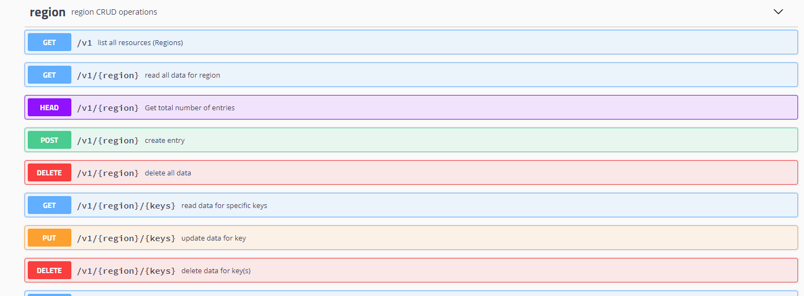

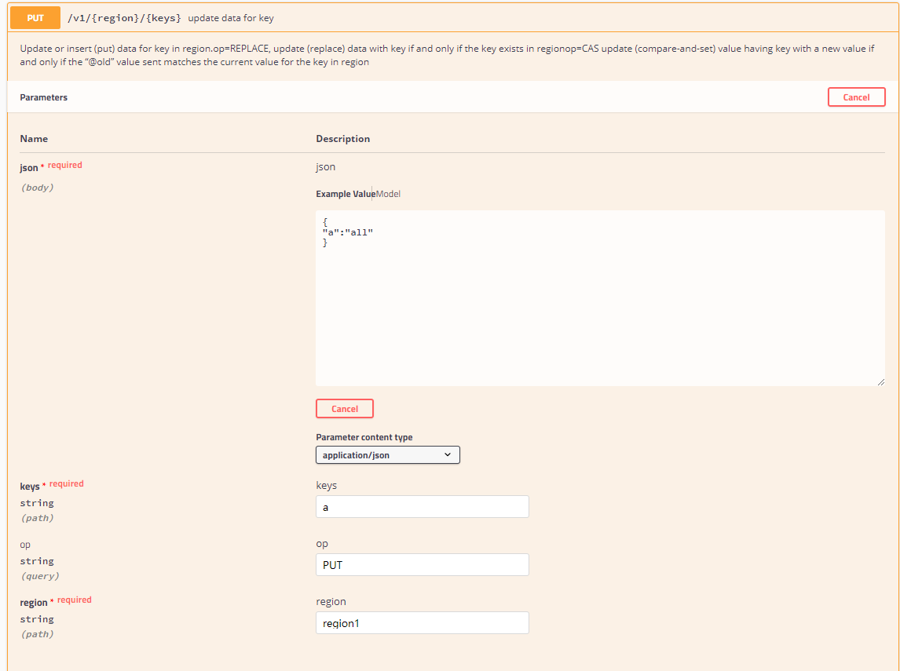

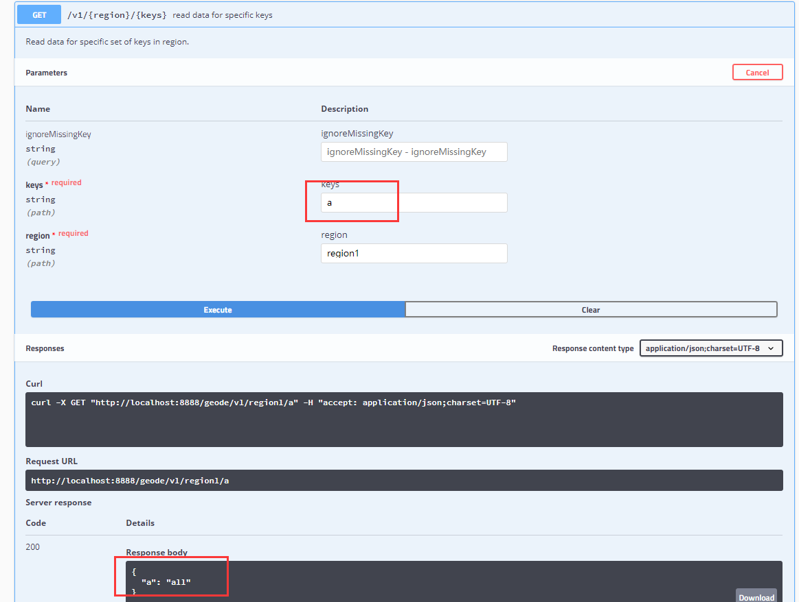

具体 API 可参考官方网页：

> [https://geode.apache.org/docs/guide/19/rest_apps/develop_rest\_apps.html](https://geode.apache.org/docs/guide/19/rest_apps/develop_rest_apps.html)

### Geode 部署模式

#### 点对点

点对点的方式也叫对等方式，就是我们没有专门的 Geode 集群，服务是迁入到我们应用程序中的。


#### C/S

该模式就是我们常用的集群模式，有一个 Geode 的中心集群，应用程序通过客户端去调用， 这个模式跟 ES 的集群， Redis 的集群非常相似。

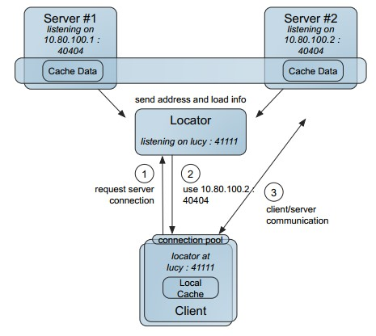

#### 多站点

所谓的多站点，就是跨机房，跨地域进行数据同步，非常适合做备份之类的部署， Geode 能够保证数据的最终一致性。目前我们的生产环境通过多站点引入备份集群，以备容灾和其他非主要业务的访问。


### Geode 滚动升级

开源软件更新换代比较快，Geode 从去年到现在已经发布了五六个版本，因此想不停机获得更好的 Geode 体验，我们做了滚动升级的尝试。

#### 备份

链接到主 Locatior 上进行导出操作：

```
gfsh>connect --jmx-manager=192.168.33.15
Connecting to Manager at [host=192.168.33.15, port=1099] ..
Successfully connected to: [host=192.168.33.15, port=1099]
Cluster-254 gfsh>list members
    Name      | Id
------------- | ---------------------------------------------------------
locator_33_15 | 192.168.33.15(locator_33_15:19946:locator)<ec><v14>:41000
locator_33_20 | 192.168.33.20(locator_33_20:15112:locator)<ec><v2>:41000
server_33_23  | 192.168.33.23(server_33_23:32677)<v4>:41000
server_33_29  | 192.168.33.29(server_33_29:14735)<v5>:41000
server_33_15  | 192.168.33.15(server_33_15:20234)<v15>:41001
server_33_20  | 192.168.33.20(server_33_20:15305)<v3>:41001
//查看server 状态
Cluster-254 gfsh>status server --name=locator_33_15
Server in /opt/geode_work18/locator_33_15 on 192.168.33.15[10334] as locator_33_15 is currently online.Process ID: 19946Uptime: 151 days 2 hours 43 minutes 43 secondsGeode Version: 1.8.0Java Version: 1.8.0_102Log File: /opt/geode_work18/locator_33_15/locator_33_15.logJVM Arguments: -Dgemfire.locators=192.168.33.15[10334],192.168.33.20[10334] -Dgemfire.enable-cluster-configuration=true -Dgemfire.load-cluster-configuration-from-dir=false -Dgemfire.max-num-reconnect-tries=100 -Dgemfire.member-timeout=120000 -Dgemfire.distributed-system-id=254 -Xms512M -Xmx1G -XX:+UseConcMarkSweepGC -XX:CMSInitiatingOccupancyFraction=60 -Dgemfire.launcher.registerSignalHandlers=true -Djava.awt.headless=true -Dsun.rmi.dgc.server.gcInterval=9223372036854775806Class-Path: /opt/apache-geode-1.8.0/lib/geode-core-1.8.0.jar:/opt/apache-geode-1.8.0/lib/geode-dependencies.jar
//导出配置文件
gfsh>export cluster-configuration --zip-file-name=./cluster-config-back.zip
File saved to /opt/./cluster-config-back.zip
```

\\1. 查看 server 状态，实际上我们是想要备份下启动参数，但是我们前边对启动进行了脚本话，因此这里就没有必要在进行启动脚本备份了，如果你没有用脚本启动，最好还是备份下，另外一种查看方式就是：

```
ps -ef | grep geode //查看启动参数
```

\\2. 第二个导出配置文件，是一些常规配置，以前修改过的，关于 region 等的一些配置。


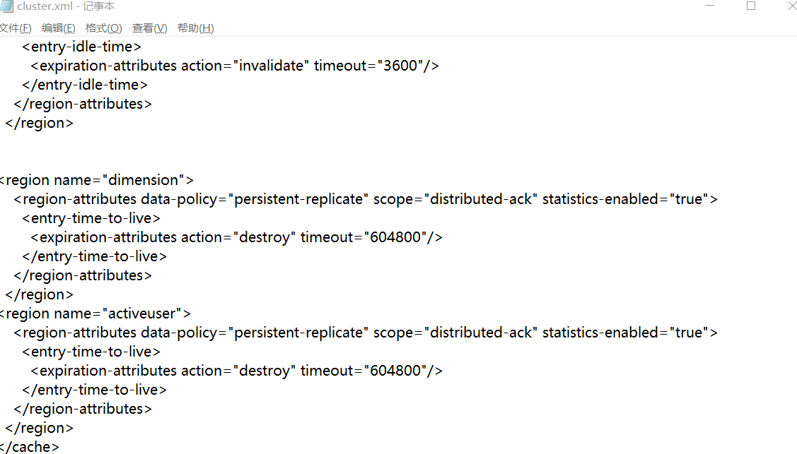

#### 拷贝新版本

准备好 1.9.2 版本并上传至服务器，拷贝至：

```
cp /tmp/upload_dir/ddh/apache-geode-1.9.2.tgz apache-geode-1.9.2.tgz
```

tar 解压：

```
tar xvf apache-geode-1.9.2.tgz
```

删除包文件：

```
rm -rf apache-geode-1.9.2.tgz
```

#### 重启 locator

##### **停止旧的主 locator**1.  链接上管理器

2. 找到主 locator 的 name
3. 执行 `stop locator --name=locator_33_15`

停止主 locator 要特别注意，经常停止不了，要用 ps 来查看 `ps -ef | grep geode`，如果不能正常停止就用 `kill -9 {locator的PID}` 来强行停止。

```
    gfsh>connect --jmx-manager=192.168.33.15
    Connecting to Manager at [host=192.168.33.15, port=1099] ..
    Successfully connected to: [host=192.168.33.15, port=1099]
    Cluster-254 gfsh>list member
        Name      | Id
    ------------- | ---------------------------------------------------------
    locator_33_15 | 192.168.33.15(locator_33_15:19946:locator)<ec><v14>:41000
    locator_33_20 | 192.168.33.20(locator_33_20:15112:locator)<ec><v2>:41000
    server_33_23  | 192.168.33.23(server_33_23:32677)<v4>:41000
    server_33_29  | 192.168.33.29(server_33_29:14735)<v5>:41000
    server_33_15  | 192.168.33.15(server_33_15:20234)<v15>:41001
    server_33_20  | 192.168.33.20(server_33_20:15305)<v3>:41001
    Cluster-254 gfsh>stop locator --name=locator_33_15
    Stopping Locator running in /opt/geode_work18/locator_33_15 on 192.168.33.15[10334] as       locator_33_15...
    Process ID: 19946
    Log File: /opt/geode_work18/locator_33_15/locator_33_15.log
    ...........
    No longer connected to 192.168.33.15[1099].
    gfsh>
    No longer connected to 192.168.33.15[1099].
    gfsh>
```

##### **修改 /etc/profile 更改环境变量**\\1. 执行 `vi /ect/profile`

\\2. 修改文件将原来 1.8 的版本改为 1.9.2

```
export PATH=JAVA_HOME/bin:/opt/apache-geode-1.9.2/bin:PATH
```

\\3. 执行生效 `source /etc/profile`

\\4. 执行 `gfsh version --fule` 查看版本，确定是新版本生效

```
Build-Date: 2019-10-15 06:08:13 -0700
Build-Id: jdeppe 0
Build-Java-Version: 1.8.0_221
Build-Platform: Mac OS X 10.14.6 x86_64
Product-Name: Apache Geode
Product-Version: 1.9.2
Source-Date: 2019-10-14 15:59:02 -0700
Source-Repository: release/1.9.2
Source-Revision: 63c8058f036316618b6cd78e6727106b7ac0a888
Native version: native code unavailable
Running on: /192.168.33.15, 4 cpu(s), amd64 Linux 2.6.32-696.23.1.el6.x86_64
```

##### **启动新 locator**\\1. 启动新的主 locator，执行启动脚本 start\_locator\_33\_15.sh

```
Locator in /opt/geode_work18/locator_33_15 on 192.168.33.15[10334] as locator_33_15 is currently online.
Process ID: 30782
Uptime: 10 seconds
Geode Version: 1.9.2
Java Version: 1.8.0_102
Log File: /opt/geode_work18/locator_33_15/locator_33_15.log
JVM Arguments: -Dgemfire.locators=192.168.33.15[10334],192.168.33.20[10334] -Dgemfire.enable-cluster-configuration=true -Dgemfire.load-cluster-configuration-from-dir=false -Dgemfire.max-num-reconnect-tries=100 -Dgemfire.member-timeout=120000 -Dgemfire.distributed-system-id=254 -Xms512M -Xmx1G -XX:+UseConcMarkSweepGC -XX:CMSInitiatingOccupancyFraction=60 -Dgemfire.launcher.registerSignalHandlers=true -Djava.awt.headless=true -Dsun.rmi.dgc.server.gcInterval=9223372036854775806
Class-Path: /opt/apache-geode-1.9.2/lib/geode-core-1.9.2.jar:/opt/apache-geode-1.9.2/lib/geode-dependencies.jar
Successfully connected to: JMX Manager [host=192.168.33.15, port=1099]
Cluster configuration service is up and running.
```

\\2. 校验新的 locator 是否正常。

```
gfsh>connect --jmx-manager=192.168.33.15
Connecting to Manager at [host=192.168.33.15, port=1099] ..
Successfully connected to: [host=192.168.33.15, port=1099]
Cluster-254 gfsh>
```

\\3. 按照如上步骤依次重启其他机器上的 locator。

#### 重启 server

##### **重启旧版本的 server**

\\1. 停止 server

注意：要在主 locator 节点上的 gfsh 里执行，现在我们的主是 33.20 因此我们上到这台机器并连接 JMX 进行管理。

```
stop server --name=server_33_15
```

\\2. 如果 server 没有与 locator 在一起的话， 需要按上边的步骤进行版本更新。

* 上传新版版
* 解压
* 更改 /etc/profile 配置

\\3. 去 33.15 机器上执行启动 server 的脚本。

```
sh start_server_33_15.sh
```

\\4. 其他 server 依次执行重启。

#### 检查

* 检查 locator 和 server => list member
* 检查 region ==> list region
* 检查 `<http://$>{主locator的IP}:7070/pulse/`

#### 升级客户端

升级完服务之后，我们可以进行客户端的升级，实践中如果不升级对现有执行也是没有影响。

关于客户端我们这有一个小插曲，忘记是升级 1.7 还是 1.8 的时候，我们的 Tomcat 7.0.57 的版本会报异常。

```
严重: Unable to process Jar entry [module-info.class] from Jar [jar:file:/data/xxx/jiekou/WEB-INF/lib/classgraph-4.0.6.jar!/] for annotations
```

但是并不影响程序使用，可是每次启动都报个异常总是不开心的。

借着这个契机，我们升级了 Tomcat 8.5。

原因解读：

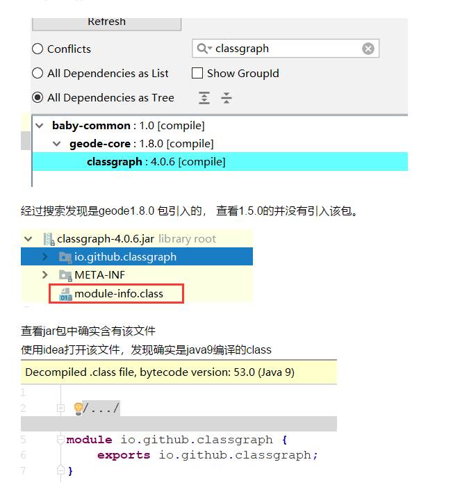

新的 1.8 的 client 包引入了新的类，这个新的类有 Java 9 的模块化信息，然后这个版本的 Tomcat 是无法扫描模块化 jar 包的。


看 Tomcat 官网发现，在 7.0.83 的时候才支持了这个问题。使用了 7.0.91 测试就不报哪个异常了。

因此我们选择了直接升级到 8.5。

#### 滚动升级影响

从升级实践中来看，虽然做不到完全无感知，但是每秒近 5 万的 ops，在升级过程中报错的请求不超过 500 次。

### Geode 数据计算初探

Geode 对外宣称自己是一个内存计算框架，我们一直都是使用的内存特性，KV 结构的特性，把他当成 Redis，Memcache 的替代品，那么我们本小节来尝试一下 Geode 的计算功能，所谓的计算就是 function 特性。

函数是驻留在服务器上的代码体，应用程序可以从客户机或另一台服务器调用它，而不需要发送函数代码本身。调用方可以指示依赖于数据的函数对特定数据集进行操作，也可以指示独立于数据的函数对特定服务器、成员或成员组进行操作。

我们可以这么简单来理解就是我将一部分代码处理逻辑上传到服务器上，然后我再服务器上执行相关代码，那么这有什么好处呢？快！比如批量处理某些 key 我不需要网络开销了直接在服务器上执行。

下边我们开发一个 region 函数，一次获取多个键值类似于 multiGet 命令。

**1\. 开发函数**

```
public class MultiGetFunction implements Function {
    /**
     * Cluster-254 gfsh>execute function --id=func-a --region=test99 --filter=KEY_4,KEY_7
     * @param context
     */
    @Override
    public void execute(FunctionContext context) {
        System.out.println("执行function");
        if(! (context instanceof RegionFunctionContext)){
            throw new FunctionException("This is a data aware function, and has to be called using FunctionService.onRegion.");
        }
        //进行强制转换
        RegionFunctionContext regionFunctionContext = (RegionFunctionContext)context;
        //从filter 中获取set，这个在调用的时候传递
        Set keys = regionFunctionContext.getFilter();
        Set keysTillSecondLast = new HashSet();
        int setSize = keys.size();
        Iterator keysIterator = keys.iterator();
        for(int i = 0; i < (setSize -1); i++) {
            keysTillSecondLast.add(keysIterator.next());
        }
        for (Object k : keysTillSecondLast) {
            context.getResultSender().sendResult(
                    (Serializable) PartitionRegionHelper.getLocalDataForContext(regionFunctionContext)
                            .get(k));
        }
        Object lastResult = keysIterator.next();
        //必须发送lastresult
        //不然报错server_33_15 | ERROR  | Exception: The function, func-a, did not send last result
        context.getResultSender().lastResult(
                (Serializable)PartitionRegionHelper.getLocalDataForContext(regionFunctionContext)
                        .get(lastResult));
    }
    // 每个函数都应该给一个id ，后续调用会使用到
    public String getId() {
        return "func-a";
    }
}
```

**2\. deploy 到服务器**我们写好后打成 jar 包上传到服务器，gfsh 执行 deploy 命令：

```
deploy --jar=/tmp/upload_dir/ddh/geode-study.jar
   Member    |  Deployed JAR   | Deployed JAR Location
------------ | --------------- | -----------------------------------------------
server_33_15 | geode-study.jar | /opt/geode_work/server_33_15/geode-study.v5.jar
server_33_20 | geode-study.jar | /opt/geode_work/server_33_20/geode-study.v5.jar
server_33_23 | geode-study.jar | /opt/geode_work/server_33_23/geode-study.v5.jar
server_33_29 | geode-study.jar | /opt/geode_work/server_33_29/geode-study.v5.jar
```

我们在做 deploy 的时候，Geode 会自动将实现了 function 接口的类型进行函数注册。**3\. 执行函数**方式一：

```
Cluster-254 gfsh>execute function --id=func-a --region=test99 --filter=KEY_4,KEY_7
   Member    | Status | Message
------------ | ------ | -------
server_33_15 | OK     | [7, 5]
```

方式二：

```
@Test
    public void testFunction() {
        GeodeService geodeService = new GeodeService(str);
        geodeService.init();
        ClientCache clientCache = geodeService.geodeClient();
        MultiGetFunction multiGetFunction = new MultiGetFunction();
        //要获取key 的集合
        Set keysForGet = new HashSet();
        keysForGet.add("KEY_4");
        keysForGet.add("KEY_9");
        keysForGet.add("KEY_7");
        Execution execution = FunctionService.onRegion(geodeService.getRegion(GeodeRegion.test99))
                .withFilter(keysForGet)
                .setArguments(Boolean.TRUE)
                //这里可以定义自己的 收集器
                //.withCollector(new MyArrayListResultCollector())
                ;
        ResultCollector rc = execution.execute(multiGetFunction);
        //拿到返回结果
        List result = (List)rc.getResult();
        System.out.println("result = >>" + JSONObject.toJSONString(result));
    }
```

### Geode 图形化与监控

#### 图形化

图形化我们通过 Geode 自带的 pulse 后台功能来访问，能看到实时的状态访问地址：

```
http://192.168.33.15:7070/pulse
```

在 locator 变为 leader 之后会自动启用 pulse，用户名密码为 admin/admin。

pulse 中可以在不同维护查看数据。**1\. 总览**内存，成员数，服务数，region 数量，集群读写等等。

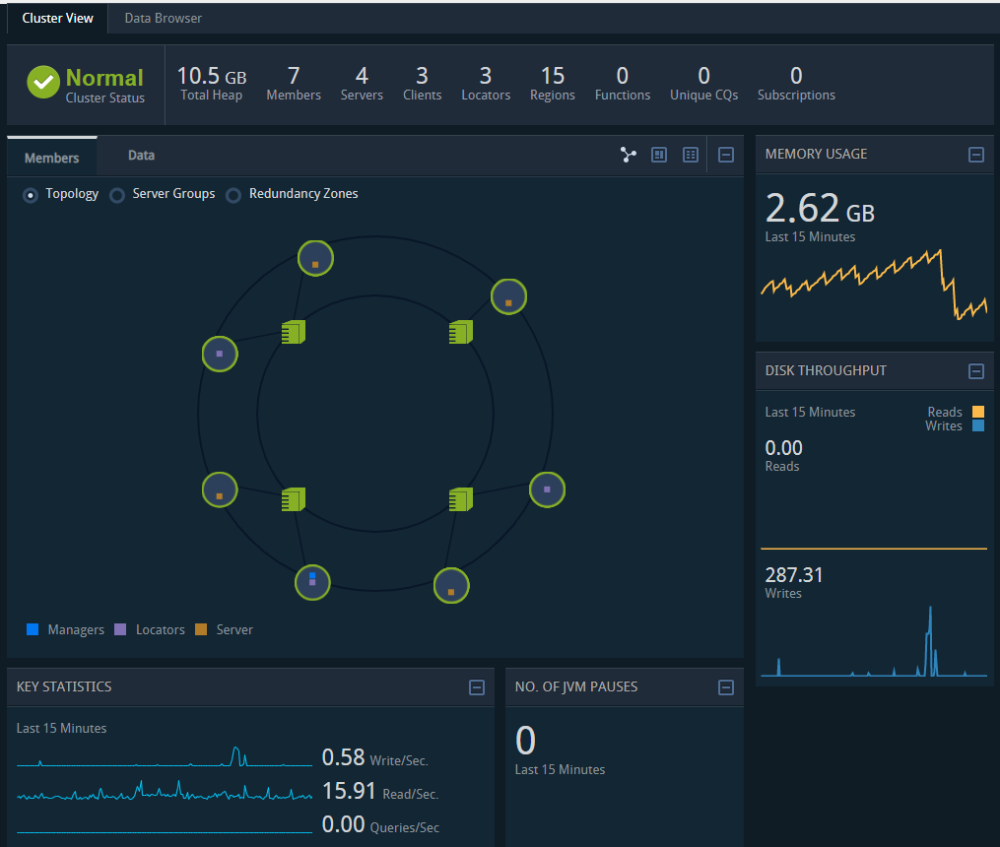**2\. ip 维度**这里多了一个机器的链接详情：

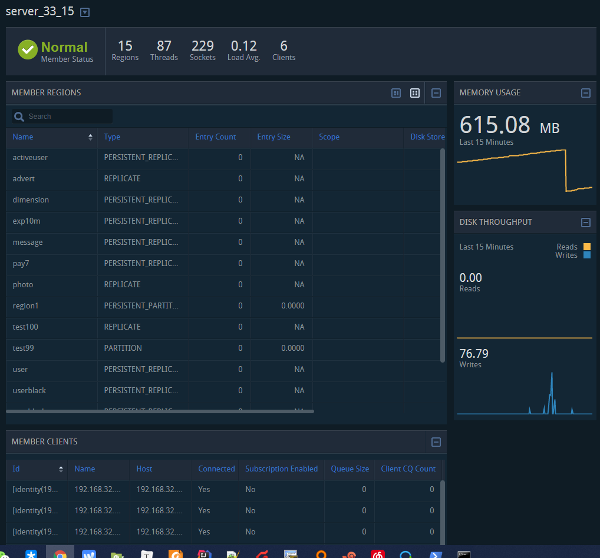**3\. region 维度**

region 维度主要对 region 进行描述：

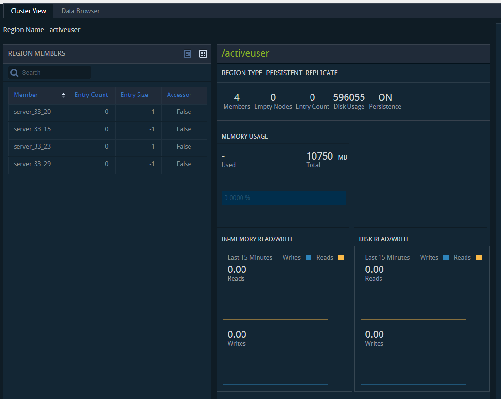

#### 监控

监控有两种方式。

#### gfsh 脚本进行监控

这种监控一些数量大小之类的还可以，目前还没发现对读、写等详细的指标命令。

#### JMX 获取数据进行监控

```
JMXConnector conn = null;
        String host = "192.168.33.15";
        int port = 1099;
        JMXServiceURL address = new JMXServiceURL("service:jmx:rmi://" + host + "/jndi/rmi://" + host + ":" + port + "/jmxrmi");
        Map<String, Object> env = new HashMap<String, Object>();
        //创建连接
        conn = JMXConnectorFactory.connect(address, env);
        MBeanServerConnection mbs = conn.getMBeanServerConnection();
Set<ObjectName> mbeanNames = mbs.queryNames(new ObjectName(PulseConstants.OBJECT_NAME_SYSTEM_DISTRIBUTED), null);
//这是监控系统需要的数据模型
MetricBuiler builer = MetricBuiler.newBuilder()
  .name("geode.cluster.sys").comeFrom(MetricSourceCode.COMP_SOURCE)
  .ip("cluster").domain(domainEntity.getDomainCode()).port(80)
  .value(1);
//从 mbean 中取出对应监控数据
for (ObjectName mbeanName : mbeanNames) {
  AttributeList attributeList =
  mbs.getAttributes(mbeanName, PulseConstants.CLUSTER_MBEAN_ATTRIBUTES);
  attributeList.forEach(o -> {
  Attribute attribute = (Attribute) o;
  builer.addData(attribute.getName(), Double.valueOf(attribute.getValue().toString()));
  });
  Long attribute = (Long) mbs.getAttribute(mbeanName, "JVMPauses");
  builer.addData("JVMPauses", attribute);
}
Metric build = builer.build();
MetricGuageUtil.guage(build, "JVMPauses");
metricList.add(build);
```

关于 JMX 的数据结构大家可以使用 jvisualvm 连接查看：

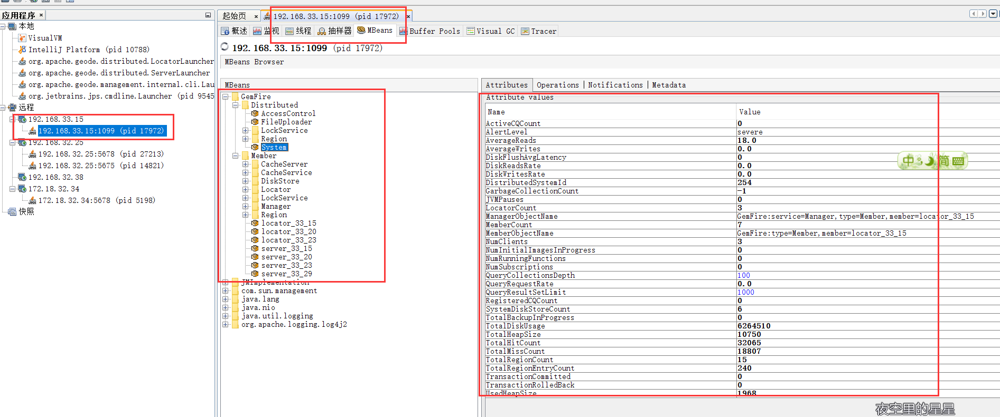

看它的目录结构，我们可以发现其实它就是按照集群、ip、region 进行区分的，与它的 pulse 中所能显示的保持一致性。

我们通过 job 采集的数据最终入到 ES 中，并在这期间判定是否需要报警，如果需要的话会发送邮件、短信、企业微信机器人。

进入 ES 后我们再通过 Grafana 进行展示，这样就可以看见历史指标的波动情况，为分析问题提供依据。

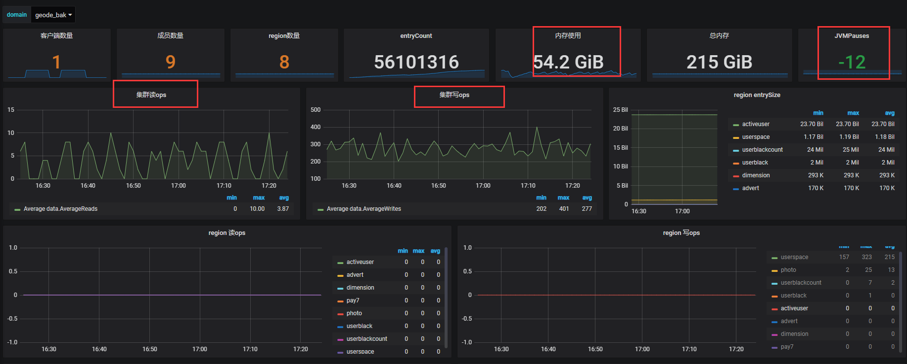

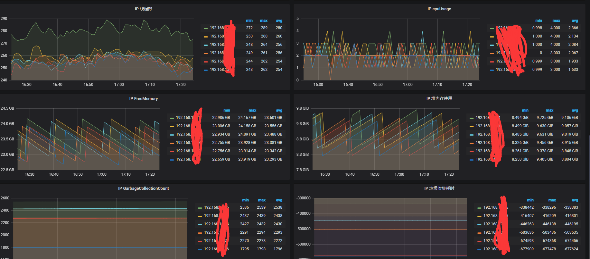

如上图所示是我们的一些重点指标。

但是 Geode 的统计也不是那么的准的，主要有以下问题：

* jvmPauses 算出来时间段内是负数的
* 同样垃圾收集时间和次数也都不对
* 同一时刻，集群的总 ops 和各个 region 的 ops 总合是不相等的
* 另外 pulse 上显示的 ops 是 15 分钟平均的值

### Geode 常见故障与恢复

#### 从机器崩溃中恢复

当计算机因关闭、断电、硬件故障或操作系统故障而崩溃时，其所有应用程序和缓存服务器及 其本地缓存都将丢失。其他计算机上的系统成员会收到通知，说明此计算机的成员已意外离开集群。

**要从机器崩溃中恢复：**1.  确定在此计算机上运行的进程。
2.  重新启动机器。
3.  如果 Geode 定位器在此处运行，请先启动它。注意：在启动任何应用程序或缓存服务器之前，必须至少运行一个定位器。
4.  按常规顺序启动应用程序和缓存服务器。

#### 防止和恢复磁盘完全错误

监视 Geode 成员的磁盘使用情况非常重要。 如果成员缺少足够的磁盘空间用于磁盘存储，则该成员会尝试关闭磁盘存储及其关联的缓存，并记录错误消息。由于成员磁盘空间不足而导致的关闭可能导致数据丢失，数据文件损坏，日志文件损坏以及可能对您的应用程序产生负面影响 的其他错误情况。为成员提供足够的磁盘空间后，可以重新启动该成员。**换言之，一定要做磁盘容量监控！**#### java.lang.OutOfMemoryError

如果应用程序经常内存不足，您可能需要对其进行分析以确定原因，可以尝试 -Xmx 重置最大堆大小来增加直接内存。

如果出现这样的错误，可以尝试更改 -Xss 参数：

```
OutOfMemoryError: unable to create new native thread
```

#### 网络分区

```
Membership coordinator id has declared that a network partition has  occurred.
```

发生网络分区时会发出此警报，然后在单个成员上发出此警报：

```
Exiting due to possible network partition event due to loss of {0} cache processes: {1}
```

此时需要检查列出的缓存进程的网络连接和运行状况。

#### 成员太长时间没有回应

```
15 sec have elapsed while waiting for replies: <ReplyProcessor21 6
waiting for 1 replies
from [ent(27130):60333/36743]> on ent(27134):60330/45855 whose current
membership
list is: [[ent(27134):60330/45855, ent(27130):60333/36743]]
```

描述：成员（27130）60333/36743 由于可疑验证失败而面临被迫退出集群的危险。在达到 ack-wait-threshold 之后，将在警告级别发出此警报。

操作员应检查过程以确定其是否健康。 在名为 ent 的机器上，慢响应器的进程 ID 是 27130。慢响应者的端口是 60333/36743。 查找字符串，Starting distribution manager ent：60333/36743，并检查拥有包含此字符串的日志文件的进程。**如上只是摘抄了几个官方常见异常**，[具体请查看这里](https://geode.apache.org/docs/guide/19/managing/troubleshooting/chapter_overview.html)。

实际在近一年多的使用中，并未发现不可思议的异常与灾难。

### 目前我司使用情况

1. 我司从 2018 年 7 月开始引入 Geode，当时版本是 1.5。
2. 目前已经接入近 10 个功能点，读调用量高峰时期在 50000 ops 左右。
3. 8 台 机器，8 个 server 3 个 locator。
4. 通过 wan 有一组备份机器，有一些非实时性业务访问备份机器
5. 其他业务线也正在尝试上 Geode。
6. 稳定性 ok，目前线上没出过问题。
7. 滚动升级很方便，升级对程序影响可忽略。
8. 我们预备上更多的业务线，替下 Couchbase 大部分业务。
9. 目前只用了 KV 的功能，后续尝试使用对象存储和 query 查询。

### 其他

代码地址：

> [https://gitee.com/gavinage/geode\_study](https://gitee.com/gavinage/geode_study)

#### Geode 扩展功能**memCache 适配器**```

gfsh>start server
  --name=<server_name>
  --server-port=<port_number>
  --memcached-port=<port_number>
  --memcached-protocol=BINARY|ASCII

```** HTTP 分布式 session **之前接触的分布式 session 方案是 Redis-cluster + Tomcat 来做的， 其实道理是一样的， Geode 替换了 Redis 就成功 geode-session-Tomcat 了。

Geode 使用了不小的篇幅来描述该扩展功能，[详见](https://geode.apache.org/docs/guide/110/tools_modules/http_session_mgmt/quick_start.html)。** Redis 适配器 **```
gfsh> start server --name=server1 --redis-bind-address=localhost \
 --redis-port=11211 --J=-Dgemfireredis.regiontype=PARTITION_PERSISTENT
```

来自官方的夸奖：

> Geode 相比较 Redis 具有多线程、高并发、扩展性强、结果报告， 并且 Geode wan 复制模式能够水平扩展，跨数据中心还能维护数据一致性。

虽然这么厉害，但是经过简单测试，还是不要冒险改用 Redis，老老实实用 Redis。**Lucene 支持**

Geode 底层引入了 Lucene 的包并支持创建 index、查询 index，换句话说 Geode 引入了 Lucene 的一些特性在它的内部，依然持有和 Redis 一样的观点，改用 ES 还是老老实实去用 ES 吧。

### 总结

Geode 值得一试，铁总那么大的访问量，那么高的实时性要求，使用 Geode 都能扛得住，这是最成功的案例，我们也正在实践，也期望 Geode 能像描述的一样，不负众望。
