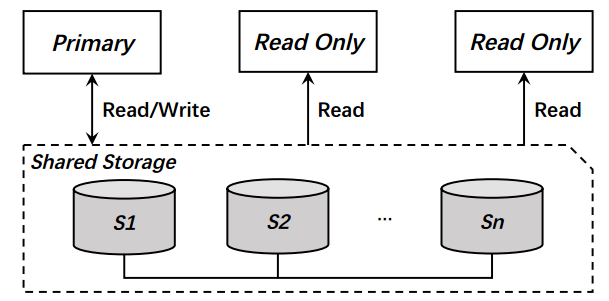
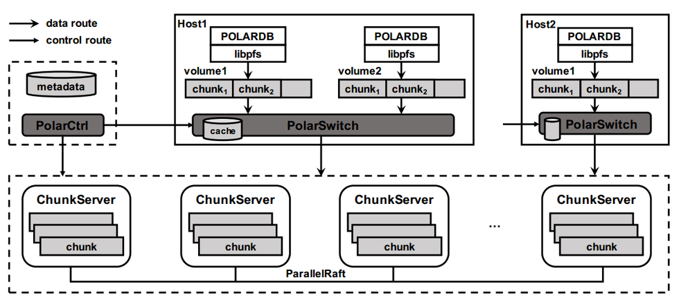
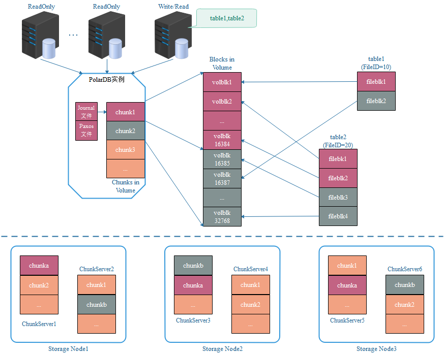
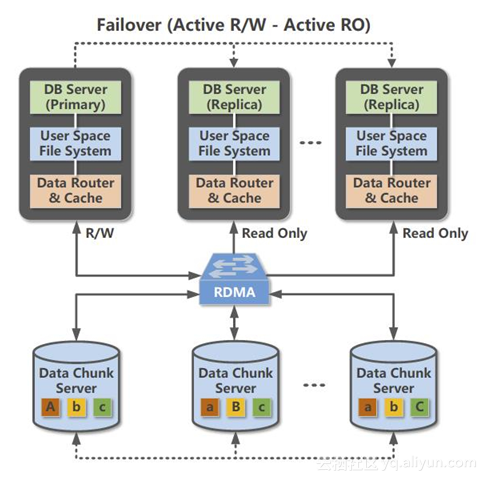
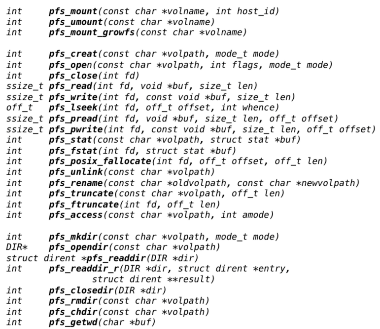
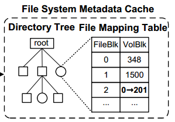

# 阿里云PolarDB及其共享存储PolarFS技术实现分析（上）

PolarDB是阿里云基于MySQL推出的云原生数据库（Cloud Native Database）产品，通过将数据库中计算和存储分离，多个计算节点访问同一份存储数据的方式来解决目前MySQL数据库存在的运维和扩展性问题；通过引入RDMA和SPDK等新硬件来改造传统的网络和IO协议栈来极大提升数据库性能。代表了未来数据库发展的一个方向。本系列共2篇文章，主要分析为什么会出现PolarDB以及其技术实现。

由于PolarDB并不开源，因此只能基于阿里云公开的技术资料进行解读。这些资料包括从去年下半年开始陆续在阿里云栖社区、云栖大会等场合发布的PolarDB相关资料，以及今年以来公开的PolarDB后端共享存储PolarFS相关文章。

PolarDB出现背景

MySQL云服务遇到的问题

首先来了解下为什么会出现PolarDB。阿里云数据库团队具备国内领先的技术能力，为MySQL等数据库在国内的推广起到了很大的作用。在阿里云上也维护了非常庞大的MySQL云服务（RDS）集群，但也遇到了很多棘手的问题。举例如下：

- 实例数据量太大，单实例几个TB的数据，这样即使使用xtrabackup物理备份，也需要很长的备份时间，且备份期间写入量大的话可能导致redo日志被覆盖引起备份失败；
- 大实例故障恢复需要重建时，耗时太长，影响服务可用性（此时存活节点也挂了，那么完蛋了）。时间长有2个原因，一是备份需要很长时间，二是恢复的时候回放redo也需要较长时间；
- 大实例做只读扩展麻烦，因为只读实例的数据是单独一份的，所以也需要通过备份来重建；
- RDS实例集群很大，包括成千上万个实例，可能同时有很多实例同时在备份，会占用云服务巨大的网络和IO带宽，导致云服务不稳定；
- 云服务一般使用云硬盘，导致数据库的性能没有物理机实例好，比如IO延时过高；
- 主库写入量大的时候，会导致主从复制延迟过大，semi-sync/半同步复制也没法彻底解决，这是由于mysql基于binlog复制，需要走完整的mysql事务处理流程。
- 对于需要读写分离，且要求部署多个只读节点的用户，最明显的感觉就是每增加一个只读实例，成本是线性增长的。

其实不仅仅是阿里云RDS，网易云上的RDS服务也有数千个实例，同样遇到了类似的问题，我们是亲身经历而非感同身受。应该说就目前的MySQL技术实现方案，要解决上述任何一个问题都不是件容易的事情，甚至有几个问题是无法避免的。

现有解决方案及不足

那么，跳出MySQL，是否有解决方案呢，分析目前业界的数据库和存储领域技术，可以发现基于共享存储是个可选的方案，所谓数据库共享存储方案指的是RDS实例（一般指一主一从的高可用实例）和只读实例共享同一份数据，这样在实例故障或只读扩展时就无需拷贝数据了，只需简单得把故障节点重新拉起来，或者新建个只读计算节点即可，省时省力更省钱。共享存储可通过快照技术（snapshot/checkpoint）和写时拷贝（copy-on-write，COW）来解决数据备份和误操作恢复问题，将所需备份的数据量分摊到较长的一段时间内，而不需要瞬时完成，这样就不会导致多实例同时备份导致网络和IO数据风暴。下图就是一个典型的数据库共享存储方案，Primary节点即数据库主节点，对外提供读写服务，Read Only节点可以是Primary的灾备节点，也可以是对外提供只读服务的节点，他们共享一份底层数据。

理想很丰满，但现实却很骨感，目前可用的共享存储方案寥寥无几，比如在Hadoop生态圈占统治地位的HDFS，以及在通用存储领域风生水起的Ceph，只是如果将其作为在线数据处理（OLTP）服务的共享存储，最终对用户呈现的性能是不可接受的。除此之外，还存在大量与现有数据库实现整合适配等问题。

PolarDB实现方案

云原生数据库

说道云原生数据库，就不得不提Aurora。其在2014年下半年发布后，轰动了整个数据库领域。Aurora对MySQL存储层进行了大刀阔斧的改造，将其拆为独立的存储节点(主要做数据块存储，数据库快照的服务器)。上层的MySQL计算节点(主要做SQL解析以及存储引擎计算的服务器)共享同一个存储节点，可在同一个共享存储上快速部署新的计算节点，高效解决服务能力扩展和服务高可用问题。基于日志即数据的思想，大大减少了计算节点和存储节点间的网络IO，进一步提升了数据库的性能。再利用存储领域成熟的快照技术，解决数据库数据备份问题。被公认为关系型数据库的未来发展方向之一。截止2018年上半年，Aurora已经实现了多个计算节点同时提供写服务的能力，继续在云原生数据库上保持领先的地位。

不难推断，在Aurora发布3年后推出的PolarDB，肯定对Aurora进行了深入的研究，并借鉴了很多技术实现方法。关于Aurora的分析，国内外，包括公司内都已进行了深入分析，本文不再展开描述。下面着重介绍PolarDB实现。我们采用先存储后计算的方式，先讲清楚PolarFS共享存储的实现，再分析PolarDB计算层如何适配PolarFS。

PolarDB架构

上图为PolarFS视角看到的PolarDB实现架构。一套PolarDB至少包括3个部分，分别为最底层的共享存储，与用户交互的MySQL节点，还有用户进行系统管理的PolarCtrl。而其中PolarFS又可进一步拆分为libpfs、PolarSwitch和ChunkServer。下面进行简单说明：

- MySQL节点，即图中的POLARDB，负责用户SQL解析、事务处理等数据库相关操作，扮演计算节点角色；
- libpfs是一个用户空间文件系统库，提供POSIX兼容的文件操作API接口，嵌入到PolarDB负责数据库IO（File IO）接入；
- PolarSwitch运行在计算节点主机（Host）上，每个Host部署一个PolarSwitch的守护进程，其将数据库文件IO变换为块设备IO，并发送到具体的后端节点（即ChunkServer）；
- ChunkServer部署在存储节点上，用于处理块设备IO（Block IO）请求和节点内的存储资源分布；
- PolarCtrl是系统的控制平面，PolarFS集群的控制核心，所有的计算和存储节点均部署有PolarCtrl的Agent。

PolarFS的存储组织

与大多数存储系统一样，PolarFS对存储资源也进行了多层封装和管理，PolarFS的存储层次包括：Volume、Chunk和Block，分别对应存储领域中的数据卷，数据区和数据块，在有些系统中Chunk又被成为Extent，均表示一段连续的块组成的更大的区域，作为分配的基本单位。一张图可以大致表现各层的关系：

**Volume** 当用户申请创建PolarDB数据库实例时，系统就会为该实例创建一个Volume（卷，本文后续将这两种表达混用），每个卷都有多个Chunk组成，其大小就是用户指定的数据库实例大小，PolarDB支持用户创建的实例大小范围是10GB至100TB，满足绝大部分云数据库实例的容量要求。

跟其他传统的块设备一样，卷上的读写IO以512B大小对齐，对卷上同个Chunk的修改操作是原子的。当然，卷还是块设备层面的概念，在提供给数据库实例使用前，需在卷上格式化一个PolarFS文件系统（PFS）实例，跟ext4、btrfs一样，PFS上也会在卷上存放文件系统元数据。这些元数据包括inode、directory entry和空闲块等对象。同时，PFS也是一个日志文件系统，为了实现文件系统的元数据一致性，元数据的更新会首先记录在卷上的Journal（日志）文件中，然后才更新指定的元数据。

跟传统文件系统不一样的是PolarFS是个共享文件系统即一个卷会被挂载到多个计算节点上，也就是说可能存在有多个客户端（挂载点）对文件系统进行读写和更新操作，所以PolarFS在卷上额外维护了一个Paxos文件。每个客户端在更新Journal文件前，都需要使用Paxos文件执行Disk Paxos算法实现对Journal文件的互斥访问。更详细的PolarFS元数据更新实现，后续单独作为一个小节。 **Chunk** 前面提到，每个卷内部会被划分为多个Chunk（区），区是数据分布的最小粒度，每个区都位于单块SSD盘上，其目的是利于数据高可靠和高可用的管理，详见后续章节。每个Chunk大小设置为10GB，远大于其他类似的存储系统，例如GFS为64MB，Linux LVM的物理区（PE）为4MB。这样做的目的是减少卷到区映射的元数据量大小（例如，100TB的卷只包含10K个映射项）。一方面，全局元数据的存放和管理会更容易；另一方面，元数据可以全都缓存在内存中，避免关键IO路径上的额外元数据访问开销。

当然，Chunk设置为10GB也有不足。当上层数据库应用出现区域级热点访问时，Chunk内热点无法进一步打散，但是由于每个存储节点提供的Chunk数量往往远大于节点数量（节点:Chunk在1:1000量级），PolarFS支持Chunk的在线迁移，其上服务着大量数据库实例，因此可以将热点Chunk分布到不同节点上以获得整体的负载均衡。

在PolarFS上，卷上的每个Chunk都有3个副本，分布在不同的ChunkServer上，3个副本基于ParallelRaft分布式一致性协议来保证数据高可靠和高可用。 **Block**

在ChunkServer内，Chunk会被进一步划分为163,840个Block（块），每个块大小为64KB。Chunk至Block的映射信息由ChunkServer自行管理和保存。每个Chunk除了用于存放数据库数据的Block外，还包含一些额外Block用来实现预写日志（Write Ahead Log，WAL）。

需要注意的是，虽然Chunk被进一步划分为块，但Chunk内的各个Block在SSD盘是物理连续的。PolarFS的VLDB文章里提到“Blocks are allocated and mapped to a chunk on demand to achieve thin provisioning”。thin provisioning就是精简配置，是存储上常用的技术，就是用户创建一个100GB大小的卷，但其实在卷创建时并没有实际分配100GB存储空间给它，仅仅是逻辑上为其创建10个Chunk，随着用户数据不断写入，PolarFS不断分配物理存储空间供其使用，这样能够实现存储系统按需扩容，大大节省存储成本。

那么为何PolarFS要引入Block这个概念呢，其中一个是跟卷上的具体文件相关，我们知道一个文件系统会有多个文件，比如InnoDB数据文件\*.ibd。每个文件大小会动态增长，文件系统采用预分配（fallocate()）为文件提前分配更多的空间，这样在真正写数据的时无需进行文件系统元数据操作，进而优化了性能。显然，每次给文件分配一个Chunk，即10GB空间是不合理的，64KB或其倍数才是合适的值。上面提到了精简配置和预分配，看起来是冲突的方法，但其实是统一的，精简配置的粒度比预分配的粒度大，比如精简配置了10GB，预分配了64KB。这样对用户使用没有任何影响，同时还节省了存储成本。

PolarFS组件解析

首先展示一张能够更加清晰描述与数据流相关的各个组件作用的示意图，并逐一对其进行解释。

**libpfs** libpfs是一个用户空间文件系统（即上图User Space File System）库，负责数据库IO（File IO）接入。更直观点，libpfs提供了供计算节点/PolarDB访问底层存储的API接口，进行文件读写和元数据更新等操作，如下图所示：

pfs_mount()用于将指定卷上文件系统挂载到对应的数据库计算节点上，该操作会获取卷上的文件系统元数据信息，将其缓存在计算节点上，这些元数据信息包括目录树（the directory tree），文件映射表（the file mapping table）和块映射表（the block mapping table）等，其中目录树描述了文件目录层级结构信息，每个文件名对应的inode节点信息（目录项）。inode节点信息就是文件系统中唯一标识一个文件的FileID。文件映射表描述了该文件都有哪些Block组成。通过上图我们还发现了pfs_mount_growfs()，该API可以让用户方便得进行数据库扩容，在对卷进行扩容后，通过调用该API将增加的空间映射到文件系统层。

上图右侧的表描述了目录树中的某个文件的前3个块分别对应的是卷的第348,1500和201这几个块。假如数据库操作需要回刷一个脏页，该页在该表所属文件的偏移位置128KB处，也就是说要写该文件偏移128KB开始的16KB数据，通过文件映射表知道该写操作其实写的是卷的第201个块。这就是lipfs发送给PolarSwitch的请求包含的内容：volumeid，offset和len。其中offset就是201\*64KB，len就是16KB。

**PolarSwitch** PolarSwitch是部署在计算节点的Daemon，即上图的Data Router&Cache模块，它负责接收libpfs发送而来的文件IO请求，PolarSwitch将其划分为对应的一到多个Chunk，并将请求发往Chunk所属的ChunkServer完成访问。具体来说PolarSwitch根据自己缓存的volumeid到Chunk的映射表，知道该文件请求属于那个Chunk。请求如果跨Chunk的话，会将其进一步拆分为多个块IO请求。PolarSwitch还缓存了该Chunk的三个副本分别属于那几个ChunkServer以及哪个ChunkServer是当前的Leader节点。PolarSwitch只将请求发送给Leader节点。 **ChunkServer** ChunkServer部署在存储节点上，即上图的Data Chunk Server，用于处理块IO（Block IO）请求和节点内的存储资源分布。一个存储节点可以有多个ChunkServer，每个ChunkServer绑定到一个CPU核，并管理一块独立的NVMe SSD盘，因此ChunkServer之间没有资源竞争。

ChunkServer负责存储Chunk和提供Chunk上的IO随机访问。每个Chunk都包括一个WAL，对Chunk的修改会先写Log再执行修改操作，保证数据的原子性和持久性。ChunkServer使用了3D XPoint SSD和普通NVMe SSD混合型WAL buffer，Log会优先存放到更快的3DXPoint SSD中。

前面提到Chunk有3副本，这三个副本基于ParallelRaft协议，作为该Chunk Leader的ChunkServer会将块IO请求发送给Follow节点其他ChunkServer）上，通过ParallelRaft一致性协议来保证已提交的Chunk数据不丢失。 **PolarCtrl**

PolarCtrl是系统的控制平面，相应地Agent代理被部署到所有的计算和存储节点上，PolarCtrl与各个节点的交互通过Agent进行。PolarCtrl是PolarFS集群的控制核心，后端使用一个关系数据库云服务来管理PolarDB的元数据。其主要职责包括：

- 监控ChunkServer的健康状况，包括剔除出现故障的ChunkServer，维护Chunk多个副本的关系，迁移负载过高的ChunkServer上的部分Chunk等；
- Volume创建及Chunk的布局管理，比如Volume上的Chunk应该分配到哪些ChunkServer上；
- Volume至Chunk的元数据信息维护；
- 向PolarSwitch推送元信息缓存更新，比如因为计算节点执行DDL导致卷上文件系统元数据更新，这些更新可通过PolarCtrl推送给PolarSwitch；
- 监控Volume和Chunk的IO性能，根据一定的规则进行迁移操作；
- 周期性地发起副本内和副本间的CRC数据校验。

本篇主要是介绍了PolarDB数据库及其后端共享存储PolarFS系统的基本架构和组成模块，是最基础的部分。下一篇重点分析PolarFS的数据IO流程，元数据更新流程，以及PolarDB数据库节点如何适配PolarFS这样的共享存储系统。
