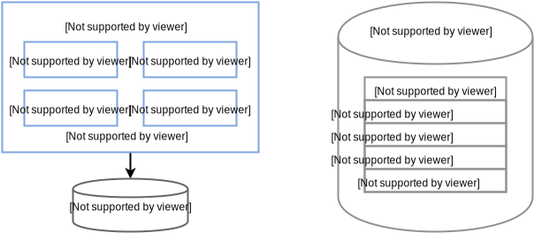
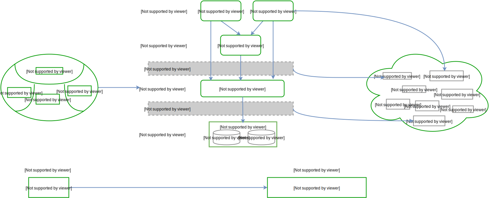
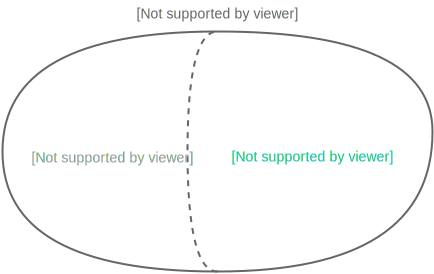
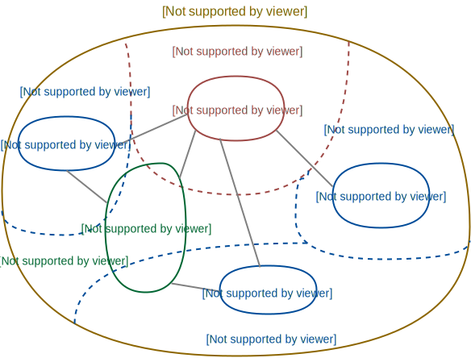
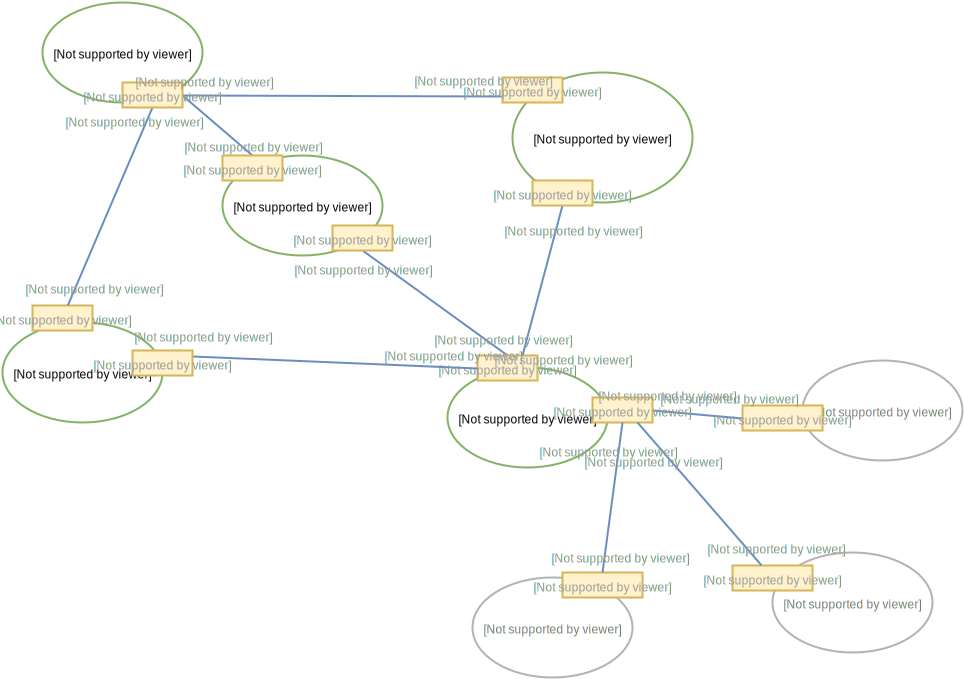
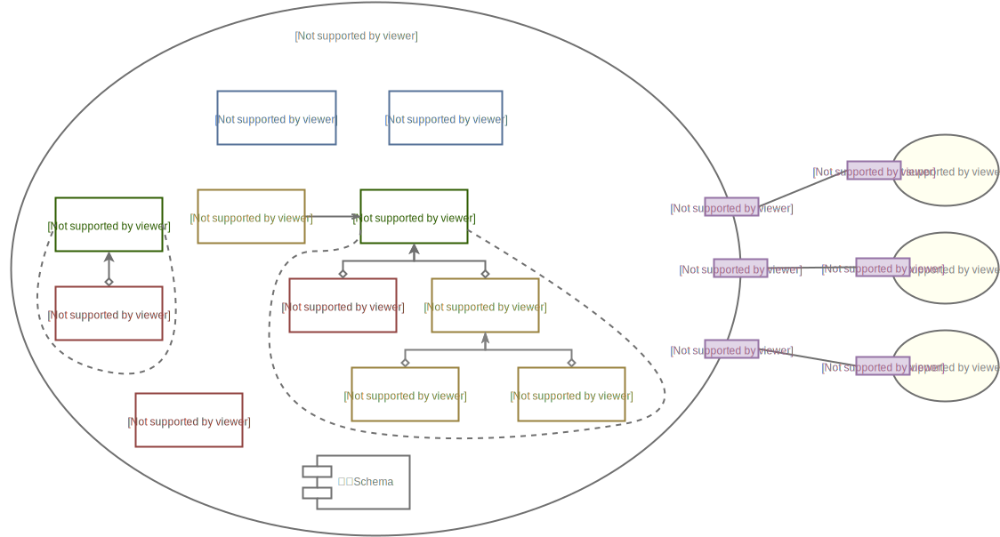
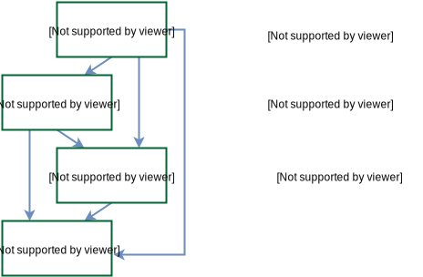

# 领域驱动设计在互联网业务开发中的实践

至少30年以前，一些软件设计人员就已经意识到领域建模和设计的重要性，并形成一种思潮，Eric Evans将其定义为领域驱动设计（Domain-Driven Design，简称DDD）。在互联网开发“小步快跑，迭代试错”的大环境下，DDD似乎是一种比较“古老而缓慢”的思想。然而，由于互联网公司也逐渐深入实体经济，业务日益复杂，我们在开发中也越来越多地遇到传统行业软件开发中所面临的问题。本文就先来讲一下这些问题，然后再尝试在实践中用DDD的思想来解决这些问题。

## 过度耦合

业务初期，我们的功能大都非常简单，普通的CRUD就能满足，此时系统是清晰的。随着迭代的不断演化，业务逻辑变得越来越复杂，我们的系统也越来越冗杂。模块彼此关联，谁都很难说清模块的具体功能意图是啥。修改一个功能时，往往光回溯该功能需要的修改点就需要很长时间，更别提修改带来的不可预知的影响面。

下图是一个常见的系统耦合病例。



服务耦合示意图

订单服务接口中提供了查询、创建订单相关的接口，也提供了订单评价、支付、保险的接口。同时我们的表也是一个订单大表，包含了非常多字段。在我们维护代码时，牵一发而动全身，很可能只是想改下评价相关的功能，却影响到了创单核心路径。虽然我们可以通过测试保证功能完备性，但当我们在订单领域有大量需求同时并行开发时，改动重叠、恶性循环、疲于奔命修改各种问题。

上述问题，归根到底在于系统架构不清晰，划分出来的模块内聚度低、高耦合。

有一种解决方案，按照演进式设计的理论，让系统的设计随着系统实现的增长而增长。我们不需要作提前设计，就让系统伴随业务成长而演进。这当然是可行的，敏捷实践中的重构、测试驱动设计及持续集成可以对付各种混乱问题。重构——保持行为不变的代码改善清除了不协调的局部设计，测试驱动设计确保对系统的更改不会导致系统丢失或破坏现有功能，持续集成则为团队提供了同一代码库。

在这三种实践中，重构是克服演进式设计中大杂烩问题的主力，通过在单独的类及方法级别上做一系列小步重构来完成。我们可以很容易重构出一个独立的类来放某些通用的逻辑，但是你会发现你很难给它一个业务上的含义，只能给予一个技术维度描绘的含义。这会带来什么问题呢？新同学并不总是知道对通用逻辑的改动或获取来自该类。显然，制定项目规范并不是好的idea。我们又闻到了代码即将腐败的味道。

事实上，你可能意识到问题之所在。在解决现实问题时，我们会将问题映射到脑海中的概念模型，在模型中解决问题，再将解决方案转换为实际的代码。上述问题在于我们解决了设计到代码之间的重构，但提炼出来的设计模型，并不具有实际的业务含义，这就导致在开发新需求时，其他同学并不能很自然地将业务问题映射到该设计模型。设计似乎变成了重构者的自娱自乐，代码继续腐败，重新重构……无休止的循环。

用DDD则可以很好地解决领域模型到设计模型的同步、演化，最后再将反映了领域的设计模型转为实际的代码。

注：模型是我们解决实际问题所抽象出来的概念模型，领域模型则表达与业务相关的事实；设计模型则描述了所要构建的系统。

## 贫血症和失忆症

> **贫血领域对象** >
> 贫血领域对象（Anemic Domain Object）是指仅用作数据载体，而没有行为和动作的领域对象。

在我们习惯了J2EE的开发模式后，Action/Service/DAO这种分层模式，会很自然地写出过程式代码，而学到的很多关于OO理论的也毫无用武之地。使用这种开发方式，对象只是数据的载体，没有行为。以数据为中心，以数据库ER设计作驱动。分层架构在这种开发模式下，可以理解为是对数据移动、处理和实现的过程。

以笔者最近开发的系统抽奖平台为例：

- 场景需求

奖池里配置了很多奖项，我们需要按运营预先配置的概率抽中一个奖项。 实现非常简单，生成一个随机数，匹配符合该随机数生成概率的奖项即可。

- 贫血模型实现方案

先设计奖池和奖项的库表配置。


抽奖ER图

- 设计AwardPool和Award两个对象，只有简单的get和set属性的方法

```java
class AwardPool {
    int awardPoolId;
    List<Award> awards;
    public List<Award> getAwards() {
        return awards;
    }
    public void setAwards(List<Award> awards) {
        this.awards = awards;
    }
    ......
}
class Award {
   int awardId;
   int probability;//概率
   ......
}
```

- Service代码实现

设计一个LotteryService，在其中的drawLottery()方法写服务逻辑

```java
AwardPool awardPool = awardPoolDao.getAwardPool(poolId);//sql查询，将数据映射到AwardPool对象
for (Award award : awardPool.getAwards()) {
   //寻找到符合award.getProbability()概率的award
}
```

- 按照我们通常思路实现，可以发现：在业务领域里非常重要的抽奖，我的业务逻辑都是写在Service中的，Award充其量只是个数据载体，没有任何行为。 **简单的业务系统采用这种贫血模型和过程化设计是没有问题的，** 但在业务逻辑复杂了，业务逻辑、状态会散落到在大量方法中，原本的代码意图会渐渐不明确，我们将这种情况称为由贫血症引起的失忆症。

更好的是采用领域模型的开发方式，将数据和行为封装在一起，并与现实世界中的业务对象相映射。各类具备明确的职责划分，将领域逻辑分散到领域对象中。继续举我们上述抽奖的例子，使用概率选择对应的奖品就应当放到AwardPool类中。

## 软件系统复杂性应对

解决 **复杂和大规模软件** 的武器可以被粗略地归为三类：抽象、分治和知识。

**分治** 把问题空间分割为规模更小且易于处理的若干子问题。分割后的问题需要足够小，以便一个人单枪匹马就能够解决他们；其次，必须考虑如何将分割后的各个部分装配为整体。分割得越合理越易于理解，在装配成整体时，所需跟踪的细节也就越少。即更容易设计各部分的协作方式。评判什么是分治得好，即高内聚低耦合。 **抽象** 使用抽象能够精简问题空间，而且问题越小越容易理解。举个例子，从北京到上海出差，可以先理解为使用交通工具前往，但不需要一开始就想清楚到底是高铁还是飞机，以及乘坐他们需要注意什么。 **知识** 顾名思义，DDD可以认为是知识的一种。

DDD提供了这样的知识手段，让我们知道如何抽象出限界上下文以及如何去分治。

## 与微服务架构相得益彰

微服务架构众所周知，此处不做赘述。我们创建微服务时，需要创建一个高内聚、低耦合的微服务。而DDD中的限界上下文则完美匹配微服务要求，可以将该限界上下文理解为一个微服务进程。

上述是从更直观的角度来描述两者的相似处。

在系统复杂之后，我们都需要用分治来拆解问题。一般有两种方式，技术维度和业务维度。技术维度是类似MVC这样，业务维度则是指按业务领域来划分系统。

微服务架构更强调从业务维度去做分治来应对系统复杂度，而DDD也是同样的着重业务视角。 如果 **两者在追求的目标（业务维度）达到了上下文的统一** ，那么在具体做法上有什么联系和不同呢？

我们将架构设计活动精简为以下三个层面：

- 业务架构——根据业务需求设计业务模块及其关系
- 系统架构——设计系统和子系统的模块
- 技术架构——决定采用的技术及框架

以上三种活动在实际开发中是有先后顺序的，但不一定孰先孰后。在我们解决常规套路问题时，我们会很自然地往熟悉的分层架构套（先确定系统架构），或者用PHP开发很快（先确定技术架构），在业务不复杂时，这样是合理的。

跳过业务架构设计出来的架构关注点不在业务响应上，可能就是个大泥球，在面临需求迭代或响应市场变化时就很痛苦。

**DDD的核心诉求就是将业务架构映射到系统架构上，在响应业务变化调整业务架构时，也随之变化系统架构。而微服务追求业务层面的复用，设计出来的系统架构和业务一致；在技术架构上则系统模块之间充分解耦，可以自由地选择合适的技术架构，去中心化地治理技术和数据。** 可以参见下图来更好地理解双方之间的协作关系：



DDD与微服务关系

我们将通过上文提到的抽奖平台，来详细介绍我们如何通过DDD来解构一个中型的基于微服务架构的系统，从而做到系统的高内聚、低耦合。

首先看下抽奖系统的大致需求： 运营——可以配置一个抽奖活动，该活动面向一个特定的用户群体，并针对一个用户群体发放一批不同类型的奖品（优惠券，激活码，实物奖品等）。 用户-通过活动页面参与不同类型的抽奖活动。

设计领域模型的一般步骤如下：

1. 根据需求划分出初步的领域和限界上下文，以及上下文之间的关系；
1. 进一步分析每个上下文内部，识别出哪些是实体，哪些是值对象；
1. 对实体、值对象进行关联和聚合，划分出聚合的范畴和聚合根；
1. 为聚合根设计仓储，并思考实体或值对象的创建方式；
1. 在工程中实践领域模型，并在实践中检验模型的合理性，倒推模型中不足的地方并重构。

## 战略建模

战略和战术设计是站在DDD的角度进行划分。战略设计侧重于高层次、宏观上去划分和集成限界上下文，而战术设计则关注更具体使用建模工具来细化上下文。

### 领域

现实世界中，领域包含了问题域和解系统。一般认为软件是对现实世界的部分模拟。在DDD中，解系统可以映射为一个个限界上下文，限界上下文就是软件对于问题域的一个特定的、有限的解决方案。

### 限界上下文

> **限界上下文** >
> 一个由显示边界限定的特定职责。领域模型便存在于这个边界之内。在边界内，每一个模型概念，包括它的属性和操作，都具有特殊的含义。

一个给定的业务领域会包含多个限界上下文，想与一个限界上下文沟通，则需要通过显示边界进行通信。系统通过确定的限界上下文来进行解耦，而每一个上下文内部紧密组织，职责明确，具有较高的内聚性。

一个很形象的隐喻：细胞质所以能够存在，是因为细胞膜限定了什么在细胞内，什么在细胞外，并且确定了什么物质可以通过细胞膜。

### 划分限界上下文

划分限界上下文，不管是Eric Evans还是Vaughn Vernon，在他们的大作里都没有怎么提及。

显然我们不应该按技术架构或者开发任务来创建限界上下文，应该按照语义的边界来考虑。 **我们的实践是，考虑产品所讲的通用语言，从中提取一些术语称之为概念对象，寻找对象之间的联系；或者从需求里提取一些动词，观察动词和对象之间的关系；我们将紧耦合的各自圈在一起，观察他们内在的联系，从而形成对应的界限上下文。形成之后，我们可以尝试用语言来描述下界限上下文的职责，看它是否清晰、准确、简洁和完整。简言之，限界上下文应该从需求出发，按领域划分。**

前文提到，我们的用户划分为运营和用户。其中，运营对抽奖活动的配置十分复杂但相对低频。用户对这些抽奖活动配置的使用是高频次且无感知的。根据这样的业务特点，我们首先将抽奖平台划分为C端抽奖和M端抽奖管理平台两个子域，让两者完全解耦。



抽奖平台领域

在确认了M端领域和C端的限界上下文后，我们再对各自上下文内部进行限界上下文的划分。下面我们用C端进行举例。

产品的需求概述如下：

```text
1. 抽奖活动有活动限制，例如用户的抽奖次数限制，抽奖的开始和结束的时间等；
2. 一个抽奖活动包含多个奖品，可以针对一个或多个用户群体；
3. 奖品有自身的奖品配置，例如库存量，被抽中的概率等，最多被一个用户抽中的次数等等；
4. 用户群体有多种区别方式，如按照用户所在城市区分，按照新老客区分等；
5. 活动具有风控配置，能够限制用户参与抽奖的频率。
```

根据产品的需求，我们提取了一些关键性的概念作为子域，形成我们的限界上下文。



C端抽奖领域

首先，抽奖上下文作为整个领域的核心，承担着用户抽奖的核心业务，抽奖中包含了奖品和用户群体的概念。

- 在设计初期，我们曾经考虑划分出抽奖和发奖两个领域，前者负责选奖，后者负责将选中的奖品发放出去。但在实际开发过程中，我们发现这两部分的逻辑紧密连接，难以拆分。并且单纯的发奖逻辑足够简单，仅仅是调用第三方服务进行发奖，不足以独立出来成为一个领域。

对于活动的限制，我们定义了活动准入的通用语言，将活动开始/结束时间，活动可参与次数等限制条件都收拢到活动准入上下文中。

对于抽奖的奖品库存量，由于库存的行为与奖品本身相对解耦，库存关注点更多是库存内容的核销，且库存本身具备通用性，可以被奖品之外的内容使用，因此我们定义了独立的库存上下文。

由于C端存在一些刷单行为，我们根据产品需求定义了风控上下文，用于对活动进行风控。 最后，活动准入、风控、抽奖等领域都涉及到一些次数的限制，因此我们定义了计数上下文。

可以看到，通过DDD的限界上下文划分，我们界定出抽奖、活动准入、风控、计数、库存等五个上下文，每个上下文在系统中都高度内聚。

### 上下文映射图

在进行上下文划分之后，我们还需要进一步梳理上下文之间的关系。

> **康威（梅尔·康威）定律** >
> 任何组织在设计一套系统（广义概念上的系统）时，所交付的设计方案在结构上都与该组织的沟通结构保持一致。

康威定律告诉我们，系统结构应尽量的与组织结构保持一致。这里，我们认为团队结构（无论是内部组织还是团队间组织）就是组织结构，限界上下文就是系统的业务结构。因此，团队结构应该和限界上下文保持一致。

梳理清楚上下文之间的关系，从团队内部的关系来看，有如下好处：

1. 任务更好拆分，一个开发人员可以全身心的投入到相关的一个单独的上下文中；
1. 沟通更加顺畅，一个上下文可以明确自己对其他上下文的依赖关系，从而使得团队内开发直接更好的对接。

从团队间的关系来看，明确的上下文关系能够带来如下帮助：

1. 每个团队在它的上下文中能够更加明确自己领域内的概念，因为上下文是领域的解系统；
1. 对于限界上下文之间发生交互，团队与上下文的一致性，能够保证我们明确对接的团队和依赖的上下游。

> **限界上下文之间的映射关系** >
> - 合作关系（Partnership）：两个上下文紧密合作的关系，一荣俱荣，一损俱损。
> - 共享内核（Shared Kernel）：两个上下文依赖部分共享的模型。
> - 客户方-供应方开发（Customer-Supplier Development）：上下文之间有组织的上下游依赖。
> - 遵奉者（Conformist）：下游上下文只能盲目依赖上游上下文。
> - 防腐层（Anticorruption Layer）：一个上下文通过一些适配和转换与另一个上下文交互。
> - 开放主机服务（Open Host Service）：定义一种协议来让其他上下文来对本上下文进行访问。
> - 发布语言（Published Language）：通常与OHS一起使用，用于定义开放主机的协议。
> - 大泥球（Big Ball of Mud）：混杂在一起的上下文关系，边界不清晰。
> - 另谋他路（SeparateWay）：两个完全没有任何联系的上下文。

上文定义了上下文映射间的关系，经过我们的反复斟酌，抽奖平台上下文的映射关系图如下：



上下文映射关系

由于抽奖，风控，活动准入，库存，计数五个上下文都处在抽奖领域的内部，所以它们之间符合“一荣俱荣，一损俱损”的合作关系（PartnerShip，简称PS）。

同时，抽奖上下文在进行发券动作时，会依赖券码、平台券、外卖券三个上下文。抽奖上下文通过防腐层（Anticorruption Layer，ACL）对三个上下文进行了隔离，而三个券上下文通过开放主机服务（Open Host Service）作为发布语言（Published Language）对抽奖上下文提供访问机制。

## **通过上下文映射关系，我们明确的限制了限界上下文的耦合性，即在抽奖平台中，无论是上下文内部交互（合作关系）还是与外部上下文交互（防腐层），耦合度都限定在数据耦合（Data Coupling）的层级。** 战术建模——细化上下文

梳理清楚上下文之间的关系后，我们需要从战术层面上剖析上下文内部的组织关系。首先看下DDD中的一些定义。

> **实体** >
> 当一个对象由其标识（而不是属性）区分时，这种对象称为实体（Entity）。
>
> 例：最简单的，公安系统的身份信息录入，对于人的模拟，即认为是实体，因为每个人是独一无二的，且其具有唯一标识（如公安系统分发的身份证号码）。

在实践上建议将属性的验证放到实体中。

> **值对象** >
> 当一个对象用于对事务进行描述而没有唯一标识时，它被称作值对象（Value Object）。
>
> 例：比如颜色信息，我们只需要知道{“name”:“黑色”，”css”:“#000000”}这样的值信息就能够满足要求了，这避免了我们对标识追踪带来的系统复杂性。

值对象很重要，在习惯了使用数据库的数据建模后，很容易将所有对象看作实体。使用值对象，可以更好地做系统优化、精简设计。

它具有不变性、相等性和可替换性。

在实践中，需要保证值对象创建后就不能被修改，即不允许外部再修改其属性。在不同上下文集成时，会出现模型概念的公用，如商品模型会存在于电商的各个上下文中。在订单上下文中如果你只关注下单时商品信息快照，那么将商品对象视为值对象是很好的选择。

> **聚合根** >
> Aggregate(聚合）是一组相关对象的集合，作为一个整体被外界访问，聚合根（Aggregate Root）是这个聚合的根节点。

聚合是一个非常重要的概念，核心领域往往都需要用聚合来表达。其次，聚合在技术上有非常高的价值，可以指导详细设计。

聚合由根实体，值对象和实体组成。

如何创建好的聚合？

- 边界内的内容具有一致性：在一个事务中只修改一个聚合实例。如果你发现边界内很难接受强一致，不管是出于性能或产品需求的考虑，应该考虑剥离出独立的聚合，采用最终一致的方式。
- 设计小聚合：大部分的聚合都可以只包含根实体，而无需包含其他实体。即使一定要包含，可以考虑将其创建为值对象。
- 通过唯一标识来引用其他聚合或实体：当存在对象之间的关联时，建议引用其唯一标识而非引用其整体对象。如果是外部上下文中的实体，引用其唯一标识或将需要的属性构造值对象。 如果聚合创建复杂，推荐使用工厂方法来屏蔽内部复杂的创建逻辑。

聚合内部多个组成对象的关系可以用来指导数据库创建，但不可避免存在一定的抗阻。如聚合中存在List\<值对象>，那么在数据库中建立1:N的关联需要将值对象单独建表，此时是有id的，建议不要将该id暴露到资源库外部，对外隐蔽。

> **领域服务** >
> 一些重要的领域行为或操作，可以归类为领域服务。它既不是实体，也不是值对象的范畴。

当我们采用了微服务架构风格，一切领域逻辑的对外暴露均需要通过领域服务来进行。如原本由聚合根暴露的业务逻辑也需要依托于领域服务。

> **领域事件** >
> 领域事件是对领域内发生的活动进行的建模。

抽奖平台的核心上下文是抽奖上下文，接下来介绍下我们对抽奖上下文的建模。



抽奖上下文

在抽奖上下文中，我们通过抽奖(DrawLottery)这个聚合根来控制抽奖行为，可以看到，一个抽奖包括了抽奖ID（LotteryId）以及多个奖池（AwardPool），而一个奖池针对一个特定的用户群体（UserGroup）设置了多个奖品（Award）。

另外，在抽奖领域中，我们还会使用抽奖结果（SendResult）作为输出信息，使用用户领奖记录（UserLotteryLog）作为领奖凭据和存根。 **谨慎使用值对象**

在实践中，我们发现虽然一些领域对象符合值对象的概念，但是随着业务的变动，很多原有的定义会发生变更，值对象可能需要在业务意义具有唯一标识，而对这类值对象的重构往往需要较高成本。因此在特定的情况下，我们也要根据实际情况来权衡领域对象的选型。

## DDD工程实现

在对上下文进行细化后，我们开始在工程中真正落地DDD。

### 模块

模块（Module）是DDD中明确提到的一种控制限界上下文的手段，在我们的工程中，一般尽量用一个模块来表示一个领域的限界上下文。

如代码中所示，一般的工程中包的组织方式为{com.公司名.组织架构.业务.上下文.\*}，这样的组织结构能够明确的将一个上下文限定在包的内部。

```java
import com.company.team.bussiness.lottery.*;//抽奖上下文
import com.company.team.bussiness.riskcontrol.*;//风控上下文
import com.company.team.bussiness.counter.*;//计数上下文
import com.company.team.bussiness.condition.*;//活动准入上下文
import com.company.team.bussiness.stock.*;//库存上下文
```

代码演示1 模块的组织

对于模块内的组织结构，一般情况下我们是按照领域对象、领域服务、领域资源库、防腐层等组织方式定义的。

```java
import com.company.team.bussiness.lottery.domain.valobj.*;//领域对象-值对象
import com.company.team.bussiness.lottery.domain.entity.*;//领域对象-实体
import com.company.team.bussiness.lottery.domain.aggregate.*;//领域对象-聚合根
import com.company.team.bussiness.lottery.service.*;//领域服务
import com.company.team.bussiness.lottery.repo.*;//领域资源库
import com.company.team.bussiness.lottery.facade.*;//领域防腐层
```

代码演示2 模块的组织

每个模块的具体实现，我们将在下文中展开。

### 领域对象

前文提到，领域驱动要解决的一个重要的问题，就是解决对象的贫血问题。这里我们用之前定义的抽奖（DrawLottery）聚合根和奖池（AwardPool）值对象来具体说明。

抽奖聚合根持有了抽奖活动的id和该活动下的所有可用奖池列表，它的一个最主要的领域功能就是根据一个抽奖发生场景（DrawLotteryContext），选择出一个适配的奖池，即chooseAwardPool方法。

chooseAwardPool的逻辑是这样的：DrawLotteryContext会带有用户抽奖时的场景信息（抽奖得分或抽奖时所在的城市），DrawLottery会根据这个场景信息，匹配一个可以给用户发奖的AwardPool。

```java
package com.company.team.bussiness.lottery.domain.aggregate;
import ...;
public class DrawLottery {
    private int lotteryId; //抽奖id
    private List<AwardPool> awardPools; //奖池列表
    //getter & setter
    public void setLotteryId(int lotteryId) {
        if(id<=0){
            throw new IllegalArgumentException("非法的抽奖id"); 
        }
        this.lotteryId = lotteryId;
    }
    //根据抽奖入参context选择奖池
    public AwardPool chooseAwardPool(DrawLotteryContext context) {
        if(context.getMtCityInfo()!=null) {
            return chooseAwardPoolByCityInfo(awardPools, context.getMtCityInfo());
        } else {
            return chooseAwardPoolByScore(awardPools, context.getGameScore());
        }
    }
    //根据抽奖所在城市选择奖池
    private AwardPool chooseAwardPoolByCityInfo(List<AwardPool> awardPools, MtCifyInfo cityInfo) {
        for(AwardPool awardPool: awardPools) {
            if(awardPool.matchedCity(cityInfo.getCityId())) {
                return awardPool;
            }
        }
        return null;
    }
    //根据抽奖活动得分选择奖池
    private AwardPool chooseAwardPoolByScore(List<AwardPool> awardPools, int gameScore) {...}
}
```

代码演示3 DrawLottery

在匹配到一个具体的奖池之后，需要确定最后给用户的奖品是什么。这部分的领域功能在AwardPool内。

```java
package com.company.team.bussiness.lottery.domain.valobj;
import ...;
public class AwardPool {
    private String cityIds;//奖池支持的城市
    private String scores;//奖池支持的得分
    private int userGroupType;//奖池匹配的用户类型
    private List<Awrad> awards;//奖池中包含的奖品
    //当前奖池是否与城市匹配
    public boolean matchedCity(int cityId) {...}
    //当前奖池是否与用户得分匹配
    public boolean matchedScore(int score) {...}
    //根据概率选择奖池
    public Award randomGetAward() {
        int sumOfProbablity = 0;
        for(Award award: awards) {
            sumOfProbability += award.getAwardProbablity();
        }
        int randomNumber = ThreadLocalRandom.current().nextInt(sumOfProbablity);
        range = 0;
        for(Award award: awards) {
            range += award.getProbablity();
            if(randomNumber<range) {
                return award;
            }
        }
        return null;
    }
}
```

代码演示4 AwardPool

与以往的仅有getter、setter的业务对象不同，领域对象具有了行为，对象更加丰满。同时，比起将这些逻辑写在服务内（例如**Service），领域功能的内聚性更强，职责更加明确。

### 资源库

领域对象需要资源存储，存储的手段可以是多样化的，常见的无非是数据库，分布式缓存，本地缓存等。资源库（Repository）的作用，就是对领域的存储和访问进行统一管理的对象。在抽奖平台中，我们是通过如下的方式组织资源库的。

```java
//数据库资源
import com.company.team.bussiness.lottery.repo.dao.AwardPoolDao;//数据库访问对象-奖池
import com.company.team.bussiness.lottery.repo.dao.AwardDao;//数据库访问对象-奖品
import com.company.team.bussiness.lottery.repo.dao.po.AwardPO;//数据库持久化对象-奖品
import com.company.team.bussiness.lottery.repo.dao.po.AwardPoolPO;//数据库持久化对象-奖池
import com.company.team.bussiness.lottery.repo.cache.DrawLotteryCacheAccessObj;//分布式缓存访问对象-抽奖缓存访问
import com.company.team.bussiness.lottery.repo.repository.DrawLotteryRepository;//资源库访问对象-抽奖资源库
```

代码演示5 Repository组织结构

资源库对外的整体访问由Repository提供，它聚合了各个资源库的数据信息，同时也承担了资源存储的逻辑（例如缓存更新机制等）。

在抽奖资源库中，我们屏蔽了对底层奖池和奖品的直接访问，而是仅对抽奖的聚合根进行资源管理。代码示例中展示了抽奖资源获取的方法（最常见的Cache Aside Pattern）。

比起以往将资源管理放在服务中的做法，由资源库对资源进行管理，职责更加明确，代码的可读性和可维护性也更强。

```java
package com.company.team.bussiness.lottery.repo;
import ...;
@Repository
public class DrawLotteryRepository {
    @Autowired
    private AwardDao awardDao;
    @Autowired
    private AwardPoolDao awardPoolDao;
    @AutoWired
    private DrawLotteryCacheAccessObj drawLotteryCacheAccessObj;
    public DrawLottery getDrawLotteryById(int lotteryId) {
        DrawLottery drawLottery = drawLotteryCacheAccessObj.get(lotteryId);
        if(drawLottery!=null){
            return drawLottery;
        }
        drawLottery = getDrawLotteyFromDB(lotteryId);
        drawLotteryCacheAccessObj.add(lotteryId, drawLottery);
        return drawLottery;
    }
    private DrawLottery getDrawLotteryFromDB(int lotteryId) {...}
}
```

代码演示6 DrawLotteryRepository

### 防腐层

亦称适配层。在一个上下文中，有时需要对外部上下文进行访问，通常会引入防腐层的概念来对外部上下文的访问进行一次转义。

有以下几种情况会考虑引入防腐层：

- 需要将外部上下文中的模型翻译成本上下文理解的模型。
- 不同上下文之间的团队协作关系，如果是供奉者关系，建议引入防腐层，避免外部上下文变化对本上下文的侵蚀。
- 该访问本上下文使用广泛，为了避免改动影响范围过大。

如果内部多个上下文对外部上下文需要访问，那么可以考虑将其放到通用上下文中。

在抽奖平台中，我们定义了用户城市信息防腐层(UserCityInfoFacade)，用于外部的用户城市信息上下文（微服务架构下表现为用户城市信息服务）。

以用户信息防腐层举例，它以抽奖请求参数(LotteryContext)为入参，以城市信息(MtCityInfo)为输出。

```java
package com.company.team.bussiness.lottery.facade;
import ...;
@Component
public class UserCityInfoFacade {
    @Autowired
    private LbsService lbsService;//外部用户城市信息RPC服务
    public MtCityInfo getMtCityInfo(LotteryContext context) {
        LbsReq lbsReq = new LbsReq();
        lbsReq.setLat(context.getLat());
        lbsReq.setLng(context.getLng());
        LbsResponse resp = lbsService.getLbsCityInfo(lbsReq);
        return buildMtCifyInfo(resp);
    }
    private MtCityInfo buildMtCityInfo(LbsResponse resp) {...}
}
```

代码演示7 UserCityInfoFacade

### 领域服务

上文中，我们将领域行为封装到领域对象中，将资源管理行为封装到资源库中，将外部上下文的交互行为封装到防腐层中。此时，我们再回过头来看领域服务时，能够发现领域服务本身所承载的职责也就更加清晰了，即就是通过串联领域对象、资源库和防腐层等一系列领域内的对象的行为，对其他上下文提供交互的接口。

我们以抽奖服务为例（issueLottery），可以看到在省略了一些防御性逻辑（异常处理，空值判断等）后，领域服务的逻辑已经足够清晰明了。

```java
package com.company.team.bussiness.lottery.service.impl
import ...;
@Service
public class LotteryServiceImpl implements LotteryService {
    @Autowired
    private DrawLotteryRepository drawLotteryRepo;
    @Autowired
    private UserCityInfoFacade UserCityInfoFacade;
    @Autowired
    private AwardSendService awardSendService;
    @Autowired
    private AwardCounterFacade awardCounterFacade;
    @Override
    public IssueResponse issueLottery(LotteryContext lotteryContext) {
        DrawLottery drawLottery = drawLotteryRepo.getDrawLotteryById(lotteryContext.getLotteryId());//获取抽奖配置聚合根
        awardCounterFacade.incrTryCount(lotteryContext);//增加抽奖计数信息
        AwardPool awardPool = lotteryConfig.chooseAwardPool(bulidDrawLotteryContext(drawLottery, lotteryContext));//选中奖池
        Award award = awardPool.randomChooseAward();//选中奖品
        return buildIssueResponse(awardSendService.sendAward(award, lotteryContext));//发出奖品实体
    }
    private IssueResponse buildIssueResponse(AwardSendResponse awardSendResponse) {...}
}
```

代码演示8 LotteryService

### 数据流转


数据流转

在抽奖平台的实践中，我们的数据流转如上图所示。 首先领域的开放服务通过信息传输对象（DTO）来完成与外界的数据交互；在领域内部，我们通过领域对象（DO）作为领域内部的数据和行为载体；在资源库内部，我们沿袭了原有的数据库持久化对象（PO）进行数据库资源的交互。同时，DTO与DO的转换发生在领域服务内，DO与PO的转换发生在资源库内。

与以往的业务服务相比，当前的编码规范可能多造成了一次数据转换，但每种数据对象职责明确，数据流转更加清晰。

### 上下文集成

通常集成上下文的手段有多种，常见的手段包括开放领域服务接口、开放HTTP服务以及消息发布-订阅机制。

在抽奖系统中，我们使用的是开放服务接口进行交互的。最明显的体现是计数上下文，它作为一个通用上下文，对抽奖、风控、活动准入等上下文都提供了访问接口。 同时，如果在一个上下文对另一个上下文进行集成时，若需要一定的隔离和适配，可以引入防腐层的概念。这一部分的示例可以参考前文的防腐层代码示例。

### 分离领域

接下来讲解在实施领域模型的过程中，如何应用到系统架构中。

我们采用的微服务架构风格，与Vernon在《实现领域驱动设计》并不太一致，更具体差异可阅读他的书体会。

如果我们维护一个从前到后的应用系统：

下图中领域服务是使用微服务技术剥离开来，独立部署，对外暴露的只能是服务接口，领域对外暴露的业务逻辑只能依托于领域服务。而在Vernon著作中，并未假定微服务架构风格，因此领域层暴露的除了领域服务外，还有聚合、实体和值对象等。此时的应用服务层是比较简单的，获取来自接口层的请求参数，调度多个领域服务以实现界面层功能。



DDD-分层

随着业务发展，业务系统快速膨胀，我们的系统属于核心时：

应用服务虽然没有领域逻辑，但涉及到了对多个领域服务的编排。当业务规模庞大到一定程度，编排本身就富含了业务逻辑（除此之外，应用服务在稳定性、性能上所做的措施也希望统一起来，而非散落各处），那么此时应用服务对于外部来说是一个领域服务，整体看起来则是一个独立的限界上下文。

此时应用服务对内还属于应用服务，对外已是领域服务的概念，需要将其暴露为微服务。


DDD-系统架构图

注：具体的架构实践可按照团队和业务的实际情况来，此处仅为作者自身的业务实践。除分层架构外，如CQRS架构也是不错的选择

以下是一个示例。我们定义了抽奖、活动准入、风险控制等多个领域服务。在本系统中，我们需要集成多个领域服务，为客户端提供一套功能完备的抽奖应用服务。这个应用服务的组织如下：

```java
package ...;
import ...;
@Service
public class LotteryApplicationService {
    @Autowired
    private LotteryRiskService riskService;
    @Autowired
    private LotteryConditionService conditionService;
    @Autowired
    private LotteryService lotteryService;
    //用户参与抽奖活动
    public Response<PrizeInfo, ErrorData> participateLottery(LotteryContext lotteryContext) {
        //校验用户登录信息
        validateLoginInfo(lotteryContext);
        //校验风控 
        RiskAccessToken riskToken = riskService.accquire(buildRiskReq(lotteryContext));
        ...
        //活动准入检查
        LotteryConditionResult conditionResult = conditionService.checkLotteryCondition(otteryContext.getLotteryId(),lotteryContext.getUserId());
        ...
        //抽奖并返回结果
        IssueResponse issueResponse = lotteryService.issurLottery(lotteryContext);
        if(issueResponse!=null && issueResponse.getCode()==IssueResponse.OK) {
            return buildSuccessResponse(issueResponse.getPrizeInfo());
        } else {   
            return buildErrorResponse(ResponseCode.ISSUE_LOTTERY_FAIL, ResponseMsg.ISSUE_LOTTERY_FAIL)
        }
    }
    private void validateLoginInfo(LotteryContext lotteryContext){...}
    private Response<PrizeInfo, ErrorData> buildErrorResponse (int code, String msg){...}
    private Response<PrizeInfo, ErrorData> buildSuccessResponse (PrizeInfo prizeInfo){...}
} 
```

代码演示9 LotteryApplicationService

在本文中，我们采用了分治的思想，从抽象到具体阐述了DDD在互联网真实业务系统中的实践。通过领域驱动设计这个强大的武器，我们将系统解构的更加合理。

但值得注意的是，如果你面临的系统很简单或者做一些SmartUI之类，那么你不一定需要DDD。尽管本文对贫血模型、演进式设计提出了些许看法，但它们在特定范围和具体场景下会更高效。读者需要针对自己的实际情况，做一定取舍，适合自己的才是最好的。

本篇通过DDD来讲述软件设计的术与器，本质是为了高内聚低耦合，紧靠本质，按自己的理解和团队情况来实践DDD即可。

另外，关于DDD在迭代过程中模型腐化的相关问题，本文中没有提及，将在后续的文章中论述，敬请期待。

鉴于作者经验有限，我们对领域驱动的理解难免会有不足之处，欢迎大家共同探讨，共同提高。

> Eric Evans.领域驱动设计.赵俐 盛海艳 刘霞等译.人民邮电出版社，2016. Vaughn Vernon.实现领域驱动设计.滕云译.电子工业出版社，2014.
