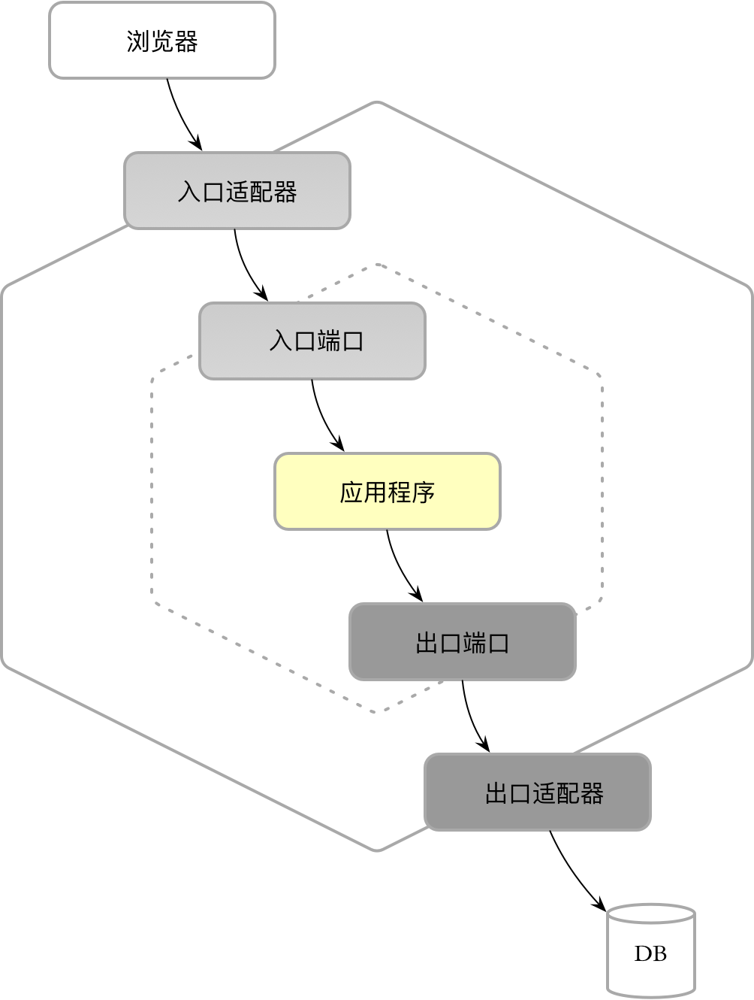
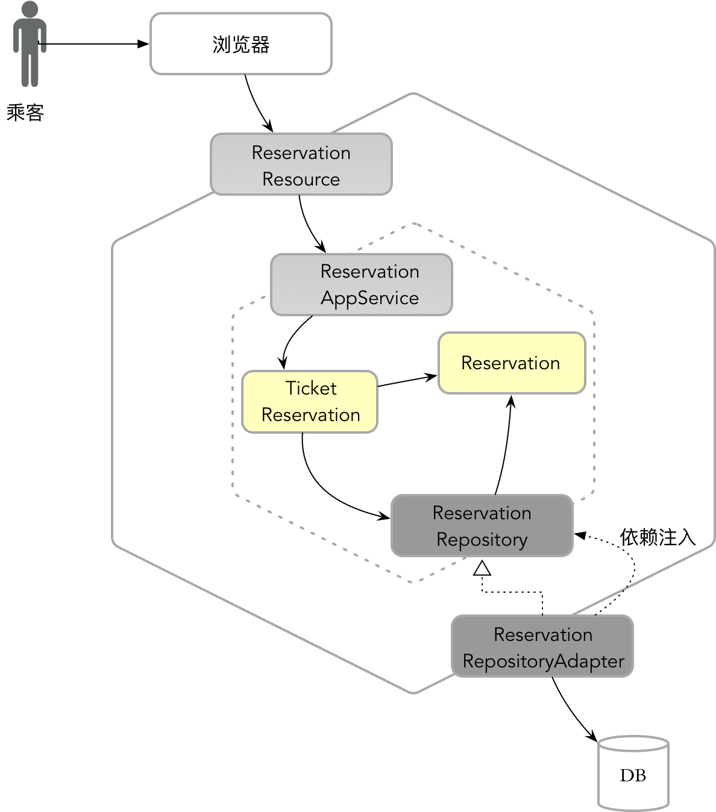
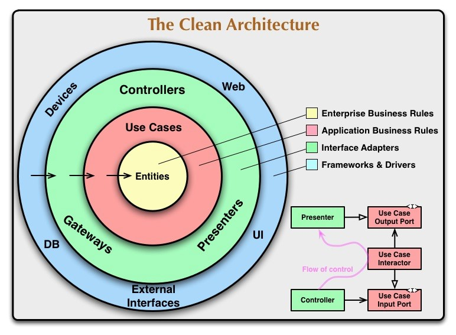
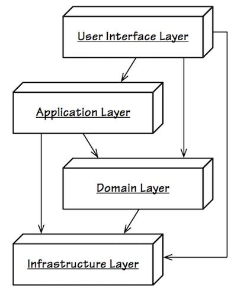
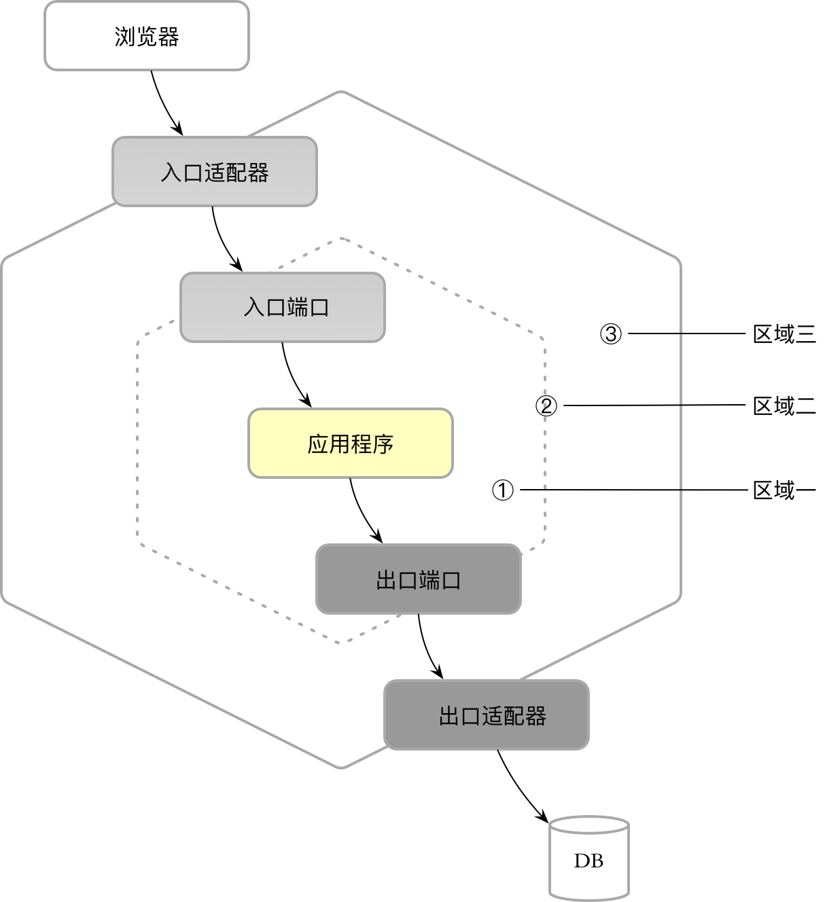
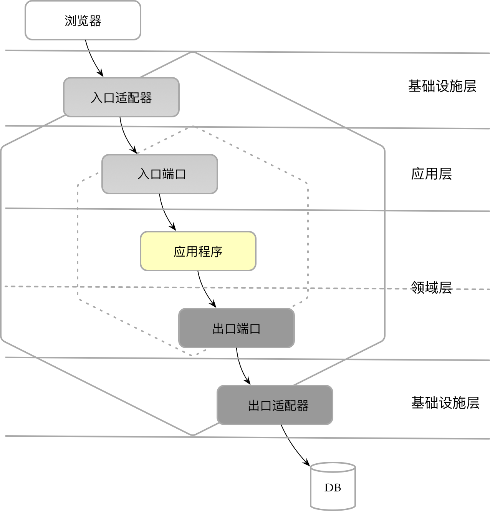

领域驱动设计的菱形对称架构
=============

* 前言
    ==

    在实施领域驱动设计的过程中，限界上下文（Bounded Context）扮演了关键角色：它既是维护领域模型完整性与一致性的重要边界，又是系统架构的重要组成部分。随着社区对限界上下文的重视，越来越多的人开始尝试将更多的架构实践与限界上下文融合在一起，创造出符合领域驱动设计的架构模式。

    Eric Evans 在领域驱动设计中引入了分层架构（Layered Architecture），目的是希望能够分离领域，这意味着该模式本身是作用在整个系统层次。Vaughn Vernon 在《实现领域驱动设计》一书中，将 Alistair Cockburn 提出的六边形架构（Haxagonal Architecture）引入到领域驱动设计中，并将其与限界上下文结合在一起，清晰地体现了它内部的视图。这一模式的引入，实际上代表着限界上下文在架构中的核心地位。

    限界上下文改变了系统架构的逻辑视图，领域层的抽取则意味着领域对设计的驱动力，二者的结合可以形成一种新的架构风格，我将其称之为“ **领域驱动架构（Domain Driven Architecture）** ”。该架构风格建立了以领域为核心驱动力，以整洁架构为指导原则，将整个系统分解为多个限界上下文，并通过上下文映射（Context Map）表现限界上下文之间的协作关系以及系统与外部环境之间关系。

    这一架构风格将整个系统的架构分为两个层次：

  * 系统层次
  * 领域层次

    **系统层次的架构 **以限界上下文为核心，从纵向维度根据业务能力纵向切分形成限界上下文，然后从横向维度提炼出由限界上下文组成的价值层（Value-Added Layer）。** 领域层次的架构**针对限界上下文内部以领域为核心进行关注点分解，形成由内部领域模型与外部网关组成的内外分层架构。

    本文提出的**菱形对称架构（Rhombic Symmetric Architecture） **主要针对领域层次的架构，借鉴了六边形架构、分层架构、整洁架构的知识，并结合了领域驱动设计的元模型，使其能够更好地运用到限界上下文的架构设计中。因此，本文会依次介绍六边形架构、整洁架构与分层架构，由此再引出我定义的菱形对称架构。** 说明： **由于菱形又可以表示为** diamond**，故而该架构模式也可以称之为“钻石架构”，简称 diamond。我在 GitHub 上建立了名为[diamond](https://github.com/agiledon/diamond)的代码库，提供了本文案例的 Demo 代码，也清晰地展现了限界上下文的代码结构。

架构模式的演进
    =======

六边形架构
    -----

    六边形架构（Hexagonal Architecture）又被称之为端口适配器（Port and Adapter），由 Alistair Cockburn 提出，他的定义为：“无论是被用户、程序、还是自动化测试或批处理脚本驱动，应用程序（Application）都能一视同仁地对待，最终使得应用程序能独立于运行时设备和数据库进行开发与测试。”

    包含了领域逻辑的应用程序放在六边形的边界内，它与外界的通信只能通过端口与适配器进行。端口存在两个方向：入口和出口。与之相连的适配器自然也存在两种适配器：入口适配器（Inbound Adapter，又可称为 Driving Adapter）和出口适配器（Outbound Adapter，又可称为 Driven Adaptor）。入口适配器负责处理系统外部发送的请求，也就是驱动应用程序运行的用户、程序、自动化测试或批处理脚本会向入口适配器发起请求，适配器将该请求适配为符合内部应用程序执行的输入格式，转交给端口，再由端口调用应用程序。出口适配器负责接收内部应用程序通过出口端口传递的请求，对其进行适配后，向位于外部的运行时设备和数据库发起请求。

    显然，从内外边界的视角观察端口与适配器的协作，整个过程如下图所示：

    

    在 Cockburn 对六边形架构的初始定义中，应用程序处于六边形边界之内，它封装了支持业务功能的领域逻辑。入口端口与出口端口放在六边形边界之上，前者负责接收外部的入口适配器转换过来的请求，后者负责发送应用程序的请求给外部的出口适配器，由此可以勾勒出一个清晰的六边形：


我们说限界上下文是在特定知识语境下的业务能力的体现，这一业务能力固然以领域模型为核心，却必须通过与外部环境的协作方可支持其能力的实现，因此限界上下文的边界实则包含了对驱动它运行的入口请求的适配与响应，也包含了对外部设备和数据库的访问。若要将限界上下文与六边形架构结合起来，就需要将入口适配器和出口适配器放在限界上下文的边界之内，从而构成一个外部的六边形：



六边形架构清晰地勾勒出限界上下文的两个边界：

* 外部边界：通过外部六边形展现，是限界上下文的业务边界，当然，同时也可能是限界上下文的工作边界与应用边界。我将此六边形称之为“应用六边形”。

  * 内部边界：通过内部六边形将领域单独抽离出来，隔离了业务复杂度与技术复杂度。我将此六边形称之为“领域六边形”。

    以预定机票场景为例，用户通过浏览器访问订票网站，向订票系统发起订票请求。根据六边形架构的规定，前端 UI 位于应用六边形之外，属于驱动应用程序运行的起因。订票请求发送给以 RESTful 契约定义的资源服务`ReservationResource`，它作为入口适配器，介于应用六边形与领域六边形的边界之内。`ReservationResource`在接收到以 JSON 格式传递的前端请求后，将其转换（反序列化）为入口端口`ReservationAppService`需要的请求对象。

    入口端口为应用服务，位于领域六边形的边界之上。当它在接收到入口适配器转换后的请求对象后，调用位于领域六边形边界内的领域服务`TicketReservation`，执行领域逻辑。

    在执行订票的领域逻辑时，需要向数据库添加一条订票记录。这时，位于领域六边形边界内的领域模型对象会调用出口端口`ReservationRepository`。出口端口为资源库，位于领域六边形的边界之上，定义为接口，真正访问数据库的逻辑则由介于应用六边形与领域六边形边界内的出口适配器`ReservationRepositoryAdapter`实现。该实现访问了数据库，将端口发送过来的插入订票记录的请求转换为数据库能够接收的消息，执行插入操作。

    该领域场景在六边形架构中的体现为：

    

    **六边形架构中的端口是解耦的关键。**入口端口体现了“封装”的思想，它既隔离了外部请求转换所必须的技术实现，如 REST 服务的反序列化机制与 HTTP 请求路由等基础设施功能，又避免了领域模型向外的泄露，因为端口公开的方法已经抹掉了领域模型的信息。出口端口则体现了“抽象”的思想，它通常需要定义为抽象接口，不包含任何具体的访问外部设备和数据库的实现。

    显然，入口端口抵御了外部请求可能对当前限界上下文造成的侵蚀，因此，入口适配器与入口端口之间的关系是一个**依赖调用关系 **；出口端口隔离了领域逻辑对技术实现以及外部框架或环境的依赖，因此，出口适配器与出口端口之间的关系是一个** 接口实现关系**。二者的结合共同为限界上下文两个边界层次的松散耦合提供助力，最终保证了限界上下文的自治能力。

整洁架构
    ----

Robert Martin 总结了六边形架构以及其他相似架构如 DCI 架构、BCE 架构的共同特征，他认为：“它们都具有同一个设计目标：按照不同关注点对软件进行切割。也就是说，这些架构都会将软件切割成不同的层，至少有一层是只包含该软件的业务逻辑，而用户接口、系统接口则属于其他层。”

本质上，领域驱动设计的限界上下文同样是对软件系统的切割，依据的关注点主要是根据领域知识的语境，从而体现业务能力的差异。在进入限界上下文内部，我们又可以针对限界上下文进行关注点的切割，并在其内部体现出清晰的层次结构。这个层次结构必须遵循整洁架构（Clean Architecture）的思想。

整洁架构可以通过下图体现：



该架构思想提出的模型是一个类似内核模式的内外层架构。由内及外分为四层，包含的内容分别为：

* 企业业务规则（Enterprise Business Rules）

  * 应用业务规则（Application Business Rules）
* 接口适配器（Interface Adapters）

  * 框架与驱动器（Frameworks & Drivers）

    解密整洁架构模型，我们看到许多有用的特征，值得深思：

  * 不同层次的组件其变化频率也不相同，引起变化的原因也不相同。
* 层次越靠内的组件依赖的内容越少，处于核心的业务实体（Entities）没有任何依赖。

  * 层次越靠内的组件与业务的关系越紧密，专属于领域的内容，因而难以形成通用的框架。
* 业务实体封装了企业业务规则，准确地讲，它组成了面向业务的领域模型。

  * 应用业务规则层是打通内部业务与外部环境的一个通道，因而提供了输出端口（Output Port）与输入端口（Input Port），但它对外的接口展现的是一个用例（Use Case），体现了系统的应用逻辑。
* 接口适配器层包含了网关（Gateways）、控制器（Controllers）与展示器（Presenters），它们皆属于适配器（Adapter），用于打通应用业务逻辑与外层的框架和驱动器，实现逻辑的适配以访问外部资源。

  * 位于外部的框架与驱动器负责对接外部环境，不属于限界上下文的范畴，但选择这些框架和驱动器，却是设计决策要考虑的内容。

    显然，整洁架构根据变化的速率与特征对限界上下文进行切割，定义了一个由同心圆组成的内外分离的架构模型。该模型的每个层次体现了不同的关注点，维持了清晰的职责边界。

    在这个架构模型中，“外层圆代表的是机制，内层圆代表的是策略”。机制属于技术实现的细节，容易受到外界环境变化的影响；策略与业务有关，封装了限界上下文最为核心的领域模型，最不容易受到外界影响而变化。那么，遵循“稳定依赖原则”，在编码实现时，依赖方向应该从外层圆指向内层圆，如此即可保证核心的领域模型更加纯粹，不对外部易于变化的事物形成依赖，隔离了外部变化的影响。

    既然整洁架构与六边形架构一脉相承，运用了六边形架构的限界上下文自然遵循了整洁架构的思想。例如，六边形架构中的应用六边形与领域六边形就是根据变化速度对关注点的切割，位于外层的适配器分别通过职责委派与接口实现依赖了在其内部的端口，而端口又依赖了内部的领域模型。

    但是，六边形架构仅仅区分了内外边界，提炼了端口与适配器角色，并没有规划限界上下文内部各个层次与各个对象之间的关系；而整洁架构又过于通用，提炼的是企业系统架构设计的基本规则与主题。因此，当我们将六边形架构与整洁架构思想引入到领域驱动设计的限界上下文时，还需要引入分层架构给出更为细致的设计指导，即确定层、模块与角色构造型之间的关系。

分层架构模式
    ------

分层架构是运用最为广泛的架构模式，几乎每个软件系统都需要通过层（Layer）来隔离不同的关注点（Concern Point），以此应对不同需求的变化，使得这种变化可以独立进行。《领域驱动设计模式、原理与实践》解释了在领域驱动设计中引入分层架构模式的原因和目的：

> 为了避免将代码库变成大泥球（BBoM）并因此减弱领域模型的完整性且最终减弱可用性，系统架构要支持技术复杂性与领域复杂性的分离。引起技术实现发生变化的原因与引起领域逻辑发生变化的原因显然不同，这就导致 **基础设施和领域逻辑问题会以不同速率发生变化** 。

引起变化的原因不同导致了变化的速率不同，体现了单一职责原则（Single-Responsibility Principle，SRP）。Robert Martin 认为单一职责原则就是“一个类应该只有一个引起它变化的原因”，换言之，如果有两个引起类变化的原因，就需要分离。若将单一职责原则运用到分层架构模式，考虑的变化粒度就是层。

Eric Evans 在将分层架构引入到领域驱动设计时，结合自己的洞见对传统的分层架构做出了调整：



该书对各层的职责作了简单的描述：

层次

职责

用户界面层

负责向用户展现信息以及解释用户命令。

应用层 

很薄的一层，用来协调应用的活动。它不包含业务逻辑。它不保留业务对象的状态,但它保有应用任务的进度状态。

领域层 

本层包含关于领域的信息。这是业务软件的核心所在。在这里保留业务对象的状态，对业务对象和它们状态的持久化被委托给了基础设施层。

基础设施层 

本层作为其他层的支撑库存在。它提供了层间的通信，实现对业务对象的持久化，包含对用户界面层的支撑库等作用。

菱形对称架构
======

融合分层架构与六边形架构
------------

回顾六边形架构在限界上下文中的结构，它的组成元素包括入口适配器、入口端口、应用程序、出口端口和出口适配器，它们分别位于由应用六边形和领域六边形隔离形成的三个区域：



六边形架构并未对这三个区域命名，这就为团队的协作交流制造了障碍。例如，当团队成员正在讨论一个入口端口的设计时，需要确定入口端口在代码模型的位置，即确定入口端口所在的命名空间。我们既不可能说它放在“领域六边形的边线”上，也不可能为该命名空间定义一个冗长的包名，例如`currentbc.boundaryofdomainhexagon`。命名，就是为了交流，并形成一种约定，从而可以做到不言自明。因此，我们需要寻找一种架构的统一语言为这些区域命名，如此即可将六边形的设计元素映射到代码模型对应的命名空间。

从关注点分离的角度看，六边形架构实则就是隔离内外的分层架构，因此我们完全可以将两个六边形隔离出来的三个区域映射到领域驱动设计的分层架构中。映射时，自然要依据设计元素承担的职责来划分层次：

* 入口适配器：响应边界外客户端的请求，需要实现进程间通信以及消息的序列化和反序列化，这些功能皆与具体的通信技术有关，故而映射到基础设施层

* 入口端口：负责协调外部客户端请求与内部应用程序之间的交互，恰好与应用层的协调能力相配，故而映射到应用层

  * 应用程序：承担了整个限界上下文的领域逻辑，包含了当前限界上下文的领域模型，毫无疑问，应该映射到领域层
* 出口端口：作为一个抽象的接口，封装了对外部设备和数据库的访问，由于它会被应用程序调用，遵循整洁架构思想，也应该映射到领域层

  * 出口适配器：访问外部设备和数据库的真正实现，与具体的技术实现有关，映射到基础设施层

    如此就建立了六边形架构与领域驱动分层架构之间的映射关系：

    

    通过这一映射，我们就 **为六边形架构的设计元素找到了统一语言** 。例如，入口端口属于应用层，它的命名空间自然应命名为`currentbc.application`。这一映射关系与命名规则实则就是指导团队开发的架构原则。当团队成员在讨论设计方案时，一旦确定该类应作为入口端口，不言自明，团队的所有成员都知道它归属于应用层，应该定义在`application`命名空间下。

突破分层架构
    ------

    分层架构仅仅是对限界上下文的逻辑划分，没有任何一门语言提供了`layer`关键字，这就使得层无法作为语法中的一等公民对逻辑层加以约束和限制。在编码实现时，逻辑层或许会以模块的形式表现，但是也可能将整个限界上下文作为一个模块，每个层不过是命名空间的差异，定义为模块内的一个包。不管是物理分离的模块，还是逻辑分离的包，只要能保证限界上下文在六边形边界的保护下能够维持内部结构的清晰，就能降低架构腐蚀的风险。

    然而，当我们为出口端口划定层次时，发现 **六边形架构与领域驱动设计的分层架构存在设计概念上的冲突** 。

    出口端口用于抽象领域模型对外部环境的访问，位于领域六边形的边线之上。根据分层架构的定义，领域六边形的内部属于领域层，介于领域六边形与应用六边形的中间区域属于基础设施层，那么， **位于六边形边线之上的出口端口就应该既不属于领域层，又不属于基础设施层** 。它的职责与属于应用层的入口端口也不同，因为应用层的应用服务是对外部请求的封装，相当于是一个业务用例的外观。

    根据六边形架构的协作原则，领域模型若要访问外部设备，需要调用出口端口。依据整洁架构遵循的“稳定依赖原则”，领域层不能依赖于外层。因此， **出口端口只能放在领域层** 。事实上，领域驱动设计也是如此要求的，它在领域模型中定义了资源库（Repository），用于管理聚合的生命周期，同时，它也将作为抽象的访问外部数据库的出口端口。

    将资源库放在领域层确有论据佐证，毕竟，在抹掉数据库技术的实现细节后，资源库的接口方法就是对聚合领域模型对象的管理，包括查询、修改、增加与删除行为，这些行为也可视为领域逻辑的一部分。

    然而，限界上下文可能不仅限于访问数据库，还可能访问同样属于外部设备的文件、网络与消息队列。为了隔离领域模型与外部设备，同样需要为它们定义抽象的出口端口，这些出口端口该放在哪里呢？如果依然放在领域层，就很难自圆其说。例如，出口端口`EventPublisher`支持将事件消息发布到消息队列，要将这样的接口放在领域层，就显得不伦不类了。倘若不放在位于内部核心的领域层，就只能放在领域层外部，这又违背了整洁架构思想。

    如果我们将六边形架构看作是一个 **对称的架构** ，以领域为轴心，入口适配器和入口端口就应该与出口适配器和出口端口是对称的；同时，适配器又需和端口相对应，如此方可保证架构的松耦合。

    剖析端口与适配器的本质，实质上都是对外部系统或外部资源的处理，只是处理的方向各有不同。Martin Fowler 将“封装访问外部系统或资源行为的对象”定义为网关（Gateway），在限界上下文的内部架构中，它代表了领域层与外部环境之间交互的出入口，即：

gateway = port + adapter

```

根据入口与出口方向的不同，为了体现在分层架构中所处方位的特征，我将这个由端口与适配器共同组成的网关分别命名为“北向网关（northbound gateway）”与“南向网关(southbound gateway)”。
北向网关提供了由外向内的访问通道，这一访问方向符合整洁架构的依赖方向，因此不必实现为抽象的网关元素， 但却需要为外部调用者提供服务契约。同时，为了避免泄露内部的领域模型，网关的服务契约不能直接访问领域模型对象，而应为契约方法的参数和返回值定义专门的消息契约模型，并在北向网关中完成领域模型与消息契约模型的互换。显然，北向网关同时承担了端口与适配器的作用。由于来自限界上下文外部的请求可能 l 来自进程之外，也可能是进程之内，进程内外的差异，决定了通信协议的不同，因而有必要根据进程的边界将北向网关分为本地网关与远程网关，前者支持进程内通信，后者用于进程间通信。
南向网关负责隔离领域层对外部环境的访问，故而需要分离接口与实现，因此需要将其分为端口与适配器。端口作为没有任何实现的抽象接口，可以被领域层依赖，在运行时，系统通过依赖注入将适配器实现注入到领域层，满足领域逻辑对外部设备的访问需求。由于端口涵盖了对数据库的访问，故而可以认为资源库也属于南向网关端口中的一种。
整个对称架构的结构如下所示：
- 北向网关：
- 远程（remote）
  - 本地（local）
- 领域
- 南向网关：
- 端口（port）
  - 适配器（adapter）
入口适配器与入口端口共同组成了北向网关，但在对称架构中，它们被合并为“网关”这一个设计元素，并因为通信协议的区别而分为远程入口与本地入口；出口端口与出口适配器共同组成了南向网关，在对称架构中，它们分别代表了南向网关的抽象和实现。如此，即构成了由内部领域模型与外部网关组成的对称架构：
  
这一对称架构凸显了领域层的重要地位，抹去了基础设施层与应用层，而换以网关来代替。由于应用六边形已经定义了限界上下文与外部环境的边界，因此，在限界上下文的内部，所有提供基础设施功能的类，本质都是为领域层与外部环境协作提供支撑，区别仅在于方向。
显然，对称架构虽脱胎于六边形架构与领域驱动设计分层架构，却又有别于二者。
对称架构北向网关定义的远程网关与本地网关同时承担了端口与适配器的职责，这实际上改变了六边形架构端口-适配器的风格；领域层与南北网关层的内外分层结构，以及南向网关规定的端口与适配器的分离，又与领域驱动设计的分层架构渐行渐远。为了更好体现这一架构模式的对称特质，我换用了菱形结构来表达，故而称之为“菱形对称架构（Rhombic Symmetric Architecture），如下图所示：
 
## 菱形对称架构的组成
作用于限界上下文的菱形对称架构从领域驱动设计分层架构与六边形架构中汲取了营养，通过对它们的融合形成了以领域为轴心的内外分层对称结构。内部以领域层的领域模型为主，外部的网关层则根据方向划分为北向网关与南向网关。通过该架构，可清晰说明整个限界上下文的组成：
- 北向网关的远程网关
- 北向网关的本地网关
- 领域层的领域模型
- 南向网关的端口抽象
- 南向网关的适配器实现
限界上下文以领域模型为核心向南北方向对称发散，从而在边界内形成清晰的逻辑层次。很明显，前端 UI 并未包含在限界上下文的边界之内。每个组成元素之间的协作关系表现了清晰直观的自北向南的调用关系，仍以订票服务场景为例，参与该场景的各个类在菱形对称架构下的位置与协作关系如下图所示： 

## 引入上下文映射模式
菱形对称架构还能够有机地与上下文映射模式结合起来，充分展现了这一架构风格更加适用于领域驱动设计。二者的结合主要体现在北向网关与南向网关对上下文映射模式的借用。
### 北向网关的演变
对比上下文映射的通信集成模式，我们发现**开放主机服务（Open Host Service，简称 OHS） **模式的设计目标与菱形对称架构的北向网关完全一致。
开放主机服务为限界上下文提供对外公开的一组服务，以便于下游限界上下文方便地调用它。根据限界上下文通信边界的不同，采用进程内通信调用北向网关的本地网关，采用进程间通信调用北向网关的远程网关，二者都遵循开放主机服务模式，服务接口的契约则满足** 发布语言（Published Language，简称 PL） **模式，形成两个限界上下文之间的交换模型。
为了更好地体现上下文映射模式，我们可将北向网关命名为开放主机服务层，组成北向网关的远程网关和本地网关分别命名为远程服务和本地服务。
远程服务是为跨进程通信定义的开放主机服务。根据通信协议和消费者的差异，远程服务可分为资源（Resource）服务、供应者（Provider）服务、控制器（Controller）服务与事件订阅者（Event Subscriber）服务。
本地服务是为进程内通信定义的开放主机服务，对应于应用层的应用服务。引入本地服务的价值在于：
- 对领域模型形成了一层间接的外观层，避免领域模型被泄露在外
- 对于进程内协作的限界上下文，降低了跨进程调用的通信成本与序列化成本
当外部请求从远程服务进入时，如果需要调用领域层的领域逻辑，则必须经由本地服务发起对领域层的请求。此时的本地服务又扮演了端口的作用，可认为远程服务是本地服务的客户端。
开放主机服务层形成的两层边界，既能有效隔离领域逻辑，又给予了不同调用者自由选择的权利，同时适用于单体架构风格和微服务架构风格。
### 南向网关的演变
南向网关引入了抽象的端口来隔离内部领域模型对外部环境的访问。这一价值等同于上下文映射的** 防腐层（Anti-Corruption Layer，简称为 ACL） **模式，只是它扩大了防腐层隔离的范围。
可能引起争议的是对数据库的隔离，因为在领域驱动设计的战术设计要素中，这一隔离功能由资源库接口提供。作为管理聚合生命周期的接口对象，它通常认为是组成领域模型的一部分。
虽然如此，资源库起到了分离聚合领域行为与持久化行为的作用，却是不争的事实。在设计领域层的领域模型时，我们并不需要考虑资源库。根据聚合的设计原则，一个聚合对应一个资源库，只要确定了聚合的边界，资源库的定义也就呼之而出了。为了隔离领域模型与数据库访问逻辑，才有必要对资源库进行抽象，这不正是端口与适配器分别履行的职责吗？不也正是引入防腐层的设计目的吗？因此，我们需要对所有外部环境一视同仁，无需针对资源库做特殊化处理，如此也可保证架构的简单性。
根据一个限界上下文可能要与之协作的外部环境的不同，南向网关的端口分为：
- 资源库（repository）端口：隔离对外部数据库的访问，对应的适配器提供聚合的持久化能力
- 客户端（client）端口：隔离对上游限界上下文或第三方服务的访问，对应的适配器提供对服务的调用能力
- 事件发布者（event publisher）端口：隔离对外部消息队列的访问，对应的适配器提供发布事件消息的能力
## 改进的菱形对称架构
当我们将上下文映射模式引入到菱形对称架构后，整个架构的设计元素变得更加简单，各层之间的关系与边界也更加地清晰： 
 
菱形对称架构对领域驱动设计的分层架构做出了调整。遵循整洁架构的精神，作为远程服务调用者的 UI 展现层视为外部资源被推出了限界上下文的边界之外。菱形对称架构还去掉了应用层和基础设施层的概念，以统一的网关层进行概括，并以北向与南向分别体现了来自不同方向的请求。如此形成的对称结构突出了领域模型的核心作用，更加清晰地体现了业务逻辑、技术功能与外部环境之间的边界。
菱形对称架构还调整了领域驱动设计的元设计模型，将资源库视为防腐层的端口与适配器，作为领域建模时的角色构造型，与场景驱动设计更好地结合，增强了领域模型的稳定性。应用层被去掉之后，被弱化为开放主机服务层的本地服务，相当于从设计层面回归到服务外观的本质，也有助于解决应用服务与领域服务之间的概念之争。
遵循菱形对称架构的限界上下文代码模型如下所示：
```

currentcontext - ohs(northbound) - remote - controllers - resources - providers - subscribers - local - appservices - pl(messages) - domain - acl(southbound) - ports - repositories - clients - publishers - adapters - repositories - client - publishers - pl(messages)

```

该代码模型使用了上下文映射的模式名，ohs 为开放主机服务模式的缩写，acl 是防腐层模式的缩写，pl 代表了发布语言。** 注意 **，北向网关和南向网关都定义了 pl 包，其中，北向网关定义的消息契约模型为当前限界上下文服务，南向网关定义的消息契约则为上游限界上下文服务。如果下游上下文重用了上游上下文的消息契约模型，则南向网关可以不用定义。
当然，我们也可以使用北向（northbound）与南向（sourthbound）取代 ohs 与 acl 作为包名，使用消息（messages）契约取代 pl 的包名。这取决于不同团队对这些设计要素的认识。无论如何，作为整个系统的架构师，一旦确定在限界上下文层次运用菱形对称架构，就意味着他向所有团队成员传递了统一的设计元语，且潜在地给出了架构的设计原则与指导思想，即：维持领域模型的清晰边界，隔离业务复杂度与技术复杂度，并将限界上下文之间的协作通信隔离在领域模型之外。
# 菱形对称架构的价值
当我们为限界上下文引入菱形对称架构之后，一方面可以更加清晰地展现上下文映射模式之间的差异，并凸显了防腐层与开放主机服务的重要性；另一方面，遵循菱形对称架构的领域驱动架构亦具有更好的响应变化的能力。
## 展现上下文映射模式
以“查询订单”为例，若需求要求查询返回的订单需要包含商品的信息，这时可能产生订单上下文的订单与商品上下文的商品之间的“模型依赖”。
### 遵奉者或共享内核
一种方式是让订单直接重用商品上下文的领域模型，即采用** 遵奉者（Conformist） **模式或** 共享内核（Shared Kernel） **模式，通过菱形对称架构表现为：
 
上图清晰地展现了重用领域模型的方式会突破菱形对称架构北向网关修筑的堡垒，让商品上下文的领域模型直接暴露在外。
### 防腐层与开放主机服务的结合
如果订单上下文与商品上下文处于同一进程，根据菱形对称架构的定义，位于下游的订单上下文可以通过其南向网关发起对商品上下文北向网关中本地服务的调用。为了保护领域模型，商品上下文在北向网关中还定义了消息契约模型，表现为：

此时的菱形对称架构体现了防腐层模式与开放主机服务模式共同协作，位于商品上下文北向网关的本地服务还定义了消息契约，从而产生了消息契约模型之间的依赖。
如果订单上下文与商品上下文位于不同的进程，两个限界上下文之间的模型依赖就不存在了，我们需要各自为其定义属于自己的模型对象。例如，订单上下文的`ProductClientAdapter`调用商品上下文的`ProductResource`，它返回的消息契约为`ProductResponse`，为了支持消息反序列化，需要在订单上下文定义与之保持一致的属于自己边界内的`ProductResponse`类：
 
上图所示的订单上下文与商品上下文仅存在上下游调用关系，通过南向网关的防腐层与北向网关的开放主机服务亦降低了彼此的耦合；然而，在各自边界内定义的`ProductResponse`之间，却隐隐包含了逻辑概念的映射关系，它会带来变化的级联反应。
譬如说，国家政策要求电商平台销售的所有商品都需要添加一个“是否绿色环保”的新属性。为此，商品上下文领域层的`Product`类新增了`isGreen()`属性，北向网关层定义的`ProductResponse`类也需随之调整。
这一知识的变更也会传递到下游的订单上下文。通过对商品上下文的开放主机服务进行版本管理，或者在订单上下文引入防腐层进行隔离保护，可在一定程度保护订单领域的稳定性。但是，如果需求要求查询订单时也需要商品返回“是否绿色环保”的属性，则订单上下文`ProductResponse`类的修改就不可避免了。
### 分离方式
若真正体会了限界上下文作为知识语境的业务边界特征，就可以将订单包含的商品信息视为订单上下文的领域模型，隐含的统一语言为“已购商品（Purchased Product）”，它与商品上下文的商品属于不同的领域概念，处于不同的业务边界，然后共享同一个`productId`。
在订单上下文中，`Product`作为`Order`聚合的组成部分，它的生命周期与`Order`的生命周期绑定在一起，统一由`OrderRepository`管理。这意味着在保存订单时，业已保存了与订单相关的商品信息，在获取订单及其商品信息时，自然就无需求助于商品上下文。此时，查询订单领域场景不会导致订单上下文与商品上下文的协作。
由于订单上下文的商品信息仅含订单需要的商品基本信息，若需获取更多商品信息，如客户在前端点击商品的“查看详情”按钮，由于页面已经包含了`productId`的值，前端可直接向商品上下文的远程服务`ProductController`发起调用请求，亦与订单上下文无关： 
 
这种方式真正展现了限界上下文的价值，即对领域模型的控制力。当限界上下文针对业务关注点进行垂直切割时，不仅要从语义相关性划分领域概念，还要考虑这些概念之间存在的功能相关性。例如，商品与商品上下文是语义强相关的，但在查询订单这一领域场景中，获得订单时随之返回对应的商品信息，却是功能相关性发挥着作用。它也充分体现了“最小完备”的自治特性，因为在查询订单时，如果不为订单项提供对应的商品信息，该限界上下文就是不完备的。
当我们在定义领域模型时，如果一些领域概念出现矛盾或冲突时，就是引入限界上下文维护概念一致性的时机，也是统一语言发挥作用的时候。
## 响应变化的能力
限界上下文之间产生协作时，通过菱形对称架构可以更好地响应协作关系的变化。它设定了一个基本原则：即下游限界上下文需要通过南向网关与上游限界上下文的北向网关进行协作，简言之，就是防腐层与开放主机服务的协作。
### 客户方-供应方模式
通常说来，这种协作模式就是典型的** 客户方-供应方（Customer-Supplier） **模式，参与协作的角色包括：
- 下游限界上下文：防腐层的客户端端口（`acl.ports.Client`）作为适配上游服务的接口，客户端适配器（`acl.adapters.ClientAdapter`）封装对上游服务的调用逻辑
- 上游限界上下文：开放主机服务的远程服务（`ohs.remote.Resource`）与本地服务（`ohs.local.AppService`）为下游限界上下文提供具有业务价值的服务
客户端适配器到底该调用上游限界上下文的远程服务还是本地服务，取决于这两个限界上下文的通信边界。
如果上下游的限界上下文位于同一个进程边界内，客户端适配器可以直接调用本地服务。这样的本地服务调用更加健壮，更加可控，能够降低通信成本以及消息协议的序列化成本。虽然下游限界上下文绕开了远程服务，但由于本地服务提供了对领域模型的保护，故而没有违背限界上下文的架构原则，确保了领域模型的独立性和完整性。协作图如下所示： 

 如果上下游的限界上下文处于不同的进程边界，就由远程服务来响应下游客户端适配器发起的调用。根据通信协议与序列化机制的不同，可以选择资源（`Resource`）服务或供应者（`Provider`）服务作为远程服务响应这样的分布式调用。远程服务在收到客户端请求后，会通过本地服务将请求最终传递给领域层的领域模型。协作图如下所示： 

 Eric Evans 提出的领域驱动设计并未要求为每个参与协作的限界上下文都定义防腐层与开放主机服务，但菱形对称架构扩大了防腐层与开放主机服务的外延，使得** 防腐层与开放主机服务之间的协作成为了客户端-服务调用的一种标准形式 **。在防腐层中，端口与适配器的分离解除了对上游开放主机服务的强耦合；而开放主机服务提供的本地服务与远程服务，允许上下游的协作能够相对自如地在进程内通信与进程间通信之间完成切换，自然就可以** 相对轻松地将一个系统从单体架构风格迁移到微服务架构风格 **。
### 发布者-订阅者模式
限界上下文之间南向网关与北向网关的协作还有一种模式，即事件的** 发布者-订阅者（Publisher-Subscriber） **模式。
采用这种模式时，限界上下文之间的耦合主要来自对事件的定义。作为事件发布者的限界上下文可以不用知道有哪些事件的订阅者，反之亦然，彼此之间的解耦往往通过引入事件总线（可以是本地的事件总线，也可以是单独进程的事件总线）来保证。
在限界上下文内部，同样需要隔离领域模型与事件通信机制，这一工作由菱形对称架构网关层中的设计元素来完成。事件的发布者位于防腐层，发布者端口（`acl.ports.EventPublisher`）提供抽象定义，发布者适配器（`acl.adapters.EventPublisherAdapter`）负责将事件发布给事件总线；事件的订阅者（`ohs.remote.EventSubscriber`）属于开放主机服务层的远程服务，在订阅到事件之后，交由本地服务（`ohs.local.ApplicationService`）来处理事件。
我们还需要判断是谁引起了事件的发布？
如果是事件发布者所在限界上下文边界外的调用者引起，就需要由当前限界上下文的远程服务接受客户端调用，再将该调用委派给本地服务，由本地服务调用领域层执行了领域逻辑之后，组装好待发布的事件，由事件发布者完成事件的发布。由于事件的组装与发布逻辑的调用皆由本地服务承担，且考虑到本地服务实际上就是应用服务，故而将这样的事件称之为** 应用事件（Application Event） **，整个调用时序如下所示：
 
当领域层执行某一个领域行为时，也可能触发事件，最终引起事件的发布。这时，就将由领域模型的领域服务发起对事件发布者的调用。领域服务传递给事件发布者的事件，称之为** 领域事件（Domain Event） **，调用时序如下所示： 

# 案例：菱形对称架构的运用
## 提交订单领域场景
我们以一个简化了的提交订单领域场景来说明在菱形对称架构下，限界上下文之间以及内部各设计元素是如何协作的。该领域场景主要牵涉到订单上下文、仓储上下文、通知上下文与客户上下文，且假定每个限界上下文都处于不同的进程。首先，我们先明确该领域场景的执行过程：
- 客户提交订单，向订单上下文发送提交订单的客户端请求
- 订单上下文向库存上下文发送检查库存量的客户端请求
- 库存上下文查询库存数据库，返回库存信息
- 若库存量符合订单需求，则订单上下文访问订单数据库，插入订单数据
- 订单上下文调用库存上下文的锁定库存量服务，对库存量进行锁定
- 提交订单成功后，发布应用事件，并发布到事件总线
- 通知上下文订阅应用事件，调用客户上下文获得该订单的客户信息，组装通知内容
- 通知上下文调用短信服务，发送短信通知客户
## 设计元素的协作
### 订单上下文的内部协作
客户提交订单通过前端 UI 向订单上下文远程服务`OrderController`提交请求，然后将请求委派给本地服务`OrderAppService`：
```java
package xyz.zhangyi.diamond.demo.ordercontext.ohs.remote.controllers;
@RestController
@RequestMapping(value="/orders")
public class OrderController
{
    @Autowired
    private OrderAppService orderAppService;
    @PostMapping
    public void placeOrder(PlacingOrderRequest request) {
        orderAppService.placeOrder(request);
    }
}
package xyz.zhangyi.diamond.demo.ordercontext.ohs.local.appservices;
@Service
public class OrderAppService {
    @Autowired
    private OrderService orderService;
    @Transactional(rollbackFor = ApplicationException.class)
    public void placeOrder(PlacingOrderRequest request) {}
}
```

远程服务与本地服务使用的消息契约模型定义在`ohs.local.pl`包中，如此即可同时支持两种开放主机服务：

```java
package xyz.zhangyi.diamond.demo.ordercontext.ohs.local.pl;
import java.io.Serializable;
import xyz.zhangyi.diamond.demo.ordercontext.domain.Order;
public class PlacingOrderRequest implements Serializable {
    public Order to() {
        return new Order();
    }
}
```

这些消息契约模型都定义了如`to()`和`from`之类的转换方法，用于消息契约模型与领域模型之间的互相转换。

### 订单上下文与库存上下文的协作

本地服务`OrderAppService`收到`PlacingOrderRequest`请求后，会将该请求对象转换为`Order`领域对象，然后通过领域服务`OrderService`提交订单。提交订单时，首先需要验证订单有效，然后再检查库存量。验证订单的有效性由领域模型对象`Order`聚合根承担，库存量的检查则需要通过端口`InventoryClient`，并由注入的适配器`InventoryClientAdapter`发起向库存上下文远程服务`InventoryResource`的调用：

```java
  package xyz.zhangyi.diamond.demo.ordercontext.domain;
  @Service
  public class OrderService {
      @Autowired
      private InventoryClient inventoryClient;
  
      public void placeOrder(Order order) {
          if (order.isValid()) {
              throw new InvalidOrderException();
          }
  
          CheckingInventoryRequest inventoryRequest = CheckingInventoryRequest.from(order);
          InventoryReviewResponse reviewResponse = inventoryClient.check(inventoryRequest);
          InventoryReview inventoryReview = reviewResponse.to();
  
          if (!inventoryReview.isAvailable()) {
              throw new NotEnoughInventoryException();
          }
  
          ......
    }
  }
  package xyz.zhangyi.diamond.demo.ordercontext.acl.ports.clients;
  public interface InventoryClient {
      InventoryReviewResponse check(CheckingInventoryRequest request);
      void lock(LockingInventoryRequest from);
  }
  
  package xyz.zhangyi.diamond.demo.ordercontext.acl.adapters.clients;
  
  @Component
  public class InventoryClientAdapter implements InventoryClient {
      private static final String INVENTORIES_RESOURCE_URL = "http://inventory-service/inventories";
  
      @Autowired
      private RestTemplate restTemplate;
  
      @Override
      public InventoryReviewResponse check(CheckingInventoryRequest request) {
          return restTemplate.postForObject(INVENTORIES_RESOURCE_URL, request, InventoryReviewResponse.class);
      }
  
      @Override
      public void lock(LockingInventoryRequest request) {
          restTemplate.put(INVENTORIES_RESOURCE_URL, request);
      }
  }
```

位于南向网关的客户端端口`InventoryClient`及其适配器实现需要调用与之对应的消息契约模型，如`CheckingInventoryRequest`和`InventoryReviewResponse`。根据前面的分析，如果上下游的限界上下文都处于同一个进程中，则下游上下文的南向网关可以重用上游上下文的消息契约。既然这里假定各个限界上下文都处于不同进程，就需要自行定义消息契约了：

```java
package xyz.zhangyi.diamond.demo.ordercontext.acl.ports.pl;
import java.io.Serializable;
import xyz.zhangyi.diamond.demo.ordercontext.domain.Order;
public class CheckingInventoryRequest implements Serializable {
    public static CheckingInventoryRequest from(Order order) {}
}
package xyz.zhangyi.diamond.demo.ordercontext.acl.ports.pl;
import java.io.Serializable;
import xyz.zhangyi.diamond.demo.ordercontext.domain.InventoryReview;
public class InventoryReviewResponse implements Serializable {
    public InventoryReview to() {}
}
```

### 库存上下文的内部协作

`InventoryResource`又会通过库存上下文的本地服务`InventoryAppService`调用领域服务`InventoryService`，然后经由端口`InventoryRepository`与适配器`InventoryRepositoryAdapter`访问库存数据库，获得库存量的检查结果：

```java
  package xyz.zhangyi.diamond.demo.inventorycontext.ohs.remote.resources;
  @RestController
@RequestMapping(value="/inventories")
  public class InventoryResource {
      @Autowired
      private InventoryAppService inventoryAppService;
  
      @PostMapping
      public ResponseEntity<InventoryReviewResponse> check(CheckingInventoryRequest request) {
          InventoryReviewResponse reviewResponse = inventoryAppService.checkInventory(request);
          return new ResponseEntity<>(reviewResponse, HttpStatus.OK);
      }
  }
  
  package xyz.zhangyi.diamond.demo.inventorycontext.ohs.local.appservices;
  
  @Service
  public class InventoryAppService {
      @Autowired
      private InventoryService inventoryService;
  
      public InventoryReviewResponse checkInventory(CheckingInventoryRequest request) {
          InventoryReview inventoryReview = inventoryService.reviewInventory(request.to());
          return InventoryReviewResponse.from(inventoryReview);
      }
  }
  
  package xyz.zhangyi.diamond.demo.inventorycontext.domain;
  
  @Service
  public class InventoryService {
      @Autowired
      private InventoryRepository inventoryRepository;
  
      public InventoryReview reviewInventory(List<PurchasedProduct> purchasedProducts) {
          List<String> productIds = purchasedProducts.stream().map(p -> p.productId()).collect(Collectors.toList());
          List<Product> products = inventoryRepository.productsOf(productIds);
  
          List<Availability> availabilities = products.stream().map(p -> p.checkAvailability(purchasedProducts)).collect(Collectors.toList());
          return new InventoryReview(availabilities);
      }
  }
  
  package xyz.zhangyi.diamond.demo.inventorycontext.acl.ports.repositories;
  
  @Repository
  public interface InventoryRepository {
      List<Product> productsOf(List<String> productIds);
  }
```

### 订单上下文发布应用事件

领域服务`OrderService`在确认了库存量满足订单需求后，通过端口`OrderRepository`以及适配器`OrderRepositoryAdapter`访问订单数据库，插入订单数据。一旦订单插入成功，订单上下文的领域服务`OrderService`还要调用库存上下文的远程服务`InventoryResource`锁定库存量。订单上下文的本地服务`OrderAppService`会在`OrderService`成功提交订单之后，组装`OrderPlacedEvent`应用事件，并调用端口`EventPublisher`，由适配器`EventPulbisherAdapter`将该事件发布到事件总线：

```java
package xyz.zhangyi.diamond.demo.ordercontext.domain;
@Service
public class OrderService {
  @Autowired
    private OrderRepository orderRepository;
  @Autowired
    private InventoryClient inventoryClient;
    public void placeOrder(Order order) {
        if (order.isValid()) {
            throw new InvalidOrderException();
        }
        CheckingInventoryRequest inventoryRequest = CheckingInventoryRequest.from(order);
        InventoryReviewResponse reviewResponse = inventoryClient.check(inventoryRequest);
        InventoryReview inventoryReview = reviewResponse.to();
        if (!inventoryReview.isAvailable()) {
            throw new NotEnoughInventoryException();
        }
        orderRepository.add(order);
        inventoryClient.lock(LockingInventoryRequest.from(order));
    }
}
package xyz.zhangyi.diamond.demo.ordercontext.ohs.local.appservices;
@Service
public class OrderAppService {
    @Autowired
  private OrderService orderService;
    @Autowired
  private EventPublisher eventPublisher;
  private static final Logger logger = LoggerFactory.getLogger(OrderAppService.class);
    @Transactional(rollbackFor = ApplicationException.class)
    public void placeOrder(PlacingOrderRequest request) {
        try {
            Order order = request.to();
            orderService.placeOrder(order);
            OrderPlacedEvent orderPlaced = OrderPlacedEvent.from(order);
            eventPublisher.publish(orderPlaced);
        } catch (DomainException ex) {
            logger.warn(ex.getMessage());
            throw new ApplicationException(ex.getMessage(), ex);
        }
    }
}
```

### 通知上下文订阅应用事件

通知上下文的远程服务`EventSubsriber`订阅了`OrderPlacedEvent`事件。一旦接收到该事件，就会通过本地服务`NotificationAppService`调用其领域层中的`NotificationService`领域服务：

```java
package xyz.zhangyi.diamond.demo.notificationcontext.ohs.remote.subscribers;
public class EventSubscriber {
    @Autowired
  private NotificationAppService notificationAppService;
  @KafkaListener(id = "order-placed", clientIdPrefix = "order", topics = {"topic.e-commerce.order"}, containerFactory = "containerFactory")
    public void subscribeEvent(String eventData) {
        OrderPlacedEvent orderPlacedEvent = JSON.parseObject(eventData, OrderPlacedEvent.class);
        notificationAppService.notifyToCustomer(orderPlacedEvent);
    }
}
package xyz.zhangyi.diamond.demo.notificationcontext.ohs.local.appservices;
@Service
public class NotificationAppService {
    @Autowired
    private NotificationService notificationService;
    public void notifyToCustomer(OrderPlacedEvent orderPlacedEvent) {
        notificationService.notify(orderPlacedEvent.to());
    }
}
```

### 通知上下文与客户上下文的协作

`NotificationService`领域服务会调用端口`CustomerClient`，经由适配器`CustomerClientAdapter`向客户上下文的远程服务`CustomerResource`发送调用请求。在客户上下文内部，由北向南，依次通过远程服务`CustomerResource`、本地服务`CustomerAppService`、领域服务`CustomerService`和南向网关的端口`CustomerRepository`与适配器`CustomerRepositoryClient`完成对客户信息的查询，返回调用者需要的信息。通知上下文的领域服务`NotificationService`在收到该响应消息后，组装领域对象`Notification`，再通过本地的端口`SmsClient`与适配器`SmsClientAdapter`，调用短信服务发送通知短信：

```java
package xyz.zhangyi.diamond.demo.notificationcontext.domain;
@Service
public class NotificationService {
    @Autowired
    private CustomerClient customerClient;
    @Autowired
    private SmsClient smsClient;
    public void notify(Notification notification) {
        CustomerResponse customerResponse = customerClient.customerOf(notification.to().id());
        notification.filledWith(customerResponse.to());
        smsClient.send(notification.to().phoneNumber(), notification.content());
    }
}
```

整个流程到此结束。

案例小结
----

显然，若每个限界上下文都采用菱形对称架构，则代码结构是非常清晰的，各个层各个模块各个类都有着各自的职责，泾渭分明，共同协作。同时，网关层对领域层的保护是不遗余力的，没有让任何领域模型对象泄露在限界上下文边界之外，唯一带来的成本就是可能存在重复定义的消息契约对象，以及对应的转换逻辑实现。**说明：** 本案例的样例代码可以从 GitHub 上的[diamond](https://github.com/agiledon/diamond)库获得。

参考文献
====

* Eric Evans《领域驱动设计》赵俐等译 人民邮电出版社
* Robert C. Martin 《敏捷软件开发原则、模式与实践》注释版 人民邮电出版社
* Robert C. Martin 《架构整洁之道》，电子工业出版社 孙宇聪译
* Neal Ford, Rebecca Parsons, Patrick Kua 《演进式架构》 周训杰译 人民邮电出版社
* Jim Highsmith & Neal Ford "The CxO Guide to Microservices" <https://www.thoughtworks.com/cn/insights/blog/cxo-guide-microservices>
* Vaughn Vernon 《实现领域驱动设计》 滕云译 张逸审校 电子工业出版社
* 周宇刚《端口和适配器架构——DDD 好帮手》 <https://insights.thoughtworks.cn/port-and-adapter-architecture/>
* Erwan Alliaume, Sébastien Roccaserra, "Hexagonal Architecture: three principles and an implementation example" <https://blog.octo.com/en/hexagonal-architecture-three-principles-and-an-implementation-example/>
* Erich Gamma, Richard Helm, Ralph Johnson, John Vlissides 《设计模式》 李英军等译 机械工业出版社
* Martin Fowler "Inversion of Control Containers and the Dependency Injection pattern" <https://martinfowler.com/articles/injection.html>
* Frank Buschmann, Regine Meunier, Hans Rohnert, Peter Sommerland, Michael Stal 著 《面向模式的软件体系结构 卷 1：模式系统》 贲可荣等译 机械工业出版社
* Scott Millett, Nick Tune 《领域驱动设计模式、原理与实践》 蒲成译 清华大学出版社
* Martin Fowler 《企业应用架构模式》影印版 中国电力出版社
* 张逸 《领域驱动设计实践》（战略篇）
