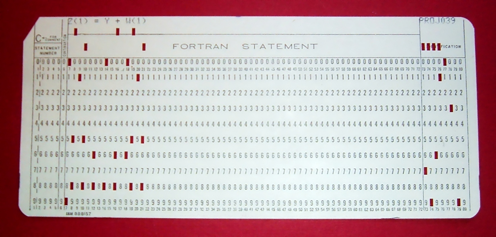
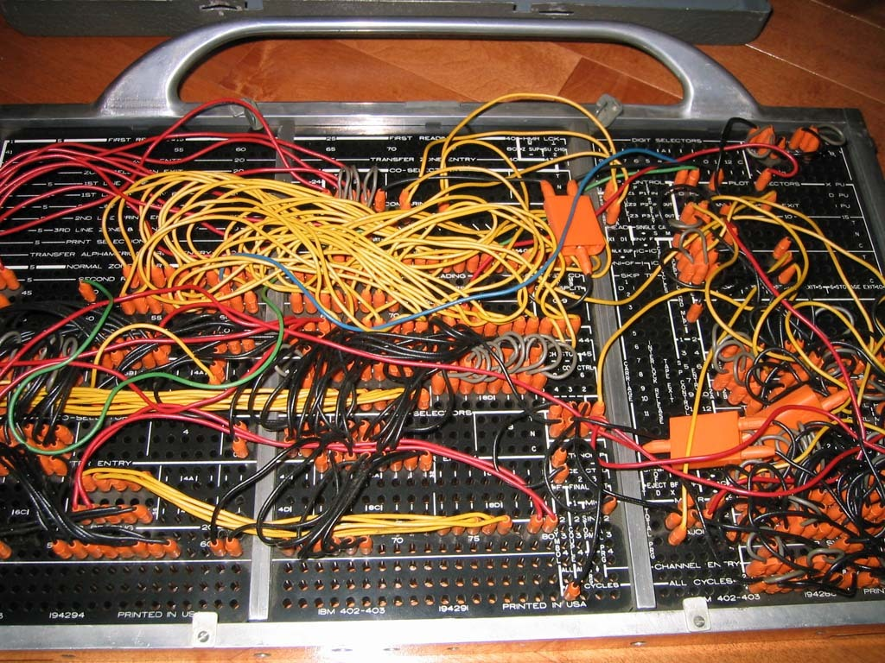
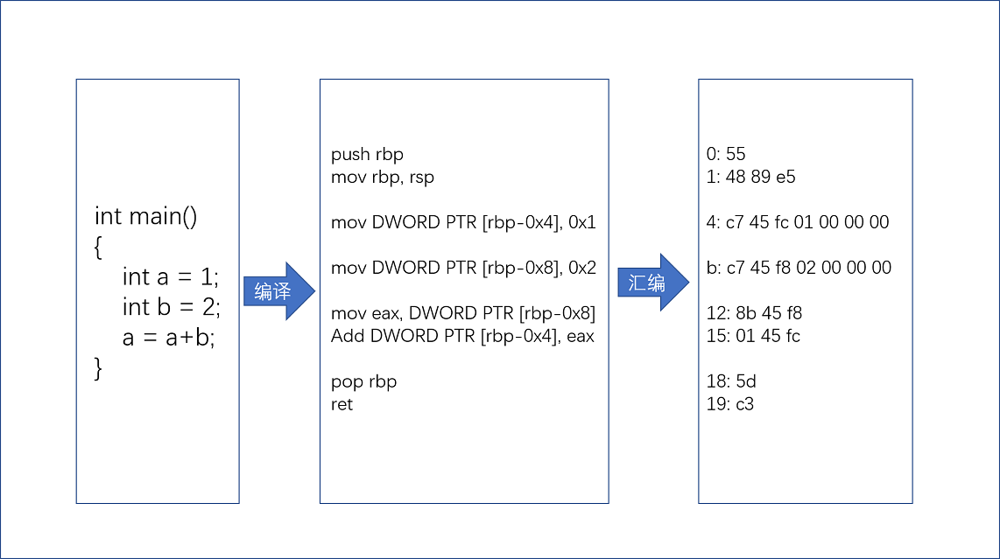
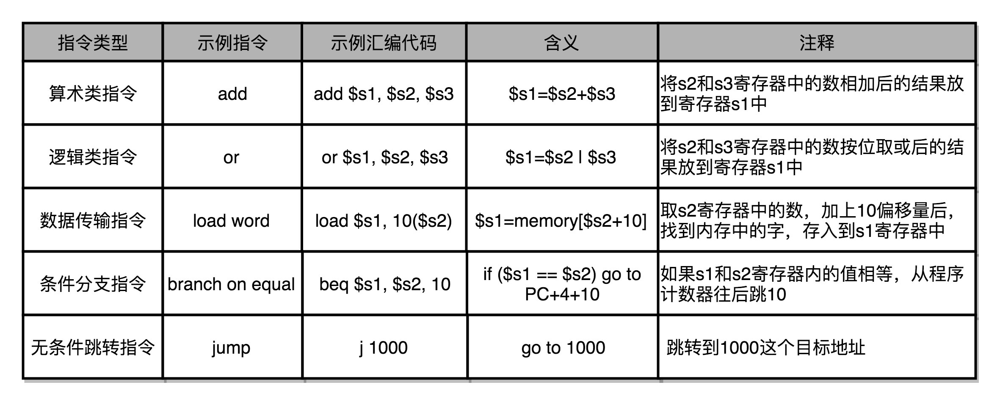
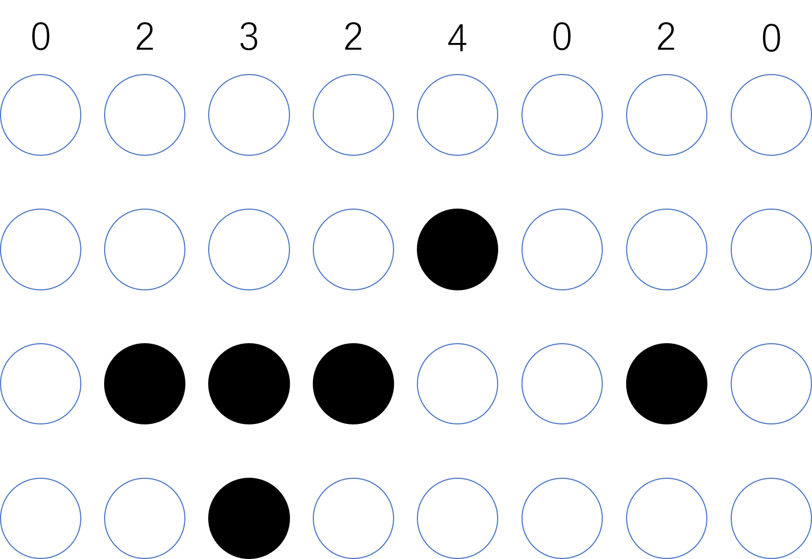

# 05 计算机指令：让我们试试用纸带编程

你在学写程序的时候，有没有想过，古老年代的计算机程序是怎么写出来的？

上大学的时候，我们系里教 C 语言程序设计的老师说，他们当年学写程序的时候，不像现在这样，都是用一种古老的物理设备，叫作“打孔卡（Punched Card）”。用这种设备写程序，可没法像今天这样，掏出键盘就能打字，而是要先在脑海里或者在纸上写出程序，然后在纸带或者卡片上打洞。这样，要写的程序、要处理的数据，就变成一条条纸带或者一张张卡片，之后再交给当时的计算机去处理。



上世纪 60 年代晚期或 70 年代初期，Arnold Reinold 拍摄的 FORTRAN 计算程序的穿孔卡照片，[图片来源](https://commons.wikimedia.org/w/index.php?curid=775153)

你看这个穿孔纸带是不是有点儿像我们现在考试用的答题卡？那个时候，人们在特定的位置上打洞或者不打洞，来代表“0”或者“1”。

为什么早期的计算机程序要使用打孔卡，而不能像我们现在一样，用 C 或者 Python 这样的高级语言来写呢？原因很简单，因为计算机或者说 CPU 本身，并没有能力理解这些高级语言。即使在 2019 年的今天，我们使用的现代个人计算机，仍然只能处理所谓的“机器码”，也就是一连串的“0”和“1”这样的数字。

那么，我们每天用高级语言的程序，最终是怎么变成一串串“0”和“1”的？这一串串“0”和“1”又是怎么在 CPU 中处理的？今天，我们就来仔细介绍一下，“机器码”和“计算机指令”到底是怎么回事。

## 在软硬件接口中，CPU 帮我们做了什么事？

我们常说，CPU 就是计算机的大脑。CPU 的全称是 Central Processing Unit，中文是中央处理器。

我们上一节说了，从 **硬件** 的角度来看，CPU 就是一个超大规模集成电路，通过电路实现了加法、乘法乃至各种各样的处理逻辑。

如果我们从 **软件** 工程师的角度来讲，CPU 就是一个执行各种 **计算机指令** （Instruction Code）的逻辑机器。这里的计算机指令，就好比一门 CPU 能够听得懂的语言，我们也可以把它叫作 **机器语言** （Machine Language）。

不同的 CPU 能够听懂的语言不太一样。比如，我们的个人电脑用的是 Intel 的 CPU，苹果手机用的是 ARM 的 CPU。这两者能听懂的语言就不太一样。类似这样两种 CPU 各自支持的语言，就是两组不同的 **计算机指令集** ，英文叫 Instruction Set。这里面的“Set”，其实就是数学上的集合，代表不同的单词、语法。

所以，如果我们在自己电脑上写一个程序，然后把这个程序复制一下，装到自己的手机上，肯定是没办法正常运行的，因为这两者语言不通。而一台电脑上的程序，简单复制一下到另外一台电脑上，通常就能正常运行，因为这两台 CPU 有着相同的指令集，也就是说，它们的语言相通的。

一个计算机程序，不可能只有一条指令，而是由成千上万条指令组成的。但是 CPU 里不能一直放着所有指令，所以计算机程序平时是存储在存储器中的。这种程序指令存储在存储器里面的计算机，我们就叫作 **存储程序型计算机** （Stored-program Computer）。

说到这里，你可能要问了，难道还有不是存储程序型的计算机么？其实，在没有现代计算机之前，有着聪明才智的工程师们，早就发明了一种叫 Plugboard Computer 的计算设备。我把它直译成“插线板计算机”。在一个布满了各种插口和插座的板子上，工程师们用不同的电线来连接不同的插口和插座，从而来完成各种计算任务。下面这个图就是一台 IBM 的 Plugboard，看起来是不是有一股满满的蒸汽朋克范儿？



一台 IBM 的 Plugboard，[图片来源](https://commons.wikimedia.org/w/index.php?curid=522789)

## 从编译到汇编，代码怎么变成机器码？

了解了计算机指令和计算机指令集，接下来我们来看看，平时编写的代码，到底是怎么变成一条条计算机指令，最后被 CPU 执行的呢？我们拿一小段真实的 C 语言程序来看看。

```
// test.c
int main()
{
  int a = 1; 
  int b = 2;
  a = a + b;
}
```

这是一段再简单不过的 C 语言程序，即便你不了解 C 语言，应该也可以看懂。我们给两个变量 a、b 分别赋值 1、2，然后再将 a、b 两个变量中的值加在一起，重新赋值给了 a 整个变量。

要让这段程序在一个 Linux 操作系统上跑起来，我们需要把整个程序翻译成一个 **汇编语言** （ASM，Assembly Language）的程序，这个过程我们一般叫编译（Compile）成汇编代码。

针对汇编代码，我们可以再用汇编器（Assembler）翻译成机器码（Machine Code）。这些机器码由“0”和“1”组成的机器语言表示。这一条条机器码，就是一条条的 **计算机指令** 。这样一串串的 16 进制数字，就是我们 CPU 能够真正认识的计算机指令。

在一个 Linux 操作系统上，我们可以简单地使用 gcc 和 objdump 这样两条命令，把对应的汇编代码和机器码都打印出来。

```
gcc -g -c test.c
objdump -d -M intel -S test.o
```

可以看到，左侧有一堆数字，这些就是一条条机器码；右边有一系列的 push、mov、add、pop 等，这些就是对应的汇编代码。一行 C 语言代码，有时候只对应一条机器码和汇编代码，有时候则是对应两条机器码和汇编代码。汇编代码和机器码之间是一一对应的。

```
test.o:     file format elf64-x86-64
Disassembly of section .text:
0000000000000000 <main>:
int main()
{
   0:   55                      push   rbp
   1:   48 89 e5                mov    rbp,rsp
  int a = 1; 
   4:   c7 45 fc 01 00 00 00    mov    DWORD PTR [rbp-0x4],0x1
  int b = 2;
   b:   c7 45 f8 02 00 00 00    mov    DWORD PTR [rbp-0x8],0x2
  a = a + b;
  12:   8b 45 f8                mov    eax,DWORD PTR [rbp-0x8]
  15:   01 45 fc                add    DWORD PTR [rbp-0x4],eax
}
  18:   5d                      pop    rbp
  19:   c3                      ret    
```

这个时候你可能又要问了，我们实际在用 GCC（GUC 编译器套装，GUI Compiler Collectipon）编译器的时候，可以直接把代码编译成机器码呀，为什么还需要汇编代码呢？原因很简单，你看着那一串数字表示的机器码，是不是摸不着头脑？但是即使你没有学过汇编代码，看的时候多少也能“猜”出一些这些代码的含义。

因为汇编代码其实就是“给程序员看的机器码”，也正因为这样，机器码和汇编代码是一一对应的。我们人类很容易记住 add、mov 这些用英文表示的指令，而 8b 45 f8 这样的指令，由于很难一下子看明白是在干什么，所以会非常难以记忆。尽管早年互联网上到处流传，大神程序员着拿小刀在光盘上刻出操作系统的梗，但是要让你用打孔卡来写个程序，估计浪费的卡片比用上的卡片要多得多。



从高级语言到汇编代码，再到机器码，就是一个日常开发程序，最终变成了 CPU 可以执行的计算机指令的过程。

## 解析指令和机器码

了解了这个过程，下面我们放大局部，来看看这一行行的汇编代码和机器指令，到底是什么意思。

我们就从平时用的电脑、手机这些设备来说起。这些设备的 CPU 到底有哪些指令呢？这个还真有不少，我们日常用的 Intel CPU，有 2000 条左右的 CPU 指令，实在是太多了，所以我没法一一来给你讲解。不过一般来说，常见的指令可以分成五大类。

第一类是 **算术类指令** 。我们的加减乘除，在 CPU 层面，都会变成一条条算术类指令。

第二类是 **数据传输类指令** 。给变量赋值、在内存里读写数据，用的都是数据传输类指令。

第三类是 **逻辑类指令** 。逻辑上的与或非，都是这一类指令。

第四类是 **条件分支类指令** 。日常我们写的“if/else”，其实都是条件分支类指令。

最后一类是 **无条件跳转指令** 。写一些大一点的程序，我们常常需要写一些函数或者方法。在调用函数的时候，其实就是发起了一个无条件跳转指令。

你可能一下子记不住，或者对这些指令的含义还不能一下子掌握，这里我画了一个表格，给你举例子说明一下，帮你理解、记忆。



下面我们来看看，汇编器是怎么把对应的汇编代码，翻译成为机器码的。

我们说过，不同的 CPU 有不同的指令集，也就对应着不同的汇编语言和不同的机器码。为了方便你快速理解这个机器码的计算方式，我们选用最简单的 MIPS 指令集，来看看机器码是如何生成的。

MIPS 是一组由 MIPS 技术公司在 80 年代中期设计出来的 CPU 指令集。就在最近，MIPS 公司把整个指令集和芯片架构都完全开源了。想要深入研究 CPU 和指令集的同学，我这里推荐[一些](https://www.mips.com/mipsopen/)[资料](https://www.mips.com/mipsopen/)，你可以自己了解下。


MIPS 的指令是一个 32 位的整数，高 6 位叫 **操作码** （Opcode），也就是代表这条指令具体是一条什么样的指令，剩下的 26 位有三种格式，分别是 R、I 和 J。

**R 指令 **是一般用来做算术和逻辑操作，里面有读取和写入数据的寄存器的地址。如果是逻辑位移操作，后面还有位移操作的位移量，而最后的功能码，则是在前面的操作码不够的时候，扩展操作码表示对应的具体指令的。** I 指令 **，则通常是用在数据传输、条件分支，以及在运算的时候使用的并非变量还是常数的时候。这个时候，没有了位移量和操作码，也没有了第三个寄存器，而是把这三部分直接合并成了一个地址值或者一个常数。** J 指令**就是一个跳转指令，高 6 位之外的 26 位都是一个跳转后的地址。

```
add $t0,$s2,$s1
```

我以一个简单的加法算术指令 add t0,t0,s1, $s2, 为例，给你解释。为了方便，我们下面都用十进制来表示对应的代码。

对应的 MIPS 指令里 opcode 是 0，rs 代表第一个寄存器 s1 的地址是 17，rt 代表第二个寄存器 s2 的地址是 18，rd 代表目标的临时寄存器 t0 的地址，是 8。因为不是位移操作，所以位移量是 0。把这些数字拼在一起，就变成了一个 MIPS 的加法指令。

为了读起来方便，我们一般把对应的二进制数，用 16 进制表示出来。在这里，也就是 0X02324020。这个数字也就是这条指令对应的机器码。


回到开头我们说的打孔带。如果我们用打孔代表 1，没有打孔代表 0，用 4 行 8 列代表一条指令来打一个穿孔纸带，那么这条命令大概就长这样：



好了，恭喜你，读到这里，你应该学会了怎么作为人肉编译和汇编器，给纸带打孔编程了，不用再对那些用过打孔卡的前辈们顶礼膜拜了。

## 总结延伸

到这里，想必你也应该明白了，我们在这一讲的开头介绍的打孔卡，其实就是一种存储程序型计算机。

只是这整个程序的机器码，不是通过计算机编译出来的，而是由程序员，用人脑“编译”成一张张卡片的。对应的程序，也不是存储在设备里，而是存储成一张打好孔的卡片。但是整个程序运行的逻辑和其他 CPU 的机器语言没有什么分别，也是处理一串“0”和“1”组成的机器码而已。

这一讲里，我们看到了一个 C 语言程序，是怎么被编译成为汇编语言，乃至通过汇编器再翻译成机器码的。

除了 C 这样的编译型的语言之外，不管是 Python 这样的解释型语言，还是 Java 这样使用虚拟机的语言，其实最终都是由不同形式的程序，把我们写好的代码，转换成 CPU 能够理解的机器码来执行的。

只是解释型语言，是通过解释器在程序运行的时候逐句翻译，而 Java 这样使用虚拟机的语言，则是由虚拟机对编译出来的中间代码进行解释，或者即时编译成为机器码来最终执行。

然而，单单理解一条指令是怎么变成机器码的肯定是不够的。接下来的几节，我会深入讲解，包含条件、循环、函数、递归这些语句的完整程序，是怎么在 CPU 里面执行的。

## 推荐阅读

这一讲里，我们用的是相对最简单的 MIPS 指令集作示例。想要对我们日常使用的 Intel CPU 的指令集有所了解，可以参看《计算机组成与设计：软 / 硬件接口》第 5 版的 2.17 小节。
