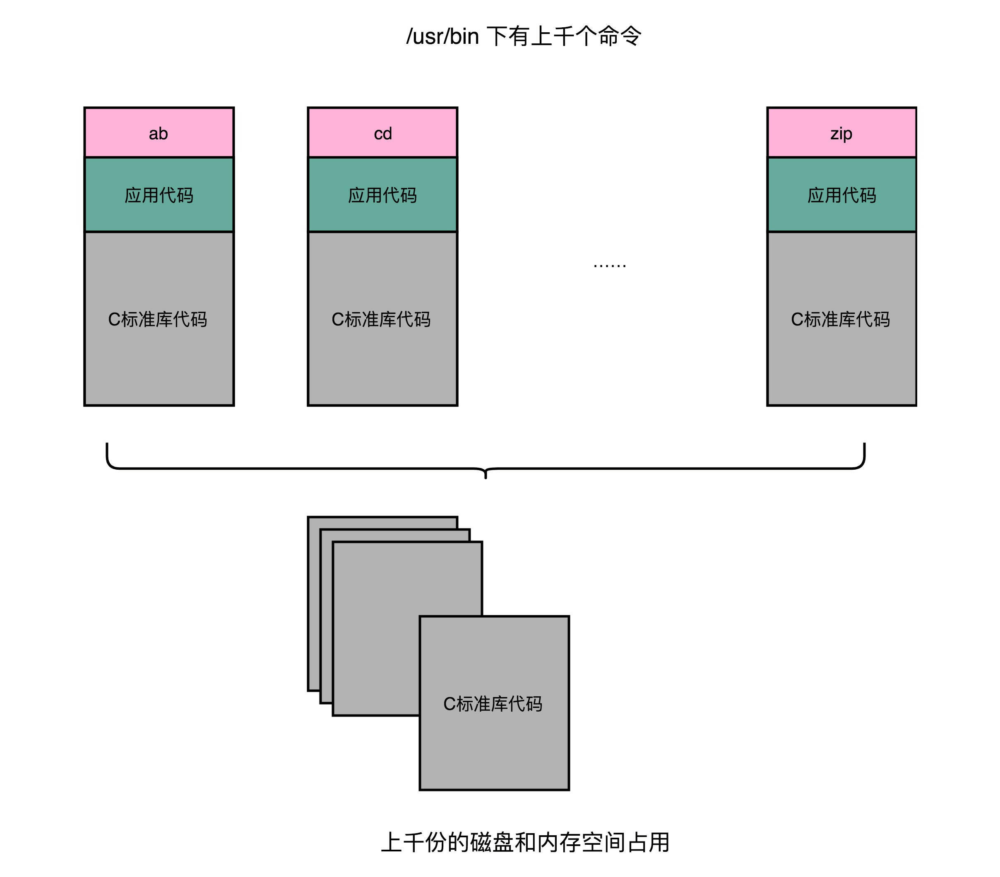
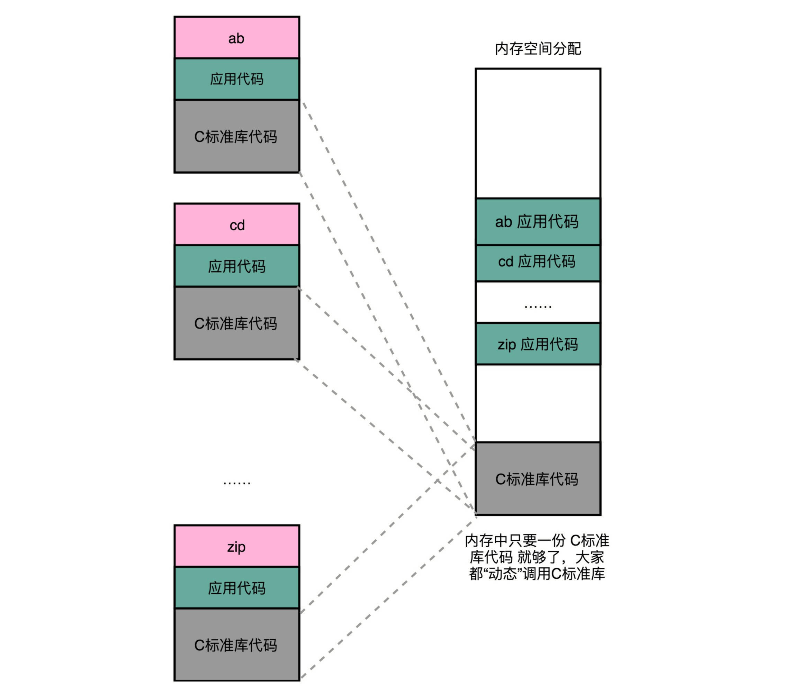
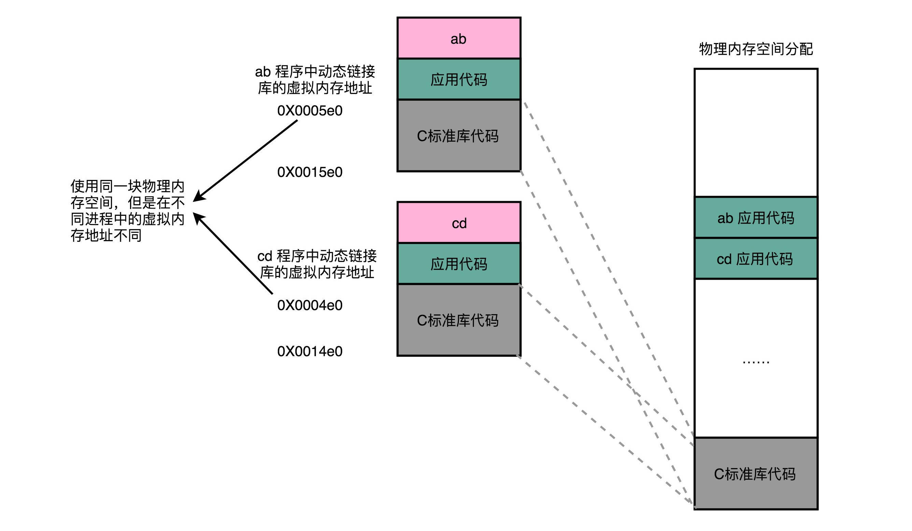

# 10 动态链接：程序内部的“共享单车”

我们之前讲过，程序的链接，是把对应的不同文件内的代码段，合并到一起，成为最后的可执行文件。这个链接的方式，让我们在写代码的时候做到了“复用”。同样的功能代码只要写一次，然后提供给很多不同的程序进行链接就行了。

这么说来，“链接”其实有点儿像我们日常生活中的 **标准化、模块化** 生产。我们有一个可以生产标准螺帽的生产线，就可以生产很多个不同的螺帽。只要需要螺帽，我们都可以通过 **链接** 的方式，去 **复制** 一个出来，放到需要的地方去，大到汽车，小到信箱。

但是，如果我们有很多个程序都要通过装载器装载到内存里面，那里面链接好的同样的功能代码，也都需要再装载一遍，再占一遍内存空间。这就好比，假设每个人都有骑自行车的需要，那我们给每个人都生产一辆自行车带在身边，固然大家都有自行车用了，但是马路上肯定会特别拥挤。



## 链接可以分动、静，共享运行省内存

我们上一节解决程序装载到内存的时候，讲了很多方法。说起来，最根本的问题其实就是 **内存空间不够用** 。如果我们能够让同样功能的代码，在不同的程序里面，不需要各占一份内存空间，那该有多好啊！就好比，现在马路上的共享单车，我们并不需要给每个人都造一辆自行车，只要马路上有这些单车，谁需要的时候，直接通过手机扫码，都可以解锁骑行。

这个思路就引入一种新的链接方法，叫作 **动态链接** （Dynamic Link）。相应的，我们之前说的合并代码段的方法，就是 **静态链接** （Static Link）。

在动态链接的过程中，我们想要“链接”的，不是存储在硬盘上的目标文件代码，而是加载到内存中的 **共享库** （Shared Libraries）。顾名思义，这里的共享库重在“共享“这两个字。

这个加载到内存中的共享库会被很多个程序的指令调用到。在 Windows 下，这些共享库文件就是.dll 文件，也就是 Dynamic-Link Libary（DLL，动态链接库）。在 Linux 下，这些共享库文件就是.so 文件，也就是 Shared Object（一般我们也称之为动态链接库）。这两大操作系统下的文件名后缀，一个用了“动态链接”的意思，另一个用了“共享”的意思，正好覆盖了两方面的含义。



## 地址无关很重要，相对地址解烦恼

不过，要想要在程序运行的时候共享代码，也有一定的要求，就是这些机器码必须是“ **地址无关** ”的。也就是说，我们编译出来的共享库文件的指令代码，是地址无关码（Position-Independent Code）。换句话说就是，这段代码，无论加载在哪个内存地址，都能够正常执行。如果不是这样的代码，就是地址相关的代码。

如果还不明白，我给你举一个生活中的例子。如果我们有一个骑自行车的程序，要“前进 500 米，左转进入天安门广场，再前进 500 米”。它在 500 米之后要到天安门广场了，这就是地址相关的。如果程序是“前进 500 米，左转，再前进 500 米”，无论你在哪里都可以骑车走这 1000 米，没有具体地点的限制，这就是地址无关的。

你可以想想，大部分函数库其实都可以做到地址无关，因为它们都接受特定的输入，进行确定的操作，然后给出返回结果就好了。无论是实现一个向量加法，还是实现一个打印的函数，这些代码逻辑和输入的数据在内存里面的位置并不重要。

而常见的地址相关的代码，比如绝对地址代码（Absolute Code）、利用重定位表的代码等等，都是地址相关的代码。你回想一下我们之前讲过的重定位表。在程序链接的时候，我们就把函数调用后要跳转访问的地址确定下来了，这意味着，如果这个函数加载到一个不同的内存地址，跳转就会失败。



对于所有动态链接共享库的程序来讲，虽然我们的共享库用的都是同一段物理内存地址，但是在不同的应用程序里，它所在的虚拟内存地址是不同的。我们没办法、也不应该要求动态链接同一个共享库的不同程序，必须把这个共享库所使用的虚拟内存地址变成一致。如果这样的话，我们写的程序就必须明确地知道内部的内存地址分配。

那么问题来了，我们要怎么样才能做到，动态共享库编译出来的代码指令，都是地址无关码呢？

动态代码库内部的变量和函数调用都很容易解决，我们只需要使用 **相对地址** （Relative Address）就好了。各种指令中使用到的内存地址，给出的不是一个绝对的地址空间，而是一个相对于当前指令偏移量的内存地址。因为整个共享库是放在一段连续的虚拟内存地址中的，无论装载到哪一段地址，不同指令之间的相对地址都是不变的。

## PLT 和 GOT，动态链接的解决方案

要实现动态链接共享库，也并不困难，和前面的静态链接里的符号表和重定向表类似，还是和前面一样，我们还是拿出一小段代码来看一看。

首先，lib.h 定义了动态链接库的一个函数 show_me_the_money。

```
// lib.h
#ifndef LIB_H
#define LIB_H
void show_me_the_money(int money);
#endif
```

lib.c 包含了 lib.h 的实际实现。

```
// lib.c
#include <stdio.h>
void show_me_the_money(int money)
{
    printf("Show me USD %d from lib.c \n", money);
}
```

然后，show_me_poor.c 调用了 lib 里面的函数。

```
// show_me_poor.c
#include "lib.h"
int main()
{
    int money = 5;
    show_me_the_money(money);
}
```

最后，我们把 lib.c 编译成了一个动态链接库，也就是 .so 文件。

```
gcc lib.c -fPIC -shared -o lib.so
gcc -o show_me_poor show_me_poor.c ./lib.so
```

你可以看到，在编译的过程中，我们指定了一个 **-fPIC** 的参数。这个参数其实就是 Position Independent Code 的意思，也就是我们要把这个编译成一个地址无关代码。

然后，我们再通过 gcc 编译 show_me_poor 动态链接了 lib.so 的可执行文件。在这些操作都完成了之后，我们把 show_me_poor 这个文件通过 objdump 出来看一下。

```
$ objdump -d -M intel -S show_me_poor
复制代码
……
0000000000400540 <[email protected]>:
  400540:       ff 35 12 05 20 00       push   QWORD PTR [rip+0x200512]        # 600a58 <_GLOBAL_OFFSET_TABLE_+0x8>
  400546:       ff 25 14 05 20 00       jmp    QWORD PTR [rip+0x200514]        # 600a60 <_GLOBAL_OFFSET_TABLE_+0x10>
  40054c:       0f 1f 40 00             nop    DWORD PTR [rax+0x0]
0000000000400550 <[email protected]>:
  400550:       ff 25 12 05 20 00       jmp    QWORD PTR [rip+0x200512]        # 600a68 <_GLOBAL_OFFSET_TABLE_+0x18>
  400556:       68 00 00 00 00          push   0x0
  40055b:       e9 e0 ff ff ff          jmp    400540 <_init+0x28>
……
0000000000400676 <main>:
  400676:       55                      push   rbp
  400677:       48 89 e5                mov    rbp,rsp
  40067a:       48 83 ec 10             sub    rsp,0x10
  40067e:       c7 45 fc 05 00 00 00    mov    DWORD PTR [rbp-0x4],0x5
  400685:       8b 45 fc                mov    eax,DWORD PTR [rbp-0x4]
  400688:       89 c7                   mov    edi,eax
  40068a:       e8 c1 fe ff ff          call   400550 <[email protected]>
  40068f:       c9                      leave  
  400690:       c3                      ret    
  400691:       66 2e 0f 1f 84 00 00    nop    WORD PTR cs:[rax+rax*1+0x0]
  400698:       00 00 00 
  40069b:       0f 1f 44 00 00          nop    DWORD PTR [rax+rax*1+0x0]
……
```

我们还是只关心整个可执行文件中的一小部分内容。你应该可以看到，在 main 函数调用 show_me_the_money 的函数的时候，对应的代码是这样的：

```
call   400550 <[email protected]>
复制代码
```

这里后面有一个 @plt 的关键字，代表了我们需要从 PLT，也就是 **程序链接表** （Procedure Link Table）里面找要调用的函数。对应的地址呢，则是 400550 这个地址。

那当我们把目光挪到上面的 400550 这个地址，你又会看到里面进行了一次跳转，这个跳转指定的跳转地址，你可以在后面的注释里面可以看到，GLOBAL_OFFSET_TABLE+0x18。这里的 GLOBAL_OFFSET_TABLE，就是我接下来要说的全局偏移表。

```
  400550:       ff 25 12 05 20 00       jmp    QWORD PTR [rip+0x200512]        # 600a68 <_GLOBAL_OFFSET_TABLE_+0x18>
复制代码
```

在动态链接对应的共享库，我们在共享库的 data section 里面，保存了一张 **全局偏移表** （GOT，Global Offset Table）。 **虽然共享库的代码部分的物理内存是共享的，但是数据部分是各个动态链接它的应用程序里面各加载一份的。** 所有需要引用当前共享库外部的地址的指令，都会查询 GOT，来找到当前运行程序的虚拟内存里的对应位置。而 GOT 表里的数据，则是在我们加载一个个共享库的时候写进去的。

不同的进程，调用同样的 lib.so，各自 GOT 里面指向最终加载的动态链接库里面的虚拟内存地址是不同的。

这样，虽然不同的程序调用的同样的动态库，各自的内存地址是独立的，调用的又都是同一个动态库，但是不需要去修改动态库里面的代码所使用的地址，而是各个程序各自维护好自己的 GOT，能够找到对应的动态库就好了。


我们的 GOT 表位于共享库自己的数据段里。GOT 表在内存里和对应的代码段位置之间的偏移量，始终是确定的。这样，我们的共享库就是地址无关的代码，对应的各个程序只需要在物理内存里面加载同一份代码。而我们又要通过各个可执行程序在加载时，生成的各不相同的 GOT 表，来找到它需要调用到的外部变量和函数的地址。

这是一个典型的、不修改代码，而是通过修改“ **地址数据** ”来进行关联的办法。它有点像我们在 C 语言里面用函数指针来调用对应的函数，并不是通过预先已经确定好的函数名称来调用，而是利用当时它在内存里面的动态地址来调用。

## 总结延伸

这一讲，我们终于在静态链接和程序装载之后，利用动态链接把我们的内存利用到了极致。同样功能的代码生成的共享库，我们只要在内存里面保留一份就好了。这样，我们不仅能够做到代码在开发阶段的复用，也能做到代码在运行阶段的复用。

实际上，在进行 Linux 下的程序开发的时候，我们一直会用到各种各样的动态链接库。C 语言的标准库就在 1MB 以上。我们撰写任何一个程序可能都需要用到这个库，常见的 Linux 服务器里，/usr/bin 下面就有上千个可执行文件。如果每一个都把标准库静态链接进来的，几 GB 乃至几十 GB 的磁盘空间一下子就用出去了。如果我们服务端的多进程应用要开上千个进程，几 GB 的内存空间也会一下子就用出去了。这个问题在过去计算机的内存较少的时候更加显著。

通过动态链接这个方式，可以说彻底解决了这个问题。就像共享单车一样，如果仔细经营，是一个很有社会价值的事情，但是如果粗暴地把它变成无限制地复制生产，给每个人造一辆，只会在系统内制造大量无用的垃圾。

过去的 05～09 这五讲里，我们已经把程序怎么从源代码变成指令、数据，并装载到内存里面，由 CPU 一条条执行下去的过程讲完了。希望你能有所收获，对于一个程序是怎么跑起来的，有了一个初步的认识。

## 推荐阅读

想要更加深入地了解动态链接，我推荐你可以读一读《程序员的自我修养：链接、装载和库》的第 7 章，里面深入地讲解了，动态链接里程序内的数据布局和对应数据的加载关系。
