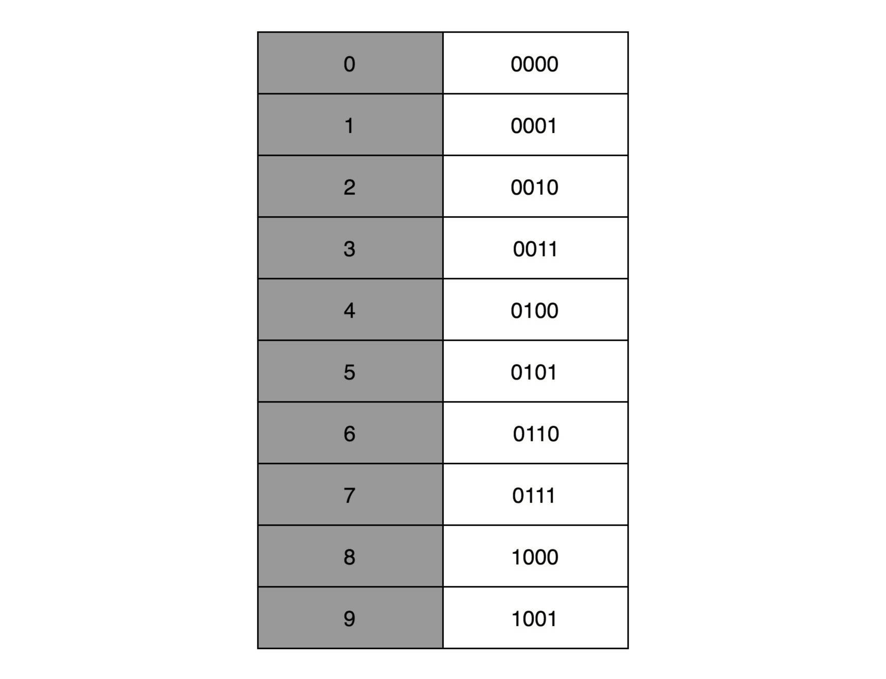
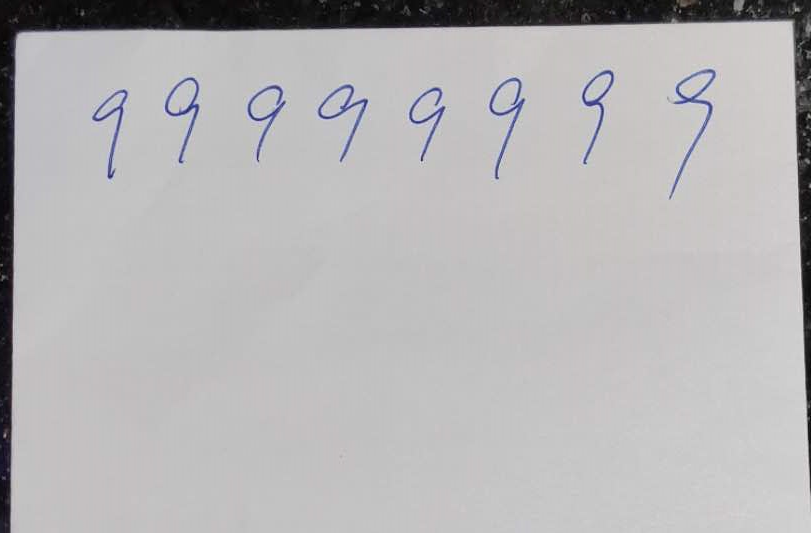
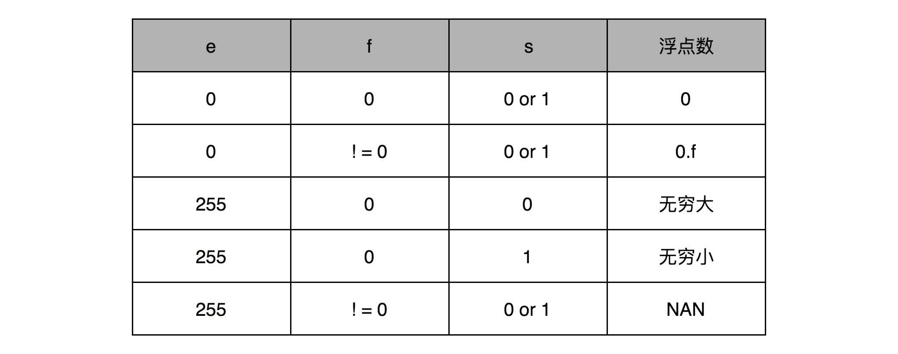

15 浮点数和定点数（上）：怎么用有限的Bit表示尽可能多的信息？
=================================

在我们日常的程序开发中，不只会用到整数。更多情况下，我们用到的都是实数。比如，我们开发一个电商 App，商品的价格常常会是 9 块 9；再比如，现在流行的深度学习算法，对应的机器学习里的模型里的各个权重也都是 1.23 这样的数。可以说，在实际的应用过程中，这些有零有整的实数，是和整数同样常用的数据类型，我们也需要考虑到。

浮点数的不精确性
--------

那么，我们能不能用二进制表示所有的实数，然后在二进制下计算它的加减乘除呢？先不着急，我们从一个有意思的小案例来看。

你可以在 Linux 下打开 Python 的命令行 Console，也可以在 Chrome 浏览器里面通过开发者工具，打开浏览器里的 Console，在里面输入“0.3 + 0.6”，然后看看你会得到一个什么样的结果。

```
>>> 0.3 + 0.6

0.8999999999999999

```

不知道你有没有大吃一惊，这么简单的一个加法，无论是在 Python 还是在 JavaScript 里面，算出来的结果居然不是准确的 0.9，而是 0.8999999999999999 这么个结果。这是为什么呢？

在回答为什么之前，我们先来想一个更抽象的问题。通过前面的这么多讲，你应该知道我们现在用的计算机通常用 16/32 个比特（bit）来表示一个数。那我问你，我们用 32 个比特，能够表示所有实数吗？

答案很显然是不能。32 个比特，只能表示 2 的 32 次方个不同的数，差不多是 40 亿个。如果表示的数要超过这个数，就会有两个不同的数的二进制表示是一样的。那计算机可就会一筹莫展，不知道这个数到底是多少。

40 亿个数看似已经很多了，但是比起无限多的实数集合却只是沧海一粟。所以，这个时候，计算机的设计者们，就要面临一个问题了：我到底应该让这 40 亿个数映射到实数集合上的哪些数，在实际应用中才能最划得来呢？

定点数的表示
------

有一个很直观的想法，就是我们用 4 个比特来表示 0～9 的整数，那么 32 个比特就可以表示 8 个这样的整数。然后我们把最右边的 2 个 0～9 的整数，当成小数部分；把左边 6 个 0～9 的整数，当成整数部分。这样，我们就可以用 32 个比特，来表示从 0 到 999999.99 这样 1 亿个实数了。



这种用二进制来表示十进制的编码方式，叫作[**BCD 编码**](https://zh.wikipedia.org/wiki/二進碼十進數)（Binary-Coded Decimal）。其实它的运用非常广泛，最常用的是在超市、银行这样需要用小数记录金额的情况里。在超市里面，我们的小数最多也就到分。这样的表示方式，比较直观清楚，也满足了小数部分的计算。

不过，这样的表示方式也有几个缺点。

\*\*第一，这样的表示方式有点“浪费”。\*\*本来 32 个比特我们可以表示 40 亿个不同的数，但是在 BCD 编码下，只能表示 1 亿个数，如果我们要精确到分的话，那么能够表示的最大金额也就是到 100 万。如果我们的货币单位是人民币或者美元还好，如果我们的货币单位变成了津巴布韦币，这个数量就不太够用了。

\*\*第二，这样的表示方式没办法同时表示很大的数字和很小的数字。\*\*我们在写程序的时候，实数的用途可能是多种多样的。有时候我们想要表示商品的金额，关心的是 9.99 这样小的数字；有时候，我们又要进行物理学的运算，需要表示光速，也就是 3×1083×108 这样很大的数字。那么，我们有没有一个办法，既能够表示很小的数，又能表示很大的数呢？

浮点数的表示
------

答案当然是有的，就是你可能经常听说过的 **浮点数** （Floating Point），也就是 **float 类型** 。

我们先来想一想。如果我们想在一张便签纸上，用一行来写一个十进制数，能够写下多大范围的数？因为我们要让人能够看清楚，所以字最小也有一个限制。你会发现一个和上面我们用 BCD 编码表示数一样的问题，就是纸张的宽度限制了我们能够表示的数的大小。如果宽度只放得下 8 个数字，那么我们还是只能写下最大到 99999999 这样的数字。



有限宽度的便签，只能写下有限大小的数字

其实，这里的纸张宽度，就和我们 32 个比特一样，是在空间层面的限制。那么，在现实生活中，我们是怎么表示一个很大的数的呢？比如说，我们想要在一本科普书里，写一下宇宙内原子的数量，莫非是用一页纸，用好多行写下很多个 0 么？

当然不是了，我们会用科学计数法来表示这个数字。宇宙内的原子的数量，大概在 10 的 82 次方左右，我们就用 1.0×10821.0×1082 这样的形式来表示这个数值，不需要写下 82 个 0。

在计算机里，我们也可以用一样的办法，用科学计数法来表示实数。浮点数的科学计数法的表示，有一个 **IEEE** 的标准，它定义了两个基本的格式。一个是用 32 比特表示单精度的浮点数，也就是我们常常说的 float 或者 float32 类型。另外一个是用 64 比特表示双精度的浮点数，也就是我们平时说的 double 或者 float64 类型。

双精度类型和单精度类型差不多，这里，我们来看单精度类型，双精度你自然也就明白了。


单精度的 32 个比特可以分成三部分。

第一部分是一个 **符号位** ，用来表示是正数还是负数。我们一般用 **s** 来表示。在浮点数里，我们不像正数分符号数还是无符号数，所有的浮点数都是有符号的。

接下来是一个 8 个比特组成的 **指数位** 。我们一般用 **e** 来表示。8 个比特能够表示的整数空间，就是 0～255。我们在这里用 1～254 映射到 -126～127 这 254 个有正有负的数上。因为我们的浮点数，不仅仅想要表示很大的数，还希望能够表示很小的数，所以指数位也会有负数。

你发现没，我们没有用到 0 和 255。没错，这里的 0（也就是 8 个比特全部为 0） 和 255 （也就是 8 个比特全部为 1）另有它用，我们等一下再讲。

最后，是一个 23 个比特组成的 **有效数位** 。我们用 **f** 来表示。综合科学计数法，我们的浮点数就可以表示成下面这样：

(−1)s×1.f×2e(−1)s×1.f×2e

你会发现，这里的浮点数，没有办法表示 0。的确，要表示 0 和一些特殊的数，我们就要用上在 e 里面留下的 0 和 255 这两个表示，这两个表示其实是两个标记位。在 e 为 0 且 f 为 0 的时候，我们就把这个浮点数认为是 0。至于其它的 e 是 0 或者 255 的特殊情况，你可以看下面这个表格，分别可以表示出无穷大、无穷小、NAN 以及一个特殊的不规范数。



我们可以以 0.5 为例子。0.5 的符号为 s 应该是 0，f 应该是 0，而 e 应该是 -1，也就是

0.5=(−1)0×1.0×2−1=0.50.5=(−1)0×1.0×2−1=0.5，对应的浮点数表示，就是 32 个比特。


s=0，e=2−1s=0，e=2−1，需要注意，e 表示从 -126 到 127 个，-1 是其中的第 126 个数，这里的 e 如果用整数表示，就是 26+25+24+23+22+21=12626+25+24+23+22+21=126，1.f=1.01.f=1.0。

在这样的浮点数表示下，不考虑符号的话，浮点数能够表示的最小的数和最大的数，差不多是 1.17×10−381.17×10−38 和 3.40×10383.40×1038。比前面的 BCD 编码能够表示的范围大多了。

总结延伸
----

你会看到，在这样的表示方式下，浮点数能够表示的数据范围一下子大了很多。正是因为这个数对应的小数点的位置是“浮动”的，它才被称为浮点数。随着指数位 e 的值的不同，小数点的位置也在变动。对应的，前面的 BCD 编码的实数，就是小数点固定在某一位的方式，我们也就把它称为 **定点数** 。

回到我们最开头，为什么我们用 0.3 + 0.6 不能得到 0.9 呢？这是因为，浮点数没有办法精确表示 0.3、0.6 和 0.9。事实上，我们拿出 0.1～0.9 这 9 个数，其中只有 0.5 能够被精确地表示成二进制的浮点数，也就是 s = 0、e = -1、f = 0 这样的情况。

而 0.3、0.6 乃至我们希望的 0.9，都只是一个近似的表达。这个也为我们带来了一个挑战，就是浮点数无论是表示还是计算其实都是近似计算。那么，在使用过程中，我们该怎么来使用浮点数，以及使用浮点数会遇到些什么问题呢？下一讲，我会用更多的实际代码案例，来带你看看浮点数计算中的各种“坑”。

推荐阅读
----

如果对浮点数的表示还不是很清楚，你可以仔细阅读一下《计算机组成与设计：硬件 / 软件接口》的 3.5.1 节。
