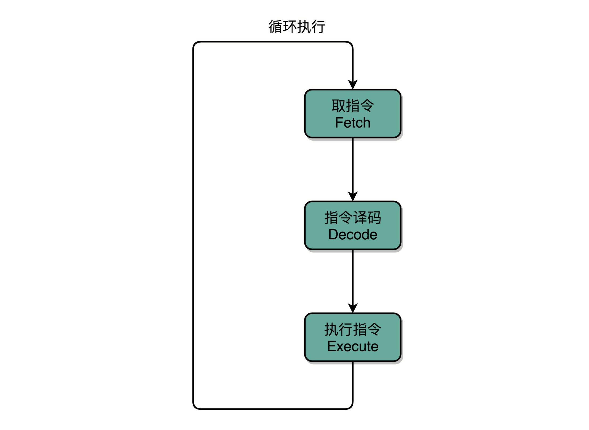
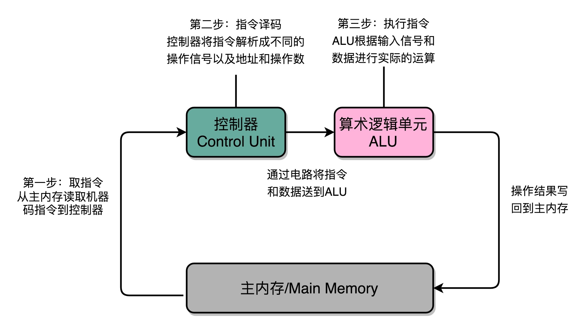
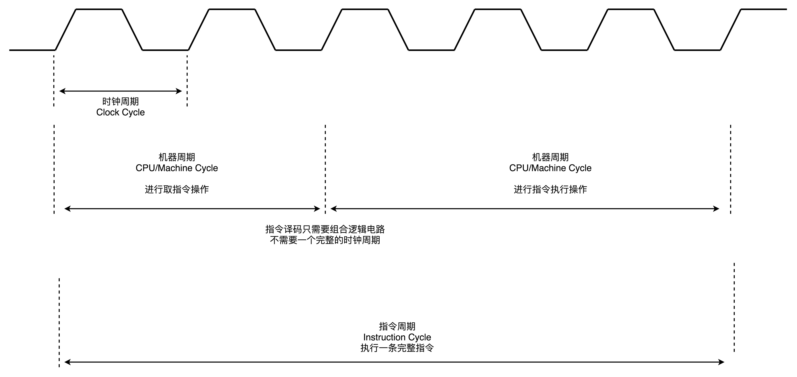
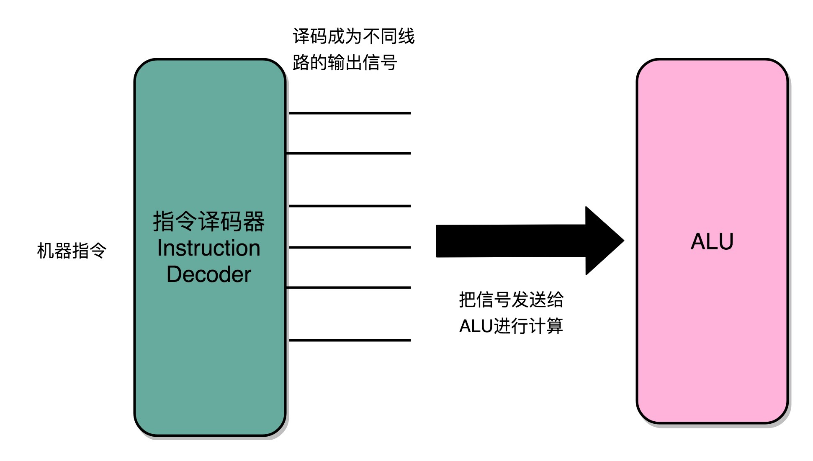

# 17 建立数据通路（上）：指令加运算=CPU

前面几讲里，我从两个不同的部分为你讲解了 CPU 的功能。

在“ **指令** ”部分，我为你讲解了计算机的“指令”是怎么运行的，也就是我们撰写的代码，是怎么变成一条条的机器能够理解的指令的，以及是按照什么样的顺序运行的。

在“ **计算** ”部分，我为你讲解了计算机的“计算”部分是怎么执行的，数据的二进制表示是怎么样的，我们执行的加法和乘法又是通过什么样的电路来实现的。

然而，光知道这两部分还不能算是真正揭开了 CPU 的秘密，只有把“指令”和“计算”这两部分功能连通起来，我们才能构成一个真正完整的 CPU。这一讲，我们就在前面知识的基础上，来看一个完整的 CPU 是怎么运转起来的。

## 指令周期（Instruction Cycle）

前面讲计算机机器码的时候，我向你介绍过 PC 寄存器、指令寄存器，还介绍过 MIPS 体系结构的计算机所用到的 R、I、J 类指令。如果我们仔细看一看，可以发现，计算机每执行一条指令的过程，可以分解成这样几个步骤。

1.**Fetch** （**取得指令**），也就是从 PC 寄存器里找到对应的指令地址，根据指令地址从内存里把具体的指令，加载到指令寄存器中，然后把 PC 寄存器自增，好在未来执行下一条指令。

2.**Decode **（** 指令译码**），也就是根据指令寄存器里面的指令，解析成要进行什么样的操作，是 R、I、J 中的哪一种指令，具体要操作哪些寄存器、数据或者内存地址。

3.**Execute **（** 执行指令**），也就是实际运行对应的 R、I、J 这些特定的指令，进行算术逻辑操作、数据传输或者直接的地址跳转。

\\4. 重复进行 1～3 的步骤。

这样的步骤，其实就是一个永不停歇的“**Fetch - Decode - Execute **”的循环，我们把这个循环称之为** 指令周期**（Instruction Cycle）。

指令周期（Instruction Cycle）

在这个循环过程中，不同部分其实是由计算机中的不同组件完成的。不知道你还记不记得，我们在专栏一开始讲的计算机组成的五大组件？

在取指令的阶段，我们的指令是放在**存储器 **里的，实际上，通过 PC 寄存器和指令寄存器取出指令的过程，是由** 控制器 **（Control Unit）操作的。指令的解码过程，也是由** 控制器 **进行的。一旦到了执行指令阶段，无论是进行算术操作、逻辑操作的 R 型指令，还是进行数据传输、条件分支的 I 型指令，都是由** 算术逻辑单元 **（ALU）操作的，也就是由** 运算器 **处理的。不过，如果是一个简单的无条件地址跳转，那么我们可以直接在** 控制器**里面完成，不需要用到运算器。

不同步骤在不同组件之内完成

除了 Instruction Cycle 这个指令周期，在 CPU 里面我们还会提到另外两个常见的 Cycle。一个叫**Machine Cycle **，** 机器周期 **或者** CPU 周期**。CPU 内部的操作速度很快，但是访问内存的速度却要慢很多。每一条指令都需要从内存里面加载而来，所以我们一般把从内存里面读取一条指令的最短时间，称为 CPU 周期。

还有一个是我们之前提过的**Clock Cycle **，也就是** 时钟周期**以及我们机器的主频。一个 CPU 周期，通常会由几个时钟周期累积起来。一个 CPU 周期的时间，就是这几个 Clock Cycle 的总和。

对于一个指令周期来说，我们取出一条指令，然后执行它，至少需要两个 CPU 周期。取出指令至少需要一个 CPU 周期，执行至少也需要一个 CPU 周期，复杂的指令则需要更多的 CPU 周期。

三个周期（Cycle）之间的关系

所以，我们说一个指令周期，包含多个 CPU 周期，而一个 CPU 周期包含多个时钟周期。

## 建立数据通路

在专栏一开始，不少同学留言问到，ALU 就是运算器吗？在讨论计算机五大组件的运算器的时候，我们提到过好几个不同的相关名词，比如 ALU、运算器、处理器单元、数据通路，它们之间到底是什么关系呢？

名字是什么其实并不重要，一般来说，我们可以认为，数据通路就是我们的处理器单元。它通常由两类原件组成。

第一类叫**操作元件**，也叫组合逻辑元件（Combinational Element），其实就是我们的 ALU。在前面讲 ALU 的过程中可以看到，它们的功能就是在特定的输入下，根据下面的组合电路的逻辑，生成特定的输出。

第二类叫**存储元件**，也有叫状态元件（State Element）的。比如我们在计算过程中需要用到的寄存器，无论是通用寄存器还是状态寄存器，其实都是存储元件。

我们通过数据总线的方式，把它们连接起来，就可以完成数据的存储、处理和传输了，这就是所谓的**建立数据通路**了。

下面我们来说**控制器**。它的逻辑就没那么复杂了。我们可以把它看成只是机械地重复“Fetch - Decode - Execute“循环中的前两个步骤，然后把最后一个步骤，通过控制器产生的控制信号，交给 ALU 去处理。

听起来是不是很简单？实际上，控制器的电路特别复杂。下面我给你详细解析一下。

一方面，所有 CPU 支持的指令，都会在控制器里面，被解析成不同的输出信号。我们之前说过，现在的 Intel CPU 支持 2000 个以上的指令。这意味着，控制器输出的控制信号，至少有 2000 种不同的组合。

运算器里的 ALU 和各种组合逻辑电路，可以认为是一个固定功能的电路。控制器“翻译”出来的，就是不同的控制信号。这些控制信号，告诉 ALU 去做不同的计算。可以说正是控制器的存在，让我们可以“编程”来实现功能，能让我们的“存储程序型计算机”名副其实。

指令译码器将输入的机器码，解析成不同的操作码和操作数，然后传输给 ALU 进行计算

## CPU 所需要的硬件电路

那么，要想搭建出来整个 CPU，我们需要在数字电路层面，实现这样一些功能。

首先，自然是我们之前已经讲解过的 ALU 了，它实际就是一个没有状态的，根据输入计算输出结果的第一个电路。

第二，我们需要有一个能够进行状态读写的电路元件，也就是我们的寄存器。我们需要有一个电路，能够存储到上一次的计算结果。这个计算结果并不一定要立刻拿到电路的下游去使用，但是可以在需要的时候拿出来用。常见的能够进行状态读写的电路，就有锁存器（Latch），以及我们后面要讲的 D 触发器（Data/Delay Flip-flop）的电路。

第三，我们需要有一个“自动”的电路，按照固定的周期，不停地实现 PC 寄存器自增，自动地去执行“Fetch - Decode - Execute“的步骤。我们的程序执行，并不是靠人去拨动开关来执行指令的。我们希望有一个“自动”的电路，不停地去一条条执行指令。

我们看似写了各种复杂的高级程序进行各种函数调用、条件跳转。其实只是修改 PC 寄存器里面的地址。PC 寄存器里面的地址一修改，计算机就可以加载一条指令新指令，往下运行。实际上，PC 寄存器还有一个名字，就叫作程序计数器。顾名思义，就是随着时间变化，不断去数数。数的数字变大了，就去执行一条新指令。所以，我们需要的就是一个自动数数的电路。

第四，我们需要有一个“译码”的电路。无论是对于指令进行 decode，还是对于拿到的内存地址去获取对应的数据或者指令，我们都需要通过一个电路找到对应的数据。这个对应的自然就是“译码器”的电路了。

好了，现在我们把这四类电路，通过各种方式组合在一起，就能最终组成功能强大的 CPU 了。但是，要实现这四种电路中的中间两种，我们还需要时钟电路的配合。下一节，我们一起来看一看，这些基础的电路功能是怎么实现的，以及怎么把这些电路组合起来变成一个 CPU。

## 总结延伸

好了，到这里，我们已经把 CPU 运转需要的数据通路和控制器介绍完了，也找出了需要完成这些功能，需要的 4 种基本电路。它们分别是，ALU 这样的组合逻辑电路、用来存储数据的锁存器和 D 触发器电路、用来实现 PC 寄存器的计数器电路，以及用来解码和寻址的译码器电路。

虽然 CPU 已经是由几十亿个晶体管组成的及其复杂的电路，但是它仍然是由这样一个个基本功能的电路组成的。只要搞清楚这些电路的运作原理，你自然也就弄明白了 CPU 的工作原理。

## 推荐阅读

如果想要了解数据通路，可以参看《计算机组成与设计 硬件软件接口》的第 5 版的 4.1 到 4.4 节。专栏里的内容是从更高一层的抽象逻辑来解释这些问题，而教科书里包含了更多电路的技术细节。这两者结合起来学习，能够帮助你更深入地去理解数据通路。
