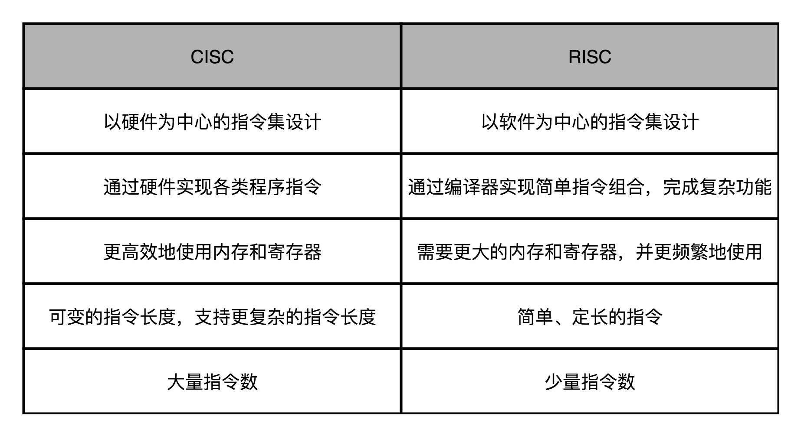
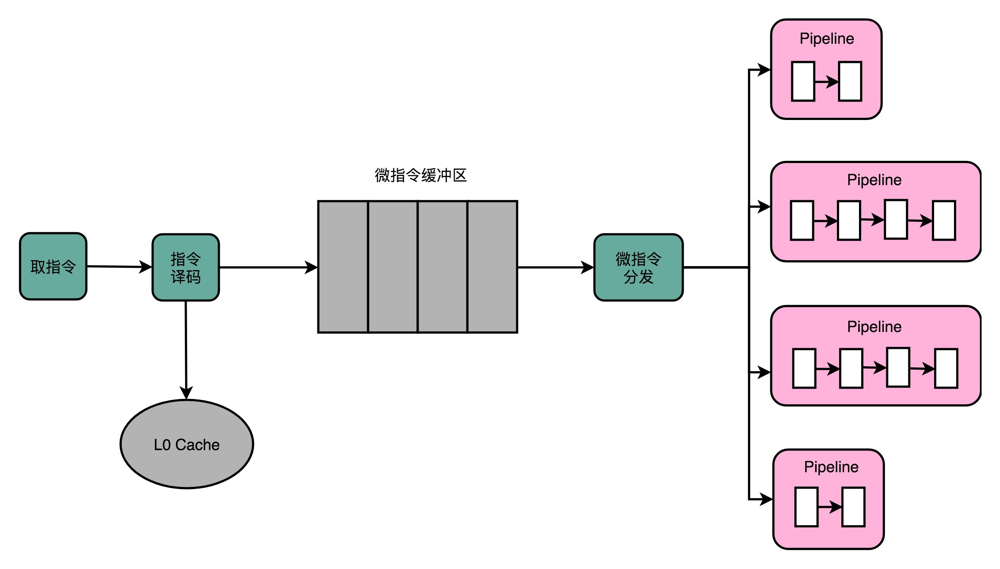

29 CISC和RISC：为什么手机芯片都是ARM？
==========================

我在[第 5 讲](https://time.geekbang.org/column/article/93359)讲计算机指令的时候，给你看过 MIPS 体系结构计算机的机器指令格式。MIPS 的指令都是固定的 32 位长度，如果要用一个打孔卡来表示，并不复杂。


MIPS 机器码的长度都是固定的 32 位

[第 6 讲](https://time.geekbang.org/column/article/94075)的时候，我带你编译了一些简单的 C 语言程序，看了 x86 体系结构下的汇编代码。眼尖的话，你应该能发现，每一条机器码的长度是不一样的。

Intel x86 的机器码的长度是可变的

而 CPU 的指令集里的机器码是固定长度还是可变长度，也就是 **复杂指令集** （Complex Instruction Set Computing，简称 CISC）和 **精简指令集** （Reduced Instruction Set Computing，简称 RISC）这两种风格的指令集一个最重要的差别。那今天我们就来看复杂指令集和精简指令集之间的对比、差异以及历史纠葛。

CISC VS RISC：历史的车轮不总是向前的
------------------------

在计算机历史的早期，其实没有什么 CISC 和 RISC 之分。或者说，所有的 CPU 其实都是 CISC。

虽然冯·诺依曼高屋建瓴地提出了存储程序型计算机的基础架构，但是实际的计算机设计和制造还是严格受硬件层面的限制。当时的计算机很慢，存储空间也很小。《人月神话》这本软件工程界的名著，讲的是花了好几年设计 IBM 360 这台计算机的经验。IBM 360 的最低配置，每秒只能运行 34500 条指令，只有 8K 的内存。为了让计算机能够做尽量多的工作，每一个字节乃至每一个比特都特别重要。

所以，CPU 指令集的设计，需要仔细考虑硬件限制。为了性能考虑，很多功能都直接通过硬件电路来完成。为了少用内存，指令的长度也是可变的。就像算法和数据结构里的[赫夫曼编码（Huffman coding）](https://en.wikipedia.org/wiki/Huffman_coding)一样，常用的指令要短一些，不常用的指令可以长一些。那个时候的计算机，想要用尽可能少的内存空间，存储尽量多的指令。

不过，历史的车轮滚滚向前，计算机的性能越来越好，存储的空间也越来越大了。到了 70 年代末，RISC 开始登上了历史的舞台。当时，[UC Berkeley](https://en.wikipedia.org/wiki/University_of_California,_Berkeley)的大卫·帕特森（David Patterson）教授发现，实际在 CPU 运行的程序里，80% 的时间都是在使用 20% 的简单指令。于是，他就提出了 RISC 的理念。自此之后，RISC 类型的 CPU 开始快速蓬勃发展。

我经常推荐的课后阅读材料，有不少是来自《计算机组成与设计：硬件 / 软件接口》和《计算机体系结构：量化研究方法》这两本教科书。大卫·帕特森教授正是这两本书的作者。此外，他还在 2017 年获得了图灵奖。



RISC 架构的 CPU 究竟是什么样的呢？为什么它能在这么短的时间内受到如此大的追捧？

RISC 架构的 CPU 的想法其实非常直观。既然我们 80% 的时间都在用 20% 的简单指令，那我们能不能只要那 20% 的简单指令就好了呢？答案当然是可以的。因为指令数量多，计算机科学家们在软硬件两方面都受到了很多挑战。

在硬件层面，我们要想支持更多的复杂指令，CPU 里面的电路就要更复杂，设计起来也就更困难。更复杂的电路，在散热和功耗层面，也会带来更大的挑战。在软件层面，支持更多的复杂指令，编译器的优化就变得更困难。毕竟，面向 2000 个指令来优化编译器和面向 500 个指令来优化编译器的困难是完全不同的。

于是，在 RISC 架构里面，CPU 选择把指令“精简”到 20% 的简单指令。而原先的复杂指令，则通过用简单指令组合起来来实现，让软件来实现硬件的功能。这样，CPU 的整个硬件设计就会变得更简单了，在硬件层面提升性能也会变得更容易了。

RISC 的 CPU 里完成指令的电路变得简单了，于是也就腾出了更多的空间。这个空间，常常被拿来放通用寄存器。因为 RISC 完成同样的功能，执行的指令数量要比 CISC 多，所以，如果需要反复从内存里面读取指令或者数据到寄存器里来，那么很多时间就会花在访问内存上。于是，RISC 架构的 CPU 往往就有更多的通用寄存器。

除了寄存器这样的存储空间，RISC 的 CPU 也可以把更多的晶体管，用来实现更好的分支预测等相关功能，进一步去提升 CPU 实际的执行效率。

总的来说，对于 CISC 和 RISC 的对比，我们可以一起回到第 4 讲讲的程序运行时间的公式：

程序的 CPU 执行时间 = 指令数 × CPI × Clock Cycle Time

CISC 的架构，其实就是通过优化 **指令数** ，来减少 CPU 的执行时间。而 RISC 的架构，其实是在优化 CPI。因为指令比较简单，需要的时钟周期就比较少。

因为 RISC 降低了 CPU 硬件的设计和开发难度，所以从 80 年代开始，大部分新的 CPU 都开始采用 RISC 架构。从 IBM 的 PowerPC，到 SUN 的 SPARC，都是 RISC 架构。所有人看到仍然采用 CISC 架构的 Intel CPU，都可以批评一句“Complex and messy”。但是，为什么无论是在 PC 上，还是服务器上，仍然是 Intel 成为最后的赢家呢？

Intel 的进化：微指令架构的出现
------------------

面对这么多负面评价的 Intel，自然也不能无动于衷。更何况，x86 架构的问题并不能说明 Intel 的工程师不够厉害。事实上，在整个 CPU 设计的领域，Intel 集中了大量优秀的人才。无论是成功的 Pentium 时代引入的超标量设计，还是失败的 Pentium 4 时代引入的超线程技术，都是异常精巧的工程实现。

而 x86 架构所面临的种种问题，其实都来自于一个最重要的考量，那就是指令集的向前兼容性。因为 x86 在商业上太成功了，所以市场上有大量的 Intel CPU。而围绕着这些 CPU，又有大量的操作系统、编译器。这些系统软件只支持 x86 的指令集，就比如著名的 Windows 95。而在这些系统软件上，又有各种各样的应用软件。

如果 Intel 要放弃 x86 的架构和指令集，开发一个 RISC 架构的 CPU，面临的第一个问题就是所有这些软件都是不兼容的。事实上，Intel 并非没有尝试过在 x86 之外另起炉灶，这其实就是我在[第](https://time.geekbang.org/column/article/102888)[26 讲](https://time.geekbang.org/column/article/102888)介绍的安腾处理器。当时，Intel 想要在 CPU 进入 64 位的时代的时候，丢掉 x86 的历史包袱，所以推出了全新的 IA-64 的架构。但是，却因为不兼容 x86 的指令集，遭遇了重大的失败。

反而是 AMD，趁着 Intel 研发安腾的时候，推出了兼容 32 位 x86 指令集的 64 位架构，也就是 AMD64。如果你现在在 Linux 下安装各种软件包，一定经常会看到像下面这样带有 AMD64 字样的内容。这是因为 x86 下的 64 位的指令集 x86-64，并不是 Intel 发明的，而是 AMD 发明的。

```
Get:1 http://archive.ubuntu.com/ubuntu bionic/main amd64 fontconfig amd64 2.12.6-0ubuntu2 [169 kB]

复制代码

```

在 Ubuntu 下通过 APT 安装程序的时候，随处可见 AMD64 的关键字

花开两朵，各表一枝。Intel 在开发安腾处理器的同时，也在不断借鉴其他 RISC 处理器的设计思想。既然核心问题是要始终向前兼容 x86 的指令集，那么我们能不能不修改指令集，但是让 CISC 风格的指令集，用 RISC 的形式在 CPU 里面运行呢？

于是，从 Pentium Pro 时代开始，Intel 就开始在处理器里引入了 **微指令** （Micro-Instructions/Micro-Ops） **架构** 。而微指令架构的引入，也让 CISC 和 RISC 的分界变得模糊了。



在微指令架构的 CPU 里面，编译器编译出来的机器码和汇编代码并没有发生什么变化。但在指令译码的阶段，指令译码器“翻译”出来的，不再是某一条 CPU 指令。译码器会把一条机器码，“ **翻译** ”成好几条“微指令”。这里的一条条微指令，就不再是 CISC 风格的了，而是变成了固定长度的 RISC 风格的了。

这些 RISC 风格的微指令，会被放到一个微指令缓冲区里面，然后再从缓冲区里面，分发给到后面的超标量，并且是乱序执行的流水线架构里面。不过这个流水线架构里面接受的，就不是复杂的指令，而是精简的指令了。在这个架构里，我们的指令译码器相当于变成了设计模式里的一个“适配器”（Adaptor）。这个适配器，填平了 CISC 和 RISC 之间的指令差异。

不过，凡事有好处就有坏处。这样一个能够把 CISC 的指令译码成 RISC 指令的指令译码器，比原来的指令译码器要复杂。这也就意味着更复杂的电路和更长的译码时间：本来以为可以通过 RISC 提升的性能，结果又有一部分浪费在了指令译码上。针对这个问题，我们有没有更好的办法呢？

我在前面说过，之所以大家认为 RISC 优于 CISC，来自于一个数字统计，那就是在实际的程序运行过程中，有 80% 运行的代码用着 20% 的常用指令。这意味着，CPU 里执行的代码有很强的局部性。而对于有着很强局部性的问题，常见的一个解决方案就是使用缓存。

所以，Intel 就在 CPU 里面加了一层 L0 Cache。这个 Cache 保存的就是指令译码器把 CISC 的指令“翻译”成 RISC 的微指令的结果。于是，在大部分情况下，CPU 都可以从 Cache 里面拿到译码结果，而不需要让译码器去进行实际的译码操作。这样不仅优化了性能，因为译码器的晶体管开关动作变少了，还减少了功耗。

因为“微指令”架构的存在，从 Pentium Pro 开始，Intel 处理器已经不是一个纯粹的 CISC 处理器了。它同样融合了大量 RISC 类型的处理器设计。不过，由于 Intel 本身在 CPU 层面做的大量优化，比如乱序执行、分支预测等相关工作，x86 的 CPU 始终在功耗上还是要远远超过 RISC 架构的 ARM，所以最终在智能手机崛起替代 PC 的时代，落在了 ARM 后面。

ARM 和 RISC-V：CPU 的现在与未来
-----------------------

2017 年，ARM 公司的 CEO Simon Segards 宣布，ARM 累积销售的芯片数量超过了 1000 亿。作为一个从 12 个人起步，在 80 年代想要获取 Intel 的 80286 架构授权来制造 CPU 的公司，ARM 是如何在移动端把自己的芯片塑造成了最终的霸主呢？

ARM 这个名字现在的含义，是“Advanced RISC Machines”。你从名字就能够看出来，ARM 的芯片是基于 RISC 架构的。不过，ARM 能够在移动端战胜 Intel，并不是因为 RISC 架构。

到了 21 世纪的今天，CISC 和 RISC 架构的分界已经没有那么明显了。Intel 和 AMD 的 CPU 也都是采用译码成 RISC 风格的微指令来运行。而 ARM 的芯片，一条指令同样需要多个时钟周期，有乱序执行和多发射。我甚至看到过这样的评价，“ARM 和 RISC 的关系，只有在名字上”。

ARM 真正能够战胜 Intel，我觉得主要是因为下面这两点原因。

第一点是功耗优先的设计。一个 4 核的 Intel i7 的 CPU，设计的时候功率就是 130W。而一块 ARM A8 的单个核心的 CPU，设计功率只有 2W。两者之间差出了 100 倍。在移动设备上，功耗是一个远比性能更重要的指标，毕竟我们不能随时在身上带个发电机。ARM 的 CPU，主频更低，晶体管更少，高速缓存更小，乱序执行的能力更弱。所有这些，都是为了功耗所做的妥协。

第二点则是低价。ARM 并没有自己垄断 CPU 的生产和制造，只是进行 CPU 设计，然后把对应的知识产权授权出去，让其他的厂商来生产 ARM 架构的 CPU。它甚至还允许这些厂商可以基于 ARM 的架构和指令集，设计属于自己的 CPU。像苹果、三星、华为，它们都是拿到了基于 ARM 体系架构设计和制造 CPU 的授权。ARM 自己只是收取对应的专利授权费用。多个厂商之间的竞争，使得 ARM 的芯片在市场上价格很便宜。所以，尽管 ARM 的芯片的出货量远大于 Intel，但是收入和利润却比不上 Intel。

不过，ARM 并不是开源的。所以，在 ARM 架构逐渐垄断移动端芯片市场的时候，“开源硬件”也慢慢发展起来了。一方面，MIPS 在 2019 年宣布开源；另一方面，从 UC Berkeley 发起的[RISC-V](https://riscv.org/)项目也越来越受到大家的关注。而 RISC 概念的发明人，图灵奖的得主大卫·帕特森教授从伯克利退休之后，成了 RISC-V 国际开源实验室的负责人，开始推动 RISC-V 这个“CPU 届的 Linux”的开发。可以想见，未来的开源 CPU，也多半会像 Linux 一样，逐渐成为一个业界的主流选择。如果想要“打造一个属于自己 CPU”，不可不关注这个项目。

总结延伸
----

这一讲，我从 RISC 和 CISC 架构之前的差异说起，讲到 RISC 的指令是固定长度的，CISC 的指令是可变长度的。RISC 的指令集里的指令数少，而且单个指令只完成简单的功能，所以被称为“精简”。CISC 里的指令数多，为了节约内存，直接在硬件层面能够完成复杂的功能，所以被称为“复杂”。RISC 的通过减少 CPI 来提升性能，而 CISC 通过减少需要的指令数来提升性能。

然后，我们进一步介绍了 Intel 的 x86 CPU 的“微指令”的设计思路。“微指令”使得我们在机器码层面保留了 CISC 风格的 x86 架构的指令集。但是，通过指令译码器和 L0 缓存的组合，使得这些指令可以快速翻译成 RISC 风格的微指令，使得实际执行指令的流水线可以用 RISC 的架构来搭建。使用“微指令”设计思路的 CPU，不能再称之为 CISC 了，而更像一个 RISC 和 CISC 融合的产物。

过去十年里，Intel 仍然把持着 PC 和服务器市场，但是更多的市场上的 CPU 芯片来自基于 ARM 架构的智能手机了。而在 ARM 似乎已经垄断了移动 CPU 市场的时候，开源的 RISC-V 出现了，也给了计算机工程师们新的设计属于自己的 CPU 的机会。

推荐阅读
----

又到了推荐阅读的时间了，这次我们又要一起来读论文了。

想要了解 x86 和 ARM 之间的功耗和性能的差异，以及这个差异到底从哪里来，你可以读一读[《Power Struggles: Revisiting the RISC vs. CISC Debate on Contemporary ARM and x86 Architectures》](https://research.cs.wisc.edu/vertical/papers/2013/hpca13-isa-power-struggles.pdf)这篇论文。

这个 12 页的论文仔细研究了 Intel 和 ARM 的差异，并且得出了一个结论。那就是 ARM 和 x86 之间的功耗差异，并不是来自于 CISC 和 RISC 的指令集差异，而是因为两类芯片的设计，本就是针对不同的性能目标而进行的，和指令集是 CISC 还是 RISC 并没有什么关系。
