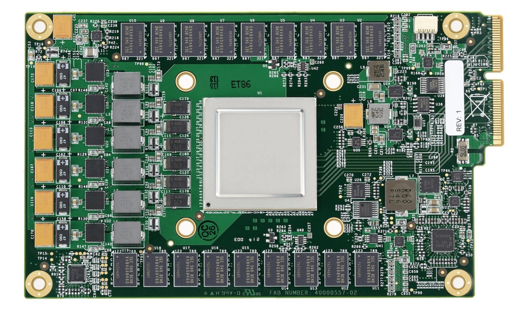
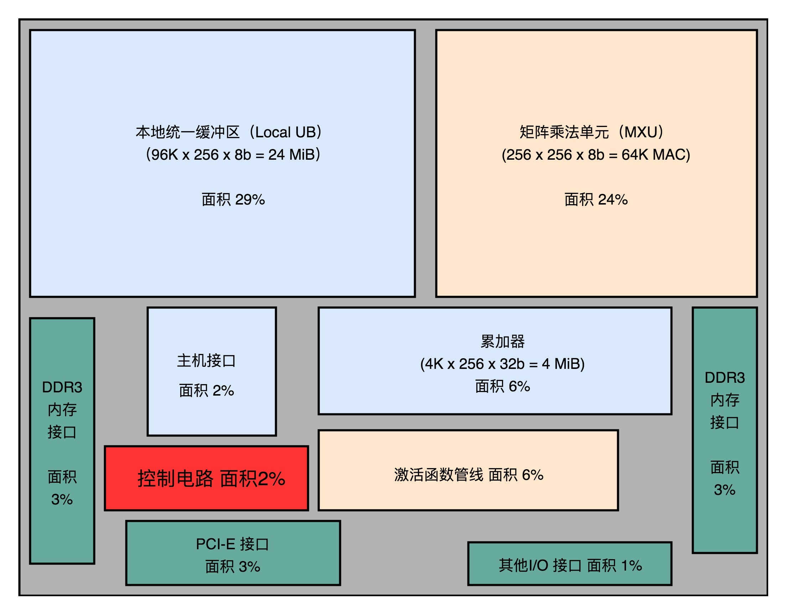
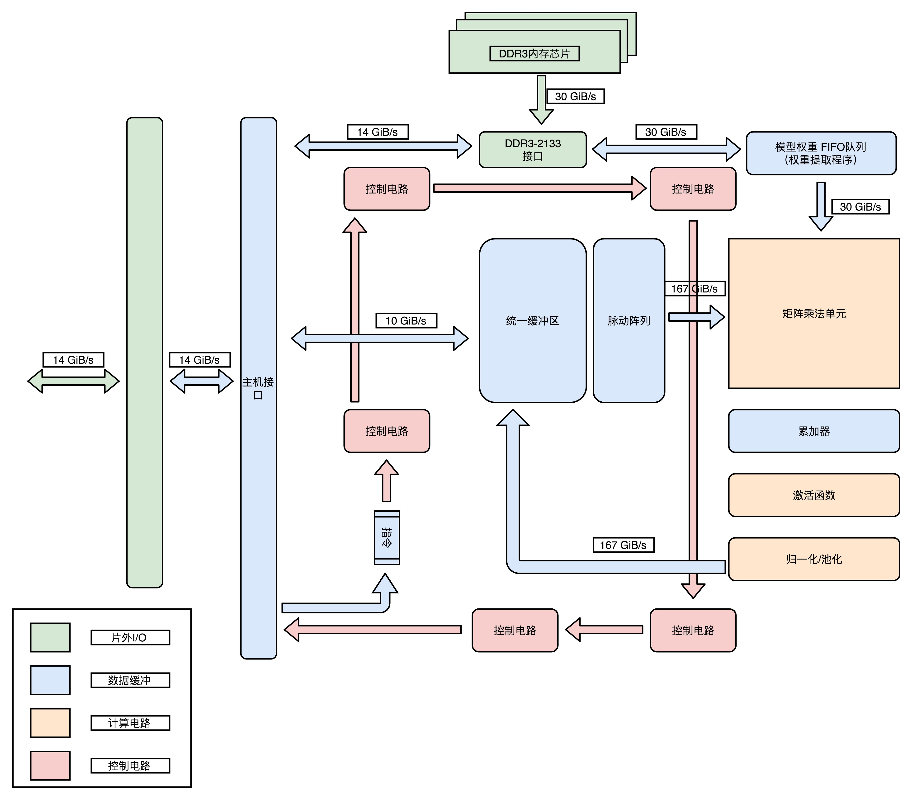

# 33 解读TPU：设计和拆解一块ASIC芯片

过去几年，最知名、最具有实用价值的 ASIC 就是 TPU 了。各种解读 TPU 论文内容的文章网上也很多。不过，这些文章更多地是从机器学习或者 AI 的角度，来讲解 TPU。

上一讲，我为你讲解了 FPGA 和 ASIC，讲解了 FPGA 如何实现通过“软件”来控制“硬件”，以及我们可以进一步把 FPGA 设计出来的电路变成一块 ASIC 芯片。

不过呢，这些似乎距离我们真实的应用场景有点儿远。我们怎么能够设计出来一块有真实应用场景的 ASIC 呢？如果要去设计一块 ASIC，我们应该如何思考和拆解问题呢？今天，我就带着你一起学习一下，如何设计一块专用芯片。

## TPU V1 想要解决什么问题？

黑格尔说，“世上没有无缘无故的爱，也没有无缘无故的恨”。第一代 TPU 的设计并不是异想天开的创新，而是来自于真实的需求。

从 2012 年解决计算机视觉问题开始，深度学习一下子进入了大爆发阶段，也一下子带火了 GPU，NVidia 的股价一飞冲天。我们在[第 31 讲](https://time.geekbang.org/column/article/105401)讲过，GPU 天生适合进行海量、并行的矩阵数值计算，于是它被大量用在深度学习的模型训练上。

不过你有没有想过，在深度学习热起来之后，计算量最大的是什么呢？并不是进行深度学习的训练，而是深度学习的推断部分。

所谓 **推断部分** ，是指我们在完成深度学习训练之后，把训练完成的模型存储下来。这个存储下来的模型，是许许多多个向量组成的参数。然后，我们根据这些参数，去计算输入的数据，最终得到一个计算结果。这个推断过程，可能是在互联网广告领域，去推测某一个用户是否会点击特定的广告；也可能是我们在经过高铁站的时候，扫一下身份证进行一次人脸识别，判断一下是不是你本人。

虽然训练一个深度学习的模型需要花的时间不少，但是实际在推断上花的时间要更多。比如，我们上面说的高铁，去年（2018 年）一年就有 20 亿人次坐了高铁，这也就意味着至少进行了 20 亿次的人脸识别“推断“工作。

所以，第一代的 TPU，首先优化的并不是深度学习的模型训练，而是深度学习的模型推断。这个时候你可能要问了，那模型的训练和推断有什么不同呢？主要有三个点。

**第一点，深度学习的推断工作更简单，对灵活性的要求也就更低。**模型推断的过程，我们只需要去计算一些矩阵的乘法、加法，调用一些 Sigmoid 或者 RELU 这样的激活函数。这样的过程可能需要反复进行很多层，但是也只是这些计算过程的简单组合。

**第二点，深度学习的推断的性能，首先要保障响应时间的指标。**我们在[第 4 讲](https://time.geekbang.org/column/article/93246)讲过，计算机关注的性能指标，有响应时间（Response Time）和吞吐率（Throughput）。我们在模型训练的时候，只需要考虑吞吐率问题就行了。因为一个模型训练少则好几分钟，多的话要几个月。而推断过程，像互联网广告的点击预测，我们往往希望能在几十毫秒乃至几毫秒之内就完成，而人脸识别也不希望会超过几秒钟。很显然，模型训练和推断对于性能的要求是截然不同的。

**第三点，深度学习的推断工作，希望在功耗上尽可能少一些**。深度学习的训练，对功耗没有那么敏感，只是希望训练速度能够尽可能快，多费点电就多费点儿了。这是因为，深度学习的推断，要 7×24h 地跑在数据中心里面。而且，对应的芯片，要大规模地部署在数据中心。一块芯片减少 5% 的功耗，就能节省大量的电费。而深度学习的训练工作，大部分情况下只是少部分算法工程师用少量的机器进行。很多时候，只是做小规模的实验，尽快得到结果，节约人力成本。少数几台机器多花的电费，比起算法工程师的工资来说，只能算九牛一毛了。

这三点的差别，也就带出了第一代 TPU 的设计目标。那就是，在保障响应时间的情况下，能够尽可能地提高**能效比**这个指标，也就是进行同样多数量的推断工作，花费的整体能源要显著低于 CPU 和 GPU。

## 深入理解 TPU V1

### 快速上线和向前兼容，一个 FPU 的设计

如果你来设计 TPU，除了满足上面的深度学习的推断特性之外，还有什么是你要重点考虑的呢？你可以停下来思考一下，然后再继续往下看。

不知道你的答案是什么，我的第一反应是，有两件事情必须要考虑，第一个是 TPU 要有向前兼容性，第二个是希望 TPU 能够尽早上线。我下面说说我考虑这两点的原因。

[图片来源](https://arxiv.org/ftp/arxiv/papers/1704/1704.04760.pdf)

第一代的 TPU 就像一块显卡一样，可以直接插在主板的 PCI-E 口上

第一点，向前兼容。在计算机产业界里，因为没有考虑向前兼容，惨遭失败的产品数不胜数。典型的有我在[第 26 讲](https://time.geekbang.org/column/article/102888)提过的安腾处理器。所以，TPU 并没有设计成一个独立的“CPU“，而是设计成一块像显卡一样，插在主板 PCI-E 接口上的板卡。更进一步地，TPU 甚至没有像我们之前说的现代 GPU 一样，设计成自己有对应的取指令的电路，而是通过 CPU，向 TPU 发送需要执行的指令。

这两个设计，使得我们的 TPU 的硬件设计变得简单了，我们只需要专心完成一个专用的“计算芯片”就好了。所以，TPU 整个芯片的设计上线时间也就缩短到了 15 个月。不过，这样一个 TPU，其实是第 26 讲里我们提过的 387 浮点数计算芯片，是一个像 FPU（浮点数处理器）的协处理器（Coprocessor），而不是像 CPU 和 GPU 这样可以独立工作的 Processor Unit。

### 专用电路和大量缓存，适应推断的工作流程

明确了 TPU 整体的设计思路之后，我们可以来看一看，TPU 内部有哪些芯片和数据处理流程。我在文稿里面，放了 TPU 的模块图和对应的芯片布局图，你可以对照着看一下。

[图片来源](https://arxiv.org/ftp/arxiv/papers/1704/1704.04760.pdf)

模块图：整个 TPU 的硬件，完全是按照深度学习一个层（Layer）的计算流程来设计的

你可以看到，在芯片模块图里面，有单独的矩阵乘法单元（Matrix Multiply Unit）、累加器（Accumulators）模块、激活函数（Activation）模块和归一化 / 池化（Normalization/Pool）模块。而且，这些模块是顺序串联在一起的。

这是因为，一个深度学习的推断过程，是由很多层的计算组成的。而每一个层（Layer）的计算过程，就是先进行矩阵乘法，再进行累加，接着调用激活函数，最后进行归一化和池化。这里的硬件设计呢，就是把整个流程变成一套固定的硬件电路。这也是一个 ASIC 的典型设计思路，其实就是把确定的程序指令流程，变成固定的硬件电路。

接着，我们再来看下面的芯片布局图，其中控制电路（Control）只占了 2%。这是因为，TPU 的计算过程基本上是一个固定的流程。不像我们之前讲的 CPU 那样，有各种复杂的控制功能，比如冒险、分支预测等等。

你可以看到，超过一半的 TPU 的面积，都被用来作为 Local Unified Buffer（本地统一缓冲区）（29%）和矩阵乘法单元（Matrix Mutliply Unit）了。

相比于矩阵乘法单元，累加器、实现激活函数和后续的归一 / 池化功能的激活管线（Activation Pipeline）也用得不多。这是因为，在深度学习推断的过程中，矩阵乘法的计算量是最大的，计算也更复杂，所以比简单的累加器和激活函数要占用更多的晶体管。

而统一缓冲区（Unified Buffer），则由 SRAM 这样高速的存储设备组成。SRAM 一般被直接拿来作为 CPU 的寄存器或者高速缓存。我们在后面的存储器部分会具体讲。SRAM 比起内存使用的 DRAM 速度要快上很多，但是因为电路密度小，所以占用的空间要大很多。统一缓冲区之所以使用 SRAM，是因为在整个的推断过程中，它会高频反复地被矩阵乘法单元读写，来完成计算。

[图片来源](https://arxiv.org/ftp/arxiv/papers/1704/1704.04760.pdf)

芯片布局图：从尺寸可以看出，统一缓冲区和矩阵乘法单元是 TPU 的核心功能组件

可以看到，整个 TPU 里面，每一个组件的设计，完全是为了深度学习的推断过程设计出来的。这也是我们设计开发 ASIC 的核心原因：用特制的硬件，最大化特定任务的运行效率。

### 细节优化，使用 8 Bits 数据

除了整个 TPU 的模块设计和芯片布局之外，TPU 在各个细节上也充分考虑了自己的应用场景，我们可以拿里面的矩阵乘法单元（Matrix Multiply Unit）来作为一个例子。

如果你仔细一点看的话，会发现这个矩阵乘法单元，没有用 32 Bits 来存放一个浮点数，而是只用了一个 8 Bits 来存放浮点数。这是因为，在实践的机器学习应用中，会对数据做[归一化](https://en.wikipedia.org/wiki/Normalization)（Normalization）和[正则化](<https://en.wikipedia.org/wiki/Regularization_(mathematics)>)（Regularization）的处理。咱们毕竟不是一个机器学习课，所以我就不深入去讲什么是归一化和正则化了，你只需要知道，这两个操作呢，会使得我们在深度学习里面操作的数据都不会变得太大。通常来说呢，都能控制在 -3 到 3 这样一定的范围之内。

因为这个数值上的特征，我们需要的浮点数的精度也不需要太高了。我们在[第 16 讲](https://time.geekbang.org/column/article/98312)讲解浮点数的时候说过，32 位浮点数的精度，差不多可以到 1/1600 万。如果我们用 8 位或者 16 位表示浮点数，也能把精度放到 2^6 或者 2^12，也就是 1/64 或者 1/4096。在深度学习里，常常够用了。特别是在模型推断的时候，要求的计算精度，往往可以比模型训练低。所以，8 Bits 的矩阵乘法器，就可以放下更多的计算量，使得 TPU 的推断速度更快。

## 用数字说话，TPU 的应用效果

那么，综合了这么多优秀设计点的 TPU，实际的使用效果怎么样呢？不管设计得有多好，最后还是要拿效果和数据说话。俗话说，是骡子是马，总要拿出来溜溜啊。

Google 在 TPU 的论文里面给出了答案。一方面，在性能上，TPU 比现在的 CPU、GPU 在深度学习的推断任务上，要快 15～30 倍。而在能耗比上，更是好出 30～80 倍。另一方面，Google 已经用 TPU 替换了自家数据中心里 95% 的推断任务，可谓是拿自己的实际业务做了一个明证。

## 总结延伸

这一讲，我从第一代 TPU 的设计目标讲起，为你解读了 TPU 的设计。你可以通过这篇文章，回顾我们过去 32 讲提到的各种知识点。

第一代 TPU，是为了做各种深度学习的推断而设计出来的，并且希望能够尽早上线。这样，Google 才能节约现有数据中心里面的大量计算资源。

从深度学习的推断角度来考虑，TPU 并不需要太灵活的可编程能力，只要能够迭代完成常见的深度学习推断过程中一层的计算过程就好了。所以，TPU 的硬件构造里面，把矩阵乘法、累加器和激活函数都做成了对应的专门的电路。

为了满足深度学习推断功能的响应时间短的需求，TPU 设置了很大的使用 SRAM 的 Unified Buffer（UB），就好像一个 CPU 里面的寄存器一样，能够快速响应对于这些数据的反复读取。

为了让 TPU 尽可能快地部署在数据中心里面，TPU 采用了现有的 PCI-E 接口，可以和 GPU 一样直接插在主板上，并且采用了作为一个没有取指令功能的协处理器，就像 387 之于 386 一样，仅仅用来进行需要的各种运算。

在整个电路设计的细节层面，TPU 也尽可能做到了优化。因为机器学习的推断功能，通常做了数值的归一化，所以对于矩阵乘法的计算精度要求有限，整个矩阵乘法的计算模块采用了 8 Bits 来表示浮点数，而不是像 Intel CPU 里那样用上了 32 Bits。

最终，综合了种种硬件设计点之后的 TPU，做到了在深度学习的推断层面更高的能效比。按照 Google 论文里面给出的官方数据，它可以比 CPU、GPU 快上 15～30 倍，能耗比更是可以高出 30～80 倍。而 TPU，也最终替代了 Google 自己的数据中心里，95% 的深度学习推断任务。

## 推荐阅读

既然要深入了解 TPU，自然要读一读关于 TPU 的论文[In-Datacenter Performance Analysis of a Tensor Processing Unit](https://arxiv.org/ftp/arxiv/papers/1704/1704.04760.pdf)。

除了这篇论文之外，你也可以读一读 Google 官方专门讲解 TPU 构造的博客文章 [An in-depth look at Google’s first Tensor Processing Unit(TPU)](https://cloud.google.com/blog/products/gcp/an-in-depth-look-at-googles-first-tensor-processing-unit-tpu)。
