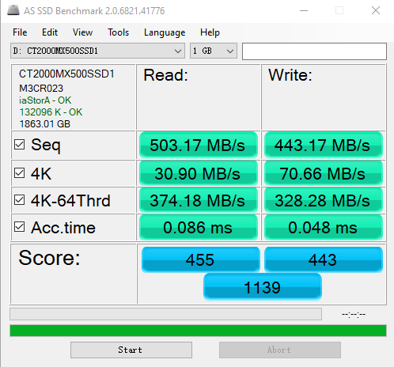
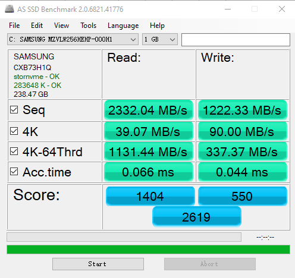

# 44 理解IO_WAIT：IO性能到底是怎么回事儿？

在专栏一开始的时候，我和你说过，在计算机组成原理这门课里面，很多设计的核心思路，都来源于性能。在前面讲解 CPU 的时候，相信你已经有了切身的感受了。

大部分程序员开发的都是应用系统。在开发应用系统的时候，我们遇到的性能瓶颈大部分都在 I/O 上。在[第 36 讲](https://time.geekbang.org/column/article/107447)讲解局部性原理的时候，我们一起看了通过把内存当作是缓存，来提升系统的整体性能。在[第 37 讲](https://time.geekbang.org/column/article/107477)讲解 CPU Cache 的时候，我们一起看了 CPU Cache 和主内存之间性能的巨大差异。

然而，我们知道，并不是所有问题都能靠利用内存或者 CPU Cache 做一层缓存来解决。特别是在这个“大数据”的时代。我们在硬盘上存储了越来越多的数据，一个 MySQL 数据库的单表有个几千万条记录，早已经不算是什么罕见现象了。这也就意味着，用内存当缓存，存储空间是不够用的。大部分时间，我们的请求还是要打到硬盘上。那么，这一讲我们就来看看硬盘 I/O 性能的事儿。

## IO 性能、顺序访问和随机访问

如果去看硬盘厂商的性能报告，通常你会看到两个指标。一个是 **响应时间** （Response Time），另一个叫作 **数据传输率** （Data Transfer Rate）。没错，这个和我们在专栏的一开始讲的 CPU 的性能一样，前面那个就是响应时间，后面那个就是吞吐率了。

我们先来看一看后面这个指标，数据传输率。

我们现在常用的硬盘有两种。一种是 HDD 硬盘，也就是我们常说的机械硬盘。另一种是 SSD 硬盘，一般也被叫作固态硬盘。现在的 HDD 硬盘，用的是 SATA 3.0 的接口。而 SSD 硬盘呢，通常会用两种接口，一部分用的也是 SATA 3.0 的接口；另一部分呢，用的是 PCI Express 的接口。

现在我们常用的 SATA 3.0 的接口，带宽是 6Gb/s。这里的“b”是比特。这个带宽相当于每秒可以传输 768MB 的数据。而我们日常用的 HDD 硬盘的数据传输率，差不多在 200MB/s 左右。



这是在我自己的电脑上，运行 AS SSD 测算 SATA 接口 SSD 硬盘性能的结果，第一行的 Seq 就是顺序读写硬盘得到的数据传输率的实际结果

当我们换成 SSD 的硬盘，性能自然会好上不少。比如，我最近刚把自己电脑的 HDD 硬盘，换成了一块 Crucial MX500 的 SSD 硬盘。它的数据传输速率能到差不多 500MB/s，比 HDD 的硬盘快了一倍不止。不过 SATA 接口的硬盘，差不多到这个速度，性能也就到顶了。因为 SATA 接口的速度也就这么快。



不过，实际 SSD 硬盘能够更快，所以我们可以换用 PCI Express 的接口。我自己电脑的系统盘就是一块使用了 PCI Express 的三星 SSD 硬盘。它的数据传输率，在读取的时候就能做到 2GB/s 左右，差不多是 HDD 硬盘的 10 倍，而在写入的时候也能有 1.2GB/s。

除了数据传输率这个吞吐率指标，另一个我们关心的指标响应时间，其实也可以在 AS SSD 的测试结果里面看到，就是这里面的 Acc.Time 指标。

这个指标，其实就是程序发起一个硬盘的写入请求，直到这个请求返回的时间。可以看到，在上面的两块 SSD 硬盘上，大概时间都是在几十微秒这个级别。如果你去测试一块 HDD 的硬盘，通常会在几毫秒到十几毫秒这个级别。这个性能的差异，就不是 10 倍了，而是在几十倍，乃至几百倍。

光看响应时间和吞吐率这两个指标，似乎我们的硬盘性能很不错。即使是廉价的 HDD 硬盘，接收一个来自 CPU 的请求，也能够在几毫秒时间返回。一秒钟能够传输的数据，也有 200MB 左右。你想一想，我们平时往数据库里写入一条记录，也就是 1KB 左右的大小。我们拿 200MB 去除以 1KB，那差不多每秒钟可以插入 20 万条数据呢。但是这个计算出来的数字，似乎和我们日常的经验不符合啊？这又是为什么呢？

答案就来自于硬盘的读写。在 **顺序读写** 和 **随机读写** 的情况下，硬盘的性能是完全不同的。

我们回头看一下上面的 AS SSD 的性能指标。你会看到，里面有一个“4K”的指标。这个指标是什么意思呢？它其实就是我们的程序，去随机读取磁盘上某一个 4KB 大小的数据，一秒之内可以读取到多少数据。

你会发现，在这个指标上，我们使用 SATA 3.0 接口的硬盘和 PCI Express 接口的硬盘，性能差异变得很小。这是因为，在这个时候，接口本身的速度已经不是我们硬盘访问速度的瓶颈了。更重要的是，你会发现，即使我们用 PCI Express 的接口，在随机读写的时候，数据传输率也只能到 40MB/s 左右，是顺序读写情况下的几十分之一。

我们拿这个 40MB/s 和一次读取 4KB 的数据算一下。

40MB / 4KB = 10,000

也就是说，一秒之内，这块 SSD 硬盘可以随机读取 1 万次的 4KB 的数据。如果是写入的话呢，会更多一些，90MB /4KB 差不多是 2 万多次。

这个每秒读写的次数，我们称之为[IOPS](https://en.wikipedia.org/wiki/IOPS)，也就是每秒输入输出操作的次数。事实上，比起响应时间，我们更关注 IOPS 这个性能指标。IOPS 和 DTR（Data Transfer Rate，数据传输率）才是输入输出性能的核心指标。

这是因为，我们在实际的应用开发当中，对于数据的访问，更多的是随机读写，而不是顺序读写。我们平时所说的服务器承受的“并发”，其实是在说，会有很多个不同的进程和请求来访问服务器。自然，它们在硬盘上访问的数据，是很难顺序放在一起的。这种情况下，随机读写的 IOPS 才是服务器性能的核心指标。

好了，回到我们引出 IOPS 这个问题的 HDD 硬盘。我现在要问你了，那一块 HDD 硬盘能够承受的 IOPS 是多少呢？其实我们应该已经在第 36 讲说过答案了。

HDD 硬盘的 IOPS 通常也就在 100 左右，而不是在 20 万次。在后面讲解机械硬盘的原理和性能优化的时候，我们还会再来一起看一看，这个 100 是怎么来的，以及我们可以有哪些优化的手段。

## 如何定位 IO_WAIT？

我们看到，即使是用上了 PCI Express 接口的 SSD 硬盘，IOPS 也就是在 2 万左右。而我们的 CPU 的主频通常在 2GHz 以上，也就是每秒可以做 20 亿次操作。

即使 CPU 向硬盘发起一条读写指令，需要很多个时钟周期，一秒钟 CPU 能够执行的指令数，和我们硬盘能够进行的操作数，也有好几个数量级的差异。这也是为什么，我们在应用开发的时候往往会说“性能瓶颈在 I/O 上”。因为很多时候，CPU 指令发出去之后，不得不去“等”我们的 I/O 操作完成，才能进行下一步的操作。

那么，在实际遇到服务端程序的性能问题的时候，我们怎么知道这个问题是不是来自于 CPU 等 I/O 来完成操作呢？别着急，我们接下来，就通过 top 和 iostat 这些命令，一起来看看 CPU 到底有没有在等待 io 操作。

```
# top
复制代码
```

你一定在 Linux 下用过 top 命令。对于很多刚刚入门 Linux 的同学，会用 top 去看服务的负载，也就是 load average。不过，在 top 命令里面，我们一样可以看到 CPU 是否在等待 IO 操作完成。

```
top - 06:26:30 up 4 days, 53 min,  1 user,  load average: 0.79, 0.69, 0.65
Tasks: 204 total,   1 running, 203 sleeping,   0 stopped,   0 zombie
%Cpu(s): 20.0 us,  1.7 sy,  0.0 ni, 77.7 id,  0.0 wa,  0.0 hi,  0.7 si,  0.0 st
KiB Mem:   7679792 total,  6646248 used,  1033544 free,   251688 buffers
KiB Swap:        0 total,        0 used,        0 free.  4115536 cached Mem
```

top 命令的输出结果

在 top 命令的输出结果里面，有一行是以 %CPU 开头的。这一行里，有一个叫作 wa 的指标，这个指标就代表着 iowait，也就是 CPU 等待 IO 完成操作花费的时间占 CPU 的百分比。下一次，当你自己的服务器遇到性能瓶颈，load 很大的时候，你就可以通过 top 看一看这个指标。

知道了 iowait 很大，那么我们就要去看一看，实际的 I/O 操作情况是什么样的。这个时候，你就可以去用 iostat 这个命令了。我们输入“iostat”，就能够看到实际的硬盘读写情况。

```
$ iostat
复制代码
avg-cpu:  %user   %nice %system %iowait  %steal   %idle
          17.02    0.01    2.18    0.04    0.00   80.76
Device:            tps    kB_read/s    kB_wrtn/s    kB_read    kB_wrtn
sda               1.81         2.02        30.87     706768   10777408
```

你会看到，这个命令里，不仅有 iowait 这个 CPU 等待时间的百分比，还有一些更加具体的指标了，并且它还是按照你机器上安装的多块不同的硬盘划分的。

这里的 tps 指标，其实就对应着我们上面所说的硬盘的 IOPS 性能。而 kB_read/s 和 kB_wrtn/s 指标，就对应着我们的数据传输率的指标。

知道实际硬盘读写的 tps、kB_read/s 和 kb_wrtn/s 的指标，我们基本上可以判断出，机器的性能是不是卡在 I/O 上了。那么，接下来，我们就是要找出到底是哪一个进程是这些 I/O 读写的来源了。这个时候，你需要“iotop”这个命令。

```
$ iotop
复制代码
Total DISK READ :       0.00 B/s | Total DISK WRITE :      15.75 K/s
Actual DISK READ:       0.00 B/s | Actual DISK WRITE:      35.44 K/s
  TID  PRIO  USER     DISK READ  DISK WRITE  SWAPIN     IO>    COMMAND                                             
  104 be/3 root        0.00 B/s    7.88 K/s  0.00 %  0.18 % [jbd2/sda1-8]
  383 be/4 root        0.00 B/s    3.94 K/s  0.00 %  0.00 % rsyslogd -n [rs:main Q:Reg]
 1514 be/4 www-data    0.00 B/s    3.94 K/s  0.00 %  0.00 % nginx: worker process
```

通过 iotop 这个命令，你可以看到具体是哪一个进程实际占用了大量 I/O，那么你就可以有的放矢，去优化对应的程序了。

上面的这些示例里，不管是 wa 也好，tps 也好，它们都很小。那么，接下来，我就给你用 Linux 下，用 stress 命令，来模拟一个高 I/O 复杂的情况，来看看这个时候的 iowait 是怎么样的。

我在一台云平台上的单个 CPU 核心的机器上输入“stress -i 2”，让 stress 这个程序模拟两个进程不停地从内存里往硬盘上写数据。

```
$ stress -i 2
复制代码
$ top
复制代码
```

你会看到，在 top 的输出里面，CPU 就有大量的 sy 和 wa，也就是系统调用和 iowait。

```
top - 06:56:02 up 3 days, 19:34,  2 users,  load average: 5.99, 1.82, 0.63
Tasks:  88 total,   3 running,  85 sleeping,   0 stopped,   0 zombie
%Cpu(s):  3.0 us, 29.9 sy,  0.0 ni,  0.0 id, 67.2 wa,  0.0 hi,  0.0 si,  0.0 st
KiB Mem :  1741304 total,  1004404 free,   307152 used,   429748 buff/cache
KiB Swap:        0 total,        0 free,        0 used.  1245700 avail Mem 
$ iostat 2 5
复制代码
```

如果我们通过 iostat，查看硬盘的 I/O，你会看到，里面的 tps 很快就到了 4 万左右，占满了对应硬盘的 IOPS。

```
avg-cpu:  %user   %nice %system %iowait  %steal   %idle
           5.03    0.00   67.92   27.04    0.00    0.00
Device:            tps    kB_read/s    kB_wrtn/s    kB_read    kB_wrtn
sda           39762.26         0.00         0.00          0          0
```

如果这个时候我们去看一看 iotop，你就会发现，我们的 I/O 占用，都来自于 stress 产生的两个进程了。

```
$ iotop
复制代码
Total DISK READ :       0.00 B/s | Total DISK WRITE :       0.00 B/s
Actual DISK READ:       0.00 B/s | Actual DISK WRITE:       0.00 B/s
  TID  PRIO  USER     DISK READ  DISK WRITE  SWAPIN     IO>    COMMAND                                             
29161 be/4 xuwenhao    0.00 B/s    0.00 B/s  0.00 % 56.71 % stress -i 2
29162 be/4 xuwenhao    0.00 B/s    0.00 B/s  0.00 % 46.89 % stress -i 2
    1 be/4 root        0.00 B/s    0.00 B/s  0.00 %  0.00 % init
```

相信到了这里，你也应该学会了怎么通过 top、iostat 以及 iotop，一步一步快速定位服务器端的 I/O 带来的性能瓶颈了。你也可以自己通过 Linux 的 man 命令，看一看这些命令还有哪些参数，以及通过 stress 来模拟其他更多不同的性能压力，看看我们的机器负载会发生什么变化。

## 总结延伸

这一讲里，我们从硬盘的两个核心指标，响应时间和数据传输率，来理解和研究 I/O 的性能问题。你也自己可以通过 as ssd 这样的性能评测软件，看一看自己的硬盘性能。

在顺序读取的情况下，无论是 HDD 硬盘还是 SSD 硬盘，性能看起来都是很不错的。不过，等到进行随机读取测试的时候，硬盘的性能才能见了真章。因为在大部分的应用开发场景下，我们关心的并不是在顺序读写下的数据量，而是每秒钟能够进行输入输出的操作次数，也就是 IOPS 这个核心性能指标。

你会发现，即使是使用 PCI Express 接口的 SSD 硬盘，IOPS 也就只是到了 2 万左右。这个性能，和我们 CPU 的每秒 20 亿次操作的能力比起来，可就差得远了。所以很多时候，我们的程序对外响应慢，其实都是 CPU 在等待 I/O 操作完成。

在 Linux 下，我们可以通过 top 这样的命令，来看整个服务器的整体负载。在应用响应慢的时候，我们可以先通过这个指令，来看 CPU 是否在等待 I/O 完成自己的操作。进一步地，我们可以通过 iostat 这个命令，来看到各个硬盘这个时候的读写情况。而 iotop 这个命令，能够帮助我们定位到到底是哪一个进程在进行大量的 I/O 操作。

这些命令的组合，可以快速帮你定位到是不是我们的程序遇到了 I/O 的瓶颈，以及这些瓶颈来自于哪些程序，你就可以根据定位的结果来优化你自己的程序了。

## 推荐阅读

关于 IO_WAIT 的文章，在互联网上已经有不少了。你可以读一读这一篇[Understanding IOPS Latency and Storage Performance](https://louwrentius.com/understanding-iops-latency-and-storage-performance.html)，进一步理解一下什么是 IOPS 和 IO_WAIT。
