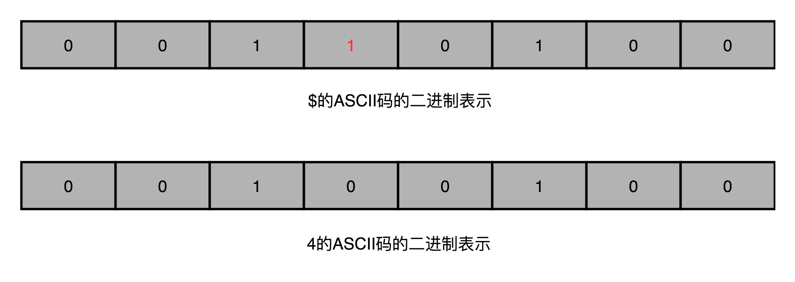

49 数据完整性（上）：硬件坏了怎么办？
====================

2012 年的时候，我第一次在工作中，遇到一个因为硬件的不可靠性引发的 Bug。正是因为这个 Bug，让我开始逐步花很多的时间，去复习回顾整个计算机系统里面的底层知识。

当时，我正在 MediaV 带领一个 20 多人的团队，负责公司的广告数据和机器学习算法。其中有一部分工作，就是用 Hadoop 集群处理所有的数据和报表业务。当时我们的业务增长很快，所以会频繁地往 Hadoop 集群里面添置机器。2012 年的时候，国内的云计算平台还不太成熟，所以我们都是自己采购硬件，放在托管的数据中心里面。

那个时候，我们的 Hadoop 集群服务器，在从 100 台服务器往 1000 台服务器走。我们觉得，像 Dell 这样品牌厂商的服务器太贵了，而且能够提供的硬件配置和我们的期望也有差异。于是，运维的同学开始和 OEM 厂商合作，自己定制服务器，批量采购硬盘、内存。

那个时候，大家都听过 Google 早期发展时，为了降低成本买了很多二手的硬件来降低成本，通过分布式的方式来保障系统的可靠性的办法。虽然我们还没有抠门到去买二手硬件，不过当时，我们选择购买了普通的机械硬盘，而不是企业级的、用在数据中心的机械硬盘；采购了普通的内存条，而不是带 ECC 纠错的服务器内存条，想着能省一点儿是一点儿。

单比特翻转：软件解决不了的硬件错误
-----------------

忽然有一天，我们最大的、每小时执行一次的数据处理报表应用，完成时间变得比平时晚了不少。一开始，我们并没有太在意，毕竟当时数据量每天都在增长，慢一点就慢一点了。但是，接着糟糕的事情开始发生了。

一方面，我们发现，报表任务有时候在一个小时之内执行不完，接着，偶尔整个报表任务会执行失败。于是，我们不得不停下手头开发的工作，开始排查这个问题。

用过 Hadoop 的话，你可能知道，作为一个分布式的应用，考虑到硬件的故障，Hadoop 本身会在特定节点计算出错的情况下，重试整个计算过程。之前的报表跑得慢，就是因为有些节点的计算任务失败过，只是在重试之后又成功了。进一步分析，我们发现，程序的错误非常奇怪。有些数据计算的结果，比如“34+23”，结果应该是“57”，但是却变成了一个美元符号“$”。

前前后后折腾了一周，我们发现，从日志上看，大部分出错的任务都在几个固定的硬件节点上。

另一方面，我们发现，问题出现在我们新的一批自己定制的硬件上架之后。于是，和运维团队的同事沟通近期的硬件变更，并且翻阅大量 Hadoop 社区的邮件组列表之后，我们有了一个大胆的推测。

我们推测，这个错误，来自我们自己定制的硬件。定制的硬件没有使用 ECC 内存，在大量的数据中，内存中出现了 **单比特翻转** （Single-Bit Flip）这个传说中的硬件错误。

那这个符号是怎么来的呢？是由于内存中的一个整数字符，遇到了一次单比特翻转转化而来的。 它的 ASCII 码二进制表示是 0010 0100，所以它完全可能来自 0011 0100 遇到一次在第 4 个比特的单比特翻转，也就是从整数“4”变过来的。但是我们也只能 **推测** 是这个错误，而不能 **确信** 是这个错误。因为单比特翻转是一个随机现象，我们没法稳定复现这个问题。

**ECC 内存 **的全称是 Error-Correcting Code memory，中文名字叫作** 纠错内存**。顾名思义，就是在内存里面出现错误的时候，能够自己纠正过来。

在和运维同学沟通之后，我们把所有自己定制的服务器的内存替换成了 ECC 内存，之后这个问题就消失了。这也使得我们基本确信，问题的来源就是因为没有使用 ECC 内存。我们所有工程师的开发用机在 2012 年，也换成了 32G 内存。是的，换下来的内存没有别的去处，都安装到了研发团队的开发机上。

奇偶校验和校验位：捕捉错误的好办法
-----------------

其实，内存里面的单比特翻转或者错误，并不是一个特别罕见的现象。无论是因为内存的制造质量造成的漏电，还是外部的射线，都有一定的概率，会造成单比特错误。而内存层面的数据出错，软件工程师并不知道，而且这个出错很有可能是随机的。遇上随机出现难以重现的错误，大家肯定受不了。我们必须要有一个办法，避免这个问题。

其实，在 ECC 内存发明之前，工程师们已经开始通过**奇偶校验**的方式，来发现这些错误。

奇偶校验的思路很简单。我们把内存里面的 N 位比特当成是一组。常见的，比如 8 位就是一个字节。然后，用额外的一位去记录，这 8 个比特里面有奇数个 1 还是偶数个 1。如果是奇数个 1，那额外的一位就记录为 1；如果是偶数个 1，那额外的一位就记录成 0。那额外的一位，我们就称之为**校验码位**。

如果在这个字节里面，我们不幸发生了单比特翻转，那么数据位计算得到的校验码，就和实际校验位里面的数据不一样。我们的内存就知道出错了。

除此之外，校验位有一个很大的优点，就是计算非常快，往往只需要遍历一遍需要校验的数据，通过一个 O(N) 的时间复杂度的算法，就能把校验结果计算出来。

校验码的思路，在很多地方都会用到。

比方说，我们下载一些软件的时候，你会看到，除了下载的包文件，还会有对应的 MD5 这样的哈希值或者循环冗余编码（CRC）的校验文件。这样，当我们把对应的软件下载下来之后，我们可以计算一下对应软件的校验码，和官方提供的校验码去做个比对，看看是不是一样。

如果不一样，你就不能轻易去安装这个软件了。因为有可能，这个软件包是坏的。但是，还有一种更危险的情况，就是你下载的这个软件包，可能是被人植入了后门的。安装上了之后，你的计算机的安全性就没有保障了。

不过，使用奇偶校验，还是有两个比较大的缺陷。

第一个缺陷，就是奇偶校验只能解决遇到单个位的错误，或者说奇数个位的错误。如果出现 2 个位进行了翻转，那么这个字节的校验位计算结果其实没有变，我们的校验位自然也就不能发现这个错误。

第二个缺陷，是它只能发现错误，但是不能纠正错误。所以，即使在内存里面发现数据错误了，我们也只能中止程序，而不能让程序继续正常地运行下去。如果这个只是我们的个人电脑，做一些无关紧要的应用，这倒是无所谓了。

但是，你想一下，如果你在服务器上进行某个复杂的计算任务，这个计算已经跑了一周乃至一个月了，还有两三天就跑完了。这个时候，出现内存里面的错误，要再从头跑起，估计你内心是崩溃的。

所以，我们需要一个比简单的校验码更好的解决方案，一个能够发现更多位的错误，并且能够把这些错误纠正过来的解决方案，也就是工程师们发明的 ECC 内存所使用的解决方案。

我们不仅能捕捉到错误，还要能够纠正发生的错误。这个策略，我们通常叫作**纠错码 **（Error Correcting Code）。它还有一个升级版本，叫作** 纠删码**（Erasure Code），不仅能够纠正错误，还能够在错误不能纠正的时候，直接把数据删除。无论是我们的 ECC 内存，还是网络传输，乃至硬盘的 RAID，其实都利用了纠错码和纠删码的相关技术。

想要看看我们怎么通过算法，怎么配置硬件，使得我们不仅能够发现单个位的错误，而能发现更多位的错误，你一定要记得跟上下一讲的内容。

总结延伸
----

好了，让我们一起来总结一下今天的内容。

我给你介绍了我自己亲身经历的一个硬件错误带来的 Bug。由于没有采用 ECC 内存，导致我们的数据处理中，出现了大量的单比特数据翻转的错误。这些硬件带来的错误，其实我们没有办法在软件层面解决。

如果对于硬件以及硬件本身的原理不够熟悉，恐怕这个问题的解决方案还是遥遥无期。如果你对计算机组成原理有所了解，并能够意识到，在硬件的存储层有着数据验证和纠错的需求，那你就能在有限的时间内定位到问题所在。

进一步地，我为你简单介绍了奇偶校验，也就是如何通过冗余的一位数据，发现在硬件层面出现的位错误。但是，奇偶校验以及其他的校验码，只能发现错误，没有办法纠正错误。所以，下一讲，我们一起来看看，怎么利用纠错码这样的方式，来解决问题。

推荐阅读
----

我推荐你去深入阅读一下 Wikipedia 里面，关于[CRC](https://en.wikipedia.org/wiki/Cyclic_redundancy_check)的内容，了解一下，这样的校验码的详细算法。
