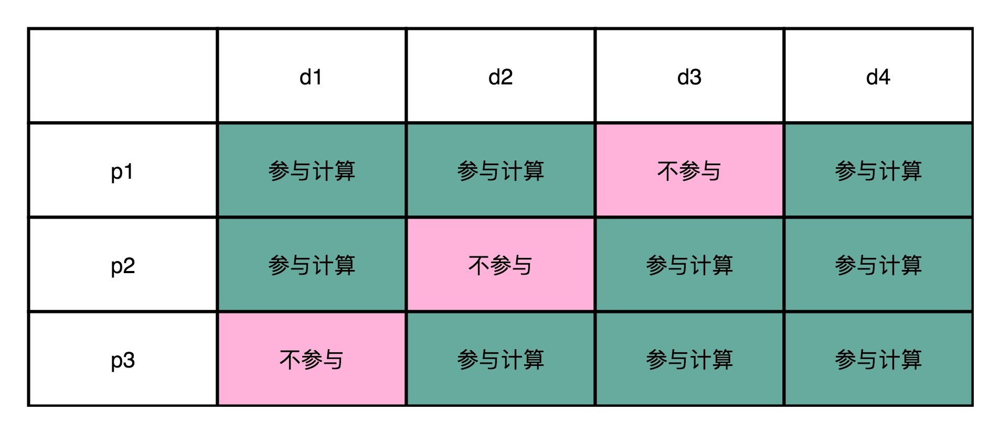
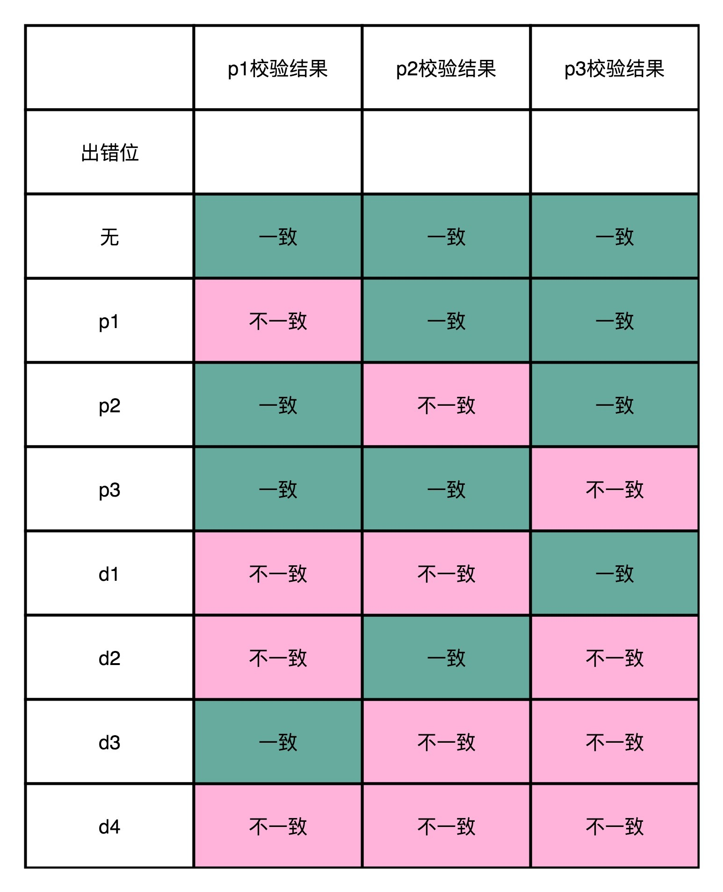
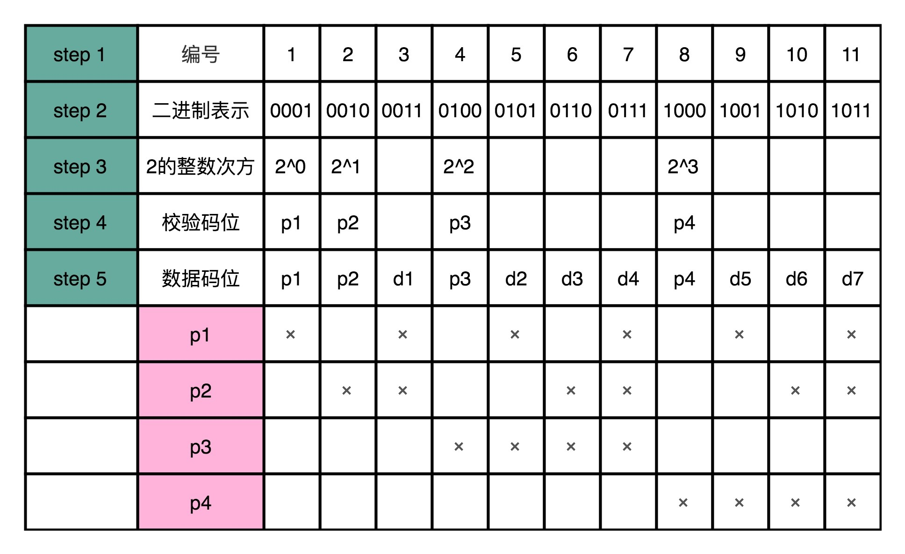
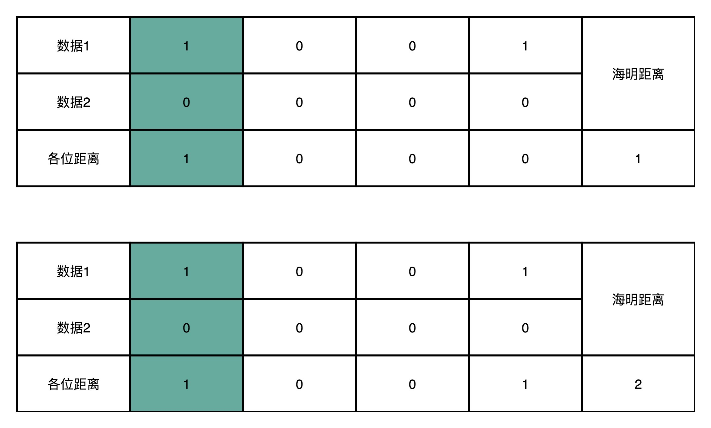
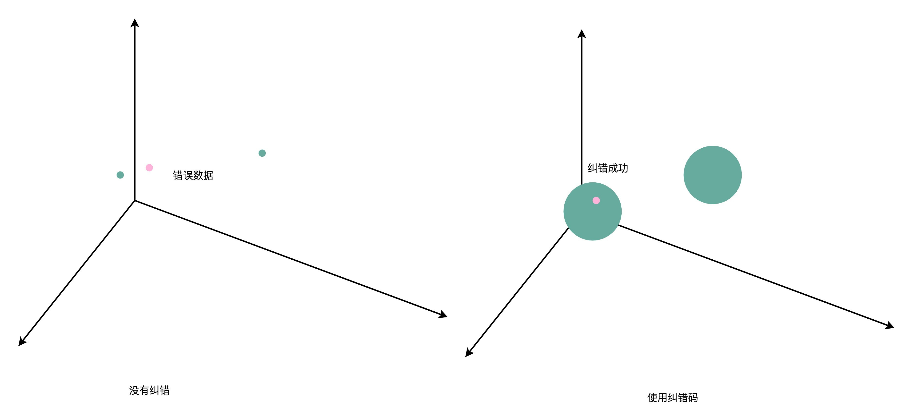

50 数据完整性（下）：如何还原犯罪现场？
=====================

讲完校验码之后，你现在应该知道，无论是奇偶校验码，还是 CRC 这样的循环校验码，都只能告诉我们一个事情，就是你的数据出错了。所以，校验码也被称为检错码（Error Detecting Code）。

不管是校验码，还是检错码，在硬件出错的时候，只能告诉你“我错了”。但是，下一个问题，“错哪儿了”，它是回答不了的。这就导致，我们的处理方式只有一种，那就是当成“哪儿都错了”。如果是下载一个文件，发现校验码不匹配，我们只能重新去下载；如果是程序计算后放到内存里面的数据，我们只能再重新算一遍。

这样的效率实在是太低了，所以我们需要有一个办法，不仅告诉我们“我错了”，还能告诉我们“错哪儿了”。于是，计算机科学家们就发明了 **纠错码** 。纠错码需要更多的冗余信息，通过这些冗余信息，我们不仅可以知道哪里的数据错了，还能直接把数据给改对。这个是不是听起来很神奇？接下来就让我们一起来看一看。

海明码：我们需要多少信息冗余？
---------------

最知名的纠错码就是海明码。海明码（Hamming Code）是以他的发明人 Richard Hamming（理查德·海明）的名字命名的。这个编码方式早在上世纪四十年代就被发明出来了。而直到今天，我们上一讲所说到的 ECC 内存，也还在使用海明码来纠错。

最基础的海明码叫 **7-4 海明码** 。这里的“7”指的是实际有效的数据，一共是 7 位（Bit）。而这里的“4”，指的是我们额外存储了 4 位数据，用来纠错。

首先，你要明白一点，纠错码的纠错能力是有限的。不是说不管错了多少位，我们都能给纠正过来。不然我们就不需要那 7 个数据位，只需要那 4 个校验位就好了，这意味着我们可以不用数据位就能传输信息了。这就不科学了。事实上，在 7-4 海明码里面，我们只能纠正某 1 位的错误。这是怎么做到的呢？我们一起来看看。

4 位的校验码，一共可以表示 2^4 = 16 个不同的数。根据数据位计算出来的校验值，一定是确定的。所以，如果数据位出错了，计算出来的校验码，一定和确定的那个校验码不同。那可能的值，就是在 2^4 - 1 = 15 那剩下的 15 个可能的校验值当中。

15 个可能的校验值，其实可以对应 15 个可能出错的位。这个时候你可能就会问了，既然我们的数据位只有 7 位，那为什么我们要用 4 位的校验码呢？用 3 位不就够了吗？2^3 - 1 = 7，正好能够对上 7 个不同的数据位啊！

你别忘了，单比特翻转的错误，不仅可能出现在数据位，也有可能出现在校验位。校验位本身也是可能出错的。所以，7 位数据位和 3 位校验位，如果只有单比特出错，可能出错的位数就是 10 位，2^3 - 1 = 7 种情况是不能帮我们找到具体是哪一位出错的。

事实上，如果我们的数据位有 K 位，校验位有 N 位。那么我们需要满足下面这个不等式，才能确保我们能够对单比特翻转的数据纠错。这个不等式就是：

K + N + 1 <= 2^N

在有 7 位数据位，也就是 K=7 的情况下，N 的最小值就是 4。4 位校验位，其实最多可以支持到 11 位数据位。我在下面列了一个简单的数据位数和校验位数的对照表，你可以自己算一算，理解一下上面的公式。

海明码的纠错原理
--------

现在你应该搞清楚了，在数据位数确定的情况下，怎么计算需要的校验位。那接下来，我们就一起看看海明码的编码方式是怎么样的。

为了算起来简单一点，我们少用一些位数，来算一个 **4-3 海明码** （也就是 4 位数据位，3 位校验位）。我们把 4 位数据位，分别记作 d1、d2、d3、d4。这里的 d，取的是数据位 data bits 的首字母。我们把 3 位校验位，分别记作 p1、p2、p3。这里的 p，取的是校验位 parity bits 的首字母。

从 4 位的数据位里面，我们拿走 1 位，然后计算出一个对应的校验位。这个校验位的计算用之前讲过的奇偶校验就可以了。比如，我们用 d1、d2、d3 来计算出一个校验位 p1；用 d1、d3、d4 计算出一个校验位 p2；用 d2、d3、d4 计算出一个校验位 p3。就像下面这个对应的表格一样：

这个时候，你去想一想，如果 d1 这一位的数据出错了，会发生什么情况？我们会发现，p1 和 p2 和校验的计算结果不一样。d2 出错了，是因为 p1 和 p3 的校验的计算结果不一样；d3 出错了，则是因为 p2 和 p3；如果 d4 出错了，则是 p1、p2、p3 都不一样。你会发现，当数据码出错的时候，至少会有 2 位校验码的计算是不一致的。

那我们倒过来，如果是 p1 的校验码出错了，会发生什么情况呢？这个时候，只有 p1 的校验结果出错。p2 和 p3 的出错的结果也是一样的，只有一个校验码的计算是不一致的。

所以校验码不一致，一共有 2^3-1=7 种情况，正好对应了 7 个不同的位数的错误。我把这个对应表格也放在下面了，你可以理解一下。

可以看到，海明码这样的纠错过程，有点儿像电影里面看到的推理探案的过程。通过出错现场的额外信息，一步一步条分缕析地找出，到底是哪一位的数据出错，还原出错时候的“犯罪现场”。

看到这里，相信你一方面会觉得海明码特别神奇，但是同时也会冒出一个新的疑问，我们怎么才能用一套程序或者规则来生成海明码呢？其实这个步骤并不复杂，接下来我们就一起来看一下。

首先，我们先确定编码后，要传输的数据是多少位。比如说，我们这里的 7-4 海明码，就是一共 11 位。

然后，我们给这 11 位数据从左到右进行编号，并且也把它们的二进制表示写出来。

接着，我们先把这 11 个数据中的二进制的整数次幂找出来。在这个 7-4 海明码里面，就是 1、2、4、8。这些数，就是我们的校验码位，我们把他们记录做 p1～p4。如果从二进制的角度看，它们是这 11 个数当中，唯四的，在 4 个比特里面只有一个比特是 1 的数值。

那么剩下的 7 个数，就是我们 d1-d7 的数据码位了。

然后，对于我们的校验码位，我们还是用奇偶校验码。但是每一个校验码位，不是用所有的 7 位数据来计算校验码。而是 p1 用 3、5、7、9、11 来计算。也就是，在二进制表示下，从右往左数的第一位比特是 1 的情况下，用 p1 作为校验码。

剩下的 p2，我们用 3、6、10、11 来计算校验码，也就是在二进制表示下，从右往左数的第二位比特是 1 的情况下，用 p2。那么，p3 自然是从右往左数，第三位比特是 1 的情况下的数字校验码。而 p4 则是第四位比特是 1 的情况下的校验码。

这个时候，你会发现，任何一个数据码出错了，就至少会有对应的两个或者三个校验码对不上，这样我们就能反过来找到是哪一个数据码出错了。如果校验码出错了，那么只有校验码这一位对不上，我们就知道是这个校验码出错了。

上面这个方法，我们可以用一段确定的程序表示出来，意味着无论是几位的海明码，我们都不再需要人工去精巧地设计编码方案了。

海明距离：形象理解海明码的作用
---------------

其实，我们还可以换一个角度来理解海明码的作用。对于两个二进制表示的数据，他们之间有差异的位数，我们称之为海明距离。比如 1001 和 0001 的海明距离是 1，因为他们只有最左侧的第一位是不同的。而 1001 和 0000 的海明距离是 2，因为他们最左侧和最右侧有两位是不同的。

于是，你很容易可以想到，所谓的进行一位纠错，也就是所有和我们要传输的数据的海明距离为 1 的数，都能被纠正回来。

而任何两个实际我们想要传输的数据，海明距离都至少要是 3。你可能会问了，为什么不能是 2 呢？因为如果是 2 的话，那么就会有一个出错的数，到两个正确的数据的海明距离都是 1。当我们看到这个出错的数的时候，我们就不知道究竟应该纠正到那一个数了。

在引入了海明距离之后，我们就可以更形象地理解纠错码了。在没有纠错功能的情况下，我们看到的数据就好像是空间里面的一个一个点。这个时候，我们可以让数据之间的距离很紧凑，但是如果这些点的坐标稍稍有错，我们就可能搞错是哪一个点。

在有了 1 位纠错功能之后，就好像我们把一个点变成了以这个点为中心，半径为 1 的球。只要坐标在这个球的范围之内，我们都知道实际要的数据就是球心的坐标。而各个数据球不能距离太近，不同的数据球之间要有 3 个单位的距离。

总结延伸
----

好了，纠错码的内容到这里就讲完了。你可不要小看这个看起来简单的海明码。虽然它在上世纪 40 年代早早地就诞生了，不过直到今天的 ECC 内存里面，我们还在使用这个技术方案。而海明也因为海明码获得了图灵奖。

通过在数据中添加多个冗余的校验码位，海明码不仅能够检测到数据中的错误，还能够在只有单个位的数据出错的时候，把错误的一位纠正过来。在理解和计算海明码的过程中，有一个很重要的点，就是不仅原来的数据位可能出错。我们新添加的校验位，一样可能会出现单比特翻转的错误。这也是为什么，7 位数据位用 3 位校验码位是不够的，而需要 4 位校验码位。

实际的海明码编码的过程也并不复杂，我们通过用不同过的校验位，去匹配多个不同的数据组，确保任何一个数据位出错，都会产生一个多个校验码位出错的唯一组合。这样，在出错的时候，我们就可以反过来找到出错的数据位，并纠正过来。当只有一个校验码位出错的时候，我们就知道实际出错的是校验码位了。

推荐阅读
----

这一讲的推荐阅读，还是让我们回到教科书。我推荐你去读一读《计算机组成与设计：软件 / 硬件接口》的 5.5 章节，关于可信存储器的部分。

另外，如果你想在纠错码上进一步深入，你可以去了解一下纠删码，也就是 Erasure Code。最好的学习入口当然还是[Wikipedia](https://en.wikipedia.org/wiki/Erasure_code)。
