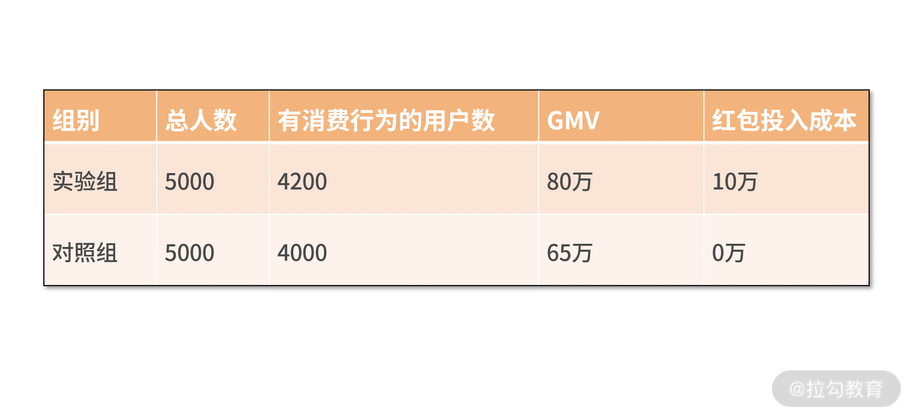
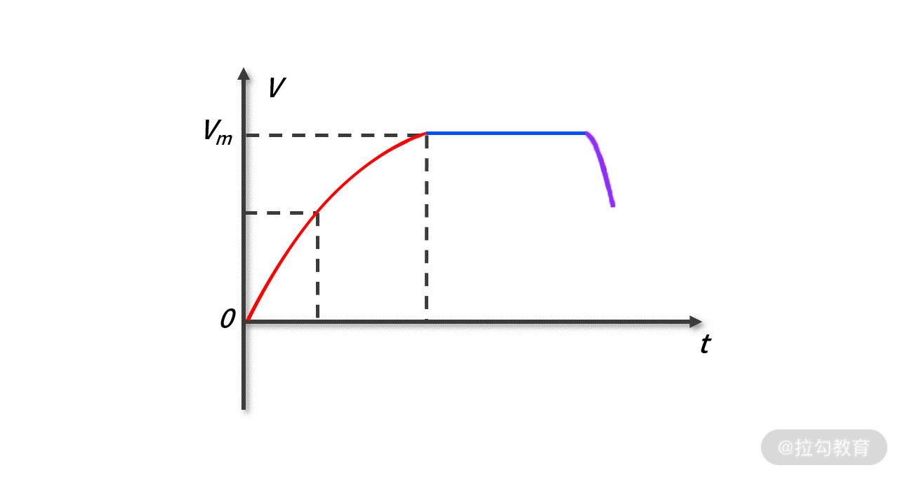
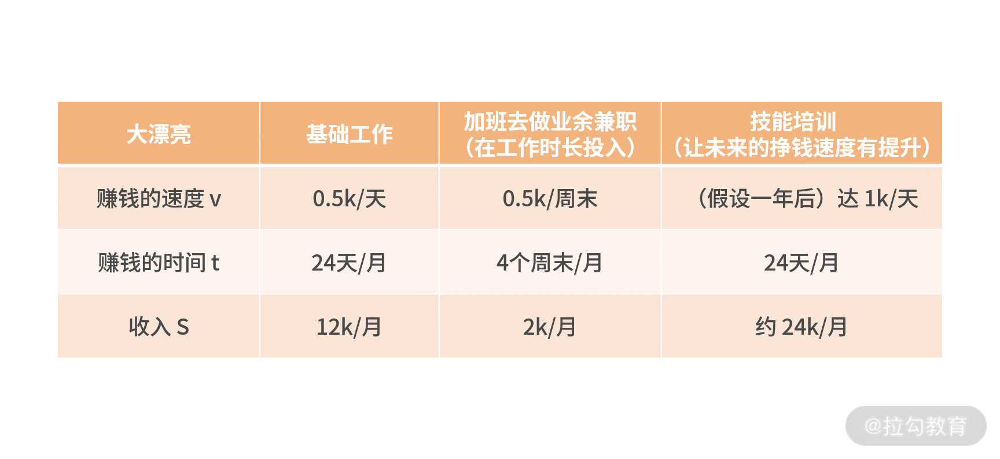
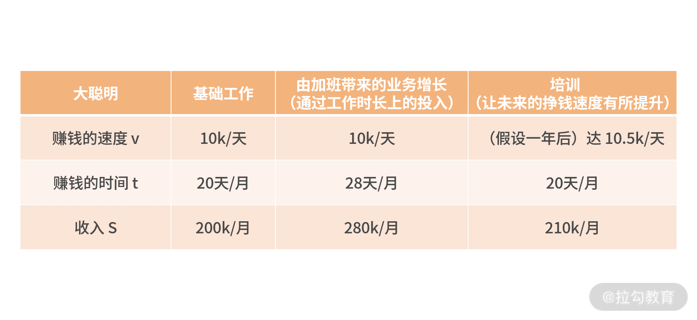
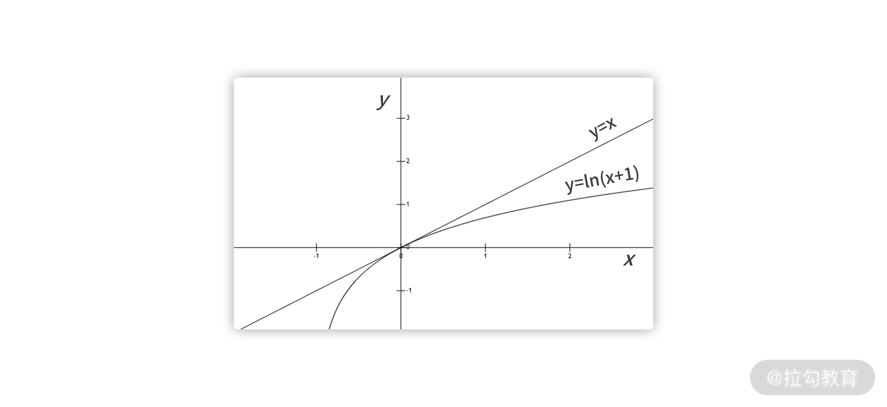
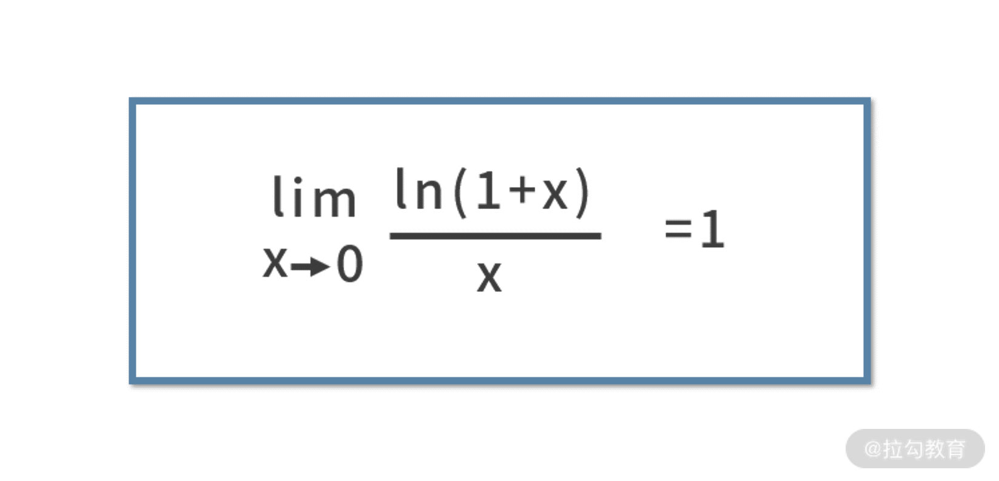
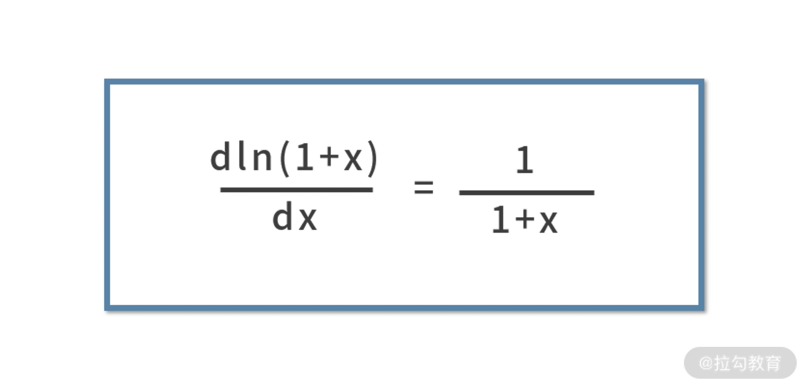
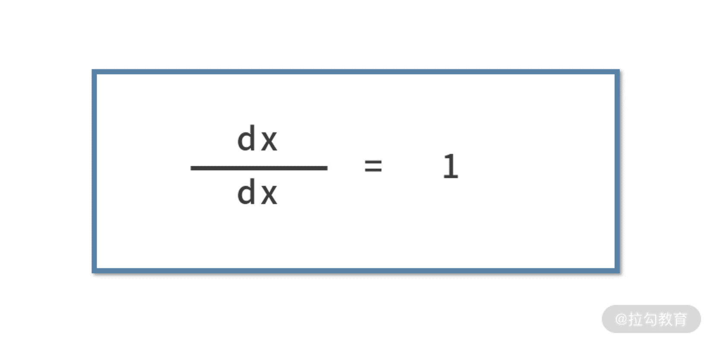
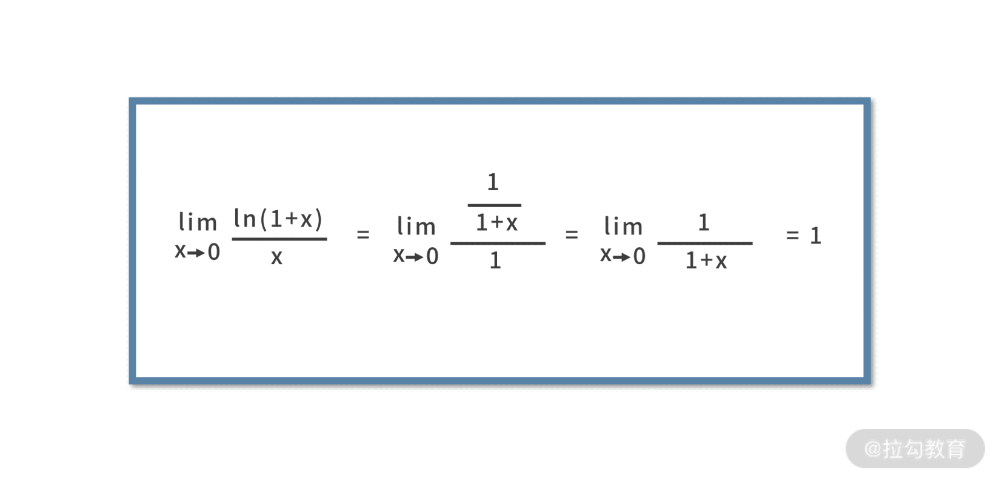

# 04 万物可数学，经典公式是如何在生活中应用的？

在我们的生活和工作中，有大量的数学应用场景，一些简单的经典公式会在我们的生活中被反复验证、体现。对于经典公式的理解，能增强你的数据 sense，更能帮助你在遇到问题时，迅速找到解决思路。

这一课时我将列举四个脑洞比较大，却又妙趣横生的例子，向你展示数学与万物之间的巧妙联系。

“数学无处不在”，可能学完这一课时，你就会理解为什么说“数学是一切科学之母”了，因为万物、生活、世界的本质就是由数学组成的，或者说可以用数学去解析表达。

正好下周就是双十一了，现在的你一定在各种优惠券和促销规则中与商家斗智斗勇，下面第一个例子我就分别从买家、卖家两个视角，看看这个钱到底应该怎么算？

### 双十一关于钱的计算

双十一期间，某商家的促销规则是：某笔订单消费满 200 元，可以获得 100 元的代金券，代金券可以在下次消费中使用，下次使用时的规则是，消费满 300 元，直接抵扣 100 元。

那么这样的促销活动规则，折扣率到底是多少呢？

大迷糊认为消费满 200 元获得 100 元代金券，这样折扣率应是 100÷200，就是五折。如果你也是这样认为，那么就中了商家的圈套了。

而大聪明发现为了花出去这个 100 元代金券，需要先消费满 200 元，再第二次消费满 300 元。总账算下来为，商品总价值 500 元，实际花费 400 元，也就是打八折。商家给予的优惠并没有看起来那么多，而就是这样依旧吸引了一批又一批用户“剁手”。

这个例子是以消费者的视角来计算的折扣率，我们还可以从商家的视角来分析商家的 **投资回报率 ROI（ROI=增量的回报/增量的投入）** 。一般而言，ROI 的应用场景都跟钱的投资有关，可以定义“回报”为营业额，而“投入”为代金券核销的金额。

现在我们把 ROI 的问题拓展到一个实际的业务场景。假设大漂亮是某宝增长部门的工程师，最近接手的项目是在双十一给用户投放优惠红包。红包的种类有很多，比如满 399 元减 100 元、满 299 元减 50 元、满 199 元减 20 元等等。

在做好了系统开发工作后，大漂亮在用户的维度上，上线了灰度实验。即一半用户被随机地划到了实验组，享受红包优惠；剩下的另一半用户，被划分到了对照组，不享受红包优惠。实验过后的所有数据记录如下表，围绕 GMV（营收额），帮大漂亮算一下这次双十一投放红包的 ROI 吧。  根据 ROI 的定义式很容易得到，ROI=(80万-65万)/10万=1.5。

值得一提的是，如果回报定义为实际的营收额，ROI 一般不会小于 1。因为满减红包这样的投入，是不会被白白浪费的， **每一笔投入一定会转化为核销，并计算在营收额中** 。换句话说，你不花满满减金额，也不会核销掉这 10 元的红包。

简单总结下，如果你负责某个“资源投入换产出”模式下的项目，例如投入补贴换营业额，那么业务指标上涨是显而易见的事情。毕竟对这个系统而言，是有资源投入的。此时，最关键的指标就是资源投入与业务产出的 **兑换效率** ，也就是资源的投资回报率 ROI。你的工作方向将会是，在算账体系下的 ROI 提高或优化的工作。

讲完“钱”后，我们再讲下“人”吧。

### 万有引力与好人缘

以太阳系为例，所有行星都围绕太阳运转，这就说明太阳的引力是最大的；对于一颗流星而言，没有什么天体在围绕它运转，也就是说流星的引力非常小。你可以很形象地认为：太阳的人缘特别好，几乎所有人都围着他转；而流星似乎人缘不太好，它身边几乎没有什么朋友。  形象来看，“人缘”就是一种吸引，就好比物理学的万有引力定律一样，人缘好的人总是能形成自己的一个社交圈，被周围的人认可和关注，并形成一个个像是太阳系、银河系一样的关系网。

\*\*但万有引力定律是个物理科学概念，而“人缘”是个基于社会关系的人文概念，现在我们要从理性科学视角去看待“人缘”这一话题，我们能得到两者之间的联系吗？\*\*首先，我们先回顾一下万有引力定律 (F=GMm/R2) 本身，再将其和“人缘”结合，对应起来看。

> 其中 G 是万有引力常量，M 和 m 分别为这两个物体的质量，R 是他们之间的距离。这个公式告诉我们，万有引力与质量呈正相关，与距离呈负相关。即质量越大、距离越近，引力也越大；反之亦然。

通常，优秀的人的人缘都不会太差，因为他们能给身边的人更多帮助，这就是你**个人的质量 M **的体现；反过来说，你肯定也会更喜欢与你一样优秀的人做朋友，这就是你** 身边人的质量 m**的体现。

接着，好的人缘肯定需要去持续维系。维系的方法可以有，不定期地聚会叙旧、朋友圈的互动点赞、关于某个领域问题的讨论等等。如果长时间缺少维系，那就印证了那句俗话“有些人，走着走着就散了”，这就是你与你身边人的**距离 R** 体现。

可见，想要获得好的人缘，你需要做好下面几件事：

- 提高自己的质量（M）。比如多学习一些拉勾教育的技能培训课、多参加一些行业分析讨论会、多学习领域内的书籍教材，不断提升自己的能力、见识和视野。让自己更好的同时，也有能力去帮助身边的人。
- 可以选择性地交朋友（m）。交朋友不需要太广泛，因为人脉的维系也是需要投入时间和精力的。你可以多去结交那些对你有正能量的人，例如某个领域的大佬、工作中的前辈，甚至是学生时代的师兄师姐，以及能与你相互鼓励，共同进步的伙伴。
- 注意维系人脉热度（R）。交朋友并不仅仅是加个微信，见面能打个招呼，更应该是能有深度地去做一些精神层面的互动。与其“海内存知己，天涯若比邻”，倒不如朋友之间多走动，多有些互动交集。

你会神奇地发现，在万有引力定律中，万有引力 F 与距离 R 是负平方的关系。也就是说，距离对引力的影响比质量要更大一些。这就像生活中决定两人关系亲疏的因素，与两人各自的标签、身份、能力 （M、m） 有关；但更重要的是距离 R，也就是两人之间的互动深度和频率。所以，在成为优秀的人的同时，希望你更能注意多跟朋友走动、沟通。

我们的生活不过就是“钱”“人”，还有工作，接下来我们从数学角度看一下你应该如何安排工作时间。

### 修炼学习还是延时工作？

小学的时候，我们就学习过这样的公式：路程=速度×时间（S=vt）。

> 在匀速运动的场景下，速度 v 是个常量。时间越长，走得越远。然而在实际场景中，速度通常不是常量，而是关于时间的函数（它随着运动的时间而发生变化）。

速度 v 关于时间 t 的函数图

如上图所示，刚开始跑步，速度越来越快（红色曲线）；之后，速度就会稳定在一个值（蓝色曲线）；再到后来，速度就会变慢（紫色曲线）。这样在追求跑得更远时，你需要根据自己不同时期的情况，在速度与时间之间做一个平衡，甚至一个抉择。

这就像是刚刚毕业参加工作的职场小白，大漂亮，她在学习修炼（提升未来挣钱速度）和兼职挣钱（延长工作时间）之间，也需要做一个抉择。

不仅是职场小白大漂亮，某创业公司老板，大聪明，也会面临这样的抉择。这时需要先搞清楚到底哪个是影响你收入的关键因素（影响最大的），然后往这方向去投入就可以了。

我们就试着利用速度与时间公式 S=vt，来分析大漂亮和大聪明该如何支配业余时间。

如下表，假设大漂亮的日常工作月薪为 12k，每月周末兼职能挣 2k。若不兼职而去培训，一年后跳槽工资翻番，月薪达 24k，一个月薪就能抵过一年的兼职。所以技能（赚钱的速度）没有办法提高，投入再多时间去加班兼职，也是没用的。  可见，当前影响大漂亮收入的关键因素是业务技能水平。她在技能培训上投入，获得工资涨幅的空间更大。这反映出，业务技能提升对于职场小白的重要性。

大聪明是初创公司老板，自身能力非常专业，这时候他再获得技能提升已经很困难了，就像对于理科状元，数学提升 5 分都是很困难的。而大聪明更好的选择是加班，为公司直接创造营收。如下表所示，通过加班，再算上基础工作，每个月共计能为自己带来 480k 的收入。  可见影响大聪明营收的关键因素是工作时长，他在时间上的投入，会更有可能获得收入的提高。

课后作业：在这里我只列出了他们某一时间点下的收入数据表，你可以尝试着去画出他们不同方案下的“挣钱速度关于工作时长的函数图”，并找到收入 S 区域。

> 画出后，你会联想到中学时的不同增长函数的函数图，以及高中物理的变速直线运动问题。

接下来最后一个案例，我将向你证明“努力进步”的力量有多可怕。

### 每天进步一点点问题

公务员行测题中，常常有这样一个经典题目：

某公司的营业额以每月 5% 的速度增长，多少个月后能翻倍？

A. 14 B. 16 C. 18 D. 20

- 大迷糊看到这个问题，不假思索地回答 D。他认为翻倍就是 100%，而每天 5% 的增长，所以 100÷5 = 20，而这样的计算是错的。
- 大漂亮老老实实列出公式，即(1+5%)n= 2，再利用计算器求出 n 约等于 14，选 A。
- 大聪明是个数学高手，他直接得到答案为，n=70÷5=14，选 A。

这个题的正确答案就是 A。对比他们的计算过程，大漂亮和大聪明虽然都得到了正确答案，但大漂亮的计算需要列方程，并借助计算器来求解。在行测考试平均 1 道题只有 1 分钟作答时长的高压环境下，大漂亮显然已经吃了大亏。

接下来我们从数学的角度来看一下这个问题。假设当前月的营业额为 a，既然每月增长 5%，那么第二个月（1 个月后）的营业额就是 a×(1+5%)。第三个月（2 个月后）的营业额又增长了5%就是 a×(1+5%)2。

因此，如果 n 个月后营业额翻倍为 2a，则有 a×(1+5%)n= 2a，即 (1+5%)n= 2。遇到 n 次方的幂运算，你第一时间想到取 log，这样就能得到下面更简单的表达式为 n×ln(1+5%) = ln2。  接下来有一个很奇妙的定律，也是高中数学的基础知识，如上图所示：在 x 很小时 ln(1+x)≈x。题目里的 5% 是个很小的数字，这样就可以得到 n×ln(1+5%) = n×5% = ln2，ln2 = 0.69≈ 0.70（这个是 lnx 函数常用数，可以背下来），因此n×ln(1+5%) = n×5% = ln2 = 0.70，则有 n=0.70÷5%=70÷5=14，这就是大聪明的计算公式。

这里提到的“在 x 很小时，ln(1+x)≈x”如何证明呢？其实很简单，需要利用极限的运算和洛必达法则，这里也顺便快速带你回顾一下大学数学。

要证明两个表达式相等，也就是证明他们的比值为 1。换句话说就是在 x 很小时，ln(1+x) / x≈1  当 x = 0时，ln(1+x) = 0，显然这是个“0/0”的极限求解问题，可以采用洛必达法则来计算。

> 洛必达法则：对一个“0/0”的极限求解，它等于分子一阶导数除以分母一阶导数的极限。

这里分子的一阶导数如下图所示： 

分母的一阶导数如下图所示： 

根据洛必达法则，原极限计算的结果如下图所示：  这个题目，我们可以命名为 **翻倍问题** 。利用大聪明的计算公式，我们得到结论：对于每年增长 x% 的翻倍问题，70/x 的单位时间后，可以实现翻倍。

这个题目的结论可以增强你对数据的敏感度，例如如何根据业务现状制定出合理的年度目标，如何对市场未来的发展作出一些趋势性判断等等。

将这个道理对应到生活中，就像这道行测题，假设每天你在某领域就进步 5%，两个星期后你在这方面的积累就能翻倍，所以可见“进步”的力量；反之，每天你即使只退步了一点点，一小段时间后你就会质变，退步一大截。

所以就从现在开始吧，每天都到拉勾教育收获一个知识点，长期后便能实现蜕变。

### 小结

这一讲，我们既是在讲数学，也是在讲生活。我们先后讲到了，要学会利用万有引力定律去建立属于自己的人脉圈，要学会围绕 ROI 去计算每一笔投入的回报，要通过公式化的方式去分配自己的时间投入，要提高自己的数据 sense。

确实生活中没有人会用高数公式去买菜，或者像吝啬鬼一样严密计算每笔支出的回报情况。但还是那句话，有了数学，你的思维一定会更活跃，做事思路也会更清晰。

就像生活中没有人会用唐诗宋词去对话，或者看到美景就去剖析美学和色彩学理论。但当你有了这些素养时，你看待生活的视角一定会更加丰富、智慧。

最后希望数学也能伴随你的生活，将数学融入你的思维中，去发现万事万物背后的数学奥秘，这也是这一课时想告诉你的“万物可数学”的道理。
