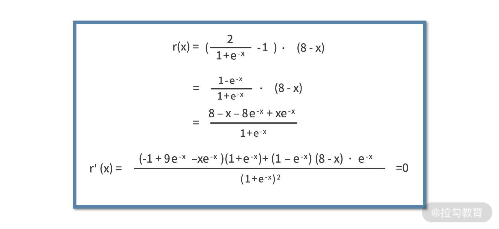
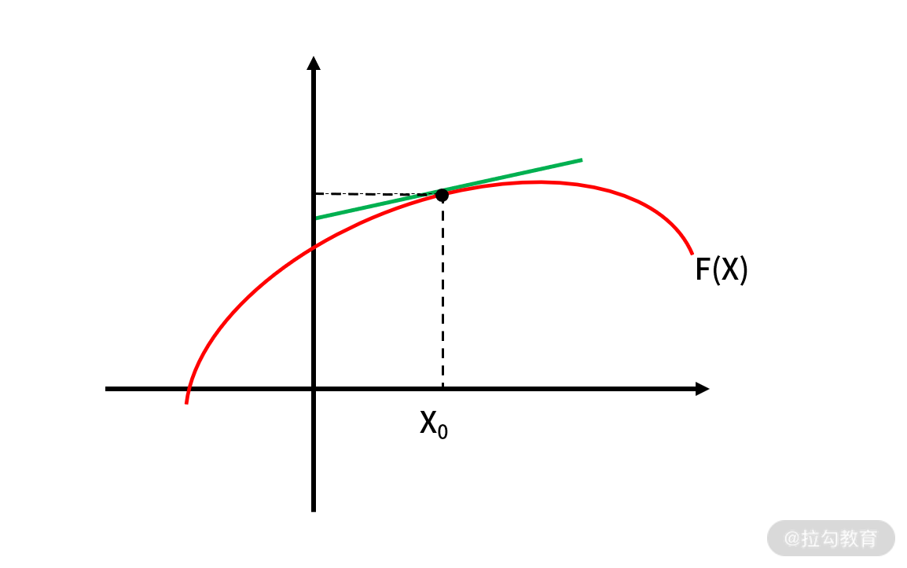
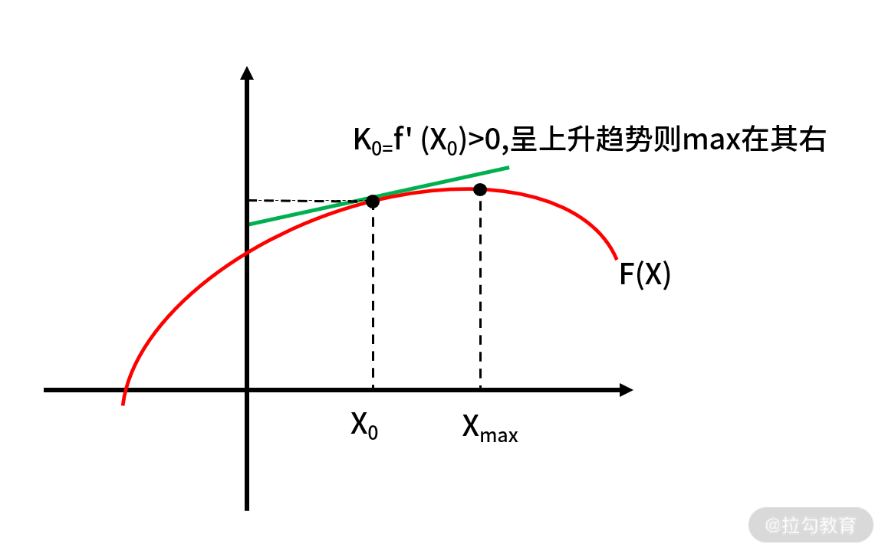
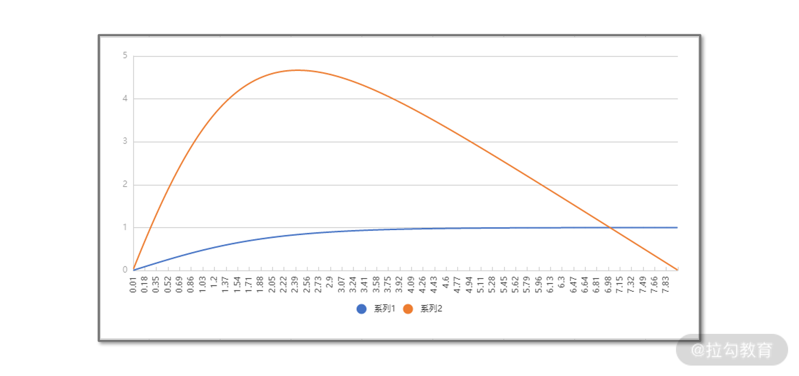
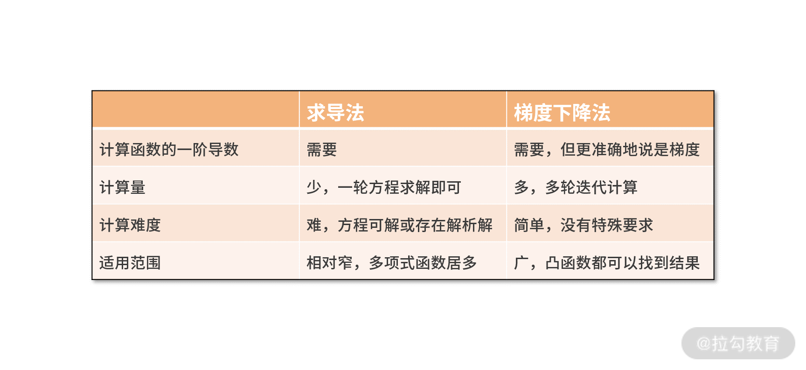
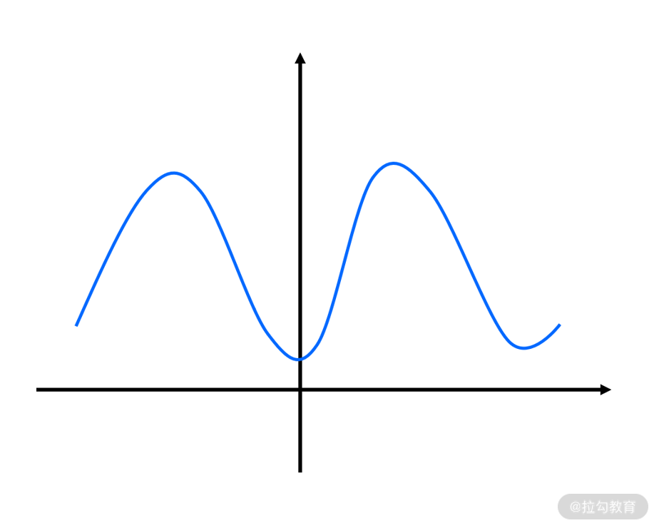

05 求极值：如何找到复杂业务的最优解？
====================

这一讲我将介绍两种求极值的方式，一种是你比较熟悉的求导法，另一种便是更厉害的梯度下降法，这里梯度下降法将与代码结合，去轻松解决非常复杂的业务难题。

想要找到一个复杂业务的最优解，就先需要找到影响这个事情的关键因素，以及关键因素之间的关系，而这个过程就是形式化定义的过程，把问题形式化定义后，再去追逐收益的最大化。

### 形式化定义

**“形式化定义”，就是用函数去表达需要用文字描述的问题**。也就是说，在做决策之前，需要把你的动作、收益、风险，用函数建立起联系。

我们举一个实际公司业务的例子。假设你在一个电商公司，负责用户营销红包的投放工作。很明显，对于一件商品，你投放给用户的红包金额越高，用户购买这件商品的可能性越大。然而投放红包的金额越高，利润空间也越小。

那么问题来了，对于一件商品，投放多少金额的红包，能让你的利润最大呢？

要想解决这个问题，就需要**先对问题进行形式化定义**。假设，用户购买商品的概率与投放的补贴金额的关系为 p(x)。因此，投放金额为 x 的红包额后，商品的利润可以定义为

> r(x) = p(x)×(m - x - c)

其中，m 为商品的原价，c 为商品的成本价。

有了形式化定义之后，才可以进行业务策略的优化，也就是追逐收益最大化。

### 追逐收益最大化

“追逐收益最大化”就是求解这个函数的最值，可能是最大值、也可能是最小值。

仍以红包投放为例，要找到能让利润最大的红包金额，你需要用到数学中求解函数极值的知识，也就是计算 max r(x)。

关于某个函数求解极值的问题，我们从中学就开始接触了。那时候我们求解的方法是，令目标函数的一阶导数为零，并求解方程的解，这种方法称作**求导法**。

【例题1】假设你是某电商公司营销系统的工程师。你们某个商品的购买概率和补贴额的关系为，p(x) = 0.05 x + 0.2。该商品原价 m 为 16 元，成本价 c 为 8 元，求利润最大的补贴额应该是多少？

【解析】商品的利润函数为 r(x) = p(x)×(m - x - c) = (0.05x + 0.2)×(16 - x - 8) = -0.05x2 + 0.2x + 1.6，利用高中的数学求导法，令 r(x) 的导函数为零并解方程，则有：

r'(x) = -0.1x+0.2 = 0

解得，x = 2 元。

除了求导法，对于这个问题，你还可以开发出如下的代码来求解：

```
def getSubsidy(k,b,m,c):


    rx = [-k, k*(m-c)-b, b*(m-c)]


    rpx = [-2*k, k*(m-c)-b]


    return -rpx[1]/rpx[0]

```

这样，可以在主函数中，通过 getSubsidy(0.05,0.2,16,8) 来调用，就得到了利润最大的补贴额。

### 方程解不出来怎么办？

刚才的例子在解方程时，遇到的是个二阶多项式方程，我们利用高中知识就能完成。

然而，实际的业务环境中，遇到的往往是非常复杂的函数。例如，你们公司 BI 同事经过深度分析业务数据得到，商品的购买概率和补贴额的关系为 p(x) = 2÷(1+e-x) - 1。

那么，此时 r(x) = p(x)×(m - x - c) = (2÷(1+e-x) - 1)×(16 - x - 8)，建立一阶导数为零的方程为：



这时候就傻眼了，这么复杂的方程怎么解呢？接下来，我们介绍 **梯度下降算法** 来求解。

### 梯度下降法

对于一个函数，它的 **导数的含义是斜率** ，这也是高中数学知识之一。例如某个函数 f(x)，在某个点 x0 的 导数为 f'(x0) = k0。那么 k0，就是函数 f(x) 在 x0 处切线的斜率，如下图：



既然 k0 是斜率，我们很容易得出这样的结论：如果k0为正数，那么函数值在 x0 附近就是呈现“上升”趋势；反之，如果 k0 是负数，函数值在 x0 附近就是呈现“下降”趋势。

围绕这个性质，我们就可以通过多轮迭代，逐步去逼近函数的极值点，如下图：



我们把这个过程用数学语言来重新描述。先来定义一下函数的梯度，对于函数 f(x,y)，常用 ▽f(x,y) 来表示函数的梯度。其中 x、y 表示函数有两个或多个自变量，是个多元函数。梯度本身是个向量，表示的是函数在自变量构成的空间中，变化率最快的方向，其计算式为：


可见，如果函数 f(x) 是个一元函数，梯度和导数就非常近似了。区别只在于前者是向量，后者是标量。

> 至于为什么梯度是函数变化率最快的方向，需要依赖泛函分析相关的知识来证明，证明的过程会比较复杂。如果你感兴趣，可以自己在网上找一些资料进行补充学习。在这里，我们记住这个性质就好了。

有了梯度，我们就能找到函数变化率最快的方向。通过这个方向，就能指挥我们朝哪个方向去更新参数，来找到函数的极值，这就是梯度下降算法。


我们对梯度下降法的原理进行分析。

第 1 步，是把一些要用的公式预先推导出来。

第 2 步，计算当前点的梯度，找到当前点变化率最快的方向。

第 3 步，(xtemp,ytemp) = (xtemp,ytemp) - a×▽f(xtemp，ytemp) 表达的含义是，从当前的点，朝着这个变化率最快方向的反方向，移动一小步后，来更新当前点，这里有两个要点：

* 之所以是“反方向”，是因为我们要求解的是函数的极小值；如果是极大值，就不是反方向了，公式中的“负号”就要修改为“正号”。
* “移动一小步”的实现，一般用学习率 a 来控制。通常 a 不会很大，比如设置为 0.1、0.05 等等。如果 a 过大，则可能会出现移动后“跳过”极值的可能；如果 a 过小，无非就是迭代次数多一些而已。这一步是梯度下降法最关键的步骤。

最后第 4 步，就是当迭代到极值附近时，就终止条件的判断了。

了解完梯度下降法是怎么回事后，接着我们就用梯度下降法来编程，对先前的问题进行求解。

【例题2】按照之前，我们得到的商品利润函数 r 和补贴金额 x 的关系为 r(x) = p(x)×(m - x - c) = (2/(1+e-x) - 1)×(16 - x - 8)。下面利用梯度下降法，求解让利润最大的补贴额 x\*。

【解析】

按照梯度下降法的流程来计算，首先需要写出目标函数 r(x) 的梯度函数，


设置学习率 a 为 0.01，最大迭代次数 1000，然后就需要利用 xtemp = xtemp - a×▽r(xtemp) 来逐轮迭代。

这样整体的代码如下：

```
import math


def grad(x):


 fenzi1 = (-1+9*math.exp(-x)-x*math.exp(-x))*(1+math.exp(-x))


 fenzi2 = -(8-x)*(1-math.exp(-x))*math.exp(-x)


 fenmu = math.pow(1+math.exp(-x),2)


 return (fenzi1 - fenzi2) / fenmu


def main():


 a = 0.01


 maxloop = 1000


 xtemp = 0.1


 for _ in range(maxloop):


  g = grad(xtemp)


  if g < 0.00005:


   break


  xtemp = xtemp + a*g


 print xtemp


if __name__ == '__main__':


 main()

```

程序运行的结果为 2.42017943599。可见，当补贴金额 x = 2.42 元时，利润 r(x) = 4.67 元为最大利润。

为了验证计算结果是否正确，我们可以把利润函数、购买概率函数的曲线打印出来进行观察，如下图。图中，横轴是折扣金额，定义域是\[0,8\]，0 和 8 分别代表补贴额为零时的不打折，和补贴额等于原价减去成本时的不赚钱。

蓝色线代表的是购买概率，是个单调递增的非线性函数。而橙色曲线则是 r(x) 利润函数，图中的定性结论是，r(x) 在 x = 2.4 左右时可以取得最大值约为 4.7，这与我们用梯度下降法计算的结果是一致的。



最后，我们总结一下梯度下降法和求导法的区别和差异，如下表所示：



从计算过程而言，两种方法都需要对目标函数进行求导（求梯度）。 **求导法** 的计算量虽然少，但它的难度就在于 **必须求解出导数为零的方程** 。这样，在无法写出解析解的场景下，求导法就无能为力了。 **梯度下降法** 需要进行多轮的迭代计算，显然计算量是更多的。但每一轮的计算仅仅是带入梯度函数求个梯度值，再更新下自变量。计算量虽然多，难度却很低。对于无法写出解析解的方程，它一样是适用的。

相对求导法，梯度下降法显然是更厉害的算法。不过，它也有一些 **局限性** ：

* 它需要配置一些算法参数，如学习率、停止条件等。如果配置不好，可能会导致算法失效。例如，在本课时的例子中，如果学习率不小心设置为 0.7 以上，结果就不再是 2.42 了。这是因为学习率过高，导致了每一次迭代自变量“移动的步伐太大”，而频繁跨越最值无法收敛。
* 它要求目标函数为凸函数，否则就有可能会收敛到局部最优。 例如下面的双峰函数便不是凸函数。幸运的是，实际业务环境中很少会遇到非凸的函数。如果真的遇到非凸的函数，一个可行的方法是，采用随机初始化 xtemp，并多次执行梯度下降法求解。



### 小结

在这一课时，我们学习的是如何从复杂业务环境中找到最优解。

这需要你利用行业经验和领域知识，对问题进行函数的形式化定义，接着就是对目标函数求解最值的过程。

对于求解方法，我们着重学习了梯度下降法。相比求导法而言，梯度下降法的适用性更广、计算更简单，但计算量相对更多。就梯度下降法本身而言，它的局限性是依赖学习率、终止条件、初始值等参数的配置，并且只适用于凸函数。
