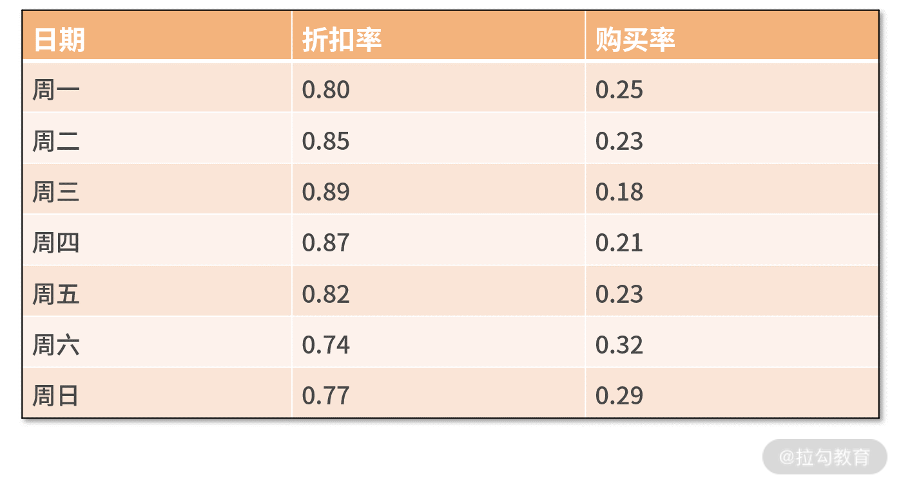
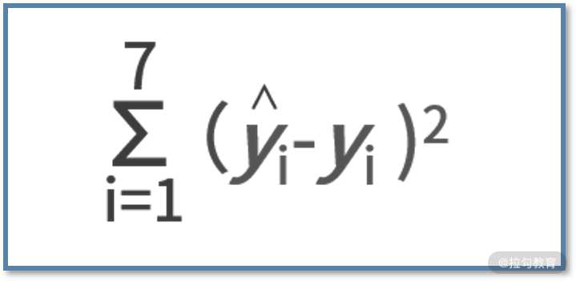
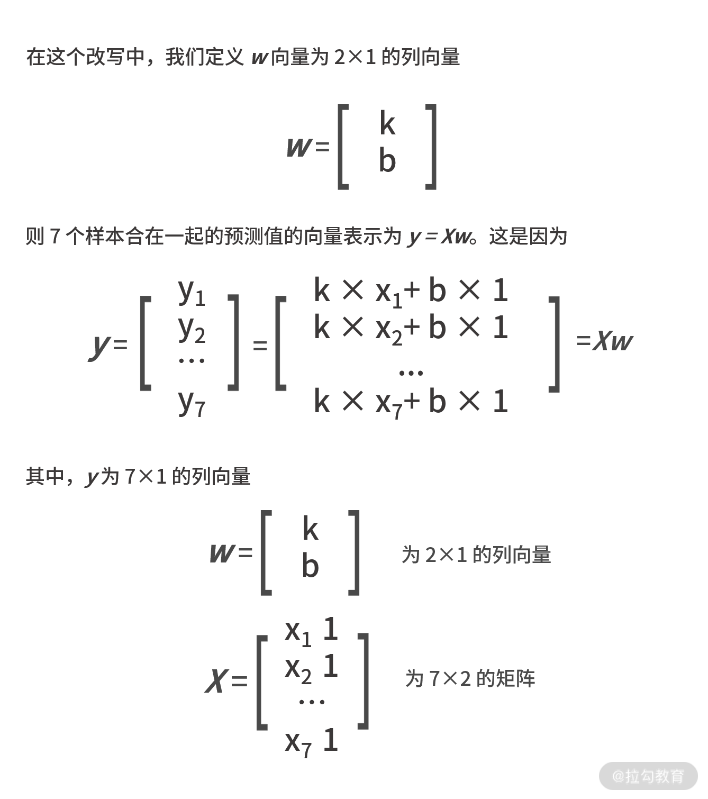
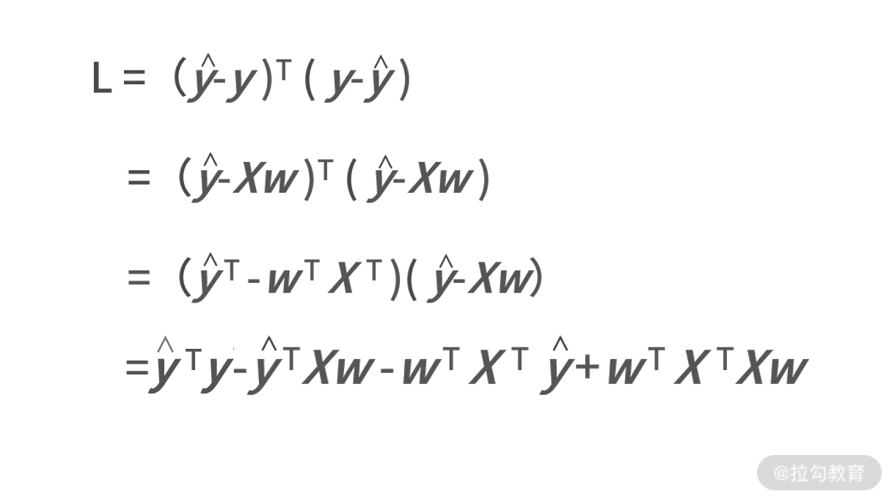
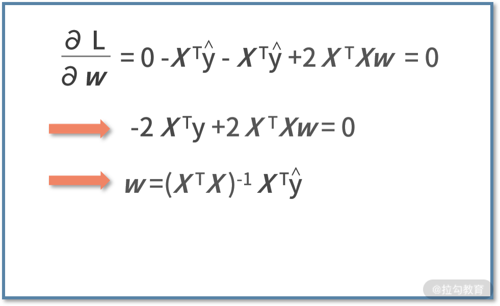
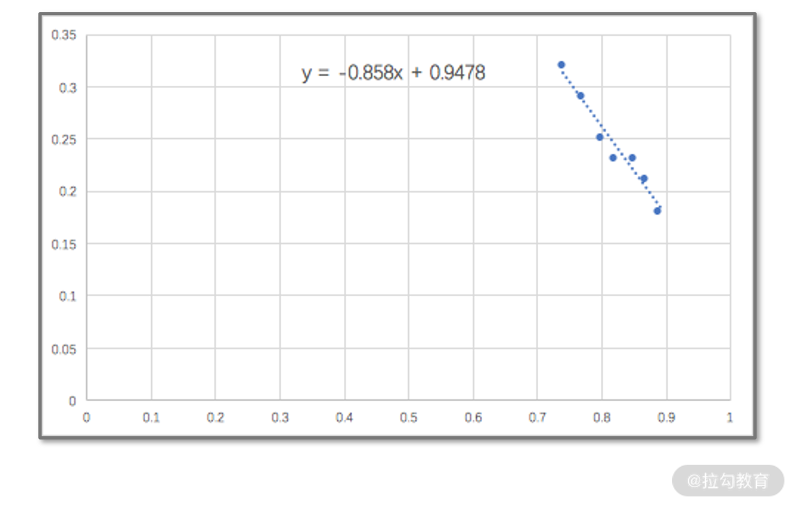
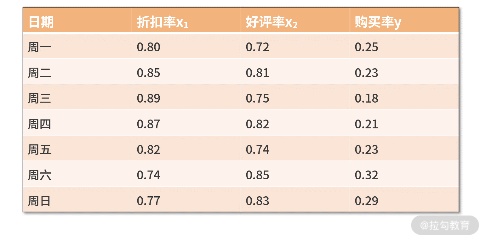

# 07 线性回归：如何在离散点中寻找数据规律？

经过前面几节课，我们讨论了对问题的形式化定义和对目标函数极值的几种求解方法，以及在大数据多变量环境中对数据计算的方法。

而这一课时，我们就把这些知识用在线性回归上，看一下它们是如何在实际工作中应用的。

假设大漂亮是公司负责增长营销策略的工程师，她利用公司的大数据分析了某件商品的销售情况。她发现这件商品的购买率（购买量除以浏览量）和它的折扣率（折后价除以原价）有着非常强的关系。

因此，她把这件商品最近一周的数据都提取出来，并且以每天一个样本点，尝试分析购买率和折扣率的关系，她的原始数据如下表所示：  我们可以直观看出，折扣率越低，购买率越高。那么除此之外，我们还能分析出其他信息吗？比如，这里的趋势和关系如何用数学语言描述呢？以及可以如何用来指导补贴的投放方法？这些问题就需要用线性回归的知识来分析了。

### 什么是线性回归？

**回归（也称作拟合），通常是指利用某个函数，尽可能把数据样本点“串”在一起，用于描述输入变量和输出变量间的变化关系。 **在回归中最常用的就是** 线性回归**了，这是因为线性回归与人类“越怎样...越怎样...”的思维方式更一致。线性回归的特点是，用来把数据“串”起来的那个函数是线性的。线性回归可分为一元线性回归（ 一个自变量）和多元线性回归（至少两个自变量）。

围绕上面的概念，我们尝试写出线性回归的方程。一个线性函数的通式为 y =_\*\* k·x \*\*_+b 或者

y =_\*\* k\*\*_T_**x**_+b。

> 其中，_**x**_ 是 nx1 维的自变量向量，_**k**_ 是 nx1 维的权重。y 是输出变量，b 是个常数。如果是一元线性回归，则 n 为 1。

上面两种表达方法殊途同归，区别仅在于形式。前者是把变量当作了向量，通过向量的点乘得到结果；而后者是把向量视作一个特殊的矩阵，通过矩阵的乘法得到结果。

线性回归的目标是，尽可能把数据样本点“串”在一起。也就是说，要求解出 _**k**_ 和 b，让这个函数尽可能把数据都拟合起来。

接下来，我们以大漂亮遇到的问题为例，试着用线性回归帮帮她。

### 线性回归的形式化定义

我们先前总结过解决问题的通用方法，包括两步：首先要进行形式化定义，接着对形式化定义的问题进行最优化求解。

形式化定义，是要用数学语言来描述清楚问题的目标是什么。我们前面分析到， **问题的目标是尽可能把数据样本点“串”在一起** 。那么如何用数学语言来描述呢？

在线性回归中，通常用平方误差来衡量拟合的效果。平方误差的定义是，真实值和预测值之差的平方，即 (ŷ-y)2。值得一提的是，我们采用 ŷ 来代表真实值，用 y 来代表回归拟合的预测值。

有了这些背景知识后，我们回到大漂亮的问题。大漂亮想用一个线性函数去拟合购买率和折扣率，不妨用 y 表示购买率，x 表示折扣率，那么线性函数的表达式就是 y = kx + b。

此时，大漂亮面对的是一元线性回归问题，要做的事情就是求解出 k 和 b 的值。假设大漂亮已经有了 k 和 b，那么就能根据输入的 x，拟合出 y 的值了， **而线性回归的目标是尽可能让“串”在一起的平方误差最小** 。因此，平方误差函数在这里的形式就是：



其中求和的 1 到 7，表示的是大漂亮获得的数据集中 7 个样本。公式的含义就是，每个样本的预测值和真实值的平方误差，再求和。大漂亮遇到的问题定性描述是，通过线性回归，让数据尽可能“串”在一起。**其形式化定义，就是找到能让平方误差函数最小的 k 和 b 的值。**### 线性回归的求解方法

有了形式化定义的问题之后，就是求解问题的最优化过程。根据形式化定义，你会发现，这不就是个求解最值的问题嘛，我们已经学过了很多求解方法了。是的，绝大多数的问题，只要形式化定义清楚之后，就是个求解最值的过程。

对于线性回归而言，我们可以通过求导法来进行计算。不过要注意，此时我们是在向量的环境中求导，这就要用到上一讲的知识了。

我们先将平方误差函数用向量的形式进行表达，则有：


其中，_\*\* ŷ\*\*_ 表示真实值的向量，_**y**_ 为拟合的预测值的向量，他们的维度都是 7×1。同时别忘了，拟合函数是个线性函数，每个样本都满足 yi = kxi+b，可以改写为：   则 7 个样本合在一起的预测值的向量表示为 _**y = Xw**_。

我们把这些条件都带入平方误差函数中，则有：  接下来问题就是，如何求解平方误差函数的最小值。我们利用求导法，则有  这样，我们就得到了 _**w**_ 的值啦。

### 线性回归编程实战

好了，到这里呢，我们已经掌握了全部线性回归拟合数据的精要。接着，我们尝试用代码来帮助大漂亮进行数据拟合的开发。

说到代码，你可能会感觉很恐怖，难道我要把先前的推导过程也要在代码里面重新开发一遍吗？其实完全不需要！对于代码开发而言，唯一需要用到的仅仅是最后的结论，即 _**w**_=(_**X**_T_**X**_)-1\_**x**_T_**ŷ**\_。

换句话说，如果你会用 Python 的 NumPy 库，导入数据后，一行命令计算矩阵乘法和求逆运算就可以了。我们给出代码如下：

```
import numpy as np
def main():
 x = np.array([[0.80,1],[0.85,1],[0.89,1],[0.87,1],[0.82,1],[0.74,1],[0.77,1]])
 yhat = np.array([[0.25],[0.23],[0.18],[0.21],[0.23],[0.32],[0.29]])
 xtx = np.dot(x.T,x)
 xtx_1 = np.linalg.inv(xtx)
 w = xtx_1.dot(x.T).dot(yhat)
 print 'k: ' + str(w[0][0])
 print 'b: ' + str(w[1][0])
if __name__ == '__main__':
 main()
```

我们对代码进行解读：

- 第 4 行，导入数据得到矩阵 _**X**_。为了还能求解出 b，我们需要对每个 xi 补充一个“1”；
- 第 5 行，导入数据得到真实值向量 _**ŷ**_。接下来，按照公式进行求解就可以了；
- 第 6 行，计算了 _**X**_T_**X**_ 的结果；
- 第 7 行，对其求逆，得到了（_**X**_T_**X**_）-1；
- 第 8 行，再来对 \_**X**_T 和 **ŷ **计算矩阵乘法，得到最终的 \_** w**_。

最后，第 9 和 10 行打印结果，程序执行后的结果如下图：  因此，我们帮助大漂亮进行开发后，得到的结果为 y = kx + b = -0.86x + 0.95

我们用 Excel 的散点拟合功能，来校验一下我们的结果。Excel 的结果如下图，这与我们的结果完全一致。



### 思维发散

通过大漂亮遇到的难题，我们可以尝试着去发散一下，看看能得到哪些启发。

- 普通程序员会写代码，一流的程序员懂数学。

如果你只是个普通的程序员，光看我们给的 13 行代码，想必很难知道最终打印的结果到底代表什么含义。只知道代码进行了一些矩阵运算，然后得到了一个向量，最后打印了两个变量的值。可是这两个值到底代表了什么含义，却一无所知。

这是因为，最终的结果算式的背后，有着非常复杂的数学原理。这些计算过程的证明和推导，是不需要在代码中被重复计算的。

- 既然 Excel 这么强大，我能否不学数学，而用 Excel 来打天下呢？

面对简单问题时，的确可以；而面对复杂问题时，则不行。例如，一元线性回归，我们可以通过散点图和 Excel 的趋势线功能拟合；而多元线性回归，则只能通过以数学为基石的代码来完成。

我们举个例子，假设大漂亮经过分析后又发现，购买率还跟商品前一天的好评率有关。那么数据集就变成了下面的表格：



现在，大漂亮想用线性回归来描述折扣率、好评率共同影响购买率的关系，并且比较两个自变量之间影响程度的大小。我们还可以继续用上面的代码，只不过导入的数据进行调整就可以了：

```
import numpy as np
def main():
 x = np.array([[0.80,0.72,1],[0.85,0.81,1],[0.89,0.75,1],[0.87,0.82,1],[0.82,0.74,1],[0.74,0.85,1],[0.77,0.83,1]])
 yhat = np.array([[0.25],[0.23],[0.18],[0.21],[0.23],[0.32],[0.29]])
 xtx = np.dot(x.T,x)
 xtx_1 = np.linalg.inv(xtx)
 w = xtx_1.dot(x.T).dot(yhat)
 print 'k1: ' + str(w[0][0])
 print 'k2: ' + str(w[1][0])
 print 'b: ' + str(w[2][0])
if __name__ == '__main__':
 main()
```

执行后，程序的运行结果为：  可见 y = -0.79 x1+ 0.2x2 + 0.73。由于 0.79 大于 0.2，因此 x1 的折扣率对 y 的影响更大。

根据这个例子可以发现，用代码化的方法来进行线性回归，一方面可以减少工作量，另一方面对复杂问题的适应性也会更好。

### 小结

我们对这个课时的内容进行总结。在面对实际的、陌生的复杂问题时，一个最基础的解决方案就是形式化定义加最优化求解，这个套路能帮助你解决绝大多数的工作或生活的问题。

在这一讲中，我们以线性回归去拟合散点为例，先对回归进行形式化定义。我们讲述了回归的定性目标是用个线性函数去把散点“串”起来；而定量的形式化目标，则是平方误差最小化。

我们利用向量的方式把问题的形式化定义方程写出来后，就需要进行最优化求解了。在这里，我们还不需要用梯度下降法那么复杂的算法，用求导法就能求出结果了。最终会发现，拟合的结果 就是 _**w**_=(_**X**_T_**X**_)-1\_**x**_T_**ŷ**\_ 这么一个简单的表达式。利用 NumPy 库，我们自主地编写了线性回归的代码，并且在一元回归和多元回归分别进行应用。

最后，我们留两个课后作业吧：

- 自己去造一些数据，分别利用 Excel 和自己写的代码，亲自试一下线性回归的拟合；
- 如果我们不采用求导法，而采用梯度下降法，试着写一下代码吧。
