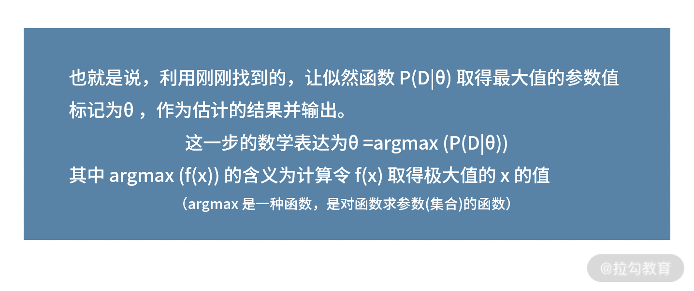
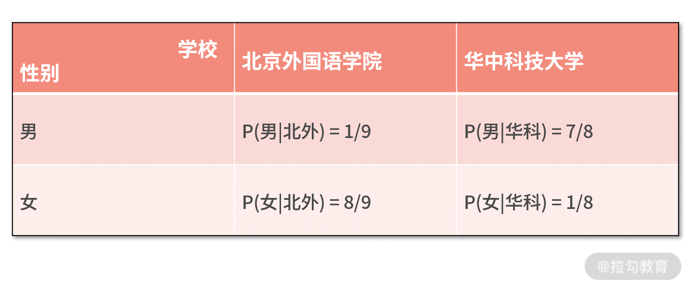

# 09 似然估计：如何利用 MLE 对参数进行估计？

你好，欢迎来到第 09 课时——似然估计：如何利用 MLE 对参数进行估计？

前面我们学会了如何计算概率，这一讲我们学习如何利用概率对某个参数进行估计。在读书的时候，你一定接触过极大似然估计，它是数学课程的难点之一，它名字背后的含义，以及它的推导过程都非常复杂，需要你对它有深刻的理解。

不过，有了前面“形式化定义”“概率计算的加乘法则”和求函数最值的“求导法”“梯度下降法”的知识储备，相信极大似然估计也能迎刃而解。

### 白话理解“极大似然估计”

如果你是刚刚学习概率，极大似然估计这六个字一定会让你产生不解。

**似然**（Likelihood），可以理解为可能性，也就是概率。举个例子，某个同学毕业于华中科技大学这样的工科院校，那么这位同学是男生的可能性（或者说概率、似然）就更大；相反，某个同学毕业于北京外国语学院这样的文科院校，那么这位同学是女生的可能性（或者说概率、似然）就更大。

那么反过来思考，如果大漂亮是个美丽又可爱的女生，现在有两个候选项：A.大漂亮毕业于华中科技大学；B.大漂亮毕业于北京外国语学院。在对其他信息都毫不知情的情况下，你更愿意相信哪个呢？很显然，相信 B 是更好的选项，因为 B 的概率（或者说似然）更大。

其实，在刚刚的思考逻辑中，我们已经不知不觉地用了极大似然估计的思想了——**估计**（Estimate），用大白话说就是“猜”。

例如，你对于大漂亮毕业院校的“估计”是她来自北京外国语学院；这就是说，你“猜测”大漂亮毕业于北京外国语学院。那么，为何你猜测她毕业于北京外国语学院，而不是华中科技大学呢？原因就是前者的可能性更大，而后者可能性更小。换句话说，从可能性的视角看，前者是个**极大**值（Maximum）。

我们将上面思考过程的 3 个关键词“**极大 **（Maximum）”“** 似然 **（Likelihood）”“** 估计**（Estimate）”给提炼出来，就得到了极大似然估计这个方法，通常也可以用这 3 个单词的首个字母来表示——MLE。

### 极大似然估计的方法路径

从刚才的例子不难看出，极大似然估计做的事情，就是**通过已知条件对某个未知参数进行估计，它根据观测的样本构建似然函数，再通过让这个函数取得极大值，来完成估计**。接着，我们用数学语言来描述整个过程。

极大似然估计的流程可以分为 3 步，分别是似然、极大和估计。

- 第一步 **似然** ，即根据观测的样本建立似然函数，也是概率函数或可能性函数。 这个步骤的数学表达如下：假设观测的样本或集合为 D，待估计的参数为 θ。则观察到样本集合的概率，就是在参数 θ 条件下，D 发生的条件概率 P(D|θ)。这就是似然函数，也是极大似然估计中最难的一步。
- 第二步 **极大** ，也就是求解似然函数的极大值。 你可以通过求导法、梯度下降法等方式求解。这个步骤的数学表达就简单许多，即 max P(D|θ)。
- 第三步 **估计** ，利用求解出的极大值，对未知参数进行估计。 

利用这 3 步就完成了极大似然估计的整个流程。

**接下来，我们将这个方法路径用在对“大漂亮毕业院校的极大似然估计表达”上。**

- 第一步 **似然**

我们观测的样本结果 D 是“大漂亮是个女生”，待估计的变量 θ 是“大漂亮毕业于哪个学校”。这样，似然函数就是 P(D|θ) = P(大漂亮是个女生|大漂亮毕业于 θ 学校)，其中 θ∈(北京外国语学院,华中科技大学)。

接着，我们还需要了解工科院校、文科院校的男女比例情况，把似然函数写出具体的数字表达。假设华中科技大学的男女比例为 7:1，北京外国语学院的男女比例为 1:8，则有下表的概率值：



- 第二步 **极大**

有了前面的信息，我们就能求解似然函数的极大值了。似然函数中参数 θ 是离散值，只有两个可能的取值。因此，我们既不需要求导法，也不需要梯度下降法，只需要把两种可能性都算一下，再进行比较就可以了。

不难发现，因为 P(女|北外)=8/9 > P(女|华科) = 1/8，所以似然函数的极大值是 8/9。

- 第三步 **估计**

求解出似然函数的极大值之后，我们利用取得极大值的参数值作为结果，则有 

### 极大似然估计的拓展

前面的例子很简单，而实际中你可能还会遇到很复杂的拓展问题。

#### 1.第一个复杂的拓展问题，为单样本拓展为多样本

刚刚的观察样本集合中，只有一个样本（即大漂亮是个女生）。而如果有多个样本又该怎么办呢？

此时我们需要用到概率计算的乘法法则。通常，我们都会认为同一个事件的不同观测结果是独立的，因此可以用乘法法则计算它们共同发生的概率。

这个过程用数学语言表达，就是假设观测的样本集合为 D = (d1,d2,d3……dn)，待估计的参数为θ，则似然函数 P(D|θ) = P(d1,d2,d3……dn|θ)。

因为观测样本独立，满足 P(AB) = P(A)·P(B)，则有


#### 2.第二个拓展问题，是似然函数到对数似然函数

刚刚的推导结果非常吓人。大型连乘算式中，直接求解最值是非常困难的。不过，庆幸的是数学中有个化乘法为加法的函数——对数函数。因为对数函数是单调的，所以在化乘法为加法的过程中，不会改变最大值发生的位置，即 ln(xy) = ln x + ln y。


### MLE 梳理

到这里，关于 MLE 所有的知识点就讲完了，我们做个简单的梳理。

极大似然估计的目标，是通过观察样本估计某个参数的值，它估计的方法路径如下。

- 第一步，通过观察到的样本，建立代表这些样本发生可能性的似然函数。
- 第二步，利用求导法、梯度下降法等算法，求解似然函数的极大值。
- 第三步，用似然函数取得极大值的参数值，作为结果的估计值并输出。 在实际应用，样本很多的时候，通常认为样本之间是独立的，满足概率相乘的乘法法则；而面对连乘的复杂运算，通常采用对数似然函数的处理方式，化连乘为求和运算。

以上就是 MLE 基础原理的知识。

### 极大似然估计在工作场景中的应用

我们看一个利用极大似然估计解决实际工作问题的案例。

假设大迷糊是某个电商公司负责质量检测的工程师，这个公司的商品质量可以分为三档，分别是优质品、合格品和残次品。BI 的同事根据调研，发现商品的质量满足如下概率分布：


其中 θ 是个未知参数，大迷糊想用 MLE 的方法估计出 θ 的值。于是，大迷糊对商品进行了采样，得到的采样值分别为优质品、优质品和合格品。现在，让我们用 MLE 帮助大迷糊来估计未知数 θ 的值吧。

- 第一步 似然

我们发现，样本集合有 3 个样本，则 D = (d1,d2,d3) = (优质品,优质品,合格品)。待估计的未知数为θ，则似然函数为 P(D|θ) = P(d1,d2,d3|θ) = P(d1|θ)·P(d2|θ)·P(d3|θ)。

代入 d1～d3 的值，以及对应的概率，则有 P(D|θ) = P(优质品|θ)·P(优质品|θ)·P(合格品|θ) = θ4 * 2θ(1-θ)。

那么，对数似然就是 ln P(D|θ) = ln (θ4 * 2θ(1-θ)) = ln 2 + 5 ln θ + ln (1-θ)。

- 第二步 极大

有了似然函数，我们就来尝试求解它的极大值吧。首先求对数似然函数关于 θ 的导数，则有  推导到这里，你会发现直接用求导法建立导函数为零的方程就能得到结果。这是因为，商品质量函数都是比较简单的多项式。如果里面包含了复杂的函数，例如指数函数、正弦函数等，就必须要借助梯度下降法来求解了。

为了再次说明梯度下降法的使用，我们这里尝试采用梯度下降法来求解，我们直接给出代码：

```
import math


def grad(x):


 return (5 - 6 * x) / (x*(1-x))


def main():


 a = 0.01


 maxloop = 1000


 theta = 0.1


 for _ in range(maxloop):


  g = grad(theta)


  theta = theta + a*g


 print theta


if __name__ == '__main__':


 main()

```

我们对代码进行走读。

- 主函数中，设置学习率为 0.01，最大迭代轮数为 1000 次，θ 的初始值设置为 0.1。
- 接下来，第 10～12 行，是 1000 次的循环体。每次循环执行两个动作，分别是计算梯度，并把结果保存在 g 变量中；再用学习率和梯度的乘积，去更新 θ。
- 在计算梯度的函数 grad() 内部，直接返回一阶导数值。这是因为对于单变量而言，一阶导数的值就是其梯度的值。

我们执行这段代码，打印的结果如下图所示： 

如果我们用求导法，则有(5-6θ)/(θ\*(1-θ)) = 0，解得 θ = 5/6 = 0.8333，这与我们用梯度下降法求得的结果一致。

- 第三步 估计

我们求解出的 θ\* 值为 0.8333。它的含义是当 θ = θ\* 时，大迷糊随机抽取 3 个样本恰好是优质品、优质品、合格品的概率最大。因此，我们有理由相信，θ\* 是最有可能让这个观测结果出现的参数值。因此，0.8333 就是这里 θ 的估计结果。

### 小结

MLE 覆盖的知识点比较多。要想利用 MLE 去解决问题，你首先需要会计算概率，构建似然函数；接着，你还需要一些算法知识的储备，才能让你面对任何一个复杂函数，都能快速求解其最大值；最后，你还需要一个小技巧，那就是似然函数转化为对数似然函数后，最优估计值是不变的。

正是 MLE 的背后需要很多知识和能力，才让它成为数学学习过程中的一个难点。不过，庆幸的是，它的编程实现还是非常简单的。如果你掌握了梯度下降法的开发，那么 MLE 的开发也一定难不倒你。

最后，我们给一个练习题。假设在本例中，商品质量的分布如下：


试着再来帮大迷糊来估计下 θ 的值吧。
