# 19 逻辑回归：如何让计算机做出二值化决策？

在上一讲，学习完 AI 的基本框架后，我们现在就开始围绕当前人工智能领域最常用的模型，来分别学习一下它们背后的原理。

这一讲，我们从最常见的逻辑回归模型说起，逻辑回归是人工智能领域中入门级的基础模型，它在很多领域都有应用，例如用户的信贷模型、疾病识别等。

逻辑回归是一种分类模型，可以对一个输入 x，识别并预测出一个二值化的类别标签 y。例如，要预测照片中人物的性别，可以采用逻辑回归建立模型。给模型输入一个描述照片的特征向量 x，经过模型的计算，可以得到输出值 y 为“男”或“女”。

在深入学习逻辑回归的原理之前，我们先来了解一下什么是分类问题，以及分类问题有哪些类型。

### 分类问题

在人工智能领域中，分类问题是特别常见的一种问题类型。简而言之，分类问题就是对一个测试验本去预测它归属的类别。例如，预测胎儿性别、预测足球比赛结果。

根据归属类别可能性的数量，分类问题又可以分为二分类问题和多分类问题。

- 二分类问题，顾名思义就是预测的归属类别只有两个。例如，预测性别男/女、预测主场球队的胜负、预测明天是否下雨。
- 多分类问题，预测的归属类别大于两个的那类问题。例如，预测足球比赛结果是胜、负，还是平局；预测明天天气是雨天、晴天，还是阴天。

在研究分类的建模算法时，人们往往会从二分类问题入手，这主要是因为多分类问题可以用多个二分类问题来表示。例如，预测明天天气是雨天、晴天，还是阴天，这是个多分类问题（三分类）；它也可以表示为，预测明天是否下雨、预测明天是否晴天、预测明天是否阴天，这三个二分类问题。

因此，二分类问题是分类问题的基础，在讨论分类算法时，人们往往会从二分类问题入手。

### 逻辑回归及其建模流程

逻辑回归（Logistic Regression，LR）是人工智能领域非常经典的算法之一，它可以用来对二分类问题进行建模，对于一个给定的输入，可以预测其类别为正 1 或负 0。接下来，我们就从 AI 基本框架的 3 个公式，来学习一下 LR 的建模流程。

重温一下人工智能基本框架的 3 个公式分别是：

- 第一步，根据假设，写出模型的输入、输出关系 y = f(_**w**_; x)；
- 第二步，根据偏差的计算方法，写出描述偏差的损失函数 L(_**w**_)；
- 第三步，对于损失函数，求解最优的参数值，即 _**w**_\*= argmin L(_**w**_)。

接下来，我会逐一展示这三步的过程。

#### 1.模型的输入、输出关系（Sigmoid 函数）

在逻辑回归中，第一个公式的表达式非常简单，为 y=f(_**w;x**_)=sigmoid(_**w·x**_)=1/(1+e-_**w·x**_)。

直观上来看，逻辑回归的模型假设是，把模型参数向量 _**w**_ 和输入向量 _**x**_ 的点乘（即线性变换）结果输入给 Sigmoid 函数中，即可得到预测值 y。

此时的预测值 y 还是个 0～1 之间的连续值，这是因为 Sigmoid 函数的值域是 (0,1)。逻辑回归是个二分类模型，它的最终输出值只能是两个类别标签之一。通常，我们习惯于用“0”和“1”来分别标记二分类的两个类别。

在逻辑回归中，常用预测值 y 和 0.5 的大小关系，来判断样本的类别归属。**具体地，预测值 y 如果大于 0.5，则认为预测的类别为 1；反之，则预测的类别为 0。**我们把上面的描述进行总结，来汇总一下逻辑回归输入向量、预测值和类别标签之间的关系，则有下面的流程图。


为了深入了解逻辑回归的模型假设，我们需要先认识下 Sigmoid 函数。Sigmoid 函数的表达式为 y = sigmoid(x)=1/(1+e-x)，它是个单调递增函数，定义域为 (-∞, +∞)，值域为 (0,1)，它的函数图像如下。 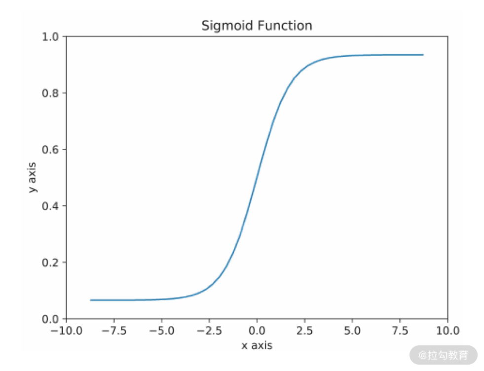 我们可以看出，Sigmoid 函数可以将任意一个实数 x，单调地映射到 0 到 1 的区间内，这正好符合了“概率”的取值范围。

我们还可以用求导公式来看一下 Sigmoid 函数的一阶导数。 

#### 2.逻辑回归的损失函数

有了这些基本假设后，我们尝试根据偏差的计算方法，写出描述偏差的损失函数 L(_** w**_)。

我们刚刚提到过，逻辑回归预测结果的值域 y 为 (0,1)，代表的是样本属于类别 1 的概率。

- 具体而言，如果样本属于类别“1”的概率大于 0.5，则认为样本的预测类别为“1”；
- 如果样本属于类别“1”的概率小于 0.5，则认为样本的预测类别为“0”。

这里出现了这么多的概率，我们可以借鉴在《09 | 似然估计：如何利用 MLE 对参数进行估计？》中学的概率计算和极大似然估计的思想，尝试写出样本被正确预测的概率。 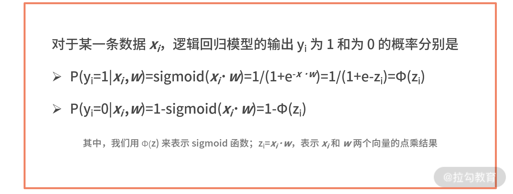 我们将上面两个等式合并，就可以得到某个数据\_**x**\_i 被正确预测的概率，即 P(yi|xi,w)=Φ(zi)yi·\[1-Φ(zi)\]1-yi。

- 如果真实结果 yi 为 1，则 P(yi|xi,w) = Φ(zi)，描述的是样本被预测为类别“1”的概率；
- 如果真实结果 yi 为 0，则 P(yi|xi,w) = 1-Φ(zi)，描述的是样本被预测为类别“0”的概率。

接下来可以将上式扩展到整个样本数据集中，则可采用极大似然估计得到 L(_**w**_)，即 

我们之前在《09 | 似然估计：如何利用 MLE 对参数进行估计？》学习极大似然估计 MLE 时，曾经提过一个常用的公式化简方法，那就是通过取对数，让连续乘积的大型运算变为连续求和，则有 

#### **3.求解最优的模型参数值 **AI 建模框架的最后一步，就是对损失函数求解最优的参数值，即\_** w**_\*= argmin l(_**w**_)。刚刚我们求得，损失函数为  可见，损失函数是个关于_**x**_i、yi 和 _**w**_ 的函数，而_**x**\_i 和 yi 是输入数据集中已知的条件，所以损失函数的未知数只有 _**w**_

于是可以得到结论，逻辑回归最后一步的建模公式，实质上就是求解函数极值的问题。

> 关于求极值，我们在《05 | 求极值：如何找到复杂业务的最优解？》曾详细介绍过求导法和梯度下降法。

在这里，由于损失函数包含了非线性的 sigmoid 函数，求导法是无法得到解析解的；因此，我们使用梯度下降法来求解参数\_**w**\_。 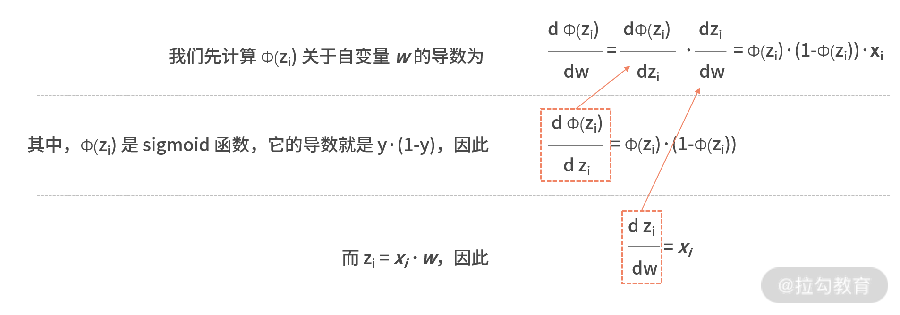 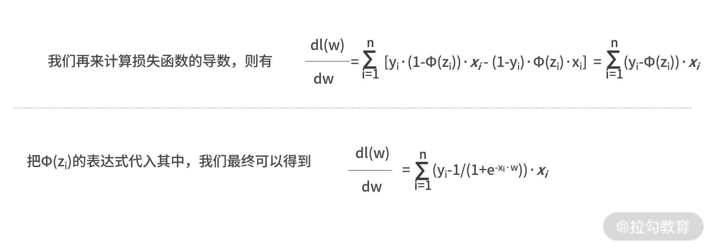 我们已经计算出了损失函数关于模型参数的导数，这也是损失函数的梯度方向，我们可以利用先前所学的梯度下降法来求解函数的极值。

然而，这里存在一个计算效率的缺陷，即梯度函数中包含了大型求和的运算。这里的大型求和是 i 从 1 到 n 的计算，也就是对于整个数据集全部的数据去进行的全量计算。

> 可以想象出，当输入的数据量非常大的时候，梯度下降法每次的迭代都会产生大量的计算。这样，建模过程中会消耗大量计算资源，模型更新效率也会受到很大影响。

#### 【随机梯度下降法】

为了解决这个问题，人工智能领域常常用 **随机梯度下降法** 来修正 **梯度下降法** 的不足。随机梯度下降法与梯度下降法的区别只有一点，那就是随机梯度下降在每轮更新参数时，只随机选取一个样本 dm 来计算梯度，而非计算整个数据集梯度。其余的计算过程，二者完全一致。

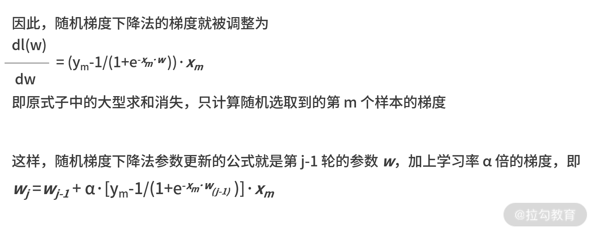

根据上面更新公式的算法，我们通过多轮迭代，就能最终求解出让 l(w) 取得最大值的参数向量\_**w**\_。

### 逻辑回归代码实现

接下来，我们在下面的数据集上，分别采用逻辑回归来建立分类模型。

第一个数据集如下，其中每一行是一个样本，每一列一个特征，最后一列是样本的类别。

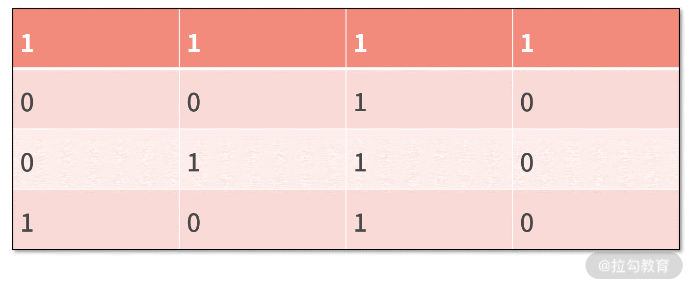

第二个数据集如下，格式与第一个数据集相同。

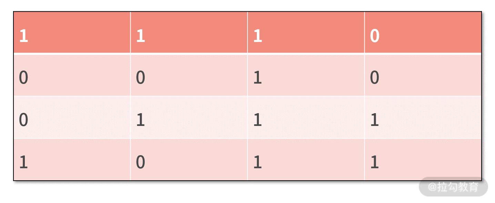

我们采用下面的代码，建立逻辑回归模型。

```
import math
import numpy as np
import random
x = np.array([[1,1,1],[0,0,1],[0,1,1],[1,0,1]])
y = np.array([1,0,0,0])
#y = np.array([0,0,1,1])
w = np.array([0.5,0.5,0.5])
a = 0.01
maxloop = 10000
for _ in range(maxloop):
 m = random.randint(0,3)
 fi = 1.0/(1+math.pow(math.e,-np.dot(x[m],w)))
 g = (y[m] - fi)*x[m]
 w = w + a*g
 print w
```

【我们对代码进行走读】

- 代码中，第 5～7 行分别输入数据集 x 和 y；
- 第 9 行，初始化参数向量，在这里，我们采用固定的初始化方法，你也可以调整为随机初始化；
- 第 11 行，设置学习率为 0.01；
- 第 12 行，设置最大迭代轮数为 10000 次。

接下来进入随机梯度下降法的循环体。

- 第 14 行，从 0 到 3 中随机抽取一个数字作为本轮迭代梯度的样本；
- 第 15 行，计算 Φ(zm)；
- 第 16 行，计算样本 m 带来的梯度 g；
- 第 17 行，利用随机梯度下降法更新参数 w；
- 第 18 行，打印这一轮的结果。

#### 【数据集一】

运行上述代码，我们对数据集一建模得到的最优参数为 \[3.1,3.0,-4.8\]。利用这组参数，我们可以对数据集一的学习效果进行测试，如下表所示

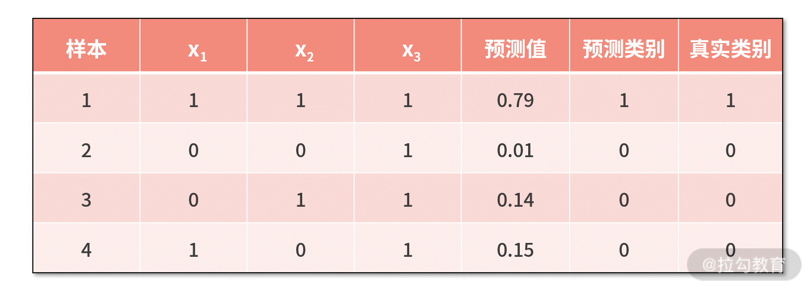

可见，数据集一上，我们的模型全部正确预测，效果非常好。

#### 【数据集二】

再运行上述代码，我们对数据集二建模得到的最优参数为 \[0.16, 0.10, -0.03\]。利用这组参数，我们可以对数据集二的学习效果进行测试，如下表所示。 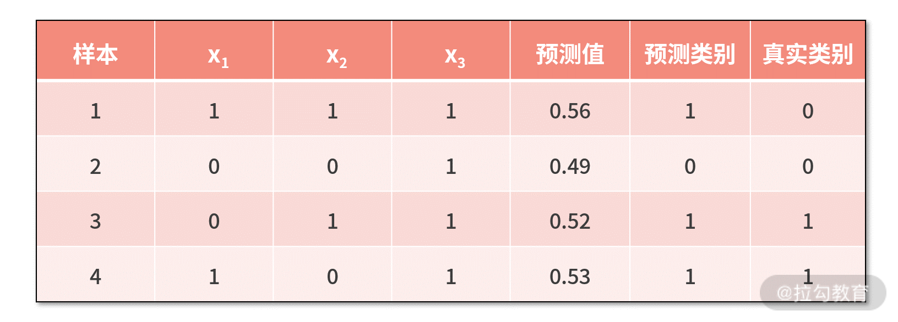 我们发现，在数据集二上，模型的预测结果只能是马马虎虎，这体现在两点：

- 4 个样本中，并没有全部正确预测，样本 1 预测错误；
- 对于正确预测的 3 个样本而言，预测值都在边界线 0.5 附近，就算是正确预测，也没有压倒性优势。

那么为什么同样的模型，只是换了数据集，效果就千差万别呢？

### 逻辑回归的不足

这是因为，逻辑回归是个线性模型，它只能处理线性问题。

例如，对于一个二维平面来说，线性模型就是一条直线。如果数据的分布不支持用一条线来分割的话，逻辑回归就无法收敛，如下图所示。 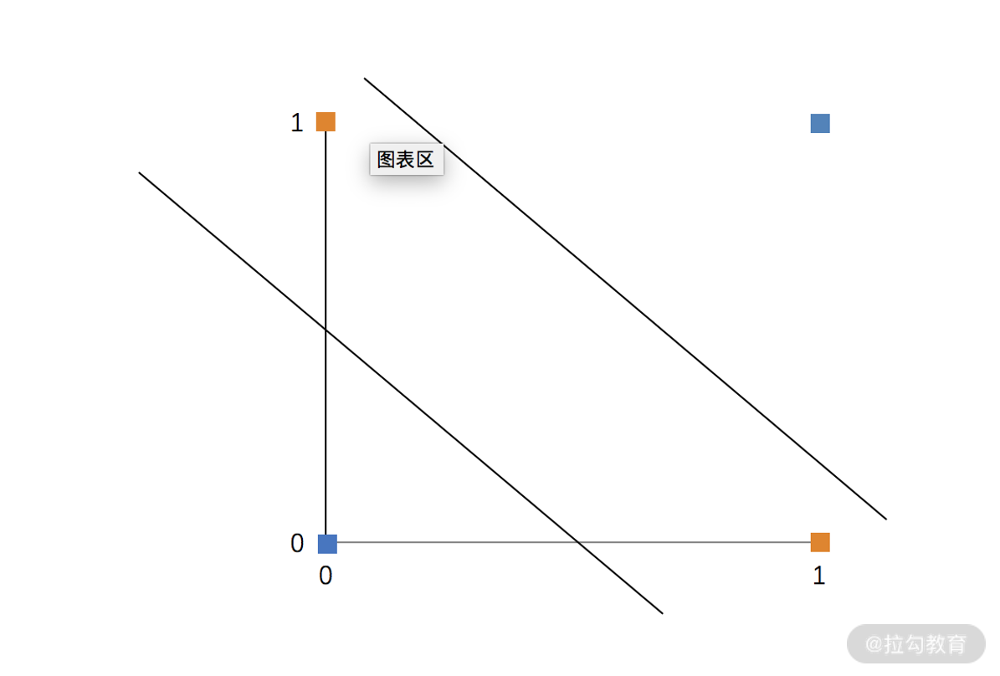 图中蓝色点是一类，黄色点是一类。现在，我们要用逻辑回归这样的线性模型来进行区分。可见，不论这条线怎么选，都是无法将两类样本进行分割的，这也是逻辑回归模型的缺陷。

> 要想解决的话，只有用更复杂的模型，例如我们后续的课时中会介绍的决策树、神经网络等模型。

#### 【逻辑回归与线性回归】

在上一讲《18 | AI 入门：利用 3 个公式搭建最简 AI 框架》中，通过“身高预测”，我们从人工智能模型的视角，重新认识了线性回归，那么逻辑回归和线性回归的不同有哪些呢？

- **从名字上比较**

线性回归是回归模型，是用一根“线”去回归出输入和输出之间的关系，即用一根线去尽可能把全部样本“串”起来。

而逻辑回归虽然名字里有“回归”二字，但其实是一个分类模型，它是希望用一根线去把两波样本尽可能分开。

- **从表达式上看**

逻辑回归是在线性回归的基础上加了一个 Sigmoid 函数的映射，在最终的类别判断上，还需要对比一下预测值和 0.5 之间的大小关系。

因此，线性回归解决的是回归问题，输出的连续值；而逻辑回归解决的是二分类问题，输出的是“0”或“1”的离散值。

- **从机理上看**逻辑回归增加了 sigmoid 函数，可以让预测结果在 0.5 附近产生更大的变化率，变化率更大，意味着梯度更大。

在使用梯度下降法的时候，这样的机理，让模型的预测值会倾向于离开变化率大的地方，而收敛在“0”或“1”附近。这样的模型机理，会让它更适合用于分类问题的建模，具有更好的鲁棒性。

### 小结**逻辑回归**是人工智能领域中分类问题的入门级算法。利用 AI 基本框架来看，它的 3 个核心公式分别是 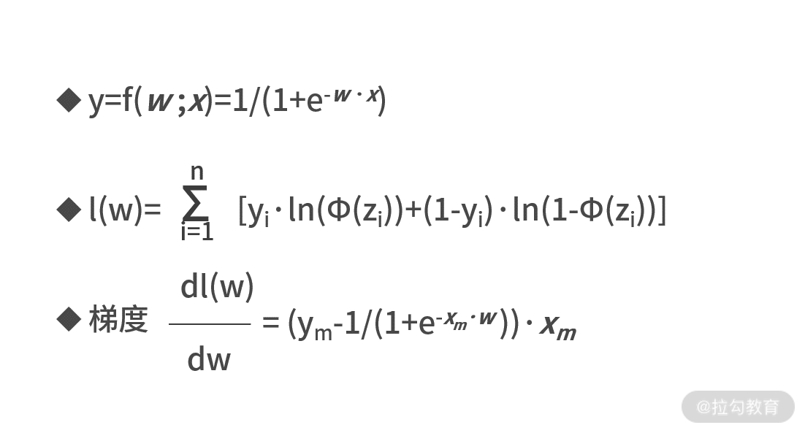 逻辑回归是个线性模型，具有计算简单、可解释性强等优势。它的不足是，只能处理线性问题，对于非线性问题则束手无策

最后，我们留一个思考题。试着把本课时中的代码，由随机梯度下降法改写为梯度下降法，再来求解一次参数 _** w**_ 吧。原则上除了计算量会变大以外，对分类结果是不会产生改变的。不妨亲自试一下。
