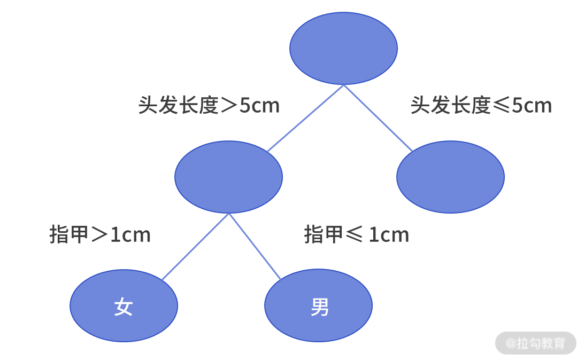
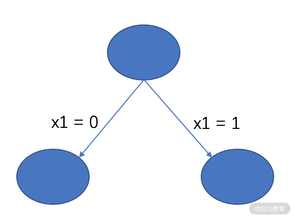
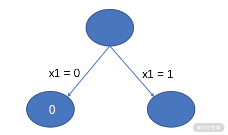
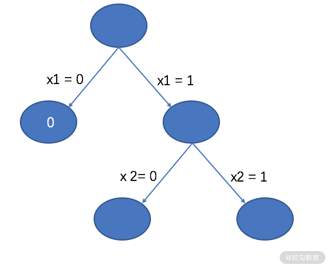
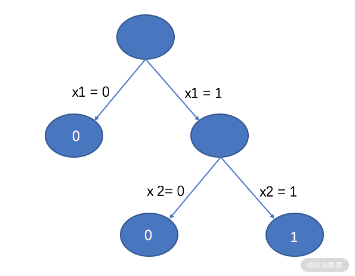
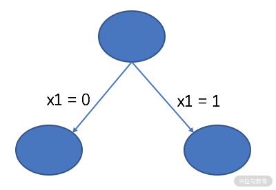
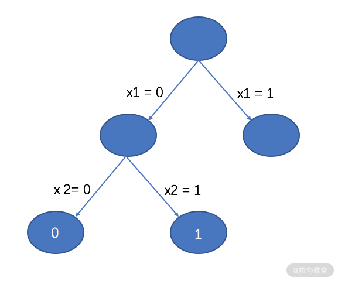
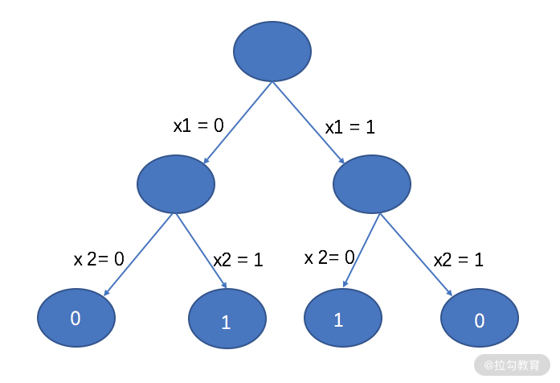

20 决策树：如何对 NP 难复杂问题进行启发式求解？
===========================

这一讲，我们学习决策树模型。决策树模型既可以解决分类问题，也可以解决回归问题，经典的决策树算法有 ID3、C4.5，以及 CART 算法。

当今主流的人工智能模型都是基于决策树的模型，例如更复杂的梯度提升决策树、随机森林等等。这些模型有着更加复杂、深厚的数学机理，但本质上还是决策树的思想。

### 决策树及其基本结构

决策树算法采用树形结构，使用层层推理来实现最终的分类。与逻辑回归不同，决策树模型很难用一个函数来描述输入向量_**x**_和预测类别 y 之间的关系。但是，如果利用一个如下图的树形状图形，就能很轻松描述清楚。



决策树

我们可以发现决策树有以下特点。

决策树由结点和边组成。最上边的结点称作 **根结点** ，最下边的结点称作 **叶子结点** 。除了叶子结点外，每个结点都根据某个变量及其分界阈值，决定了是向左走或向右走。每个叶子结点代表了某个分类的结果。

* 当使用决策树模型去预测某个样本的归属类别时，需要将这个样本从根结点输入；
* 接着就要“按图索骥”，根据决策树中的规则，一步步找到向左走或向右走的路径；
* 直到最终，最终到达了某个叶子结点中，并用该叶子结点的类别表示预测结果。

例如，大迷糊的头发长度为 6 厘米、指甲长度为 0.1 厘米，我们要预测大迷糊的性别。从根结点出发，因为大迷糊的头发长度大于 5 厘米，则向左走；又因为大迷糊的指甲长度小于 1 厘米，则向右走。最终抵达叶子结点为男性，这就是预测的结果。

### 决策树建模的挑战

我们曾说过，利用人工智能建模就是建立假设，再去找到假设条件下的最优化参数。对于决策树而言，它的假设就是输入向量_**x**_和输出类别 y 之间是一棵树的条件判断关系。

这样来看，决策树模型的参数就是每个结点的分裂变量和分裂变量的阈值。决策树建模，就是要找到最优的模型参数，让预测结果尽可能更准。然而，在使用决策树建模时想最优的模型参数是个 NP 难的问题。

NP 难问题，指最优参数无法在多项式时间内被计算出来，这很像我们先前所说的指数爆炸。NP 难问题是数学界的一类经典问题，我们这里进行简单介绍。

例如，旅行商问题（Travel Saleman Problem or TSP）就是个典型的 NP 难问题。旅行商问题，是指一个旅行商需要从 A 城市出发，经过 B 城市、C 城市、D 城市等 n 个城市后， 最后返回 A 城市，已知任意两个城市之间的路费 xij。

问：这个旅行商以怎样的城市顺序安排旅行，能让自己的路费最少。

这个旅行商问题显然就是一个 NP 难问题，这体现在两个方面。

* 第一，任意给出一个行程安排，例如 A->B->D->C->A，都可以很容易算出旅行路线的总费用；
* 第二，但是要想找到费用最少的那条路线，最坏情况下，必须检查所有可能的路线，而这里可能的路线是 (n-1)! 个。

> 例如，3 个城市的路线有 A->B->C->A、A->C->B->A 两种可能，搜索空间决定了时间复杂度，显然复杂度是 O(n!)。这远大于多项式，例如 O(n)、O(n2)、O(n3) 的时间复杂度。

面对 NP 难问题，常规的解法是降低解的质量，去换取复杂度的降低。简而言之就是，从寻找 NP 难问题的全局最优解，转变为在多项式时间内寻找某个大差不差的次优解。通常，这类算法也被称为启发式的算法。

因此，在使用决策树建模时，绝大多数的决策树算法（如 ID3 和 C4.5）所采取的策略都是启发式算法（例如贪心算法）来对空间进行搜索。这样，决策树中的每个结点都是基于当前的局部最优选择进行构造。

### ID3 决策树的启发式建模

补充完了基本概念后，我们以 ID3 决策树为例，详细探讨一下决策树建模的过程。ID3 决策树的核心思想，是在当前结点，根据信息增益最大的那个特征变量，决定如何构成决策树。

> 我们在《10 | 信息熵：事件的不确定性如何计算？》曾经学过，利用熵、条件熵来描述事件的不确定性。进一步，可以得到信息增益，来量化某个条件对于事件不确定性降低的多少。

由此可见，ID3 决策树的思路非常简单，就是在所有能降低不确定性的变量中，找到那个降低程度最多的变量作为分裂变量。经过多次重复这个过程，就能得到一棵决策树了。

**【ID3 决策树建模步骤】**

* 计算出数据集的信息熵。
* 对于_**x**_向量的每一个维度：
    1. 以这个维度作为条件，计算条件熵；
    2. 根据数据集的信息熵和条件熵，计算信息增益。
* 找到信息增益最大的变量，作为当前的分裂变量，并根据这个分裂变量得到若干个子集。
* 对分类过后的每个子集，递归地执行 1～3 步，直到终止条件满足。

**【ID3 决策树常见的两个终止条件】**

* 如果结点中的全部的样本都属于同一类别，则算法停止，并输出类别标签。
* 若无法继续对当层节点进行划分（特征用完），将该节点内的最高频的类别标签输出。

#### 论述 ID3 建模的过程 案例 1

假设有以下数据集，每一行是一个样本，每一列一个特征变量，最后一列是样本的真实类别。试着去建立 ID3 决策树。  **1.首先，计算信息熵。**数据集中，类别为“1”的样本有 1 个，类别为“0”的样本有 3 个；这样，类别“1”出现的概率就是 1/4，类别“0”出现的概率就是 3/4。

根据公式可以知道，信息熵为 **2.接着，对每个变量，计算条件熵及其信息增益**

* 第一个变量

第一个变量，即数据集中的第一列。它包含了两个“1”和两个“0”，可见“1”和“0”的概率为1/2。其中在第一个变量为“1”的两个样本中，类别标签分别为“1”和“0”，则信息熵为  在第一个变量为“0”的两个样本中，类别标签都是“0”，则信息熵为 


* 第二个变量

同理，可以计算出第二个变量的信息增益为 

* 第三个变量

对于第三个变量，它的值都是 1，也就是说第三个变量出现 1 的概率是 100%。 

也就是没有信息增益，等同于是个废话。从数据中也能看出，第三个变量的值对于所有数据样本而言都是一样的，可见它是没有任何区分度的。

**3.变量分裂与决策树**基于这个过程，我们选取出信息增益最大的变量为第一个变量，标记为 x1（但若信息增益都一样，随机选择一个就可以了）。根据 x1 以及 x1 可能的取值，可以把决策树暂时建立如下图所示。



根据当前的决策树，可以把原数据集切分为两个子集，分别是 D1 和 D2。**X**1\*\*= 0 时，子数据集是 D\*\*1

 在 D1 中，所有样本的类别标签都是“0”，满足了决策树建模的终止条件，则直接输出类别标签“0”，决策树更新为



**X**1\*\*= 1 时，子数据集是 D\*\*2


对于 D2 而言，还需要重复计算熵和信息增益。在D2中，类别“1”和类别“0”各有一个样本，即出现的概率都是 1/2，因此熵为 

* 而对于三个变量而言，第一个变量和第三个变量的信息增益都是零。这是因为，两个样本在第一个变量和第三个变量的值是相等的，没有任何信息量；
* 对于第二个变量而言，条件熵为 H(y|x2) = (1/2)×0 + (1/2)×0 = 0，信息增益为 g(x2,y) = H(p) - H(y|x2) = 1。

因此，应该采用第二个变量进行分裂，则有下面的决策树



基于这个决策树，如果 x2 为 0，则得到子集 D3；如果 x2 为 1，则得到子集 D4。

* 同时，在 D3 中，只剩下 \[1,0,1,0\] 这条样本，直接输出类别标签“0”；
* 在 D4 中，只剩下 \[1,1,1,1\] 这条样本，直接输出类别标签“1”。

二者都满足了停止条件，这样决策树就建立完成了，结果如下：



#### 论述 ID3 建模的过程 案例 2

我们再看一个数据集，如下所示，这也是上一讲中，逻辑回归没有建立出模型的非线性问题的数据集。

> 其中每一行是一个样本，每一列一个变量，最后一列是样本的类别标签。

 我们还是可以根据 ID3 决策树的流程来建立模型。

**1.首先，计算信息熵**我们发现在数据集中，类别为“1”的样本有两个，类别为“0”的样本也有两个；这样，他们二者出现的概率就都是 1/2。

**2.接着，对每个变量计算条件熵和信息增益**对于第一个变量 x1 的值有 1 和 0 两个可能性，出现的概率都是 2/4。

**3.变量分裂与决策树**当信息增益完全一致的时候，我们随机选择一个作为分裂变量。假设选 x1，则根据 x1 的不同，可以得到下面的决策树。



根据当前的决策树，可以将数据集分割为 D1 和 D2 两部分，并建立决策树。**X1 为 0 时，子数据集为 D1**


* 不难发现，在 D1 中，第一个变量 x1 和第三个变量 x3 的信息增益都是 0；


可见，需要用 x2 对 D1 进行拆分，这样就得到了下面的决策树。



**x **1** 为 1 时，子数据集是 D**2


对于 D2 子集，也用同样的方法，我们直接给出建树的结果如下：



所剩特征为 0，分裂结束。

#### ID3 决策树的代码实现

对于这种像 ID3 这种成型的算法而言，已经有很多被封装好的工具包（如 sklearn）可以直接调用，并不需要自己来自主开发。

如果自己来写底层建模的代码，可能需要上百行的代码量。为了给大家展示最核心的部分，我们给出建立 ID3 决策树的伪代码。

```
def createTree(x, y):


 if 终止条件满足:


  return labels[0]


 hp = getHp(y)


 xStar = getBestSplitVar(x,y)


 model.save(xStar)


 xSubList = getSubset(xStar,x)


 ySubList = getSubset(xStar,y)


 for i in len(xSubList):


  createTree(xSubList[i],ySubList[i])


 return model

```

【我们对代码进行走读】

从开发的角度来看，决策树采用了一种递归式的建模，可见函数主体一定是一个递归结构。这个递归的终止条件，就是 ID3 建树的终止条件。

* 第 3 行，我们在伪代码中，只提及了所有样本一致的情况篇；另一种情况比较少见，可以先不处理。
* 第 4 行，我们需要开发个函数 getHp() 来计算当前数据集的熵，计算熵只跟类别标签 y 向量有关。
* 第 5 行，我们需要对所有的变量计算条件熵，并比较出谁产生的信息增益最大。此时我们需要开发 getBestSplitVar() 的函数，它同时依赖 x 向量和 y 向量的输入。
* 在得到了最优的分裂变量后，我们就完成了一次迭代，可以在第 6 行把它保存在模型中了。
* 第 7 行和第 8 行，是基于现有模型，对数据集进行的切分。此时还需要开发一个函数 getSubset()，需要实现的功能是在数据集中基于 xStar 对数据集进行分割，并返回所有子集的 list。
* 最后，第 9～10 行，对于每个子集，递归地调用建树的函数 createTree()，再次重复上面的过程。

ID3 决策树建树的代码开发，就是一个递归结构的开发。虽然实际的开发中需要开发多个函数，代码量也是很多的，但从原理来看还是非常简单的。

### 决策树模型的优势和不足

#### 1.优势

从上述结果可以看出，决策树最大的优势，是在原本逻辑回归无法做出准确分类的数据集上，决策树 **可以做出正确分类** 。

* 这是因为，逻辑回归方法得到的决策边界总是线性的，它是个只能处理线性问题的线性模型；
* 而决策树是按照层次结构的规则生成的，它可以通过增加决策树的层次来模拟更复杂的分类边界，可以用来解决更复杂的非线性问题。

同时，在模型的可解释性上，决策树明确给出了预测的依据。要解释决策树如何预测非常简单，从根结点开始，依照所有的特征开始分支，一直到到达叶子节点，找到最终的预测。决策树可以很好地捕捉特征之间的互动和依赖，树形结构也可以很好地可视化。

#### 2.不足

ID3 决策树，或者说绝大多数的决策树都不是最优的树结构。这主要是因为建树本来就是个 NP 难问题，导致我们的算法只能采用一些启发式的贪心算法。从一开始，建树的目标就不是去寻找最优解。

### 小结

决策树模型是 **浅层模型** 中最优秀、最普适的一类模型。很多提升方法也都是基于决策树演变而来的。

在这里我们提到了一个浅层模型的概念，这主要是与深度学习进行的比较。我们知道这几年由于神经网络的兴起，深度学习的概念一下子称为 AI 领域的研究热点。

原本，学者们并没有浅层模型的概念。因为深度学习兴起后，产生了很多层次复杂、结构很深的模型；那么与之对应的经典模型，就被人们统称为浅层模型了。

然而经过人们的验证会发现，浅层模型中的佼佼者仍然是 **树模型** 。而深层模型通过增加了模型的复杂度，换取了更好的效果。关于深层模型，我们会在下一讲《21 | 神经网络与深度学习：计算机是如何理解图像、文本和语音的？》中进行讨论。

最后，我们留一个练习题。对于下面的数据集，试着用 ID3 算法建立决策树。


