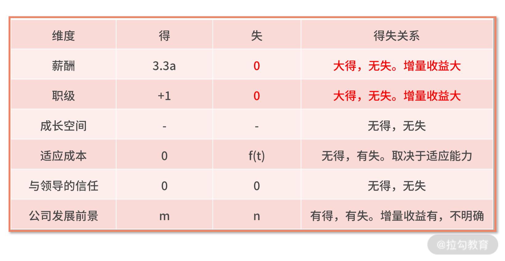

# 23 站在生活的十字路口，如何用数学抉择？

人的一生需要面临很多重大的选择和决策，举例而言：

- 大漂亮毕业一年后遇到了一个小伙靠谱哥；面对靠谱哥的追求，大漂亮是应该接受还是拒绝？
- 大迷糊工作 3 年，猎头推荐给他一个不错的工作机会，面对年薪 30% 的涨幅，大迷糊是接受 offer 还是拒绝 offer？

除了这些重大决策以外，我们生活中也需要做一些小的决策。

- 例如，点外卖时遇到满 30 元减 8 元，是强迫自己多消费到 30 元，还是只买自己所需的物品？
- 打德州扑克的时候，面对对手的加注，是跟注还是弃牌？

其实，当你面对这些选择时，完全可以利用数学知识来做出更合理的决策。这一讲的彩蛋，我们就围绕其中的几个场景，试着从数学的角度来进行解析。

### 放弃还是继续，如何选择最优？

人生充满了不确定性。在面临不确定性的时候，我们经常会面临下面的选择：是珍惜眼前，还是寄希望于未来？

举个例子，大漂亮是个各方面条件都很不错的女孩子。工作之后，她遇到一个男生靠谱哥，靠谱哥身上有优点，也有缺点，但综合来看，确实是个靠谱的年轻人。

那么，大漂亮是应该放弃靠谱哥，期待以后能遇到更优秀的男生；还是珍惜眼前，接受聪明哥的爱意，继续这段姻缘呢？

这就是一个在不确定性环境中，需要做出最优决策的问题。在这里，大漂亮面对的不确定性环境是，拒绝靠谱哥后还能不能遇到更优秀的男生。

人生的魅力就在于未来，而未来的特点就是不确定，人生中诸如此类的选择还有很多。而我们的数学家们，对这一类问题进行了抽象，总结出了经典的最优停止问题。

#### 【最优停止问题】

最优停止问题有很多中描述方式，我们以“聘请秘书”为例来描述。

假设大聪明要聘请一名秘书，现在有 n 人来面试，其中 n 是已知的，每个候选人的能力有量化的得分。现在，这些候选人被按照随机的顺序进行面试，大聪明每次只能面试一个候选人，查看该候选人的能力得分，并需要立即决定是否聘用该候选人。

如果决定不聘用该候选人，这个候选人便不会再回来；如果决定聘用该候选人，后续的候选人就没有面试的机会了。

**问：大聪明用怎样的策略，才能让他有更高的概率选到能力得分最高的候选人？**

顾名思义，最优停止问题，就是面对一个又一个的输入样本，去选择一个最好的停止时刻。它有以下几个特点。

- 第一，候选人只能一个接一个地面试，不能同时参加面试；
- 第二，面试官大聪明能且只能选择聘用 1 个候选人；
- 第三，面试当场，大聪明就需要做出聘用与否的决策，不能“骑驴找马”地选择待定。

接下来，我们就来通过数学的方式去计算出最优的策略。

其实，最优停止问题的答案很简单；有时候，也被人简称为“三七法则”。具体而言，是对前 m 个候选人，不论多么优秀，都拒绝聘用。接着，从第 m+1 个人开始，如果遇到了一个比先前所有面试者都优秀的候选人，那么就聘请这个人。


流程上如上图所示，而之所以被称为“三七法则”，是因为当 m/n 等于 37% 时，选到能力得分最高的候选人的概率是最大的，而且这个选中最优候选人的最大的概率也恰好是 0.37。

#### 【代码实现】

我们先试着用代码仿真一下上面的结论。我们假设候选人的人数 n 为 100，每个候选人都有一个能力得分，取值为 0 到 1 之间的小数，则代码如下：

```
import random


import numpy as np


t = 0


f = 0


for i in range(1000):


    a = np.random.random((100,1))


    all_max = max(a)


    get = 0


    m_max = max(a[0:37])


    for k in range(37,100):


        if a[k] > m_max:


            get = a[k]


            break


    if get == all_max:


        t += 1


    else:


        f += 1


print "true: " + str(t)


print "false: " + str(f)


print "percentage: " + str(100.0*t/(t+f))

```

我们对代码进行走读：

- 第 4 行和第 5 行，分别定义两个变量，用来存放找到最优候选人的次数和没有找到最优候选人的次数；
- 第 6 行开始，执行一个 1000 次的循环；
- 在每次的循环中，第 7 行，调用随机函数生成一个 100 维的数组 a，数组 a 中的每个元素，都是 0 到 1 之间的小数，代表候选人的能力得分；
- 第 8 行，调用 max 函数，保存好数组 a 中的最大值，也就是能力最高的候选人的能力得分；
- 第 9 行，定义 get 变量，用来保存用“三七法则”找到的候选人的能力得分；
- 第 10 行，再调用 max 函数，计算出前 37% 的候选人的能力最大值；
- 第 11 行开始，对 a 数组的 37% 位置之后的元素，开始执行 for 循环；
- 第 12 行，判断循环过程中的元素，是否比前 37% 个元素的最大值还要大；
- 如果是，则执行第 13 行，找到“三七法则”的输出结果，并跳出循环；
- 接着，第 15 行，判断“三七法则”找到的最大值，和a数组全局视角的最大值是否相等；
- 如果是，则第 16 行的 t 变量加 1；
- 否则，则第 18 行的 f 变量加 1；
- 最后，第 19～21 行，打印 1000 次循环的结果。

我们运行代码的结果如下图所示。在 1000 次的试验中，采用“三七法则”找到最大值的次数有 376 次，没有找到最大值有 624 次。综合来看，找到最大值的概率是 37.6%，这远比我们随机去猜（100 个样本选最优，1% 的选中概率）要好得多。


这里我们通过代码仿真，已经模拟并验证了“三七法则”这一结论；而关于“三七法则”的数学推导，则需要用到调和级数等高等数学的知识，感兴趣的同学可以自己去查阅一些资料来补充学习。

#### 【婚恋中的“三七法则”】

在这里，我们给出一些基于“三七法则”的实战建议。老话说，“枪打出头鸟”“万事开头难”，这些话在“三七法则”面前还是有一定道理的。

如果最优秀的候选人出现在了前 37% 个样本中，那么无论如何他都是不会被选中的；反过来，躲在最后也不是最好的选择。这是因为，如果最优秀的候选人躲在最后才去参加竞争，很可能被第二优秀或者第三优秀的人，捷足先登抢到了机会。

我们回到最开始大漂亮和靠谱哥的故事中，试着用“三七法则”给大漂亮一些建议。我们假设女孩子会在 18～30 岁结婚。那么，这个年龄段的前 37% 的时间内，不论遇到谁、不论他多么优秀，大漂亮都不应该去考虑结婚。

而此阶段的终止年龄是 18+(30-18)×0.37=22.44 岁，也就是大漂亮到了 22.44 岁后，如果她遇到了一个比先前所有遇到的人都优秀的男孩子，那么她应该去考虑与这个男孩子相处并结婚。所以，决定大漂亮是否要接受靠谱哥有两个条件，分别是：

- 大漂亮的年龄是否到达了 22.44 岁；
- 靠谱哥是否比大漂亮之前遇到过的人都优秀。

在《王牌对王牌》的一期节目中，韩雪喊出的青春告白，就是“三七法则”的道理。虽然她的表述不完全正确，但她还是准确地提到了 22.44 岁。看来，这背后定有数学高人在指导韩雪和节目组啊。

当然啦，你可能认为人在大学四年的时期都过于幼稚迷茫，并不是好的择偶期，那你可以将时间定义为 22～30 岁，那么对应的 37% 就是 25 岁，也刚好是毕业三年后，职场新人蜕变的时期，希望你可以在这时事业、爱情双丰收。

又聊回了“职场话题”，我们看看大漂亮的学长“大迷糊”的职业发展情况吧。

### 涨薪 30%，跳槽吗？

很多人，尤其是那些不愁 offer 的优秀的人，常常会纠结要不要跳槽。其实，这也可以用数学去进行一些计算，来辅助做出一些决策的。

我们先把所有可能影响跳槽的因素列出来。在这里，我大致总结出以下几个关键因素：薪酬、职级、个人能力成长空间、适应成本、与领导的信任关系、公司发展前景。接着，我们需要对比出新旧两份工作在这些因素上的得失。如果总得比总失多，就可以考虑跳槽；如果总得比总失少，得不偿失，就不应该跳槽。

下面给你一个关于跳槽涨薪的案例。大迷糊是一线互联网公司的工程师，他的薪酬在所在职级中是中等偏上的水平。由于多年的刻苦努力工作，大迷糊在公司中与领导的信任关系很好。下半年，因为公司高管调整，大迷糊的主管被调整到其他部门。随之而来的，是一个毫不认识的新主管。

在同年 11 月，大迷糊拿到了另一个超一线互联网公司的工程师 offer，获得了 30% 的薪酬涨幅，职级也相应提高了一级。对方要求大迷糊在 11 月内做出决策，是否接受 offer 并入职。

#### 【现在是否应该跳槽？】

我们来帮大迷糊计算一下得失吧，以“新 offer”代表新机会，以“旧公司”代表当前的公司。

- **首先，算一下薪酬**

在 11 月内跳槽，意味着失去了旧公司当年的年终奖，这是“失”。我们假设年终奖是 3 个月，大迷糊在旧公司的月薪是 a 元，那么总“失”为 L=3a；

新的 offer 年薪上有 30% 的涨幅，但 11 月入职的员工，却不会被新公司普调覆盖，而旧公司的普调平均值是 8%。那么大迷糊未来一年内的总“得”，为 G=(30%-8%)a×(12+3)=3.3a。

这样，总“得”和总“失”的差值为 G-L=0.3a>0。

- **其次，再计算一下职级**

新的 offer 涨了一级，这是“得”；然而，旧公司次年也有晋升机会，大迷糊是骨干，我们假设大他在旧公司的晋升概率为 0.7，这显然就是潜在的“失”。

那么在职级这里的总“得”和总“失”的差值，为 G-L=1-0.7×1=0.3级 > 0

- **接着，个人能力成长空间**

我们假设这一项是差不多的，毕竟在一线互联网公司中，工程师还是比较吃香的。

- **下一个，适应成本**

大迷糊是旧公司的老员工，对于公司的制度文化、工作环境、同事相处，都必然会更适应，这里没有“得”，因为不跳槽并不会让自己的适应性增强。

然而，到了新公司后，新的工作环境、全新的同事、新公司的文化氛围，都是需要一定的时间来适应。这样看，适应成本就由适应期时间长短决定了。

因为适应期必然大于零，所以这里一定会有“失”，即 G-L\<0。

- **再下一个，与领导的信任关系**

很多人会说，旧公司因为高管调整，空降了一个新的主管。这对阿强来说并不是个好消息。然而问题就在于，跳槽也是无法解决这个矛盾的。大迷糊去了一个新的公司，仍然要与一个不认识的领导，要去重新相处，去建立新的信任关系。

所以说，在这个维度上，没有“得”，也没有“失”，即 G-L=0。

- **最后，公司发展前景**

大迷糊由一线公司，跳槽到超一线公司，公司前景必然是更广阔了。然而，公司的前景和个人的回报之间，很难有明确、量化的兑换关系，这里的得和失很难被计算了。

明确的是，得大于失，G-L>0。

好了，我们把以上所有的因素总结在下面的表格里，来帮助大迷糊做最后的抉择。

|  根据这个表格，我们能发现，任何一个维度都不支持大迷糊做出跳槽的动作。所以，大迷糊更好的选择是，拒绝 offer，继续在旧公司工作。

#### 【跳槽合适的时机？】

那么，什么时候大迷糊才能跳槽呢？我们把上面的环境稍稍改动就会得到不一样的结果。假设，新 offer 的时间并不是 11 月，而是次年的 4 月份，此时改变的因素有二：

- 第一，大迷糊已经收到了年终奖，或者旧公司经营惨淡，年终奖几乎为 0；
- 第二，大迷糊已经参加了旧公司的晋升，并且晋升失败。

那么上面的表格就要做出下面红色部分的修正。在薪酬和职级上，原本的损失都没了。得失关系，也由原来的“大得大失”变成了“大得无失”。此时的环境，就足够支撑大迷糊去做出跳槽的抉择了。



最后，我们为跳槽的决策做一些实战性总结。跳槽时，一定要算清楚、想明白“得”和“失”。在考虑跳槽时机的时候，一定要尽量让结果是增加自己的“得”，降低自己的“失”，充分考虑清楚，千万不能因为一时冲动而做出“小得大失”的决定。那样，最终吃亏的还是自己。

另外，在薪酬和职级这两个维度上，通常在上半年的 3～4 月是“失”最小的时间。这是因为，你已经拿到了上一年的年终奖，且绝大多数的互联网公司的晋升和普调都是在这个时间点上。这样，不管是钱还是级，你的损失都已经降到了最低。这也是找工作中常说的“金三银四”背后的道理。

当然了，如果你决定跳槽，也一定要在拉勾网这样的大平台上去多多寻找机会。大平台有更多一线以上公司的招聘机会，所以你在公司发展前景这个维度上，会有更多收益。

### 小结

人生的魅力来自未来的不确定性。也是因此，人们常常需要在不确定性的环境中，做出选择。在做抉择时，一个通用的思路是计算得失。你所有的决策依据，都应该是尽可能降低自己的“失”，而谋求更多的“得”。

与此同时，有了数学武器，不代表你能做出最完美的选择。这是因为，在人生的不确定性中，总有你计算之外的不确定因素。因此，在做抉择时，你还需要调整好心态，做到“不以物喜，不以己悲”。只要你计算的过程是正确的，就不需要因为一时的得失而气馁。

因为，只要你坚持这样的思考方式，长期统计看，收益一定是更可观的。相信无论哪个决定，只要你脚踏实地，深耕你的专业，热爱你的生活，你一定会有意外之喜。
