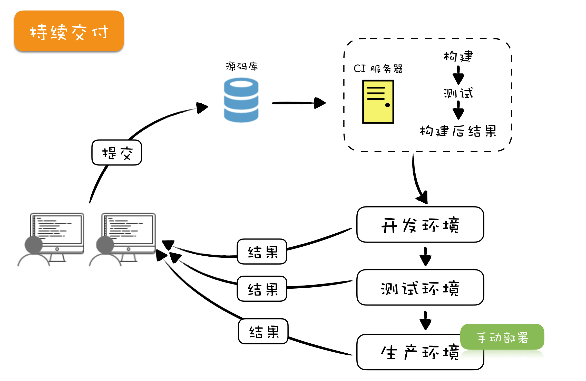

# 06 大厂都在用哪些敏捷方法？（上）

你好，我是宝玉，我今天分享的主题是：大厂都在用哪些敏捷方法？我将分为上下两篇，来与你一起讨论这个话题。

在我还是一个野路子程序员，到处接私活做网站时，就开始好奇：大厂都是怎么开发软件项目的？直到毕业后，我前前后后加入了若干大中小型企业，包括这些年在美国高校、公司的一些经历，对大厂的项目开发有了比较多的了解。

其实大厂做项目也没有什么特别的，无非就是工程中常见的“分而治之”的策略：**大项目拆成小项目，大服务拆成小服务，大团队拆成小团队。**

服务之间通过商定好的标准协议进行通信，架构上将大的服务拆分隔离成微服务，大团队按照业务或者服务拆分成小组，按照一定的流程规范保障协作。最终，各个小组要负责的内容其实就不多了。

就像淘宝这种网站，不需要一个庞大的项目组，通过逐级分拆，一个小组可能就只需要负责一个页面中的一个小模块。

所以，也要归功于现在微服务、容器等新技术，可以将复杂的业务逐级拆分，让很多公司能真正敏捷起来。

在上一篇文章中，我有提到，团队要实施敏捷，不仅要小，还要组织扁平化。相对来说，美国的互联网大企业做的还是很不错的，组织架构都很扁平，工程师地位很高。

这些年，国内工程师地位应该也有很大提升，组织也在向扁平化发展。前些天我也看到阿里工程师写的一篇文章[《敏捷开发的根本矛盾是什么？从业十余年的工程师在思考》](https://zhuanlan.zhihu.com/p/34024621)，对这个问题有精彩的论述。

下面，我就带你一起看看，大厂具体是怎么应用敏捷方法的。

## 和敏捷开发相关的主要流程规范

大厂里流程规范很多，最开始你会不喜欢它们，后来会离不开它们。

> 这些墙很有趣。刚入狱的时候，你痛恨周围的高墙；慢慢地，你习惯了生活在其中；最终你会发现自己不得不依靠它而生存。这就叫体制化。——《肖申克的救赎》

这里，我简单将其中和敏捷开发相关的流程介绍一下。

### 一切工作任务围绕 Ticket 开展

早些年的项目开发，都是围绕着项目计划开展的，把甘特图打印贴在墙上，方便团队成员看项目进展到什么地步了。自从敏捷化后，开始变成了看板。

所谓的看板，就是把白板分成几个栏，每一栏为一类，分别写着“To Do（待选取）”、“In Progress（进行中）”、“Done（完成）”等，再把工作任务变成一个个五颜六色的即时贴，根据状态贴在不同的栏下面。

慢慢的物理的看板变成了电子看板，通过各种项目管理软件来管理跟踪这些任务，即时贴也变成了 Ticket（也有叫 Issue 的）。逐渐的，所有与开发相关的任务也都和 Ticket 挂钩了：

- 报一个 Bug，提交一个 Ticket ；

- 提一条需求，提交一个 Ticket ；

- 要重构一下代码，提交一个 Ticket 。

看板这种基于 Ticket 来管理跟踪任务的方式，看起来繁琐，但确实是很高效的一种方式。

- 每一个任务的状态都可以被跟踪起来：什么时候开始做的，谁在做，做完没有。

- 整个团队在做什么一目了然。

- Ticket 和敏捷开发中的 Backlog（任务清单）正好结合起来，通过 Ticket 可以收集管理整个项目的 Backlog 和当前 Sprint（迭代）的 Backlog。

有了看板后，大家每天上班第一件事就是打开看板，看看当前 Sprint 还有哪些 Ticket 没有完成，哪些已经完成，哪些正在进行中，非常直观。

作为项目成员来说，做完手头的事情也不用去问项目经理该干什么事情了，直接从 To Do 栏选一条 Ticket 做就是了；对于项目经理，看看 To Do 栏还有多少没有被选取，就知道还剩多少 Ticket 没完成，看看 In Progress 栏就知道哪些 Ticket 正在进行中。

如果有 Ticket 在这一栏待太久或者这一栏 Ticket 太多，那可能就有风险了，就可以及时介入。

对于项目管理软件和 Ticket，我在后面章节中还会有进一步介绍。

### 基于 Git 和 CI 的开发流程

如果你的团队应用瀑布模型来开发，大概会有两大烦恼：**代码不稳定和部署太麻烦。**

早些年虽然也用源代码管理，但是大家都是在 master（主干）上开发的，所以 master 的代码特别不稳定，一不小心就可能被人签入了不稳定的代码。所以在上线前，有一段时间叫“代码冻结期”，意思就是这期间，除非是紧急修复，否则谁都不能往上面提交代码。

还有，测试环境的部署也是个老大难问题，尤其是在服务较多时，编译要注意各种依赖和环境的配置。所以更新测试环境是个大工程，以至于当年我在飞信的时候，专门有人负责部署测试环境。

上面的“代码冻结”和“专人部署”方案，可一点都不敏捷。所以团队想要敏捷起来，一定要解决代码不稳定和部署太麻烦这两个大问题。

好在基于 Git 的开发流程结合 CI 的自动测试部署，很完美的解决了这两大问题。

Git 本来只是源代码管理工具，但是其强大的分支管理和灵活的权限控制，结合一定的开发流程，却可以帮助你很好的控制代码质量。

我们假设现在 master 的代码是稳定的，那么怎么保证新加入的代码也稳定呢？

答案就是代码审查（Code Review）和自动化测试。如果代码有严格的审查，并且所有自动化测试代码都能测试通过，那么可以认为代码质量是可靠的。当然前提是自动化测试代码要有一定的覆盖比率。

关于这点，对于大厂来说倒不是什么问题，正规的项目组对于代码审查和自动测试代码的覆盖率都有严格的要求。现在还有一个问题，就是如何在合并到 master 之前把代码审查和自动化测试做好呢？

简单来说，就是每次要往 master 添加内容，不是直接提交代码到 master，而是先基于当前稳定的 master，克隆一个 branch（分支）出来，基于 branch 去开发，开发完成后提交一个 PR（Pull Request，合并请求）。

图片来源：VSCode项目PR

PR 提交后，就可以清楚的看出来代码做了哪些改动，其他人就可以针对每一行代码写评论提出修改意见。如果确认代码没问题了，就可以通过代码审查。

接下来还剩下自动化测试的问题。这时候该 CI （持续集成）出场了。

如果你不了解 CI 是什么，可以把它想象成一个机器人，每次你提交一个 PR（严格来说是 Commit，这里略作简化）到源代码服务器，这个机器人马上就知道了。

然后它创建一个干净的运行环境，把你提交的代码下载下来，再下载安装所有依赖项，然后运行你的所有测试代码，运行完后，把测试结果报告给你。测试结果直观的反馈在 PR 上，绿色表示通过，红色表示不通过。

图片来源：Video-React项目PR

关于 Git 和 CI，我在之后的文章中会展开讲解，这里只是为了展现敏捷开发方法的流程。另外，阮一峰老师写过两篇文章，[《Git 工作流程》](https://www.ruanyifeng.com/blog/2015/12/git-workflow.html),[《持续集成是什么？》](https://www.ruanyifeng.com/blog/2015/09/continuous-integration.html)，你也可以先行阅读了解。

至此，代码审查和自动测试的问题都解决了。当一个 PR 代码审查通过，以及 CI 通过了所有自动化测试，就可以合并到 master 了，而且我们也可以认为合并到 master 后的代码也是稳定的。

至于自动部署测试环境，反倒是简单，就是 CI 这个机器人，在你代码合并到 master 的时候，再次运行自动化测试代码，测试通过后直接运行自动部署的脚本，把 master 代码部署到开发环境或测试环境上。

在这里以一个开发任务为例，大致讲解一下应用敏捷开发方法的基本开发流程：

- 把要开发的 Ticket 从“To Do”栏移动到“In Progress”栏；

- 从主干（master）创建一个分支（branch），基于分支去开发功能或修复 Bug；

- 编写实现代码和测试代码（单元测试和集成测试），是不是测试驱动不重要，看个人偏好或团队要求；

- 持续提交代码更新到分支，直到完成；

- 创建 PR（Pull Request，合并请求），邀请其他人帮忙 Review 代码，根据 Review 的结果，可能还需要更新几次；

- CI 在每一次提交代码到代码库后都会自动运行，运行后主要做这些工作：

  - 检查代码格式是不是符合规范；
  - 运行单元测试代码；
  - 运行集成测试。

- 最终这些检查都完成后，CI 会把执行结果显示在 PR 上。通常绿色表示通过，红色表示失败；

- PR 能合并需要满足两个条件：CI 变绿 + 代码 Review 通过；

- PR 合并后，CI 会自动构建 Docker Image，将 Image 部署到开发环境；

- 将相应的 Ticket 从看板上的“In Progress”栏移动到“Done”栏。

图片来源：Jira

正常来讲，你是需要严格遵守开发流程的，但偶尔肯定也有紧急任务，来不及写测试代码，这种情况下，一定要再创建一条 Ticket 跟踪，以确保后续完成测试代码。

### 部署上线流程

最早的时候，程序员都是自己管服务器，但是由于这样过于随意，就会导致很多问题出现。

于是后来有专门的运维团队，将开发好的程序，编译好，数据生成脚本写好，然后写成部署文档，交给运维去手动部署。这个过程无比繁琐、无比慎重，通常几周才部署一次，遇上打补丁才隔几天部署。

这些年随着容器化、微服务、DevOps 这些技术或概念的兴起，部署已经变得越来越高效，大厂已经开始在部署流程上融合这些理念。

以前是运维人员按照文档部署，现在已经变成了 DevOps 写自动化部署工具，然后开发人员自己去部署生产环境。

现在大厂的部署也都实现了自动化，但是流程上还是有一些控制。

- 首先，部署的不再是程序代码，而是 Docker 的 Image，每次代码合并后 CI 都会自动生成新的 Image，测试也是基于 Image 测试。

- 部署生产环境之前，先在内部的测试环境充分测试。

- 部署生产环境前，需要审批确认，有 Ticket 跟踪。

- 部署时，先部署一部分，监测正常后再全量部署。

- 整个过程都有监控报警，出现问题及时回滚。

如果一切顺利的话，整个生产环境的服务部署过程通常几分钟就完成了，这在以前简直是不敢想象的事。

## 每日站立会议

在敏捷开发中，每日站会是非常有名的。在大厂，但凡实施敏捷开发的小组，上班第一件事，就是一起开一个站会，沟通一下项目的基本情况，这也导致会议室越发紧张起来。

虽然站立会议什么时间开都可以，但是早上无疑是最好的时机，一天工作的开始，开完会全身心去干活。

**是不是站着开会其实不重要，重点是要高效沟通反馈。**开会时间控制在半小时以内，半小时内不能完成的应该另外组织会议。

谁来主持站立会议呢？在敏捷的 Scrum 中，有一个角色叫 Scrum Master（敏捷教练、敏捷大师），主要任务就是保证各种敏捷流程的。

所以通常是由 Scrum Master 主持会议，也可以采用轮班制，每个星期换一名团队成员主持。负责主持会议的人，主要职责是组织会议，一个一个环节开展，控制好会议节奏。

开会都干什么呢？主要有三个话题：

1. **成员轮流发言**每个人轮流介绍一下，昨天干了什么事情，今天计划做什么事情，工作上有没有障碍无法推进。

一个成员的发言可能是这样的：“昨天我实现了用户登录模块的前端输入框，今天打算完成后端 API 调用，在实现后端的时候需要 API 组的支持，昨天发现他们文档有问题，不知道该找谁。”

要注意的是，这过程中很容易偏离主题，比如突然有人提了一句：“我们好久没团建了，是不是该出去玩玩了。”很可能大家都很 high 的讨论起来了，这时候会议主持者要及时打断，记录到“问题停车场”，让下一个人继续，先保证大家能高效完成这一环节。

> 问题停车场（Parking lot question），把需要进一步讨论的问题暂时放到这里，一会儿再讨论。

通过这样的形式，项目成员可以相互了解任务进展，有困难也可以互相支援，及时发现问题和风险。还有一个重要因素，就是每个人对于自己提出的目标，也会信守承诺，努力完成。

2.**检查最新的 Ticket**前面提到所有日常工作都是基于 Ticket 来开展的，这些 Ticket 可能是测试报出的 Bug，也可能是产品经理提交的需求，也可能是其他。

所以每天例会都需要检查一下新增的 Ticket，并且要甄别一下优先级，然后决定是放到当前 Sprint，还是放到 Backlog（任务清单）。

这个阶段同样要注意不能发散，不要针对 Ticket 的细节展开过多讨论，有需要讨论的同样可以先收集到“问题停车场”，会议组织者需要做好控制。

3.**停车场问题**

在这个环节，大家可以针对之前来不及讨论的问题进行讨论，能在会议时间内解决的问题，就马上解决，不能解决的会后再私下讨论或者再组织会议。

当然，大厂的流程规范还有很多，在这里我仅列出与敏捷相关的主要开发流程。

## 总结

我们知道，在敏捷开发中有很多概念，像 Backlog、持续交付、每日站会等，这些概念最终要变成实践的话，就必须要通过一定的流程规范来保障这些概念的实施。

这就是为什么很多公司写代码要求你写自动化测试代码，为什么要用一些像 Jira、禅道这样的项目管理软件来管理任务，为什么要每天开站立会议，为什么要有代码审查。这些都不过是为了保障敏捷的实施。

如果你在实施敏捷开发的项目工作，就可以多去观察平时工作中这些和敏捷有关的流程规范，再结合敏捷开发中的知识点，就能很好的帮助你理解敏捷开发，理解这些流程规范背后的理论依据。

如果你工作中不是用的敏捷开发，也可以参考本文中提到的一些实践，尝试着试用起来。

在下一篇里，我还会以一个具体的项目小组对敏捷的应用为例，继续给你讲讲大厂都在用的那些敏捷方法。
