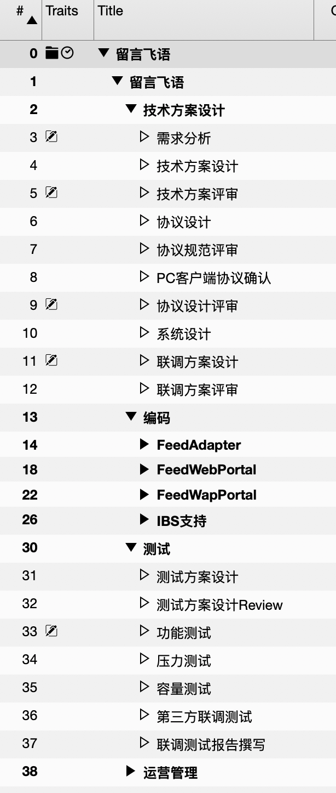
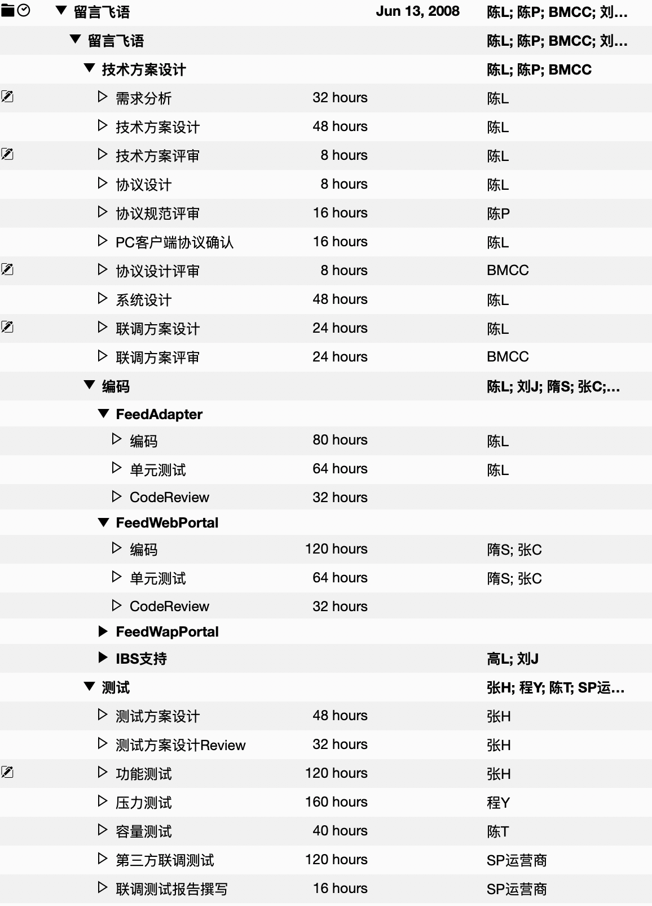
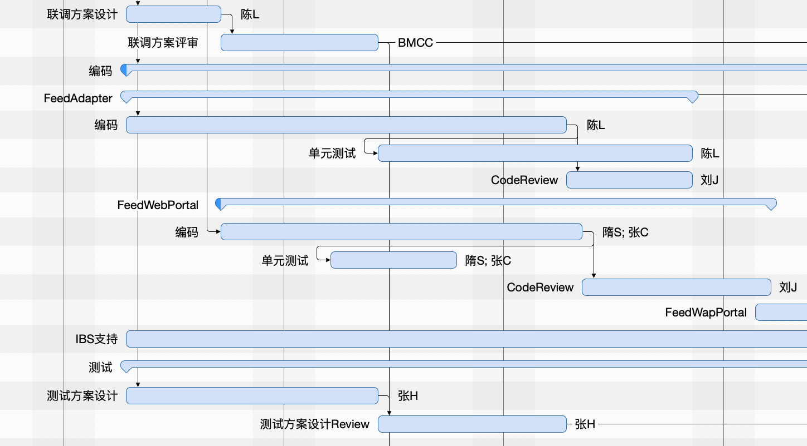

# 11 项目计划：代码未动，计划先行

你好，我是宝玉，我今天想与你聊一聊“项目计划”的问题。

若干年前，我接手一个陷入困境的项目，当时的项目经理刚从技术高手转型项目管理，还是没有摆脱技术思维，项目没有什么计划。

他把关键模块分给了自己开发，同时还要兼顾项目管理，导致自己的工作遇到瓶颈，其他人的进度也受影响，大家加班加点也没什么进展，士气低落。

我接手后，第一件事是重新制定项目计划，在排任务时，避免了对某个人的过度依赖，设置了几个关键里程碑。我还特地把第一个里程碑设置的相对容易一点，只需要运行核心功能。

这样大家重整旗鼓，很快就完成了第一个里程碑。达到第一个里程碑的目标后，团队成员很受鼓舞，士气很快就上来了，后面按照新的计划，并没有太多加班加点，就完成了一个个的里程碑，最后顺利完成项目。

你看，**如果没有计划，你的项目可能会陷入一种无序和混乱中。**计划，就像我们出行用的导航，你可以清楚地看到项目整体的安排，同时它还时刻提醒我们目标是什么，不要偏离方向。

执行计划的项目成员，就像使用导航的司机，可以知道什么时间做什么事情，保证任务得以执行。执行计划的过程，就像我们沿着导航前进，可以了解是不是项目过程中出现了偏差，及时的调整。

## 做技术的就不用关心计划吗？

很多程序员对计划有误解，也不愿意做计划，他们通常都会用一些原因来说做计划是没必要的。

一种典型观点是：“既然计划总是在变，干嘛还要做计划？还不如上手就是干来的爽快！”

这就好比我看过的一个段子：“既然飞机老是晚点，还要时间表干吗？”“没有时间表，你怎么知道飞机晚点了呢？” 计划也是这样，给你提供一个基准线，让你知道后面在执行的时候，是不是出现了偏差，可以根据计划不断地修正。

还有的人说，做计划那是项目经理的事，我是程序员，项目计划与我无关。

我在专栏中常说你要有大局观，不要将自己局限在程序员的身份中。试着做计划就是一个非常好的培养大局观的方式。比如说，你在制定计划的过程中，需要去综合考虑各种因素：有哪些任务要做，可能存在什么风险，任务之间的依赖关系是什么，等等。

参与做计划的过程，可以让你对项目的各种事情了然于胸，这就相当于扩大了你的上下文，让你有更高的视角看待当前工作遇到的问题。

另外，我还见过很多人抱怨项目经理制定的项目计划有问题，却很少看到会有人愿意主动参与制定项目计划。如果你不主动参与计划的制定，最终就只能按照项目经理制定的计划执行了。出现计划不合理的地方，你也只能接受，工作就会一直很被动。

当然，有时候你可能确实是没机会参与到当前的项目计划中。不过，万事皆项目，你一样要学会做计划，因为学会做计划，会对你工作生活的方方面面起到积极的作用。

比如很多人都有一些目标：要转型做管理、要移民、要写一个业余项目，然而很多目标都无疾而终了。**这是因为光有目标还不够的，必须得要付诸行动。而要行动，就需要对目标进行分解，进而变成可以执行的计划。**

## 如何制定计划？

如果有一天，你接手了一个项目，通常第一件事就是得去制定一个项目计划。那么怎么制定计划呢？

制定项目计划，通常有三个基本步骤：

- 第一步：任务分解；

- 第二步：估算时间；

- 第三步：排任务路径。

以前我在飞信时，有一个项目叫“留言飞语”，就是飞信用户可以在网站或者 PC 客户端，互相留言，当时我负责这个项目的服务端，正好我还留着当年制定的计划，虽然不算一个很好的计划，但好在它是一个真实项目的计划，正好可以用它来说明一下如何制定计划。

备注：图片较大，需要点击查看大图

你看到的这个计划其实不是第一版，可能也不是最后一版，因为制定计划本身是一个反复迭代的过程，尤其是一开始在需求并不够明确的时候，只能比较粗粒度的分解任务和估算，在项目推进的过程中再逐步细化和完善。

#### 第一步：任务分解

我们写程序的时候都有经验，就是要把复杂的问题拆分成简单的问题，大的模块拆成小的模块，在工程里面这个叫“分而治之”。做计划也是一样，第一步就是要对任务进行分解。

在项目管理中，对任务分解有个专业的词汇叫 WBS，它意思是工作分解结构（Work Breakdown Structure, WBS)。**就是把要做的事情，按照一个树形结构去组织，逐级分解，分割成小而具体的可交付结果，直到不能再拆分为止。**

下图就是“留言飞语”项目按照 WBS 拆分的结果。

可以看得出，整个过程是按照瀑布模型来划分的，大的阶段分成技术方案设计、编码和测试，然后每一个大的阶段下面再进一步细分。

例如技术方案设计下面再有需求分析、技术方案设计和评审等；而编码阶段则是按照功能模块再进一步拆分。拆分之后，都是小而具体、可交付结果的任务，且不能再进一步拆分。

这里需要注意的是，在制定计划时，除了要拆分任务，还需要反复思考各种可能存在的问题。

比如，这个项目不仅是网站可以访问，还需要在 PC 客户端能发留言，所以还需要考虑和 PC 客户端的通信协议、什么时间可以让 PC 客户端可以测试协议等。如果上手就写，没有良好的计划，就可能会忽略这些问题，最后导致 PC 客户端都不知道怎么去调用服务端接口，也不知道什么时候可以和客户端联调。

如果项目经理对技术细节不熟悉，可以邀请架构师或者技术负责人协助进行任务的分解。

#### 第二步：估算时间

任务分解完之后，你就需要对每一个任务估算时间。就像下面这样。

估算时间这事，有很多方法可以参考，主要还是得依靠以前的经验。要想估算准确，需要从两个方面入手：

- 任务拆分的越细致，想的越清楚，就能估算的越准确。

- 要让负责这个任务的人员参与估算。

举例来说，让你直接给出一个“留言飞语”这样项目的估算时间，是很难的，但对于某个具体功能模块的实现，就可以比较准确了。当把“留言飞语”这样大的项目拆分成足够小的任务时，你就可以很容易的对小的任务进行准确的估算，从而让整体的时间估算变得准确起来。

为什么要让开发人员参与估算呢？

我们来对比一下。假如说，一个任务，项目经理估计需要 3 天，但是实际执行的时候，这个任务可能要 5 天，结果导致开发人员加班。这时候开发人员心中肯定会有不满的情绪，认为是项目经理的错误估算导致了他的加班。

如果这个任务所需的时间，是由项目经理和开发人员一起估算出来的，结果最终发现错误估算了任务的难度，这时候开发人员多半会主动加班加点，努力在 3 天之内完成，也不会轻易怪罪到项目经理头上。

但这不意味着项目经理对估算不需要控制，通常来说，项目经理需要自己有一个估算，然后再请开发人员一起评估。如果结果和自己的估算差不多，那就可以达成一致，如果估算不一致，那怎么办呢？

其实很简单，**就是要双方一起沟通，消除偏差。**特别要注意的是，开发人员预估工作量通常会很乐观，所以最后时间会偏紧，这种情况一样要去沟通消除偏差。估算的主要目的是尽可能得到准确的时间。

但是在沟通中也要注意技巧，不要采用质问的方式：“这么简单一个模块居然要 5 天？”这只会让听者产生逆反心理，无法有效的沟通。可以恰当的提一些问题来达到有效沟通的目的，比如我通常会问两个问题：

- “能不能把你这个任务再细化一下？”

- “能不能简单介绍一下这个模块你是打算如何实现的？”

估算出现偏差，可能是由于开发人员没想清楚，或者是项目经理自己低估了其难度。**提问可以帮助双方搞清楚真实的情况是什么样的，而且也不会招致反感。**同时项目经理还可以给予一些建议和支持。

沟通最好的方式就是倾听和恰当的提问。

如果任务的粒度太粗，就需要进行细化，细化后就能更准确的知道结果。

对于估算的结果，通常还要考虑增加一些余量，因为实际项目执行过程中，并没办法保证是 100% 投入，有可能并行还有其他事情，或者一些突发事情、事先没有考虑到的任务都有可能影响进度。至于加多少余量，还是要根据项目的情况和经验来判断。

#### 第三步：排路径

我们知道，项目中有些任务是可以并行做的，而有些任务之间则是有依赖关系的。比如说“留言飞语”项目中，编码和测试方案是可以同时进行的，而 Code Review，要在编码完成后进行。

所以，**排路径就是要根据任务之间的关系，资源的占用情况，排出合适的顺序。**例如下图。

排路径是一个相对比较复杂的任务，比如要注意任务的依赖关系，要注意路径的长度，尽可能让几个任务可以并行的进行，避免相互等待。如果借助像 Project 这种工具会让这个过程相对容易些，可以直观的看出来哪些任务是相互依赖的，哪些是同时进行的。没有 MS Project 这类软件，也可以用一些替代手段，例如 Excel 上画表格。

制定计划时不要担心不够准确，先有一个基本的计划，可以粒度比较粗，不那么准确，让事情先推进起来。

## 设置里程碑

不知道你有没有参加过那种周期很长的项目，一直看不到结果，时间一长会很疲惫。所以有经验的项目经理会在项目启动后，根据制订好的初步计划，确定几个关键的里程碑。

里程碑的时间点确定后，计划可以灵活调整，但里程碑一般不会轻易改变，因为里程碑代表着一份承诺。这对于项目成员来说，有两个重要的影响，一方面，成员会有很明显的来自 DeadLine 的进度压力，自古 DeadLine 就是第一生产力；另一方面，就是在里程碑完成后，大家会获得一种正面激励。

里程碑的设置，并没有特别的规则，可以是项目生命周期的特定主要时间，也可以是一些关键的时间点。拿“留言飞语”这个项目来说，有三个时间点非常关键：

- 第一个时间点就是确定和 PC 客户端的通信协议，这样 PC 客户端可以根据这个协议开始开发功能了；

- 第二个时间点就是服务端开发完成，PC 客户端可以服务端联调了；

- 第三个时间点就是测试验收通过，可以上线了。

最终这三个时间点被定义为里程碑。

在项目的推进过程中，根据里程碑完成的情况，你就可以很直观地知道项目的进展如何。如果发现不能如期完成里程碑，就需要进行适当的调整了，例如加班，或者砍掉一些功能需求。

当然，设置好的里程碑也不是不能调整，但是要注意调整次数不宜过多，不然就会变成“狼来了”，以后就没有人相信你的时间点了。

## 计划需要跟踪和调整

项目管理中，并不是计划制定好了就完事了，还需要跟踪和调整。就好比你要开车去什么地方，设置好导航还不够，还需要沿着导航前进，如果遇到障碍或者走错路了，得要及时调整。

项目的跟踪是很必要的，可以了解计划的执行情况，了解成员的工作情况，是否能按时完成，需要什么样的帮助。

跟踪进度的方式主要有两种，一种是项目经理定期收集跟踪，一种是项目成员主动汇报。项目经理挨个收集的话，会有一个沟通确认的过程，对进度会了解的更准确；项目成员主动汇报，可以减少项目经理的收集工作，但有可能不准确。

在这方面，我觉得敏捷开发的两个实践特别值得借鉴和推广。

第一个就是每日站立会议，在每天的站立会议上，每个项目成员都需要说一下自己昨天做了什么，明天计划做什么，有没有什么阻碍。通过这种方式，可以非常好的了解每个人的任务进展情况，同时对于成员遇到的困难，其他人也可以及时给予支持。

第二个就是看板，通过看板，可以非常直观的看到每个人在干什么，进展如何。

通过对项目计划的跟踪，可以很容易的看出来执行的情况，也会发现偏差，计划出现偏差是很常见的，所以需要定期进行调整，也不需要太频繁，例如可以每周一对计划做一次调整。

## 总结

项目计划是保障软件项目成功非常重要的手段，制定计划的过程，可以让你对项目有全面的了解，跟踪计划让你知道项目进展情况，出现问题也可以及时调整。

将任务分解、估算时间、排路径，三步就可以制定出一个项目计划，制定计划不要追求完美，制定好一个初步计划后，就可以先按照计划推进起来，进行过程中还可以继续调整细化。设置里程碑可以有效的保证项目的按时交付。

最后，并不需要当项目经理才能去制定计划，生活中每件事都可以当作一个项目，都可以去制定计划来帮助你实现目标。
