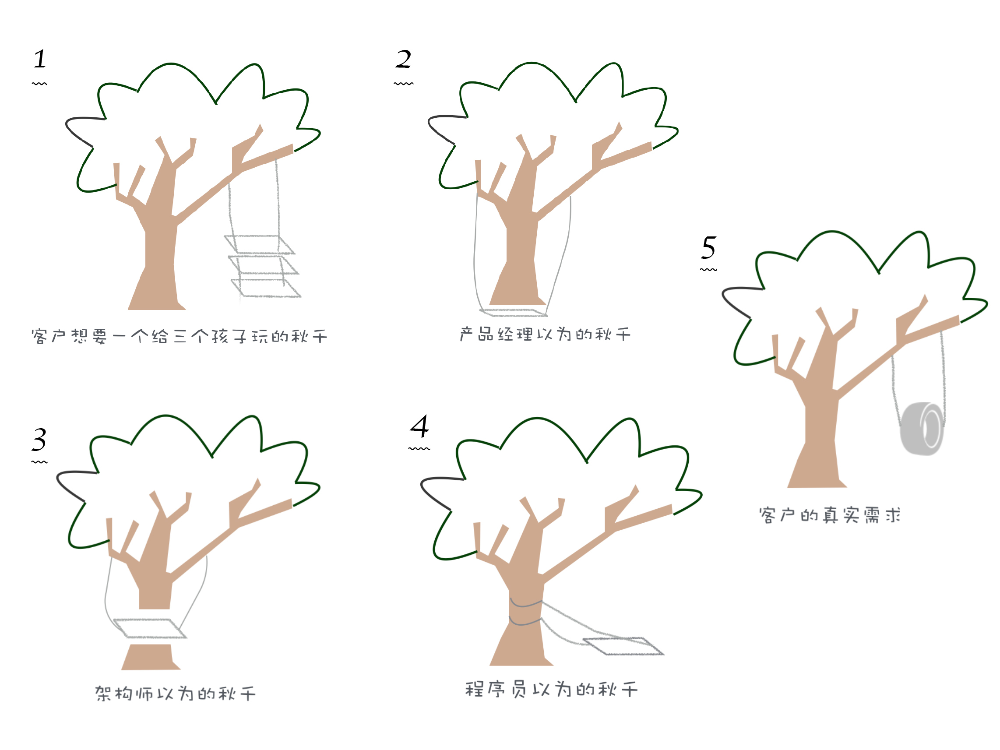
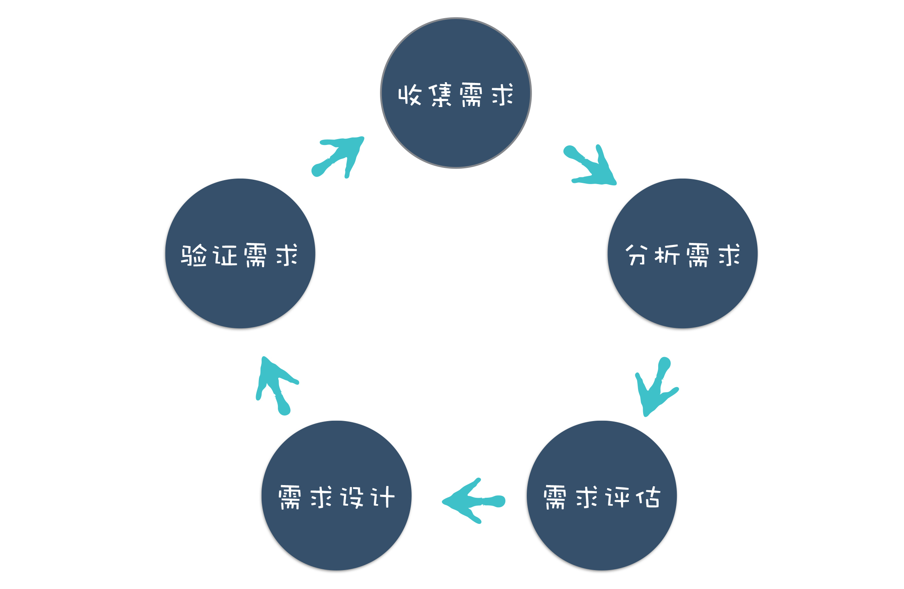
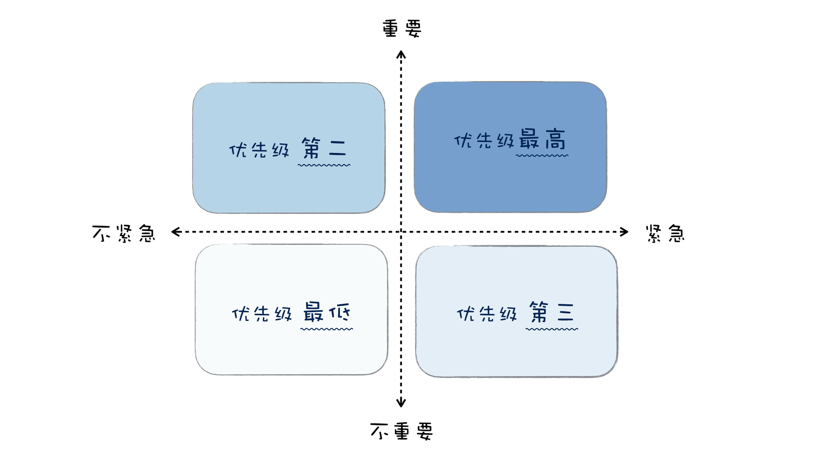
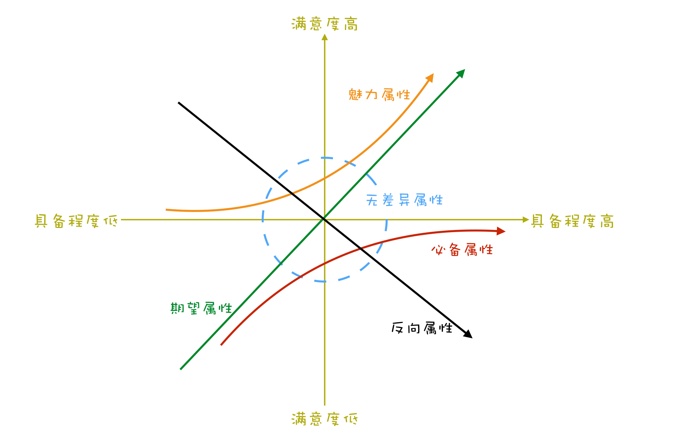
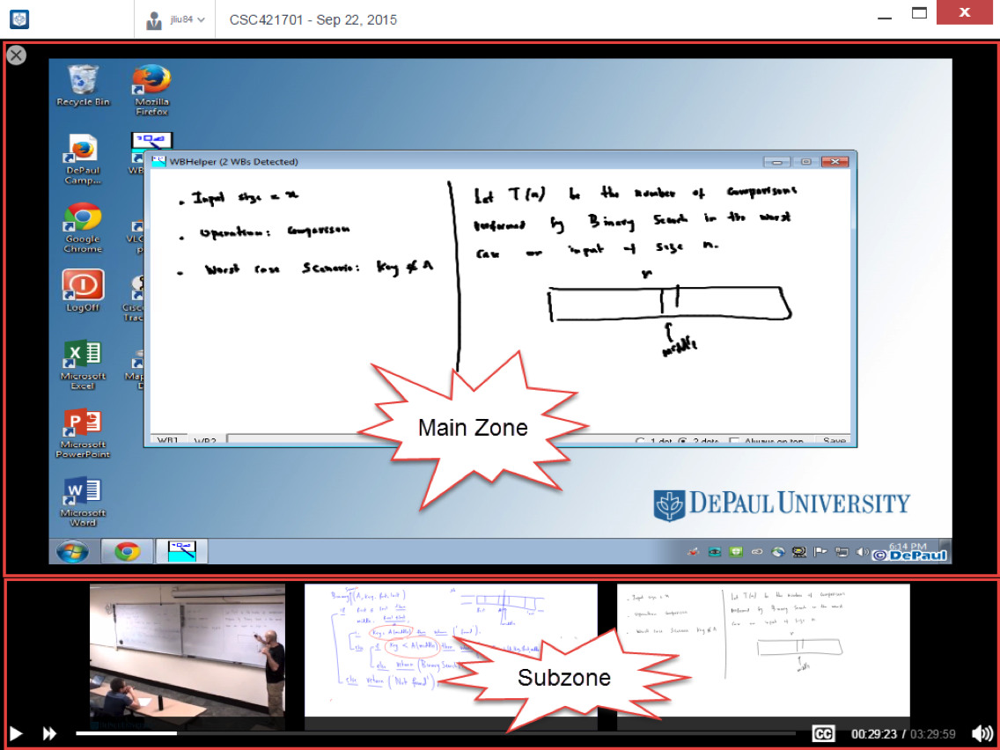
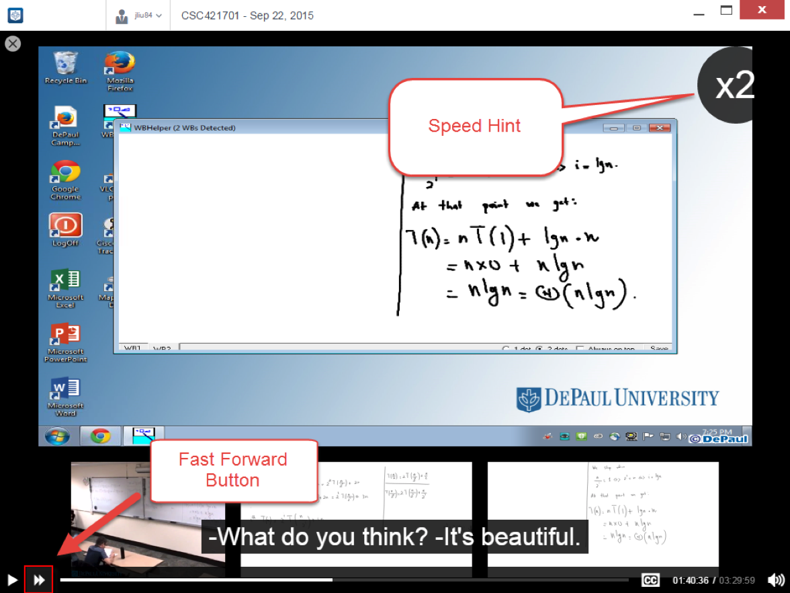

# 17 需求分析到底要分析什么？怎么分析？

你好，我是宝玉，我今天想与你分享的主题是“需求分析”。

通过前面的学习，我们知道在瀑布模型中，第二个阶段就是需求分析阶段，同时需求分析的结果也决定了后续的系统设计、开发、测试等阶段能否顺利如期进行。即使是用敏捷开发，同样也少不了对需求的分析整理。

可以说需求就是整个产品的源头，所以需求分析的结果往往决定了产品的成败。如果没有正确把握客户需求，可能就会一步错，步步错！

就像我在《特别放送 从软件工程的角度解读任正非的新年公开信》提到的秋千的案例：

> 客户想要一个给三个孩子玩的秋千；产品经理以为就是一个板子加两绳子就行；架构师发现除非把树截开，否则秋千没法荡起来的；程序员以为用绳子和板子连一起就完事了；而真正满足客户需求的，也就只要在绳子上挂个轮胎而已！

所以在本篇文章中，我将带你去了解：需求分析到底要分析什么？以及我们怎么样才能做好需求分析，抓住用户的真实需求，做出来客户想要的软件产品，避免失败或浪费。

## 什么是需求？

我们日常在项目中，经常会听到“需求”这个词，比如说：

- 项目经理对产品经理说：用户给我们提了一个需求，想要一个给三个孩子玩的秋千，你分析一下；-

- 产品经理对架构师说：我们现在有一个需求，在树上拴两绳子，再吊一块板子，你做一下设计。

很明显，这两个需求的意思不一样，**前面这个需求是用户需求，后面这个需求是产品需求。**用户需求是由用户提出来的，期望满足自身一定需要的要求，例如用户说：“想要一个给三个孩子玩的秋千。”这种原始的用户需求通常是不能直接做成产品的，需要对其进行分析提炼，最终形成产品需求。

产品需求就是在分析提炼用户真实需求后，提出的符合产品定位的解决方案。就像上面“在树上栓两绳子，再吊一块板子”，就是产品经理针对用户需求提出的解决方案。

## 需求分析是要分析什么？

其实对用户需求的分析，不是一个动作，而是一个过程。需求分析，就是对用户需求进行提炼分析，最终形成产品需求的过程。

而针对每个用户需求的需求分析过程，需要经过三个步骤。**第一步：挖掘真实需求**大部分用户提的需求，都不见得是其真实的需求，需要透过现象看本质，去挖掘其背后真实的需求。就像福特汽车创始人亨利福特说过的：

如果我最初是问消费者他们想要什么，他们应该是会告诉我，“要一辆更快的马车！”

这里“要一辆更快的马车”就是一个典型的用户需求，但这并非是用户的真实需求，用户的真实需求，需要通过分析才能得到。

要分析用户的真实需求，可以从三个角度入手。

1. 目标用户：用户不同，诉求也不一样；
1. 使用场景：使用场景不一样，解决方案也会有所不同；
1. 想要解决的问题：用户背后想要解决的问题是什么。

我们假设目标用户是普通乘客，使用场景是日常出行，那么用户想要解决的问题其实并不简单是“要一辆更快的马车”，想要更快的马车只是用户自己能想到的解决方案，而他想解决的问题是“更快更舒适的出行方式”。

而现实项目中，大多数人需求分析的不正确，就是因为没有挖掘出用户的真实需求。

我们再看之前的秋千项目，目标用户是三个孩子，使用场景是一起户外玩耍，想解决的问题其实是能有一起玩的娱乐设施。**第二步：提出解决方案**我们知道了目标用户，其使用场景和想要解决的问题，就可以结合产品定位，提出相应的解决方案。

比如针对想要“更快更舒适的出行方式”日常出行的乘客，我们就可以提出汽车的解决方案，而不一定要局限于马车，汽车能更好的满足用户需求。

针对三个孩子想有一个在户外一起玩的娱乐设施这个需求，我们可以提供一个轮胎式的秋千，就可以很好的满足他们的需求，我们甚至可以建一个小型游乐园。**第三步：筛选和验证方案**

在提出方案后，我们需要对方案进行筛选，比如对于秋千项目，建小型游乐园的方案虽然能满足需求，但是成本太高，需要排除掉。

在选好方案后，还需要对方案进行验证，以确保方案能解决用户需求。

在传统瀑布模型中，选定方案后，会写成产品设计文档，走相应的评审流程，评审完成后再进行设计、开发和测试，测试完成后会让客户再进行验收。而敏捷开发，在整个开发过程中，每个迭代或者关键的里程碑，也一样需要客户进行验收。

通过以上三步，就可以对用户需求进行提炼分析，最终形成产品需求。

所以在需求分析过程中，分析的就是一个个用户的需求，找出背后的真实诉求，再有针对性的提出解决方案。

对于解决方案，要进行筛选和验证，有些不可行的用户需求不会变成产品需求，可行的用户需求会按照优先级进入实施阶段，最终变成产品。

## 怎样做需求分析？

前面我介绍了对单个用户需求的分析，主要经过三个步骤：

- 第一步：挖掘真实需求；

- 第二步：提出解决方案；

- 第三步：筛选和验证方案。

而软件项目的用户需求，从来就不是单一的，而是一系列需求，所以对于软件项目的需求分析，还需要增加收集整理的步骤。整个过程是迭代进行的，如下所示：

- 收集需求：对用户需求进行收集整理；

- 分析需求：对需求进行分析，挖掘用户真实需求；

- 需求评估：筛选过滤掉不可行的需求；

- 需求设计：针对用户需求提出解决方案，设计成产品方案；

- 验证需求：验证方案是否可行。

我在美国 DePaul 大学读书的时候，曾在学校兼职，当时接到一个项目，要为计算机学院的网络教学系统做一个网页版的播放器。

我们知道现在的课堂里面，老师上课的时候，会用电脑放 PPT 或者课件，同时还要在黑板（也有的是白板）上写写画画辅助说明。

DePaul 大学的网络教学系统，就是在老师上课的时候，用摄像头把老师讲课的整个过程都录制成视频，同时也会用特殊的软件，把当时电脑屏幕上显示的内容，和白板上写的内容，都录制下来。

这样选网络课程的同学可以通过网络直接观看，既不会漏了老师讲的内容，也不会错过老师在电脑上放的和白板上书写的内容。播放器要做的就是要播放录制的教学视频、电脑屏幕和白板。

我将以这个项目为例，讲讲如何做需求分析。

1. **收集需求**这个项目的原始需求是老师给我的，只是告诉我要做这样一个播放器，让学生能看教学内容。而这个需求还不够，我还需要继续收集用户需求。

收集用户需求有很多方法，这里列举部分：

头脑风暴：就是大家一起开会头脑风暴讨论；

用户调研：通过调查问卷或者访谈，通过问用户一些问题收集反馈；

竞品分析：通过分析其他同类产品的功能获得需求；

快速原型：通过原型来收集反馈，收集确认需求。

拿播放器的项目来说，头脑风暴没有足够的项目成员，也没有同类产品可以做竞品分析，做原型的话，成本有点高，所以用户调研就是最适合的收集需求的方法。它不仅简单，而且能收集到真实的用户反馈。于是我通过微信群、邮件、用户访谈从老师、领导和学生那分别收集了一些反馈。

老师们没有什么有效反馈，因为他们基本不需要用到这个软件，领导们有个需求就是希望能播放字幕，而很多学生希望能有 2 倍速快进功能。

2.**分析需求**

收集了需求，就要分析用户的真实需求，这是最难的部分，也是最体现产品经理需求分析水平的地方。

用户需求背后的真实需求有三个层次：

- 表层需求：用户对解决问题的期望，例如马车更快；

- 深层需求：用户的深层次动机，诉求产生的原因，例如乘客对出行速度的要求；

- 底层需求：人性本能的需求，例如对安全感对舒适的追求。

要分析好用户需求背后的真实需求，就是要结合“目标用户”和“使用场景”，按照上面三个层次去思考。

我们拿刚才播放器为例，目标用户是学生，使用场景是学校机房或者家里，希望解决以下问题。

字幕的问题：

- 表层需求：显示字幕；

- 深层需求：语言不好，跟不上老师节奏；

- 底层需求：聋哑学生无法听到声音，只能通过字幕学习。

快进的问题：

- 表层需求：能快进播放；

- 深层需求：可以节约学习的时间，提高效率；

- 底层需求：取得好的学习成绩

经过这么一分析，基本上就对于用户的真实需求心里有数了。

3. **需求评估**

需求收集分析完了后，还需要进一步评估，以决定做还是不做，优先级如何，先做哪些再做哪些。

需求评估考虑的因素有：

- 可行性：技术能否实现；

- 成本：人力成本、时间成本；

- 商业风险和收益：有没有商业上的风险，收益是否合理；

- 紧急性与重要性：是不是用户迫切的需求。

如果确定可行，还需要评估其优先级。评估优先级一个简单的方案就是用“紧急重要四象限”的方法来区分：

复杂一点的有 KANO 模型，如下图所示。

- 红色曲线，是用户认为必须要有的功能；

- 绿色曲线，就是用户明确提出的需求；

- 黄色曲线，属于兴奋型需求，就是用户自己没想到，超出预期的功能。

回到我们播放器的例子：

- 红色曲线（必须要有的功能）：能播放视频、播放电脑屏幕，播放白板；

- 绿色曲线（用户明确提出的功能）：字幕、2 倍速快进；

- 黄色曲线（超出预期功能）：10 秒快进、10 秒快退、在时间轴上记录笔记。

4. **需求设计**

在分析和评估完需求后，还需要提出解决方案，也就是对需求进行设计，做出来有效的产品设计方案。最终的产品设计，会落实到人机交互上面，用户可以通过软件界面交互。

现在产品设计方面，各个平台都有一套比较成熟的界面标准控件，大部分产品设计都可以基于标准界面控件，组合成满足需求的用户界面，在满足功能的前提尽可能做得易用和美观。

在需求设计的时候，可以用草图、原型设计工具、界面设计工具进行设计。

在需求设计阶段，可以参考其他成熟的产品。比如我在设计播放器时，也是通过借鉴其他软件的设计来完成的，比如说向 Youtube 借鉴了视频播放器的设计，向 Skype 的电话会议系统借鉴了其播放区域切换的交互，最终完成了产品设计。

\\5. 验证需求

在需求设计好后，还需要进行验证，看解决方案是否能满足用户的需求。

对需求的验证方式其实是贯穿整个软件项目生命周期的，在需求分析阶段，会反复验证确认设计好的需求是否满足用户的真实需求，例如各种设计评审。

在产品开发完成后，也需要有需求的验收，以确保开发出来的软件产品是客户想要的，满足客户需求的。

现在很多互联网产品，还有一种基于数据的验证需求方式，也就是 A/B 测试。

设计好一个功能上线后，并不直接让所有用户使用，而是先给一小部分用户使用，然后分析数据，看使用这个功能的用户群和不使用这个功能的用户群，在营收、访问量、活跃度等关键数据上是更好还是更坏。如果好，就加大比例，如果数据不好，可能就会调整甚至取消这个功能。

我在设计播放器的时候，首先用 PPT 做了一个简单的草图，拿去给老师确认，收集一些反馈后，写了一个 PC 版的软件原型，拿给一部分同学试用。在收集反馈后，做了一些修改和调整，最终确认了产品的设计。

在需求分析完成后，就可以基于需求分析形成的文档，进行设计和开发了。（DePaul 大学的网络教学系统产品演示）

## 总结

今天带你一起学习了软件工程中一个非常重要的知识点：需求分析。

需求分析，就是一个将用户需求变成产品需求的过程。要做好用户需求的分析，需要找出来隐藏在用户需求背后的真实需求，还要针对用户的真实需求提出解决方案，最终验证方案是不是能满足好用户需求。

需求是整个产品的源头，很多软件项目失败的原因就在于没有做好需求分析，软件中很多浪费也来源于需求没想清楚导致的返工。做好需求分析对于软件项目来说非常的重要。

要做好软件项目的需求分析，需要做好需求的收集整理工作，然后对收集好的需求进行科学的分析，评估是不是可行以及划分优先级，对可行的需求项进行设计，最后还要验证设计出来的结果是不是满足需求。

希望你通过这节课的学习，能科学地运用好需求分析的知识，对项目的需求分析把好关，保证最终产品能满足用户需求，超出用户预期。
