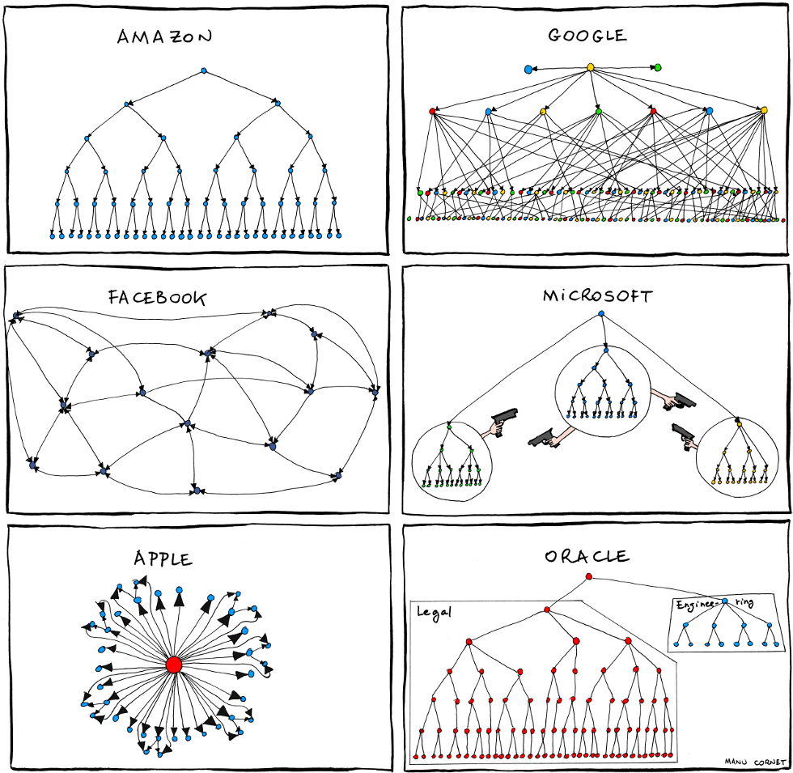
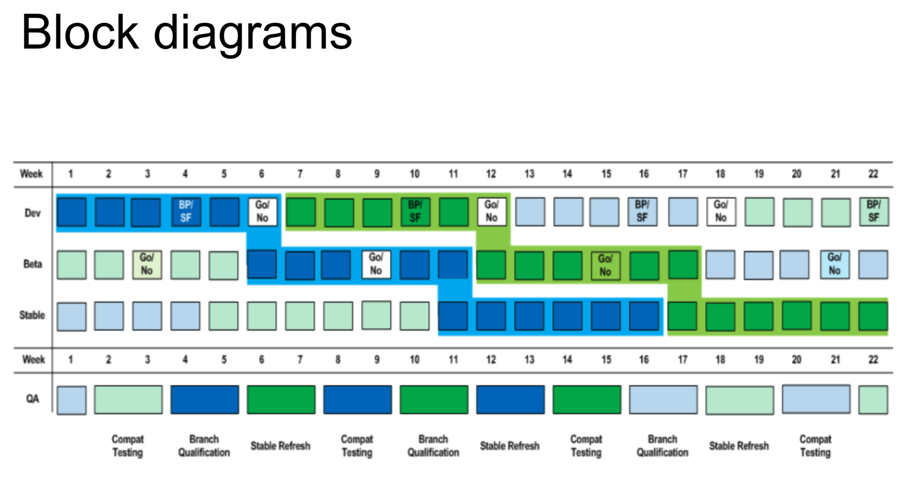
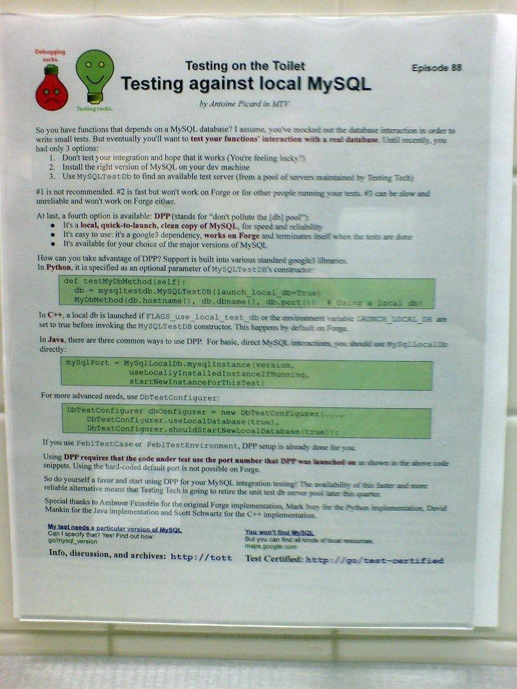
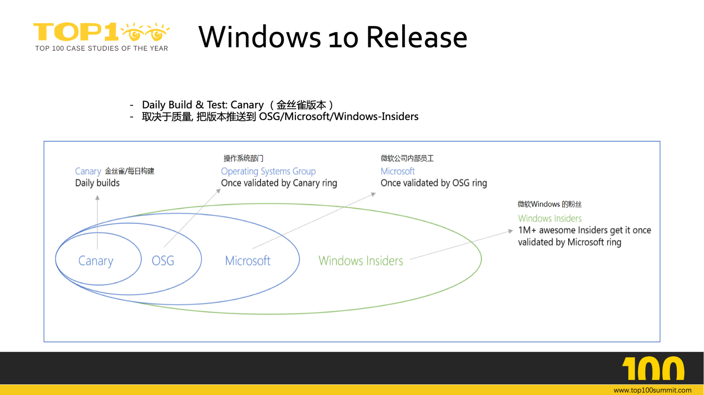
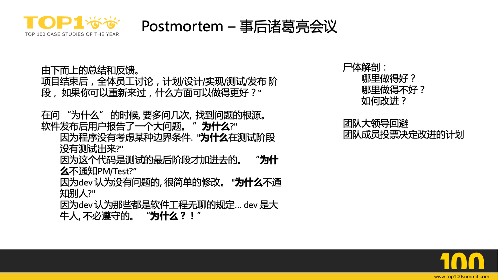

# 44 微软、谷歌、阿里巴巴等大厂是怎样应用软件工程的？

你好，我是宝玉。在上一篇文章里，我带你一起了解了像 VS Code 这样的开源项目对软件工程的应用，以及如何学习借鉴优秀的项目对软件工程的应用。今天我将带你去看看像微软、谷歌、阿里巴巴这些大厂是怎么应用软件工程的，以及我们应该如何学习和借鉴他们对软件工程的实践。

我想无论你现在是否在大厂工作，都有很多途径了解到大厂是如何应用软件工程的，网上已经有很多他们员工的分享。你可能更想知道的是： 从大厂应用软件工程的实践中，你能学习什么，又该如何学习借鉴。

每个公司，都有自己的历史和文化，他们的文化又影响了各自的软件开发模式。

比如说谷歌，谷歌崇尚工程师文化，请来的工程师都是万里挑一的，开发也没有太大的进度压力，所以 Google 的工程师做项目就会不紧不慢，质量优先，有统一的代码规范，严格的代码审查和严谨的自动化测试。还会频繁地重写系统，每隔几年，就把软件重写一遍。

再比如说 Facebook，Facebook 有一种黑客精神，创始人马克·扎克伯格有句名言是“Move Fast and Break Things”，也就是说快速做出产品，不要怕犯错。所以 Facebook 的工程师做软件开发的时候不会想太多，先实现再说，做出来就发布，哪怕可能有 Bug。发布后根据用户的反馈再不断完善，真的把线上功能弄坏了，再打补丁去修复。

然而这些带有各自文化特色的部分，却是我们很难学习借鉴的，因为这样的文化都只适合各自的公司。假设让微软去学习 Facebook 的黑客精神，发布带有很多 Bug 的 Windows 系统，那么用户是不能忍受的；而让普通公司去学 Google 的工程师文化，项目没有严格的 Dead Line，系统隔几年重写一遍，那公司恐怕都要撑不住了。

所以，要学习大厂，\*\*你要多去关注大厂们对软件工程实践共通的地方，可以应用在你自己项目的地方，另外还要去看大厂对软件工程实践的变化趋势，在朝什么方向发展。\*\*通常这些大厂的很多实践都是业界的风向标，一旦一些实践大厂都在应用，那么很多中小厂就会跟风，最终变成行业标准。

在上一篇《43 以 VS Code 为例，看大型开源项目是如何应用软件工程的？》中，我从项目的开发迭代过程，团队的角色分工和项目开发各个阶段来分析了 VS Code 对软件工程的应用。类似的，我也将从大厂的开发团队组成、开发工具的使用、项目开发流程这几个方面来分析一下大厂对软件工程的应用中，有哪些共同点？有哪些变化趋势？有什么地方可以借鉴？

## 软件项目开发团队组成

软件项目开发，最终要落实到“人”上面。大厂在招人方面一向舍得投入，不仅花很多人力财力在招聘上面，同样对于员工待遇上也很大方，只为了能招到最优秀的人才。

对于普通的公司和团队来说，很难像大厂那样有一群行业内顶尖的人才，但是它在软件团队的一些管理和实践方面，还是有一些共通的地方，有值得普通公司学习借鉴之处。

#### 1. 软件开发团队规模小

网上曾有一张流传甚广的关于各大公司的组织结构图。

（图片来源：[HOW YOUR STARTUP’S ORG CHART CHANGES YOUR PRODUCT](https://tomtunguz.com/conways-law/)）

这张图形象生动的描述了各大公司的组织结构，各具特色。然而这些大厂的组织结构具体细分到软件项目开发团队的时候，却惊人的相似：那就是一个软件项目开发团队都不会太大，一般不会超过 10 个人，如果超过就会被分拆。最著名的就是亚马逊的“两个披萨原则”，也就是团队的人数不应该多到让两个披萨不够吃。

其实大厂的软件项目都采用小团队的原因很好理解，那就是团队规模越大，交流就越复杂，成本也越高！要想沟通更高效，那么就要求团队的规模必须足够小。

组织架构的小型化也会对软件架构有影响，通过架构的隔离，让各个不同的团队可以在一起高效地协作。有在谷歌 YouTube 工作的朋友跟我说，YouTube 的 App，其中一个导航菜单，都是一个专门的小团队在维护。

如果你所在团队规模大，沟通效率不高，那么可以考虑向大厂学习，分拆成小团队，可以有效提高沟通协作的效率。

#### 2. 没有专职测试

在我们专栏文章《32 软件测试：什么样的公司需要专职测试？》中，探讨了专职测试这个话题，而现在像微软、谷歌、Facebook、阿里巴巴这些大厂，都没有专职的测试人员。

但没有专职测试人员不代表他们不重视质量，只是他们在用更高效的方式来代替人工“点点点”的手工测试。就像专栏文章中介绍的，Facebook 能做到没有专职测试人员，是因为他们有大量的自动化测试；另外，Facebook 在功能发布之前，先在内部使用，上线之后能做到有效监控，出现问题能随时回滚或者打补丁。

大厂替代专职测试的这些手段，对于普通公司来说，可能现阶段去实施是有难度的，但是随着这些发布、监控工具的不断普及，自动化测试的普及，开发团队不设置专职测试会逐步变成一种趋势，现在的手工测试将来也许会被逐步淘汰。

#### 3. DevOps 文化

在我们专栏文章《36 DevOps 工程师到底要做什么事情？》中，有过对 DevOps 进行探讨，DevOps，本质上就是一种紧密协作的工作方式。

早些年像微软这样的大厂，工程师团队有三种角色：项目经理，开发人员和测试人员，而运维团队则是工程师团队的另一组人。虽然好处是分工更明确，但是久而久之也造成了不同工种之间的隔离，尤其是各自目标不一致导致的利益冲突。

所以微软也在前些年进行了转型，将运维团队合并到了工程师团队，运维人员和开发人员协作更加紧密了，有效提高了编码效率，质量和产量。

除了微软，其他大厂也纷纷采用了类似的 DevOps 转型和实践。这里有两篇关于谷歌和阿里巴巴的 DevOps 实践文章可以参考：《[孙宇聪：来自 Google 的 DevOps 理念及实践](https://developer.aliyun.com/article/582942)》《[阿里研究员毕玄谈应用运维体系的变迁，DevOPS 是大势所趋](https://102.alibaba.com/detail?id=117)》。

如果你的团队也存在不同工种之间协作的矛盾和冲突，不妨借鉴一下大厂对 DevOps 的实践。

## 开发工具的使用

大厂都爱自己造轮子，对开发工具也是如此，都有一个专门的部门去做内部工具的开发和维护。

如果你有幸在一个大厂工作，那么你会很幸福，基本上开发过程中，各种像编译、部署、持续集成等等都有好用的工具可以帮助你自动化，提升效率，你只要专注于写代码就好了。然而一旦离开大厂，你会发现这些日常工具都要自己去搭建，甚至得自己去写。

但好在大厂用的这些主要工具，你在网上几乎都能找到开源的或商业的替代品。只是没有那么好用罢了。

比如说谷歌一名前员工在 GitHub 上分享了他在谷歌工作时，日常会使用的一些工具，以及外界对应的替代方案（[工具和替代方案](https://github.com/jhuangtw-dev/xg2xg)）。再比如微软和阿里巴巴都将自己的工具（[Azure DevOps](https://azure.microsoft.com/zh-cn/services/devops/) 和 [阿里云 DevOps](https://www.aliyun.com/product/yunxiao)）做成了服务供第三方使用。

有一点倒是可以看得出：这些大厂舍得在工具上投入。应用工具，也确实可以有效地提升效率，改进软件项目质量。

关于工具，我们专栏在各个章节也都有介绍，建议可以学习下大厂，把这些工具用起来，帮助你更好地完成项目。

## 项目开发流程

各个大厂基本上都没有规定必须要用什么开发模型或者不允许用什么开发模型，各个开发团队都可以自行决定采用的开发模型。

所以你会看到有的团队是敏捷开发，有的团队是快速迭代，甚至有的团队还用的是瀑布模型。但他们在项目开发中有很多共通之处。

#### 1. 迭代周期短

即使是像微软这样，以前要几年才发布一个版本软件的公司，现在也加快了迭代。现在 Windows 10，每半年就会更新一个大的版本，每天都会发布可以测试的版本。

上一篇介绍的 VS Code 的开发，也是每个月就会有一个大的版本发布。还有像谷歌的 Chrome 浏览器，也是每 6 周发布一个新版本，如果某个新功能还没准备好，那么放到下个版本发布。

（图片来源：[Chrome 发布周期](http://www.slideshare.net/36kr/46659928-chromereleasecycle12162010)）

如果你的项目需要半年以上的开发周期，也要考虑一下，是否可以缩短开发周期，快速迭代起来。

#### 2. 严格的开发流程

其实我在专栏已经反复地、苦口婆心地讲了很多开发的流程，比如说基于分支开发、代码审查、自动化测试、持续集成等等，希望大家能在实践中去应用这些好的实践。

然而在大厂，这些开发流程基本上都是硬性要求：

- 要基于分支进行开发新功能或者修复 Bug；

- 要遵守公司或者团队的代码规范；

- 合并之前要有至少一个人 Review 通过；

- 要写自动化测试代码，并且保证所有测试用例通过。

在谷歌的卫生间里面，甚至会张贴着有关 Testing on the Toilet 的贴纸，让你在去卫生间的时候还能学学怎么写测试，好让你的 PR 能早点通过审查。

（图片来源：[Testing on the Toilet](https://mike-bland.com/2011/10/25/testing-on-the-toilet.html)）

#### 3. 严谨的测试流程

虽然大厂都没有专职测试，但是测试可不含糊，都有一套严谨的，并且行之有效的测试流程。

以谷歌的 Chrome 浏览器为例，除了自动化测试以外，每个 Chrome 的版本发布之前，都要经历以下几个版本。

- 金丝雀版本（Canary Channel）： 过去煤矿工人要下井会带着金丝雀，这种鸟对危险气体的敏感度超过人。如果金丝雀死了，矿工便知道井下有危险气体，需要撤离。金丝雀版本会频繁发布，但并不太可靠，就像金丝雀一样用来第一时间发现严重的问题。

- 开发版本（Dev Channel）：工程师日常使用的版本，一边开发一边使用，让工程师可以第一时间验证自己开发的功能。

- 测试版本（Test Channel）：给内部员工的版本，就像上一篇 VS Code 介绍的 Eat your own food，自己人先试用。

- Beta 版本或发布版本（The Beta Channel or Release Channel）：是给外部用户使用的测试版本，并不保证稳定，但是用户可以提前体验新功能，也能帮助开发团队及时发现 Bug。

类似的，如果你看 Windows 10 的发布流程，也是这样一个一个的测试版本的测试流程，最后正式发布的版本已经是经过千锤百炼，反复测试过的。

（图片来源：[微软邹欣：Hit refresh 背后的软件工程革新](https://zhuanlan.zhihu.com/p/61855923)）

#### 4. 完善的发布和监控流程

就算经过完整的测试，也不能保证质量就是可靠的。所以大厂们还会配合一套完善的发布和监控流程。

发布前，先评估风险，增加相应的监控数据和设置报警的阈值。制定出现问题的应对方案。

上线后，先推送一小部分用户，并同时进行线上数据的监控，如果没有发现异常，自动加大比例，直到完整覆盖；如果发现异常，自动报警通知相关负责人，上线处理，并直接关闭新功能。

有关上线发布和数据监控的内容，你也可以参考专栏文章《35 版本发布：软件上线只是新的开始》和《38 日志管理：如何借助工具快速发现和定位产品问题 ？》中的更多介绍。

#### 5. 事后总结，不断改进

在专栏文章《39 项目总结：做好项目复盘，把经验变成能力》中，提到了项目复盘的重要性，以及如何做好项目复盘。

对于大厂来说，复盘也是整个项目开发过程中很重要的一部分，正是因为有这样一次次的“事后诸葛亮”会议，才让团队成员能从中总结成功经验，吸取失败教训。

（图片来源：微软邹欣：Hit refresh 背后的软件工程革新）

## 参考阅读

其实，大厂的软件工程实践，网上有很多相关的文章，这里我将收集的一些内容在这里分享一下，供参考阅读：

《[Google 公司的软件工程之道](https://mp.weixin.qq.com/s/6KMFeVlt1QzLkfcYcWC08A?)》

《[软件工程在微软的演化——邹欣](https://zhuanlan.zhihu.com/p/61855923)》

《[解密 Facebook 产品的开发流程](https://www.scrumcn.com/agile/scrum/3696.html)》

《微软、谷歌、Facebook、Amazon 软件质量控制实践》

《[微软开发团队的 DevOps 实践启示](https://www.infoq.cn/article/devops-lessons-microsoft)》

《[-The Facebook Mobile Release Process](http://www.infoq.com/presentations/Facebook-Release-Process/)》

《[敏捷开发，你真的做对了吗？阿里文娱广告团队敏捷实践总结](https://zhuanlan.zhihu.com/p/33554080)》

《[如何在 2 周内交付 85% 以上需求？阿里工程师这么做](https://developer.aliyun.com/article/663714)》

## 总结

现在业界顶级的互联网或者软件公司，他们都对软件工程都有非常好的应用和实践，这也是他们能跻身成为顶级互联网的一个不可或缺的前提。通过学习和观察大厂的软件工程实践，能帮助我们拓宽视野，提升软件工程知识水平。

学习大厂，要多去关注大厂们对软件工程实践共通的地方，以及可以应用在你自己项目的地方。

在团队管理方面，大厂的软件项目团队规模都被拆的比较小，这有助于团队成员之间的沟通协作；没有专职的测试人员，测试工作被自动化测试代替；有很好的 DevOps 文化，各个工种之间紧密协作。

在开发工具方面，大厂都很重视工具的开发和使用，很多工具我们也能找到替代品，或者直接使用大厂提供的工具服务。

在项目开发流程上，大厂有严格的开发流程，代码必须写自动化测试代码，自动化测试通过，并且有人 Review 通过的 PR 才能被合并；大厂虽然没有专职测试人员，但是整个测试过程很严谨，在发布前都经过了充分的测试；大厂对于软件发布也都有完善的发布和监控流程，不仅可以快速发布，还可以及时发现线上问题；大厂也会有上线后的复盘总结，总结成功经验，吸取失败教训，将项目经验变成团队能力。

从大厂对软件工程实践中，你可以学习到一个优秀的公司是如何来应用软件工程，打造出高质量产品的，也可以借鉴其中好的实践到你自己的项目中。

最后你要清楚，即便是大厂，对软件工程的应用也不是一成不变的，会随着技术的发展、软件工程的发展不断改进。比如说微软早些年就使用的类似于瀑布模型的开发模式，现在也变成了敏捷的快速迭代的开发模式。这种不断学习改进的方式，也值得我们大家学习和思考。
