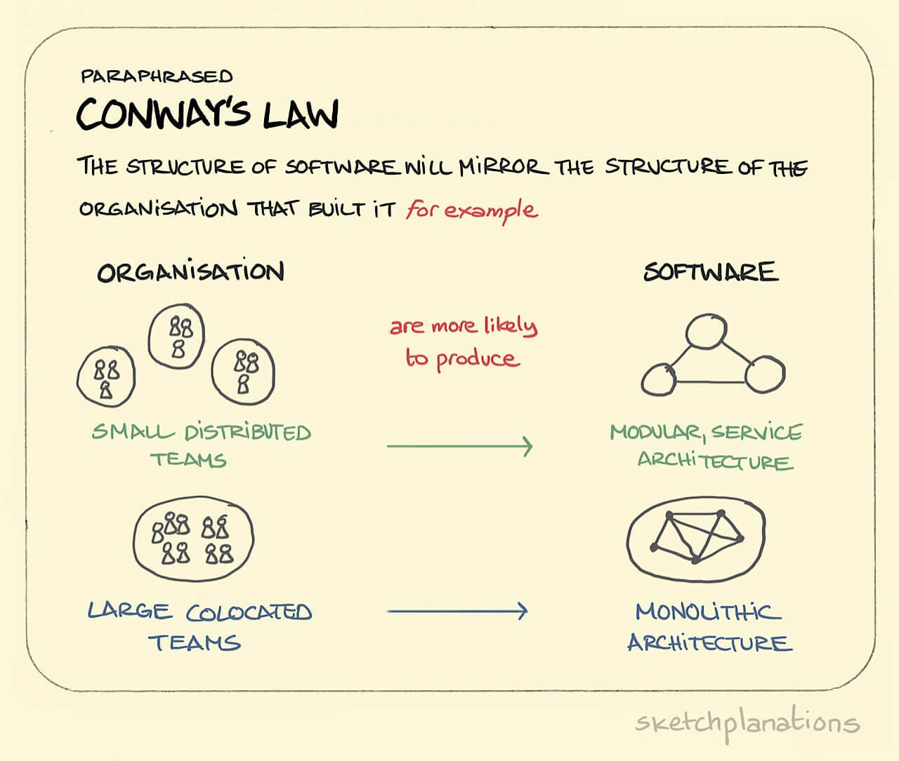
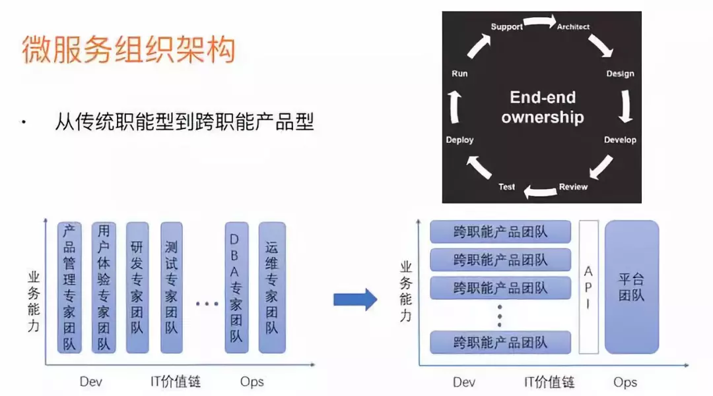
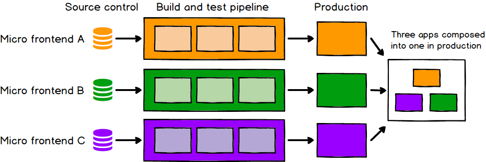

# 45 从软件工程的角度看微服务、云计算、人工智能这些新技术

你好，我是宝玉。这些年来，新技术新概念层出不穷，比如说微服务、云计算、人工智能等。你有没有去学习和了解这些新技术呢？又是怎么去理解这些新技术的呢？

也许你会从技术的角度，去学习和理解这些新技术，去看如何把服务分拆，看如何应用虚拟化、容器技术，如何用人工智能切页面。

这些新技术可能会让你很兴奋，毕竟又有很多新知识可以学习和应用；但另一方面也可能会增加一些困惑，比如说：

- 我该不该在项目中使用微服务？

- 在设计微服务架构的时候，服务拆分的粒度该多细？该拆成 10 个服务还是 100 个？

- 云计算对我的项目会带来什么影响？我应该怎么应用？

- 人工智能会代替我写程序吗？

如果只是从技术角度思考这些问题，难免会陷入技术之中，反而不容易看清楚这些问题。在我们专栏一开始《02 工程思维：把每件事都当作一个项目来推进》这篇文章中，我就提到了工程思维的概念：

> 工程思维，本质上是一种思考问题的方式，在解决日常遇到的问题时，尝试从一个项目的角度去看待问题、尝试用工程方法去解决问题、站在一个整体而不是局部的角度去看问题。

在学习使用这些新技术的时候，你不妨从项目的整体，从软件工程的角度来理解这些技术，这能给你带来不同的视角。那么怎么从软件工程的角度去理解呢？

我想你应该对我们专栏上两篇文章有印象，我分别从团队、项目过程、工具这几个维度，分析了开源项目和优秀公司对软件工程的应用。类似的，你也可以跳出技术之外，从软件工程的角度来理解微服务、云计算、人工智能这些新技术和概念。

## 软件工程中技术架构和组织架构的关系

首先我们来看看微服务，你可能第一反应就是：它是一种架构技术。没错，从技术角度来看，微服务就是一种架构技术。经过对我们专栏的学习，我相信你对架构应该不会陌生，比如：前后端分离架构、微服务架构。

不知道你有没有观察过：通常系统架构和组织架构是相似的。比如说前后端分离的架构，那么在组织上一般也会分前端组和后端组；而微服务架构，则分组是和服务相关的，可能一个组就是负责一个微服务。

其实组织架构和技术架构相似这个现象不是偶然的，这个现象背后有个定律叫康威定律 (Conway’s Law)。康威（Melvin Conway）博士在 1967 年提交的一篇论文《[How Do Committees Invent?](http://www.melconway.com/Home/Conways_Law.html)》中最有名的一句话是：

> Organizations which design systems are constrained to produce systems which are copies of the communication structures of these organizations. — Melvin Conway

如果对这句话翻译一下，它的意思是：

> 你设计的软件系统架构，会以某种方式反映出构建软件背后团队的组织架构，你在设计软件的系统架构时，同时也在设计你的组织架构，反之亦然。也可以简单理解为：组织架构的设计等同于系统架构的设计。

如果你拿康威定律去验证你现在的团队组织架构，或者你熟悉的其他团队的组织结构，你会发现运行良好的项目，都很好地符合这条定律。那些大型复杂的单体软件系统，背后也对应着一个庞大的开发团队，那些应用微服务的项目，背后都是一个个的小组。

（图片来源：Conway’s Law）

看完康威定律再回过头来看微服务，**你会发现，微服务架构的设计，不仅仅是一个对服务拆分的架构设计，同时也是对组织架构拆分的设计。**

当你在做架构设计，在考虑你的微服务拆分粒度的时候，不妨先想一想：你团队的组织结构是什么样的？真的大到需要用微服务了吗？你能按照微服务的设计去重新设计和调整你的组织结构吗？

当你在设计系统架构的同时，把组织架构的设计也考虑进去，很多问题也就迎刃而解了。比如说你开发团队 30 个人，要使用微服务的架构，那么拆成 3～5 个微服务是比较合适的。因为每个小组 10 个人左右，每个小组维护 1～3 个微服务，是相对比较合适的配比。

然后你再看那些应用微服务失败的案例，比如说一个小开发团队，做出 100 多个微服务的架构，那团队维护这些服务的成本一定是相当高的，最终会难以维持。就像这篇文章：《[再见微服务，从 100 多个问题儿童到一个超级明星](https://mp.weixin.qq.com/s?__biz=MzIxMzEzMjM5NQ==&mid=2651032374&idx=1&sn=b9a44cc1fd143e8d958587ff05f1acf5&chksm=8c4c5e32bb3bd7246ad28bee556649dde1ffeaae086c8bdfc27c054b32042a89c456aed4cbe5&scene=27#wechat_redirect)》，虽然文章里面没有提到团队的组织结构，但是可以想象，这 140 多个微服务背后一定没有 140 个小团队，哪怕每个团队只有 10 个微服务，对团队来说也是有极大维护成本的。

还有一些传统大型企业，团队构成是按工种划分成不同团队的，开发一个团队、测试一个团队、运维一个团队，那么推行微服务阻力会非常大，因为这样的组织结构和微服务的组织结构是不兼容的。

对于微服务的组织结构，需要按服务划分团队，团队成员有开发、测试和运维，一起组成一个小团队，围绕着服务不断迭代，这样效率是最高的。

（图片来源：[微服务写的最全的一篇文章](https://mp.weixin.qq.com/s/CGZmR5aFYHyEDdp5keGa1A?)）

如果以后又出来什么新的概念和技术，你不妨从软件工程的角度，去看看它和组织结构的关系。比如说这些天网上开始流传一个新的概念叫：微前端（Micro Frontends），在我看来，这说明现在开发的重心在往前端倾斜，前端团队越来越庞大，需要分拆了。

(图片来源：[Micro Frontends](https://martinfowler.com/articles/micro-frontends.html))

## 新技术改变了软件工程中的分工协作

我们再来看看像云计算和人工智能这类技术，也许你会觉得它们代表了很多激动人心的高端技术，比如虚拟化、自动化、智能化等等。但这些新技术不仅是技术上有突破，更是对软件工程的开发过程，对分工协作都产生了深远的影响。云计算通过标准化的服务简化了开发的难度，人工智能和自动化在逐步替代项目中的一些手工操作。

在我大学上软件工程课的时候，老师跟我们说：“在建筑工程，用一些标准的模块，比如各种建筑材料组合在一起，就可以完成复杂的结构。这种标准化的结构可以极大地降低建造成本。希望未来软件工程也能像建筑工程一样，用一些标准的模块和组件，也可以构建出复杂的软件。”然而在十多年前，这个目标还是挺遥远的。

十多年前我办过网站，自己写程序，程序写完后要自己去买服务器放到机房托管，每年要给机房交托管费，还要定期数据备份，给服务器杀毒，装防火墙防止 DDos 攻击这种事情。万一服务器宕机了，需要给机房打电话，会有人帮忙重启一下，如果不行就得自己去机房了。

那时候的网络访问还有南北隔离的问题，也就是说你服务器放在南方电信，而用户是北方网通的，那么访问速度就特别慢，想要速度快就要用 CDN（Content Delivery Network，即内容分发网络），以保证访问速度。但当时 CDN 的价钱不是普通用户能承受得了的。

可以说我办个网站是操碎了心。这也是很多中小企业早些年自己开发运行软件系统的写照：需要兼顾开发、测试和线上运维，什么事情都需要自己做。

但是现在，如果我再要去办一个网站，我不会再自己去买服务器托管，而会选一家云计算服务商，将我的程序放在云服务商运行，出问题了就重新部署或者再新开一个虚拟服务器。数据库我也不会自己去安装维护，直接用云数据库，这样省去了数据备份的烦恼。

就算是程序开发，我也不会所有功能自己实现，比如文件存储我会直接用七牛云之类的云存储服务，还能使用 CDN 服务。网站内容的搜索我也会考虑阿里云的文档检索服务，如果有手机 App 消息推送，直接用云厂商的推送服务。

早些年像语音识别、图像识别、地图导航这些高精尖的技术，普通中小公司是没有机会去使用的，或者要付出昂贵的成本。而现在这些高端技术，都有服务提供。如果你有一个好的想法，不用担心技术会限制你的想象力，借助这些服务，你可以实现你的想法。

早些年的开发团队，服务端比前端人数要多，因为那时候界面简单，而后端需要实现很多数据库增删改查的逻辑。现在的趋势是，界面越来越复杂，而后端服务越来越强大，借助一些云服务甚至不需要去写程序，就能实现服务端 API 供前端调用。比如我曾开发过一个微信小程序，后端用的LeanCloud的服务，不需要写后端代码就有一个不错的后端 API 服务。

如果你从软件工程的角度去看云计算，它本质上是在将那些与业务无关的，而又很重要的基础设施、技术，作为一种标准服务提供，让你在软件开发时，只需要专注于业务所独有的部分，从而可以极大地减少开发工作，提升开发效率。

随着云计算的普及，软件工程的标准化、模块化也慢慢出现了一线曙光，希望未来构建软件系统，也能像盖房子一样，通过标准化降低开发成本和难度。

人工智能是另一个现在很火的技术，Alpha Go 在围棋上战胜了人类，无人驾驶也有了突破。另外，人工智能在软件工程领域，也有了一些应用和尝试，比如说微软开源了一个人工智能的项目叫[Sketch2Code](https://github.com/Microsoft/ailab/tree/master/Sketch2Code)，可以把 UI 设计草图转成 HTML 代码，也就是一部分开发工作未来也许可以被人工智能替代了。

阿里巴巴在尝试智能化运维：《[阿里智能运维平台的演进：从自动化到无人化](https://dbaplus.cn/news-134-2072-1.html)》，也就是将人工智能应用在运维领域，从而让人工智能去替代人工的很多操作。在测试领域，虽然还没有见到有成功的用人工智能替代人工测试的案例，但是自动化测试替代了大量手工测试是一个可见的趋势。

现阶段，这些应用只是一个开始，但不会是结束，未来会有更多云服务、人工智能在软件工程领域的应用，会对软件开发的分工协作产生更多影响。

但云服务、人工智能再强大，也难以替代那些创造性的劳动，也就是那些你业务和项目所独有的东西，比如说你对业务的抽象和设计，测试用例的设计，对整个项目过程的组织。

## 在软件工程中，技术是工具

对于像微服务、云计算、人工智能这些新技术，如果站在技术角度看，技术人员永远有两种态度：拥抱新技术和抵触新技术。

但如果你站在软件工程的角度去看技术：\*\*技术服务于架构设计，架构设计服务于业务，业务服务于商业。\*\*也就是本质上来说，技术是为项目服务的工具。

做一个项目，首先是要去解决一个商业问题，比如说你要网上卖东西。然后基于这个商业问题，你要设计一个业务，比如做一个在线商城系统。当你确定了你的业务，你再去设计出适合这个业务的架构，比如设计一个三层架构。最后架构设计好了，你再去选择适合这个架构的技术，比如 PHP+MySQL。

但现实中常常不是这样的，开发人员学会了微服务的技术，就像有了一个锤子满世界找钉子，所以当你需要一个在线商城系统，他会给你按照微服务搭一个架构出来，也许你只要一个简单的 PHP+MySQL 系统就足够了。

或者说最开始你的架构就是简单的三层架构，能很好地满足当时的需求，然后业务不断壮大，于是服务越来越大，团队也越来越大，沟通成本非常高，非常有必要对团队进行分拆。那么这时候微服务就是适合你的架构，而你的技术负责人不懂微服务，也很抵触微服务，就不太可能推动这样的转变。

对于这些新技术，如果只是从技术角度去看，就会更多考虑这个技术喜不喜欢，酷不酷，难不难学，而不容易考虑到如何更好地去为架构服务。

但要是从软件工程的角度，就会把技术当作工具，去学习了解这些新技术，然后进一步思考：这个技术能解决什么问题？应用在项目中有什么样的优缺点？

当你不仅仅是从技术角度去看这些新技术，而是能同时站在软件工程角度看这些新技术时，就能真正的让技术去为架构服务，让架构去为业务服务，从而帮助业务产生好商业价值。

## 总结

不管是现在还是将来，你总是免不了要去面对新技术。从技术角度去看新技术，也许你会兴奋，也许你会抵触，但是如果你跳出技术角度之外，站在软件工程的角度去看新兴技术，你会有不一样的收获。

技术架构等同于组织架构，当你在设计系统架构，你同时也在设计你的组织架构，反之亦然。当你纠结微服务的拆分粒度，不妨看看你的组织架构是不是能和微服务架构匹配。

云计算、人工智能这些新兴技术也逐步改变了分工协作，云计算这样的基础服务，可以降低开发成本，让你可以专注于业务开发；人工智能和自动化技术的发展，也逐步替代了原有的像手工测试、手工运维的工作。但对于创造性的劳动，例如业务的设计和抽象，测试用例的设计和项目过程的组织，是不太可能会被替代的。

最后，技术是工具。技术服务于架构设计，架构设计服务于业务，业务服务于商业。对新技术，保持学习和了解，知道新技术能为你解决项目中什么问题，就像工具一样，选择合适的技术，让技术为架构服务。
