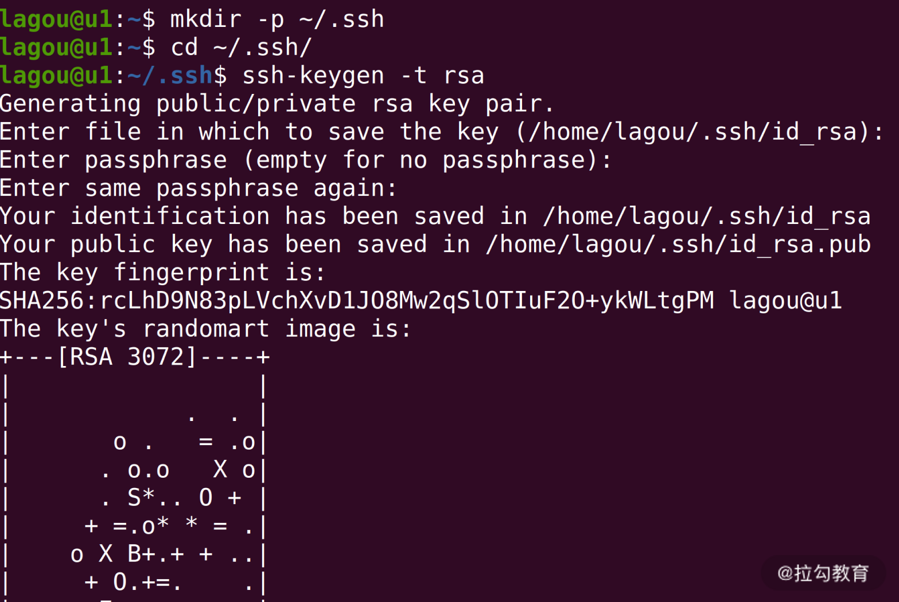
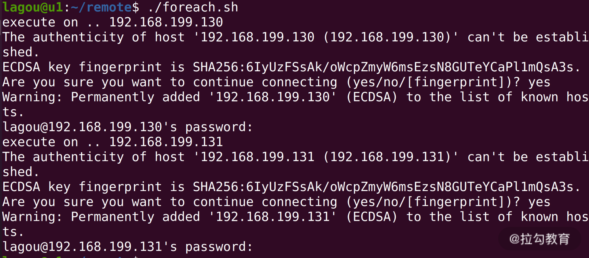
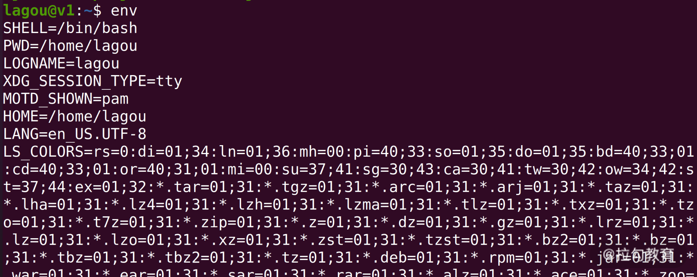

# 12 高级技巧之集群部署：利用 Linux 指令同时在多台机器部署程序

Linux 指令是由很多顶级程序员共同设计的，使用 Linux 指令解决问题的过程，就好像在体验一款优秀的产品。每次通过查资料使用 Linux 指令解决问题后，都会让我感到收获满满。在这个过程中，我不仅学会了一条指令，还从中体会到了软件设计的魅力：彼此独立，又互成一体。这就像每个 Linux 指令一样，专注、高效。回想起来，在我第一次看到管道、第一次使用 awk、第一次使用 sort，都曾有过这种感受。

通过前面的学习，相信你已经掌握了一些基础指令的使用方法，今天我们继续挑战一个更复杂的问题—— **用 Linux 指令管理一个集群** 。这属于 Linux 指令的高级技巧，所谓高级技巧并不是我们要学习更多的指令，而是要把之前所学的指令进行排列组合。当你从最初只能写几条指令、执行然后看结果，成长到具备书写一个拥有几十行、甚至上百行的 bash 脚本的能力时，就意味着你具备了解决复杂问题的能力。而最终的目标，是提升你对指令的熟练程度，锻炼工程能力。

本课时，我将带你朝着这个目标努力，通过把简单的指令组合起来，分层组织成最终的多个脚本文件，解决一个复杂的工程问题：在成百上千的集群中安装一个 Java 环境。接下来，请你带着这个目标，开启今天的学习。

### 第一步：搭建学习用的集群

第一步我们先搭建一个学习用的集群。这里简化一下模型。我在自己的电脑上装一个`ubuntu`桌面版的虚拟机，然后再装两个`ubuntu`服务器版的虚拟机。

相对于桌面版，服务器版对资源的消耗会少很多。我将教学材料中桌面版的`ubuntu`命名为`u1`，两个用来被管理的服务器版`ubuntu`叫作`v1`和`v2`。

用桌面版的原因是：我喜欢`ubuntu`漂亮的开源字体，这样会让我在给你准备素材的时候拥有一个好心情。如果你对此感兴趣，可以搜索`ubuntu mono`，尝试把这个字体安装到自己的文本编辑器中。不过我还是觉得在`ubuntu`中敲代码更有感觉。

注意，我在这里只用了 3 台服务器，但是接下来我们要写的脚本是可以在很多台服务器之间复用的。

### 第二步：循环遍历 IP 列表

你可以想象一个局域网中有很多服务器需要管理，它们彼此之间网络互通，我们通过一台主服务器对它们进行操作，即通过`u1`操作`v1`和`v2`。

在主服务器上我们维护一个`ip`地址的列表，保存成一个文件，如下图所示：


目前`iplist`中只有两项，但是如果我们有足够的机器，可以在里面放成百上千项。接下来，请你思考`shell`如何遍历这些`ip`？

你可以先尝试实现一个最简单的程序，从文件`iplist`中读出这些`ip`并尝试用`for`循环遍历这些`ip`，具体程序如下：

```
#!/usr/bin/bash


readarray -t ips < iplist


for ip in ${ips[@]}


do


    echo $ip


done

```

首行的`#!`叫作 Shebang。Linux 的程序加载器会分析 Shebang 的内容，决定执行脚本的程序。这里我们希望用`bash`来执行这段程序，因为我们用到的 readarray 指令是`bash 4.0`后才增加的能力。

`readarray`指令将 iplist 文件中的每一行读取到变量`ips`中。`ips`是一个数组，可以用`echo ${ips[@]}`打印其中全部的内容：`@`代表取数组中的全部内容；`$`符号是一个求值符号。不带`$`的话，`ips[@]`会被认为是一个字符串，而不是表达式。

`for`循环遍历数组中的每个`ip`地址，`echo`把地址打印到屏幕上。

如果用`shell`执行上面的程序会报错，因为`readarray`是`bash 4.0`后支持的能力，因此我们用`chomd`为`foreach.sh`增加执行权限，然后直接利用`shebang`的能力用`bash`执行，如下图所示：


### 第三步：创建集群管理账户

为了方便集群管理，通常使用统一的用户名管理集群。这个账号在所有的集群中都需要保持命名一致。比如这个集群账号的名字就叫作`lagou`。

接下来我们探索一下如何创建这个账户`lagou`，如下图所示：


上面我们创建了`lagou`账号，然后把`lagou`加入`sudo`分组。这样`lagou`就有了`sudo`成为`root`的能力，如下图所示：


接下来，我们设置`lagou`用户的初始化`shell`是`bash`，如下图所示：


这个时候如果使用命令`su lagou`，可以切换到`lagou`账号，但是你会发现命令行没有了颜色。因此我们可以将原来用户下面的`.bashrc`文件拷贝到`/home/lagou`目录下，如下图所示：


这样，我们就把一些自己平时用的设置拷贝了过去，包括终端颜色的设置。`.bashrc`是启动`bash`的时候会默认执行的一个脚本文件。

接下来，我们编辑一下`/etc/sudoers`文件，增加一行`lagou ALL=(ALL) NOPASSWD:ALL`表示`lagou`账号 sudo 时可以免去密码输入环节，如下图所示：


我们可以把上面的完整过程整理成指令文件，`create_lagou.sh`：

```
sudo useradd -m -d /home/lagou lagou


sudo passwd lagou


sudo usermod -G sudo lagou


sudo usermod --shell /bin/bash lagou


sudo cp ~/.bashrc /home/lagou/


sudo chown lagou.lagou /home/lagou/.bashrc


sduo sh -c 'echo "lagou ALL=(ALL)  NOPASSWD:ALL">>/etc/sudoers'

```

你可以删除用户`lagou`，并清理`/etc/sudoers`文件最后一行。用指令`userdel lagou`删除账户，然后执行`create_lagou.sh`重新创建回`lagou`账户。如果发现结果一致，就代表`create_lagou.sh`功能没有问题。

最后我们想在``` v1``v2 ```上都执行`create_logou.sh`这个脚本。但是你不要忘记，我们的目标是让程序在成百上千台机器上传播，因此还需要一个脚本将`create_lagou.sh`拷贝到需要执行的机器上去。

这里，可以对`foreach.sh`稍做修改，然后分发`create_lagou.sh`文件。

_foreach.sh_

```
#!/usr/bin/bash


readarray -t ips < iplist


for ip in ${ips[@]}


do


    scp ~/remote/create_lagou.sh [email protected]$ip:~/create_lagou.sh


done

```

这里，我们在循环中用`scp`进行文件拷贝，然后分别去每台机器上执行`create_lagou.sh`。

如果你的机器非常多，上述过程会变得非常烦琐。你可以先带着这个问题学习下面的`Step 4`，然后再返回来重新思考这个问题，当然你也可以远程执行脚本。另外，还有一个叫作`sshpass`的工具，可以帮你把密码传递给要远程执行的指令，如果你对这块内容感兴趣，可以自己研究下这个工具。

### 第四步： 打通集群权限

接下来我们需要打通从主服务器到`v1`和`v2`的权限。当然也可以每次都用`ssh`输入用户名密码的方式登录，但这并不是长久之计。 如果我们有成百上千台服务器，输入用户名密码就成为一件繁重的工作。

这时候，你可以考虑利用主服务器的公钥在各个服务器间登录，避免输入密码。接下来我们聊聊具体的操作步骤：

首先，需要在`u1`上用`ssh-keygen`生成一个公私钥对，然后把公钥写入需要管理的每一台机器的`authorized_keys`文件中。如下图所示：我们使用`ssh-keygen`在主服务器`u1`中生成公私钥对。



然后使用`mkdir -p`创建`~/.ssh`目录，`-p`的优势是当目录不存在时，才需要创建，且不会报错。`~`代表当前家目录。 如果文件和目录名前面带有一个`.`，就代表该文件或目录是一个需要隐藏的文件。平时用`ls`的时候，并不会查看到该文件，通常这种文件拥有特别的含义，比如`~/.ssh`目录下是对`ssh`的配置。

我们用`cd`切换到`.ssh`目录，然后执行`ssh-keygen`。这样会在`~/.ssh`目录中生成两个文件，`id_rsa.pub`公钥文件和`is_rsa`私钥文件。 如下图所示：


可以看到`id_rsa.pub`文件中是加密的字符串，我们可以把这些字符串拷贝到其他机器对应用户的`~/.ssh/authorized_keys`文件中，当`ssh`登录其他机器的时候，就不用重新输入密码了。 这个传播公钥的能力，可以用一个`shell`脚本执行，这里我用`transfer_key.sh`实现。

我们修改一下`foreach.sh`，并写一个`transfer_key.sh`配合`foreach.sh`的工作。`transfer_key.sh`内容如下：

_foreach.sh_

```
#!/usr/bin/bash


readarray -t ips < iplist


for ip in ${ips[@]}


do


    sh ./transfer_key.sh $ip


done

```

_tranfer_key.sh_

```
ip=$1


pubkey=$(cat ~/.ssh/id_rsa.pub)


echo "execute on .. $ip"


ssh [email protected]$ip " 


mkdir -p ~/.ssh


echo $pubkey  >> ~/.ssh/authorized_keys


chmod 700 ~/.ssh


chmod 600 ~/.ssh/authorized_keys


"

```

在`foreach.sh`中我们执行 transfer_key.sh，并且将 IP 地址通过参数传递过去。在 transfer_key.sh 中，用`$1`读出 IP 地址参数， 再将公钥写入变量`pubkey`，然后登录到对应的服务器，执行多行指令。用`mkdir`指令检查`.ssh`目录，如不存在就创建这个目录。最后我们将公钥追加写入目标机器的`~/.ssh/authorized_keys`中。

`chmod 700`和`chmod 600`是因为某些特定的`linux`版本需要`.ssh`的目录为可读写执行，`authorized_keys`文件的权限为只可读写。而为了保证安全性，组用户、所有用户都不可以访问这个文件。

此前，我们执行`foreach.sh`需要输入两次密码。完成上述操作后，我们再登录这两台服务器就不需要输入密码了。



接下来，我们尝试一下免密登录，如下图所示：


可以发现，我们登录任何一台机器，都不再需要输入用户名和密码了。

### 第五步：单机安装 Java 环境

在远程部署 Java 环境之前，我们先单机完成以下 Java 环境的安装，用来收集需要执行的脚本。

在`ubuntu`上安装`java`环境可以直接用`apt`。

我们通过下面几个步骤脚本配置 Java 环境：

```
sudo apt install openjdk-11-jdk

```

经过一番等待我们已经安装好了`java`，然后执行下面的脚本确认`java`安装。

```
which java


java --version

```


根据最小权限原则，执行 Java 程序我们考虑再创建一个用户`ujava`。

```
sudo useradd -m -d /opt/ujava ujava


sudo usermod --shell /bin/bash lagou

```

这个用户可以不设置密码，因为我们不会真的登录到这个用户下去做任何事情。接下来我们为用户配置 Java 环境变量，如下图所示：


通过两次 ls 追查，可以发现`java`可执行文件软连接到`/etc/alternatives/java`然后再次软连接到`/usr/lib/jvm/java-11-openjdk-amd64`下。

这样我们就可以通过下面的语句设置 JAVA_HOME 环境变量了。

```
export JAVA_HOME=/usr/lib/jvm/java-11-openjdk-amd64/

```

Linux 的环境变量就好比全局可见的数据，这里我们使用 export 设置`JAVA_HOME`环境变量的指向。如果你想看所有的环境变量的指向，可以使用`env`指令。



其中有一个环境变量比较重要，就是`PATH`。


如上图，我们可以使用`shell`查看`PATH`的值，`PATH`中用`:`分割，每一个目录都是`linux`查找执行文件的目录。当用户在命令行输入一个命令，Linux 就会在`PATH`中寻找对应的执行文件。

当然我们不希望`JAVA_HOME`配置后重启一次电脑就消失，因此可以把这个环境变量加入`ujava`用户的`profile`中。这样只要发生用户登录，就有这个环境变量。

```
sudo sh -c 'echo "export JAVA_HOME=/usr/lib/jvm/java-11-openjdk-amd64/" >> /opt/ujava/.bash_profile'

```

将`JAVA_HOME`加入`bash_profile`，这样后续远程执行`java`指令时就可以使用`JAVA_HOME`环境变量了。

最后，我们将上面所有的指令整理起来，形成一个`install_java.sh`。

```
sudo apt -y install openjdk-11-jdk


sudo useradd -m -d /opt/ujava ujava


sudo usermod --shell /bin/bash ujava


sudo sh -c 'echo "export JAVA_HOME=/usr/lib/jvm/java-11-openjdk-amd64/" >> /opt/ujava/.bash_profile'

```

`apt`后面增了一个`-y`是为了让执行过程不弹出确认提示。

### 第六步：远程安装 Java 环境

终于到了远程安装 Java 环境这一步，我们又需要用到`foreach.sh`。为了避免每次修改，你可以考虑允许`foreach.sh`带一个文件参数，指定需要远程执行的脚本。

_**foreach.sh**_

```
#!/usr/bin/bash


readarray -t ips < iplist


script=$1


for ip in ${ips[@]}


do


    ssh $ip 'bash -s' < $script


done

```

改写后的`foreach`会读取第一个执行参数作为远程执行的脚本文件。 而`bash -s`会提示使用标准输入流作为命令的输入；`< $script`负责将脚本文件内容重定向到远程`bash`的标准输入流。

然后我们执行`foreach.sh install_java.sh`，机器等待 1 分钟左右，在执行结束后，可以用下面这个脚本检测两个机器中的安装情况。

_**check.sh**_

```
sudo -u ujava -i /bin/bash -c 'echo $JAVA_HOME'


sudo -u ujava -i java --version

```

`check.sh`中我们切换到`ujava`用户去检查`JAVA_HOME`环境变量和 Java 版本。执行的结果如下图所示：


### 总结

这节课我们所讲的场景是自动化运维的一些皮毛。通过这样的场景练习，我们复习了很多之前学过的 Linux 指令。在尝试用脚本文件构建一个又一个小工具的过程中，可以发现复用很重要。

在工作中，优秀的工程师，总是善于积累和复用，而`shell`脚本就是积累和复用的利器。如果你第一次安装`java`环境，可以把今天的安装脚本保存在自己的笔记本中，下次再安装就能自动化完成了。除了积累和总结，另一个非常重要的就是你要尝试自己去查资料，包括使用`man`工具熟悉各种指令的使用方法，用搜索引擎查阅资料等。
