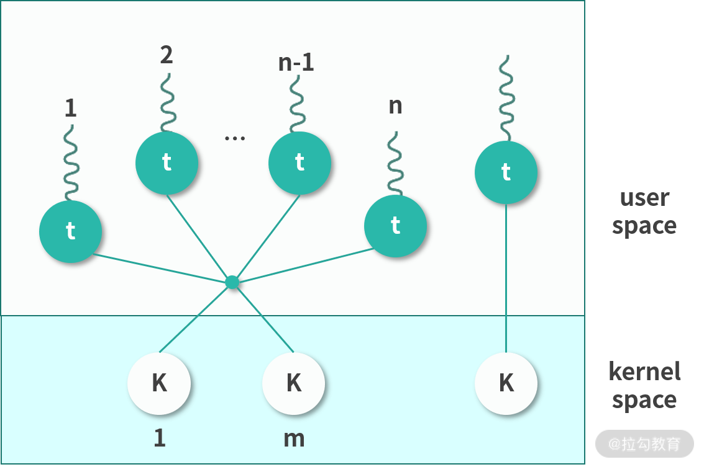

14 用户态和内核态：用户态线程和内核态线程有什么区别？
============================

**这节课给你带来了一道非常经典的面试题目：用户态线程和内核态线程有什么区别**？

这是一个组合型的问题，由很多小问题组装而成，比如：

* 用户态和内核态是什么？
* 用户级线程和内核级线程是一个怎样的对应关系？
* 内核响应系统调用是一个怎样的过程？
* ……

而且这个问题还关联到了我们后面要学习的多线程、I/O 模型、网络优化等。 所以这是一道很不错的面试题目，它不是简单考某个概念，而是通过让求职者比较两种东西，从而考察你对知识整体的认知和理解。

今天就请你顺着这个问题，深入学习内核的工作机制，和我一起去理解用户态和内核态。

### 什么是用户态和内核态

Kernel 运行在超级权限模式（Supervisor Mode）下，所以拥有很高的权限。按照权限管理的原则，多数应用程序应该运行在最小权限下。因此，很多操作系统，将内存分成了两个区域：

* 内核空间（Kernal Space），这个空间只有内核程序可以访问；
* 用户空间（User Space），这部分内存专门给应用程序使用。

#### 用户态和内核态

用户空间中的代码被限制了只能使用一个局部的内存空间，我们说这些程序在**用户态（User Mode） **执行。内核空间中的代码可以访问所有内存，我们称这些程序在** 内核态（Kernal Mode）**执行。

#### 系统调用过程

如果用户态程序需要执行系统调用，就需要切换到内核态执行。下面我们来讲讲这个过程的原理。

如上图所示：内核程序执行在内核态（Kernal Mode），用户程序执行在用户态（User Mode）。当发生系统调用时，用户态的程序发起系统调用。因为系统调用中牵扯特权指令，用户态程序权限不足，因此会中断执行，也就是 Trap（Trap 是一种中断）。

发生中断后，当前 CPU 执行的程序会中断，跳转到中断处理程序。内核程序开始执行，也就是开始处理系统调用。内核处理完成后，主动触发 Trap，这样会再次发生中断，切换回用户态工作。关于中断，我们将在“**15 课时**”进行详细讨论。

### 线程模型

上面我们学习了用户态和内核态，接下来我们从进程和线程的角度进一步思考本课时开头抛出的问题。

#### 进程和线程

一个应用程序启动后会在内存中创建一个执行副本，这就是**进程**。Linux 的内核是一个 Monolithic Kernel（宏内核），因此可以看作一个进程。也就是开机的时候，磁盘的内核镜像被导入内存作为一个执行副本，成为内核进程。

进程可以分成用户态进程和内核态进程两类。用户态进程通常是应用程序的副本，内核态进程就是内核本身的进程。如果用户态进程需要申请资源，比如内存，可以通过系统调用向内核申请。**那么用户态进程如果要执行程序，是否也要向内核申请呢**？

程序在现代操作系统中并不是以进程为单位在执行，而是以一种轻量级进程（Light Weighted Process），也称作线程（Thread）的形式执行。

一个进程可以拥有多个线程。进程创建的时候，一般会有一个主线程随着进程创建而创建。

如果进程想要创造更多的线程，就需要思考一件事情，这个线程创建在用户态还是内核态。

你可能会问，难道不是用户态的进程创建用户态的线程，内核态的进程创建内核态的线程吗？

其实不是，进程可以通过 API 创建用户态的线程，也可以通过系统调用创建内核态的线程，接下来我们说说用户态的线程和内核态的线程。

#### 用户态线程

用户态线程也称作用户级线程（User Level Thread）。操作系统内核并不知道它的存在，它完全是在用户空间中创建。

用户级线程有很多优势，比如。

* **管理开销小**：创建、销毁不需要系统调用。
* **切换成本低**：用户空间程序可以自己维护，不需要走操作系统调度。

但是这种线程也有很多的缺点。

* **与内核协作成本高**：比如这种线程完全是用户空间程序在管理，当它进行 I/O 的时候，无法利用到内核的优势，需要频繁进行用户态到内核态的切换。
* **线程间协作成本高**：设想两个线程需要通信，通信需要 I/O，I/O 需要系统调用，因此用户态线程需要支付额外的系统调用成本。
* **无法利用多核优势**：比如操作系统调度的仍然是这个线程所属的进程，所以无论每次一个进程有多少用户态的线程，都只能并发执行一个线程，因此一个进程的多个线程无法利用多核的优势。
* **操作系统无法针对线程调度进行优化**：当一个进程的一个用户态线程阻塞（Block）了，操作系统无法及时发现和处理阻塞问题，它不会更换执行其他线程，从而造成资源浪费。

#### 内核态线程

内核态线程也称作内核级线程（Kernel Level Thread）。这种线程执行在内核态，可以通过系统调用创造一个内核级线程。

内核级线程有很多优势。

* **可以利用多核 CPU 优势**：内核拥有较高权限，因此可以在多个 CPU 核心上执行内核线程。
* **操作系统级优化**：内核中的线程操作 I/O 不需要进行系统调用；一个内核线程阻塞了，可以立即让另一个执行。

当然内核线程也有一些缺点。

* **创建成本高**：创建的时候需要系统调用，也就是切换到内核态。
* **扩展性差**：由一个内核程序管理，不可能数量太多。
* **切换成本较高**：切换的时候，也同样存在需要内核操作，需要切换内核态。

### 用户态线程和内核态线程之间的映射关系

线程简单理解，就是要执行一段程序。程序不会自发的执行，需要操作系统进行调度。**我们思考这样一个问题，如果有一个用户态的进程，它下面有多个线程。如果这个进程想要执行下面的某一个线程，应该如何做呢**？

这时，比较常见的一种方式，就是将需要执行的程序，让一个内核线程去执行。毕竟，内核线程是真正的线程。因为它会分配到 CPU 的执行资源。

如果一个进程所有的线程都要自己调度，相当于在进程的主线程中实现分时算法调度每一个线程，也就是所有线程都用操作系统分配给主线程的时间片段执行。这种做法，相当于操作系统调度进程的主线程；进程的主线程进行二级调度，调度自己内部的线程。

这样操作劣势非常明显，比如无法利用多核优势，每个线程调度分配到的时间较少，而且这种线程在阻塞场景下会直接交出整个进程的执行权限。

由此可见，**用户态线程创建成本低，问题明显，不可以利用多核。内核态线程，创建成本高，可以利用多核，切换速度慢**。因此通常我们会在内核中预先创建一些线程，并反复利用这些线程。这样，用户态线程和内核态线程之间就构成了下面 4 种可能的关系：

#### 多对一（Many to One）

用户态进程中的多线程复用一个内核态线程。这样，极大地减少了创建内核态线程的成本，但是线程不可以并发。因此，这种模型现在基本上用的很少。我再多说一句，这里你可能会有疑问，比如：用户态线程怎么用内核态线程执行程序？

程序是存储在内存中的指令，用户态线程是可以准备好程序让内核态线程执行的。后面的几种方式也是利用这样的方法。

#### 一对一（One to One）

该模型为每个用户态的线程分配一个单独的内核态线程，在这种情况下，每个用户态都需要通过系统调用创建一个绑定的内核线程，并附加在上面执行。 这种模型允许所有线程并发执行，能够充分利用多核优势，Windows NT 内核采取的就是这种模型。但是因为线程较多，对内核调度的压力会明显增加。

#### 多对多（Many To Many）

这种模式下会为 n 个用户态线程分配 m 个内核态线程。m 通常可以小于 n。一种可行的策略是将 m 设置为核数。这种多对多的关系，减少了内核线程，同时也保证了多核心并发。Linux 目前采用的就是该模型。

#### 两层设计（Two Level）

这种模型混合了多对多和一对一的特点。多数用户态线程和内核线程是 n 对 m 的关系，少量用户线程可以指定成 1 对 1 的关系。

上图所展现的是一个非常经典的设计。

我们这节课讲解的问题、考虑到的情况以及解决方法，将为你今后解决实际工作场景中的问题打下坚实的基础。比如处理并发问题、I/O 性能瓶颈、思考数据库连接池的配置等，要想完美地解决问题，就必须掌握这些模型，了解问题的本质上才能更好地思考问题衍生出来的问题。

### 总结

这节课我们学习了用户态和内核态，然后我们简单学习了进程和线程的基础知识。这部分知识会在“**模块四：进程和线程**”中以更细粒度进行详细讲解。等你完成模块四的学习后，可以再返回来看这一节的内容，相信会有更深入的理解。

最后，我们还讨论了用户线程和内核线程的映射关系，这是一种非常经典的设计和思考方式。关于这个场景我们讨论了 1 对 1、1 对多以及多对 1，两层模型 4 种方法。日后你在处理线程池对接；远程 RPC 调用；消息队列时，还会反复用到今天的方法。**那么通过这节课的学习，你现在是否可以来回答本节关联的面试题目？用户态线程和内核态线程的区别？ **老规矩，请你先在脑海里构思下给面试官的表述，并把你的思考写在留言区，然后再来看我接下来的分析。** 【解析】** 用户态线程工作在用户空间，内核态线程工作在内核空间。用户态线程调度完全由进程负责，通常就是由进程的主线程负责。相当于进程主线程的延展，使用的是操作系统分配给进程主线程的时间片段。内核线程由内核维护，由操作系统调度。

用户态线程无法跨核心，一个进程的多个用户态线程不能并发，阻塞一个用户态线程会导致进程的主线程阻塞，直接交出执行权限。这些都是用户态线程的劣势。内核线程可以独立执行，操作系统会分配时间片段。因此内核态线程更完整，也称作轻量级进程。内核态线程创建成本高，切换成本高，创建太多还会给调度算法增加压力，因此不会太多。

实际操作中，往往结合两者优势，将用户态线程附着在内核态线程中执行。
