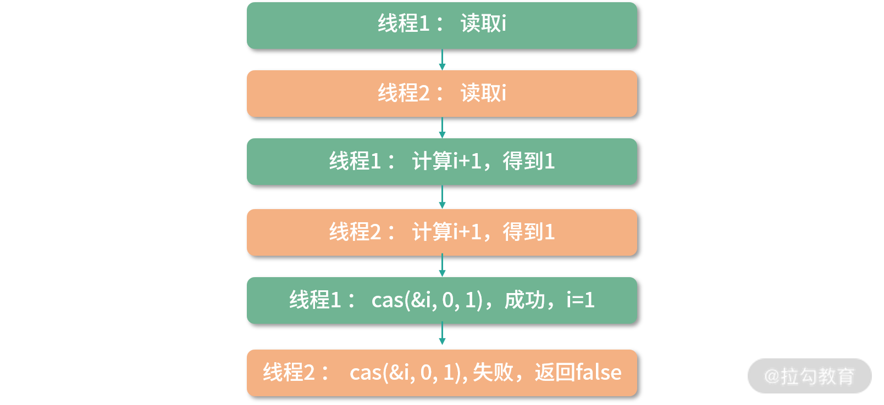

# 18 锁、信号量和分布式锁：如何控制同一时间只有 2 个线程运行？

锁是一个面试的热门话题，有乐观锁、悲观锁、重入锁、公平锁、分布式锁。有很多和锁相关的数据结构，比如说阻塞队列。还有一些关联的一些工具，比如说 Semaphore、Monitor 等。这些知识点可以关联很多的面试题目，比如：

- 锁是如何实现的？
- 如何控制同一时间只有 2 个线程运行？
- 如何实现分布式锁？

面试官通过这类题目考查你的这部分知识，就知道你对并发的理解是停留在表面，还是可以深入原理，去设计高并发的数据结构。这一讲我将帮你把锁类问题一网打尽。

### 原子操作

要想弄清楚锁，就要弄清楚锁的实现，实现锁需要底层提供的原子操作，因此我们先来学习下原子操作。

原子操作就是 **操作不可分** 。在多线程环境，一个原子操作的执行过程无法被中断。那么你可以思考下，具体原子操作的一个示例。

比如`i++`就不是一个原子操作，因为它是 3 个原子操作组合而成的：

1. 读取 i 的值；
1. 计算 i+1；
1. 写入新的值。

像这样的操作，在多线程 + 多核环境会造成 **竞争条件** 。

### 竞争条件

竞争条件就是说多个线程对一个资源（内存地址）的读写存在竞争，在这种条件下，最后这个资源的值不可预测，而是取决于竞争时具体的执行顺序。

举个例子，比如两个线程并发执行`i++`。那么可以有下面这个操作顺序，假设执行前`i=0`：


虽然上面的程序执行了两次`i++`，但最终i的值为 1。

`i++`这段程序访问了共享资源，也就是变量`i`，这种访问共享资源的程序片段我们称为 **临界区** 。在临界区，程序片段会访问共享资源，造成竞争条件，也就是共享资源的值最终取决于程序执行的时序，因此这个值不是确定的。

竞争条件是一件非常糟糕的事情，你可以把上面的程序想象成两个自动提款机。如果用户同时操作两个自动提款机，用户的余额就可能会被算错。

### 解决竞争条件

解决竞争条件有很多方案，一种方案就是不要让程序同时进入临界区，这个方案叫作 **互斥** 。还有一些方案旨在避免竞争条件，比如 ThreadLocal、 cas 指令以及 “ **19 讲** ”中我们要学习的乐观锁。

#### 避免临界区

不让程序同时进入临界区这个方案比较简单，核心就是我们给每个线程一个变量`i`，比如利用 ThreadLocal，这样线程之间就不存在竞争关系了。这样做优点很明显，缺点就是并不是所有的情况都允许你这样做。有一些资源是需要共享的，比如一个聊天室，如果每次用户请求都有一个单独的线程在处理，不可能为每个请求（线程）都维护一份聊天记录。

#### cas 指令

另一个方案是利用 CPU 的指令，让`i++`成为一个原子操作。 很多 CPU 都提供 Compare And Swap 指令。这个指令的作用是更新一个内存地址的值，比如把`i`更新为`i+1`，但是这个指令明确要求使用者必须确定知道内存地址中的值是多少。比如一个线程想把`i`从`100`更新到`101`，线程必须明确地知道现在`i`是 100，否则就会更新失败。

cas 可以用下面这个函数表示：

```
cas(&oldValue, expectedValue, targetValue)
```

这里我用的是伪代码，用`&`符号代表这里取内存地址。注意 cas 是 CPU 提供的原子操作。因此上面的比较和设置值的过程，是原子的，也就是不可分。

比如想用 cas 更新`i`的值，而且知道`i`是 100，想更新成`101`。那么就可以这样做：

```
cas(&i, 100, 101)
```

如果在这个过程中，有其他线程把`i`更新为`101`，这次调用会返回 false，否则返回 true。

所以`i++`程序可以等价的修改为：

```
// i++等价程序
cas(&i, i, i+1)
```

上面的程序执行时，其实是 3 条指令：

```
读取i 
计算i+1
cas操作：比较期望值i和i的真实值的值是否相等，如果是，更新目标值
```

假设`i=0`，考虑两个线程分别执行一次这个程序，尝试构造竞争条件：



你可以看到通过这种方式，cas 解决了一部分问题，找到了竞争条件，并返回了 false。但是还是无法计算出正确的结果。因为最后一次 cas 失败了。

如果要完全解决可以考虑这样去实现：

```
while(!cas(&i, i, i+1)){
  // 什么都不做
}
```

如果 cas 返回 false，那么会尝试再读一次 i 的值，直到 cas 成功。

#### tas 指令

还有一个方案是 tas 指令，有的 CPU 没有提供 cas（大部分服务器是提供的），提供一种 Test-And-Set 指令（tas）。tas 指令的目标是设置一个内存地址的值为 1，它的工作原理和 cas 相似。首先比较内存地址的数据和 1 的值，如果内存地址是 0，那么把这个地址置 1。如果是 1，那么失败。

所以你可以把 tas 看作一个特殊版的`cas`，可以这样来理解：

```
tas(&lock) {
  return cas(&lock, 0, 1)
}
```

#### 锁

锁（lock），目标是实现抢占（preempt）。就是只让给定数量的线程进入临界区。锁可以用`tas`或者`cas`来实现。

举个例子：如果希望同时只能有一个线程执行`i++`，伪代码可以这么写：

```
enter();
i++;
leave();
```

可以考虑用`cas`实现`enter`和`leave`函数，代码如下：

```
int lock = 0;
enter(){
  while( !cas(&lock, 0, 1) ) {
    // 什么也不做
  }
}
leave(){
  lock = 0;
}
```

多个线程竞争一个整数的 lock 变量，0 代表目前没有线程进入临界区，1 代表目前有线程进入临界区。利用`cas`原子指令我们可以对临界区进行管理。如果一个线程利用 cas 将 lock 设置为 1，那么另一个线程就会一直执行`cas`操作，直到锁被释放。

### 语言级锁的实现

上面解决竞争条件的时候，我们用到了锁。 相比 cas，锁是一种简单直观的模型。总体来说，cas 更底层，用 cas 解决问题优化空间更大。但是用锁解决问题，代码更容易写——进入临界区之前 lock，出去就 unlock。 从上面这段代码可以看出，为了定义锁，我们需要用到一个整型。如果实现得好，可以考虑这个整数由语言级定义。

比如考虑让用户传递一个变量过去：

```
int lock = 0;
enter(&lock);
//临界区代码
leave(&lock);
```

#### 自旋锁

上面我们已经用过自旋锁了，这是之前的代码：

```
enter(){
  while( !cas(&lock, 0, 1) ) {
    // 什么也不做
  }
}
```

这段代码不断在 CPU 中执行指令，直到锁被其他线程释放。这种情况线程不会主动释放资源，我们称为 **自旋锁** 。自旋锁的优点就是不会主动发生 Context Switch，也就是线程切换，因为线程切换比较消耗时间。 **自旋锁** 缺点也非常明显，比较消耗 CPU 资源。如果自旋锁一直拿不到锁，会一直执行。

#### wait 操作

你可以考虑实现一个 wait 操作，主动触发 Context Switch。这样就解决了 CPU 消耗的问题。但是触发 Context Switch 也是比较消耗成本的事情，那么有没有更好的方法呢？

```
enter(){
  while( !cas(&lock, 0, 1) ) {
    // sleep(1000ms);
    wait();
  }
}
```

你可以看下上面的代码，这里有一个更好的方法：就是 cas 失败后，马上调用`sleep`方法让线程休眠一段时间。但是这样，可能会出现锁已经好了，但是还需要多休眠一小段时间的情况，影响计算效率。

另一个方案，就是用`wait`方法，等待一个信号——直到另一个线程调用`notify`方法，通知这个线程结束休眠。但是这种情况——wait 和 notify 的模型要如何实现呢？

#### 生产者消费者模型

一个合理的实现就是生产者消费者模型。 wait 是一个生产者，将当前线程挂到一个等待队列上，并休眠。notify 是一个消费者，从等待队列中取出一个线程，并重新排队。

如果使用这个模型，那么我们之前简单用`enter`和`leave`来封装加锁和解锁的模式，就需要变化。我们需要把``` enter``leave``wait``notify ```的逻辑都封装起来，不让用户感知到它们的存在。

比如 Java 语言，Java 为每个对象增加了一个 Object Header 区域，里面一个锁的位（bit），锁并不需要一个 32 位整数，一个 bit 足够。下面的代码用户使用 synchronized 关键字让临界区访问互斥。

```
synchronized(obj){// enter
  // 临界区代码
} // leave
```

synchronized 关键字的内部实现，用到了封装好的底层代码——Monitor 对象。每个 Java 对象都关联了一个 Monitor 对象。Monitor 封装了对锁的操作，比如 enter、leave 的调用，这样简化了 Java 程序员的心智负担，你只需要调用 synchronized 关键字。

另外，Monitor 实现了生产者、消费者模型。

- 如果一个线程拿到锁，那么这个线程继续执行；
- 如果一个线程竞争锁失败，Montior 就调用 wait 方法触发生产者的逻辑，把线程加入等待集合；
- 如果一个线程执行完成，Monitor 就调用一次 notify 方法恢复一个等待的线程。

这样，Monitor 除了提供了互斥，还提供了线程间的通信，避免了使用自旋锁，还简化了程序设计。

#### 信号量

接下来介绍一个叫作信号量的方法，你可以把它看作是互斥的一个广义版。我们考虑一种更加广义的锁，这里请你思考如何同时允许 N 个线程进入临界区呢？

我们先考虑实现一个基础的版本，用一个整数变量`lock`来记录进入临界区线程的数量。

```
int lock = 0;
enter(){
  while(lock++ > 2) { }
}
leave(){
  lock--;
}
```

上面的代码具有一定的欺骗性，没有考虑到 **竞争条件** ，执行的时候会出问题，可能会有超过2个线程同时进入临界区。

下面优化一下，作为一个考虑了竞争条件的版本：

```
up(&lock){
  while(!cas(&lock, lock, lock+1)) { }
}
down(&lock){
  while(!cas(&lock, lock, lock - 1) || lock == 0){}
}
```

为了简化模型，我们重新设计了两个原子操作`up`和`down`。`up`将`lock`增 1，`down`将`lock`减 1。当 lock 为 0 时，如果还在`down`那么会自旋。考虑用多个线程同时执行下面这段程序：

```
int lock = 2;
down(&lock);
// 临界区
up(&lock);
```

如果只有一个线程在临界区，那么`lock`等于 1，第 2 个线程还可以进入。 如果两个线程在临界区，第 3 个线程尝试`down`的时候，会陷入自旋锁。当然我们也可以用其他方式来替代自旋锁，比如让线程休眠。

当`lock`初始值为 1 的时候，这个模型就是实现 **互斥（mutex）** 。如果 lock 大于 1，那么就是同时允许多个线程进入临界区。这种方法，我们称为 **信号量（semaphore）** 。

#### 信号量实现生产者消费者模型

信号量可以用来实现生产者消费者模型。下面我们通过一段代码实现生产者消费者：

```
int empty = N; // 当前空位置数量
int mutex = 1; // 锁
int full = 0; // 当前的等待的线程数
wait(){
  down(&empty);
  down(&mutex);
  insert(); 
  up(&mutex);
  up(&full);
}
notify(){
  down(&full);
  down(&mutex);
  remove(); 
  up(&mutex);
  up(&empty)
}
insert(){
  wait_queue.add(currentThread);
  yield();
}
remove(){
  thread = wait_queue.dequeue();
  thread.resume();
}
```

代码中 wait 是生产者，notify 是消费者。 每次`wait`操作减少一个空位置数量，empty-1；增加一个等待的线程，full+1。每次`notify`操作增加一个空位置，empty+1，减少一个等待线程，full-1。

`insert`和`remove`方法是互斥的操作，需要用另一个 mutex 锁来保证。`insert`方法将当前线程加入等待队列，并且调用 yield 方法，交出当前线程的控制权，当前线程休眠。`remove`方法从等待队列中取出一个线程，并且调用`resume`进行恢复。以上， 就构成了一个简单的生产者消费者模型。

### 死锁问题

另外就是在并行的时候，如果两个线程互相等待对方获得的锁，就会发生死锁。你可以把死锁理解成一个环状的依赖关系。比如：

```
int lock1 = 0;
int lock2 = 0;
// 线程1
enter(&lock1);
enter(&lock2);
leave(&lock1);
leave(&lock2);
// 线程2
enter(&lock2);
enter(&lock1);
leave(&lock1);
leave(&lock2)
```

上面的程序，如果是按照下面这个顺序执行，就会死锁：

```
线程1： enter(&lock1);
线程2： enter(&lock2);
线程1： enter(&lock2)
线程2:  enter(&lock1)
// 死锁发生，线程1、2陷入等待
```

上面程序线程 1 获得了`lock1`，线程 2 获得了`lock2`。接下来线程 1 尝试获得`lock2`，线程 2 尝试获得`lock1`，于是两个线程都陷入了等待。这个等待永远都不会结束，我们称之为 **死锁** 。

关于死锁如何解决，我们会在“ **21 | 哲学家就餐问题：什么情况下会触发饥饿和死锁** ？”讨论。这里我先讲一种最简单的解决方案，你可以尝试让两个线程对锁的操作顺序相同，这样就可以避免死锁问题。

### 分布式环境的锁

最后，我们留一点时间给分布式锁。我们之前讨论了非常多的实现，是基于多个线程访问临界区。现在要考虑一个更庞大的模型，我们有 100 个容器，每一个里面有一个为用户 **减少积分** 的服务。

简化下模型，假设积分存在 Redis 中。当然数据库中也有，但是我们只考虑 Redis。使用 Redis，我们目标是给数据库减负。

假设这个接口可以看作 3 个原子操作：

1. 从 Redis 读出当前库存；
1. 计算库存 -1；
1. 更新 Redis 库存。

和`i++`类似，很明显，当用户并发的访问这个接口，是会发生竞争条件的。 因为程序已经不是在同一台机器上执行了，解决方案就是 **分布式锁** 。实现锁，我们需要原子操作。

在单机多线程并发的场景下，原子操作由 CPU 指令提供，比如 cas 和 tas 指令。那么在分布式环境下，原子操作由谁提供呢？

有很多工具都可以提供分布式的原子操作，比如 Redis 的 setnx 指令，Zookeeper 的节点操作等等。作为操作系统课程，这部分我不再做进一步的讲解。这里是从多线程的处理方式，引出分布式的处理方式，通过两个类比，帮助你提高。如果你感兴趣，可以自己查阅更多的分布式锁的资料。

### 总结

**那么通过这节课的学习，你现在可以尝试来回答本讲关联的面试题目：如何控制同一时间只有 2 个线程运行？** 老规矩，请你先在脑海里构思下给面试官的表述，并把你的思考写在留言区，然后再来看我接下来的分析。 **【解析】** 同时控制两个线程进入临界区，一种方式可以考虑用信号量（semaphore）。

另一种方式是考虑生产者、消费者模型。想要进入临界区的线程先在一个等待队列中等待，然后由消费者每次消费两个。这种实现方式，类似于实现一个线程池，所以也可以考虑实现一个 ThreadPool 类，然后再实现一个调度器类，最后实现一个每次选择两个线程执行的调度算法。
